# CDP API端点

<cite>
**本文引用的文件**
- [README.md](file://README.md)
- [cdp-proxy.mjs](file://scripts/cdp-proxy.mjs)
- [cdp-api.md](file://references/cdp-api.md)
- [check-deps.mjs](file://scripts/check-deps.mjs)
- [SKILL.md](file://SKILL.md)
- [package.json](file://package.json)
- [filter-rules.json](file://config/filter-rules.json)
- [candidates.json](file://data/candidates.json)
</cite>

## 目录
1. [简介](#简介)
2. [项目结构](#项目结构)
3. [核心组件](#核心组件)
4. [架构概览](#架构概览)
5. [详细组件分析](#详细组件分析)
6. [依赖分析](#依赖分析)
7. [性能考虑](#性能考虑)
8. [故障排除指南](#故障排除指南)
9. [结论](#结论)
10. [附录](#附录)

## 简介
本文档为CDP代理的所有HTTP API端点创建详细的API文档。CDP代理通过HTTP API操控用户日常Chrome浏览器，提供完整的浏览器自动化能力。该代理通过WebSocket直连Chrome（兼容chrome://inspect方式），无需命令行参数启动，天然携带用户登录态，支持动态页面、交互操作、视频截帧等功能。

CDP代理的核心特性包括：
- 直连用户日常Chrome，天然携带登录态
- 支持动态页面、交互操作、视频截帧
- 三种点击方式：/click（JS点击）、/clickAt（CDP真实鼠标事件）、/setFiles（文件上传）
- 本地Chrome书签/历史检索
- 并行分治，多目标时分发子Agent并行执行
- 站点经验积累，按域名存储操作经验

## 项目结构
该项目采用模块化设计，主要包含以下核心组件：

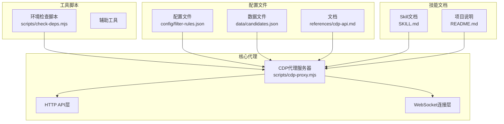

**图表来源**
- [cdp-proxy.mjs:1-602](file://scripts/cdp-proxy.mjs#L1-L602)
- [check-deps.mjs:1-172](file://scripts/check-deps.mjs#L1-L172)
- [cdp-api.md:1-107](file://references/cdp-api.md#L1-L107)

**章节来源**
- [README.md:104-137](file://README.md#L104-L137)
- [SKILL.md:34-86](file://SKILL.md#L34-L86)

## 核心组件
CDP代理由以下核心组件构成：

### HTTP服务器组件
- **端口配置**：默认端口3456，可通过CDP_PROXY_PORT环境变量自定义
- **请求处理**：基于Node.js原生HTTP模块，支持异步请求处理
- **响应格式**：统一JSON格式，UTF-8编码

### WebSocket连接组件
- **Chrome连接**：自动发现Chrome调试端口（DevToolsActivePort文件或常见端口）
- **会话管理**：维护targetId到sessionId的映射关系
- **反风控机制**：拦截页面对Chrome调试端口的探测请求

### CDP命令组件
- **命令队列**：维护pending命令映射，支持超时控制
- **会话管理**：自动创建和管理CDP会话
- **错误处理**：统一的异常捕获和错误响应

**章节来源**
- [cdp-proxy.mjs:13-33](file://scripts/cdp-proxy.mjs#L13-L33)
- [cdp-proxy.mjs:113-200](file://scripts/cdp-proxy.mjs#L113-L200)
- [cdp-proxy.mjs:202-217](file://scripts/cdp-proxy.mjs#L202-L217)

## 架构概览
CDP代理采用分层架构设计，各层职责明确：

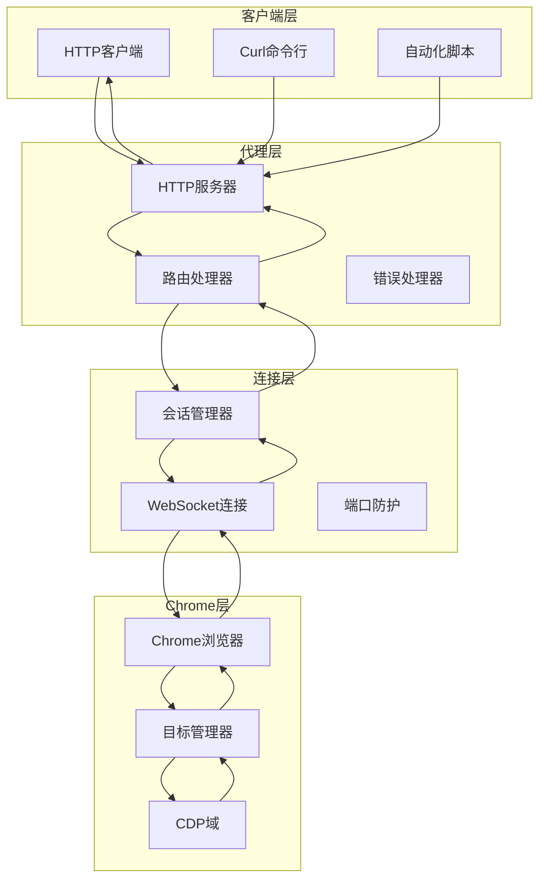

**图表来源**
- [cdp-proxy.mjs:287-552](file://scripts/cdp-proxy.mjs#L287-L552)
- [cdp-proxy.mjs:113-200](file://scripts/cdp-proxy.mjs#L113-L200)
- [cdp-proxy.mjs:222-248](file://scripts/cdp-proxy.mjs#L222-L248)

## 详细组件分析

### /health 健康检查端点
健康检查端点提供CDP代理的运行状态信息。

**HTTP规范**
- 方法：GET
- URL：/health
- 查询参数：无
- 请求体：无
- 响应：JSON格式的状态信息

**响应结构**
```json
{
  "status": "ok",
  "connected": true,
  "sessions": 5,
  "chromePort": 9222
}
```

**使用示例**
```bash
curl -s http://localhost:3456/health
```

**错误处理**
- 无特定错误码，主要用于状态监控

**章节来源**
- [cdp-proxy.mjs:296-301](file://scripts/cdp-proxy.mjs#L296-L301)
- [cdp-api.md:12-16](file://references/cdp-api.md#L12-L16)

### /targets 目标管理端点
列出所有已打开的页面tab，返回Chrome中的所有目标信息。

**HTTP规范**
- 方法：GET
- URL：/targets
- 查询参数：无
- 请求体：无
- 响应：JSON数组，包含所有页面目标

**响应结构**
```json
[
  {
    "targetId": "ABC123",
    "type": "page",
    "title": "示例页面",
    "url": "https://example.com",
    "attached": true
  }
]
```

**使用示例**
```bash
curl -s http://localhost:3456/targets
```

**错误处理**
- 无特定错误码，CDP命令失败时返回通用500错误

**章节来源**
- [cdp-proxy.mjs:305-310](file://scripts/cdp-proxy.mjs#L305-L310)
- [cdp-api.md:18-22](file://references/cdp-api.md#L18-L22)

### /new 页面创建端点
创建新的后台tab，支持自动等待页面加载完成。

**HTTP规范**
- 方法：GET
- URL：/new?url=URL
- 查询参数：
  - url: 目标URL（可选，默认'about:blank'）
- 请求体：无
- 响应：JSON格式，包含新创建的targetId

**响应结构**
```json
{
  "targetId": "NEW_TARGET_ID"
}
```

**使用示例**
```bash
curl -s "http://localhost:3456/new?url=https://example.com"
```

**处理流程**
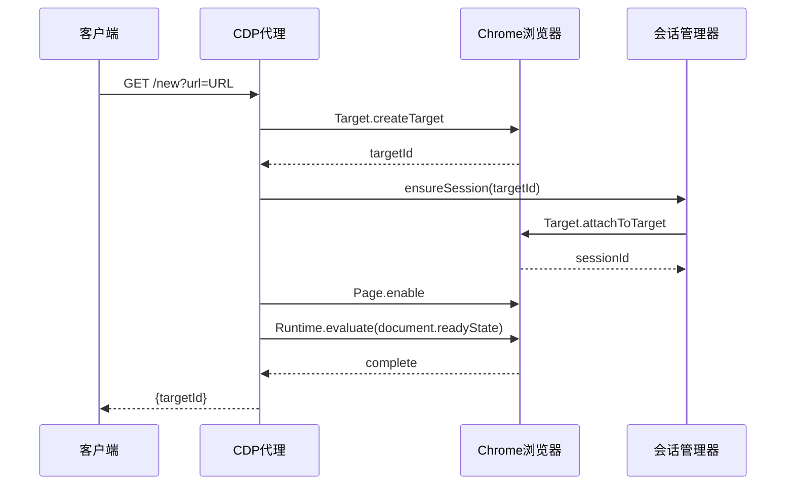

**图表来源**
- [cdp-proxy.mjs:312-327](file://scripts/cdp-proxy.mjs#L312-L327)
- [cdp-proxy.mjs:251-278](file://scripts/cdp-proxy.mjs#L251-L278)

**错误处理**
- CDP命令超时：返回500错误
- attach失败：返回400错误

**章节来源**
- [cdp-proxy.mjs:312-327](file://scripts/cdp-proxy.mjs#L312-L327)
- [cdp-api.md:24-28](file://references/cdp-api.md#L24-L28)

### /close 页面关闭端点
关闭指定的tab。

**HTTP规范**
- 方法：GET
- URL：/close?target=ID
- 查询参数：
  - target: 目标tab的targetId（必需）
- 请求体：无
- 响应：CDP命令的标准响应

**使用示例**
```bash
curl -s "http://localhost:3456/close?target=TARGET_ID"
```

**处理流程**
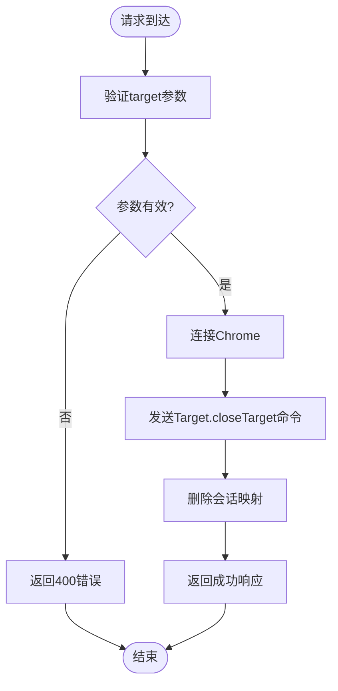

**图表来源**
- [cdp-proxy.mjs:329-334](file://scripts/cdp-proxy.mjs#L329-L334)

**错误处理**
- 缺少target参数：返回400错误
- CDP命令失败：返回500错误

**章节来源**
- [cdp-proxy.mjs:329-334](file://scripts/cdp-proxy.mjs#L329-L334)
- [cdp-api.md:30-34](file://references/cdp-api.md#L30-L34)

### /navigate 页面导航端点
在已有tab中导航到新URL，自动等待页面加载完成。

**HTTP规范**
- 方法：GET
- URL：/navigate?target=ID&url=URL
- 查询参数：
  - target: 目标tab的targetId（必需）
  - url: 目标URL（必需）
- 请求体：无
- 响应：导航结果

**使用示例**
```bash
curl -s "http://localhost:3456/navigate?target=ID&url=https://example.com"
```

**处理流程**
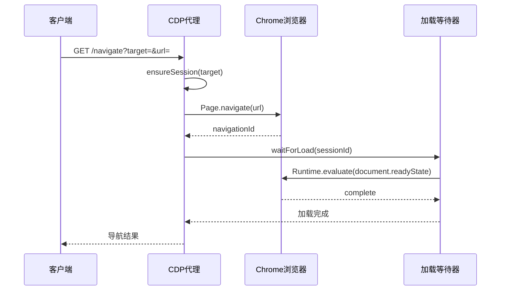

**图表来源**
- [cdp-proxy.mjs:336-345](file://scripts/cdp-proxy.mjs#L336-L345)
- [cdp-proxy.mjs:251-278](file://scripts/cdp-proxy.mjs#L251-L278)

**错误处理**
- 缺少必需参数：返回400错误
- 页面加载超时：返回500错误

**章节来源**
- [cdp-proxy.mjs:336-345](file://scripts/cdp-proxy.mjs#L336-L345)
- [cdp-api.md:36-40](file://references/cdp-api.md#L36-L40)

### /back 后退操作端点
在指定tab中执行后退操作。

**HTTP规范**
- 方法：GET
- URL：/back?target=ID
- 查询参数：
  - target: 目标tab的targetId（必需）
- 请求体：无
- 响应：JSON格式，包含操作状态

**使用示例**
```bash
curl -s "http://localhost:3456/back?target=ID"
```

**处理流程**
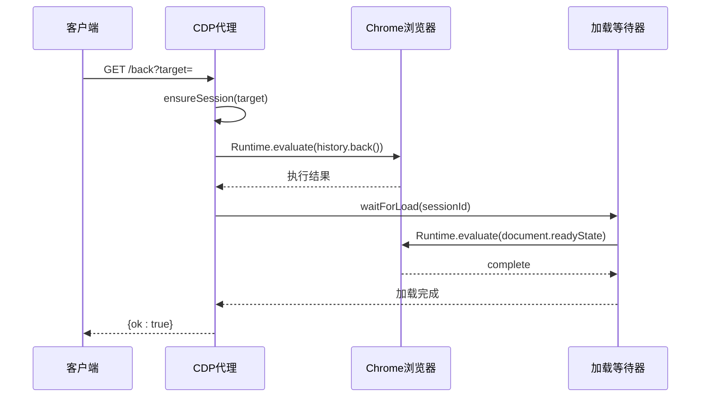

**图表来源**
- [cdp-proxy.mjs:347-353](file://scripts/cdp-proxy.mjs#L347-L353)
- [cdp-proxy.mjs:251-278](file://scripts/cdp-proxy.mjs#L251-L278)

**错误处理**
- 缺少target参数：返回400错误
- 执行失败：返回500错误

**章节来源**
- [cdp-proxy.mjs:347-353](file://scripts/cdp-proxy.mjs#L347-L353)
- [cdp-api.md:42-46](file://references/cdp-api.md#L42-L46)

### /info 页面信息获取端点
获取页面的基础信息，包括标题、URL和readyState。

**HTTP规范**
- 方法：GET
- URL：/info?target=ID
- 查询参数：
  - target: 目标tab的targetId（必需）
- 请求体：无
- 响应：JSON格式的页面信息

**响应结构**
```json
{
  "title": "页面标题",
  "url": "https://example.com",
  "ready": "complete"
}
```

**使用示例**
```bash
curl -s "http://localhost:3456/info?target=ID"
```

**处理流程**
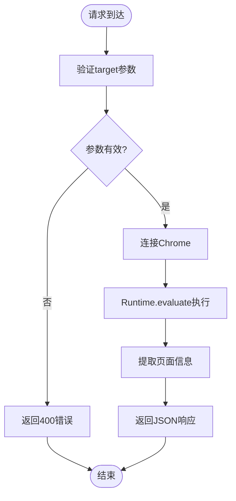

**图表来源**
- [cdp-proxy.mjs:519-527](file://scripts/cdp-proxy.mjs#L519-L527)

**错误处理**
- 缺少target参数：返回400错误
- 执行异常：返回500错误

**章节来源**
- [cdp-proxy.mjs:519-527](file://scripts/cdp-proxy.mjs#L519-L527)
- [cdp-api.md:48-52](file://references/cdp-api.md#L48-L52)

### /eval 代码执行端点
执行JavaScript表达式，支持任意复杂逻辑。

**HTTP规范**
- 方法：POST
- URL：/eval?target=ID
- 查询参数：
  - target: 目标tab的targetId（必需）
- 请求体：JSON格式的JavaScript表达式
- 响应：执行结果或错误信息

**响应结构**
```json
{
  "value": "执行结果"
}
```

**使用示例**
```bash
curl -s -X POST "http://localhost:3456/eval?target=ID" -d 'document.title'
```

**处理流程**
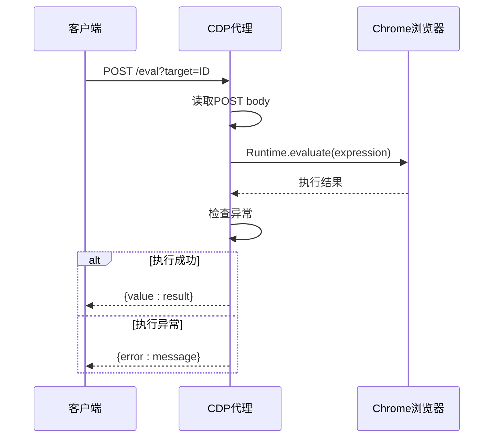

**图表来源**
- [cdp-proxy.mjs:355-373](file://scripts/cdp-proxy.mjs#L355-L373)

**错误处理**
- 缺少target参数：返回400错误
- JavaScript执行异常：返回400错误
- CDP命令超时：返回500错误

**章节来源**
- [cdp-proxy.mjs:355-373](file://scripts/cdp-proxy.mjs#L355-L373)
- [cdp-api.md:54-58](file://references/cdp-api.md#L54-L58)

### /click 点击操作端点
通过JS层面点击元素，支持自动滚动到可视区域。

**HTTP规范**
- 方法：POST
- URL：/click?target=ID
- 查询参数：
  - target: 目标tab的targetId（必需）
- 请求体：CSS选择器字符串
- 响应：点击结果信息

**响应结构**
```json
{
  "clicked": true,
  "tag": "BUTTON",
  "text": "按钮文本..."
}
```

**使用示例**
```bash
curl -s -X POST "http://localhost:3456/click?target=ID" -d 'button.submit'
```

**处理流程**
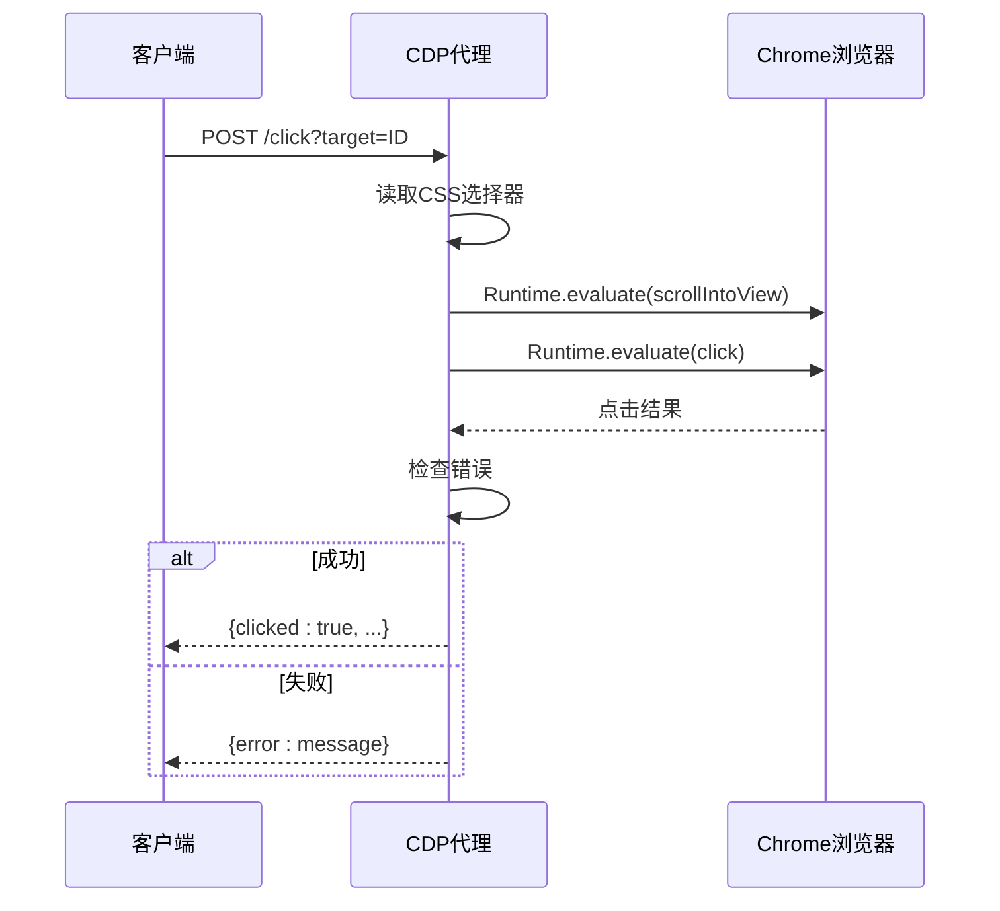

**图表来源**
- [cdp-proxy.mjs:375-409](file://scripts/cdp-proxy.mjs#L375-L409)

**错误处理**
- 缺少CSS选择器：返回400错误
- 元素未找到：返回400错误
- CDP命令超时：返回500错误

**章节来源**
- [cdp-proxy.mjs:375-409](file://scripts/cdp-proxy.mjs#L375-L409)
- [cdp-api.md:60-64](file://references/cdp-api.md#L60-L64)

### /clickAt 真实鼠标点击端点
通过CDP浏览器级真实鼠标点击，模拟真实的用户手势。

**HTTP规范**
- 方法：POST
- URL：/clickAt?target=ID
- 查询参数：
  - target: 目标tab的targetId（必需）
- 请求体：CSS选择器字符串
- 响应：点击坐标和结果信息

**响应结构**
```json
{
  "clicked": true,
  "x": 100,
  "y": 200,
  "tag": "BUTTON",
  "text": "按钮文本..."
}
```

**使用示例**
```bash
curl -s -X POST "http://localhost:3456/clickAt?target=ID" -d 'button.upload'
```

**处理流程**
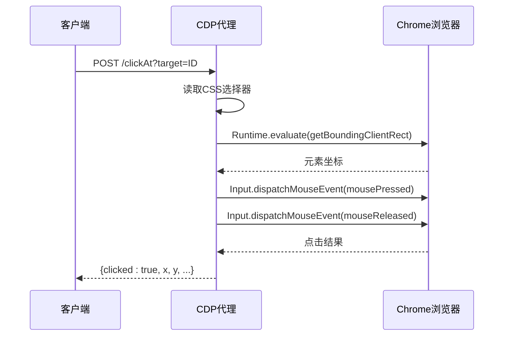

**图表来源**
- [cdp-proxy.mjs:411-446](file://scripts/cdp-proxy.mjs#L411-L446)

**错误处理**
- 缺少CSS选择器：返回400错误
- 元素未找到：返回400错误
- CDP命令超时：返回500错误

**章节来源**
- [cdp-proxy.mjs:411-446](file://scripts/cdp-proxy.mjs#L411-L446)
- [cdp-api.md:66-70](file://references/cdp-api.md#L66-L70)

### /setFiles 文件上传端点
给file input设置本地文件路径，完全绕过文件对话框。

**HTTP规范**
- 方法：POST
- URL：/setFiles?target=ID
- 查询参数：
  - target: 目标tab的targetId（必需）
- 请求体：JSON格式，包含selector和files数组
- 响应：上传结果信息

**请求体格式**
```json
{
  "selector": "input[type=file]",
  "files": ["/path/to/file1.png", "/path/to/file2.png"]
}
```

**响应结构**
```json
{
  "success": true,
  "files": 2
}
```

**使用示例**
```bash
curl -s -X POST "http://localhost:3456/setFiles?target=ID" -d '{"selector":"input[type=file]","files":["/path/to/file.png"]}'
```

**处理流程**
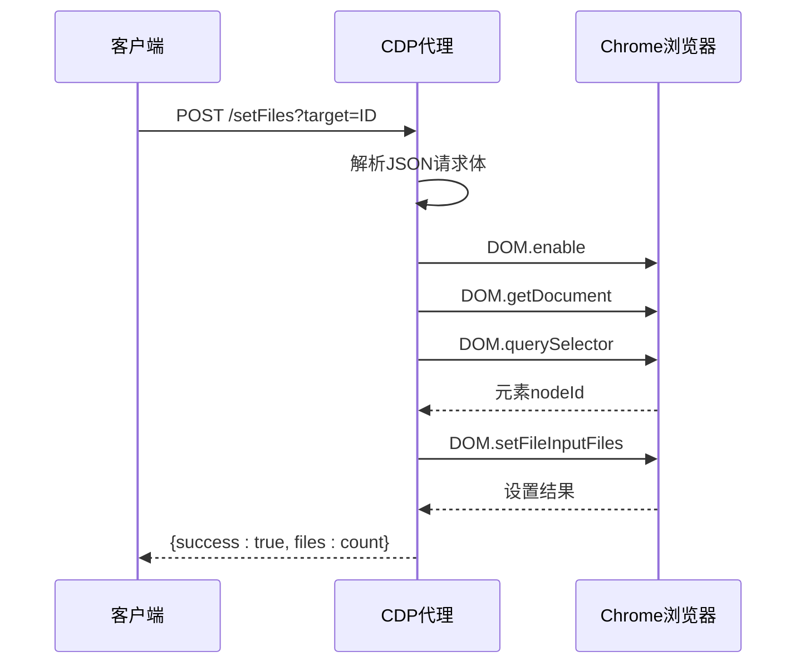

**图表来源**
- [cdp-proxy.mjs:448-476](file://scripts/cdp-proxy.mjs#L448-L476)

**错误处理**
- 缺少selector或files：返回400错误
- 元素未找到：返回400错误
- CDP命令超时：返回500错误

**章节来源**
- [cdp-proxy.mjs:448-476](file://scripts/cdp-proxy.mjs#L448-L476)
- [cdp-api.md:72-76](file://references/cdp-api.md#L72-L76)

### /scroll 页面滚动端点
滚动页面，支持多种滚动方向和距离。

**HTTP规范**
- 方法：GET
- URL：/scroll?target=ID&y=3000&direction=down
- 查询参数：
  - target: 目标tab的targetId（必需）
  - y: 滚动距离（像素，可选，默认3000）
  - direction: 滚动方向（可选，默认'down'）
- 请求体：无
- 响应：滚动结果信息

**可选参数**
- direction: down（向下）、up（向上）、top（顶部）、bottom（底部）
- y: 数值，表示滚动像素距离

**使用示例**
```bash
curl -s "http://localhost:3456/scroll?target=ID&y=3000"
curl -s "http://localhost:3456/scroll?target=ID&direction=bottom"
```

**处理流程**
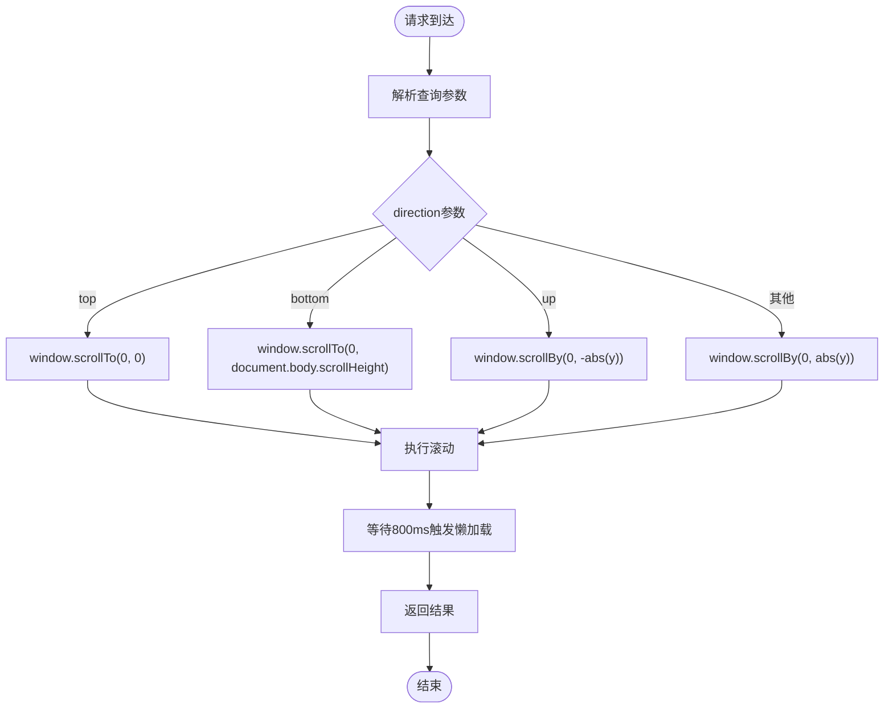

**图表来源**
- [cdp-proxy.mjs:478-500](file://scripts/cdp-proxy.mjs#L478-L500)

**错误处理**
- 缺少target参数：返回400错误
- CDP命令超时：返回500错误

**章节来源**
- [cdp-proxy.mjs:478-500](file://scripts/cdp-proxy.mjs#L478-L500)
- [cdp-api.md:78-83](file://references/cdp-api.md#L78-L83)

### /screenshot 截图功能端点
截图页面，支持保存到本地文件或返回二进制数据。

**HTTP规范**
- 方法：GET
- URL：/screenshot?target=ID&file=/tmp/shot.png&format=png
- 查询参数：
  - target: 目标tab的targetId（必需）
  - file: 保存文件路径（可选）
  - format: 图片格式（可选，默认'png'）
- 请求体：无
- 响应：JSON格式或图片二进制数据

**响应格式**
- 指定file参数：返回JSON {saved: file_path}
- 未指定file参数：返回图片二进制数据，Content-Type为image/png或image/jpeg

**使用示例**
```bash
curl -s "http://localhost:3456/screenshot?target=ID&file=/tmp/shot.png"
```

**处理流程**
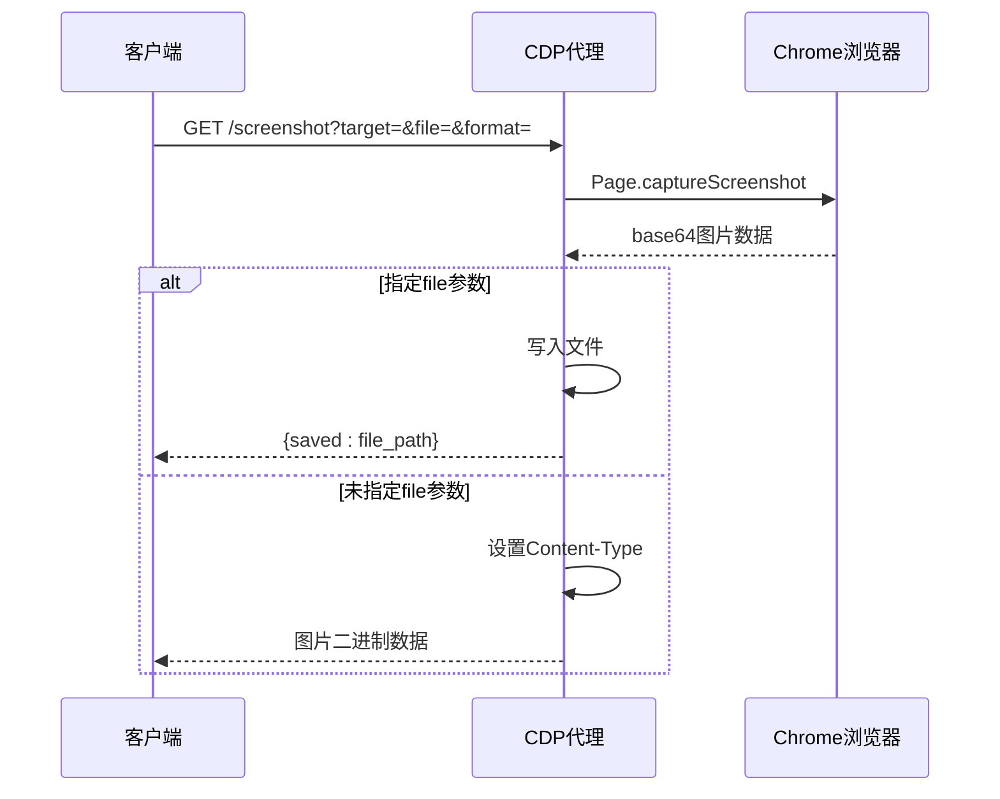

**图表来源**
- [cdp-proxy.mjs:502-517](file://scripts/cdp-proxy.mjs#L502-L517)

**错误处理**
- 缺少target参数：返回400错误
- CDP命令超时：返回500错误

**章节来源**
- [cdp-proxy.mjs:502-517](file://scripts/cdp-proxy.mjs#L502-L517)
- [cdp-api.md:85-89](file://references/cdp-api.md#L85-L89)

## 依赖分析

### 组件间依赖关系
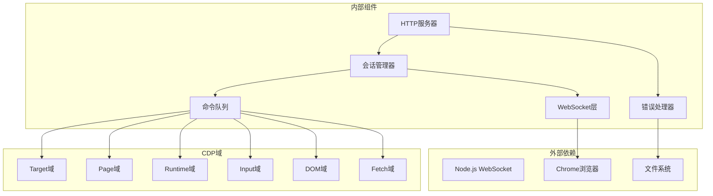

**图表来源**
- [cdp-proxy.mjs:6-11](file://scripts/cdp-proxy.mjs#L6-L11)
- [cdp-proxy.mjs:202-217](file://scripts/cdp-proxy.mjs#L202-L217)

### 端点调用依赖关系
```mermaid
graph LR
subgraph "基础操作"
Health[/health]
Targets[/targets]
end
subgraph "页面管理"
New[/new]
Close[/close]
Navigate[/navigate]
Back[/back]
Info[/info]
end
subgraph "交互操作"
Eval[/eval]
Click[/click]
ClickAt[/clickAt]
SetFiles[/setFiles]
Scroll[/scroll]
Screenshot[/screenshot]
end
Health --> Targets
Targets --> New
New --> Navigate
Navigate --> Back
Back --> Info
Info --> Eval
Eval --> Click
Click --> ClickAt
ClickAt --> SetFiles
SetFiles --> Scroll
Scroll --> Screenshot
```

**图表来源**
- [cdp-proxy.mjs:296-552](file://scripts/cdp-proxy.mjs#L296-L552)

**章节来源**
- [cdp-proxy.mjs:13-33](file://scripts/cdp-proxy.mjs#L13-L33)
- [cdp-proxy.mjs:202-217](file://scripts/cdp-proxy.mjs#L202-L217)

## 性能考虑
CDP代理在设计时充分考虑了性能和可靠性：

### 连接管理
- **连接复用**：WebSocket连接建立后长期复用，避免频繁重建
- **自动发现**：智能发现Chrome调试端口，支持多种平台路径
- **端口探测**：使用TCP探测避免WebSocket连接触发Chrome安全弹窗

### 命令执行优化
- **超时控制**：CDP命令默认30秒超时，防止长时间阻塞
- **并发限制**：通过pending命令映射控制并发数量
- **会话缓存**：缓存targetId到sessionId映射，避免重复attach

### 内存管理
- **垃圾回收**：及时清理超时的pending命令
- **会话清理**：关闭tab时自动清理相关会话映射
- **资源释放**：连接断开时清理所有缓存数据

### 网络优化
- **二进制传输**：截图使用base64编码，减少网络传输开销
- **条件响应**：根据请求参数选择合适的响应格式
- **压缩支持**：支持gzip压缩（通过HTTP层自动处理）

**章节来源**
- [cdp-proxy.mjs:113-200](file://scripts/cdp-proxy.mjs#L113-L200)
- [cdp-proxy.mjs:202-217](file://scripts/cdp-proxy.mjs#L202-L217)
- [cdp-proxy.mjs:554-562](file://scripts/cdp-proxy.mjs#L554-L562)

## 故障排除指南

### 常见错误类型

| 错误类型 | HTTP状态码 | 错误原因 | 解决方案 |
|----------|------------|----------|----------|
| Chrome未连接 | 500 | Chrome未开启远程调试端口 | 按README说明启用远程调试 |
| 附加失败 | 400 | targetId无效或tab已关闭 | 使用/targets获取最新列表 |
| 命令超时 | 500 | 页面长时间未响应 | 检查tab状态或重试 |
| 端口占用 | 500 | 另一个proxy已在运行 | 系统会自动复用现有实例 |

### 环境检查
使用环境检查脚本确保所有依赖都已正确配置：

```bash
node "${CLAUDE_SKILL_DIR}/scripts/check-deps.mjs"
```

**检查内容**
- Node.js版本（建议22+）
- Chrome调试端口检测
- CDP代理连接状态
- 依赖项完整性

### 调试技巧
1. **查看代理日志**：检查临时目录中的cdp-proxy.log文件
2. **验证Chrome授权**：确保Chrome已允许远程调试
3. **测试基本连接**：使用/cdp-proxy.mjs的/health端点
4. **检查目标列表**：使用/targets端点确认tab状态

### 性能监控
- **连接状态**：定期调用/health端点监控代理状态
- **会话数量**：关注sessions字段了解当前活动tab数量
- **命令延迟**：监控CDP命令执行时间

**章节来源**
- [cdp-api.md:99-107](file://references/cdp-api.md#L99-L107)
- [check-deps.mjs:143-172](file://scripts/check-deps.mjs#L143-L172)
- [README.md:104-117](file://README.md#L104-L117)

## 结论
CDP代理提供了完整的浏览器自动化解决方案，通过HTTP API简化了复杂的CDP协议使用。该代理的主要优势包括：

1. **易用性**：提供简洁的HTTP API，无需深入了解CDP协议
2. **可靠性**：完善的错误处理和重试机制
3. **安全性**：内置反风控机制，保护用户隐私
4. **扩展性**：模块化设计，易于添加新功能

对于开发者而言，CDP代理是一个强大的工具，可以轻松实现各种浏览器自动化任务，从简单的页面导航到复杂的表单填写和数据提取。

## 附录

### 端点完整列表
- **/health** - 健康检查
- **/targets** - 列出所有页面tab
- **/new** - 创建新后台tab
- **/close** - 关闭tab
- **/navigate** - 页面导航
- **/back** - 后退操作
- **/info** - 获取页面信息
- **/eval** - 执行JavaScript
- **/click** - JS点击操作
- **/clickAt** - 真实鼠标点击
- **/setFiles** - 文件上传
- **/scroll** - 页面滚动
- **/screenshot** - 截图功能

### 配置选项
- **端口**：默认3456，可通过CDP_PROXY_PORT环境变量修改
- **超时**：CDP命令默认30秒超时
- **格式**：所有响应均为JSON格式

### 相关文件
- **配置文件**：config/filter-rules.json（评分规则）
- **数据文件**：data/candidates.json（候选人数据）
- **文档**：references/cdp-api.md（API参考文档）