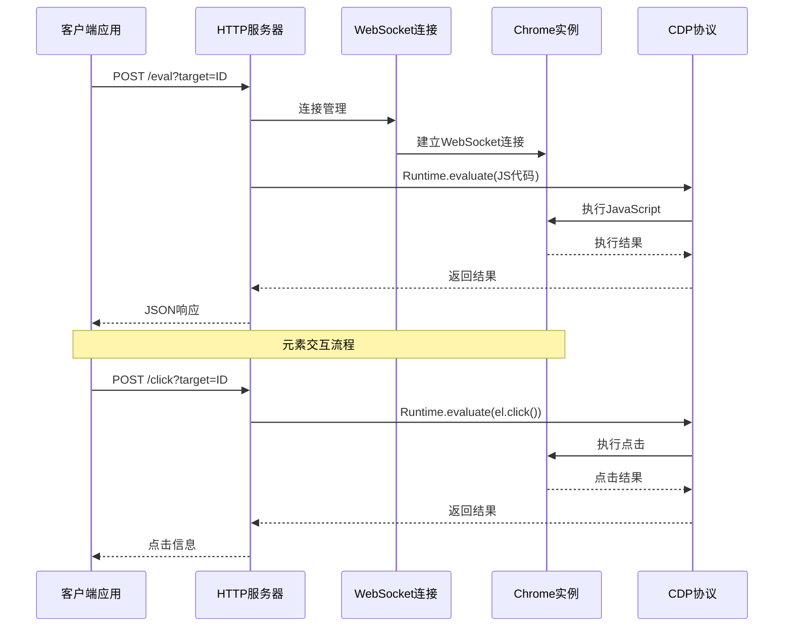
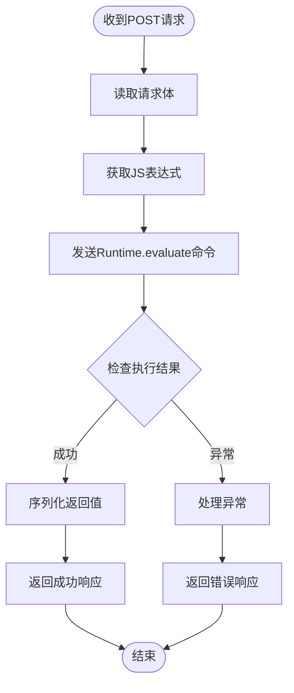
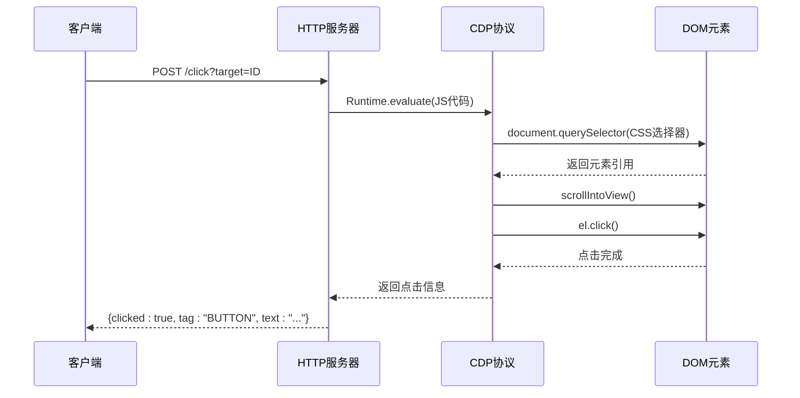
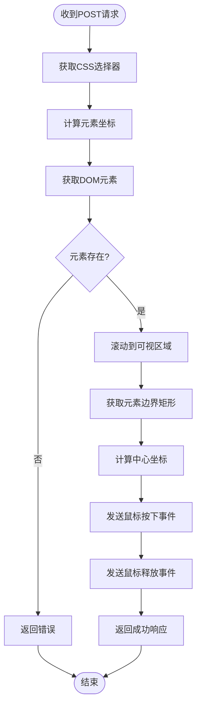
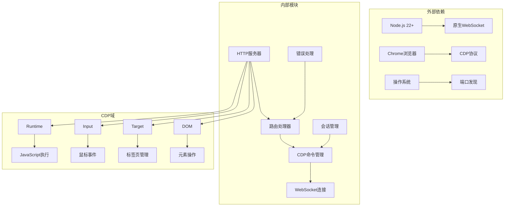

# 元素交互

<cite>
**本文档引用的文件**
- [cdp-proxy.mjs](file://scripts/cdp-proxy.mjs)
- [cdp-api.md](file://references/cdp-api.md)
- [README.md](file://README.md)
</cite>

## 目录
1. [简介](#简介)
2. [项目结构](#项目结构)
3. [核心组件](#核心组件)
4. [架构概览](#架构概览)
5. [详细组件分析](#详细组件分析)
6. [依赖关系分析](#依赖关系分析)
7. [性能考虑](#性能考虑)
8. [故障排除指南](#故障排除指南)
9. [结论](#结论)

## 简介

CDP代理的元素交互功能提供了三种不同的元素操作方式，专门用于与网页元素进行交互：

- **/eval端点**：执行JavaScript代码，用于获取页面信息和执行复杂逻辑
- **/click端点**：通过JS层面点击元素，简单快速，适用于大多数场景
- **/clickAt端点**：通过CDP浏览器级真实鼠标点击，模拟真实用户手势

这些端点都基于Chrome DevTools Protocol (CDP)，通过WebSocket连接到正在运行的Chrome实例，提供强大的浏览器自动化能力。

## 项目结构

CDP代理系统采用模块化设计，主要由以下组件构成：

```mermaid
graph TB
subgraph "CDP代理系统"
A[HTTP服务器] --> B[路由处理器]
B --> C[/eval端点]
B --> D[/click端点]
B --> E[/clickAt端点]
F[WebSocket连接] --> G[Chrome实例]
H[CDP命令管理] --> F
I[会话管理] --> H
J[错误处理] --> B
end
```

**图表来源**
- [cdp-proxy.mjs:288-561](file://scripts/cdp-proxy.mjs#L288-L561)

**章节来源**
- [cdp-proxy.mjs:1-611](file://scripts/cdp-proxy.mjs#L1-L611)
- [README.md:119-137](file://README.md#L119-L137)

## 核心组件

### HTTP服务器和路由处理

CDP代理使用Node.js内置的HTTP模块创建服务器，监听本地端口（默认3456）。服务器采用路由模式处理不同的API端点，每个端点都有特定的功能和参数要求。

### WebSocket连接管理

系统通过WebSocket与Chrome实例建立持久连接，支持自动发现Chrome调试端口、连接重试和会话管理。连接状态通过`/health`端点监控。

### CDP命令执行

所有浏览器操作都通过CDP命令实现，包括：
- Runtime.evaluate：执行JavaScript代码
- Input.dispatchMouseEvent：发送鼠标事件
- Target.attachToTarget：创建和管理浏览器标签页

**章节来源**
- [cdp-proxy.mjs:13-34](file://scripts/cdp-proxy.mjs#L13-L34)
- [cdp-proxy.mjs:202-217](file://scripts/cdp-proxy.mjs#L202-L217)

## 架构概览



**图表来源**
- [cdp-proxy.mjs:355-446](file://scripts/cdp-proxy.mjs#L355-L446)

## 详细组件分析

### /eval端点 - JavaScript代码执行

#### 端点定义
- **HTTP方法**：POST
- **URL模式**：`/eval?target=TARGET_ID`
- **请求体格式**：JavaScript表达式字符串
- **响应结构**：执行结果或错误信息

#### 功能特性
- 执行任意JavaScript代码表达式
- 支持异步操作（awaitPromise: true）
- 自动序列化返回值
- 错误处理和异常捕获

#### 请求处理流程



**图表来源**
- [cdp-proxy.mjs:355-373](file://scripts/cdp-proxy.mjs#L355-L373)

#### 响应结构
- **成功响应**：`{ value: 执行结果 }`
- **错误响应**：`{ error: 错误描述 }`
- **异常详情**：包含完整的异常信息

**章节来源**
- [cdp-proxy.mjs:355-373](file://scripts/cdp-proxy.mjs#L355-L373)
- [cdp-api.md:54-58](file://references/cdp-api.md#L54-L58)

### /click端点 - JS层面元素点击

#### 端点定义
- **HTTP方法**：POST
- **URL模式**：`/click?target=TARGET_ID`
- **请求体格式**：CSS选择器字符串
- **响应结构**：点击结果信息

#### 功能特性
- 通过JS `el.click()` 方法点击元素
- 自动滚动到元素可视区域
- 支持Shadow DOM和iframe中的元素
- 快速简单，适用于大多数场景

#### 实现原理



**图表来源**
- [cdp-proxy.mjs:375-409](file://scripts/cdp-proxy.mjs#L375-L409)

#### 响应结构
- **成功响应**：`{ clicked: true, tag: 元素标签名, text: 元素文本内容 }`
- **错误响应**：`{ error: "未找到元素: CSS选择器" }`

**章节来源**
- [cdp-proxy.mjs:375-409](file://scripts/cdp-proxy.mjs#L375-L409)
- [cdp-api.md:60-64](file://references/cdp-api.md#L60-L64)

### /clickAt端点 - 真实鼠标点击

#### 端点定义
- **HTTP方法**：POST
- **URL模式**：`/clickAt?target=TARGET_ID`
- **请求体格式**：CSS选择器字符串
- **响应结构**：鼠标点击坐标和元素信息

#### 功能特性
- 通过CDP `Input.dispatchMouseEvent` 发送真实鼠标事件
- 模拟完整的鼠标按下和释放动作
- 计算元素精确中心坐标
- 触发真实的用户手势，绕过反自动化检测

#### 实现原理



**图表来源**
- [cdp-proxy.mjs:411-446](file://scripts/cdp-proxy.mjs#L411-L446)

#### 响应结构
- **成功响应**：`{ clicked: true, x: 坐标x, y: 坐标y, tag: 元素标签名, text: 元素文本内容 }`
- **错误响应**：`{ error: "未找到元素: CSS选择器" }`

**章节来源**
- [cdp-proxy.mjs:411-446](file://scripts/cdp-proxy.mjs#L411-L446)
- [cdp-api.md:66-70](file://references/cdp-api.md#L66-L70)

### 三种点击方式的区别和适用场景

| 特性 | /click | /clickAt | /eval |
|------|--------|----------|-------|
| **执行方式** | JS `el.click()` | CDP鼠标事件 | JavaScript执行 |
| **真实性** | JS模拟 | 真实用户手势 | 代码执行 |
| **反检测** | 一般 | 强 | 一般 |
| **文件对话框** | 无法触发 | 可以触发 | 无法触发 |
| **适用场景** | 大多数按钮点击 | 需要真实用户手势的场景 | 数据提取和复杂逻辑 |
| **性能** | 快速 | 中等 | 取决于代码复杂度 |

**章节来源**
- [README.md:40](file://README.md#L40)

## 依赖关系分析



**图表来源**
- [cdp-proxy.mjs:6-12](file://scripts/cdp-proxy.mjs#L6-L12)
- [cdp-proxy.mjs:202-248](file://scripts/cdp-proxy.mjs#L202-L248)

### 错误处理机制

系统实现了多层次的错误处理：

1. **连接错误**：WebSocket连接失败或Chrome实例不可用
2. **命令超时**：CDP命令执行超过30秒
3. **参数验证**：请求参数缺失或格式不正确
4. **元素查找**：CSS选择器无法匹配到元素
5. **异常捕获**：JavaScript执行过程中的异常

**章节来源**
- [cdp-proxy.mjs:104-107](file://scripts/cdp-proxy.mjs#L104-L107)
- [cdp-proxy.mjs:202-217](file://scripts/cdp-proxy.mjs#L202-L217)

## 性能考虑

### 连接管理
- 使用连接池避免频繁建立WebSocket连接
- 实现连接重用和会话复用
- 自动检测和恢复连接中断

### 命令执行优化
- 批量处理相似操作
- 缓存常用的JavaScript代码片段
- 异步执行避免阻塞主线程

### 内存管理
- 及时清理超时的CDP命令
- 管理会话生命周期
- 监控内存使用情况

## 故障排除指南

### 常见问题和解决方案

| 问题类型 | 错误信息 | 可能原因 | 解决方案 |
|----------|----------|----------|----------|
| **连接问题** | "Chrome未开启远程调试端口" | Chrome未启用远程调试 | 在chrome://inspect/#remote-debugging中启用 |
| **命令超时** | "CDP命令超时" | 页面加载缓慢或JavaScript执行时间长 | 检查网络连接，优化JavaScript代码 |
| **元素未找到** | "未找到元素: CSS选择器" | 选择器不正确或元素不存在 | 验证CSS选择器，检查页面结构 |
| **端口占用** | "端口已被占用" | 另一个代理实例已在运行 | 检查进程，使用不同端口 |

### 调试技巧

1. **健康检查**：使用`/health`端点确认代理状态
2. **目标列表**：使用`/targets`获取当前打开的标签页
3. **日志监控**：查看控制台输出的详细错误信息
4. **逐步测试**：先用简单的CSS选择器测试，再逐步复杂化

**章节来源**
- [cdp-api.md:99-107](file://references/cdp-api.md#L99-L107)
- [cdp-proxy.mjs:557-561](file://scripts/cdp-proxy.mjs#L557-L561)

## 结论

CDP代理的元素交互功能提供了强大而灵活的浏览器自动化能力。通过三种不同的操作方式，用户可以根据具体需求选择最适合的方法：

- **/eval端点**适合复杂的JavaScript执行和数据提取
- **/click端点**提供快速的元素点击功能，适用于大多数场景
- **/clickAt端点**模拟真实的用户手势，特别适合需要绕过反自动化检测的场景

系统的设计充分考虑了可靠性、性能和易用性，为AI代理提供了完整的浏览器操作能力。通过合理的错误处理和监控机制，确保了系统的稳定运行。