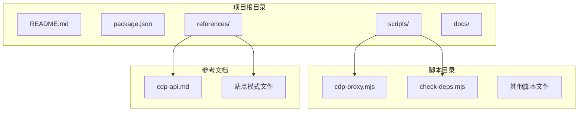
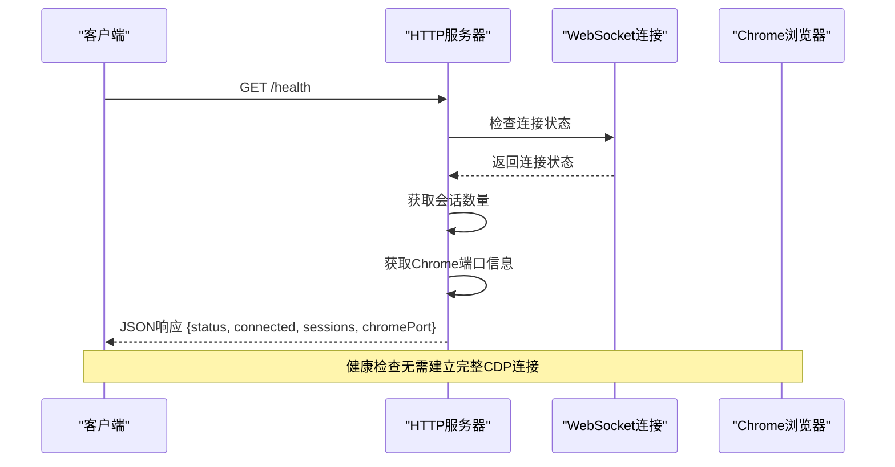
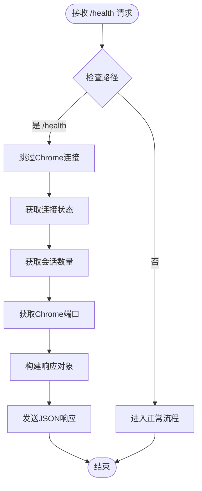
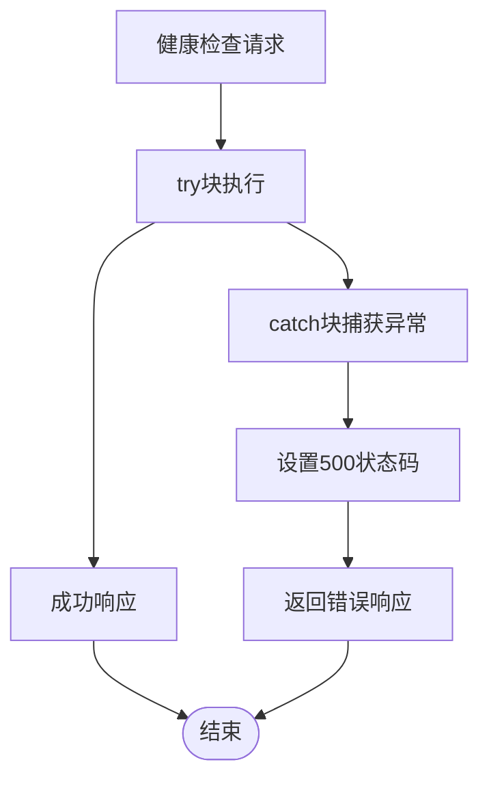
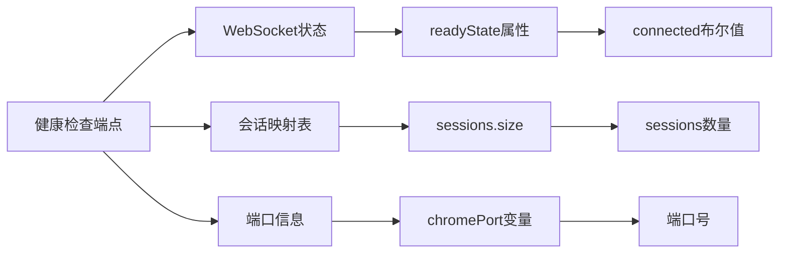

# 基础健康检查

<cite>
**本文档引用的文件**
- [README.md](file://README.md)
- [cdp-proxy.mjs](file://scripts/cdp-proxy.mjs)
- [cdp-api.md](file://references/cdp-api.md)
- [check-deps.mjs](file://scripts/check-deps.mjs)
</cite>

## 目录
1. [简介](#简介)
2. [项目结构](#项目结构)
3. [核心组件](#核心组件)
4. [架构概览](#架构概览)
5. [详细组件分析](#详细组件分析)
6. [依赖关系分析](#依赖关系分析)
7. [性能考虑](#性能考虑)
8. [故障排除指南](#故障排除指南)
9. [结论](#结论)

## 简介

CDP代理的基础健康检查端点是一个关键的监控接口，用于验证CDP代理服务的可用性和连接状态。该端点提供了一个轻量级的健康检查机制，无需建立完整的Chrome调试协议连接即可快速验证服务状态。

CDP代理服务通过WebSocket直连Chrome浏览器，提供HTTP API接口来操控用户日常Chrome实例。健康检查端点作为服务的"哨兵"，确保系统在生产环境中能够及时发现问题并进行故障恢复。

## 项目结构

该项目采用模块化的JavaScript架构，主要组件分布如下：

**图表来源**
- [README.md:1-168](file://README.md#L1-L168)
- [package.json:1-11](file://package.json#L1-L11)

**章节来源**
- [README.md:104-168](file://README.md#L104-L168)
- [package.json:1-11](file://package.json#L1-L11)

## 核心组件

### 健康检查端点概述

健康检查端点是CDP代理服务中最简单的API接口，设计目标是在不建立完整Chrome连接的情况下快速验证服务状态。该端点具有以下特点：

- **HTTP方法**: GET
- **URL模式**: /health
- **响应格式**: JSON
- **响应时间**: 极快（毫秒级）
- **资源消耗**: 最小化

### 响应结构定义

健康检查端点返回标准化的JSON响应，包含以下关键字段：

| 字段名 | 数据类型 | 描述 | 示例值 |
|--------|----------|------|--------|
| status | string | 服务状态标识 | "ok" |
| connected | boolean | WebSocket连接状态 | true/false |
| sessions | number | 当前活动会话数量 | 5 |
| chromePort | number/null | Chrome调试端口号 | 9222/null |

### 状态码规范

- **200 OK**: 健康检查成功，服务正常运行
- **500 Internal Server Error**: 服务器内部错误

**章节来源**
- [cdp-proxy.mjs:296-301](file://scripts/cdp-proxy.mjs#L296-L301)
- [cdp-proxy.mjs:548-551](file://scripts/cdp-proxy.mjs#L548-L551)

## 架构概览

CDP代理服务采用客户端-服务器架构，健康检查端点位于HTTP服务器层，无需深入到Chrome调试协议层面：

**图表来源**
- [cdp-proxy.mjs:288-301](file://scripts/cdp-proxy.mjs#L288-L301)
- [cdp-proxy.mjs:114-200](file://scripts/cdp-proxy.mjs#L114-L200)

## 详细组件分析

### 健康检查实现逻辑

健康检查端点的实现采用了"最小化连接"的设计理念，确保在任何情况下都能快速响应：

**图表来源**
- [cdp-proxy.mjs:296-301](file://scripts/cdp-proxy.mjs#L296-L301)

### 连接状态检测机制

健康检查端点通过检查WebSocket连接的readyState属性来确定连接状态：

| readyState值 | 状态描述 | connected字段值 |
|-------------|----------|-----------------|
| 0 | CONNECTING | false |
| 1 | OPEN | true |
| 2 | CLOSING | false |
| 3 | CLOSED | false |

### 会话数量统计

会话数量通过维护的sessions映射表来统计，每个成功附加到目标的会话都会增加计数器：

- **sessions.size**: 当前活动会话总数
- **sessions.clear()**: 连接断开时重置会话计数

### Chrome端口信息

Chrome调试端口信息通过自动发现机制获取：

- **自动发现**: 从DevToolsActivePort文件读取
- **端口回退**: 探测常见端口(9222, 9229, 9333)
- **端口缓存**: 避免重复发现，提高性能

**章节来源**
- [cdp-proxy.mjs:296-301](file://scripts/cdp-proxy.mjs#L296-L301)
- [cdp-proxy.mjs:118-130](file://scripts/cdp-proxy.mjs#L118-L130)
- [cdp-proxy.mjs:35-91](file://scripts/cdp-proxy.mjs#L35-L91)

### 错误处理机制

健康检查端点的错误处理相对简单，因为其设计目标是快速响应：

**图表来源**
- [cdp-proxy.mjs:548-551](file://scripts/cdp-proxy.mjs#L548-L551)

**章节来源**
- [cdp-proxy.mjs:548-551](file://scripts/cdp-proxy.mjs#L548-L551)

## 依赖关系分析

健康检查端点的依赖关系极其简单，这是其高效性的保证：

**图表来源**
- [cdp-proxy.mjs:14-17](file://scripts/cdp-proxy.mjs#L14-L17)
- [cdp-proxy.mjs:110-111](file://scripts/cdp-proxy.mjs#L110-L111)
- [cdp-proxy.mjs:296-301](file://scripts/cdp-proxy.mjs#L296-L301)

### 外部依赖

- **Node.js内置模块**: http, net, WebSocket
- **无第三方依赖**: 保持最小化部署要求

### 内部依赖

- **全局变量**: ws, sessions, chromePort
- **函数调用**: JSON.stringify()

**章节来源**
- [cdp-proxy.mjs:14-17](file://scripts/cdp-proxy.mjs#L14-L17)
- [cdp-proxy.mjs:296-301](file://scripts/cdp-proxy.mjs#L296-L301)

## 性能考虑

### 响应时间特性

健康检查端点具有以下性能优势：

- **零延迟连接**: 不需要建立WebSocket连接
- **内存访问**: 直接读取内存中的状态变量
- **字符串序列化**: 最小化的JSON序列化开销

### 资源消耗

- **CPU使用率**: 几乎为零
- **内存占用**: 仅访问现有变量
- **网络流量**: 仅传输必要的状态信息

### 扩展性考虑

由于健康检查端点的简单性，可以轻松扩展到多个实例：

- **水平扩展**: 支持多实例部署
- **负载均衡**: 可以在多个实例间分配请求
- **监控集成**: 易于集成到各种监控系统

## 故障排除指南

### 常见问题诊断

#### 1. 健康检查返回500错误

**可能原因**:
- 服务器进程异常
- 未捕获的异常

**解决方法**:
- 检查服务器日志
- 重启CDP代理服务

#### 2. connected字段始终为false

**可能原因**:
- Chrome调试端口未正确配置
- WebSocket连接失败

**解决方法**:
- 验证Chrome远程调试设置
- 检查防火墙设置

#### 3. sessions数量异常

**可能原因**:
- 连接泄漏
- 会话未正确清理

**解决方法**:
- 检查连接生命周期管理
- 实施会话超时机制

### 监控最佳实践

#### 健康检查频率建议

- **生产环境**: 每30-60秒一次
- **开发环境**: 每5-10秒一次
- **CI/CD**: 每次部署后立即检查

#### 告警阈值设置

- **连续失败**: 3次以上
- **响应时间**: 超过1秒
- **连接状态**: 长时间为false

**章节来源**
- [cdp-proxy.mjs:548-551](file://scripts/cdp-proxy.mjs#L548-L551)
- [check-deps.mjs:143-172](file://scripts/check-deps.mjs#L143-L172)

## 结论

CDP代理的基础健康检查端点虽然简单，但却是整个系统监控体系的重要组成部分。其设计体现了"最小化复杂性"的原则，在提供关键监控信息的同时保持了极高的性能和可靠性。

通过健康检查端点，运维团队可以：
- 快速验证服务可用性
- 监控连接状态变化
- 及时发现潜在问题
- 实现自动化故障恢复

该端点的成功实施证明了在复杂系统中，简单而可靠的监控机制往往比复杂的解决方案更有效。