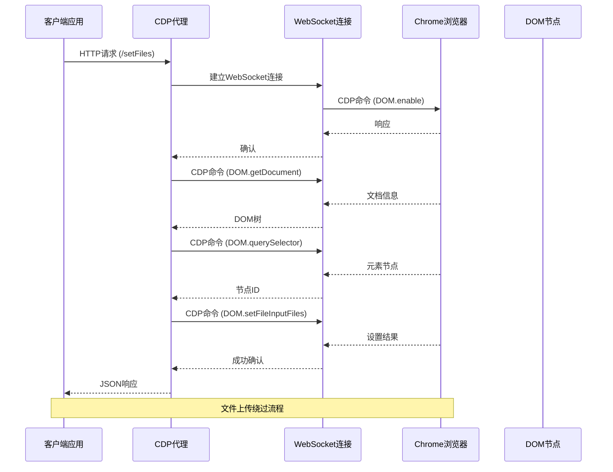
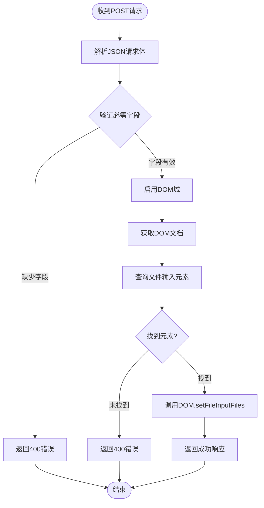
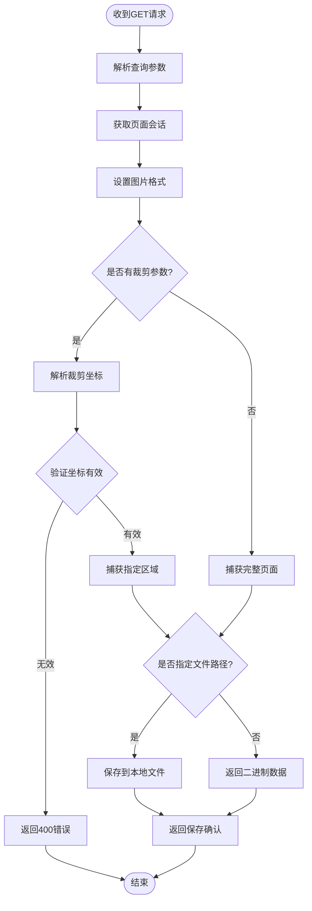
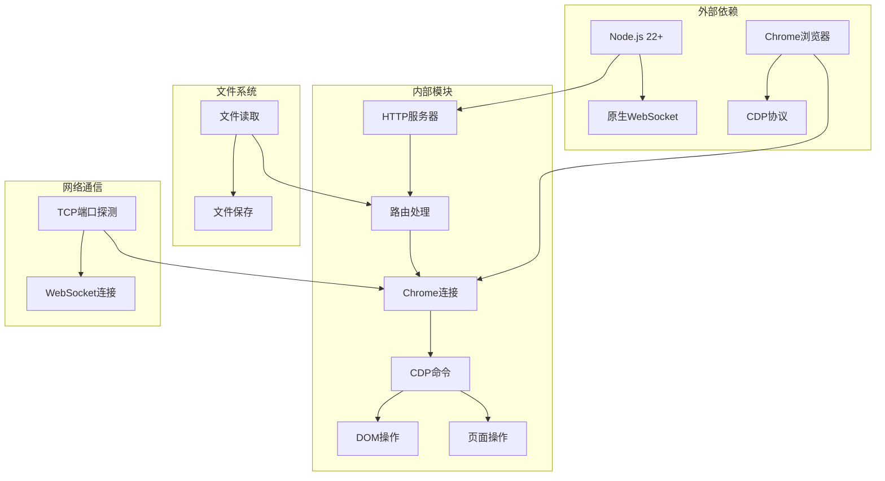

# 文件上传与截图

<cite>
**本文档引用的文件**
- [cdp-proxy.mjs](file://scripts/cdp-proxy.mjs)
- [README.md](file://README.md)
- [cdp-api.md](file://references/cdp-api.md)
</cite>

## 目录
1. [简介](#简介)
2. [项目结构](#项目结构)
3. [核心组件](#核心组件)
4. [架构概览](#架构概览)
5. [详细组件分析](#详细组件分析)
6. [依赖关系分析](#依赖关系分析)
7. [性能考虑](#性能考虑)
8. [故障排除指南](#故障排除指南)
9. [结论](#结论)

## 简介

CDP代理是一个通过HTTP API操控Chrome浏览器的工具，特别专注于文件上传和截图功能。该代理通过WebSocket直连Chrome浏览器，提供两个核心功能端点：

- **/setFiles** 端点：绕过文件对话框直接设置文件输入，实现自动化文件上传
- **/screenshot** 端点：捕获页面截图，支持多种格式和区域裁剪

这些功能使得AI代理能够直接控制浏览器进行文件上传操作，而无需人工干预文件对话框。

## 项目结构

CDP代理项目采用模块化设计，主要包含以下关键组件：

```mermaid
graph TB
subgraph "CDP代理系统"
A[HTTP服务器] --> B[路由处理器]
B --> C[Chrome连接管理]
C --> D[CDP命令发送]
D --> E[WebSocket通信]
E --> F[Chrome浏览器]
subgraph "核心功能"
G[/setFiles文件上传]
H[/screenshot截图功能]
I[文件对话框绕过]
J[Base64图像处理]
end
B --> G
B --> H
G --> I
H --> J
end
```

**图表来源**
- [cdp-proxy.mjs:288-561](file://scripts/cdp-proxy.mjs#L288-L561)

**章节来源**
- [cdp-proxy.mjs:1-611](file://scripts/cdp-proxy.mjs#L1-L611)
- [README.md:119-137](file://README.md#L119-L137)

## 核心组件

### HTTP服务器与路由处理

CDP代理内置一个HTTP服务器，监听本地端口（默认3456），提供RESTful API接口。服务器使用Node.js的内置HTTP模块，并具备以下特性：

- **端口管理**：支持通过环境变量配置端口，默认3456
- **路由分发**：根据URL路径分发到相应的处理函数
- **错误处理**：统一的错误捕获和响应格式
- **健康检查**：/health端点用于监控代理状态

### Chrome连接管理

代理通过WebSocket与Chrome浏览器建立持久连接，实现双向通信：

- **自动发现**：扫描多个平台的DevToolsActivePort文件
- **端口探测**：避免触发Chrome的安全弹窗
- **会话管理**：维护Target到Session的映射关系
- **反风控机制**：拦截页面对调试端口的探测请求

### CDP命令执行

代理封装了Chrome DevTools Protocol的核心功能：

- **DOM操作**：查询元素、设置文件输入
- **页面操作**：导航、滚动、截图
- **输入模拟**：鼠标事件、键盘事件
- **网络控制**：请求拦截、响应修改

**章节来源**
- [cdp-proxy.mjs:288-561](file://scripts/cdp-proxy.mjs#L288-L561)

## 架构概览

CDP代理采用客户端-服务器架构，通过WebSocket实现与Chrome的实时通信：



**图表来源**
- [cdp-proxy.mjs:448-476](file://scripts/cdp-proxy.mjs#L448-L476)

**章节来源**
- [cdp-proxy.mjs:114-200](file://scripts/cdp-proxy.mjs#L114-L200)

## 详细组件分析

### /setFiles 文件上传端点

#### 端点定义
- **HTTP方法**：POST
- **URL模式**：`/setFiles?target=TARGET_ID`
- **功能**：绕过文件对话框直接设置文件输入

#### 请求格式

**请求头**
- Content-Type: application/json

**请求体结构**
```json
{
  "selector": "input[type=file]",
  "files": ["/path/to/file1.png", "/path/to/file2.png"]
}
```

**字段说明**
- `selector`：CSS选择器，指向文件输入元素
- `files`：文件路径数组，支持多个文件

#### 处理流程



**图表来源**
- [cdp-proxy.mjs:448-476](file://scripts/cdp-proxy.mjs#L448-L476)

#### 响应格式

**成功响应**
```json
{
  "success": true,
  "files": 2
}
```

**错误响应**
```json
{
  "error": "需要 selector 和 files 字段"
}
```

#### 文件对话框绕过机制

CDP代理通过Chrome DevTools Protocol的DOM域实现文件上传绕过：

1. **DOM查询**：使用`DOM.querySelector`查找文件输入元素
2. **文件设置**：调用`DOM.setFileInputFiles`直接设置文件路径
3. **无UI交互**：跳过浏览器的文件对话框界面
4. **即时生效**：文件立即绑定到输入元素

这种机制的优势：
- **自动化友好**：适合无人值守的自动化流程
- **稳定可靠**：不受UI变化影响
- **批量处理**：支持同时设置多个文件

**章节来源**
- [cdp-proxy.mjs:448-476](file://scripts/cdp-proxy.mjs#L448-L476)

### /screenshot 截图端点

#### 端点定义
- **HTTP方法**：GET
- **URL模式**：`/screenshot?target=TARGET_ID&file=PATH&format=FORMAT&clip=COORDINATES`
- **功能**：捕获页面截图并返回或保存到文件

#### 查询参数

| 参数名 | 类型 | 必需 | 默认值 | 描述 |
|--------|------|------|--------|------|
| target | string | 是 | - | 目标页面的标识符 |
| file | string | 否 | - | 保存到本地文件的路径 |
| format | string | 否 | png | 图片格式 (png/jpeg/webp) |
| clip | string | 否 | - | 区域裁剪坐标 (x,y,width,height) |

#### 处理流程



**图表来源**
- [cdp-proxy.mjs:502-526](file://scripts/cdp-proxy.mjs#L502-L526)

#### 响应格式

**文件保存模式**
```json
{
  "saved": "/tmp/shot.png"
}
```

**二进制数据模式**
- Content-Type: image/png 或 image/jpeg
- Body: Base64编码的图片数据

#### 截图格式选项

| 格式 | 质量设置 | 适用场景 | 备注 |
|------|----------|----------|------|
| png | 无质量参数 | 高质量、透明背景 | 默认格式 |
| jpeg | 80 | 网络传输、压缩存储 | 有损压缩 |
| webp | 无质量参数 | 现代浏览器、平衡质量 | 需要浏览器支持 |

#### 区域截图功能

支持精确的页面区域截图：
- **坐标系统**：设备像素坐标
- **参数格式**：`x,y,width,height`
- **精度要求**：必须为有效的数值
- **范围限制**：坐标必须在页面范围内

**章节来源**
- [cdp-proxy.mjs:502-526](file://scripts/cdp-proxy.mjs#L502-L526)

### Base64编码处理

CDP代理在截图功能中使用Base64编码处理：

```mermaid
flowchart LR
A[CDP截图响应] --> B[Base64字符串]
B --> C[Buffer.from(data, 'base64')]
C --> D[二进制数据]
D --> E[文件保存]
D --> F[HTTP响应]
G[客户端接收] --> H[Base64解码]
H --> I[显示图片]
```

**图表来源**
- [cdp-proxy.mjs:518-525](file://scripts/cdp-proxy.mjs#L518-L525)

**章节来源**
- [cdp-proxy.mjs:518-525](file://scripts/cdp-proxy.mjs#L518-L525)

## 依赖关系分析

CDP代理的依赖关系相对简洁，主要依赖于Node.js内置模块：



**图表来源**
- [cdp-proxy.mjs:1-34](file://scripts/cdp-proxy.mjs#L1-L34)

**章节来源**
- [cdp-proxy.mjs:1-34](file://scripts/cdp-proxy.mjs#L1-L34)

## 性能考虑

### 连接管理
- **连接复用**：WebSocket连接在代理生命周期内保持
- **会话缓存**：Target到Session的映射减少重复连接
- **超时处理**：CDP命令30秒超时，避免长时间阻塞

### 内存优化
- **流式处理**：HTTP请求体使用流式读取
- **及时清理**：响应完成后清理pending请求
- **资源释放**：连接断开时清理会话和定时器

### 网络效率
- **批量操作**：单个请求完成多个CDP命令
- **条件检查**：先验证元素存在再执行操作
- **错误早返回**：无效参数立即返回错误

## 故障排除指南

### 常见错误及解决方案

**连接错误**
- **症状**：无法连接到Chrome
- **原因**：Chrome未启用远程调试或端口被占用
- **解决**：确保Chrome以`--remote-debugging-port`启动

**元素未找到**
- **症状**：/setFiles返回"未找到元素"错误
- **原因**：CSS选择器不正确或元素动态加载
- **解决**：检查选择器语法，确保元素已渲染

**权限问题**
- **症状**：文件路径无法访问
- **原因**：代理进程权限不足
- **解决**：确保代理进程有文件读取权限

**章节来源**
- [cdp-proxy.mjs:557-560](file://scripts/cdp-proxy.mjs#L557-L560)

### 调试技巧

1. **健康检查**：使用`/health`端点检查代理状态
2. **目标列表**：使用`/targets`查看可用页面
3. **日志分析**：查看代理启动日志了解连接状态
4. **逐步测试**：先测试基本连接，再进行复杂操作

## 结论

CDP代理的文件上传和截图功能为AI代理提供了强大的浏览器自动化能力。通过绕过文件对话框的文件上传机制和灵活的截图功能，实现了真正的无人值守网页操作。

### 主要优势

1. **自动化友好**：完全绕过用户交互，适合批量处理
2. **格式多样**：支持多种图片格式和区域裁剪
3. **稳定可靠**：基于标准CDP协议，兼容性强
4. **性能高效**：WebSocket长连接，低延迟通信

### 应用场景

- **文件上传自动化**：批量上传文件、表单提交
- **页面监控**：定期截图保存页面状态
- **数据采集**：自动化抓取页面内容
- **测试支持**：自动化测试中的截图和文件上传

该功能为AI代理在复杂网页操作场景下提供了坚实的技术基础，显著提升了自动化程度和操作效率。