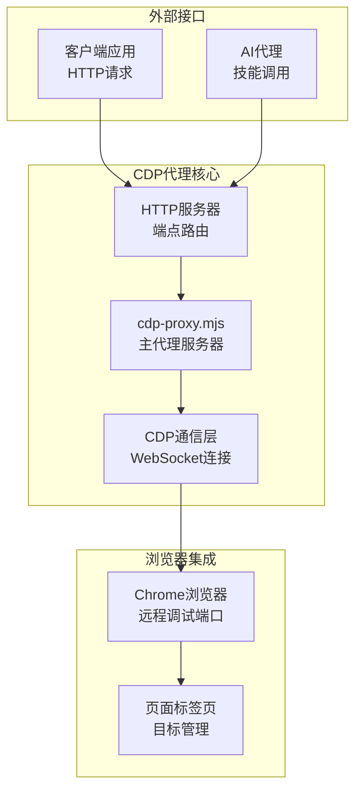
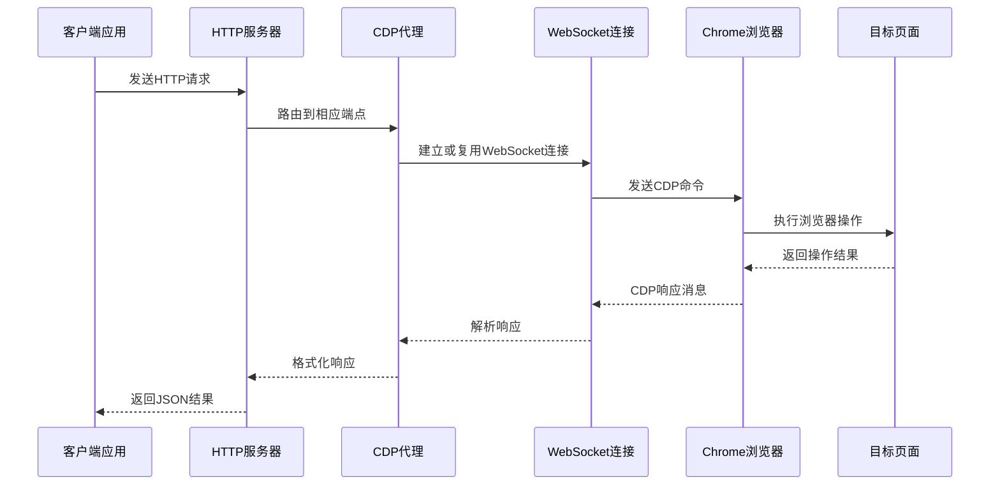
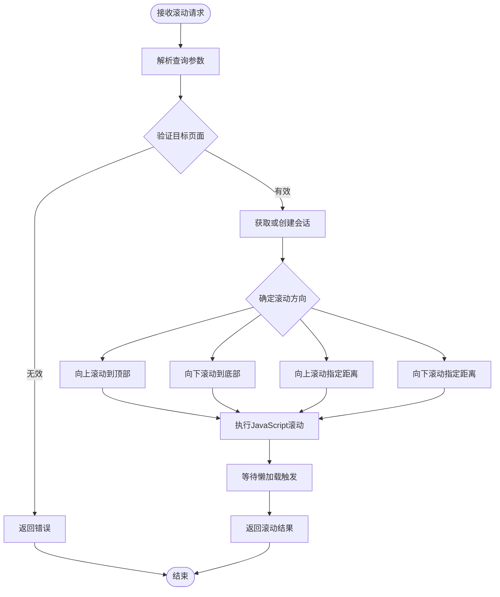
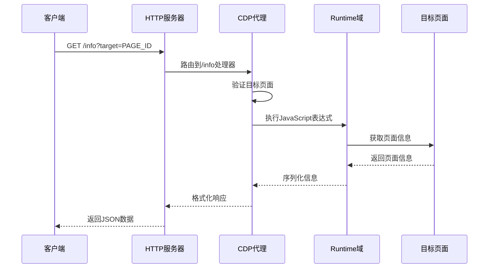
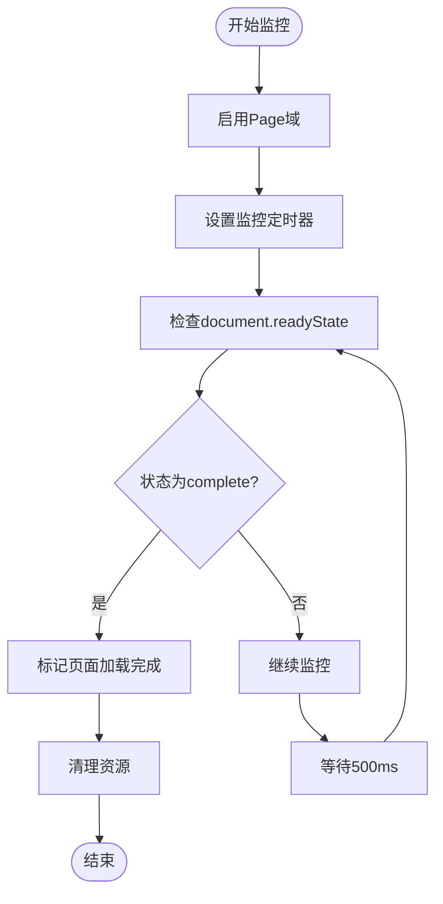
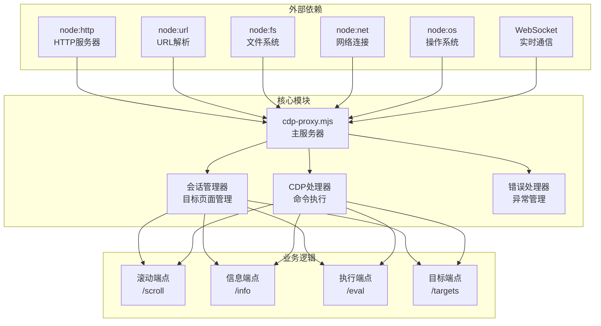

# 滚动与页面信息

<cite>
**本文档引用的文件**
- [cdp-proxy.mjs](file://scripts/cdp-proxy.mjs)
- [cdp-api.md](file://references/cdp-api.md)
- [README.md](file://README.md)
</cite>

## 目录
1. [简介](#简介)
2. [项目结构](#项目结构)
3. [核心组件](#核心组件)
4. [架构概览](#架构概览)
5. [详细组件分析](#详细组件分析)
6. [依赖关系分析](#依赖关系分析)
7. [性能考虑](#性能考虑)
8. [故障排除指南](#故障排除指南)
9. [结论](#结论)

## 简介

本文档详细描述了CDP代理的滚动控制和页面信息获取端点。CDP代理是一个通过HTTP API操控Chrome浏览器的中间件，它通过WebSocket连接到Chrome的远程调试端口，提供了一系列浏览器自动化操作接口。

该代理主要服务于AI Agent，为其提供完整的浏览器自动化能力，包括页面滚动控制、信息获取、JavaScript执行等核心功能。文档重点涵盖两个关键端点：`/scroll`（页面滚动控制）和`/info`（页面信息获取）。

## 项目结构

CDP代理项目采用模块化设计，主要包含以下核心组件：



**图表来源**
- [cdp-proxy.mjs:288-561](file://scripts/cdp-proxy.mjs#L288-L561)

**章节来源**
- [cdp-proxy.mjs:1-611](file://scripts/cdp-proxy.mjs#L1-L611)

## 核心组件

CDP代理的核心功能由以下几个关键组件构成：

### HTTP服务器组件
- **端口配置**：默认监听3456端口，可通过环境变量CDP_PROXY_PORT自定义
- **请求路由**：统一处理所有HTTP请求，根据URL路径分发到相应处理器
- **响应格式**：统一返回JSON格式，包含标准的HTTP状态码

### CDP通信组件
- **WebSocket连接**：与Chrome浏览器建立持久连接
- **会话管理**：维护每个页面标签页的独立会话
- **命令队列**：管理CDP命令的发送和响应处理

### 页面管理组件
- **目标发现**：自动发现和连接可用的Chrome页面
- **会话创建**：为新页面创建独立的调试会话
- **状态监控**：跟踪页面加载状态和可用性

**章节来源**
- [cdp-proxy.mjs:13-217](file://scripts/cdp-proxy.mjs#L13-L217)
- [cdp-proxy.mjs:288-561](file://scripts/cdp-proxy.mjs#L288-L561)

## 架构概览

CDP代理采用客户端-服务器架构，通过WebSocket实现与Chrome浏览器的实时通信：



**图表来源**
- [cdp-proxy.mjs:114-200](file://scripts/cdp-proxy.mjs#L114-L200)
- [cdp-proxy.mjs:202-217](file://scripts/cdp-proxy.mjs#L202-L217)

## 详细组件分析

### 滚动控制端点 (/scroll)

滚动控制端点提供了灵活的页面滚动功能，支持多种滚动策略：

#### 端点规范
- **HTTP方法**：GET
- **URL模式**：`/scroll`
- **查询参数**：
  - `target` (必需)：目标页面的标识符
  - `y` (可选，默认3000)：滚动距离（像素）
  - `direction` (可选，默认down)：滚动方向，可选值包括`down`、`up`、`top`、`bottom`

#### 滚动策略实现



**图表来源**
- [cdp-proxy.mjs:478-500](file://scripts/cdp-proxy.mjs#L478-L500)

#### 滚动控制策略

| 方向参数 | JavaScript实现 | 行为描述 |
|---------|---------------|----------|
| `down` | `window.scrollBy(0, Math.abs(y))` | 向下滚动指定像素距离 |
| `up` | `window.scrollBy(0, -Math.abs(y))` | 向上滚动指定像素距离 |
| `top` | `window.scrollTo(0, 0)` | 滚动到页面顶部 |
| `bottom` | `window.scrollTo(0, document.body.scrollHeight)` | 滚动到页面底部 |

#### 响应结构
滚动操作成功时返回JSON对象，包含滚动结果值：
```json
{
  "value": "scrolled down 3000px"
}
```

#### 使用示例
```bash
# 向下滚动3000像素
curl "http://localhost:3456/scroll?target=PAGE_ID&y=3000"

# 向上滚动500像素
curl "http://localhost:3456/scroll?target=PAGE_ID&y=500&direction=up"

# 滚动到页面底部
curl "http://localhost:3456/scroll?target=PAGE_ID&direction=bottom"
```

**章节来源**
- [cdp-proxy.mjs:478-500](file://scripts/cdp-proxy.mjs#L478-L500)
- [cdp-api.md:78-83](file://references/cdp-api.md#L78-L83)

### 页面信息获取端点 (/info)

页面信息获取端点用于获取当前页面的基础信息，包括标题、URL和加载状态：

#### 端点规范
- **HTTP方法**：GET
- **URL模式**：`/info`
- **查询参数**：
  - `target` (必需)：目标页面的标识符

#### 信息获取逻辑



**图表来源**
- [cdp-proxy.mjs:528-536](file://scripts/cdp-proxy.mjs#L528-L536)

#### 返回的页面信息结构
页面信息获取端点返回包含以下字段的JSON对象：

| 字段名 | 数据类型 | 描述 | 示例值 |
|--------|----------|------|--------|
| `title` | string | 页面标题 | `"示例页面 - Google 搜索"` |
| `url` | string | 当前页面URL | `"https://www.google.com/search?q=test"` |
| `ready` | string | 页面加载状态 | `"complete"` |

#### JavaScript执行机制
端点通过CDP的`Runtime.evaluate`命令执行以下JavaScript表达式：
```javascript
JSON.stringify({
  title: document.title,
  url: location.href,
  ready: document.readyState
})
```

#### 使用示例
```bash
# 获取页面信息
curl "http://localhost:3456/info?target=PAGE_ID"
```

预期响应：
```json
{
  "title": "示例页面 - Google 搜索",
  "url": "https://www.google.com/search?q=test",
  "ready": "complete"
}
```

**章节来源**
- [cdp-proxy.mjs:528-536](file://scripts/cdp-proxy.mjs#L528-L536)
- [cdp-api.md:48-52](file://references/cdp-api.md#L48-L52)

### JavaScript执行与页面状态监控

CDP代理提供了强大的JavaScript执行能力，用于页面状态监控和信息提取：

#### 页面状态监控策略



**图表来源**
- [cdp-proxy.mjs:250-278](file://scripts/cdp-proxy.mjs#L250-L278)

#### 监控实现细节
- **监控频率**：每500毫秒检查一次页面状态
- **超时处理**：最大等待时间为15秒
- **状态判断**：当`document.readyState`等于`complete`时认为页面加载完成

**章节来源**
- [cdp-proxy.mjs:250-278](file://scripts/cdp-proxy.mjs#L250-L278)

## 依赖关系分析

CDP代理的依赖关系体现了其模块化设计和清晰的职责分离：



**图表来源**
- [cdp-proxy.mjs:6-11](file://scripts/cdp-proxy.mjs#L6-L11)
- [cdp-proxy.mjs:288-561](file://scripts/cdp-proxy.mjs#L288-L561)

### 关键依赖特性

| 依赖模块 | 用途 | 重要性 |
|---------|------|--------|
| node:http | HTTP服务器基础 | 核心 |
| node:url | URL解析和查询参数处理 | 核心 |
| node:fs | 文件系统操作（截图保存） | 重要 |
| node:net | 端口检测和网络连接 | 重要 |
| node:os | 跨平台操作系统信息 | 重要 |
| WebSocket | 实时双向通信 | 核心 |

**章节来源**
- [cdp-proxy.mjs:6-11](file://scripts/cdp-proxy.mjs#L6-L11)
- [cdp-proxy.mjs:288-561](file://scripts/cdp-proxy.mjs#L288-L561)

## 性能考虑

CDP代理在设计时充分考虑了性能和可靠性：

### 连接管理优化
- **连接复用**：WebSocket连接在代理生命周期内保持，避免频繁重建
- **会话缓存**：目标页面会话信息缓存，减少重复创建成本
- **端口发现优化**：智能端口发现算法，优先使用DevToolsActivePort文件

### 请求处理优化
- **异步处理**：所有CDP操作采用Promise链式调用，避免阻塞
- **超时控制**：CDP命令超时时间为30秒，防止长时间挂起
- **错误恢复**：连接断开时自动重连，确保服务连续性

### 资源使用优化
- **内存管理**：及时清理超时的CDP命令和会话映射
- **CPU优化**：滚动操作后延迟800毫秒等待懒加载，平衡性能和效果
- **网络优化**：截图操作支持直接返回二进制数据，减少额外处理

## 故障排除指南

### 常见问题及解决方案

#### Chrome连接问题
**症状**：代理无法连接到Chrome浏览器
**原因**：
- Chrome未启用远程调试端口
- Chrome版本不兼容
- 端口被占用

**解决方案**：
1. 确保Chrome已启用远程调试：`chrome://inspect/#remote-debugging`
2. 检查Chrome版本是否支持CDP协议
3. 使用`lsof -i :9222`检查端口占用情况

#### 目标页面不可用
**症状**：/scroll或/info端点返回目标不存在错误
**原因**：
- 目标页面ID无效
- 页面已被关闭
- 会话已过期

**解决方案**：
1. 使用`/targets`端点获取有效的页面列表
2. 重新创建目标页面
3. 检查目标页面的生命周期

#### 滚动操作失败
**症状**：/scroll端点返回JavaScript执行错误
**原因**：
- 目标页面JavaScript被禁用
- 页面结构发生变化
- 选择器无效

**解决方案**：
1. 确认页面允许JavaScript执行
2. 检查页面结构是否发生变化
3. 验证目标页面的可用性

#### 响应超时
**症状**：请求处理超时（超过30秒）
**原因**：
- 页面加载缓慢
- JavaScript执行复杂
- 网络延迟

**解决方案**：
1. 检查页面加载状态
2. 简化JavaScript表达式
3. 优化网络连接

**章节来源**
- [cdp-proxy.mjs:120-130](file://scripts/cdp-proxy.mjs#L120-L130)
- [cdp-proxy.mjs:202-217](file://scripts/cdp-proxy.mjs#L202-L217)

## 结论

CDP代理的滚动控制和页面信息获取端点为AI代理提供了强大而灵活的浏览器自动化能力。通过精心设计的API接口和稳健的实现架构，这些功能能够满足各种复杂的网页操作需求。

### 主要优势

1. **直观的API设计**：简洁的HTTP端点设计，易于理解和使用
2. **灵活的滚动控制**：支持多种滚动策略，适应不同页面布局
3. **可靠的状态监控**：智能的页面加载状态检测机制
4. **强大的JavaScript执行**：支持复杂的页面信息提取和操作
5. **健壮的错误处理**：完善的异常处理和恢复机制

### 应用场景

- **内容爬取**：自动滚动页面获取完整内容
- **页面状态监控**：实时跟踪页面加载进度
- **用户行为模拟**：模拟真实的用户滚动和交互行为
- **数据提取**：从页面中提取结构化信息

### 未来发展

随着AI代理技术的不断发展，CDP代理将继续演进以满足更复杂的应用需求。未来可能的改进方向包括：
- 更智能的页面状态检测算法
- 更丰富的滚动控制选项
- 更强大的JavaScript执行能力
- 更好的性能优化和资源管理