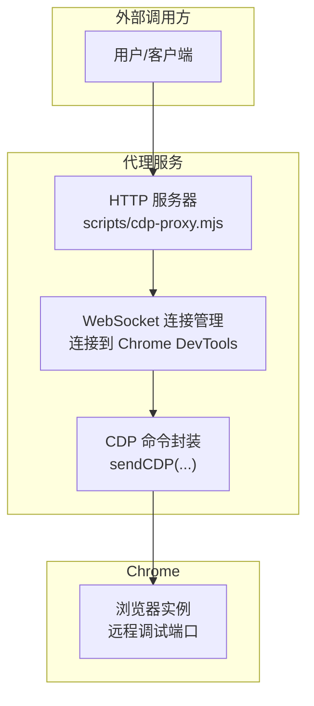
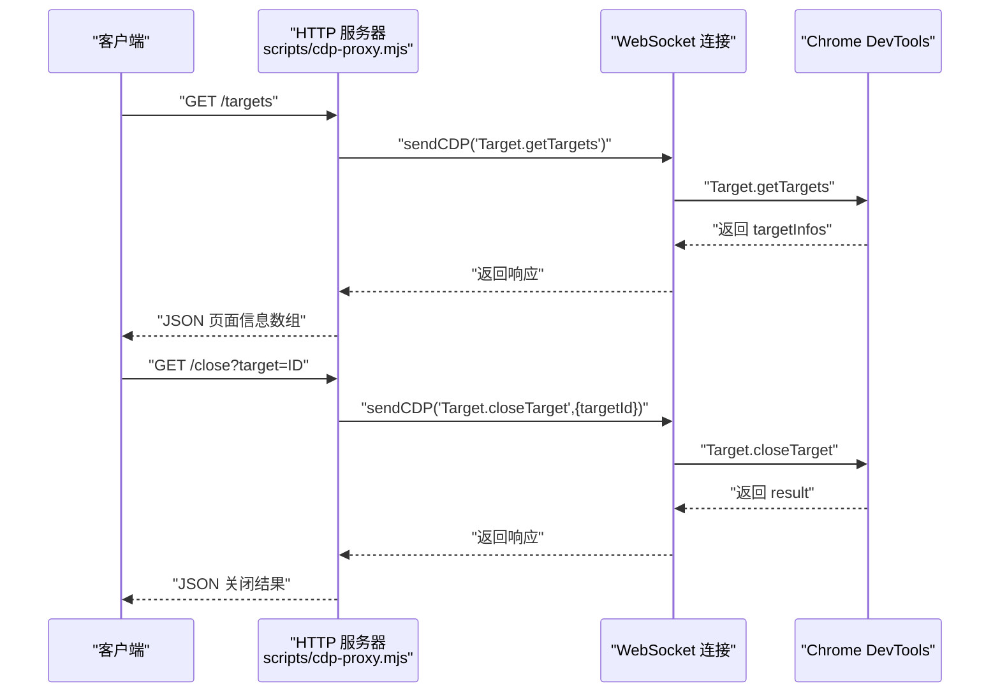
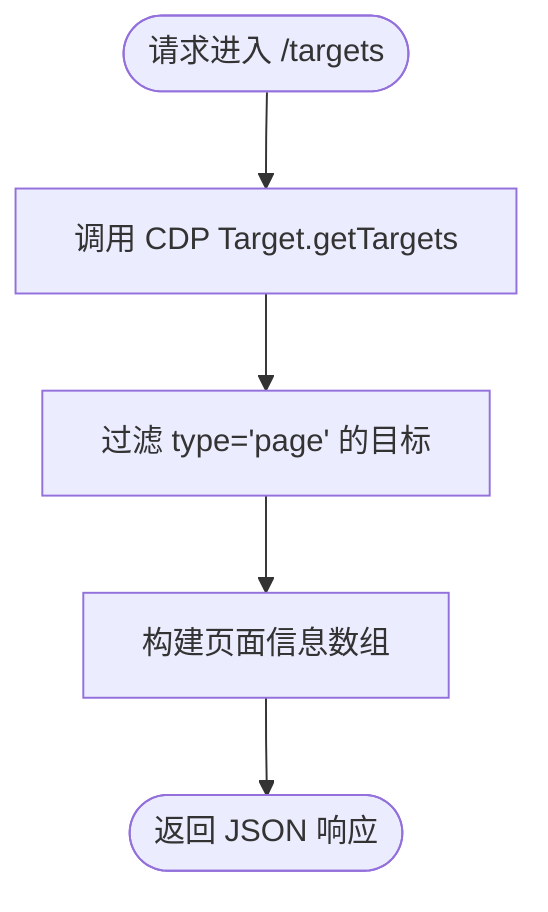
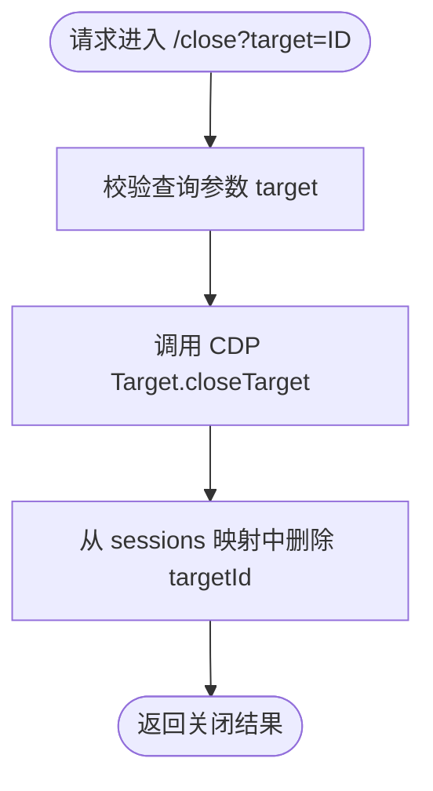
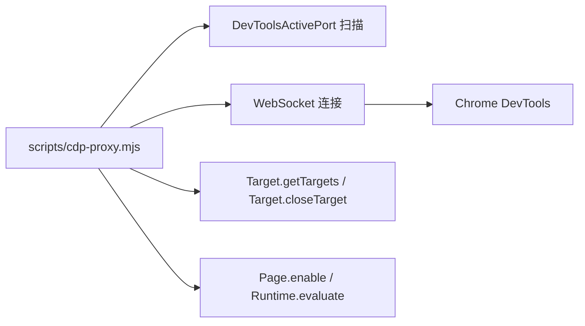

# 目标管理

<cite>
**本文引用的文件**
- [README.md](file://README.md)
- [cdp-proxy.mjs](file://scripts/cdp-proxy.mjs)
- [cdp-api.md](file://references/cdp-api.md)
- [package.json](file://package.json)
</cite>

## 目录
1. [简介](#简介)
2. [项目结构](#项目结构)
3. [核心组件](#核心组件)
4. [架构总览](#架构总览)
5. [详细组件分析](#详细组件分析)
6. [依赖关系分析](#依赖关系分析)
7. [性能考量](#性能考量)
8. [故障排查指南](#故障排查指南)
9. [结论](#结论)
10. [附录](#附录)

## 简介
本文件聚焦于 CDP 代理的目标管理相关端点，包括：
- /targets 页面列表端点：用于列举当前 Chrome 所有页面标签（Tab）
- /close 页面关闭端点：用于关闭指定页面标签

文档将详细说明 HTTP 方法、URL 模式、查询参数、响应结构、错误处理以及多页面操作的最佳实践，并提供可视化流程图帮助理解端点工作原理。

## 项目结构
该项目是一个通过 HTTP API 控制本地 Chrome 的代理服务，核心逻辑集中在单个脚本中，配合少量参考文档与配置文件。

图表来源
- [cdp-proxy.mjs:287-552](file://scripts/cdp-proxy.mjs#L287-L552)

章节来源
- [README.md:119-137](file://README.md#L119-L137)
- [package.json:1-11](file://package.json#L1-L11)

## 核心组件
- HTTP 服务器：负责解析请求路径与查询参数，路由到对应 CDP 功能
- WebSocket 连接管理：自动发现并连接本地 Chrome 的 DevTools 端口
- CDP 命令封装：统一发送 CDP 命令并处理响应与超时

章节来源
- [cdp-proxy.mjs:13-33](file://scripts/cdp-proxy.mjs#L13-L33)
- [cdp-proxy.mjs:113-200](file://scripts/cdp-proxy.mjs#L113-L200)
- [cdp-proxy.mjs:202-217](file://scripts/cdp-proxy.mjs#L202-L217)

## 架构总览
下图展示了 /targets 与 /close 两个端点的请求-响应流程，以及与底层 CDP 的交互。

图表来源
- [cdp-proxy.mjs:305-334](file://scripts/cdp-proxy.mjs#L305-L334)

## 详细组件分析

### /targets 页面列表端点
- HTTP 方法：GET
- URL 模式：/targets
- 查询参数：无
- 请求处理流程：
  1) 调用 CDP Target.getTargets 获取所有目标
  2) 过滤类型为 page 的目标
  3) 返回页面信息数组
- 响应结构：
  - 成功：页面信息数组（每个条目包含 targetId、title、url 等字段）
  - 失败：JSON 错误对象（HTTP 500）
- 典型使用场景：
  - 列举当前所有 Tab，以便后续操作选择目标
  - 与 /close 配合，先列出再关闭特定目标
- 注意事项：
  - 仅返回 type 为 page 的目标（即普通页面标签）

图表来源
- [cdp-proxy.mjs:305-310](file://scripts/cdp-proxy.mjs#L305-L310)

章节来源
- [cdp-proxy.mjs:305-310](file://scripts/cdp-proxy.mjs#L305-L310)
- [cdp-api.md:18-22](file://references/cdp-api.md#L18-L22)

### /close 页面关闭端点
- HTTP 方法：GET
- URL 模式：/close
- 查询参数：
  - target：目标页面的 targetId（必填）
- 请求处理流程：
  1) 调用 CDP Target.closeTarget 关闭指定目标
  2) 从会话映射中删除该 targetId 对应的 sessionId
  3) 返回关闭结果
- 响应结构：
  - 成功：CDP 关闭结果（通常包含布尔值或空对象）
  - 失败：JSON 错误对象（HTTP 500）
- 典型使用场景：
  - 在完成某项任务后清理临时页面
  - 与 /targets 协作，先获取目标列表，再逐个关闭
- 注意事项：
  - 若 targetId 无效或已关闭，CDP 会返回错误
  - 关闭后会话映射会被清理，后续对该 targetId 的操作需重新建立会话

图表来源
- [cdp-proxy.mjs:329-334](file://scripts/cdp-proxy.mjs#L329-L334)

章节来源
- [cdp-proxy.mjs:329-334](file://scripts/cdp-proxy.mjs#L329-L334)
- [cdp-api.md:30-34](file://references/cdp-api.md#L30-L34)

### 与 /new 的协作（页面生命周期管理）
- /new 创建新后台 Tab，自动等待页面加载完成后返回 targetId
- 与 /targets 配合：先 /targets 获取当前所有页面，再 /close 关闭不需要的页面
- 与 /navigate 配合：在已有页面中导航到新 URL，自动等待加载

章节来源
- [cdp-proxy.mjs:312-327](file://scripts/cdp-proxy.mjs#L312-L327)
- [cdp-api.md:24-28](file://references/cdp-api.md#L24-L28)

## 依赖关系分析
- 代理服务依赖 Node.js 原生 WebSocket 或 ws 模块
- 通过 DevToolsActivePort 文件或常见端口扫描自动发现 Chrome 调试端口
- 通过 Target 域管理页面目标，通过 Page 域等待页面加载
- 会话映射 sessions 用于缓存 targetId 到 sessionId 的映射，避免重复 attach

图表来源
- [cdp-proxy.mjs:35-102](file://scripts/cdp-proxy.mjs#L35-L102)
- [cdp-proxy.mjs:113-200](file://scripts/cdp-proxy.mjs#L113-L200)
- [cdp-proxy.mjs:250-278](file://scripts/cdp-proxy.mjs#L250-L278)

章节来源
- [cdp-proxy.mjs:16-17](file://scripts/cdp-proxy.mjs#L16-L17)
- [cdp-proxy.mjs:222-233](file://scripts/cdp-proxy.mjs#L222-L233)

## 性能考量
- 自动发现 Chrome 端口采用 TCP 探测，避免触发安全弹窗
- /targets 仅过滤 page 类型目标，减少无关数据传输
- /close 后立即清理会话映射，避免内存泄漏
- /new 创建后台 Tab，避免前台切换影响用户体验
- /navigate 自动等待页面加载，减少后续操作的不确定性

章节来源
- [cdp-proxy.mjs:95-102](file://scripts/cdp-proxy.mjs#L95-L102)
- [cdp-proxy.mjs:305-310](file://scripts/cdp-proxy.mjs#L305-L310)
- [cdp-proxy.mjs:329-334](file://scripts/cdp-proxy.mjs#L329-L334)
- [cdp-proxy.mjs:312-327](file://scripts/cdp-proxy.mjs#L312-L327)
- [cdp-proxy.mjs:336-345](file://scripts/cdp-proxy.mjs#L336-L345)

## 故障排查指南
- Chrome 未开启远程调试端口
  - 现象：连接失败或抛出错误
  - 处理：在 Chrome 中启用远程调试（chrome://inspect/#remote-debugging）
- attach 失败或 targetId 无效
  - 现象：/close 或其他基于 targetId 的操作报错
  - 处理：先调用 /targets 获取最新目标列表，确认 targetId 存在且有效
- CDP 命令超时
  - 现象：页面长时间未响应
  - 处理：重试或检查页面状态；必要时关闭并重新创建目标
- 端口已被占用
  - 现象：启动时报端口冲突
  - 处理：已有实例可直接复用；否则更换端口或停止占用进程

章节来源
- [cdp-proxy.mjs:118-130](file://scripts/cdp-proxy.mjs#L118-L130)
- [cdp-proxy.mjs:202-217](file://scripts/cdp-proxy.mjs#L202-L217)
- [cdp-api.md:103-106](file://references/cdp-api.md#L103-L106)

## 结论
- /targets 与 /close 是目标管理的基础端点，前者用于枚举页面，后者用于清理页面
- 通过与 /new、/navigate 等端点的协同，可实现完整的页面生命周期管理
- 建议在批量操作时先 /targets 获取目标列表，再按需 /close 清理，以保持浏览器资源整洁

## 附录

### API 定义与使用示例

- /targets
  - 方法：GET
  - URL：/targets
  - 查询参数：无
  - 响应：页面信息数组（包含 targetId、title、url 等）
  - 示例：curl -s http://localhost:3456/targets

- /close
  - 方法：GET
  - URL：/close
  - 查询参数：target（目标页面的 targetId）
  - 响应：CDP 关闭结果
  - 示例：curl -s "http://localhost:3456/close?target=TARGET_ID"

章节来源
- [cdp-api.md:18-22](file://references/cdp-api.md#L18-L22)
- [cdp-api.md:30-34](file://references/cdp-api.md#L30-L34)