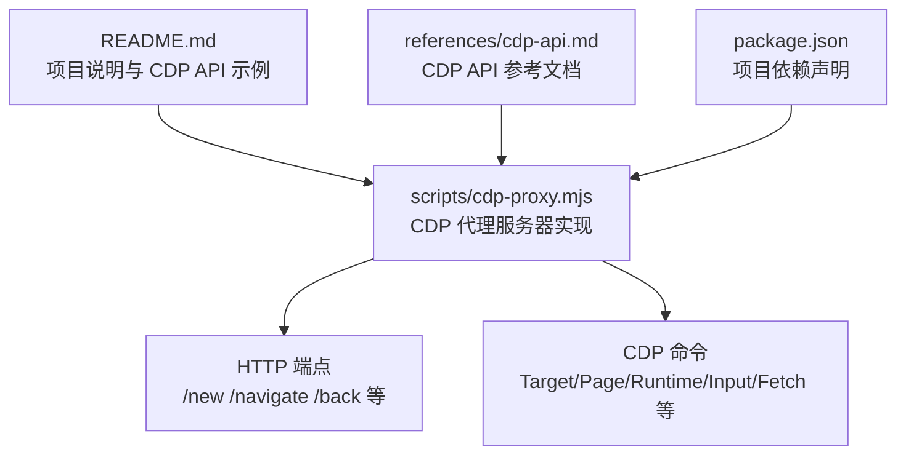
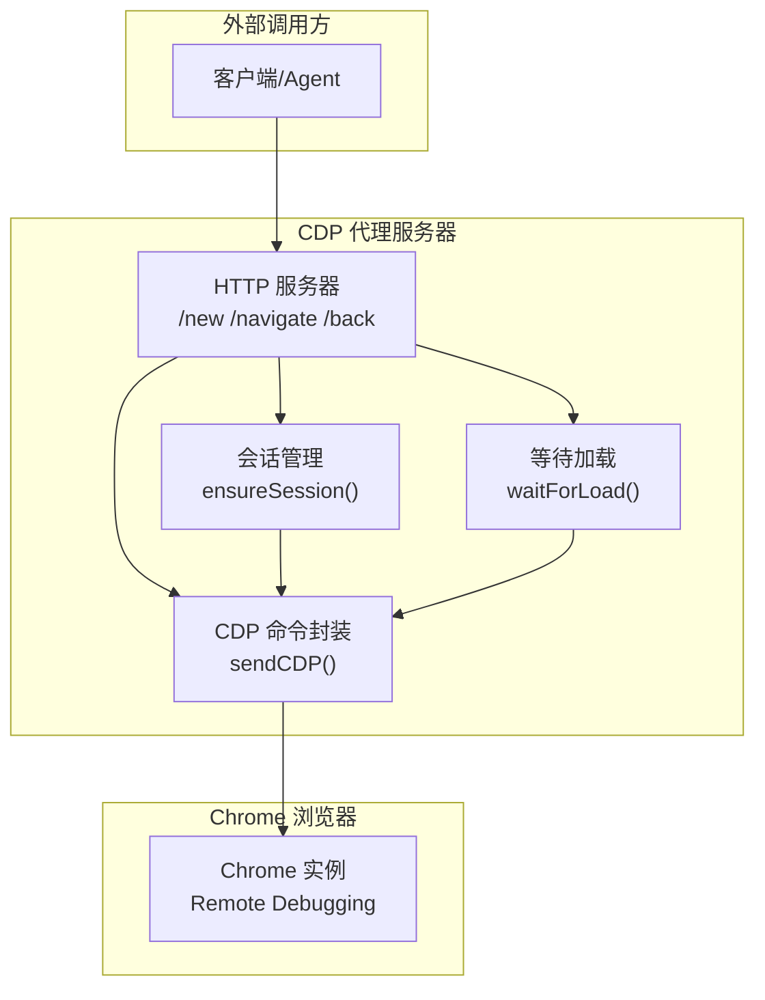
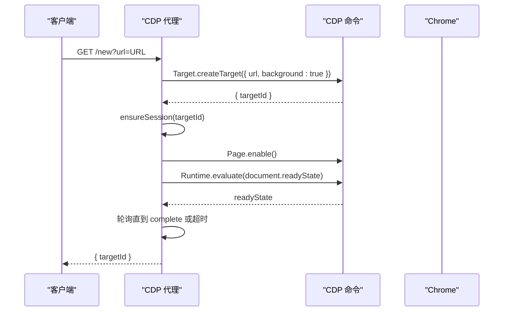
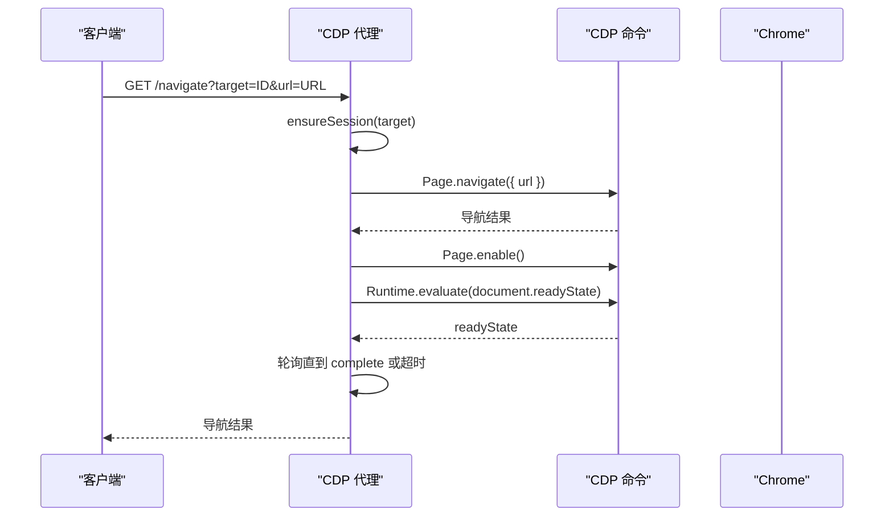
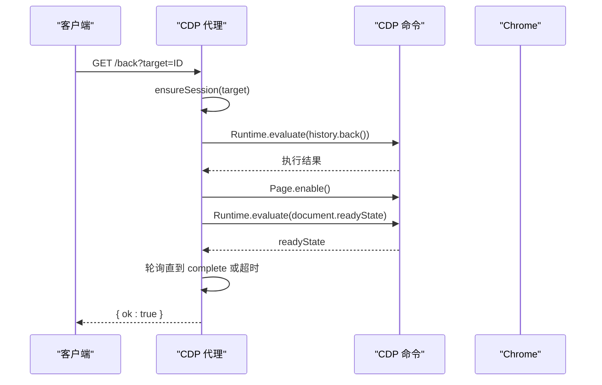
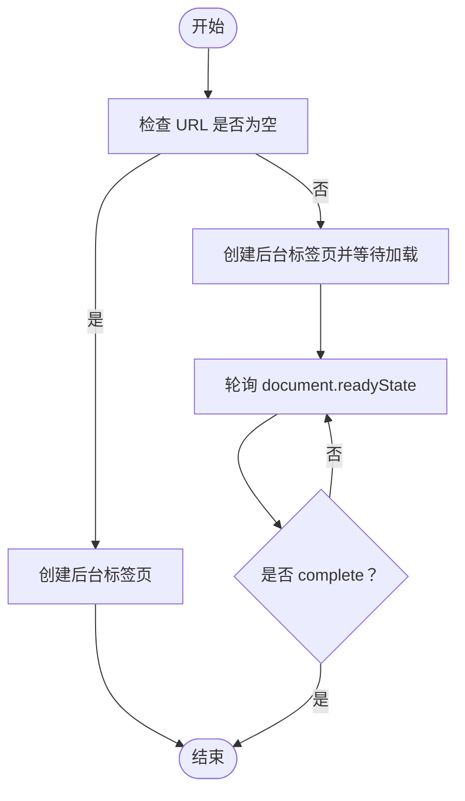
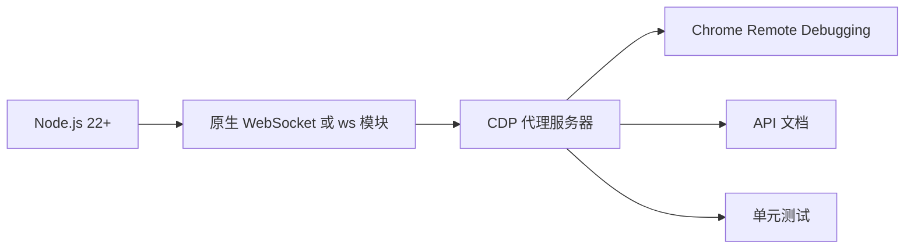

# 页面导航

<cite>
**本文档引用的文件**
- [README.md](file://README.md)
- [cdp-proxy.mjs](file://scripts/cdp-proxy.mjs)
- [cdp-api.md](file://references/cdp-api.md)
- [package.json](file://package.json)
</cite>

## 目录
1. [简介](#简介)
2. [项目结构](#项目结构)
3. [核心组件](#核心组件)
4. [架构总览](#架构总览)
5. [详细组件分析](#详细组件分析)
6. [依赖关系分析](#依赖关系分析)
7. [性能考量](#性能考量)
8. [故障排查指南](#故障排查指南)
9. [结论](#结论)

## 简介
本文件聚焦于 CDP 代理的页面导航相关端点，包括：
- /new：创建新后台标签页，并在非空 URL 时自动等待页面加载完成
- /navigate：在指定目标标签页中导航到新 URL，并自动等待页面加载完成
- /back：在指定目标标签页中执行浏览器后退操作，并自动等待页面加载完成

文档涵盖 HTTP 方法、URL 模式、查询参数、响应结构、自动等待机制以及使用示例，并解释页面加载等待策略与导航流程控制。

## 项目结构
该仓库提供了一个通过 HTTP API 控制本地 Chrome（CDP）的代理服务，核心逻辑位于脚本文件中，API 文档参考位于 references 目录。

图表来源
- [README.md:119-137](file://README.md#L119-L137)
- [cdp-proxy.mjs:288-561](file://scripts/cdp-proxy.mjs#L288-L561)
- [cdp-api.md:1-107](file://references/cdp-api.md#L1-L107)

章节来源
- [README.md:119-137](file://README.md#L119-L137)
- [cdp-proxy.mjs:288-561](file://scripts/cdp-proxy.mjs#L288-L561)
- [cdp-api.md:1-107](file://references/cdp-api.md#L1-L107)
- [package.json:1-11](file://package.json#L1-L11)

## 核心组件
- HTTP 服务器：基于 Node.js http 模块，监听本地端口，解析请求路径与查询参数，调用 CDP 命令并返回 JSON 响应。
- CDP 会话管理：通过 Target.attachToTarget 为每个目标标签页建立会话，确保后续 Page/Runtime 等域命令可用。
- 页面加载等待：通过定时轮询 document.readyState，直到为 complete，或超时返回。
- 端点实现：
  - /new：创建后台标签页，若 URL 非空则等待加载完成。
  - /navigate：在指定目标中导航到新 URL，并等待加载完成。
  - /back：在指定目标中执行 history.back()，并等待加载完成。

章节来源
- [cdp-proxy.mjs:288-353](file://scripts/cdp-proxy.mjs#L288-L353)
- [cdp-proxy.mjs:250-278](file://scripts/cdp-proxy.mjs#L250-L278)

## 架构总览
CDP 代理以 HTTP API 形式对外提供浏览器自动化能力，内部通过 WebSocket 连接本地 Chrome，使用 CDP 命令完成页面操作。

图表来源
- [cdp-proxy.mjs:288-353](file://scripts/cdp-proxy.mjs#L288-L353)
- [cdp-proxy.mjs:250-278](file://scripts/cdp-proxy.mjs#L250-L278)
- [cdp-proxy.mjs:202-217](file://scripts/cdp-proxy.mjs#L202-L217)

## 详细组件分析

### /new 端点：创建新后台标签页
- HTTP 方法与 URL：GET /new
- 查询参数
  - url：目标 URL，若为空则默认为 about:blank
- 响应结构
  - 成功：返回 { targetId }，其中 targetId 为新建标签页的标识
- 自动等待机制
  - 当 url 非空时，代理会为新标签页建立会话并等待页面加载完成（document.readyState === 'complete'）
  - 超时时间为 15 秒
- 使用示例
  - curl -s "http://localhost:3456/new?url=https://example.com"

图表来源
- [cdp-proxy.mjs:312-327](file://scripts/cdp-proxy.mjs#L312-L327)
- [cdp-proxy.mjs:250-278](file://scripts/cdp-proxy.mjs#L250-L278)

章节来源
- [cdp-proxy.mjs:312-327](file://scripts/cdp-proxy.mjs#L312-L327)
- [cdp-api.md:24-28](file://references/cdp-api.md#L24-L28)

### /navigate 端点：在指定标签页导航到新 URL
- HTTP 方法与 URL：GET /navigate
- 查询参数
  - target：目标标签页 ID
  - url：要导航到的新 URL
- 响应结构
  - 成功：返回 Page.navigate 的结果（通常包含导航相关信息）
- 自动等待机制
  - 导航后立即等待页面加载完成（document.readyState === 'complete'）
  - 超时时间为 15 秒
- 使用示例
  - curl -s "http://localhost:3456/navigate?target=TARGET_ID&url=https://example.com"

图表来源
- [cdp-proxy.mjs:336-345](file://scripts/cdp-proxy.mjs#L336-L345)
- [cdp-proxy.mjs:250-278](file://scripts/cdp-proxy.mjs#L250-L278)

章节来源
- [cdp-proxy.mjs:336-345](file://scripts/cdp-proxy.mjs#L336-L345)
- [cdp-api.md:36-40](file://references/cdp-api.md#L36-L40)

### /back 端点：在指定标签页执行后退
- HTTP 方法与 URL：GET /back
- 查询参数
  - target：目标标签页 ID
- 响应结构
  - 成功：返回 { ok: true }
- 自动等待机制
  - 执行 history.back() 后等待页面加载完成（document.readyState === 'complete'）
  - 超时时间为 15 秒
- 使用示例
  - curl -s "http://localhost:3456/back?target=TARGET_ID"

图表来源
- [cdp-proxy.mjs:347-353](file://scripts/cdp-proxy.mjs#L347-L353)
- [cdp-proxy.mjs:250-278](file://scripts/cdp-proxy.mjs#L250-L278)

章节来源
- [cdp-proxy.mjs:347-353](file://scripts/cdp-proxy.mjs#L347-L353)
- [cdp-api.md:42-46](file://references/cdp-api.md#L42-L46)

### 页面加载等待策略与导航流程控制
- 等待策略
  - 通过定时轮询 document.readyState，直到为 complete
  - 轮询间隔为 500ms，超时时间为 15000ms
- 导航流程控制
  - /new：仅当 url 非空时等待加载
  - /navigate：导航后总是等待加载
  - /back：后退后等待加载
- 会话管理
  - 每个目标标签页在首次使用前通过 Target.attachToTarget 建立会话，确保后续 Page/Runtime 等域命令可用

图表来源
- [cdp-proxy.mjs:312-327](file://scripts/cdp-proxy.mjs#L312-L327)
- [cdp-proxy.mjs:250-278](file://scripts/cdp-proxy.mjs#L250-L278)

章节来源
- [cdp-proxy.mjs:250-278](file://scripts/cdp-proxy.mjs#L250-L278)
- [cdp-proxy.mjs:312-353](file://scripts/cdp-proxy.mjs#L312-L353)

## 依赖关系分析
- 语言与运行时
  - Node.js 22+（使用原生 WebSocket）
  - 若无原生 WebSocket，回退到 ws 模块
- 外部依赖
  - 项目依赖中包含 tesseract.js 与 xlsx，但与 CDP 代理核心功能无直接关联
- 与浏览器的关系
  - 通过 Chrome Remote Debugging（WebSocket）直连本地 Chrome
  - 自动发现 Chrome 调试端口，支持 macOS/Linux/Windows

图表来源
- [cdp-proxy.mjs:20-33](file://scripts/cdp-proxy.mjs#L20-L33)
- [package.json:6-9](file://package.json#L6-L9)

章节来源
- [cdp-proxy.mjs:20-33](file://scripts/cdp-proxy.mjs#L20-L33)
- [package.json:6-9](file://package.json#L6-L9)

## 性能考量
- 等待策略
  - 500ms 轮询间隔与 15s 超时在大多数情况下能平衡响应速度与稳定性
  - 对于长尾页面，可考虑在业务侧增加重试或调整超时
- 并发与会话
  - 每个目标标签页独立会话，避免相互干扰
  - 会话建立后启用 Fetch 域以拦截页面对调试端口的探测，减少安全弹窗风险
- 端口占用与重连
  - 启动时检查端口占用，若已有健康实例则复用
  - 连接断开时清理会话并重置端口缓存，下次连接重新发现

## 故障排查指南
- 常见错误与原因
  - Chrome 未开启远程调试端口：请在 chrome://inspect/#remote-debugging 中勾选 Allow
  - attach 失败：targetId 无效或标签页已关闭，使用 /targets 获取最新列表
  - CDP 命令超时：页面长时间未响应，重试或检查标签页状态
  - 端口已被占用：已有实例在运行，可直接复用
- 建议排查步骤
  - 使用 /health 检查代理连接状态
  - 使用 /targets 查看当前打开的标签页列表
  - 对于 /new /navigate /back，确认 target 参数有效且标签页未关闭
  - 检查网络与防火墙，确保 127.0.0.1:PORT 可用

章节来源
- [cdp-proxy.mjs:538-556](file://scripts/cdp-proxy.mjs#L538-L556)
- [cdp-api.md:99-107](file://references/cdp-api.md#L99-L107)

## 结论
CDP 代理为页面导航提供了简洁可靠的 HTTP API：
- /new：快速创建后台标签页并自动等待加载
- /navigate：在指定标签页中导航到新 URL 并自动等待加载
- /back：在指定标签页中执行后退并自动等待加载

其核心在于稳定的会话管理与基于 document.readyState 的等待策略，结合超时控制与错误处理，能够在多数场景下提供一致的导航体验。配合 /targets 与 /info 等辅助端点，可构建完整的页面生命周期管理流程。