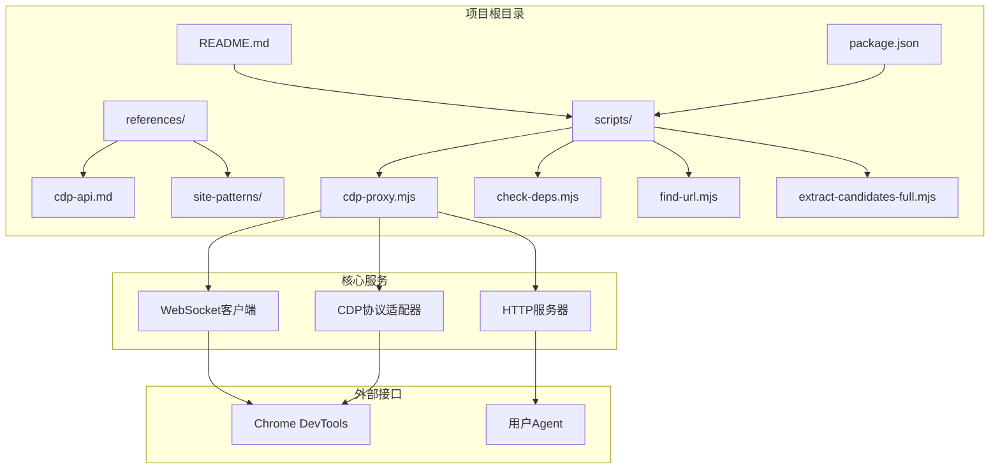
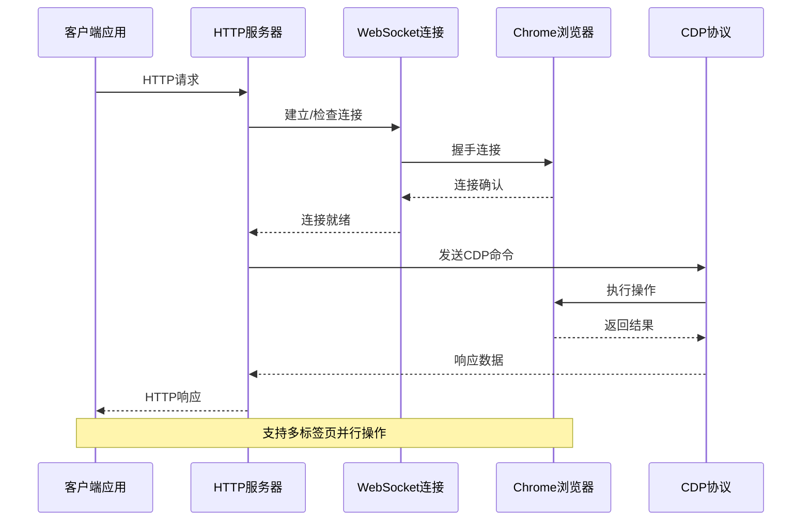
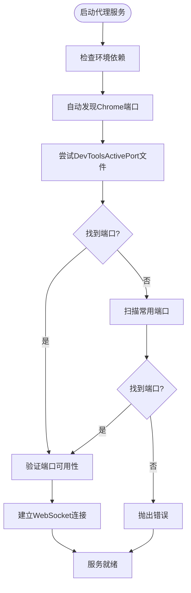
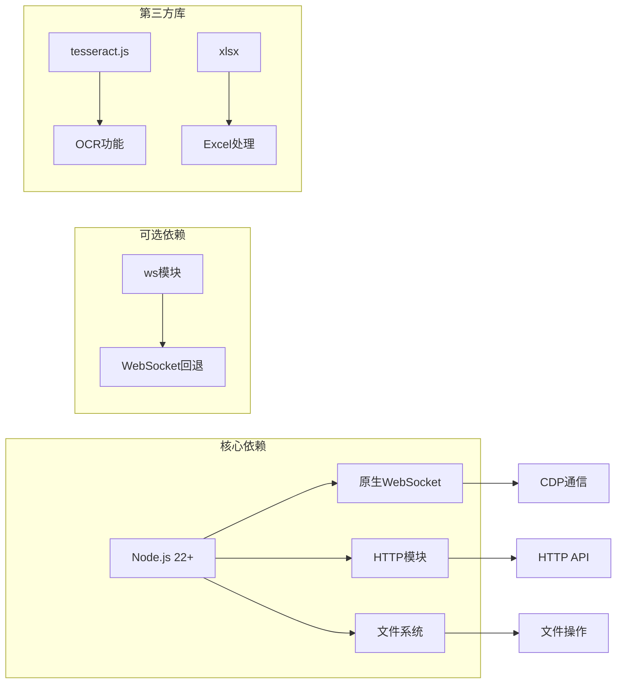
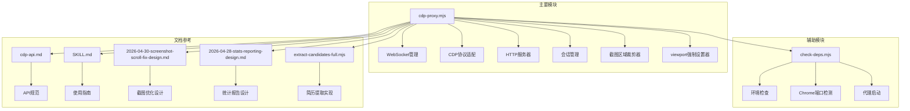
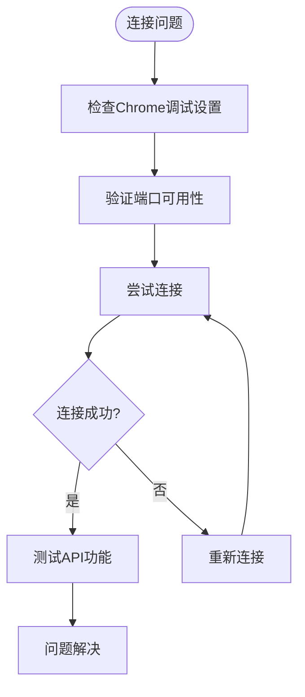

# CDP代理服务

<cite>
**本文档引用的文件**
- [README.md](file://README.md)
- [cdp-proxy.mjs](file://scripts/cdp-proxy.mjs)
- [check-deps.mjs](file://scripts/check-deps.mjs)
- [cdp-api.md](file://references/cdp-api.md)
- [SKILL.md](file://SKILL.md)
- [package.json](file://package.json)
- [2026-04-30-screenshot-scroll-fix-design.md](file://docs/superpowers/specs/2026-04-30-screenshot-scroll-fix-design.md)
- [2026-04-28-stats-reporting-design.md](file://docs/superpowers/specs/2026-04-28-stats-reporting-design.md)
- [extract-candidates-full.mjs](file://scripts/extract-candidates-full.mjs)
</cite>

## 目录
1. [简介](#简介)
2. [项目结构](#项目结构)
3. [核心组件](#核心组件)
4. [架构概览](#架构概览)
5. [详细组件分析](#详细组件分析)
6. [依赖分析](#依赖分析)
7. [性能考虑](#性能考虑)
8. [故障排除指南](#故障排除指南)
9. [结论](#结论)
10. [附录](#附录)

## 简介

CDP代理服务是一个通过HTTP API控制用户日常Chrome浏览器的中间件服务。该服务通过Chrome DevTools Protocol (CDP)直接连接到用户已开启远程调试的Chrome实例，提供完整的浏览器自动化能力，包括页面创建、导航、元素操作、截图等功能。

该服务的核心价值在于：
- **天然携带登录态**：直接操作用户日常Chrome，无需重新登录
- **真实用户手势**：支持浏览器级鼠标点击，绕过反自动化检测
- **高效自动化**：通过HTTP API简化浏览器操作流程
- **智能连接管理**：自动发现Chrome调试端口，维护WebSocket连接
- **精准截图区域裁剪**：支持精确的页面区域截图，为在线简历提取提供技术支持
- **增强的viewport控制**：支持强制设置页面viewport尺寸，解决响应式布局问题

## 项目结构



**图表来源**
- [cdp-proxy.mjs:1-631](file://scripts/cdp-proxy.mjs#L1-L631)
- [check-deps.mjs:1-172](file://scripts/check-deps.mjs#L1-L172)

**章节来源**
- [README.md:104-137](file://README.md#L104-L137)
- [package.json:1-11](file://package.json#L1-L11)

## 核心组件

### HTTP API服务器
CDP代理服务内置一个轻量级HTTP服务器，监听本地端口（默认3456），提供RESTful API接口。服务器采用异步处理模型，每个请求独立处理，支持并发访问。

### WebSocket连接管理器
负责与Chrome DevTools建立和维护WebSocket连接。支持自动发现Chrome调试端口，处理连接断开重连，以及WebSocket兼容性适配。

### CDP协议适配器
封装Chrome DevTools Protocol的所有操作，包括Target管理、Page操作、DOM查询、输入事件等。提供统一的JavaScript接口，隐藏底层协议复杂性。

### 会话管理器
维护目标页面与CDP会话的映射关系，确保每个操作都能正确路由到对应的浏览器标签页。

### 精准截图区域裁剪器
**新增功能**：支持精确的页面区域截图，通过设备像素坐标指定截图区域，为在线简历提取等应用场景提供技术支持。

### viewport强制设置器
**新增功能**：通过Emulation域的CDP命令强制设置页面viewport尺寸，解决响应式布局导致的截图问题，特别适用于后台标签页的固定尺寸需求。

**章节来源**
- [cdp-proxy.mjs:287-552](file://scripts/cdp-proxy.mjs#L287-L552)
- [cdp-proxy.mjs:113-200](file://scripts/cdp-proxy.mjs#L113-L200)

## 架构概览



**图表来源**
- [cdp-proxy.mjs:113-200](file://scripts/cdp-proxy.mjs#L113-L200)
- [cdp-proxy.mjs:202-217](file://scripts/cdp-proxy.mjs#L202-L217)

### 连接发现机制



**图表来源**
- [cdp-proxy.mjs:35-102](file://scripts/cdp-proxy.mjs#L35-L102)
- [check-deps.mjs:65-83](file://scripts/check-deps.mjs#L65-L83)

## 详细组件分析

### 健康检查端点 (/health)

**功能描述**：提供服务健康状态检查，返回连接状态、会话数量等信息。

**请求格式**
- 方法：GET
- 路径：/health
- 参数：无

**响应格式**
```json
{
  "status": "ok",
  "connected": true,
  "sessions": 3,
  "chromePort": 9222
}
```

**使用示例**
```bash
curl -s http://localhost:3456/health
```

**章节来源**
- [cdp-proxy.mjs:296-301](file://scripts/cdp-proxy.mjs#L296-L301)
- [cdp-api.md:12-16](file://references/cdp-api.md#L12-L16)

### 目标管理端点 (/targets)

**功能描述**：列出所有已打开的页面标签，返回目标信息列表。

**请求格式**
- 方法：GET
- 路径：/targets
- 参数：无

**响应格式**
```json
[
  {
    "targetId": "ABC123",
    "title": "示例页面",
    "url": "https://example.com",
    "type": "page"
  }
]
```

**使用示例**
```bash
curl -s http://localhost:3456/targets
```

**章节来源**
- [cdp-proxy.mjs:305-310](file://scripts/cdp-proxy.mjs#L305-L310)
- [cdp-api.md:18-22](file://references/cdp-api.md#L18-L22)

### 新建页面端点 (/new)

**功能描述**：创建新的后台标签页，支持自动等待页面加载完成。

**请求格式**
- 方法：GET
- 路径：/new
- 参数：
  - url: 页面URL（可选，默认about:blank）

**响应格式**
```json
{
  "targetId": "NEW123"
}
```

**使用示例**
```bash
curl -s "http://localhost:3456/new?url=https://example.com"
```

**章节来源**
- [cdp-proxy.mjs:312-327](file://scripts/cdp-proxy.mjs#L312-L327)
- [cdp-api.md:24-28](file://references/cdp-api.md#L24-L28)

### 代码执行端点 (/eval)

**功能描述**：在指定标签页执行JavaScript表达式，支持异步操作。

**请求格式**
- 方法：POST
- 路径：/eval
- 参数：target=目标ID
- Body：JavaScript表达式

**响应格式**
```json
{
  "value": "页面标题"
}
```

**错误响应**
```json
{
  "error": "执行异常信息"
}
```

**使用示例**
```bash
curl -s -X POST "http://localhost:3456/eval?target=ABC123" -d 'document.title'
```

**章节来源**
- [cdp-proxy.mjs:355-373](file://scripts/cdp-proxy.mjs#L355-L373)
- [cdp-api.md:54-58](file://references/cdp-api.md#L54-L58)

### 点击操作端点 (/click)

**功能描述**：通过JavaScript层面点击元素，自动滚动到可视区域后执行点击。

**请求格式**
- 方法：POST
- 路径：/click
- 参数：target=目标ID
- Body：CSS选择器

**响应格式**
```json
{
  "clicked": true,
  "tag": "BUTTON",
  "text": "提交按钮文本"
}
```

**错误响应**
```json
{
  "error": "未找到元素: button.submit"
}
```

**使用示例**
```bash
curl -s -X POST "http://localhost:3456/click?target=ABC123" -d 'button.submit'
```

**章节来源**
- [cdp-proxy.mjs:375-409](file://scripts/cdp-proxy.mjs#L375-L409)
- [cdp-api.md:60-64](file://references/cdp-api.md#L60-L64)

### 真实鼠标点击端点 (/clickAt)

**功能描述**：通过CDP浏览器级真实鼠标点击，模拟真实的用户手势。

**请求格式**
- 方法：POST
- 路径：/clickAt
- 参数：target=目标ID
- Body：CSS选择器

**响应格式**
```json
{
  "clicked": true,
  "x": 100,
  "y": 200,
  "tag": "BUTTON",
  "text": "上传按钮"
}
```

**使用示例**
```bash
curl -s -X POST "http://localhost:3456/clickAt?target=ABC123" -d 'button.upload'
```

**章节来源**
- [cdp-proxy.mjs:411-446](file://scripts/cdp-proxy.mjs#L411-L446)
- [cdp-api.md:66-70](file://references/cdp-api.md#L66-L70)

### 文件上传端点 (/setFiles)

**功能描述**：直接设置文件输入框的本地文件路径，完全绕过文件对话框。

**请求格式**
- 方法：POST
- 路径：/setFiles
- 参数：target=目标ID
- Body：JSON对象
  - selector: input[type=file]选择器
  - files: 文件路径数组

**响应格式**
```json
{
  "success": true,
  "files": 2
}
```

**使用示例**
```bash
curl -s -X POST "http://localhost:3456/setFiles?target=ABC123" -d '{"selector":"input[type=file]","files":["/path/to/file.png"]}'
```

**章节来源**
- [cdp-proxy.mjs:448-476](file://scripts/cdp-proxy.mjs#L448-L476)
- [cdp-api.md:72-76](file://references/cdp-api.md#L72-L76)

### 页面滚动端点 (/scroll)

**功能描述**：滚动页面，支持多种滚动方式和方向。

**请求格式**
- 方法：GET
- 路径：/scroll
- 参数：
  - target: 目标ID
  - y: 滚动距离（像素，默认3000）
  - direction: 滚动方向（down/up/top/bottom，默认down）

**响应格式**
```json
{
  "value": "scrolled to bottom"
}
```

**使用示例**
```bash
curl -s "http://localhost:3456/scroll?target=ABC123&y=3000"
curl -s "http://localhost:3456/scroll?target=ABC123&direction=bottom"
```

**章节来源**
- [cdp-proxy.mjs:478-500](file://scripts/cdp-proxy.mjs#L478-L500)
- [cdp-api.md:78-83](file://references/cdp-api.md#L78-L83)

### 截图功能端点 (/screenshot)

**功能描述**：对指定标签页进行截图，支持区域裁剪和保存到文件或返回二进制数据。

**更新**：增强截图区域裁剪功能，支持精确的页面区域截图

**请求格式**
- 方法：GET
- 路径：/screenshot
- 参数：
  - target: 目标ID
  - file: 保存文件路径（可选）
  - format: 图片格式（png/jpeg，默认png）
  - clip: 区域裁剪参数（可选），格式为"x,y,width,height"

**区域裁剪参数说明**
- clip参数使用设备像素坐标
- 格式：x,y,width,height（均为数值）
- 示例：clip=100,200,300,400

**响应格式**
```json
{
  "saved": "/tmp/shot.png"
}
```

**使用示例**
```bash
# 基础截图
curl -s "http://localhost:3456/screenshot?target=ABC123&file=/tmp/shot.png"

# 区域截图（精确裁剪）
curl -s "http://localhost:3456/screenshot?target=ABC123&file=/tmp/shot.png&clip=100,200,300,400"

# 返回二进制数据
curl -s "http://localhost:3456/screenshot?target=ABC123" > screenshot.png
```

**章节来源**
- [cdp-proxy.mjs:502-526](file://scripts/cdp-proxy.mjs#L502-L526)
- [cdp-api.md:85-89](file://references/cdp-api.md#L85-L89)

### 页面关闭端点 (/close)

**功能描述**：关闭指定的标签页。

**请求格式**
- 方法：GET
- 路径：/close
- 参数：target=目标ID

**响应格式**
```json
{
  "success": true
}
```

**使用示例**
```bash
curl -s "http://localhost:3456/close?target=ABC123"
```

**章节来源**
- [cdp-proxy.mjs:329-334](file://scripts/cdp-proxy.mjs#L329-L334)
- [cdp-api.md:30-34](file://references/cdp-api.md#L30-L34)

### 导航端点 (/navigate)

**功能描述**：在指定标签页中导航到新URL，自动等待页面加载完成。

**请求格式**
- 方法：GET
- 路径：/navigate
- 参数：
  - target: 目标ID
  - url: 目标URL

**响应格式**
```json
{
  "frameId": "ABC123",
  "loaderId": "DEF456"
}
```

**使用示例**
```bash
curl -s "http://localhost:3456/navigate?target=ABC123&url=https://example.com"
```

**章节来源**
- [cdp-proxy.mjs:336-345](file://scripts/cdp-proxy.mjs#L336-L345)

### 后退端点 (/back)

**功能描述**：在指定标签页中执行后退操作。

**请求格式**
- 方法：GET
- 路径：/back
- 参数：target=目标ID

**响应格式**
```json
{
  "ok": true
}
```

**使用示例**
```bash
curl -s "http://localhost:3456/back?target=ABC123"
```

**章节来源**
- [cdp-proxy.mjs:347-353](file://scripts/cdp-proxy.mjs#L347-L353)

### 页面信息端点 (/info)

**功能描述**：获取页面的基础信息，包括标题、URL和加载状态。

**请求格式**
- 方法：GET
- 路径：/info
- 参数：target=目标ID

**响应格式**
```json
{
  "title": "页面标题",
  "url": "https://example.com",
  "ready": "complete"
}
```

**使用示例**
```bash
curl -s "http://localhost:3456/info?target=ABC123"
```

**章节来源**
- [cdp-proxy.mjs:528-536](file://scripts/cdp-proxy.mjs#L528-L536)

### viewport强制设置端点 (/emulate)

**新增功能**：强制设置指定标签页的viewport尺寸，解决响应式布局导致的截图问题。

**功能描述**
- 支持设置固定宽度和高度
- 支持清除强制设置，恢复默认行为
- 适用于后台标签页的固定尺寸需求

**请求格式**
- 方法：GET
- 路径：/emulate
- 参数：
  - target: 目标ID
  - width: 视口宽度（默认1440）
  - height: 视口高度（默认900）
  - reset: 是否清除强制设置（1或true清除）

**响应格式**
```json
{
  "width": 1920,
  "height": 1080,
  "applied": true
}
```

**使用示例**
```bash
# 设置viewport为1920x1080
curl -s "http://localhost:3456/emulate?target=ABC123&width=1920&height=1080"

# 清除强制设置
curl -s "http://localhost:3456/emulate?target=ABC123&reset=1"
```

**章节来源**
- [cdp-proxy.mjs:528-545](file://scripts/cdp-proxy.mjs#L528-L545)

## 依赖分析

### 外部依赖



**图表来源**
- [package.json:6-9](file://package.json#L6-L9)
- [cdp-proxy.mjs:6-11](file://scripts/cdp-proxy.mjs#L6-L11)

### 内部模块依赖



**图表来源**
- [cdp-proxy.mjs:1-17](file://scripts/cdp-proxy.mjs#L1-L17)
- [check-deps.mjs:1-14](file://scripts/check-deps.mjs#L1-L14)

**章节来源**
- [package.json:1-11](file://package.json#L1-L11)
- [cdp-proxy.mjs:1-33](file://scripts/cdp-proxy.mjs#L1-L33)

## 性能考虑

### 连接优化策略

1. **连接复用**：WebSocket连接建立后长期复用，避免频繁重建
2. **会话缓存**：Target与Session映射缓存，减少attach操作
3. **超时控制**：CDP命令超时30秒，防止阻塞影响整体性能

### 内存管理

1. **Map数据结构**：使用Map存储会话和待处理请求，便于清理
2. **定时器清理**：超时后自动清理pending队列
3. **连接断开处理**：自动清理sessions映射

### 网络优化

1. **端口探测优化**：先TCP探测避免触发Chrome安全弹窗
2. **多平台支持**：自动适配不同操作系统的Chrome配置路径
3. **错误重试**：连接失败时自动重试，提高成功率

### 精准截图优化

**新增优化策略**：
1. **区域裁剪优化**：精确的设备像素坐标裁剪，减少不必要的图像处理
2. **批量截图优化**：结合在线简历提取场景，支持多页区域截图
3. **内存管理**：大尺寸截图时的内存使用优化
4. **截图稳定性**：增强的错误处理和重试机制

### viewport控制优化

**新增优化策略**：
1. **后台标签页专用**：专门针对后台标签页的固定尺寸需求
2. **响应式布局适配**：解决响应式网站的截图问题
3. **性能影响最小化**：仅在必要时应用强制设置

## 故障排除指南

### 常见错误类型

| 错误类型 | 原因 | 解决方案 |
|---------|------|----------|
| Chrome未开启远程调试端口 | Chrome未启用远程调试 | 在chrome://inspect/#remote-debugging中勾选"Allow remote debugging" |
| attach失败 | targetId无效或标签页已关闭 | 使用/targets获取最新标签列表 |
| CDP命令超时 | 页面长时间未响应 | 检查标签页状态，重试操作 |
| 端口已被占用 | 另一个代理实例正在运行 | 系统会自动复用现有实例 |
| 区域裁剪参数错误 | clip参数格式不正确 | 确保格式为"x,y,width,height"且均为有效数值 |
| viewport设置失败 | Emulation域不可用 | 确认Chrome版本支持Emulation API |

### 调试技巧

1. **查看日志文件**：代理会在临时目录创建cdp-proxy.log
2. **健康检查**：使用/health端点确认服务状态
3. **环境检查**：运行check-deps.mjs验证依赖

### 连接问题排查



**章节来源**
- [cdp-api.md:99-107](file://references/cdp-api.md#L99-L107)
- [check-deps.mjs:143-172](file://scripts/check-deps.mjs#L143-L172)

## 结论

CDP代理服务提供了一个强大而易用的浏览器自动化解决方案。通过HTTP API简化了复杂的Chrome DevTools Protocol操作，使得开发者能够轻松实现各种浏览器自动化任务。

### 主要优势

1. **简单易用**：HTTP API设计直观，学习成本低
2. **功能完整**：覆盖浏览器自动化的主要场景
3. **性能优秀**：连接复用和优化策略确保高效运行
4. **稳定可靠**：完善的错误处理和重连机制
5. **精准裁剪**：新增的区域裁剪功能为专业应用场景提供支持
6. **智能viewport控制**：新增的viewport强制设置功能解决响应式布局问题

### 应用场景

- 网页数据提取和分析
- 自动化测试和质量保证
- 社交媒体内容管理
- 企业内部系统自动化
- 在线表单填写和提交
- **在线简历提取和OCR处理**（新增）
- **响应式网站截图和测试**（新增）

## 附录

### 环境要求

- **Node.js 22+**：使用原生WebSocket支持
- **Chrome浏览器**：已开启远程调试功能
- **操作系统**：Windows、macOS、Linux均支持

### 安装和启动

```bash
# 一键安装
npx skills add eze-is/web-access

# 环境检查
node "${CLAUDE_SKILL_DIR}/scripts/check-deps.mjs"

# 启动代理
node "${CLAUDE_SKILL_DIR}/scripts/cdp-proxy.mjs" &
```

### 最佳实践

1. **保持代理常驻**：避免频繁重启导致的Chrome重新授权
2. **合理使用会话**：及时关闭不需要的标签页
3. **监控连接状态**：定期检查/health端点
4. **错误处理**：为所有API调用添加适当的错误处理
5. **区域裁剪最佳实践**：
   - 使用设备像素坐标进行精确裁剪
   - 在截图前确保元素可见性
   - 对于大区域截图，考虑分批处理以优化内存使用
6. **viewport设置最佳实践**：
   - 仅在必要时使用强制设置
   - 后台标签页优先考虑固定尺寸
   - 注意响应式布局的兼容性

### 区域裁剪使用指南

**设备像素坐标转换**：
- 获取元素边界矩形时使用`getBoundingClientRect()`
- 坐标单位为设备像素，不受缩放影响
- 建议在截图前使用`scrollIntoView`确保元素可见

**常见应用场景**：
- 在线简历提取：精确裁剪简历弹窗区域
- 数据表格截图：只截取关键数据区域
- 广告位截图：避免包含无关元素
- 多元素组合截图：将多个元素合并到单一截图中

**注意事项**：
- 确保clip参数格式正确：x,y,width,height
- 验证坐标在页面范围内
- 考虑页面滚动对坐标的影响
- 对于动态内容，截图前等待渲染完成

### viewport强制设置使用指南

**适用场景**：
- 响应式网站的固定尺寸截图
- 后台标签页的标准化显示
- 需要稳定布局的自动化测试

**使用建议**：
- 默认尺寸1440x900适合大多数场景
- 需要更高分辨率时可调整width和height
- 使用reset参数清除强制设置
- 注意与页面实际布局的兼容性

**注意事项**：
- 强制设置会影响页面渲染
- 某些网站可能不支持Emulation API
- 建议在测试环境中验证效果
- 及时清理强制设置避免影响其他页面