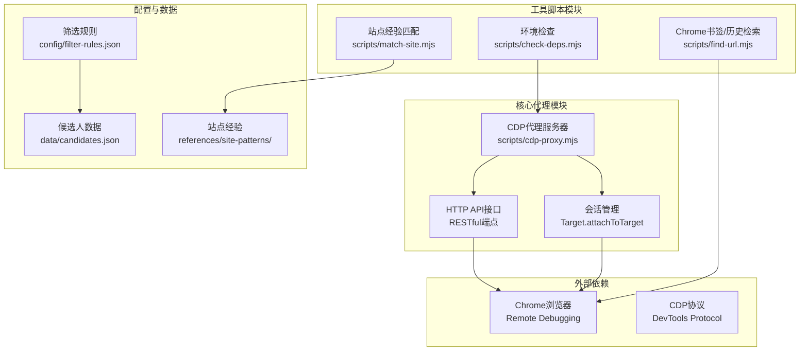
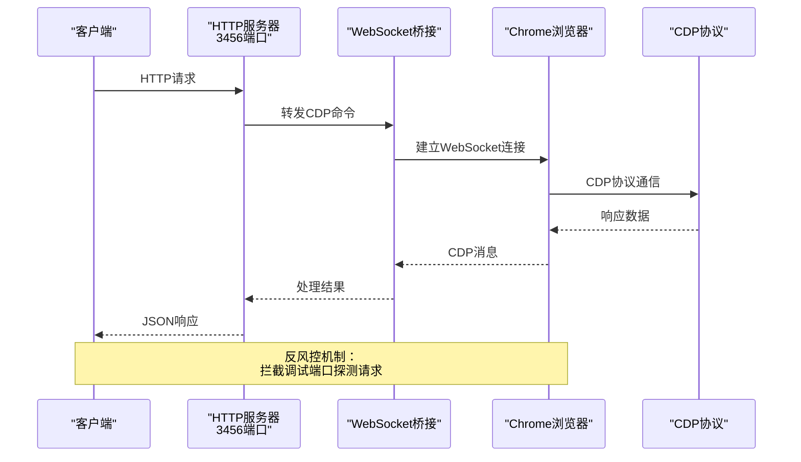
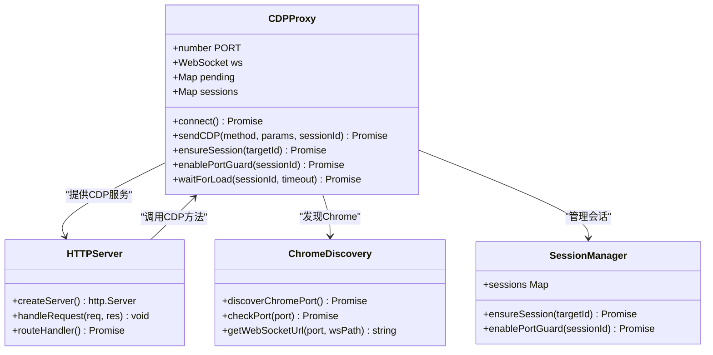
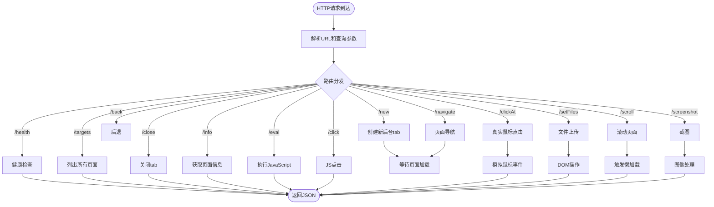
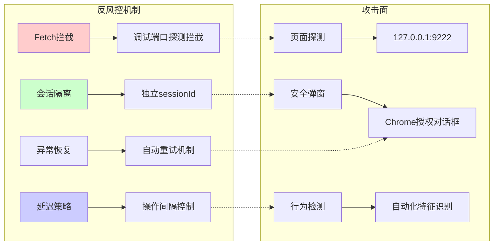
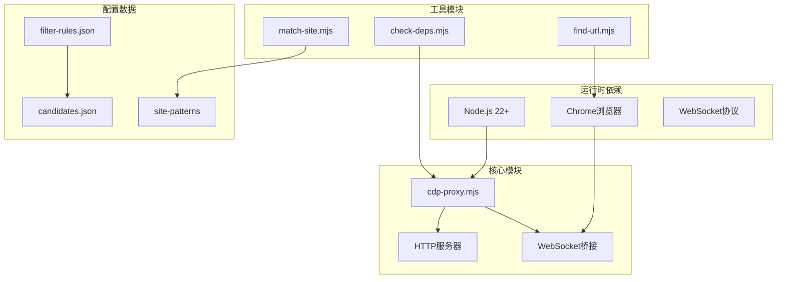

# CDP代理概述

<cite>
**本文档引用的文件**
- [README.md](file://README.md)
- [SKILL.md](file://SKILL.md)
- [package.json](file://package.json)
- [scripts/cdp-proxy.mjs](file://scripts/cdp-proxy.mjs)
- [scripts/check-deps.mjs](file://scripts/check-deps.mjs)
- [scripts/find-url.mjs](file://scripts/find-url.mjs)
- [scripts/match-site.mjs](file://scripts/match-site.mjs)
- [references/cdp-api.md](file://references/cdp-api.md)
- [references/site-patterns/zhipin.com.md](file://references/site-patterns/zhipin.com.md)
- [config/filter-rules.json](file://config/filter-rules.json)
- [data/candidates.json](file://data/candidates.json)
</cite>

## 目录
1. [简介](#简介)
2. [项目结构](#项目结构)
3. [核心组件](#核心组件)
4. [架构总览](#架构总览)
5. [详细组件分析](#详细组件分析)
6. [依赖关系分析](#依赖关系分析)
7. [性能考虑](#性能考虑)
8. [故障排除指南](#故障排除指南)
9. [结论](#结论)
10. [附录](#附录)

## 简介
CDP代理服务是一个通过HTTP API控制Chrome浏览器实例的自动化工具，基于Chrome DevTools Protocol（CDP）协议实现。该项目的核心价值在于：
- 将复杂的CDP调用封装为简洁的RESTful API，降低浏览器自动化门槛
- 直连用户日常Chrome实例，天然携带登录态，无需启动独立浏览器
- 提供完整的反风控机制，包括调试端口探测拦截和会话管理
- 支持多种页面操作：导航、点击、滚动、截图、文件上传等
- 通过站点经验文件实现可复用的自动化流程

## 项目结构
该项目采用模块化设计，主要包含以下核心模块：



**图表来源**
- [scripts/cdp-proxy.mjs:1-602](file://scripts/cdp-proxy.mjs#L1-L602)
- [scripts/check-deps.mjs:1-172](file://scripts/check-deps.mjs#L1-L172)
- [scripts/find-url.mjs:1-215](file://scripts/find-url.mjs#L1-L215)

**章节来源**
- [README.md:1-168](file://README.md#L1-L168)
- [package.json:1-11](file://package.json#L1-L11)

## 核心组件
CDP代理系统由以下核心组件构成：

### 1. CDP代理服务器
- **职责**：建立WebSocket连接到Chrome，提供HTTP API接口
- **特性**：自动发现Chrome调试端口、会话管理、反风控保护
- **端口**：默认3456，可通过环境变量配置

### 2. HTTP API接口
- **端点**：/targets、/new、/close、/navigate、/back、/info、/eval、/click、/clickAt、/setFiles、/scroll、/screenshot
- **方法**：GET/POST混合，支持查询参数和请求体
- **响应**：统一JSON格式，错误码标准化

### 3. 会话管理系统
- **目标管理**：Target.createTarget、Target.closeTarget、Target.getTargets
- **会话绑定**：Target.attachToTarget + sessionId路由
- **生命周期**：自动创建、自动清理、异常恢复

**章节来源**
- [scripts/cdp-proxy.mjs:287-552](file://scripts/cdp-proxy.mjs#L287-L552)
- [references/cdp-api.md:10-98](file://references/cdp-api.md#L10-L98)

## 架构总览
CDP代理采用"HTTP API + WebSocket桥接"的双层架构设计：



**图表来源**
- [scripts/cdp-proxy.mjs:113-200](file://scripts/cdp-proxy.mjs#L113-L200)
- [scripts/cdp-proxy.mjs:235-248](file://scripts/cdp-proxy.mjs#L235-L248)

### 技术架构要点
1. **WebSocket兼容层**：支持Node.js 22+原生WebSocket和ws模块回退
2. **自动端口发现**：跨平台扫描DevToolsActivePort文件和常见端口
3. **反风控机制**：拦截Fetch.requestPaused，阻止页面探测调试端口
4. **会话隔离**：每个targetId对应独立sessionId，支持并发操作

**章节来源**
- [scripts/cdp-proxy.mjs:19-33](file://scripts/cdp-proxy.mjs#L19-L33)
- [scripts/cdp-proxy.mjs:35-91](file://scripts/cdp-proxy.mjs#L35-L91)

## 详细组件分析

### CDP代理服务器组件
CDP代理服务器是整个系统的核心，负责协调HTTP API和WebSocket通信：



**图表来源**
- [scripts/cdp-proxy.mjs:13-18](file://scripts/cdp-proxy.mjs#L13-L18)
- [scripts/cdp-proxy.mjs:113-200](file://scripts/cdp-proxy.mjs#L113-L200)

#### WebSocket连接管理
- **连接状态**：OPEN/CLOSED状态跟踪，自动重连机制
- **消息路由**：根据sessionId分发CDP消息
- **超时处理**：30秒命令超时，防止挂起
- **异常恢复**：连接断开时清理状态，下次请求自动重建

#### 会话管理机制
- **Target.attachToTarget**：为每个页面创建独立会话
- **sessionId缓存**：sessions Map存储targetId到sessionId映射
- **Fetch域启用**：为会话启用Fetch调试能力
- **端口探测拦截**：仅拦截127.0.0.1:chromePort的请求

**章节来源**
- [scripts/cdp-proxy.mjs:202-233](file://scripts/cdp-proxy.mjs#L202-L233)
- [scripts/cdp-proxy.mjs:235-248](file://scripts/cdp-proxy.mjs#L235-L248)

### HTTP API接口组件
HTTP API提供了丰富的浏览器自动化操作接口：



**图表来源**
- [scripts/cdp-proxy.mjs:287-552](file://scripts/cdp-proxy.mjs#L287-L552)

#### API端点设计原则
- **一致性**：所有端点返回统一JSON格式
- **幂等性**：GET端点设计为幂等操作
- **错误处理**：标准化HTTP状态码和错误信息
- **超时控制**：合理设置操作超时时间

**章节来源**
- [references/cdp-api.md:10-98](file://references/cdp-api.md#L10-L98)

### 反风控机制组件
CDP代理实现了多层次的反风控保护：



**图表来源**
- [scripts/cdp-proxy.mjs:169-173](file://scripts/cdp-proxy.mjs#L169-L173)
- [scripts/cdp-proxy.mjs:235-248](file://scripts/cdp-proxy.mjs#L235-L248)

#### 核心反风控技术
1. **Fetch.requestPaused拦截**：阻止页面探测调试端口
2. **TCP端口探测**：避免WebSocket触发安全弹窗
3. **会话隔离**：每个target独立sessionId，减少关联性
4. **操作延迟**：合理的时间间隔避免过于规律的操作模式

**章节来源**
- [scripts/cdp-proxy.mjs:169-173](file://scripts/cdp-proxy.mjs#L169-L173)
- [scripts/cdp-proxy.mjs:93-102](file://scripts/cdp-proxy.mjs#L93-L102)

## 依赖关系分析
项目依赖关系呈现清晰的层次结构：



**图表来源**
- [package.json:6-9](file://package.json#L6-L9)
- [scripts/check-deps.mjs:17-25](file://scripts/check-deps.mjs#L17-L25)

### 外部依赖
- **tesseract.js**：OCR识别，用于简历提取
- **xlsx**：Excel文件处理，用于候选人数据导出

### 内部依赖关系
- cdp-proxy.mjs依赖Node.js原生模块（http、url、fs、path、os、net、WebSocket）
- check-deps.mjs提供环境检查和代理启动管理
- 工具脚本相互独立，可单独使用

**章节来源**
- [package.json:1-11](file://package.json#L1-L11)

## 性能考虑
CDP代理在设计时充分考虑了性能和可靠性：

### 连接管理优化
- **连接复用**：单个WebSocket连接复用多个CDP命令
- **异步处理**：使用Promise和async/await避免阻塞
- **超时控制**：30秒命令超时，防止资源泄漏
- **自动重连**：连接断开时自动恢复

### 内存管理
- **Map缓存**：sessions和pending使用Map结构，支持垃圾回收
- **定时器清理**：超时后及时清理定时器和回调
- **文件I/O**：截图等操作使用流式处理，避免内存峰值

### 并发控制
- **队列管理**：CDP命令按序排队执行
- **会话隔离**：避免不同页面间的相互影响
- **资源限制**：合理设置超时和重试次数

## 故障排除指南

### 常见问题诊断
1. **Chrome未开启远程调试**
   - 检查chrome://inspect/#remote-debugging设置
   - 确认Allow remote debugging已勾选
   - 重启浏览器使设置生效

2. **端口占用问题**
   - 使用check-deps.mjs自动检测端口
   - 端口3456被占用时自动寻找可用端口
   - 强制停止使用pkill -f cdp-proxy.mjs

3. **CDP命令超时**
   - 检查页面加载状态
   - 确认targetId有效
   - 增加等待时间或重试

### 调试技巧
- 使用/health端点检查代理状态
- 通过/.targets获取当前页面列表
- 查看代理日志文件（cdp-proxy.log）

**章节来源**
- [scripts/check-deps.mjs:143-172](file://scripts/check-deps.mjs#L143-L172)
- [references/cdp-api.md:99-107](file://references/cdp-api.md#L99-L107)

## 结论
CDP代理服务通过HTTP API抽象了复杂的CDP协议，为浏览器自动化提供了简洁、可靠的解决方案。其核心优势包括：

1. **易用性**：RESTful API大幅降低了浏览器自动化的技术门槛
2. **可靠性**：完善的错误处理和超时控制机制
3. **安全性**：多层次反风控保护，避免被平台检测
4. **扩展性**：模块化设计支持功能扩展和定制
5. **实用性**：针对具体业务场景的优化和最佳实践

该系统特别适用于需要真实浏览器环境的网络任务，如网页抓取、表单填写、动态内容提取等场景。

## 附录

### 系统要求
- **Node.js 22+**：使用原生WebSocket支持
- **Chrome浏览器**：开启远程调试功能
- **操作系统**：Windows、Linux、macOS均支持

### 基本使用场景
1. **网页自动化**：自动填写表单、点击按钮、提取数据
2. **内容抓取**：动态渲染页面的数据提取
3. **登录态维护**：利用用户Chrome的登录状态
4. **媒体资源提取**：图片、视频等资源的批量下载
5. **候选人筛选**：结合站点经验的结构化数据提取

### API使用示例
```bash
# 健康检查
curl -s http://localhost:3456/health

# 创建新tab
curl -s "http://localhost:3456/new?url=https://example.com"

# 执行JavaScript
curl -s -X POST "http://localhost:3456/eval?target=ID" -d 'document.title'

# 真实鼠标点击
curl -s -X POST "http://localhost:3456/clickAt?target=ID" -d '.upload-btn'

# 截图
curl -s "http://localhost:3456/screenshot?target=ID&file=/tmp/shot.png"
```

**章节来源**
- [README.md:104-137](file://README.md#L104-L137)
- [references/cdp-api.md:12-89](file://references/cdp-api.md#L12-L89)