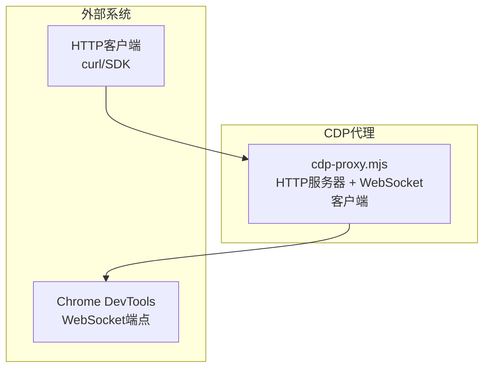
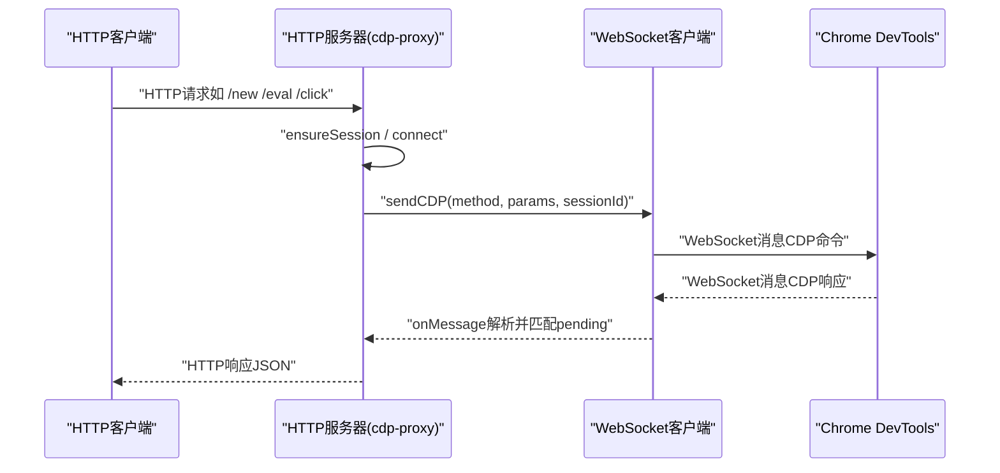
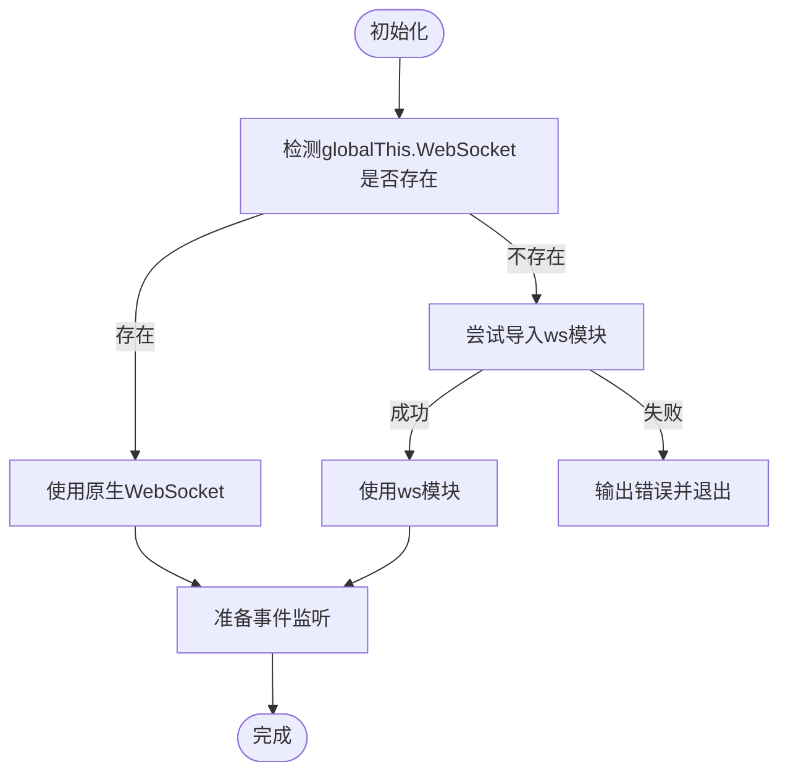
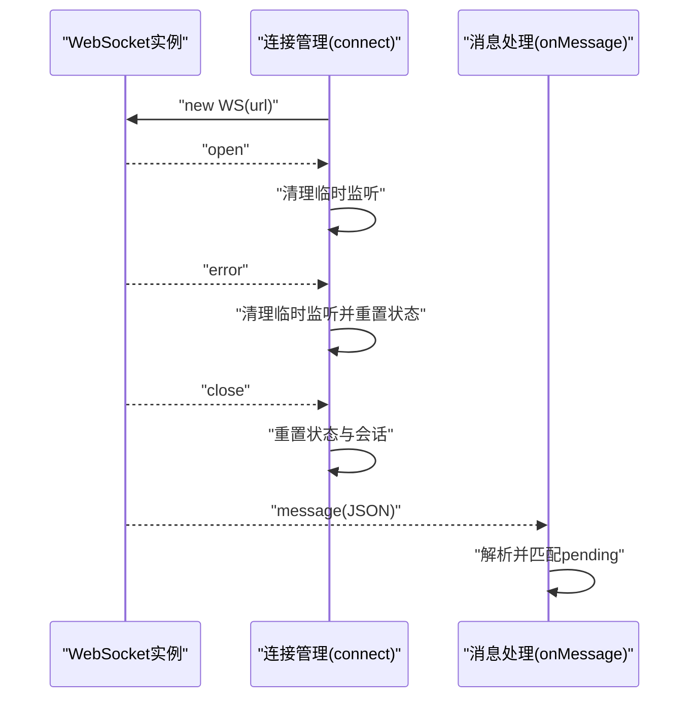
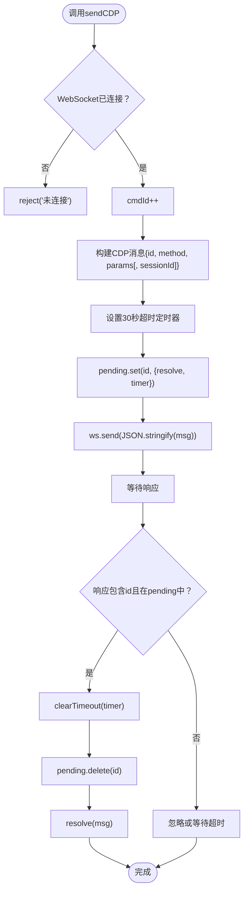
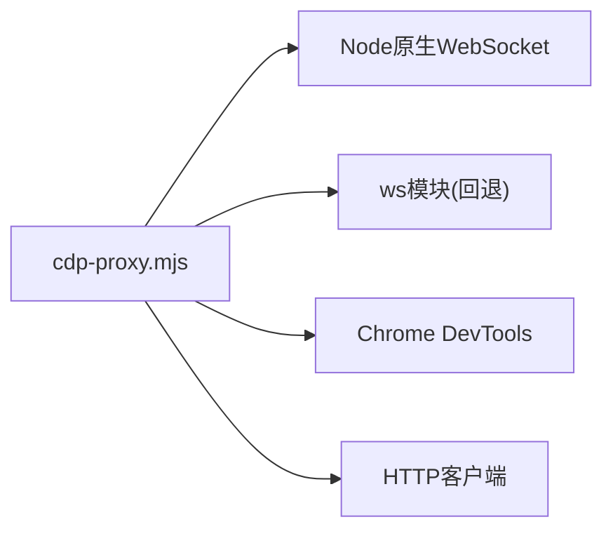

# WebSocket通信

<cite>
**本文引用的文件**
- [cdp-proxy.mjs](file://scripts/cdp-proxy.mjs)
- [check-deps.mjs](file://scripts/check-deps.mjs)
- [cdp-api.md](file://references/cdp-api.md)
- [README.md](file://README.md)
</cite>

## 目录
1. [简介](#简介)
2. [项目结构](#项目结构)
3. [核心组件](#核心组件)
4. [架构总览](#架构总览)
5. [组件详细分析](#组件详细分析)
6. [依赖关系分析](#依赖关系分析)
7. [性能考量](#性能考量)
8. [故障排查指南](#故障排查指南)
9. [结论](#结论)

## 简介
本文件面向CDP代理的WebSocket通信机制，聚焦Node.js 22+原生WebSocket支持与ws模块回退、消息传递协议、请求-响应模式与异步处理、CDP消息格式与ID分配策略、超时处理、事件监听器注册与注销、pending请求队列管理与内存泄漏防护、以及连接状态监控与调试技巧。文档基于仓库中的脚本实现进行技术解读，并提供可视化图示帮助理解。

## 项目结构
- WebSocket代理位于 scripts/cdp-proxy.mjs，负责：
  - 自动发现Chrome调试端口并建立WebSocket连接
  - 兼容Node原生WebSocket与ws模块
  - 实现CDP命令发送与响应匹配（基于id）
  - 管理会话（session）与目标（target）映射
  - 提供HTTP API以驱动浏览器自动化
- 依赖检查脚本 scripts/check-deps.mjs 提供环境检测与代理就绪保障
- API参考文档 references/cdp-api.md 描述HTTP API端点与行为
- README.md 提供整体背景、前置条件与使用说明

图表来源
- [cdp-proxy.mjs:1-602](file://scripts/cdp-proxy.mjs#L1-L602)

章节来源
- [cdp-proxy.mjs:1-602](file://scripts/cdp-proxy.mjs#L1-L602)
- [check-deps.mjs:1-172](file://scripts/check-deps.mjs#L1-L172)
- [cdp-api.md:1-107](file://references/cdp-api.md#L1-L107)
- [README.md:104-137](file://README.md#L104-L137)

## 核心组件
- WebSocket兼容层：根据运行时选择原生WebSocket或ws模块，保证Node 22+与旧版本的兼容
- 连接管理：自动发现Chrome调试端口、建立连接、处理open/error/close/message事件
- 请求-响应与ID分配：sendCDP为每个命令分配自增id，结合pending队列与定时器实现超时控制
- 会话管理：Target.attachToTarget后维护targetId到sessionId的映射，用于后续CDP调用
- HTTP API：提供/health、/targets、/new、/close、/navigate、/back、/eval、/click、/clickAt、/setFiles、/scroll、/screenshot、/info等端点
- 反风控：拦截页面对Chrome调试端口的探测请求，避免触发安全弹窗

章节来源
- [cdp-proxy.mjs:14-33](file://scripts/cdp-proxy.mjs#L14-L33)
- [cdp-proxy.mjs:114-200](file://scripts/cdp-proxy.mjs#L114-L200)
- [cdp-proxy.mjs:202-217](file://scripts/cdp-proxy.mjs#L202-L217)
- [cdp-proxy.mjs:222-233](file://scripts/cdp-proxy.mjs#L222-L233)
- [cdp-proxy.mjs:288-552](file://scripts/cdp-proxy.mjs#L288-L552)
- [cdp-proxy.mjs:169-173](file://scripts/cdp-proxy.mjs#L169-L173)

## 架构总览
CDP代理采用“HTTP API驱动 + WebSocket直连Chrome”的架构。HTTP服务器接收外部请求，内部通过WebSocket与Chrome DevTools建立长连接，将CDP命令下发至Chrome并等待响应。代理内置反风控逻辑，拦截页面对调试端口的探测请求。

图表来源
- [cdp-proxy.mjs:288-552](file://scripts/cdp-proxy.mjs#L288-L552)
- [cdp-proxy.mjs:114-200](file://scripts/cdp-proxy.mjs#L114-L200)
- [cdp-proxy.mjs:202-217](file://scripts/cdp-proxy.mjs#L202-L217)

## 组件详细分析

### WebSocket客户端与兼容层
- 兼容策略：优先使用全局WebSocket（Node 22+），否则回退到ws模块；若两者都不可用则终止进程
- 事件API适配：兼容ws模块的on与addEventListener两种事件注册方式
- 连接状态：通过readyState判断连接状态，/health端点返回connected标志

图表来源
- [cdp-proxy.mjs:20-33](file://scripts/cdp-proxy.mjs#L20-L33)

章节来源
- [cdp-proxy.mjs:20-33](file://scripts/cdp-proxy.mjs#L20-L33)
- [cdp-proxy.mjs:187-198](file://scripts/cdp-proxy.mjs#L187-L198)
- [cdp-proxy.mjs:297-299](file://scripts/cdp-proxy.mjs#L297-L299)

### 连接管理与事件处理
- 自动发现Chrome调试端口：优先读取DevToolsActivePort文件，其次扫描常见端口
- 建立连接：构造wsUrl并创建WebSocket实例
- 事件处理：
  - open：清理临时监听，记录连接成功
  - error：清理临时监听，重置连接状态，输出错误日志
  - close：记录断开，重置连接状态与会话映射
  - message：解析CDP消息，处理Target.attachedToTarget与Fetch.requestPaused，匹配pending队列并resolve
- 清理策略：cleanup移除open与error事件监听，避免重复绑定

图表来源
- [cdp-proxy.mjs:114-200](file://scripts/cdp-proxy.mjs#L114-L200)
- [cdp-proxy.mjs:161-180](file://scripts/cdp-proxy.mjs#L161-L180)

章节来源
- [cdp-proxy.mjs:36-91](file://scripts/cdp-proxy.mjs#L36-L91)
- [cdp-proxy.mjs:114-200](file://scripts/cdp-proxy.mjs#L114-L200)
- [cdp-proxy.mjs:161-180](file://scripts/cdp-proxy.mjs#L161-L180)

### 请求-响应模式与异步处理
- sendCDP：为每个命令分配自增id，构建CDP消息，设置30秒超时定时器，加入pending队列，发送至WebSocket
- 响应匹配：收到消息后若包含id且在pending中，则清除定时器、删除pending条目并resolve
- 会话支持：可选传入sessionId，用于多目标/多标签页场景

图表来源
- [cdp-proxy.mjs:202-217](file://scripts/cdp-proxy.mjs#L202-L217)
- [cdp-proxy.mjs:174-179](file://scripts/cdp-proxy.mjs#L174-L179)

章节来源
- [cdp-proxy.mjs:202-217](file://scripts/cdp-proxy.mjs#L202-L217)
- [cdp-proxy.mjs:174-179](file://scripts/cdp-proxy.mjs#L174-L179)

### CDP消息格式、ID分配与超时
- 消息格式：标准CDP消息，包含id（请求）、method（方法名）、params（参数）、sessionId（可选）
- ID分配：全局自增cmdId，确保请求-响应一一对应
- 超时策略：每条请求设置30秒超时，超时后从pending删除并reject
- 反风控：拦截Fetch.requestPaused并failRequest，避免页面探测调试端口触发弹窗

章节来源
- [cdp-proxy.mjs:207-213](file://scripts/cdp-proxy.mjs#L207-L213)
- [cdp-proxy.mjs:169-173](file://scripts/cdp-proxy.mjs#L169-L173)

### 事件监听器注册与注销机制
- 注册：根据WebSocket实例是否提供on方法，分别使用ws.on或ws.addEventListener
- 注销：在连接成功后清理临时open与error监听，避免重复绑定
- 生命周期：open/error/close/message均在connect内部定义，随连接复用与重置而更新

章节来源
- [cdp-proxy.mjs:187-198](file://scripts/cdp-proxy.mjs#L187-L198)
- [cdp-proxy.mjs:182-185](file://scripts/cdp-proxy.mjs#L182-L185)

### pending请求队列管理与内存泄漏防护
- 数据结构：Map(id -> {resolve, timer})
- 生命周期：
  - 成功：收到响应后clearTimeout并delete，resolve
  - 超时：定时器触发时从pending删除并reject
  - 断开：close事件中clear会话映射，避免悬挂引用
- 防泄漏：确保resolve/reject后及时删除，close时清理映射

章节来源
- [cdp-proxy.mjs:16-17](file://scripts/cdp-proxy.mjs#L16-L17)
- [cdp-proxy.mjs:174-179](file://scripts/cdp-proxy.mjs#L174-L179)
- [cdp-proxy.mjs:210-213](file://scripts/cdp-proxy.mjs#L210-L213)
- [cdp-proxy.mjs:154-160](file://scripts/cdp-proxy.mjs#L154-L160)

### 会话管理与Target.attachToTarget
- sessions映射：targetId -> sessionId，用于后续CDP调用
- ensureSession：若不存在则调用Target.attachToTarget并启用Fetch拦截
- enablePortGuard：仅对127.0.0.1:chromePort与localhost:chromePort的请求拦截，避免影响其他本地服务

章节来源
- [cdp-proxy.mjs:16-17](file://scripts/cdp-proxy.mjs#L16-L17)
- [cdp-proxy.mjs:222-233](file://scripts/cdp-proxy.mjs#L222-L233)
- [cdp-proxy.mjs:237-248](file://scripts/cdp-proxy.mjs#L237-L248)

### HTTP API与WebSocket交互
- /health：返回连接状态、会话数与端口
- /targets：列出所有页面tab
- /new：创建新后台tab并等待加载
- /close：关闭指定tab
- /navigate：导航并等待加载
- /back：后退并等待加载
- /eval：执行JS表达式
- /click：JS点击（自动scrollIntoView）
- /clickAt：真实鼠标点击（Input.dispatchMouseEvent）
- /setFiles：设置文件（DOM.setFileInputFiles）
- /scroll：滚动页面
- /screenshot：截图（可保存到文件或返回二进制）
- /info：获取页面基础信息

章节来源
- [cdp-proxy.mjs:288-552](file://scripts/cdp-proxy.mjs#L288-L552)
- [cdp-api.md:10-98](file://references/cdp-api.md#L10-L98)

### 连接状态监控与调试技巧
- /health端点：检查WebSocket连接状态与会话数
- 连接日志：open/close/error事件输出详细状态
- 依赖检查：check-deps.mjs检测Node版本、Chrome调试端口、代理就绪状态
- 代理就绪：ensureProxy通过轮询/health与/targets确认代理可用

章节来源
- [cdp-proxy.mjs:297-299](file://scripts/cdp-proxy.mjs#L297-L299)
- [cdp-proxy.mjs:138-159](file://scripts/cdp-proxy.mjs#L138-L159)
- [check-deps.mjs:107-139](file://scripts/check-deps.mjs#L107-L139)

## 依赖关系分析
- 运行时依赖：Node.js 22+（原生WebSocket）或ws模块
- 系统依赖：Chrome开启远程调试（DevToolsActivePort或常见端口）
- 内部耦合：HTTP服务器与WebSocket客户端紧密耦合，通过connect与sendCDP协调
- 外部接口：Chrome DevTools WebSocket端点

图表来源
- [cdp-proxy.mjs:20-33](file://scripts/cdp-proxy.mjs#L20-L33)
- [cdp-proxy.mjs:114-200](file://scripts/cdp-proxy.mjs#L114-L200)

章节来源
- [cdp-proxy.mjs:20-33](file://scripts/cdp-proxy.mjs#L20-L33)
- [cdp-proxy.mjs:114-200](file://scripts/cdp-proxy.mjs#L114-L200)

## 性能考量
- 连接复用：通过connectingPromise避免并发连接；连接成功后复用同一ws实例
- 超时控制：30秒请求超时，防止阻塞；close时清理会话映射
- 轮询等待：waitForLoad使用定时器轮询document.readyState，避免长时间阻塞
- 反风控：拦截调试端口探测，减少不必要的安全弹窗与重试成本

章节来源
- [cdp-proxy.mjs:114-116](file://scripts/cdp-proxy.mjs#L114-L116)
- [cdp-proxy.mjs:202-217](file://scripts/cdp-proxy.mjs#L202-L217)
- [cdp-proxy.mjs:251-278](file://scripts/cdp-proxy.mjs#L251-L278)
- [cdp-proxy.mjs:169-173](file://scripts/cdp-proxy.mjs#L169-L173)

## 故障排查指南
- “未连接”错误：检查Chrome远程调试是否开启，使用/health确认连接状态
- “端口已被占用”：已有代理实例运行，可直接复用；或强制停止后重启
- “attach失败”：targetId无效或tab已关闭，使用/targets刷新列表
- “CDP命令超时”：页面长时间未响应，检查tab状态或重试
- “Chrome未开启远程调试端口”：根据README指引开启并允许远程调试

章节来源
- [cdp-proxy.mjs:120-127](file://scripts/cdp-proxy.mjs#L120-L127)
- [cdp-proxy.mjs:566-584](file://scripts/cdp-proxy.mjs#L566-L584)
- [cdp-proxy.mjs:232](file://scripts/cdp-proxy.mjs#L232)
- [cdp-proxy.mjs:212](file://scripts/cdp-proxy.mjs#L212)
- [README.md:106-117](file://README.md#L106-L117)

## 结论
该CDP代理通过原生WebSocket与ws模块的兼容层、严格的请求-响应匹配与超时控制、完善的会话与事件处理机制，实现了稳定可靠的浏览器自动化能力。配合HTTP API与反风控策略，能够在多种环境下高效地驱动Chrome执行复杂交互任务。建议在生产环境中关注连接复用、超时与内存清理策略，确保长期运行的稳定性。