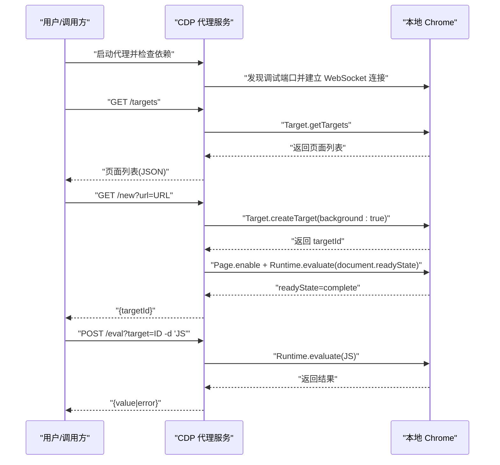
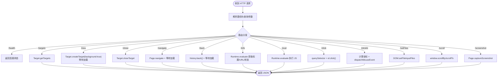
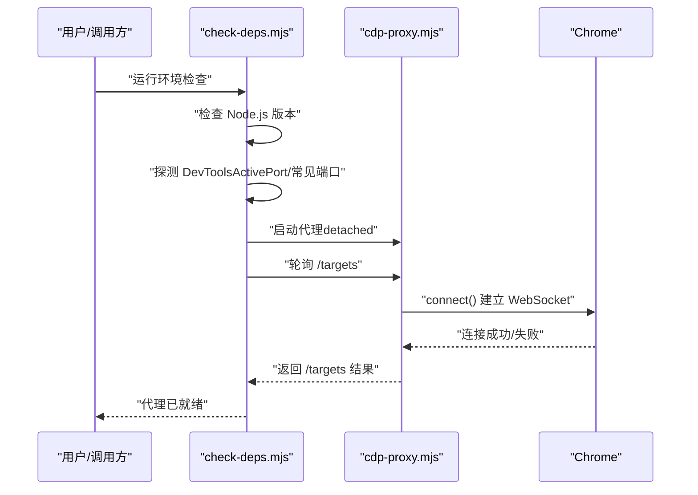
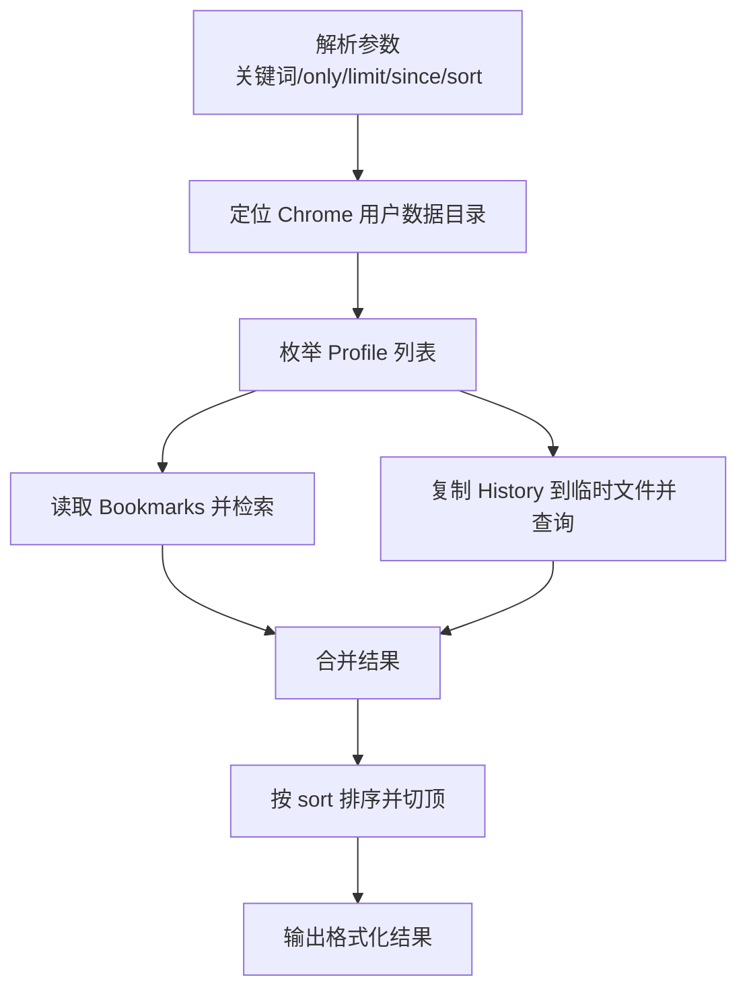
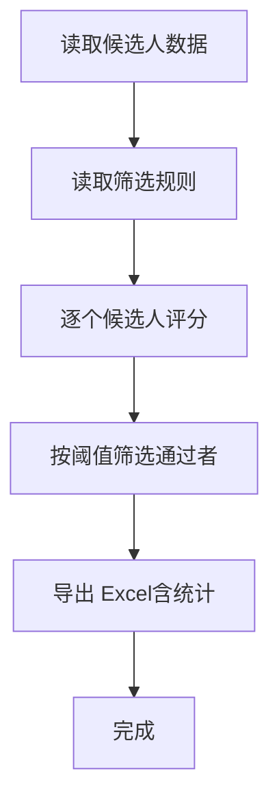
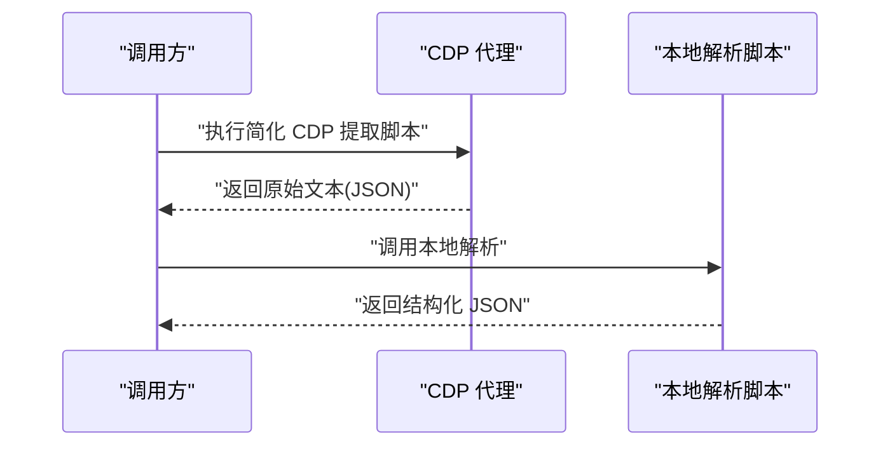

# 使用示例

<cite>
**本文引用的文件**   
- [README.md](file://README.md)
- [SKILL.md](file://SKILL.md)
- [package.json](file://package.json)
- [scripts/cdp-proxy.mjs](file://scripts/cdp-proxy.mjs)
- [scripts/check-deps.mjs](file://scripts/check-deps.mjs)
- [scripts/find-url.mjs](file://scripts/find-url.mjs)
- [scripts/export-candidates.mjs](file://scripts/export-candidates.mjs)
- [scripts/match-site.mjs](file://scripts/match-site.mjs)
- [scripts/score-candidates.mjs](file://scripts/score-candidates.mjs)
- [references/cdp-api.md](file://references/cdp-api.md)
- [docs/superpowers/specs/2026-04-22-cdp-script-execution-fix-design.md](file://docs/superpowers/specs/2026-04-22-cdp-script-execution-fix-design.md)
- [config/filter-rules.json](file://config/filter-rules.json)
- [data/candidates.json](file://data/candidates.json)
</cite>

## 目录
1. [简介](#简介)
2. [项目结构](#项目结构)
3. [核心组件](#核心组件)
4. [架构总览](#架构总览)
5. [详细组件分析](#详细组件分析)
6. [依赖分析](#依赖分析)
7. [性能考虑](#性能考虑)
8. [故障排查指南](#故障排查指南)
9. [结论](#结论)
10. [附录](#附录)

## 简介
本指南面向希望使用 CDP 代理服务进行浏览器自动化与数据提取的用户与开发者，提供从启动代理、连接 Chrome、执行自动化操作到处理结果的完整端到端示例。文档涵盖常见自动化场景（网页导航、表单填写、数据提取、截图保存等），并配套 curl 命令与 JavaScript 客户端调用思路，帮助你在不直接操作浏览器的前提下，通过 HTTP API 完成复杂的页面交互与信息采集。

## 项目结构
仓库采用“脚本 + 配置 + 文档”的组织方式，核心能力由 Node.js 脚本实现并通过 HTTP API 对外提供服务，同时辅以站点经验与规则配置，支撑可复用的自动化流程。

```mermaid
graph TB
subgraph "代理与服务"
Proxy["scripts/cdp-proxy.mjs<br/>CDP 代理服务"]
Health["/health 健康检查"]
Targets["/targets 目标列表"]
NewTab["/new 新建后台标签"]
CloseTab["/close 关闭标签"]
Navigate["/navigate 导航"]
Back["/back 后退"]
Info["/info 页面信息"]
Eval["/eval 执行 JS"]
Click["/click 点击"]
ClickAt["/clickAt 真实鼠标点击"]
SetFiles["/setFiles 文件上传"]
Scroll["/scroll 滚动"]
Screenshot["/screenshot 截图"]
end
subgraph "辅助工具"
CheckDeps["scripts/check-deps.mjs<br/>环境检查与启动代理"]
FindUrl["scripts/find-url.mjs<br/>本地 Chrome 书签/历史检索"]
MatchSite["scripts/match-site.mjs<br/>匹配站点经验"]
ExportXlsx["scripts/export-candidates.mjs<br/>导出 Excel"]
Score["scripts/score-candidates.mjs<br/>候选人评分"]
end
subgraph "配置与文档"
FilterRules["config/filter-rules.json<br/>筛选规则"]
Candidates["data/candidates.json<br/>候选人样例"]
CDPRef["references/cdp-api.md<br/>CDP API 参考"]
SkillDoc["SKILL.md<br/>Skill 设计与使用规范"]
SpecFix["docs/superpowers/specs/...-cdp-script-execution-fix-design.md<br/>简化 CDP 提取设计"]
end
Proxy --> Health
Proxy --> Targets
Proxy --> NewTab
Proxy --> CloseTab
Proxy --> Navigate
Proxy --> Back
Proxy --> Info
Proxy --> Eval
Proxy --> Click
Proxy --> ClickAt
Proxy --> SetFiles
Proxy --> Scroll
Proxy --> Screenshot
CheckDeps --> Proxy
FindUrl --> Candidates
MatchSite --> SkillDoc
ExportXlsx --> Candidates
Score --> FilterRules
```

图表来源
- [scripts/cdp-proxy.mjs:288-552](file://scripts/cdp-proxy.mjs#L288-L552)
- [scripts/check-deps.mjs:85-139](file://scripts/check-deps.mjs#L85-L139)
- [scripts/find-url.mjs:1-215](file://scripts/find-url.mjs#L1-L215)
- [scripts/export-candidates.mjs:1-203](file://scripts/export-candidates.mjs#L1-L203)
- [scripts/match-site.mjs:1-47](file://scripts/match-site.mjs#L1-L47)
- [scripts/score-candidates.mjs:1-406](file://scripts/score-candidates.mjs#L1-L406)
- [references/cdp-api.md:1-107](file://references/cdp-api.md#L1-L107)
- [config/filter-rules.json:1-41](file://config/filter-rules.json#L1-L41)
- [data/candidates.json:1-49](file://data/candidates.json#L1-L49)

章节来源
- [README.md:1-168](file://README.md#L1-L168)
- [SKILL.md:1-290](file://SKILL.md#L1-L290)
- [package.json:1-11](file://package.json#L1-L11)

## 核心组件
- CDP 代理服务：通过 HTTP API 控制用户本地 Chrome，提供新建/关闭标签、导航、后退、执行 JS、点击、滚动、截图等功能。
- 环境检查与代理启动：自动检测 Node.js 与 Chrome 端口，必要时启动代理并等待就绪。
- 本地 Chrome 资源检索：基于书签/历史检索本地访问过的页面，支持关键词、时间窗、排序等过滤。
- 候选人筛选与导出：基于规则对候选人打分、筛选，并导出 Excel。
- 站点经验与简化提取：通过“CDP 简化提取 + 本地解析”降低脚本复杂度与错误率。

章节来源
- [scripts/cdp-proxy.mjs:288-552](file://scripts/cdp-proxy.mjs#L288-L552)
- [scripts/check-deps.mjs:85-139](file://scripts/check-deps.mjs#L85-L139)
- [scripts/find-url.mjs:1-215](file://scripts/find-url.mjs#L1-L215)
- [scripts/export-candidates.mjs:1-203](file://scripts/export-candidates.mjs#L1-L203)
- [scripts/score-candidates.mjs:1-406](file://scripts/score-candidates.mjs#L1-L406)
- [references/cdp-api.md:1-107](file://references/cdp-api.md#L1-L107)

## 架构总览
CDP 代理服务以本地 HTTP API 形式提供浏览器自动化能力，核心流程如下：

图表来源
- [scripts/check-deps.mjs:85-139](file://scripts/check-deps.mjs#L85-L139)
- [scripts/cdp-proxy.mjs:306-345](file://scripts/cdp-proxy.mjs#L306-L345)
- [scripts/cdp-proxy.mjs:355-373](file://scripts/cdp-proxy.mjs#L355-L373)

## 详细组件分析

### 组件A：CDP 代理服务（HTTP API）
- 职责：封装 Chrome DevTools Protocol，暴露统一 HTTP 接口，屏蔽底层协议细节。
- 关键端点：
  - /health：健康检查
  - /targets：列出所有页面
  - /new?url=：新建后台标签并等待加载
  - /close?target=：关闭标签
  - /navigate?target=&url=：在现有标签导航
  - /back?target=：后退
  - /info?target=：页面基础信息
  - /eval?target=：执行 JS（POST body 为表达式）
  - /click?target=：JS 点击（POST body 为 CSS 选择器）
  - /clickAt?target=：真实鼠标点击（CDP Input.dispatchMouseEvent）
  - /setFiles?target=：设置 file input 文件（绕过文件对话框）
  - /scroll?target=&y=&direction=：滚动页面
  - /screenshot?target=&file=&format=：截图（保存或返回二进制）

图表来源
- [scripts/cdp-proxy.mjs:288-552](file://scripts/cdp-proxy.mjs#L288-L552)

章节来源
- [references/cdp-api.md:10-89](file://references/cdp-api.md#L10-L89)
- [scripts/cdp-proxy.mjs:288-552](file://scripts/cdp-proxy.mjs#L288-L552)

### 组件B：环境检查与代理启动
- 职责：检查 Node.js 版本、探测 Chrome 调试端口、启动代理并在首次请求时自动连接。
- 关键流程：
  - 检测 Node.js 版本（建议 22+）
  - 从 DevToolsActivePort 或常见端口探测 Chrome 端口
  - /targets 成功返回即认为代理就绪
  - 若未运行则后台启动代理并等待

图表来源
- [scripts/check-deps.mjs:85-139](file://scripts/check-deps.mjs#L85-L139)
- [scripts/cdp-proxy.mjs:113-200](file://scripts/cdp-proxy.mjs#L113-L200)

章节来源
- [scripts/check-deps.mjs:1-172](file://scripts/check-deps.mjs#L1-L172)
- [scripts/cdp-proxy.mjs:113-200](file://scripts/cdp-proxy.mjs#L113-L200)

### 组件C：本地 Chrome 资源检索（书签/历史）
- 职责：从本地 Chrome 用户数据中检索书签与历史，支持关键词、时间窗、排序与多 Profile。
- 关键流程：
  - 解析命令行参数（关键词、only、limit、since、sort）
  - 跨平台定位 Chrome 用户数据目录
  - 读取 Bookmarks/History 并检索
  - 输出格式化结果

图表来源
- [scripts/find-url.mjs:27-82](file://scripts/find-url.mjs#L27-L82)
- [scripts/find-url.mjs:110-149](file://scripts/find-url.mjs#L110-L149)
- [scripts/find-url.mjs:175-215](file://scripts/find-url.mjs#L175-L215)

章节来源
- [scripts/find-url.mjs:1-215](file://scripts/find-url.mjs#L1-L215)

### 组件D：候选人筛选与导出
- 职责：基于规则对候选人打分、筛选，并导出 Excel。
- 关键流程：
  - 解析规则配置（mustHave/preferred/exclude/threshold）
  - 对每个候选人计算分数并判定是否通过
  - 导出 Excel（自动列宽、统计信息）

图表来源
- [scripts/score-candidates.mjs:342-383](file://scripts/score-candidates.mjs#L342-L383)
- [scripts/export-candidates.mjs:154-195](file://scripts/export-candidates.mjs#L154-L195)

章节来源
- [scripts/score-candidates.mjs:1-406](file://scripts/score-candidates.mjs#L1-L406)
- [scripts/export-candidates.mjs:1-203](file://scripts/export-candidates.mjs#L1-L203)
- [config/filter-rules.json:1-41](file://config/filter-rules.json#L1-L41)
- [data/candidates.json:1-49](file://data/candidates.json#L1-L49)

### 组件E：站点经验与简化 CDP 提取
- 职责：通过“CDP 简化提取 + 本地解析”降低复杂度与错误率，提升可维护性。
- 关键流程：
  - CDP 端仅执行极简脚本，返回原始文本
  - 本地 Node.js 解析原始文本，输出结构化 JSON
  - 支持失败重试与容错

图表来源
- [docs/superpowers/specs/2026-04-22-cdp-script-execution-fix-design.md:1-224](file://docs/superpowers/specs/2026-04-22-cdp-script-execution-fix-design.md#L1-L224)

章节来源
- [docs/superpowers/specs/2026-04-22-cdp-script-execution-fix-design.md:1-224](file://docs/superpowers/specs/2026-04-22-cdp-script-execution-fix-design.md#L1-L224)

## 依赖分析
- 运行时依赖：Node.js 22+（使用原生 WebSocket），Chrome 开启远程调试。
- 可选依赖：ws（Node.js < 22 时回退）、xlsx（导出 Excel）、tesseract.js（OCR）。
- 外部接口：Chrome DevTools Protocol（通过 WebSocket 连接）。

章节来源
- [package.json:6-9](file://package.json#L6-L9)
- [scripts/cdp-proxy.mjs:20-33](file://scripts/cdp-proxy.mjs#L20-L33)
- [scripts/check-deps.mjs:17-25](file://scripts/check-deps.mjs#L17-L25)

## 性能考虑
- 并发控制
  - 代理默认串行处理请求，避免对同一目标并发操作引发竞态。
  - 如需并行，建议使用独立目标（/new 创建多个标签）并按标签隔离。
- 资源管理
  - 代理持续运行，避免频繁重启带来的 Chrome 授权弹窗与连接成本。
  - 使用 /close 及时关闭不再使用的标签，减少内存占用。
- 内存优化
  - /eval 返回值需可序列化，避免直接返回 DOM 节点；提取大量数据时建议 JSON.stringify。
  - 截图保存到本地文件时，及时清理临时文件。
- 网络与懒加载
  - 使用 /scroll 触发懒加载后再提取，提高数据完整性。
  - 短时间内密集打开大量页面可能触发风控，建议适当延时。

章节来源
- [references/cdp-api.md:91-98](file://references/cdp-api.md#L91-L98)
- [scripts/cdp-proxy.mjs:497-500](file://scripts/cdp-proxy.mjs#L497-L500)

## 故障排查指南
- Chrome 未开启远程调试
  - 现象：连接失败或端口探测失败
  - 处理：在 Chrome 地址栏打开 chrome://inspect/#remote-debugging 并勾选 Allow remote debugging
- 端口被占用
  - 现象：代理启动时报端口占用
  - 处理：已有实例健康则复用；否则停止占用进程或更换端口
- attach 失败或 target 无效
  - 现象：/targets 列表中找不到目标
  - 处理：用 /targets 获取最新列表，确认标签未关闭
- CDP 命令超时
  - 现象：页面长时间未响应
  - 处理：重试或检查标签状态；必要时 /close 后重新 /new
- 代理未就绪
  - 现象：/targets 返回非数组
  - 处理：运行 check-deps.mjs，等待代理启动并连接 Chrome

章节来源
- [references/cdp-api.md:99-107](file://references/cdp-api.md#L99-L107)
- [scripts/check-deps.mjs:146-156](file://scripts/check-deps.mjs#L146-L156)
- [scripts/cdp-proxy.mjs:118-130](file://scripts/cdp-proxy.mjs#L118-L130)

## 结论
通过 CDP 代理服务，你可以以 HTTP API 的形式完成复杂的浏览器自动化任务，结合站点经验与规则配置，实现可复用、可维护的自动化流程。遵循本文提供的端到端示例、最佳实践与故障排查方法，可在保证稳定性的同时提升执行效率与可扩展性。

## 附录

### 端到端使用示例（curl）
- 启动与检查
  - 环境检查：运行环境检查脚本，确保 Node.js 与 Chrome 调试端口可用
  - 健康检查：GET /health
- 基础操作
  - 列出标签：GET /targets
  - 新建标签并等待加载：GET /new?url=URL
  - 导航：GET /navigate?target=&url=
  - 后退：GET /back?target=
  - 获取页面信息：GET /info?target=
  - 执行 JS：POST /eval?target= -d 'JS 表达式'
  - 点击元素（JS）：POST /click?target= -d 'CSS 选择器'
  - 真实鼠标点击：POST /clickAt?target= -d 'CSS 选择器'
  - 文件上传：POST /setFiles?target= -d '{"selector":"input[type=file]","files":["/path/to/file.png"]}'
  - 滚动：GET /scroll?target=&y=&direction=
  - 截图：GET /screenshot?target=&file=&format=
  - 关闭标签：GET /close?target=

章节来源
- [README.md:119-137](file://README.md#L119-L137)
- [references/cdp-api.md:10-89](file://references/cdp-api.md#L10-L89)

### 端到端使用示例（JavaScript 客户端思路）
- 初始化
  - 使用 fetch 或 axios 调用 /health 与 /targets
  - 若未就绪，调用 check-deps.mjs 或在后台启动 cdp-proxy.mjs
- 创建标签并导航
  - GET /new?url=URL 获取 targetId
  - GET /navigate?target=&url= 切换页面
- 数据提取
  - POST /eval?target= -d 'document.querySelector(...).innerText'
  - 对于复杂结构，先提取原始文本，再在本地解析
- 交互操作
  - POST /click?target= -d 'button.submit'
  - POST /clickAt?target= -d '.upload-btn'
  - POST /setFiles?target= -d '{"selector":"input[type=file]","files":["/path/to/file.png"]}'
- 截图与保存
  - GET /screenshot?target=&file=/tmp/shot.png
- 结束清理
  - GET /close?target= 关闭标签

章节来源
- [scripts/check-deps.mjs:85-139](file://scripts/check-deps.mjs#L85-L139)
- [scripts/cdp-proxy.mjs:312-345](file://scripts/cdp-proxy.mjs#L312-L345)
- [scripts/cdp-proxy.mjs:355-476](file://scripts/cdp-proxy.mjs#L355-L476)
- [scripts/cdp-proxy.mjs:502-517](file://scripts/cdp-proxy.mjs#L502-L517)

### 常见自动化场景
- 网页导航
  - 使用 /new 或 /navigate 切换页面，/info 获取标题/URL/状态
- 表单填写
  - 先 /eval 获取表单字段，再 /setFiles 设置文件，最后 /click 触发提交
- 数据提取
  - 使用 /eval 提取文本，或通过简化 CDP 提取 + 本地解析
- 截图保存
  - 使用 /screenshot 保存到本地文件，或返回二进制

章节来源
- [references/cdp-api.md:48-89](file://references/cdp-api.md#L48-L89)
- [docs/superpowers/specs/2026-04-22-cdp-script-execution-fix-design.md:30-96](file://docs/superpowers/specs/2026-04-22-cdp-script-execution-fix-design.md#L30-L96)

### 错误处理策略与异常情况
- 连接失败：重试或检查 Chrome 调试设置
- target 无效：重新 /targets 获取最新列表
- 超时：重试或检查页面状态
- 端口占用：复用健康实例或更换端口
- 代理未就绪：等待 check-deps.mjs 完成初始化

章节来源
- [references/cdp-api.md:99-107](file://references/cdp-api.md#L99-L107)
- [scripts/check-deps.mjs:136-138](file://scripts/check-deps.mjs#L136-L138)

### 性能优化建议
- 并发控制：按标签隔离，避免对同一目标并发操作
- 资源管理：及时关闭标签，减少内存占用
- 内存优化：/eval 返回可序列化值，避免大对象传输
- 懒加载：滚动后再提取，提高数据完整性

章节来源
- [references/cdp-api.md:91-98](file://references/cdp-api.md#L91-L98)
- [scripts/cdp-proxy.mjs:497-500](file://scripts/cdp-proxy.mjs#L497-L500)

### 调试技巧与常见问题
- 使用 /targets 与 /info 快速确认页面状态
- 对复杂提取逻辑采用“CDP 简化提取 + 本地解析”
- 截图辅助定位元素与布局问题
- 多 Profile 与历史检索用于回溯访问过的页面

章节来源
- [scripts/find-url.mjs:175-215](file://scripts/find-url.mjs#L175-L215)
- [docs/superpowers/specs/2026-04-22-cdp-script-execution-fix-design.md:177-192](file://docs/superpowers/specs/2026-04-22-cdp-script-execution-fix-design.md#L177-L192)