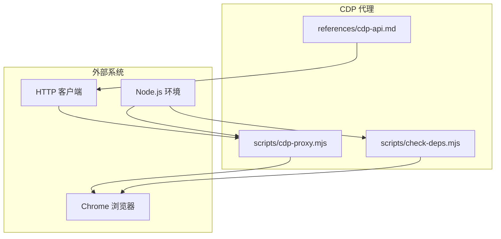
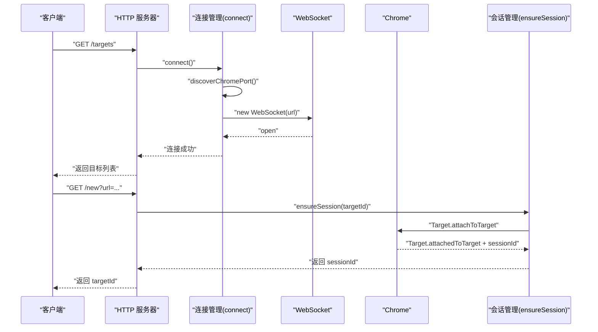
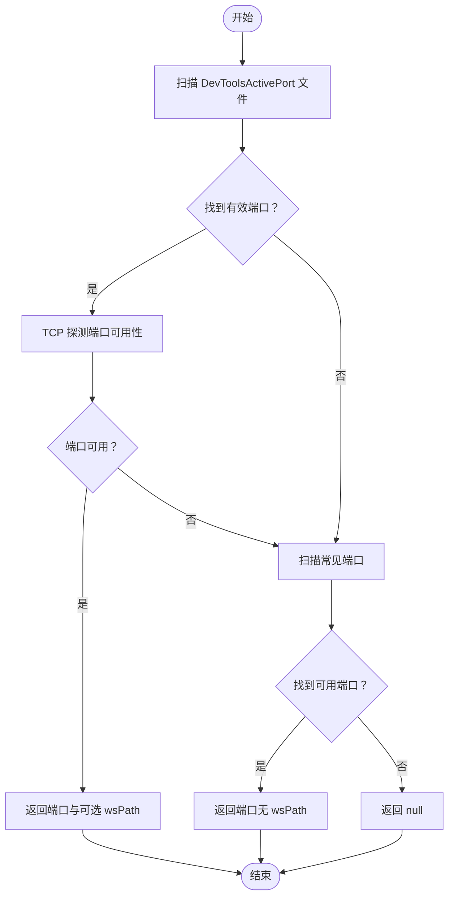
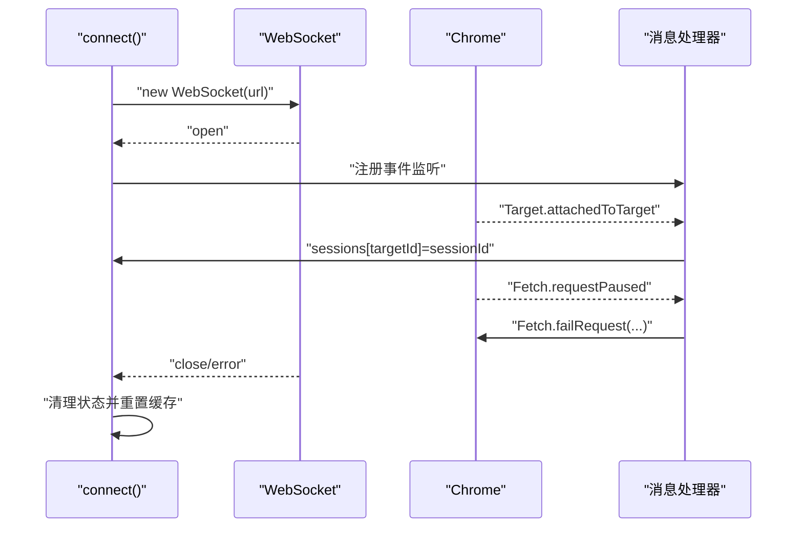
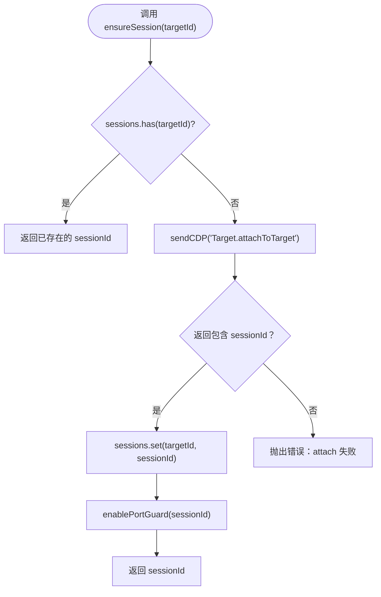
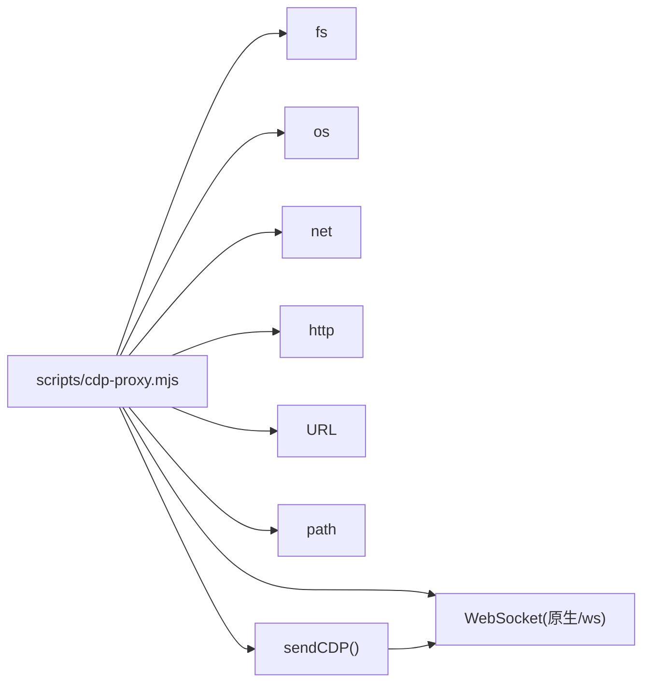

# 连接管理

<cite>
**本文引用的文件**
- [scripts/cdp-proxy.mjs](file://scripts/cdp-proxy.mjs)
- [scripts/check-deps.mjs](file://scripts/check-deps.mjs)
- [README.md](file://README.md)
- [references/cdp-api.md](file://references/cdp-api.md)
- [package.json](file://package.json)
</cite>

## 目录
1. [简介](#简介)
2. [项目结构](#项目结构)
3. [核心组件](#核心组件)
4. [架构总览](#架构总览)
5. [详细组件分析](#详细组件分析)
6. [依赖关系分析](#依赖关系分析)
7. [性能考量](#性能考量)
8. [故障排除指南](#故障排除指南)
9. [结论](#结论)
10. [附录](#附录)

## 简介
本文件聚焦于 CDP 代理的“连接管理”子系统，围绕以下主题展开：
- WebSocket 连接建立流程与重连策略
- Chrome 实例发现机制（DevToolsActivePort 文件扫描、常见端口检测、平台特定路径处理）
- 会话管理策略（Target.attachToTarget 与 sessionId 管理）
- 反风控机制（Fetch 域启用与调试端口探测拦截）
- ensureSession 函数工作原理
- 连接状态管理、错误处理与超时控制
- 故障排除与性能优化建议

该系统通过 HTTP API 对外提供浏览器自动化能力，底层以 CDP（Chrome DevTools Protocol）经由 WebSocket 与 Chrome 通信，兼容 Node.js 原生 WebSocket 与 ws 模块。

## 项目结构
- scripts/cdp-proxy.mjs：CDP 代理主程序，包含自动发现 Chrome 调试端口、WebSocket 连接管理、HTTP API、会话管理与反风控逻辑。
- scripts/check-deps.mjs：环境检查与代理启动辅助脚本，包含与 cdp-proxy.mjs 相同的 Chrome 端口发现逻辑。
- references/cdp-api.md：CDP 代理对外 API 文档，便于理解 HTTP API 与 CDP 的映射关系。
- README.md：项目总体介绍与前置条件，明确 Node.js 22+ 与 Chrome 远程调试要求。
- package.json：项目依赖声明（与连接管理关系较小，主要为其他功能模块）。

图表来源
- [scripts/cdp-proxy.mjs](file://scripts/cdp-proxy.mjs)
- [scripts/check-deps.mjs](file://scripts/check-deps.mjs)
- [references/cdp-api.md](file://references/cdp-api.md)

章节来源
- [scripts/cdp-proxy.mjs](file://scripts/cdp-proxy.mjs)
- [scripts/check-deps.mjs](file://scripts/check-deps.mjs)
- [references/cdp-api.md](file://references/cdp-api.md)
- [README.md](file://README.md)

## 核心组件
- 自动发现 Chrome 调试端口：根据平台扫描 DevToolsActivePort 文件，若失败则回退到常见端口探测。
- WebSocket 连接管理：统一的连接生命周期管理、事件处理、错误清理与端口缓存失效。
- 会话管理：基于 Target.attachToTarget 的 sessionId 管理，以及 Fetch 域启用与调试端口探测拦截。
- HTTP API：将 CDP 命令映射为 HTTP 端点，提供健康检查、目标列表、新建/关闭标签页、导航、点击、截图等能力。
- 等待页面加载：通过 Page.enable 与 Runtime.evaluate 轮询 document.readyState，实现稳定等待。

章节来源
- [scripts/cdp-proxy.mjs](file://scripts/cdp-proxy.mjs)
- [references/cdp-api.md](file://references/cdp-api.md)

## 架构总览
CDP 代理以 HTTP 服务器为入口，内部通过 WebSocket 与 Chrome 通信。连接建立后，代理维护目标到会话的映射，并在每个会话中启用 Fetch 域以拦截调试端口探测请求，从而降低风控风险。

图表来源
- [scripts/cdp-proxy.mjs](file://scripts/cdp-proxy.mjs)

## 详细组件分析

### 自动发现 Chrome 调试端口
- DevToolsActivePort 文件扫描：按平台拼接可能路径，读取第一行为端口，第二行为 WebSocket 路径（若存在）。随后通过 TCP 探测确认端口可用，避免 WebSocket 连接触发 Chrome 安全弹窗。
- 常见端口回退：若未发现 ActivePort 文件，则依次探测 9222、9229、9333。
- 平台特定路径处理：macOS、Linux、Windows 分别对应不同的用户数据目录与文件名。

图表来源
- [scripts/cdp-proxy.mjs](file://scripts/cdp-proxy.mjs)
- [scripts/check-deps.mjs](file://scripts/check-deps.mjs)

章节来源
- [scripts/cdp-proxy.mjs](file://scripts/cdp-proxy.mjs)
- [scripts/check-deps.mjs](file://scripts/check-deps.mjs)

### WebSocket 连接建立与状态管理
- 连接复用：在已有连接进行中时，复用同一 Promise，避免并发连接。
- 端口缓存：连接成功后缓存 chromePort 与 chromeWsPath；连接断开时清空缓存，以便下次重新发现。
- 事件处理：统一处理 open、error、close、message；在 error 与 close 时清理状态并抛出错误。
- 消息路由：收到 Target.attachedToTarget 时更新 sessions 映射；收到 Fetch.requestPaused 时拦截调试端口探测请求。

图表来源
- [scripts/cdp-proxy.mjs](file://scripts/cdp-proxy.mjs)

章节来源
- [scripts/cdp-proxy.mjs](file://scripts/cdp-proxy.mjs)

### 会话管理策略与 ensureSession
- ensureSession(targetId)：若目标已存在会话，直接返回 sessionId；否则调用 Target.attachToTarget 获取 sessionId，并启用端口探测拦截（enablePortGuard）。
- sessionId 管理：sessions Map 以 targetId 为键，sessionId 为值；在连接断开时清空，确保后续 attachToTarget 生效。
- 反风控：enablePortGuard 仅对当前会话启用 Fetch.enable，拦截 127.0.0.1:chromePort 与 localhost:chromePort 的请求，避免页面探测调试端口触发安全弹窗。

图表来源
- [scripts/cdp-proxy.mjs](file://scripts/cdp-proxy.mjs)

章节来源
- [scripts/cdp-proxy.mjs](file://scripts/cdp-proxy.mjs)

### 反风控机制：Fetch 域启用与调试端口探测拦截
- Fetch.enable：在会话中启用 Fetch 域，配置 urlPattern 为 http://127.0.0.1:chromePort/* 与 http://localhost:chromePort/*，拦截 Request 阶段请求。
- 请求拦截：收到 Fetch.requestPaused 时，调用 Fetch.failRequest 并传入 ConnectionRefused，使页面探测调试端口的行为被拒绝，从而规避风控。
- 会话级启用：portGuardedSessions 集合避免重复启用，提升性能。

章节来源
- [scripts/cdp-proxy.mjs](file://scripts/cdp-proxy.mjs)

### HTTP API 与 CDP 映射
- /health：返回连接状态、会话数量与当前端口。
- /targets：调用 Target.getTargets 过滤 page 类型目标。
- /new：调用 Target.createTarget 创建后台标签页，必要时等待页面加载。
- /close：调用 Target.closeTarget 关闭目标并清理会话。
- /navigate：调用 Page.navigate 并等待页面加载。
- /back：在会话中执行 history.back() 并等待加载。
- /eval：在会话中执行 Runtime.evaluate。
- /click：在会话中执行 JS 点击（querySelector + click）。
- /clickAt：在会话中计算元素坐标后调用 Input.dispatchMouseEvent 实现真实鼠标点击。
- /setFiles：在会话中调用 DOM.enable/DOM.getDocument/DOM.querySelector/DOM.setFileInputFiles。
- /scroll：在会话中执行 window.scrollTo/scrollBy 并等待懒加载。
- /screenshot：在会话中调用 Page.captureScreenshot。
- /info：在会话中执行 Runtime.evaluate 获取页面基础信息。

章节来源
- [references/cdp-api.md](file://references/cdp-api.md)
- [scripts/cdp-proxy.mjs](file://scripts/cdp-proxy.mjs)

## 依赖关系分析
- Node.js 原生 WebSocket 与 ws 模块：在 Node.js 22+ 环境下优先使用原生 WebSocket；低于 22 时回退到 ws 模块。
- 平台差异：os.platform() 与 os.homedir()/LOCALAPPDATA 用于确定 DevToolsActivePort 文件路径。
- 端口探测：net.createConnection 用于 TCP 探测，避免 WebSocket 连接触发 Chrome 安全弹窗。
- CDP 命令：sendCDP 封装消息发送与超时控制，pending Map 管理未完成的请求。

图表来源
- [scripts/cdp-proxy.mjs](file://scripts/cdp-proxy.mjs)

章节来源
- [scripts/cdp-proxy.mjs](file://scripts/cdp-proxy.mjs)

## 性能考量
- 连接复用：在连接进行中时复用 Promise，减少重复连接开销。
- 端口探测：优先使用 TCP 探测，避免 WebSocket 连接触发 Chrome 安全弹窗，降低交互成本。
- 会话启用去重：portGuardedSessions 避免重复启用 Fetch 域，减少不必要的 CDP 调用。
- 超时控制：sendCDP 默认 30 秒超时，及时清理 pending，避免内存泄漏。
- 等待策略：waitForLoad 使用定时轮询与超时，避免长时间阻塞；滚动后短暂等待以触发懒加载。

章节来源
- [scripts/cdp-proxy.mjs](file://scripts/cdp-proxy.mjs)

## 故障排除指南
- Chrome 未开启远程调试端口
  - 现象：connect() 抛出“Chrome 未开启远程调试端口”错误。
  - 处理：打开 chrome://inspect/#remote-debugging 并勾选 Allow remote debugging。
  - 参考：README 中的前置配置说明。
- 端口被占用
  - 现象：启动时报端口占用。
  - 处理：已有代理实例健康时可直接复用；否则更换端口或停止冲突进程。
- 连接失败/断开
  - 现象：WebSocket error 或 close。
  - 处理：错误时会清理状态并重置端口缓存，下次请求将重新发现；检查 Chrome 是否仍在运行。
- attach 失败
  - 现象：ensureSession 抛出“attach 失败”。
  - 处理：确认 targetId 有效且标签页未关闭；使用 /targets 获取最新列表。
- CDP 命令超时
  - 现象：sendCDP 抛出“CDP 命令超时”。
  - 处理：重试或检查目标页面状态；适当延长等待策略。
- Fetch 域启用失败
  - 现象：enablePortGuard 抛出异常但不影响主流程。
  - 处理：忽略即可，代理仍可通过其他方式工作。

章节来源
- [scripts/cdp-proxy.mjs](file://scripts/cdp-proxy.mjs)
- [README.md](file://README.md)
- [references/cdp-api.md](file://references/cdp-api.md)

## 结论
该连接管理系统通过“DevToolsActivePort 文件扫描 + 常见端口回退”的双轨策略实现对 Chrome 调试端口的稳健发现；以 WebSocket 为核心通道，结合会话管理与反风控拦截，提供了稳定可控的浏览器自动化能力。其设计兼顾了跨平台兼容性、错误处理与性能优化，适合在生产环境中长期运行。

## 附录
- 端口发现与代理启动流程参考：[scripts/check-deps.mjs](file://scripts/check-deps.mjs)
- 对外 API 参考：[references/cdp-api.md](file://references/cdp-api.md)
- 项目总体说明：[README.md](file://README.md)