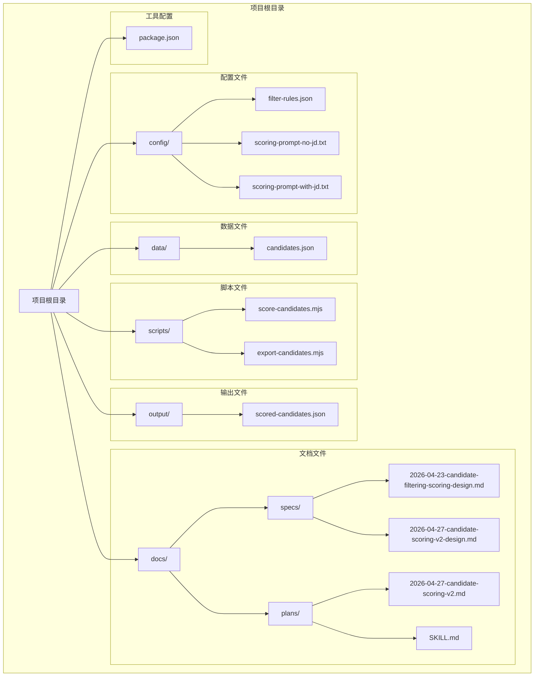
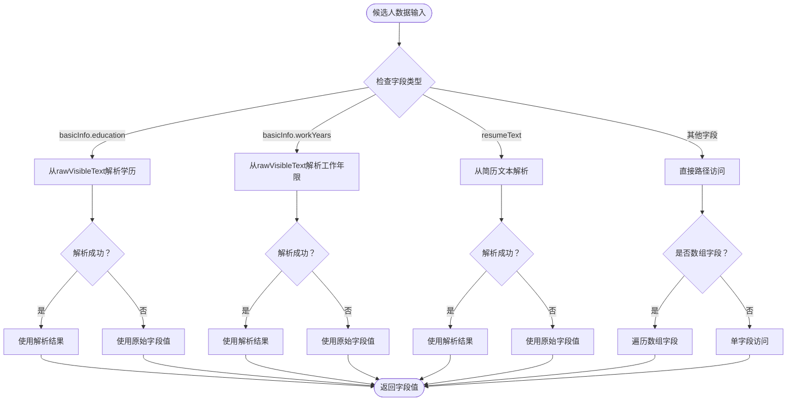
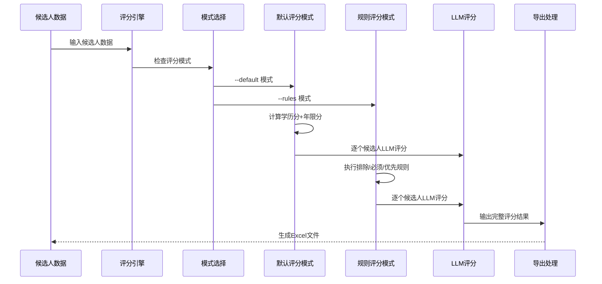
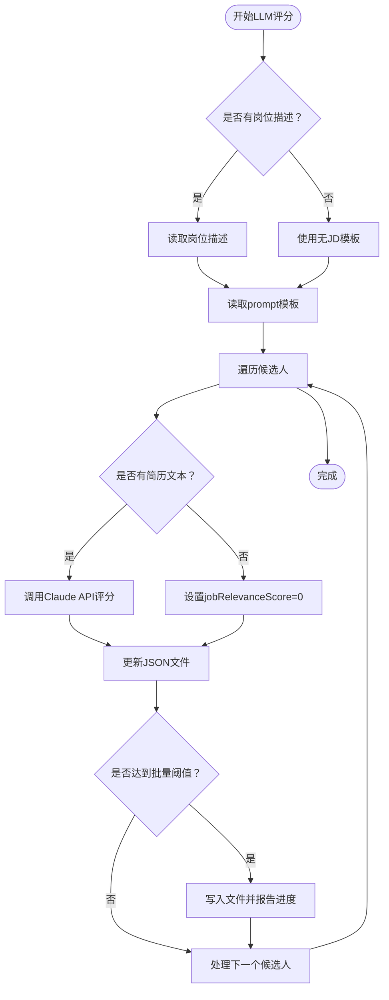
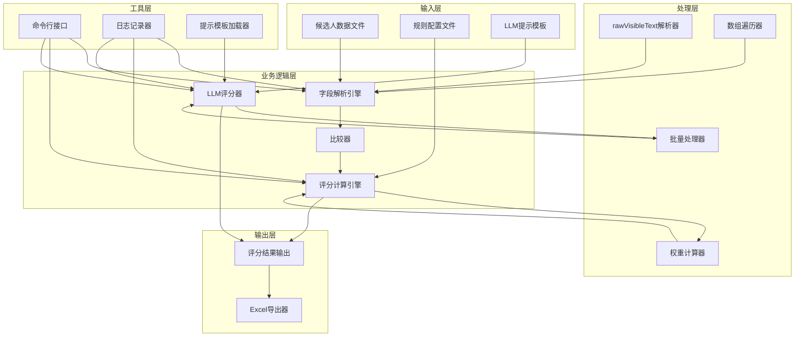
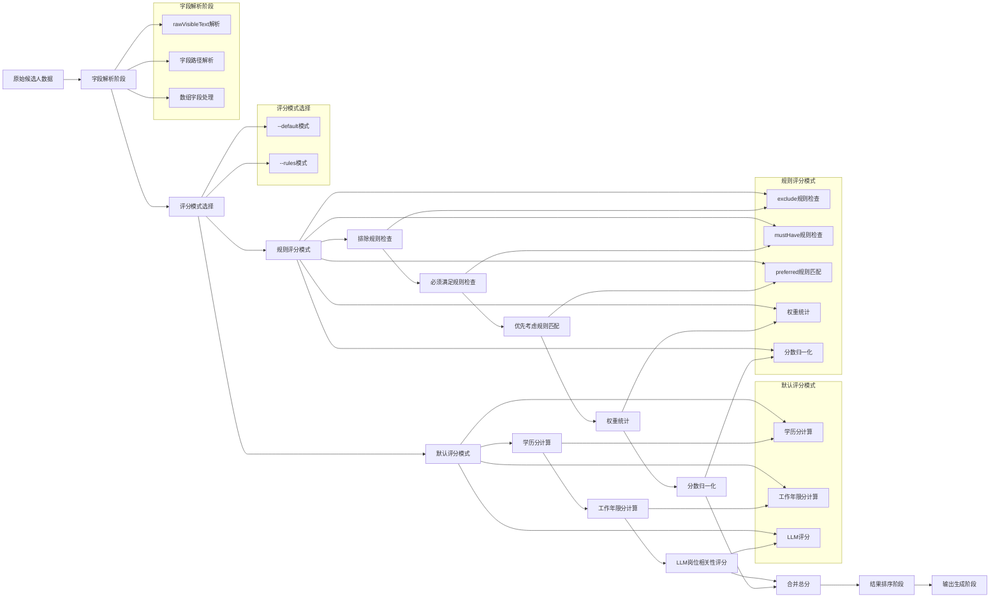
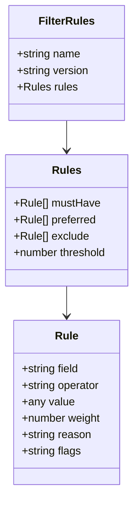
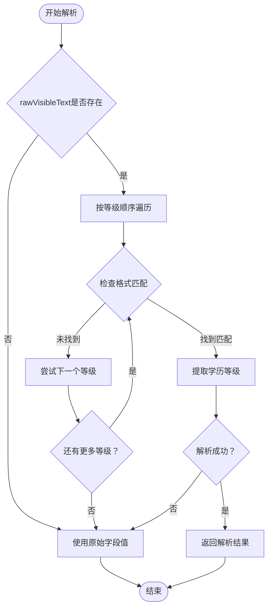
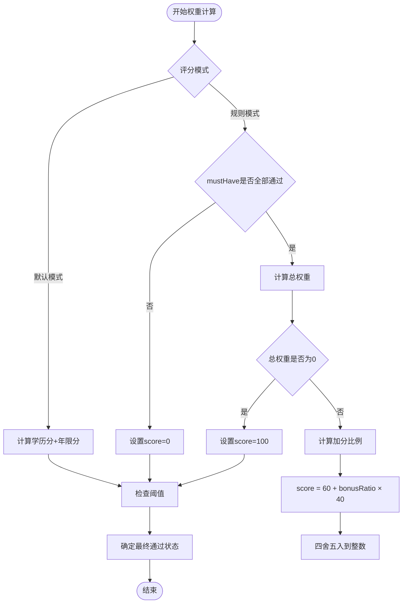
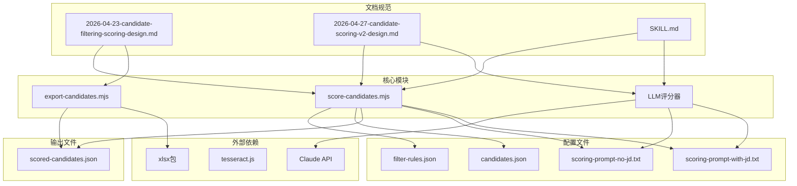

# 候选人筛选系统

<cite>
**本文档引用的文件**
- [filter-rules.json](file://config/filter-rules.json)
- [scoring-prompt-no-jd.txt](file://config/scoring-prompt-no-jd.txt)
- [scoring-prompt-with-jd.txt](file://config/scoring-prompt-with-jd.txt)
- [candidates.json](file://data/candidates.json)
- [score-candidates.mjs](file://scripts/score-candidates.mjs)
- [export-candidates.mjs](file://scripts/export-candidates.mjs)
- [SKILL.md](file://SKILL.md)
- [2026-04-23-candidate-filtering-scoring-design.md](file://docs/superpowers/specs/2026-04-23-candidate-filtering-scoring-design.md)
- [2026-04-27-candidate-scoring-v2-design.md](file://docs/superpowers/specs/2026-04-27-candidate-scoring-v2-design.md)
- [2026-04-27-candidate-scoring-v2.md](file://docs/superpowers/plans/2026-04-27-candidate-scoring-v2.md)
- [package.json](file://package.json)
- [scored-candidates.json](file://output/scored-candidates.json)
</cite>

## 目录
1. [简介](#简介)
2. [项目结构](#项目结构)
3. [核心组件](#核心组件)
4. [架构概览](#架构概览)
5. [详细组件分析](#详细组件分析)
6. [依赖关系分析](#依赖关系分析)
7. [性能考虑](#性能考虑)
8. [故障排除指南](#故障排除指南)
9. [结论](#结论)
10. [附录](#附录)

## 简介

候选人筛选系统是一个基于规则的智能筛选平台，专门用于对大规模候选人数据进行自动化评分和筛选。该系统采用纯脚本实现，不依赖任何外部AI服务，通过配置化的规则文件实现灵活的筛选逻辑。

**更新** 系统现已升级为V2版本，新增默认评分模式、教育经验评分、LLM岗位相关性评分集成，以及Excel导出增强功能。

系统的核心特性包括：
- **多层级筛选机制**：支持mustHave（必须满足）、preferred（优先考虑）、exclude（排除）三种规则类型
- **智能字段解析**：从rawVisibleText中提取准确的教育背景和工作年限信息
- **灵活的评分算法**：基于权重的归一化评分系统
- **默认评分模式**：支持无筛选条件时的全量评分排序
- **LLM岗位相关性评分**：集成Claude API进行简历内容分析
- **透明的决策过程**：详细的筛选原因记录和推荐等级划分
- **可扩展的设计**：支持自定义规则配置和字段解析策略

## 项目结构

该项目采用模块化组织结构，主要包含以下核心目录和文件：



**图表来源**
- [package.json:1-11](file://package.json#L1-L11)
- [filter-rules.json:1-17](file://config/filter-rules.json#L1-L17)
- [score-candidates.mjs:1-492](file://scripts/score-candidates.mjs#L1-L492)
- [SKILL.md:154-222](file://SKILL.md#L154-L222)

**章节来源**
- [package.json:1-11](file://package.json#L1-L11)
- [filter-rules.json:1-17](file://config/filter-rules.json#L1-L17)
- [score-candidates.mjs:1-492](file://scripts/score-candidates.mjs#L1-L492)
- [SKILL.md:154-222](file://SKILL.md#L154-L222)

## 核心组件

### 规则配置系统

规则配置系统是整个筛选系统的核心，采用JSON格式定义筛选规则。系统支持三种主要的规则类型：

#### mustHave规则（必须满足）
- **作用**：定义候选人的基本门槛条件
- **特点**：必须全部满足，否则候选人直接被淘汰
- **应用场景**：学历要求、最低工作经验、必需技能等

#### preferred规则（优先考虑）
- **作用**：对满足条件的候选人进行加分
- **特点**：按权重分配分数，权重越高得分越多
- **应用场景**：工作经验年限、特定技能、期望薪资等

#### exclude规则（排除条件）
- **作用**：直接淘汰不合适的候选人
- **特点**：命中即淘汰，无需考虑其他规则
- **应用场景**：学历不符合、特定行业背景、年龄限制等

**章节来源**
- [filter-rules.json:4-16](file://config/filter-rules.json#L4-L16)
- [2026-04-23-candidate-filtering-scoring-design.md:24-75](file://docs/superpowers/specs/2026-04-23-candidate-filtering-scoring-design.md#L24-L75)

### 字段解析引擎

字段解析引擎负责从复杂的候选人数据结构中提取所需信息。系统实现了智能字段解析机制，特别针对Boss直聘平台的数据偏移问题进行了优化。

#### 偏移修正机制
系统检测到Boss直聘平台的在线状态标签可能导致字段偏移，因此采用了rawVisibleText单源解析策略：



**图表来源**
- [score-candidates.mjs:146-176](file://scripts/score-candidates.mjs#L146-L176)
- [score-candidates.mjs:66-110](file://scripts/score-candidates.mjs#L66-L110)

#### 数组字段处理
系统支持复杂的数据结构遍历，特别是工作经历数组的处理：

- **语法**：`workExperience[].position`
- **行为**：遍历数组中每个元素的指定字段
- **匹配策略**：任一匹配即满足条件
- **应用场景**：技能关键词匹配、职位名称匹配等

**章节来源**
- [score-candidates.mjs:119-143](file://scripts/score-candidates.mjs#L119-L143)
- [2026-04-23-candidate-filtering-scoring-design.md:98-101](file://docs/superpowers/specs/2026-04-23-candidate-filtering-scoring-design.md#L98-L101)

### 评分算法系统

评分算法系统实现了基于权重的归一化评分机制，确保评分结果的公平性和可比性。

#### 评分流程



**图表来源**
- [score-candidates.mjs:412-465](file://scripts/score-candidates.mjs#L412-L465)
- [SKILL.md:163-221](file://SKILL.md#L163-L221)

#### 分数计算公式

系统采用以下评分策略：

1. **默认评分模式**：总分 = 学历分(0-20) + 工作年限分(0-30) + 岗位相关性分(0-50)
2. **规则评分模式**：mustHave全部满足时获得60分基础分，preferred规则按权重加分
3. **归一化处理**：规则模式下 `score = 60 + (满足权重/总权重) × 40`
4. **特殊处理**：无preferred规则时，全部满足获得100分

#### 推荐等级划分

| 等级 | 分数范围 | 描述 |
|------|----------|------|
| strong | 80-100 | 强烈推荐 |
| good | 60-79 | 推荐 |
| fair | 40-59 | 一般 |
| weak | 0-39 | 不推荐 |

**章节来源**
- [score-candidates.mjs:380-409](file://scripts/score-candidates.mjs#L380-L409)
- [2026-04-27-candidate-scoring-v2-design.md:19-44](file://docs/superpowers/specs/2026-04-27-candidate-scoring-v2-design.md#L19-L44)

### 操作符系统

系统支持多种比较操作符，满足不同场景的筛选需求：

#### 操作符类型

| 操作符 | 适用类型 | 说明 | 示例 |
|--------|----------|------|------|
| equals | 字符串/数字 | 精确匹配 | `expectCity` equals "深圳" |
| contains | 字符串/数组 | 包含匹配 | `position` contains "Java" |
| in | 字符串 | 值在列表中 | `education` in ["高中","中专"] |
| >= | 可排序值 | 大于等于 | `education` >= "本科" |
| > | 可排序值 | 大于 | `workYears` > "2年" |
| <= | 可排序值 | 小于等于 | `expectSalary` <= "20K" |
| < | 可排序值 | 小于 | `age` < "35岁" |
| regex | 字符串 | 正则表达式匹配 | `school` regex "985\|211" |
| exists | 任意 | 字段存在即满足 | `workExperience` exists |

#### 比较逻辑

系统实现了智能的比较逻辑，能够处理不同数据类型的比较：

1. **学历比较**：基于预定义的学历等级顺序
2. **工作年限比较**：解析"年"单位的数值进行比较
3. **字符串比较**：使用本地化比较函数

**章节来源**
- [score-candidates.mjs:186-257](file://scripts/score-candidates.mjs#L186-L257)
- [2026-04-23-candidate-filtering-scoring-design.md:87-97](file://docs/superpowers/specs/2026-04-23-candidate-filtering-scoring-design.md#L87-L97)

### LLM岗位相关性评分系统

**新增** 系统集成了LLM岗位相关性评分功能，通过Claude API对候选人的简历内容进行深度分析。

#### 评分维度

总分 = 学历分(0-20) + 工作年限分(0-30) + 岗位相关性分(0-50)

#### 岗位相关性评分规则

| 学历 | 分数 |
|------|------|
| 博士 | 20 |
| 硕士 | 17 |
| 本科 | 14 |
| 大专 | 8 |
| 中专 | 4 |
| 高中 | 4 |
| 未知 | 0 |

#### 工作年限评分规则

- 公式：`min(years * 3, 30)`
- 应届生额外 +3 分

#### LLM评分流程



**图表来源**
- [SKILL.md:176-196](file://SKILL.md#L176-L196)
- [scoring-prompt-no-jd.txt:1-13](file://config/scoring-prompt-no-jd.txt#L1-L13)
- [scoring-prompt-with-jd.txt:1-14](file://config/scoring-prompt-with-jd.txt#L1-L14)

**章节来源**
- [SKILL.md:163-202](file://SKILL.md#L163-L202)
- [2026-04-27-candidate-scoring-v2-design.md:41-44](file://docs/superpowers/specs/2026-04-27-candidate-scoring-v2-design.md#L41-L44)

## 架构概览

系统采用分层架构设计，各组件职责明确，耦合度低，便于维护和扩展。



**图表来源**
- [score-candidates.mjs:1-492](file://scripts/score-candidates.mjs#L1-L492)
- [export-candidates.mjs:1-281](file://scripts/export-candidates.mjs#L1-L281)
- [SKILL.md:154-222](file://SKILL.md#L154-L222)

### 数据流设计

系统的数据流遵循严格的处理顺序，确保筛选结果的准确性和一致性：



**图表来源**
- [score-candidates.mjs:412-465](file://scripts/score-candidates.mjs#L412-L465)

## 详细组件分析

### 规则配置文件格式

规则配置文件采用标准化的JSON格式，支持复杂的嵌套结构和灵活的配置选项。

#### 基本结构



**图表来源**
- [filter-rules.json:1-17](file://config/filter-rules.json#L1-L17)

#### 字段解析注册表

系统为特殊字段提供了专门的解析策略：

| 字段路径 | 解析方式 | 说明 |
|----------|----------|------|
| `basicInfo.education` | rawVisibleText解析 | 从rawVisibleText中提取学历信息 |
| `basicInfo.workYears` | rawVisibleText解析 | 从rawVisibleText中提取工作年限 |
| `workExperience[].position` | 数组遍历 | 遍历工作经历数组匹配职位信息 |
| `positionInfo.expectCity` | 直接访问 | 直接从JSON结构中获取城市信息 |
| `resumeText` | 直接访问 | 简历全文内容，支持全文搜索 |

**章节来源**
- [2026-04-23-candidate-filtering-scoring-design.md:132-139](file://docs/superpowers/specs/2026-04-23-candidate-filtering-scoring-design.md#L132-L139)

### 字段解析引擎实现

字段解析引擎是系统的核心组件之一，负责从复杂的候选人数据结构中提取准确的信息。

#### 教育信息解析

系统实现了智能的学历解析算法，能够从rawVisibleText中准确提取学历信息：



**图表来源**
- [score-candidates.mjs:66-79](file://scripts/score-candidates.mjs#L66-L79)

#### 工作年限解析

工作年限解析支持多种格式，包括应届毕业生、短期经验和长期经验：

| 格式 | 解析结果 | 说明 |
|------|----------|------|
| `\n(\d+)年应届生\n` | 0年 | 应届毕业生 |
| `\n1年以内\n` | 0.5年 | 一年以内经验 |
| `\n(\d+)年以上\n` | N年 | N年以上经验 |
| `\n(\d+)年\n` | N年 | 标准工作年限 |

**章节来源**
- [score-candidates.mjs:81-110](file://scripts/score-candidates.mjs#L81-L110)

### 评分计算引擎

评分计算引擎实现了复杂的评分逻辑，确保评分结果的准确性和公平性。

#### 评分模式

系统支持两种评分模式：

1. **默认评分模式**：`--default` 参数启用，对所有候选人进行评分
2. **规则评分模式**：`--rules` 参数启用，使用配置规则进行筛选

#### 优先级处理机制

系统严格按照以下优先级处理规则：

1. **exclude规则**：最高优先级，命中即淘汰
2. **mustHave规则**：必须全部满足，否则淘汰
3. **preferred规则**：按权重计算加分
4. **阈值判定**：最终确定通过状态

#### 权重计算逻辑



**图表来源**
- [score-candidates.mjs:380-409](file://scripts/score-candidates.mjs#L380-L409)
- [score-candidates.mjs:267-378](file://scripts/score-candidates.mjs#L267-L378)

**章节来源**
- [score-candidates.mjs:412-465](file://scripts/score-candidates.mjs#L412-L465)

### Excel导出功能

系统提供了完整的Excel导出功能，支持自定义字段选择和格式化输出。

#### 字段配置系统

系统定义了标准的字段配置，支持灵活的字段选择：

| 字段名 | 标题 | 数据提取函数 |
|--------|------|-------------|
| name | 姓名 | `c.basicInfo.name` |
| age | 年龄 | `c.basicInfo.age` |
| workYears | 工作年限 | `c.basicInfo.workYears` |
| school | 学校 | `c.educationExperience[0].school` |
| education | 学历 | `c.basicInfo.education` |
| educationScore | 学历分 | `c.educationScore` |
| workYearsScore | 年限分 | `c.workYearsScore` |
| jobRelevanceScore | 岗位相关性分 | `c.jobRelevanceScore` |
| jobRelevanceComment | 岗位评语 | `c.jobRelevanceComment` |
| score | 分数 | `c.score` |
| passed | 是否通过 | `c.passed ? '是' : '否'` |
| recommendationLevel | 推荐等级 | `c.recommendationLevel` |
| currentPosition | 当前职位 | `c.workExperience[0].position` |
| currentCompany | 当前公司 | `c.workExperience[0].company` |
| expectCity | 期望城市 | `c.positionInfo.expectCity` |
| expectSalary | 期望薪资 | `c.positionInfo.expectSalary` |
| recommendationReasons | 推荐理由 | 提取preferred规则的通过原因 |
| resumeText | 在线简历 | `c.resumeText` |

**章节来源**
- [export-candidates.mjs:43-135](file://scripts/export-candidates.mjs#L43-L135)

### LLM评分器

**新增** 系统集成了LLM评分器，通过Claude API对候选人的简历内容进行深度分析。

#### 提示模板系统

系统提供了两个提示模板：

1. **无岗位描述模板**：适用于没有岗位描述的情况
2. **有岗位描述模板**：结合岗位描述进行评分

#### 批量处理机制

系统实现了高效的批量处理机制：

- 每评完5人写入一次文件，防止数据丢失
- 实时进度报告，每评完5人向用户报告
- 支持中断恢复，从上次进度继续

**章节来源**
- [SKILL.md:176-196](file://SKILL.md#L176-L196)
- [scoring-prompt-no-jd.txt:1-13](file://config/scoring-prompt-no-jd.txt#L1-L13)
- [scoring-prompt-with-jd.txt:1-14](file://config/scoring-prompt-with-jd.txt#L1-L14)

## 依赖关系分析

系统采用模块化设计，各组件之间的依赖关系清晰明确。



**图表来源**
- [package.json:6-9](file://package.json#L6-L9)
- [score-candidates.mjs:1-6](file://scripts/score-candidates.mjs#L1-L6)
- [SKILL.md:154-222](file://SKILL.md#L154-L222)

### 外部依赖分析

系统对外部依赖的使用遵循最小化原则：

| 依赖包 | 版本 | 使用场景 | 用途说明 |
|--------|------|----------|----------|
| tesseract.js | ^7.0.0 | OCR识别 | 用于从图片中提取文本信息 |
| xlsx | ^0.18.5 | Excel导出 | 将JSON数据导出为Excel格式 |
| @anthropic-ai/sdk | ^0.18.0 | LLM评分 | 调用Claude API进行简历分析 |

这些依赖都是可选的，系统的核心功能不依赖于这些外部包。

**章节来源**
- [package.json:6-9](file://package.json#L6-L9)

## 性能考虑

系统在设计时充分考虑了性能优化，特别是在处理大量候选人数据时的效率问题。

### 时间复杂度分析

| 组件 | 时间复杂度 | 说明 |
|------|------------|------|
| 字段解析 | O(n) | n为规则数量，每个规则一次遍历 |
| 数组遍历 | O(m×k) | m为数组长度，k为匹配项数量 |
| 比较操作 | O(1) | 基础比较操作 |
| 排序处理 | O(n log n) | 按分数降序排列 |
| LLM评分 | O(m) | m为候选人数量，每次API调用 |
| 总体复杂度 | O(n×m×k + n log n + m) | n为候选人数量，m为规则数量，k为数组匹配次数 |

### 内存使用优化

1. **流式处理**：系统采用流式处理方式，避免一次性加载所有数据
2. **增量计算**：评分结果按候选人逐一计算，减少内存占用
3. **对象复用**：使用对象扩展的方式返回结果，避免创建大量临时对象
4. **批量写入**：LLM评分采用批量写入机制，减少文件IO操作

### 扩展性设计

系统具有良好的扩展性，支持以下扩展场景：

1. **新规则类型**：可以轻松添加新的规则类型
2. **新操作符**：可以扩展比较操作符支持
3. **新字段解析**：可以添加新的字段解析策略
4. **自定义评分算法**：可以替换现有的评分计算逻辑
5. **新LLM模型**：可以集成其他LLM服务提供商

## 故障排除指南

### 常见问题及解决方案

#### 规则配置错误

**问题**：规则配置文件格式错误导致程序崩溃

**解决方案**：
1. 使用JSON验证工具检查配置文件格式
2. 确保所有必需字段都已正确配置
3. 验证操作符和权重值的有效性

#### 字段路径错误

**问题**：字段路径配置错误导致无法正确提取数据

**解决方案**：
1. 检查候选人数据的实际结构
2. 验证字段路径的正确性
3. 对于数组字段，确保使用正确的`[]`语法

#### 性能问题

**问题**：处理大量数据时出现性能问题

**解决方案**：
1. 优化规则配置，减少不必要的规则数量
2. 使用更精确的字段路径，避免全量扫描
3. 考虑分批处理大数据集
4. 对于LLM评分，合理设置批量大小

#### Excel导出失败

**问题**：Excel导出功能无法正常工作

**解决方案**：
1. 确保已安装xlsx包：`npm install xlsx`
2. 检查输出目录的写权限
3. 验证输入的JSON文件格式正确

#### LLM评分失败

**问题**：LLM评分功能无法正常工作

**解决方案**：
1. 确保已正确配置Claude API密钥
2. 检查网络连接和API可用性
3. 验证提示模板文件的完整性
4. 对于批量处理，检查文件写入权限

**章节来源**
- [export-candidates.mjs:15-23](file://scripts/export-candidates.mjs#L15-L23)
- [SKILL.md:176-196](file://SKILL.md#L176-L196)

### 调试技巧

1. **启用详细日志**：在开发环境中添加更多的调试输出
2. **单元测试**：为关键组件编写单元测试
3. **性能监控**：使用性能分析工具监控执行时间
4. **内存监控**：监控内存使用情况，防止内存泄漏
5. **LLM调用监控**：监控API调用频率和响应时间

## 结论

候选人筛选系统是一个设计精良、功能完善的自动化筛选平台。系统采用纯脚本实现，不依赖任何外部AI服务，通过配置化的规则文件实现了高度灵活的筛选逻辑。

**更新** 系统现已升级为V2版本，新增了多项重要功能：

### 主要优势

1. **灵活性强**：通过配置文件即可实现复杂的筛选逻辑
2. **准确性高**：针对特定平台的数据偏移问题进行了专门优化
3. **透明度好**：详细的筛选原因记录和推荐等级划分
4. **智能化程度高**：新增LLM岗位相关性评分，提升筛选质量
5. **扩展性强**：模块化设计支持功能扩展和定制化需求
6. **用户体验好**：支持默认评分模式，无需复杂配置即可使用

### 技术特色

1. **智能字段解析**：从rawVisibleText中提取准确信息
2. **多层级评分**：基于权重的归一化评分系统
3. **灵活的规则配置**：支持多种规则类型和操作符
4. **完整的输出功能**：支持JSON和Excel两种输出格式
5. **LLM集成**：通过Claude API进行简历内容深度分析
6. **批量处理**：高效的批量处理机制，支持中断恢复

### 应用价值

该系统为HR招聘工作提供了强有力的技术支持，能够显著提高筛选效率，减少人工筛选的工作量，同时保证筛选结果的一致性和准确性。V2版本的推出进一步提升了系统的智能化水平，为候选人筛选提供了更加精准和高效的解决方案。

## 附录

### 使用示例

#### 基本使用流程

1. **准备候选人数据**：确保候选人数据文件格式正确
2. **配置筛选规则**：编辑`config/filter-rules.json`文件
3. **执行评分**：运行评分脚本
4. **查看结果**：检查`output/scored-candidates.json`文件
5. **导出Excel**：可选的Excel导出步骤

#### 默认评分模式使用

**新增** 使用默认评分模式，无需复杂配置：

```bash
# 默认评分模式
node scripts/score-candidates.mjs \
  --default \
  --position "AI应用开发工程师" \
  --input output/zhipin-candidates.json \
  --output output/scored-candidates.json

# 导出Excel
node scripts/export-candidates.mjs \
  --input output/scored-candidates.json
```

#### 条件筛选模式使用

```bash
# 条件筛选模式
node scripts/score-candidates.mjs \
  --input output/zhipin-candidates.json \
  --rules config/filter-rules.json \
  --output output/scored-candidates.json

# 导出Excel
node scripts/export-candidates.mjs \
  --input output/scored-candidates.json
```

#### LLM评分流程

**新增** 通过Claude API进行简历内容分析：

```bash
# 逐个候选人LLM评分
node scripts/score-candidates.mjs \
  --default \
  --position "AI应用开发工程师" \
  --input output/zhipin-candidates.json \
  --output output/scored-candidates.json

# 导出Excel
node scripts/export-candidates.mjs \
  --input output/scored-candidates.json
```

### 配置示例

以下是一个完整的规则配置示例：

```json
{
  "name": "AI应用开发工程师筛选",
  "version": "3.0",
  "rules": {
    "mustHave": [
      {
        "field": "basicInfo.workYears",
        "operator": ">=",
        "value": "2年",
        "reason": "用户要求2年以上工作经验"
      }
    ],
    "preferred": [],
    "exclude": [],
    "threshold": 0
  }
}
```

### 最佳实践

1. **规则设计**：合理设置mustHave、preferred和exclude的比例
2. **权重分配**：根据业务重要性合理分配权重值
3. **阈值设置**：根据实际情况调整阈值参数
4. **规则维护**：定期更新和优化筛选规则
5. **性能监控**：监控系统性能，及时发现和解决问题
6. **LLM使用**：合理设置批量大小，避免API调用频率过高
7. **数据备份**：定期备份评分结果，防止数据丢失

### 扩展建议

1. **规则模板**：提供常用规则模板，降低配置难度
2. **可视化界面**：开发图形化配置界面
3. **规则版本管理**：实现规则配置的版本控制
4. **批量处理**：支持批量处理多个规则配置
5. **实时监控**：提供筛选过程的实时监控功能
6. **多LLM支持**：集成多个LLM服务提供商
7. **自定义评分算法**：支持用户自定义评分算法