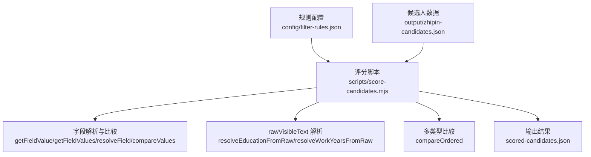
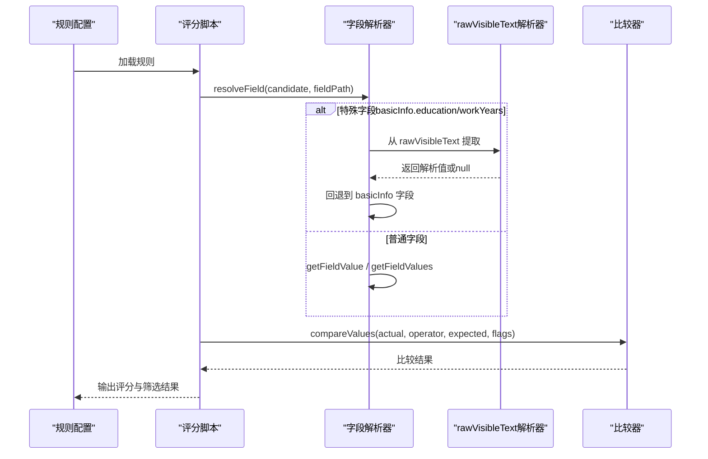
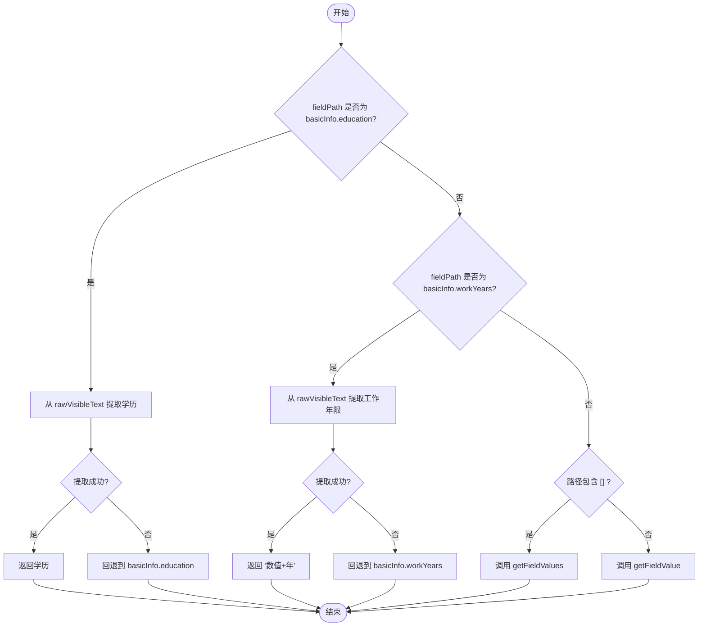
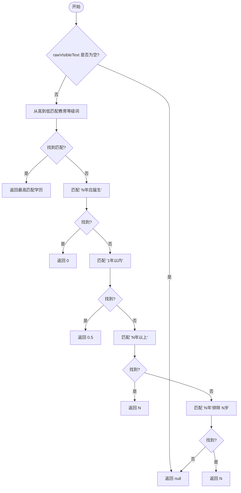
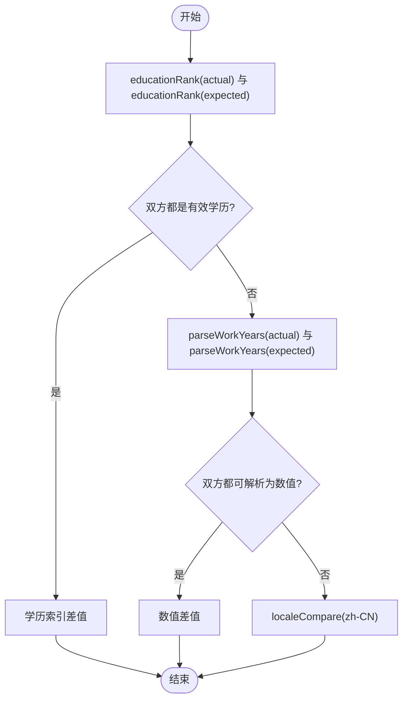
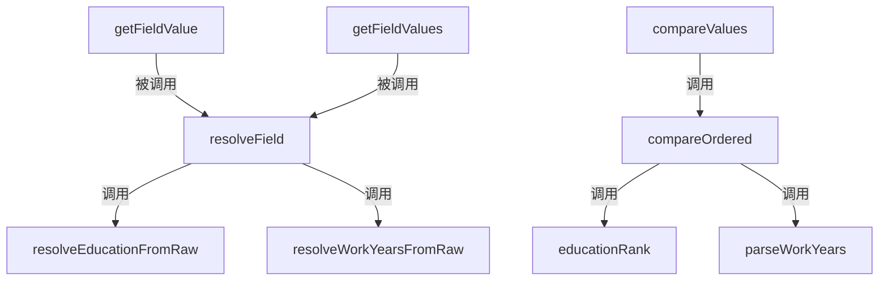

# 字段解析引擎

<cite>
**本文引用的文件**
- [scripts/score-candidates.mjs](file://scripts/score-candidates.mjs)
- [docs/superpowers/specs/2026-04-23-candidate-filtering-scoring-design.md](file://docs/superpowers/specs/2026-04-23-candidate-filtering-scoring-design.md)
- [config/filter-rules.json](file://config/filter-rules.json)
- [output/zhipin-candidates.json](file://output/zhipin-candidates.json)
</cite>

## 目录
1. [简介](#简介)
2. [项目结构](#项目结构)
3. [核心组件](#核心组件)
4. [架构总览](#架构总览)
5. [详细组件分析](#详细组件分析)
6. [依赖关系分析](#依赖关系分析)
7. [性能考量](#性能考量)
8. [故障排查指南](#故障排查指南)
9. [结论](#结论)
10. [附录](#附录)

## 简介
本文件系统性阐述字段解析引擎的设计与实现，重点覆盖以下能力：
- 字段路径解析：普通字段访问与数组字段展开
- 智能字段解析：针对 rawVisibleText 的特殊处理与回退机制
- 教育程度解析与工作年限解析：基于正则表达式的策略
- 多类型比较：学历等级、数值、字符串的优先级比较
- 字段路径语法与使用示例：支持嵌套对象与数组的复杂路径访问

该引擎服务于候选人筛选评分流程，确保从 rawVisibleText 中提取的字段具有稳定性和一致性，并提供强大的路径解析与比较能力。

## 项目结构
字段解析引擎位于评分脚本中，配合规则配置与候选人数据完成评分与筛选。关键文件与职责如下：
- scripts/score-candidates.mjs：字段解析、正则解析、比较与评分主流程
- docs/superpowers/specs/2026-04-23-candidate-filtering-scoring-design.md：规则与字段解析规范
- config/filter-rules.json：规则配置示例
- output/zhipin-candidates.json：候选人数据样例



图表来源
- [scripts/score-candidates.mjs](file://scripts/score-candidates.mjs)
- [config/filter-rules.json](file://config/filter-rules.json)
- [output/zhipin-candidates.json](file://output/zhipin-candidates.json)

章节来源
- [scripts/score-candidates.mjs](file://scripts/score-candidates.mjs)
- [docs/superpowers/specs/2026-04-23-candidate-filtering-scoring-design.md](file://docs/superpowers/specs/2026-04-23-candidate-filtering-scoring-design.md)

## 核心组件
- 字段路径解析器：支持普通字段访问与数组字段展开
- 智能字段解析器：针对 basicInfo.education 与 basicInfo.workYears 的 rawVisibleText 提取与回退
- rawVisibleText 解析器：教育程度与工作年限的正则匹配策略
- 多类型比较器：学历等级、数值、字符串的优先级比较
- 规则驱动的评分流程：exclude/mustHave/preferred/threshold

章节来源
- [scripts/score-candidates.mjs](file://scripts/score-candidates.mjs)
- [docs/superpowers/specs/2026-04-23-candidate-filtering-scoring-design.md](file://docs/superpowers/specs/2026-04-23-candidate-filtering-scoring-design.md)

## 架构总览
字段解析引擎围绕“规则驱动 + rawVisibleText 单源”的设计原则构建，确保字段取值的稳定性与一致性。



图表来源
- [scripts/score-candidates.mjs](file://scripts/score-candidates.mjs)
- [config/filter-rules.json](file://config/filter-rules.json)

## 详细组件分析

### 字段路径解析：getFieldValue 与 getFieldValues
- getFieldValue(obj, path)
  - 将路径按点号拆分，逐层访问对象属性
  - 若某一层不存在或值为 undefined，则返回 null
  - 适合普通对象字段访问
- getFieldValues(obj, path)
  - 支持数组字段展开语法：workExperience[].position
  - 识别三种路径片段：
    - []：纯数组展开，将当前集合中的所有数组元素扁平化
    - key[]：先取字段，再对每个元素进行数组展开
    - 普通字段：逐个映射到子字段值
  - 返回一个值数组，便于后续 contains/in 等操作

```mermaid
flowchart TD
Start(["开始"]) --> Split["按点号拆分路径"]
Split --> Loop{"遍历各片段"}
Loop --> |片段为[]| FlatMap["对当前集合执行数组扁平化"]
Loop --> |片段为key[]| GetKey["取字段值后再扁平化"]
Loop --> |普通字段| MapKey["映射到子字段值"]
FlatMap --> Next["继续下一个片段"]
GetKey --> Next
MapKey --> Next
Next --> Loop
Loop --> |结束| Return["返回最终值数组"]
```

图表来源
- [scripts/score-candidates.mjs](file://scripts/score-candidates.mjs)

章节来源
- [scripts/score-candidates.mjs](file://scripts/score-candidates.mjs)

### 智能字段解析：resolveField 的特殊处理与回退
- 对于 basicInfo.education：
  - 优先从 candidate.rawVisibleText 中提取学历
  - 若提取成功则返回；否则回退到 candidate.basicInfo.education
- 对于 basicInfo.workYears：
  - 优先从 candidate.rawVisibleText 中提取工作年限
  - 若提取成功则返回“数值+年”格式；否则回退到 candidate.basicInfo.workYears
- 对于包含 [] 的路径：直接调用 getFieldValues
- 其他路径：调用 getFieldValue



图表来源
- [scripts/score-candidates.mjs](file://scripts/score-candidates.mjs)

章节来源
- [scripts/score-candidates.mjs](file://scripts/score-candidates.mjs)

### rawVisibleText 解析：教育程度与工作年限
- 教育程度解析（resolveEducationFromRaw）
  - 从高到低匹配已知等级词，取最高匹配
  - 使用“独立成行”的换行包围模式，避免误匹配
- 工作年限解析（resolveWorkYearsFromRaw）
  - 应届生：匹配“N年应届生”，返回 0
  - “1年以内”：返回 0.5
  - “N年以上”：返回 N
  - 普通“N年”：返回 N
  - 排除“N岁”年龄模式，避免误判



图表来源
- [scripts/score-candidates.mjs](file://scripts/score-candidates.mjs)

章节来源
- [scripts/score-candidates.mjs](file://scripts/score-candidates.mjs)

### 多类型比较：compareOrdered 的优先级逻辑
- 学历等级比较：若双方均为有效学历，按预定义顺序比较
- 数值比较：若双方均可解析为数值（如“N年”），按数值大小比较
- 字符串比较：否则按本地化字符串比较（zh-CN）



图表来源
- [scripts/score-candidates.mjs](file://scripts/score-candidates.mjs)

章节来源
- [scripts/score-candidates.mjs](file://scripts/score-candidates.mjs)

### 字段路径语法与使用示例
- 语法要点
  - 点号分隔：用于访问嵌套对象字段
  - []：用于数组字段展开
  - 支持混合：如 workExperience[].position
- 示例
  - 基本对象字段：basicInfo.name
  - 数组字段展开：workExperience[].position
  - 复合路径：educationExperience[].degree

章节来源
- [docs/superpowers/specs/2026-04-23-candidate-filtering-scoring-design.md](file://docs/superpowers/specs/2026-04-23-candidate-filtering-scoring-design.md)
- [config/filter-rules.json](file://config/filter-rules.json)

## 依赖关系分析
字段解析引擎内部模块之间的依赖关系如下：



图表来源
- [scripts/score-candidates.mjs](file://scripts/score-candidates.mjs)

章节来源
- [scripts/score-candidates.mjs](file://scripts/score-candidates.mjs)

## 性能考量
- 字段路径解析
  - getFieldValue：时间复杂度 O(L)，L 为路径长度；空间复杂度 O(1)
  - getFieldValues：对数组进行扁平化与映射，整体复杂度取决于数据规模与数组深度
- rawVisibleText 解析
  - resolveEducationFromRaw：线性扫描已知等级词，复杂度 O(K)，K 为等级词数量
  - resolveWorkYearsFromRaw：常数次正则匹配，复杂度近似 O(1)
- 比较器
  - compareOrdered：最多两次字符串查找与一次数值解析，整体近似 O(1)

优化建议
- 对深层嵌套路径，尽量减少不必要的中间值映射
- 对高频数组字段展开，考虑缓存中间结果
- 正则表达式保持简洁，避免回溯

## 故障排查指南
- 字段取值为 null
  - 检查路径是否正确，是否存在中间字段缺失
  - 对数组路径，确认目标字段确实为数组
- 智能字段解析未生效
  - 确认 fieldPath 是否为 basicInfo.education 或 basicInfo.workYears
  - 检查 rawVisibleText 格式是否符合预期
- 比较失败
  - 确认比较类型与值格式（如“N年”）
  - 对正则比较，检查 flags 与表达式有效性
- 规则不生效
  - 检查规则配置文件格式与字段路径
  - 确认阈值设置与权重分配

章节来源
- [scripts/score-candidates.mjs](file://scripts/score-candidates.mjs)
- [docs/superpowers/specs/2026-04-23-candidate-filtering-scoring-design.md](file://docs/superpowers/specs/2026-04-23-candidate-filtering-scoring-design.md)

## 结论
字段解析引擎通过“rawVisibleText 单源 + 智能回退 + 强大的路径解析与比较”实现了稳定可靠的候选人筛选评分能力。其设计兼顾了易用性与扩展性，能够满足复杂业务场景下的字段访问与规则匹配需求。

## 附录
- 规则配置示例：见 config/filter-rules.json
- 候选人数据示例：见 output/zhipin-candidates.json
- 设计文档：见 docs/superpowers/specs/2026-04-23-candidate-filtering-scoring-design.md