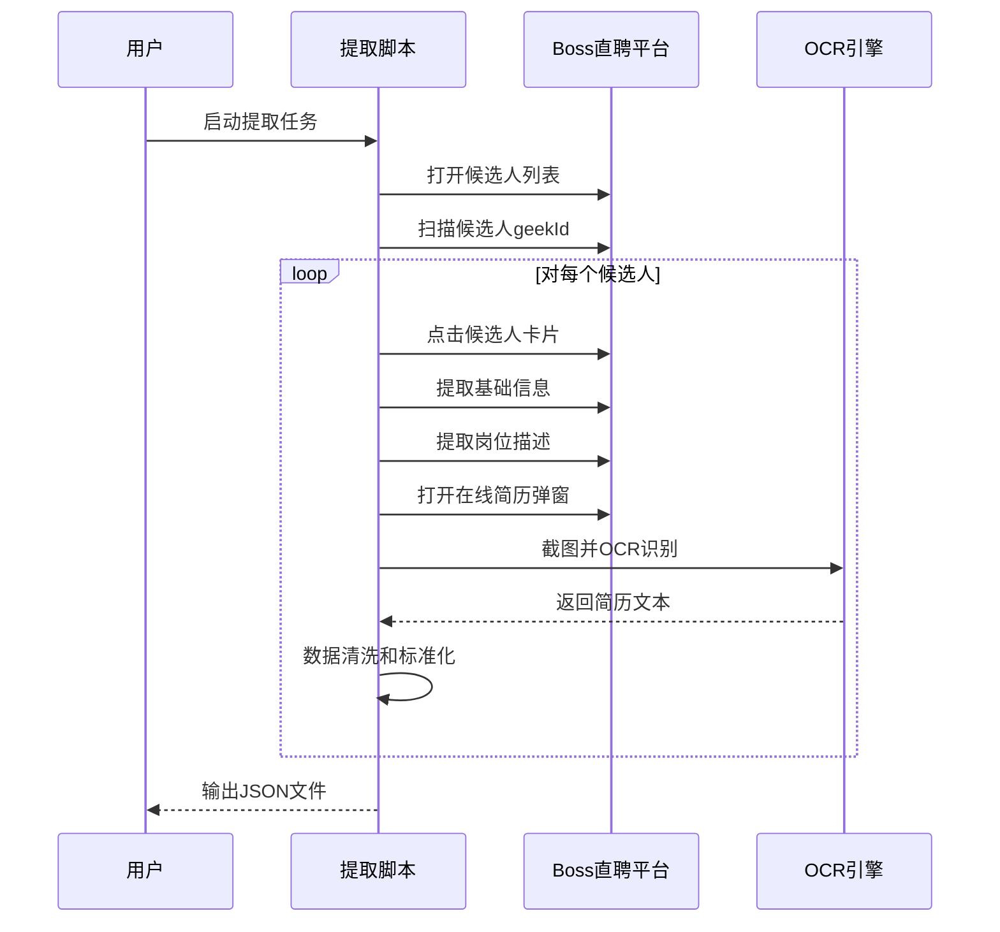
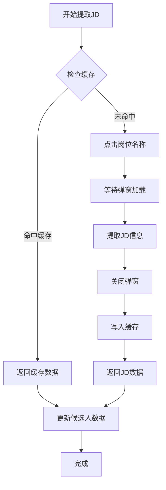
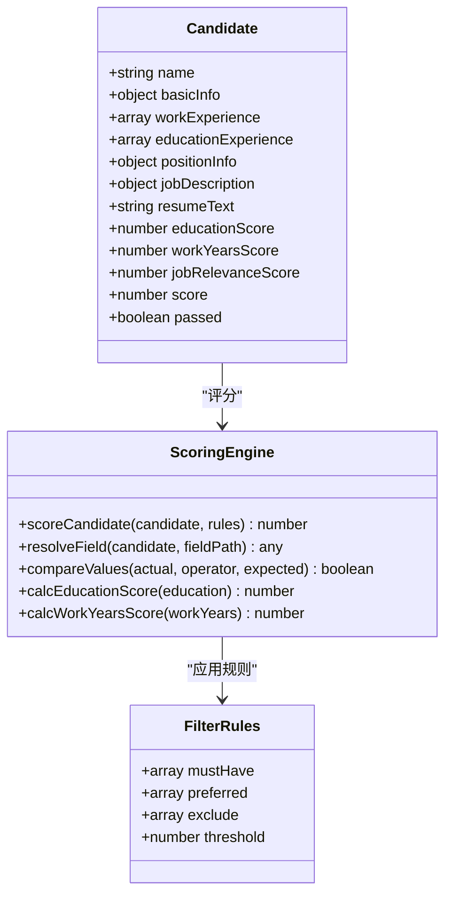

# 岗位描述(JD)提取系统

<cite>
**本文档引用的文件**
- [extract-candidates-full.mjs](file://scripts/extract-candidates-full.mjs)
- [fetch-resumes.mjs](file://scripts/fetch-resumes.mjs)
- [score-candidates.mjs](file://scripts/score-candidates.mjs)
- [export-candidates.mjs](file://scripts/export-candidates.mjs)
- [clean-resume-text.mjs](file://scripts/clean-resume-text.mjs)
- [filter-rules.json](file://config/filter-rules.json)
- [scoring-prompt-with-jd.txt](file://config/scoring-prompt-with-jd.txt)
- [scoring-prompt-no-jd.txt](file://config/scoring-prompt-no-jd.txt)
- [zhipin.com.md](file://references/site-patterns/zhipin.com.md)
- [2026-04-28-job-description-extraction.md](file://docs/superpowers/plans/2026-04-28-job-description-extraction.md)
- [2026-04-28-job-description-extraction-design.md](file://docs/superpowers/specs/2026-04-28-job-description-extraction-design.md)
- [SKILL.md](file://SKILL.md)
- [zhipin-candidates.json](file://output-10/zhipin-candidates.json)
- [scored-candidates.json](file://output-10/scored-candidates.json)
- [package.json](file://package.json)
</cite>

## 目录
1. [项目概述](#项目概述)
2. [系统架构](#系统架构)
3. [核心组件](#核心组件)
4. [岗位描述提取流程](#岗位描述提取流程)
5. [数据处理管道](#数据处理管道)
6. [评分系统集成](#评分系统集成)
7. [性能优化策略](#性能优化策略)
8. [故障排除指南](#故障排除指南)
9. [总结](#总结)

## 项目概述

岗位描述(JD)提取系统是一个基于Boss直聘平台的智能候选人筛选和评分系统。该系统能够在提取候选人基本信息的同时，自动提取岗位描述(JD)，并将JD与候选人简历进行关联分析，从而提供更加精准的岗位匹配度评估。

### 系统特性

- **自动化JD提取**：在候选人详情页面自动提取岗位描述信息
- **智能缓存机制**：同一岗位的JD只提取一次，提高效率
- **多维度评分**：结合学历、工作经验、岗位相关性进行综合评分
- **OCR文本处理**：对提取的简历文本进行清洗和标准化
- **Excel导出功能**：支持结构化数据导出和可视化展示

## 系统架构

```mermaid
graph TB
subgraph "数据采集层"
A[候选人列表) --> B[基础信息提取]
B --> C[岗位描述提取]
C --> D[在线简历提取]
end
subgraph "数据处理层"
E[数据清洗] --> F[智能评分]
F --> G[规则筛选]
end
subgraph "输出层"
H[Excel导出] --> I[统计报告]
J[JSON格式] --> K[API接口]
end
D --> E
E --> F
F --> G
G --> H
G --> J
```

**图表来源**
- [extract-candidates-full.mjs:480-529](file://scripts/extract-candidates-full.mjs#L480-L529)
- [score-candidates.mjs:268-378](file://scripts/score-candidates.mjs#L268-L378)
- [export-candidates.mjs:44-135](file://scripts/export-candidates.mjs#L44-L135)

## 核心组件

### 1. 候选人信息提取引擎

系统的核心是`extract-candidates-full.mjs`脚本，它实现了完整的候选人信息提取流程：



**图表来源**
- [extract-candidates-full.mjs:228-276](file://scripts/extract-candidates-full.mjs#L228-L276)
- [extract-candidates-full.mjs:480-529](file://scripts/extract-candidates-full.mjs#L480-L529)

### 2. 岗位描述提取模块

岗位描述提取功能是系统的关键创新，通过以下步骤实现：



**图表来源**
- [extract-candidates-full.mjs:480-529](file://scripts/extract-candidates-full.mjs#L480-L529)
- [2026-04-28-job-description-extraction-design.md:24-42](file://docs/superpowers/specs/2026-04-28-job-description-extraction-design.md#L24-L42)

### 3. 智能评分系统

评分系统采用多维度评估模型：



**图表来源**
- [score-candidates.mjs:268-378](file://scripts/score-candidates.mjs#L268-L378)
- [filter-rules.json:4-16](file://config/filter-rules.json#L4-L16)

**章节来源**
- [extract-candidates-full.mjs:480-529](file://scripts/extract-candidates-full.mjs#L480-L529)
- [score-candidates.mjs:268-378](file://scripts/score-candidates.mjs#L268-L378)
- [export-candidates.mjs:44-135](file://scripts/export-candidates.mjs#L44-L135)

## 岗位描述提取流程

### 1. JD提取时机和策略

系统在提取基础信息后、打开在线简历前执行JD提取，确保：

- **时机准确性**：在候选人详情页面，岗位描述弹窗可正常访问
- **缓存优化**：同一岗位的JD只提取一次，避免重复请求
- **容错处理**：某些页面可能没有JD弹窗，系统自动降级处理

### 2. JD数据结构

提取的JD数据包含以下关键字段：

| 字段名 | 描述 | 示例 |
|--------|------|------|
| jobName | 岗位名称 | "AI应用开发工程师" |
| salary | 薪资范围 | "15-22K 15薪" |
| description | 岗位描述全文 | 技术要求、职责说明等 |
| tags | 岗位标签 | ["深圳", "本科", "1-3年"] |

### 3. 提取实现细节

JD提取通过JavaScript执行在浏览器环境中，使用DOM查询和事件触发：

```javascript
// 点击岗位名称触发弹窗
const clickResult = await cdpEval(targetId, `(function(){
    var nameEl = document.querySelector('.position-name');
    if (!nameEl) return 'not-found';
    nameEl.click();
    return 'clicked';
})()`);

// 提取JD信息
const detail = await cdpEval(targetId, `(function(){
    var dialog = document.querySelector('.job-details-dialog');
    if (!dialog) return JSON.stringify(null);
    var info = {};
    // 提取jobName、salary、description、tags
    return JSON.stringify(info);
})()`);
```

**章节来源**
- [extract-candidates-full.mjs:480-529](file://scripts/extract-candidates-full.mjs#L480-L529)
- [2026-04-28-job-description-extraction-design.md:30-54](file://docs/superpowers/specs/2026-04-28-job-description-extraction-design.md#L30-L54)

## 数据处理管道

### 1. OCR文本清洗

提取的简历文本可能存在格式问题，系统提供专门的清洗功能：


**图表来源**
- [clean-resume-text.mjs:14-71](file://scripts/clean-resume-text.mjs#L14-L71)

### 2. 数据标准化

系统对提取的数据进行标准化处理：

- **字段映射**：将不同来源的数据统一到标准格式
- **类型转换**：确保数值、日期等字段的正确类型
- **完整性检查**：验证必填字段的存在性

### 3. 缓存策略

系统实现多层次缓存机制：

- **内存缓存**：JD数据缓存在内存中，避免重复请求
- **文件缓存**：扫描结果和提取进度保存到文件
- **增量更新**：支持中断恢复和增量处理

**章节来源**
- [clean-resume-text.mjs:14-71](file://scripts/clean-resume-text.mjs#L14-L71)
- [extract-candidates-full.mjs:228-276](file://scripts/extract-candidates-full.mjs#L228-L276)

## 评分系统集成

### 1. LLM评分集成

系统支持两种评分模式：

#### 有JD时的评分
当候选人数据包含岗位描述时，使用更精确的评分模板：

```
你是一位技术招聘专家。请根据以下岗位描述和候选人简历，评估其与目标岗位的匹配度。

岗位描述：
{jobDescription.description}

候选人简历：
{resumeText}

请给出：
1. 岗位相关性分数（0-50分）：基于技术栈匹配度、项目经验相关性、行业经验等
2. 简短评语（一句话）：说明评分理由

请严格按以下 JSON 格式输出：
{"jobRelevanceScore": <0-50>, "jobRelevanceComment": "<评语>"}
```

#### 无JD时的评分
当只有岗位名称时，使用简化的评分模板：

```
你是一位技术招聘专家。请根据以下候选人简历，评估其与目标岗位的匹配度。

目标岗位：{positionName}

候选人简历：
{resumeText}

请给出：
1. 岗位相关性分数（0-50分）：基于技术栈匹配度、项目经验相关性、行业经验等
2. 简短评语（一句话）：说明评分理由

请严格按以下 JSON 格式输出：
{"jobRelevanceScore": <0-50>, "jobRelevanceComment": "<评语>"}
```

### 2. 评分维度

评分系统包含三个主要维度：

| 维度 | 分数范围 | 说明 |
|------|----------|------|
| 学历分 | 0-20分 | 基于教育程度的标准化评分 |
| 工作年限分 | 0-30分 | 基于工作经验的评分，应届生额外加分 |
| 岗位相关性分 | 0-50分 | 基于JD和简历匹配度的评分 |

### 3. 规则筛选

系统支持灵活的规则配置：

```json
{
  "rules": {
    "mustHave": [
      {
        "field": "basicInfo.workYears",
        "operator": ">=",
        "value": "2年",
        "reason": "用户要求2年以上工作经验"
      }
    ],
    "preferred": [],
    "exclude": [],
    "threshold": 0
  }
}
```

**章节来源**
- [scoring-prompt-with-jd.txt:1-14](file://config/scoring-prompt-with-jd.txt#L1-L14)
- [scoring-prompt-no-jd.txt:1-13](file://config/scoring-prompt-no-jd.txt#L1-L13)
- [score-candidates.mjs:268-378](file://scripts/score-candidates.mjs#L268-L378)
- [filter-rules.json:4-16](file://config/filter-rules.json#L4-L16)

## 性能优化策略

### 1. 并行处理

系统采用多线程和异步处理策略：

- **并发提取**：多个候选人信息提取可以并行进行
- **流水线处理**：数据提取、清洗、评分形成流水线
- **资源池管理**：OCR引擎和网络请求的资源池化管理

### 2. 缓存优化

- **JD缓存**：同一岗位JD只提取一次
- **进度缓存**：提取进度自动保存，支持中断恢复
- **内存优化**：及时释放不需要的大对象

### 3. 网络优化

- **CDP代理**：通过Chrome DevTools Protocol减少网络开销
- **请求合并**：多个操作合并到单个请求中
- **超时控制**：合理的超时设置避免长时间阻塞

## 故障排除指南

### 1. 常见问题及解决方案

#### JD提取失败
**症状**：候选人数据缺少jobDescription字段
**原因**：
- 候选人详情页面没有JD弹窗
- 页面结构发生变化
- 网络请求超时

**解决方案**：
- 检查页面结构是否符合预期
- 增加重试机制
- 实施降级策略（使用岗位名称评分）

#### OCR识别错误
**症状**：简历文本质量差，包含大量噪声
**原因**：
- 简历截图质量不佳
- OCR引擎配置不当
- 文本格式复杂

**解决方案**：
- 调整截图区域和质量
- 优化OCR参数设置
- 增强文本清洗算法

#### 性能问题
**症状**：系统运行缓慢，内存占用过高
**原因**：
- 缓存策略不当
- 并发控制不足
- 资源泄漏

**解决方案**：
- 优化缓存策略
- 实施合理的并发限制
- 定期清理临时文件

### 2. 监控和诊断

系统提供完善的监控机制：

- **进度跟踪**：实时显示提取进度
- **错误日志**：详细记录错误信息
- **性能指标**：监控系统运行状态

**章节来源**
- [zhipin.com.md:493-509](file://references/site-patterns/zhipin.com.md#L493-L509)
- [extract-candidates-full.mjs:102-128](file://scripts/extract-candidates-full.mjs#L102-L128)

## 总结

岗位描述(JD)提取系统通过技术创新和流程优化，实现了候选人筛选和评分的智能化升级。系统的主要优势包括：

1. **技术先进性**：集成JD提取、OCR识别、LLM评分等前沿技术
2. **流程自动化**：从数据采集到结果输出的全自动化流程
3. **智能决策**：基于JD和简历的精准匹配评估
4. **可扩展性**：模块化设计支持功能扩展和定制

该系统为HR招聘工作提供了强有力的技术支撑，显著提升了招聘效率和质量。通过持续优化和迭代，系统将继续为企业的智能化招聘提供更好的服务。