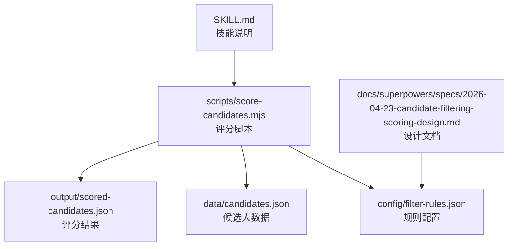
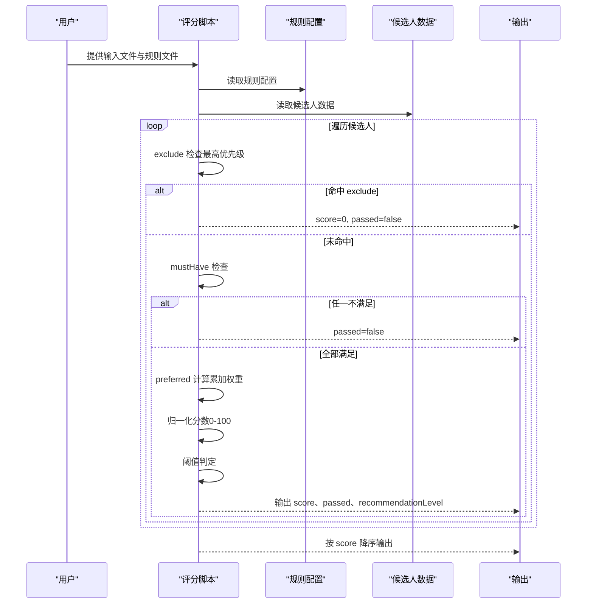
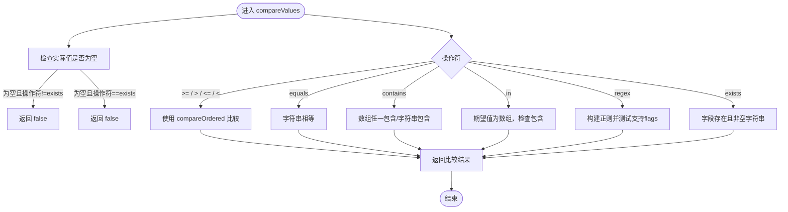
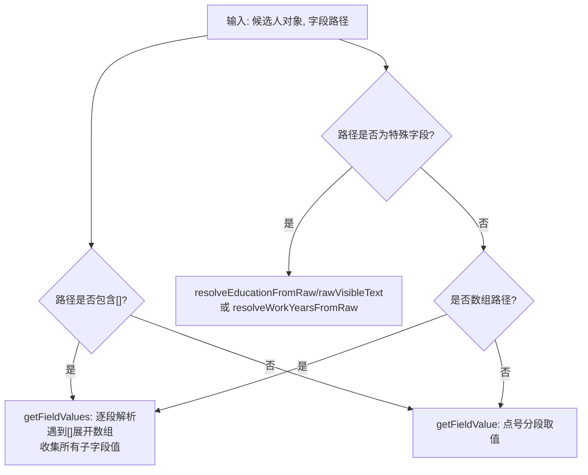
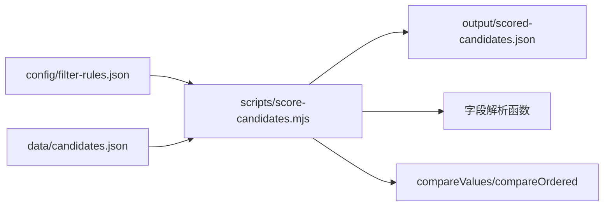

# 规则引擎核心

<cite>
**本文引用的文件**
- [scripts/score-candidates.mjs](file://scripts/score-candidates.mjs)
- [config/filter-rules.json](file://config/filter-rules.json)
- [data/candidates.json](file://data/candidates.json)
- [docs/superpowers/specs/2026-04-23-candidate-filtering-scoring-design.md](file://docs/superpowers/specs/2026-04-23-candidate-filtering-scoring-design.md)
- [SKILL.md](file://SKILL.md)
</cite>

## 目录
1. [简介](#简介)
2. [项目结构](#项目结构)
3. [核心组件](#核心组件)
4. [架构总览](#架构总览)
5. [详细组件分析](#详细组件分析)
6. [依赖分析](#依赖分析)
7. [性能考虑](#性能考虑)
8. [故障排查指南](#故障排查指南)
9. [结论](#结论)
10. [附录](#附录)

## 简介
本文件面向规则引擎核心模块，聚焦于 mustHave、preferred、exclude 三类规则的执行顺序与语义，compareValues 函数的比较逻辑（含 equals、contains、in、>=、>、<=、<、regex、exists），字段路径解析机制（普通字段与数组字段），以及 resolveField 对特殊字段（如 basicInfo.education、basicInfo.workYears）的智能解析。文档还提供规则配置示例、字段路径语法说明与最佳实践，帮助读者快速掌握该规则引擎的设计与使用。

## 项目结构
规则引擎核心位于 scripts/score-candidates.mjs，配套规则配置 config/filter-rules.json 与示例候选人数据 data/candidates.json。设计文档位于 docs/superpowers/specs/2026-04-23-candidate-filtering-scoring-design.md，技能说明 SKILL.md 提供了使用场景与执行流程。

图表来源
- [scripts/score-candidates.mjs:343-383](file://scripts/score-candidates.mjs#L343-L383)
- [config/filter-rules.json:1-41](file://config/filter-rules.json#L1-L41)
- [data/candidates.json:1-49](file://data/candidates.json#L1-L49)

章节来源
- [scripts/score-candidates.mjs:343-383](file://scripts/score-candidates.mjs#L343-L383)
- [config/filter-rules.json:1-41](file://config/filter-rules.json#L1-L41)
- [data/candidates.json:1-49](file://data/candidates.json#L1-L49)
- [docs/superpowers/specs/2026-04-23-candidate-filtering-scoring-design.md:24-75](file://docs/superpowers/specs/2026-04-23-candidate-filtering-scoring-design.md#L24-L75)
- [SKILL.md:154-214](file://SKILL.md#L154-L214)

## 核心组件
- 规则执行顺序与语义
  - exclude 优先级最高：命中任一即否决，score=0，passed=false，不再继续后续规则。
  - mustHave 是门槛：全部满足才进入评分阶段，否则 passed=false。
  - preferred 是加分项：满足的规则按权重累加，最终归一化到 0-100，再与阈值比较决定 passed。
- compareValues 比较逻辑
  - 支持 equals、contains、in、>=、>、<=、<、regex、exists。
  - 对于字符串/数组/正则表达式等不同输入类型采用差异化处理。
- 字段路径解析
  - 普通字段路径：使用点号分隔，逐层取值。
  - 数组字段路径：支持 workExperience[].position 形式，遍历数组收集所有子字段值，任一匹配即满足。
- resolveField 智能解析
  - 对 basicInfo.education 与 basicInfo.workYears 从 rawVisibleText 提取，避免 basicInfo 偏移导致的错误。
  - 其他路径直接按普通字段路径取值。
- 分数归一化与阈值判定
  - mustHave 全部通过给 60 分基础分，preferred 在 60-100 之间加分。
  - 无 preferred 规则时，mustHave 全通过给 100 分。
  - threshold 默认 60，score ≥ threshold 判定 passed=true。

章节来源
- [scripts/score-candidates.mjs:230-340](file://scripts/score-candidates.mjs#L230-L340)
- [scripts/score-candidates.mjs:148-200](file://scripts/score-candidates.mjs#L148-L200)
- [scripts/score-candidates.mjs:79-138](file://scripts/score-candidates.mjs#L79-L138)
- [scripts/score-candidates.mjs:316-332](file://scripts/score-candidates.mjs#L316-L332)
- [docs/superpowers/specs/2026-04-23-candidate-filtering-scoring-design.md:140-178](file://docs/superpowers/specs/2026-04-23-candidate-filtering-scoring-design.md#L140-L178)

## 架构总览
规则引擎由“规则配置 + 字段解析 + 比较器 + 评分器 + 输出”构成，整体流程如下：

图表来源
- [scripts/score-candidates.mjs:230-340](file://scripts/score-candidates.mjs#L230-L340)
- [config/filter-rules.json:4-40](file://config/filter-rules.json#L4-L40)
- [data/candidates.json:4-48](file://data/candidates.json#L4-L48)

## 详细组件分析

### 规则类型与执行顺序
- exclude
  - 任一命中即否决，直接返回 score=0、passed=false。
  - 用于强制性过滤，如学历不符合最低要求、岗位不匹配等。
- mustHave
  - 全部满足才进入评分阶段；任一不满足则 passed=false。
  - 门槛规则，确保基本条件达标。
- preferred
  - 满足的规则按权重累加，得到 rawScore；随后按权重比例归一化到 0-100。
  - 无 preferred 规则时，mustHave 全通过即得 100 分。
  - threshold 默认 60，score ≥ threshold 判定 passed=true。

章节来源
- [scripts/score-candidates.mjs:236-290](file://scripts/score-candidates.mjs#L236-L290)
- [scripts/score-candidates.mjs:292-340](file://scripts/score-candidates.mjs#L292-L340)
- [docs/superpowers/specs/2026-04-23-candidate-filtering-scoring-design.md:140-178](file://docs/superpowers/specs/2026-04-23-candidate-filtering-scoring-design.md#L140-L178)

### compareValues 比较逻辑
- equals
  - 将实际值与期望值转为字符串后精确比较。
- contains
  - 若实际值为数组，则任一元素包含期望值即满足；否则字符串包含期望值。
- in
  - 期望值必须为数组，实际值转为字符串后检查是否在数组中。
- >=、>、<=、<
  - 使用 compareOrdered 进行排序比较：
    - 学历比较：按教育等级映射（高中 < 中专 < 大专 < 本科 < 硕士 < 博士）。
    - 数值比较：将“X年”解析为数值（如“3年”→3，“0.5年”→0.5），支持应届生、1年以内、10年以上等特殊格式。
    - 字符串比较：使用本地化 localeCompare。
- regex
  - 将期望值作为正则表达式，flags 可选；对数组任一元素或单个字符串进行测试。
  - 正则非法时返回 false。
- exists
  - 字段存在且非空字符串即满足；undefined/null 返回 false。

图表来源
- [scripts/score-candidates.mjs:148-200](file://scripts/score-candidates.mjs#L148-L200)
- [scripts/score-candidates.mjs:202-219](file://scripts/score-candidates.mjs#L202-L219)

章节来源
- [scripts/score-candidates.mjs:148-200](file://scripts/score-candidates.mjs#L148-L200)
- [scripts/score-candidates.mjs:202-219](file://scripts/score-candidates.mjs#L202-L219)

### 字段路径解析机制
- 普通字段路径
  - 使用点号分隔，逐层取值；若某层不存在则返回 null。
- 数组字段路径
  - 支持 workExperience[].position 形式：遍历数组，收集所有子字段值，任一匹配即满足。
  - 支持多级数组嵌套与混合路径。
- resolveField 智能解析
  - specialPath == "basicInfo.education"：从 rawVisibleText 提取最高学历等级，失败则回退 basicInfo.education。
  - specialPath == "basicInfo.workYears"：从 rawVisibleText 提取工作年限（含应届生、1年以内、10年以上等），失败则回退 basicInfo.workYears。
  - 否则：若路径包含 []，走数组解析；否则走普通路径解析。

图表来源
- [scripts/score-candidates.mjs:79-138](file://scripts/score-candidates.mjs#L79-L138)
- [scripts/score-candidates.mjs:35-77](file://scripts/score-candidates.mjs#L35-L77)

章节来源
- [scripts/score-candidates.mjs:79-138](file://scripts/score-candidates.mjs#L79-L138)
- [scripts/score-candidates.mjs:35-77](file://scripts/score-candidates.mjs#L35-L77)

### 规则配置示例与字段路径语法
- 规则配置结构
  - rules.mustHave：必须满足的规则集合。
  - rules.preferred：加分规则集合，每条规则包含 field、operator、value、weight、reason。
  - rules.exclude：否决规则集合。
  - rules.threshold：阈值，默认 60。
- 字段路径语法
  - 普通字段：basicInfo.education、positionInfo.expectCity。
  - 数组字段：workExperience[].position、workExperience[].company。
- 示例参考
  - 基于配置文件与设计文档中的示例，可直接复制到 config/filter-rules.json 使用。

章节来源
- [config/filter-rules.json:4-40](file://config/filter-rules.json#L4-L40)
- [docs/superpowers/specs/2026-04-23-candidate-filtering-scoring-design.md:24-75](file://docs/superpowers/specs/2026-04-23-candidate-filtering-scoring-design.md#L24-L75)
- [docs/superpowers/specs/2026-04-23-candidate-filtering-scoring-design.md:98-101](file://docs/superpowers/specs/2026-04-23-candidate-filtering-scoring-design.md#L98-L101)

### 评分流程与最佳实践
- 评分流程
  - exclude → mustHave → preferred → 归一化 → 阈值判定。
- 最佳实践
  - exclude 优先级最高，用于强约束（如学历、岗位类别）。
  - mustHave 作为门槛，确保基本条件；过多 mustHave 会降低通过率。
  - preferred 权重总和建议合理分配，避免某条规则权重过大导致“唯权重论”。
  - 使用 regex 时提供 flags，注意正则合法性；非法正则将返回 false。
  - 数组字段路径用于关键词命中场景，如 position、company 等。
  - 对于 basicInfo.education 与 basicInfo.workYears，优先使用 rawVisibleText 提取，避免偏移问题。

章节来源
- [scripts/score-candidates.mjs:230-340](file://scripts/score-candidates.mjs#L230-L340)
- [docs/superpowers/specs/2026-04-23-candidate-filtering-scoring-design.md:140-178](file://docs/superpowers/specs/2026-04-23-candidate-filtering-scoring-design.md#L140-L178)

## 依赖分析
- 输入依赖
  - 规则配置：config/filter-rules.json
  - 候选人数据：data/candidates.json
- 输出依赖
  - 评分结果：output/scored-candidates.json（由脚本生成）
- 内部依赖
  - 字段解析：getFieldValue、getFieldValues、resolveField
  - 比较逻辑：compareValues、compareOrdered
  - 分数归一化：scoreCandidate 内部逻辑
  - 建议
    - 将 compareValues 的操作符扩展纳入统一注册表，便于维护与测试。
    - 对数组路径解析增加边界检查与日志，便于调试。

图表来源
- [scripts/score-candidates.mjs:343-383](file://scripts/score-candidates.mjs#L343-L383)
- [config/filter-rules.json:1-41](file://config/filter-rules.json#L1-L41)
- [data/candidates.json:1-49](file://data/candidates.json#L1-L49)

章节来源
- [scripts/score-candidates.mjs:343-383](file://scripts/score-candidates.mjs#L343-L383)
- [config/filter-rules.json:1-41](file://config/filter-rules.json#L1-L41)
- [data/candidates.json:1-49](file://data/candidates.json#L1-L49)

## 性能考虑
- 字段解析
  - 普通路径解析为 O(k)（k 为路径段数），数组路径解析为 O(n·k)，其中 n 为数组长度。
  - 建议尽量减少深层嵌套数组与超长数组，避免不必要的遍历。
- 比较逻辑
  - regex 比较对数组逐项测试，复杂正则可能成为瓶颈；建议复用编译后的正则对象（当前实现每次构建）。
- 归一化与排序
  - 按 score 降序排序为 O(m log m)，m 为候选人数量；可考虑稳定排序或分批处理。
- 建议
  - 对高频规则（如 contains、regex）建立缓存或预处理索引。
  - 对数组字段路径增加短路逻辑（如命中即停止）。

[本节为通用性能讨论，不直接分析具体文件]

## 故障排查指南
- 常见问题
  - 规则未生效：检查 rules.exclude/mustHave/preferred 是否正确配置，operator 是否合法。
  - 数组字段未命中：确认路径是否包含 []，数组元素是否存在对应字段。
  - regex 报错：检查正则表达式合法性与 flags 设置。
  - 学历/工作年限解析异常：确认 rawVisibleText 格式与提取逻辑。
- 调试建议
  - 在 compareValues 中添加日志，打印 actual、operator、expected、flags。
  - 在 resolveField 中打印特殊字段解析回退路径，确认回退是否发生。
  - 对数组路径使用小样本数据验证，逐步扩大规模。

章节来源
- [scripts/score-candidates.mjs:148-200](file://scripts/score-candidates.mjs#L148-L200)
- [scripts/score-candidates.mjs:113-138](file://scripts/score-candidates.mjs#L113-L138)
- [scripts/score-candidates.mjs:35-77](file://scripts/score-candidates.mjs#L35-L77)

## 结论
该规则引擎以“exclude > mustHave > preferred”的顺序实现强约束、门槛与加分的三层过滤；compareValues 提供丰富的比较操作符，结合字段路径解析与智能解析（rawVisibleText）实现灵活而稳健的规则匹配。通过合理的规则配置与权重分配，可在保证通过率的同时提升筛选质量。建议在生产环境中进一步完善日志、缓存与边界检查，以提升稳定性与性能。

[本节为总结性内容，不直接分析具体文件]

## 附录
- 规则配置示例路径
  - [config/filter-rules.json](file://config/filter-rules.json)
- 候选人数据示例路径
  - [data/candidates.json](file://data/candidates.json)
- 设计文档与技能说明
  - [docs/superpowers/specs/2026-04-23-candidate-filtering-scoring-design.md](file://docs/superpowers/specs/2026-04-23-candidate-filtering-scoring-design.md)
  - [SKILL.md](file://SKILL.md)