# 评分算法实现

<cite>
**本文档引用的文件**
- [scripts/score-candidates.mjs](file://scripts/score-candidates.mjs)
- [config/filter-rules.json](file://config/filter-rules.json)
- [docs/superpowers/specs/2026-04-23-candidate-filtering-scoring-design.md](file://docs/superpowers/specs/2026-04-23-candidate-filtering-scoring-design.md)
- [output/scored-candidates.json](file://output/scored-candidates.json)
- [data/candidates.json](file://data/candidates.json)
</cite>

## 目录
1. [简介](#简介)
2. [项目结构](#项目结构)
3. [核心组件](#核心组件)
4. [架构概览](#架构概览)
5. [详细组件分析](#详细组件分析)
6. [依赖关系分析](#依赖关系分析)
7. [性能考虑](#性能考虑)
8. [故障排除指南](#故障排除指南)
9. [结论](#结论)

## 简介

本文档详细阐述了候选人评分算法模块的完整实现，包括exclude规则的最高优先级检查、mustHave规则的强制通过要求、preferred规则的加权计算。文档深入分析了分数归一化算法，解释了为什么mustHave全通过给60分基础分，以及preferred权重如何转换为最终分数。同时文档化了getRecommendationLevel函数的分级逻辑（strong/good/fair/weak），解释阈值判定机制和最终通过状态的确定过程。

该评分系统采用纯脚本实现，不引入LLM参与判断，通过规则配置文件驱动评分逻辑，支持复杂的字段解析和数组遍历匹配。

## 项目结构

评分算法模块主要由以下组件构成：

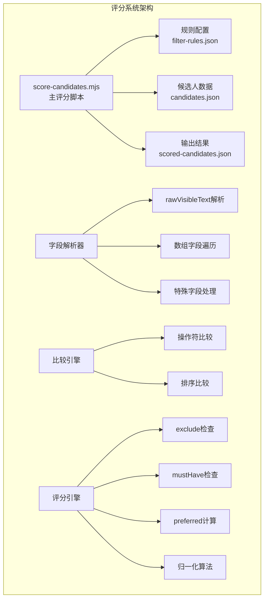

**图表来源**
- [scripts/score-candidates.mjs:1-406](file://scripts/score-candidates.mjs#L1-L406)
- [config/filter-rules.json:1-41](file://config/filter-rules.json#L1-L41)

**章节来源**
- [scripts/score-candidates.mjs:1-406](file://scripts/score-candidates.mjs#L1-L406)
- [config/filter-rules.json:1-41](file://config/filter-rules.json#L1-L41)

## 核心组件

### 评分算法核心流程

评分算法采用三阶段检查机制，确保规则的正确执行顺序：

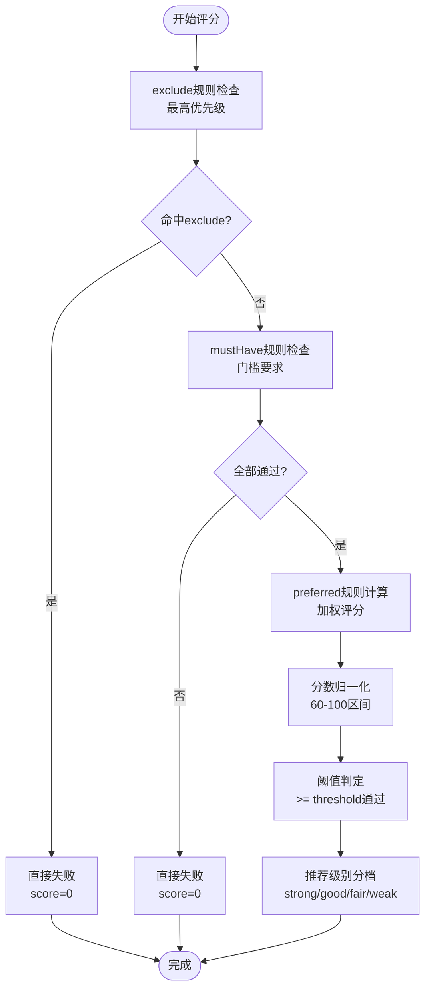

**图表来源**
- [scripts/score-candidates.mjs:229-340](file://scripts/score-candidates.mjs#L229-L340)

### 字段解析系统

系统实现了智能字段解析，特别针对Boss直聘提取数据中的字段偏移问题：

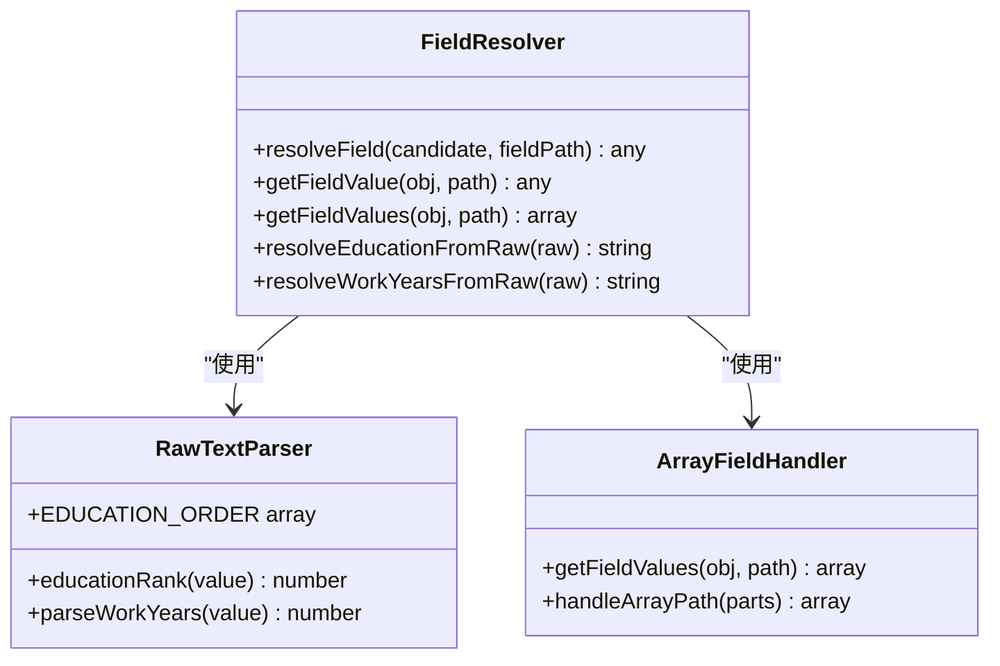

**图表来源**
- [scripts/score-candidates.mjs:79-138](file://scripts/score-candidates.mjs#L79-L138)
- [scripts/score-candidates.mjs:24-31](file://scripts/score-candidates.mjs#L24-L31)

**章节来源**
- [scripts/score-candidates.mjs:79-138](file://scripts/score-candidates.mjs#L79-L138)
- [scripts/score-candidates.mjs:24-31](file://scripts/score-candidates.mjs#L24-L31)

## 架构概览

评分算法采用模块化设计，各组件职责清晰分离：

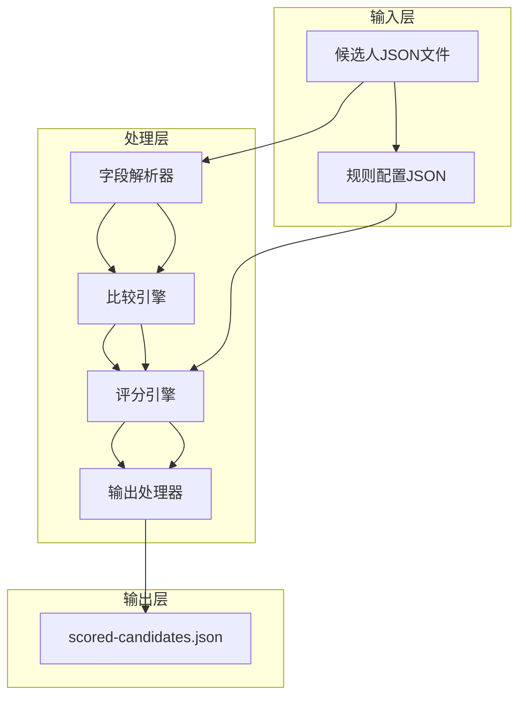

**图表来源**
- [scripts/score-candidates.mjs:342-383](file://scripts/score-candidates.mjs#L342-L383)

### 规则配置结构

规则配置采用JSON格式，支持三种规则类型：

| 规则类型 | 作用 | 权重 | 说明 |
|---------|------|------|------|
| mustHave | 门槛规则 | 无权重 | 必须满足，不满足直接失败 |
| preferred | 加分规则 | 有权重 | 满足加分，不满足不扣分 |
| exclude | 排除规则 | 无权重 | 命中即直接失败 |

**章节来源**
- [config/filter-rules.json:4-40](file://config/filter-rules.json#L4-L40)

## 详细组件分析

### 排除规则系统（Exclude）

排除规则具有最高优先级，一旦命中立即终止评分流程：

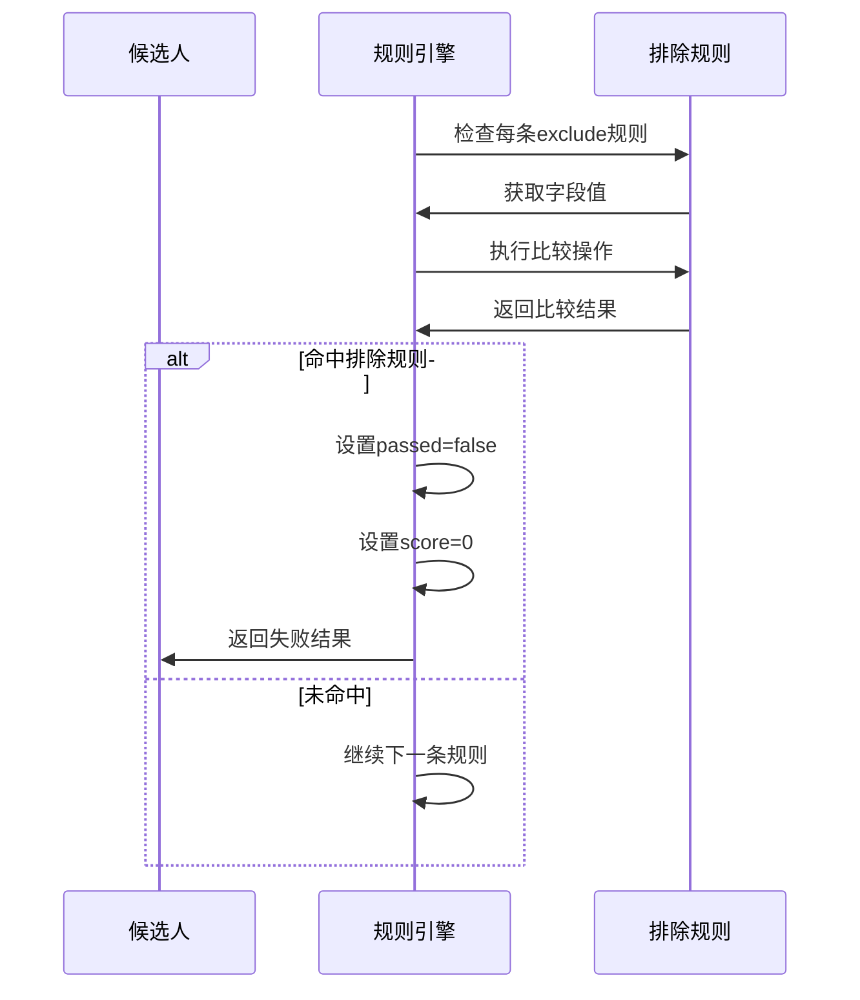

**图表来源**
- [scripts/score-candidates.mjs:236-259](file://scripts/score-candidates.mjs#L236-L259)

排除规则的特点：
- **最高优先级**：命中即刻失败，不继续后续检查
- **无权重概念**：仅影响通过状态，不影响分数计算
- **快速失败**：提升整体性能，避免不必要的计算

### 必须规则系统（MustHave）

mustHave规则作为评分门槛，必须全部满足才能进入评分阶段：

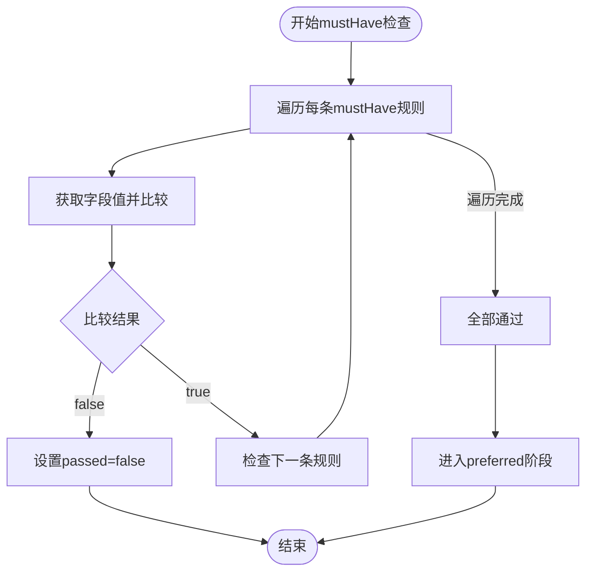

**图表来源**
- [scripts/score-candidates.mjs:261-279](file://scripts/score-candidates.mjs#L261-L279)

mustHave规则的关键特性：
- **强制通过要求**：任一不满足即直接失败
- **不影响分数**：不计入分数计算，仅影响通过状态
- **门槛设定**：确保候选人基本条件达标

### 偏好规则系统（Preferred）

preferred规则提供加权评分机制，是评分的核心组成部分：

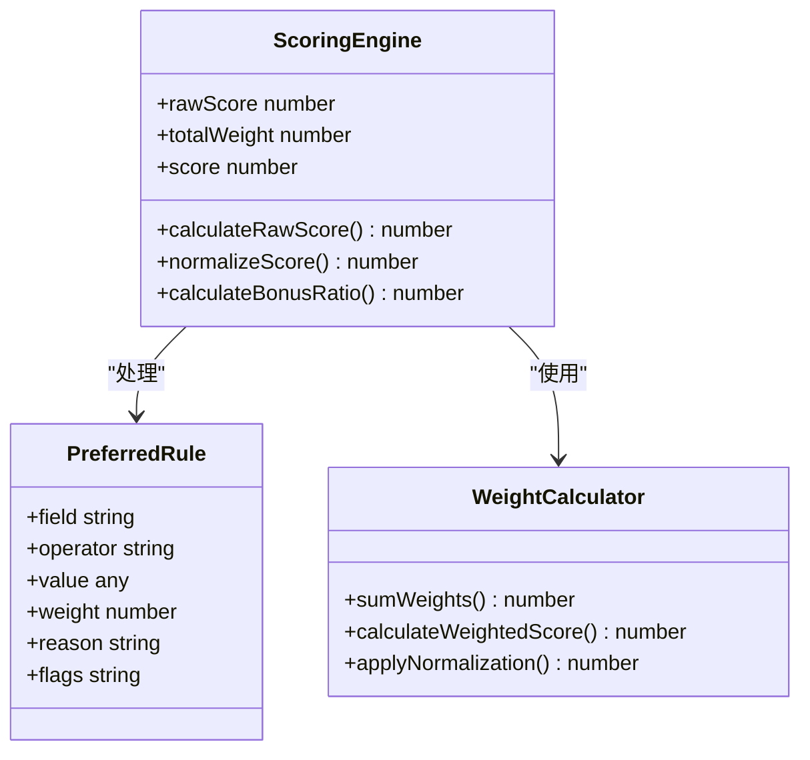

**图表来源**
- [scripts/score-candidates.mjs:292-314](file://scripts/score-candidates.mjs#L292-L314)

preferred规则的计算逻辑：
- **权重累加**：统计所有规则的权重总和
- **满足计分**：每条满足的规则按权重加分
- **比例计算**：满足权重/总权重得到比例因子
- **区间映射**：将比例映射到60-100分区间

### 分数归一化算法

分数归一化是评分系统的核心算法，确保分数在合理范围内：

#### 数学公式

```
当 totalWeight = 0 时：
    score = 100

当 totalWeight > 0 时：
    bonusRatio = rawScore / totalWeight
    score = round(60 + bonusRatio × 40)
    其中 bonusRatio ∈ [0, 1]
```

#### 算法解释

1. **基础分60分**：mustHave全部通过时给予60分基础分
2. **加分区间40分**：preferred权重贡献在0-40分之间
3. **比例映射**：满足权重占总权重的比例决定加分多少
4. **四舍五入**：确保最终分数为整数

#### 边界情况处理

```mermaid
flowchart TD
A[开始归一化] --> B{totalWeight = 0?}
B --> |是| C[score = 100]
B --> |否| D{passed = false?}
D --> |是| E[score = 0]
D --> |否| F[bonusRatio = rawScore/totalWeight]
F --> G[score = round(60 + bonusRatio × 40)]
C --> H[结束]
E --> H
G --> H
```

**图表来源**
- [scripts/score-candidates.mjs:316-327](file://scripts/score-candidates.mjs#L316-L327)

### 推荐级别分档

getRecommendationLevel函数根据最终分数进行智能分档：

| 等级 | 分数范围 | 描述 |
|------|----------|------|
| strong | 80-100 | 强烈推荐，优秀候选人 |
| good | 60-79 | 推荐，良好候选人 |
| fair | 40-59 | 考虑推荐，一般候选人 |
| weak | 0-39 | 不推荐，需要进一步评估 |

```mermaid
flowchart TD
A[获取分数] --> B{score ≥ 80?}
B --> |是| C[返回 "strong"]
B --> |否| D{score ≥ 60?}
D --> |是| E[返回 "good"]
D --> |否| F{score ≥ 40?}
F --> |是| G[返回 "fair"]
F --> |否| H[返回 "weak"]
```

**图表来源**
- [scripts/score-candidates.mjs:222-227](file://scripts/score-candidates.mjs#L222-L227)

### 阈值判定机制

阈值机制确保只有达到一定标准的候选人才能通过：

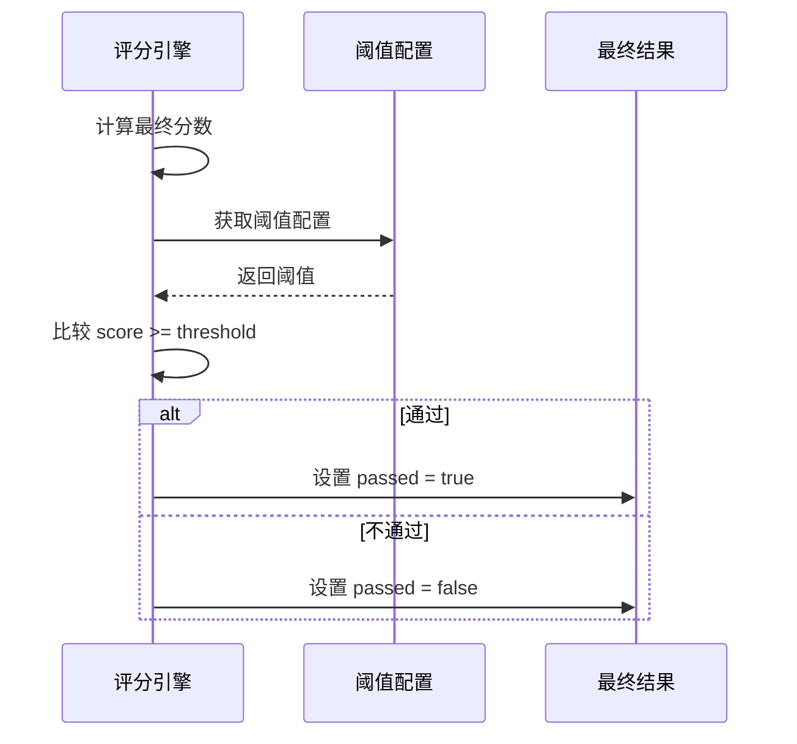

**图表来源**
- [scripts/score-candidates.mjs:329-331](file://scripts/score-candidates.mjs#L329-L331)

## 依赖关系分析

评分算法模块的依赖关系清晰明确：

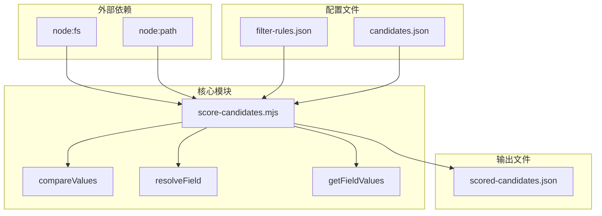

**图表来源**
- [scripts/score-candidates.mjs:1-22](file://scripts/score-candidates.mjs#L1-L22)

### 内部依赖关系

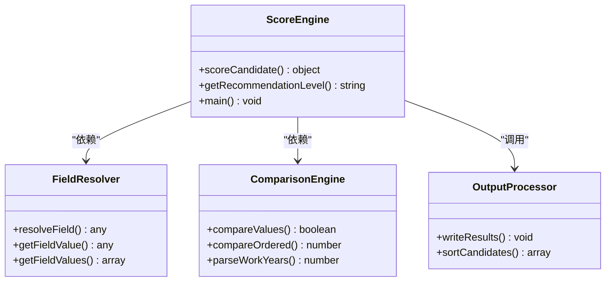

**图表来源**
- [scripts/score-candidates.mjs:229-340](file://scripts/score-candidates.mjs#L229-L340)

**章节来源**
- [scripts/score-candidates.mjs:1-406](file://scripts/score-candidates.mjs#L1-L406)

## 性能考虑

### 时间复杂度分析

- **字段解析**：O(n)，其中n为规则数量
- **比较操作**：O(m)，其中m为字段值数量
- **数组遍历**：O(k)，其中k为数组元素数量
- **总体复杂度**：O(n × m × k)

### 空间复杂度分析

- **候选人数据**：O(N)，N为候选人数量
- **规则配置**：O(R)，R为规则数量
- **中间结果**：O(N + R)

### 性能优化策略

1. **早期退出**：exclude和mustHave规则的快速失败机制
2. **缓存机制**：重复字段值的缓存利用
3. **批量处理**：候选人数据的批量评分处理
4. **内存管理**：及时释放不再使用的中间变量

## 故障排除指南

### 常见问题及解决方案

#### 字段解析错误

**问题**：字段值解析不正确
**原因**：rawVisibleText格式变化或字段路径错误
**解决方案**：
- 检查rawVisibleText格式是否符合预期
- 验证字段路径的正确性
- 使用getFieldValue进行调试验证

#### 规则配置错误

**问题**：规则执行异常或结果不符合预期
**原因**：操作符使用错误或值类型不匹配
**解决方案**：
- 检查操作符是否支持目标数据类型
- 验证值的格式和类型
- 查看规则配置示例

#### 性能问题

**问题**：大量候选人处理缓慢
**原因**：规则过多或数据量过大
**解决方案**：
- 优化规则配置，减少不必要的规则
- 分批处理大量数据
- 检查系统资源使用情况

### 错误处理机制

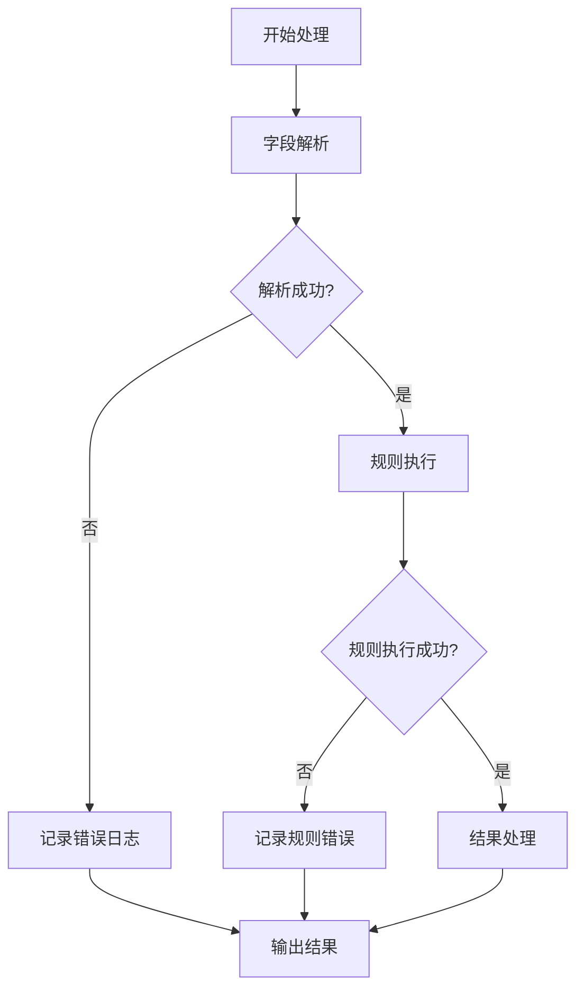

**图表来源**
- [scripts/score-candidates.mjs:148-200](file://scripts/score-candidates.mjs#L148-L200)

**章节来源**
- [scripts/score-candidates.mjs:148-200](file://scripts/score-candidates.mjs#L148-L200)

## 结论

评分算法模块实现了完整的候选人筛选评分系统，具有以下特点：

1. **清晰的优先级体系**：exclude > mustHave > preferred的三层检查机制
2. **灵活的规则配置**：支持多种操作符和数据类型的规则定义
3. **智能的分数归一化**：确保分数在合理范围内的数学算法
4. **完善的输出结构**：提供详细的评分过程和结果分析
5. **良好的扩展性**：模块化设计便于功能扩展和维护

该系统通过纯脚本实现，避免了外部依赖，提高了系统的稳定性和可维护性。评分算法的设计充分考虑了实际应用场景的需求，为候选人筛选提供了科学、客观的决策支持。