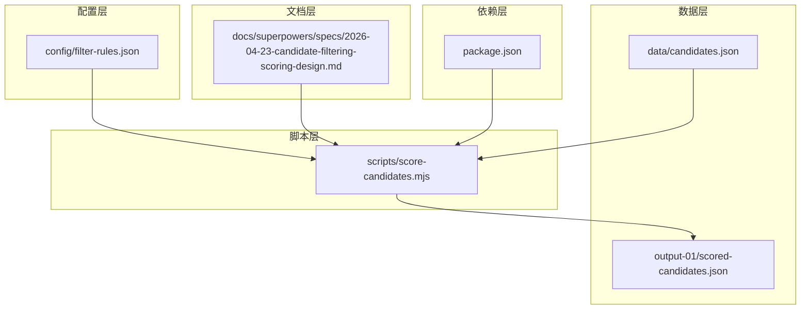
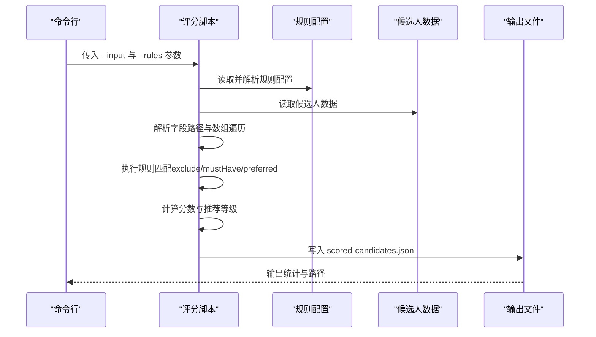
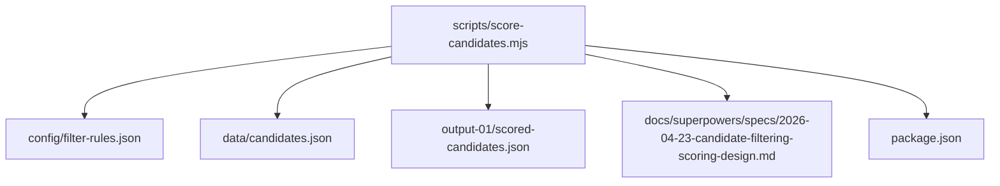

# 配置管理

<cite>
**本文引用的文件**
- [filter-rules.json](file://config/filter-rules.json)
- [score-candidates.mjs](file://scripts/score-candidates.mjs)
- [2026-04-23-candidate-filtering-scoring-design.md](file://docs/superpowers/specs/2026-04-23-candidate-filtering-scoring-design.md)
- [candidates.json](file://data/candidates.json)
- [scored-candidates.json](file://output-01/scored-candidates.json)
- [package.json](file://package.json)
- [README.md](file://README.md)
</cite>

## 目录
1. [简介](#简介)
2. [项目结构](#项目结构)
3. [核心组件](#核心组件)
4. [架构总览](#架构总览)
5. [详细组件分析](#详细组件分析)
6. [依赖关系分析](#依赖关系分析)
7. [性能考量](#性能考量)
8. [故障排查指南](#故障排查指南)
9. [结论](#结论)
10. [附录](#附录)

## 简介
本文件面向配置管理系统，聚焦于 filter-rules.json 配置文件的完整结构、字段定义、语法规则与最佳实践，涵盖 mustHave、preferred、exclude 三类规则的配置示例与调优建议，并解释 threshold 参数的设置原则与影响范围。文档还覆盖规则版本管理与命名规范、配置验证机制与常见错误排查方法，以及配置文件的加载流程与错误处理机制。最后提供不同业务场景下的配置模板与调优建议，帮助读者快速构建稳定可靠的候选人筛选评分系统。

## 项目结构
本项目围绕“规则配置 + 评分脚本”的架构展开，关键文件与职责如下：
- config/filter-rules.json：规则配置文件，定义 mustHave、preferred、exclude、threshold 等规则集合与阈值。
- scripts/score-candidates.mjs：评分脚本，负责加载候选人数据与规则配置，执行字段解析、规则匹配与评分计算，并输出 scored-candidates.json。
- docs/superpowers/specs/2026-04-23-candidate-filtering-scoring-design.md：设计文档，明确规则结构、操作符、字段解析与评分流程。
- data/candidates.json：示例候选人数据，用于演示规则匹配与评分过程。
- output-01/scored-candidates.json：评分脚本输出的最终结果文件，包含筛选统计与通过名单。
- package.json：项目依赖，包含 OCR 识别库等运行时依赖。
- README.md：项目总体介绍与使用说明。

图表来源
- [filter-rules.json](file://config/filter-rules.json)
- [score-candidates.mjs](file://scripts/score-candidates.mjs)
- [2026-04-23-candidate-filtering-scoring-design.md](file://docs/superpowers/specs/2026-04-23-candidate-filtering-scoring-design.md)
- [candidates.json](file://data/candidates.json)
- [scored-candidates.json](file://output-01/scored-candidates.json)
- [package.json](file://package.json)

章节来源
- [README.md:1-168](file://README.md#L1-L168)
- [package.json:1-11](file://package.json#L1-L11)

## 核心组件
- 规则配置文件（filter-rules.json）
  - 结构：包含 name、version、rules 对象，rules 下含 mustHave、preferred、exclude、threshold 四个字段。
  - 字段作用：
    - name：规则集名称，便于识别与版本追踪。
    - version：规则集版本号，遵循语义化版本管理。
    - rules.mustHave：必须满足的门槛规则，任一不满足将直接否决候选人。
    - rules.preferred：加分规则，满足时按权重累加，决定最终分数。
    - rules.exclude：排除规则，命中即直接否决。
    - rules.threshold：通过阈值，默认 60，最终 score ≥ threshold 才视为通过。
- 评分脚本（score-candidates.mjs）
  - 负责解析 CLI 参数、加载候选人数据与规则配置、执行字段解析与规则匹配、计算分数与推荐等级、输出结果文件。
  - 提供字段路径解析、数组字段遍历、正则匹配、存在性判断、数值与学历排序比较等能力。
- 设计文档（2026-04-23-candidate-filtering-scoring-design.md）
  - 明确规则结构、操作符、字段解析与评分流程，提供默认规则示例与输出结构说明。

章节来源
- [filter-rules.json:1-41](file://config/filter-rules.json#L1-L41)
- [score-candidates.mjs:229-340](file://scripts/score-candidates.mjs#L229-L340)
- [2026-04-23-candidate-filtering-scoring-design.md:24-270](file://docs/superpowers/specs/2026-04-23-candidate-filtering-scoring-design.md#L24-L270)

## 架构总览
下图展示了从规则配置到评分输出的完整流程，包括字段解析、规则匹配、分数计算与阈值判定。

图表来源
- [score-candidates.mjs:342-383](file://scripts/score-candidates.mjs#L342-L383)
- [filter-rules.json:1-41](file://config/filter-rules.json#L1-L41)
- [candidates.json:1-49](file://data/candidates.json#L1-L49)

## 详细组件分析

### 规则配置文件结构与字段定义
- 顶层字段
  - name：字符串，规则集名称，用于标识与审计。
  - version：字符串，规则集版本号，建议采用语义化版本（如 1.0、2.1、3.0.1）。
  - rules：对象，包含 mustHave、preferred、exclude、threshold 四个字段。
- rules.rules 字段
  - mustHave：数组，每条规则为对象，包含 field、operator、value、reason 等字段，用于设置门槛。
  - preferred：数组，每条规则为对象，包含 field、operator、value、weight、reason、flags 等字段，用于加分。
  - exclude：数组，每条规则为对象，包含 field、operator、value、reason 等字段，用于直接否决。
  - threshold：数值，通过阈值，默认 60；若未设置则按默认值处理。
- 规则对象字段
  - field：字符串，候选人 JSON 中的字段路径，支持数组遍历（如 workExperience[].position）。
  - operator：字符串，比较操作符，支持 equals、contains、in、>=、>、<=、<、regex、exists。
  - value：字符串或数组，比较值；当 operator 为 in 时为数组。
  - weight：数值，仅 preferred 规则有效，满足时累加到总分。
  - reason：字符串，规则说明，输出到 reasons 中，便于审计。
  - flags：字符串，仅 regex 操作符有效，正则标志位（如 i）。

章节来源
- [filter-rules.json:1-41](file://config/filter-rules.json#L1-L41)
- [2026-04-23-candidate-filtering-scoring-design.md:24-75](file://docs/superpowers/specs/2026-04-23-candidate-filtering-scoring-design.md#L24-L75)

### 规则语法与操作符
- 操作符一览
  - equals：精确匹配。
  - contains：包含匹配（字符串或数组）。
  - in：值在列表中。
  - >=、>、<=、<：可排序值比较（学历、工作年限等）。
  - regex：正则匹配，支持 flags。
  - exists：字段存在即满足。
- 字段路径与数组遍历
  - 普通路径：basicInfo.education。
  - 数组路径：workExperience[].position，表示遍历数组中每个元素的 position 字段，任一匹配即满足。
- 字段解析与偏移修正
  - basicInfo.education 与 basicInfo.workYears 优先从 rawVisibleText 提取，再回退到原字段值。
  - rawVisibleText 格式包含姓名、活跃状态、年龄、工作年限、学历等，脚本据此提取最高学历与工作年限。

章节来源
- [2026-04-23-candidate-filtering-scoring-design.md:87-97](file://docs/superpowers/specs/2026-04-23-candidate-filtering-scoring-design.md#L87-L97)
- [2026-04-23-candidate-filtering-scoring-design.md:102-139](file://docs/superpowers/specs/2026-04-23-candidate-filtering-scoring-design.md#L102-L139)
- [score-candidates.mjs:113-138](file://scripts/score-candidates.mjs#L113-L138)

### 三类规则配置示例与最佳实践
- mustHave（门槛规则）
  - 示例：要求学历不低于“本科”，理由为“学历要求本科及以上”。
  - 最佳实践：
    - 门槛规则数量不宜过多，避免误伤。
    - 优先使用可排序值（>=、>、<=、<）与 exists 操作符。
- preferred（加分规则）
  - 示例：工作经验不低于“2年”加 25 分；工作经历中包含“AI应用/AI开发/人工智能应用/大模型应用/LLM应用/智能体开发/Agent开发/AIGC应用/生成式AI/AI工程”加 35 分；包含“机器学习/深度学习/NLP/自然语言/大模型算法/算法工程师/算法开发”加 20 分。
  - 最佳实践：
    - preferred 权重总和建议控制在合理范围内，避免过度加权。
    - 正则表达式需考虑大小写与多关键词组合，适当使用 flags。
- exclude（排除规则）
  - 示例：学历为“高中/中专/初中”时直接否决。
  - 最佳实践：
    - 排除规则优先级最高，应谨慎设置，避免误伤。
    - 使用 in 操作符一次性排除多个不合规值。

章节来源
- [filter-rules.json:5-39](file://config/filter-rules.json#L5-L39)
- [2026-04-23-candidate-filtering-scoring-design.md:24-75](file://docs/superpowers/specs/2026-04-23-candidate-filtering-scoring-design.md#L24-L75)

### threshold 参数设置原则与影响范围
- 设置原则
  - 默认阈值为 60；若希望更严格，可提高阈值；若希望更宽松，可降低阈值。
  - 当 rules.threshold 未设置时，脚本按默认值处理。
- 影响范围
  - 最终是否通过由 score 与 threshold 比较决定：score ≥ threshold 为通过。
  - 若 rules.threshold 为 0，则通过门槛最低，适合初步筛选；若为 100，则几乎不可能通过，适合极端严格场景。

章节来源
- [score-candidates.mjs:329-331](file://scripts/score-candidates.mjs#L329-L331)
- [2026-04-23-candidate-filtering-scoring-design.md:159-166](file://docs/superpowers/specs/2026-04-23-candidate-filtering-scoring-design.md#L159-L166)

### 规则版本管理与命名规范
- 版本管理
  - 使用语义化版本（如 1.0、2.1、3.0.1），每次规则调整均应更新 version。
  - 建议在规则文件中保留变更记录与说明，便于追溯。
- 命名规范
  - name 建议包含岗位、经验要求、加分方向与版本信息，例如“AI应用开发工程师-本科2年经验+AI加分”。
  - 字段路径使用点号分隔，数组遍历使用 workExperience[].position 形式。
  - reason 字段保持简洁明确，便于审计与复核。

章节来源
- [filter-rules.json:2-3](file://config/filter-rules.json#L2-L3)
- [2026-04-23-candidate-filtering-scoring-design.md:24-75](file://docs/superpowers/specs/2026-04-23-candidate-filtering-scoring-design.md#L24-L75)

### 配置验证机制与常见错误排查
- 验证机制
  - 字段解析：支持普通路径与数组路径，数组路径遍历任一匹配即满足。
  - 操作符验证：未知操作符将被忽略并记录警告。
  - 正则验证：正则表达式异常将导致匹配失败而非抛错。
- 常见错误与排查
  - 字段路径错误：确认路径与候选人数据结构一致，数组路径使用 workExperience[].position。
  - 操作符不匹配：检查 operator 与 value 类型，如 in 需要数组，regex 需要正则字符串。
  - 正则表达式无效：检查 flags 与正则语法，避免语法错误导致匹配失败。
  - 阈值设置不当：根据业务需求调整 threshold，避免过高或过低导致误判。
  - 权重总和不合理：preferred 权重总和过大可能导致分数分布过于集中。

章节来源
- [score-candidates.mjs:149-200](file://scripts/score-candidates.mjs#L149-L200)
- [score-candidates.mjs:180-191](file://scripts/score-candidates.mjs#L180-L191)

### 不同业务场景下的配置模板与调优建议
- 场景一：技术岗位（如 AI 应用开发工程师）
  - mustHave：学历不低于“本科”；工作经验不低于“2年”。
  - preferred：AI/算法相关经验加分；期望城市为“深圳”加分；语言技能加分。
  - exclude：学历为“高中/中专/初中”直接否决。
  - threshold：60-80 之间，根据岗位竞争激烈程度调整。
- 场景二：产品/运营岗位
  - mustHave：具备相关专业背景或经验；期望城市匹配。
  - preferred：项目经验、跨部门协作能力加分；证书/培训经历加分。
  - exclude：明显不相关行业或学历不符。
  - threshold：50-70 之间，侧重经验与匹配度。
- 场景三：应届生招聘
  - mustHave：应届毕业生或在校生；专业对口。
  - preferred：实习经历、校园活动、竞赛获奖加分。
  - exclude：明显不符合岗位要求的背景。
  - threshold：40-60 之间，放宽门槛以扩大候选池。

章节来源
- [filter-rules.json:5-39](file://config/filter-rules.json#L5-L39)
- [2026-04-23-candidate-filtering-scoring-design.md:24-75](file://docs/superpowers/specs/2026-04-23-candidate-filtering-scoring-design.md#L24-L75)

### 配置文件加载流程与错误处理机制
- 加载流程
  - 评分脚本解析 CLI 参数，读取候选人数据与规则配置文件。
  - 解析字段路径，执行规则匹配（exclude → mustHave → preferred）。
  - 计算分数与推荐等级，按 score 降序排列，输出 scored-candidates.json。
- 错误处理
  - 未知操作符：记录警告并跳过该规则。
  - 正则异常：捕获异常并返回匹配失败，避免中断流程。
  - 文件不存在：脚本会提示错误并退出。
  - 输出目录：自动创建输出目录，确保结果文件可写。

章节来源
- [score-candidates.mjs:342-383](file://scripts/score-candidates.mjs#L342-L383)
- [score-candidates.mjs:149-200](file://scripts/score-candidates.mjs#L149-L200)

## 依赖关系分析
- 评分脚本依赖
  - 依赖于规则配置文件与候选人数据文件。
  - 依赖于设计文档中的规则结构与评分流程说明。
  - 依赖于 package.json 中的运行时依赖（如 tesseract.js）。
- 输出依赖
  - 输出文件 scored-candidates.json 依赖于评分脚本的处理结果与阈值判定。

图表来源
- [score-candidates.mjs:342-383](file://scripts/score-candidates.mjs#L342-L383)
- [filter-rules.json:1-41](file://config/filter-rules.json#L1-L41)
- [candidates.json:1-49](file://data/candidates.json#L1-L49)
- [scored-candidates.json:1-800](file://output-01/scored-candidates.json#L1-L800)
- [2026-04-23-candidate-filtering-scoring-design.md:24-270](file://docs/superpowers/specs/2026-04-23-candidate-filtering-scoring-design.md#L24-L270)
- [package.json:1-11](file://package.json#L1-L11)

章节来源
- [package.json:6-9](file://package.json#L6-L9)

## 性能考量
- 字段解析与数组遍历
  - 数组路径遍历会增加比较次数，建议尽量缩小数组范围或使用更精确的字段路径。
- 正则匹配
  - 正则表达式复杂度较高时会影响性能，建议优化正则表达式，减少回溯。
- 分数计算
  - preferred 权重总和越大，分数分布越集中，建议合理分配权重，避免过度加权。
- I/O 与输出
  - 输出文件较大时，建议分批处理或压缩输出，减少磁盘压力。

## 故障排查指南
- 规则不生效
  - 检查字段路径是否与候选人数据一致；确认数组路径使用 workExperience[].position。
  - 检查操作符与 value 类型是否匹配；regex 需要合法正则表达式。
- 评分异常
  - 检查 threshold 设置是否合理；确认 mustHave 是否全部满足。
  - 检查 preferred 权重总和是否过大或过小。
- 输出文件为空
  - 检查输入文件路径是否正确；确认规则配置文件格式是否正确。
  - 检查输出目录权限与磁盘空间。

章节来源
- [score-candidates.mjs:149-200](file://scripts/score-candidates.mjs#L149-L200)
- [score-candidates.mjs:342-383](file://scripts/score-candidates.mjs#L342-L383)

## 结论
本配置管理系统通过规则配置文件与评分脚本的解耦设计，实现了灵活、可扩展的候选人筛选评分能力。规则配置文件提供了清晰的结构与丰富的操作符支持，评分脚本则负责稳健的字段解析、规则匹配与分数计算。结合版本管理与命名规范，系统能够满足不同业务场景的需求，并通过阈值与权重调优实现精准筛选。建议在实际使用中持续优化规则配置，关注性能与稳定性，确保筛选结果的准确性与可审计性。

## 附录
- 规则配置示例与输出结构可参考设计文档与示例文件。
- 运行时依赖可在 package.json 中查看。

章节来源
- [2026-04-23-candidate-filtering-scoring-design.md:180-212](file://docs/superpowers/specs/2026-04-23-candidate-filtering-scoring-design.md#L180-L212)
- [scored-candidates.json:1-800](file://output-01/scored-candidates.json#L1-L800)