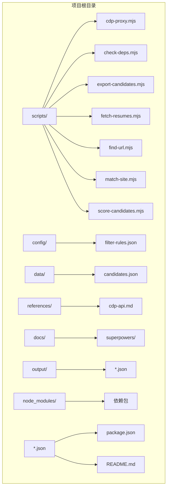
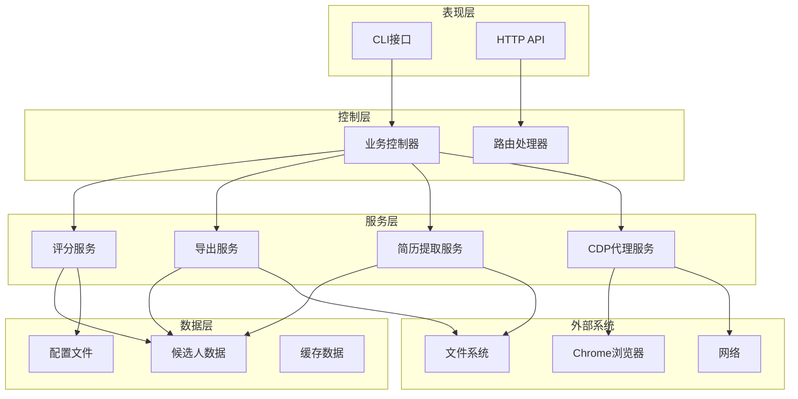
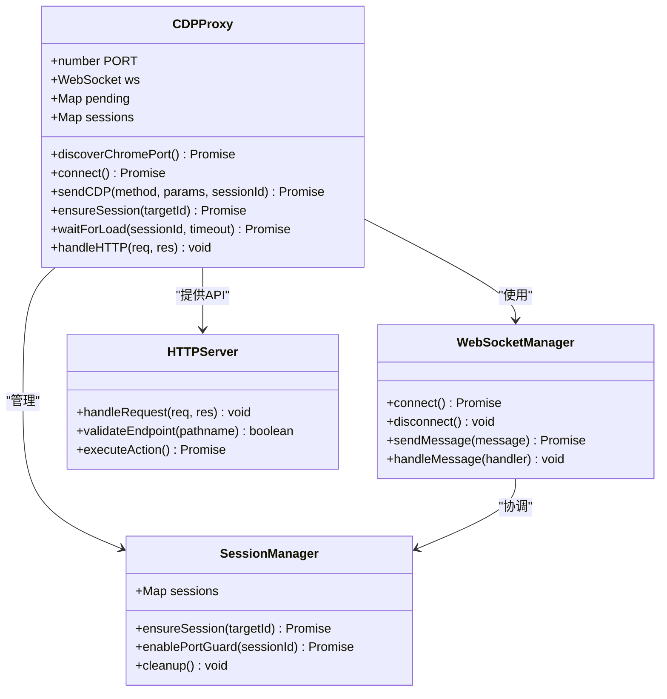
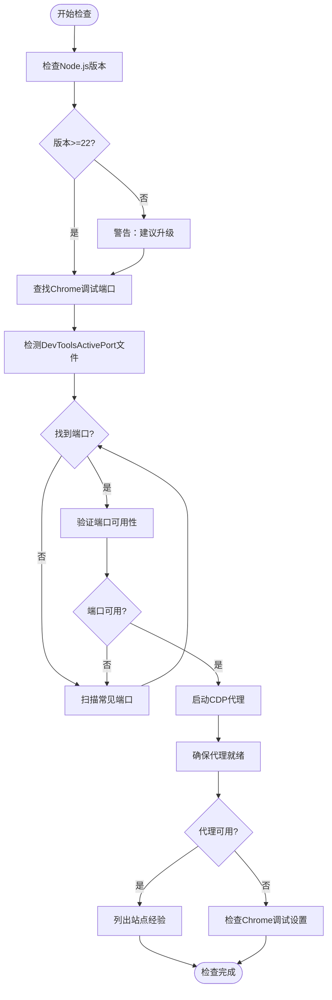
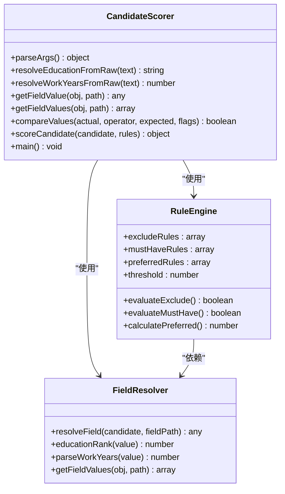
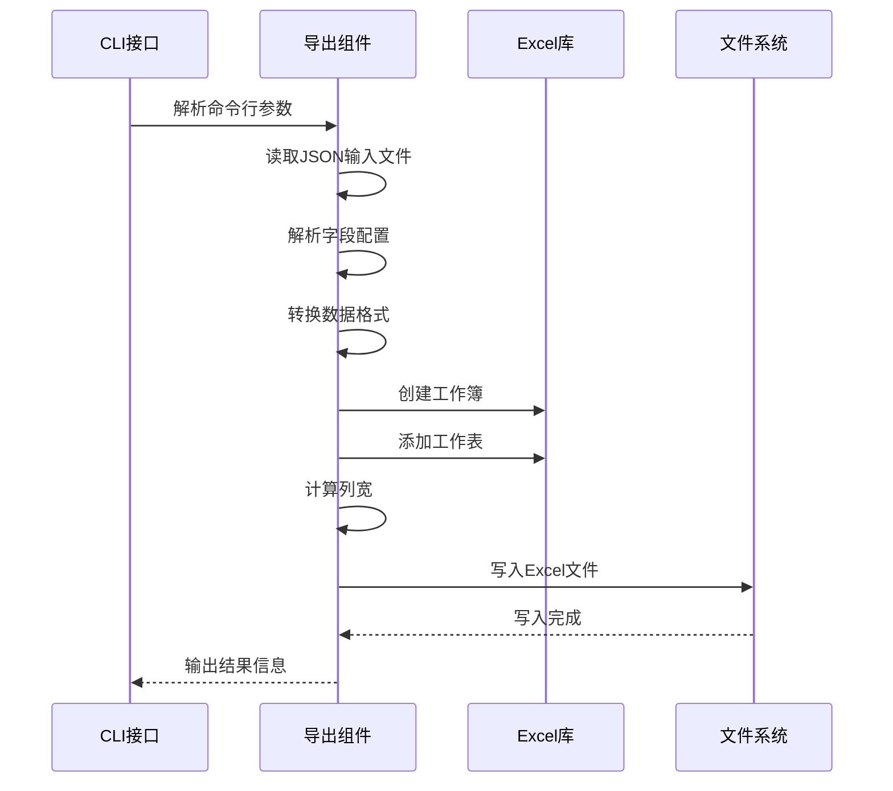
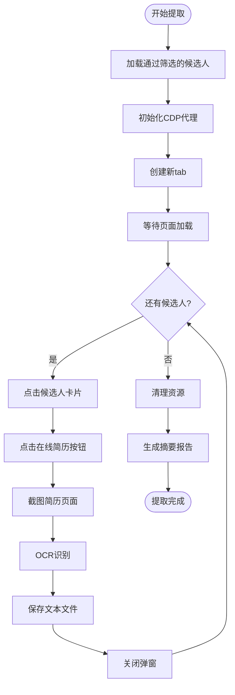
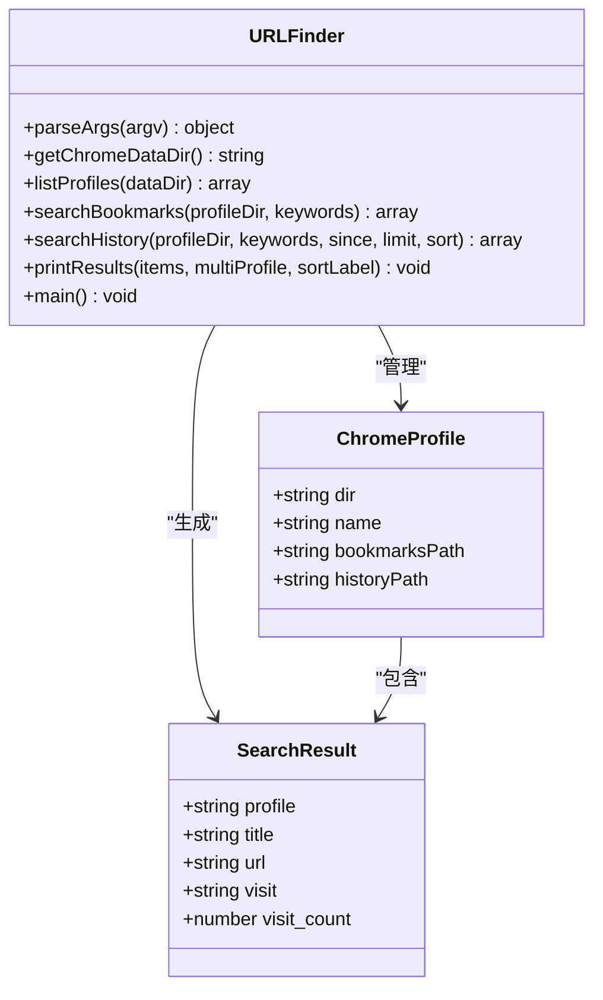
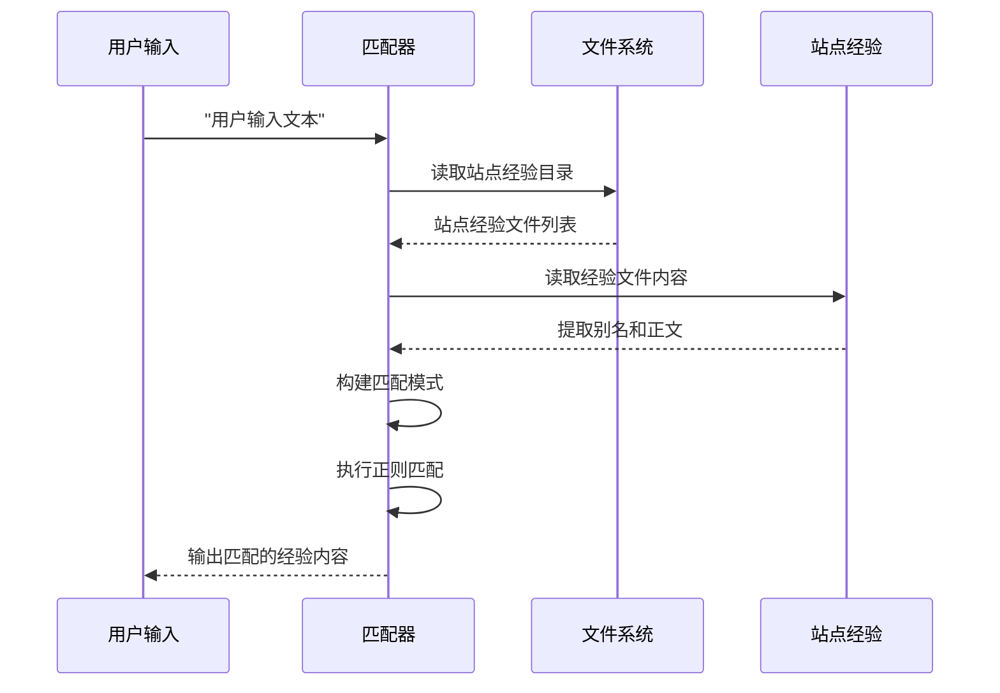
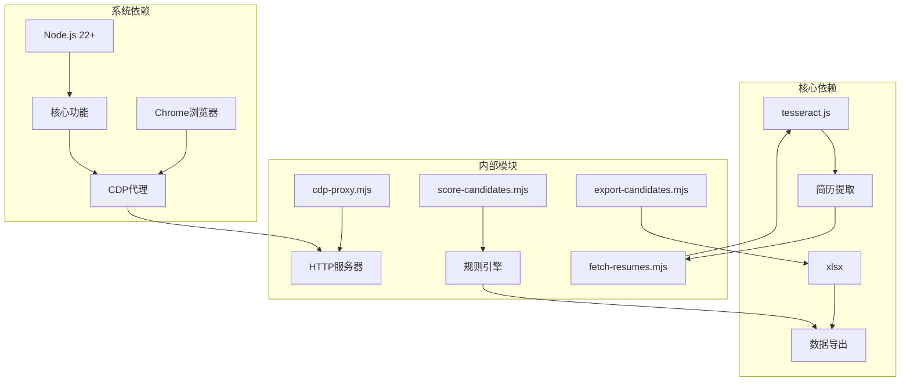

# 代码结构与模块设计

<cite>
**本文档引用的文件**
- [README.md](file://README.md)
- [SKILL.md](file://SKILL.md)
- [package.json](file://package.json)
- [cdp-proxy.mjs](file://scripts/cdp-proxy.mjs)
- [check-deps.mjs](file://scripts/check-deps.mjs)
- [export-candidates.mjs](file://scripts/export-candidates.mjs)
- [fetch-resumes.mjs](file://scripts/fetch-resumes.mjs)
- [find-url.mjs](file://scripts/find-url.mjs)
- [match-site.mjs](file://scripts/match-site.mjs)
- [score-candidates.mjs](file://scripts/score-candidates.mjs)
- [filter-rules.json](file://config/filter-rules.json)
- [candidates.json](file://data/candidates.json)
- [cdp-api.md](file://references/cdp-api.md)
</cite>

## 目录
1. [简介](#简介)
2. [项目结构](#项目结构)
3. [核心组件](#核心组件)
4. [架构概览](#架构概览)
5. [详细组件分析](#详细组件分析)
6. [依赖分析](#依赖分析)
7. [性能考虑](#性能考虑)
8. [故障排除指南](#故障排除指南)
9. [结论](#结论)
10. [附录](#附录)

## 简介

Web Access项目是一个为AI Agent提供完整联网能力的Skill，专注于浏览器自动化和站点经验积累。该项目通过CDP（Chrome DevTools Protocol）代理实现对用户日常Chrome浏览器的直接控制，提供了一套完整的Web访问解决方案。

项目的核心价值在于：
- **联网策略自动化**：根据场景自动选择WebSearch、WebFetch、curl、Jina或CDP等不同工具
- **CDP浏览器操作**：直连用户Chrome，天然携带登录态，支持动态页面、交互操作、视频截帧
- **站点经验积累**：按域名存储操作经验，跨session复用
- **多平台兼容**：支持Windows、Linux、macOS平台

## 项目结构

项目采用模块化设计，按照功能域进行文件组织：



**图表来源**
- [package.json:1-11](file://package.json#L1-L11)
- [README.md:1-168](file://README.md#L1-L168)

### 目录结构设计原则

1. **功能模块化**：每个脚本文件负责单一功能领域
2. **数据分离**：配置文件、数据文件、输出文件分离管理
3. **文档完善**：提供完整的API参考和使用说明
4. **可扩展性**：支持新的站点经验和处理流程

**章节来源**
- [package.json:1-11](file://package.json#L1-L11)
- [README.md:1-168](file://README.md#L1-L168)

## 核心组件

### CDP代理服务
CDP代理是整个系统的核心，提供HTTP API来控制Chrome浏览器。

### 环境检查工具
负责验证Node.js版本、Chrome调试端口和代理服务的可用性。

### 候选人处理流水线
包含评分、导出、简历提取等功能模块。

### 站点经验管理系统
基于域名的站点经验文件管理和匹配机制。

**章节来源**
- [cdp-proxy.mjs:1-602](file://scripts/cdp-proxy.mjs#L1-L602)
- [check-deps.mjs:1-172](file://scripts/check-deps.mjs#L1-L172)
- [score-candidates.mjs:1-406](file://scripts/score-candidates.mjs#L1-L406)

## 架构概览

项目采用分层架构设计，各层职责清晰分离：



**图表来源**
- [cdp-proxy.mjs:287-552](file://scripts/cdp-proxy.mjs#L287-L552)
- [check-deps.mjs:141-171](file://scripts/check-deps.mjs#L141-L171)
- [score-candidates.mjs:342-383](file://scripts/score-candidates.mjs#L342-L383)

### 模块间通信机制

系统通过以下几种方式进行模块间通信：

1. **HTTP API通信**：CDP代理提供RESTful API
2. **文件系统共享**：通过JSON文件传递数据
3. **标准输出/输入**：脚本间通过控制台输出进行信息交换
4. **环境变量**：配置系统参数

**章节来源**
- [cdp-proxy.mjs:287-552](file://scripts/cdp-proxy.mjs#L287-L552)
- [check-deps.mjs:87-139](file://scripts/check-deps.mjs#L87-L139)

## 详细组件分析

### CDP代理服务组件

CDP代理服务是系统的核心组件，提供了完整的浏览器自动化能力。



**图表来源**
- [cdp-proxy.mjs:13-217](file://scripts/cdp-proxy.mjs#L13-L217)
- [cdp-proxy.mjs:287-552](file://scripts/cdp-proxy.mjs#L287-L552)

#### 核心功能特性

1. **跨平台Chrome发现**：自动检测不同操作系统下的Chrome调试端口
2. **WebSocket兼容层**：支持Node.js原生WebSocket和ws模块
3. **会话管理**：维护Target与Session的映射关系
4. **反风控机制**：拦截页面对调试端口的探测请求
5. **超时处理**：CDP命令超时自动清理

#### API端点设计

| 端点 | 方法 | 功能 | 请求参数 | 响应 |
|------|------|------|----------|------|
| /health | GET | 健康检查 | 无 | 连接状态 |
| /targets | GET | 列出所有页面 | 无 | 页面列表 |
| /new | GET | 创建新后台tab | url | targetId |
| /close | GET | 关闭tab | target | 操作结果 |
| /navigate | GET | 导航到URL | target, url | 导航结果 |
| /eval | POST | 执行JavaScript | target, body(JS) | 执行结果 |
| /click | POST | 点击元素 | target, body(CSS) | 点击结果 |
| /clickAt | POST | 真实鼠标点击 | target, body(CSS) | 点击坐标 |
| /setFiles | POST | 文件上传 | target, body(JSON) | 上传结果 |
| /scroll | GET | 滚动页面 | target, y, direction | 滚动结果 |
| /screenshot | GET | 截图 | target, file, format | 图片数据 |

**章节来源**
- [cdp-proxy.mjs:287-552](file://scripts/cdp-proxy.mjs#L287-L552)
- [cdp-api.md:10-107](file://references/cdp-api.md#L10-L107)

### 环境检查组件

环境检查组件负责验证系统前置条件和启动CDP代理服务。



**图表来源**
- [check-deps.mjs:15-139](file://scripts/check-deps.mjs#L15-L139)

#### 检查流程

1. **Node.js版本检查**：验证是否满足CDP要求
2. **Chrome端口检测**：通过多种方式发现Chrome调试端口
3. **代理服务启动**：自动启动并等待CDP代理就绪
4. **站点经验加载**：显示可用的站点经验列表

**章节来源**
- [check-deps.mjs:15-139](file://scripts/check-deps.mjs#L15-L139)

### 候选人评分组件

候选人评分组件实现了灵活的评分规则引擎，支持复杂的筛选逻辑。



**图表来源**
- [score-candidates.mjs:6-405](file://scripts/score-candidates.mjs#L6-L405)

#### 评分算法设计

1. **排除规则优先**：命中任一排除规则立即否决
2. **必须满足规则**：全部满足才能进入评分阶段
3. **偏好规则评分**：按权重计算加分，归一化到0-100分
4. **阈值判定**：根据阈值决定是否通过

#### 字段解析机制

| 字段类型 | 解析方式 | 示例 |
|----------|----------|------|
| 基础字段 | 直接路径访问 | `basicInfo.name` |
| 数组字段 | 遍历所有元素 | `workExperience[].position` |
| 特殊字段 | 文本提取 | `rawVisibleText`中的学历/经验 |
| 学历字段 | 排序比较 | 高中<大专<本科<硕士<博士 |
| 工作年限 | 数值解析 | "3年"→3, "10年以上"→10 |

**章节来源**
- [score-candidates.mjs:24-340](file://scripts/score-candidates.mjs#L24-L340)
- [filter-rules.json:1-41](file://config/filter-rules.json#L1-L41)

### 候选人导出组件

候选人导出组件负责将评分结果导出为Excel文件。



**图表来源**
- [export-candidates.mjs:25-195](file://scripts/export-candidates.mjs#L25-L195)

#### 字段映射配置

| 字段名 | 中文标题 | 数据提取函数 |
|--------|----------|-------------|
| name | 姓名 | `c.basicInfo.name` |
| age | 年龄 | `c.basicInfo.age` |
| workYears | 工作年限 | `c.basicInfo.workYears` |
| school | 学校 | `c.educationExperience[0].school` |
| education | 学历 | `c.basicInfo.education` |
| score | 分数 | `c.score` |
| passed | 是否通过 | `c.passed ? '是' : '否'` |
| recommendationLevel | 推荐等级 | `c.recommendationLevel` |
| currentPosition | 当前职位 | `c.workExperience[0].position` |
| currentCompany | 当前公司 | `c.workExperience[0].company` |
| expectCity | 期望城市 | `c.positionInfo.expectCity` |
| expectSalary | 期望薪资 | `c.positionInfo.expectSalary` |
| recommendationReasons | 推荐理由 | 过滤preferred规则的结果 |

**章节来源**
- [export-candidates.mjs:43-132](file://scripts/export-candidates.mjs#L43-L132)

### 在线简历提取组件

在线简历提取组件实现了针对Boss直聘平台的简历提取流程。



**图表来源**
- [fetch-resumes.mjs:250-380](file://scripts/fetch-resumes.mjs#L250-L380)

#### 处理流程特点

1. **智能等待机制**：检测页面元素加载状态
2. **虚拟滚动处理**：处理无限滚动列表
3. **Canvas截图方案**：针对Boss直聘的Canvas渲染
4. **OCR文本识别**：使用tesseract.js进行文字识别
5. **错误恢复机制**：失败时自动重试和清理

**章节来源**
- [fetch-resumes.mjs:98-243](file://scripts/fetch-resumes.mjs#L98-L243)

### Chrome URL检索组件

Chrome URL检索组件提供了从本地Chrome书签和历史中检索URL的能力。



**图表来源**
- [find-url.mjs:26-215](file://scripts/find-url.mjs#L26-L215)

#### 检索功能特性

1. **跨平台支持**：支持macOS、Linux、Windows
2. **多数据源**：同时支持书签和历史记录
3. **智能排序**：支持按最近访问或访问次数排序
4. **时间窗口过滤**：支持相对时间和绝对时间过滤
5. **关键词匹配**：支持多词AND匹配

**章节来源**
- [find-url.mjs:83-149](file://scripts/find-url.mjs#L83-L149)

### 站点经验匹配组件

站点经验匹配组件负责根据用户输入匹配相应的站点经验文件。



**图表来源**
- [match-site.mjs:14-46](file://scripts/match-site.mjs#L14-L46)

#### 匹配机制设计

1. **域名匹配**：直接匹配站点域名
2. **别名支持**：支持配置文件中的别名列表
3. **模糊匹配**：使用正则表达式进行模糊匹配
4. **大小写不敏感**：统一转换为小写进行匹配
5. **Frontmatter处理**：跳过YAML头部信息

**章节来源**
- [match-site.mjs:18-46](file://scripts/match-site.mjs#L18-L46)

## 依赖分析

项目依赖关系清晰，主要依赖包括：



**图表来源**
- [package.json:6-9](file://package.json#L6-L9)
- [cdp-proxy.mjs:6-12](file://scripts/cdp-proxy.mjs#L6-L12)

### 外部依赖管理

| 依赖包 | 版本 | 用途 |
|--------|------|------|
| tesseract.js | ^7.0.0 | OCR文字识别 |
| xlsx | ^0.18.5 | Excel文件处理 |

### 内部模块耦合度

1. **低耦合设计**：各模块职责单一，相互独立
2. **接口清晰**：通过HTTP API和文件系统进行通信
3. **可替换性**：核心CDP代理可被其他实现替换
4. **扩展性**：新增功能通过添加新模块实现

**章节来源**
- [package.json:6-9](file://package.json#L6-L9)
- [cdp-proxy.mjs:13-33](file://scripts/cdp-proxy.mjs#L13-L33)

## 性能考虑

### CDP代理性能优化

1. **连接复用**：避免频繁建立WebSocket连接
2. **会话缓存**：维护Target与Session的映射关系
3. **超时控制**：合理设置CDP命令超时时间
4. **内存管理**：及时清理超时的pending请求

### 数据处理性能

1. **增量处理**：只处理通过筛选的候选人
2. **并行处理**：简历提取支持多候选人并行
3. **缓存机制**：OCR结果可进行缓存
4. **流式处理**：大文件处理使用流式读取

### 系统资源管理

1. **端口检测**：避免端口冲突
2. **进程管理**：代理服务常驻运行
3. **文件句柄**：及时关闭文件描述符
4. **内存监控**：大型数据集处理时的内存管理

## 故障排除指南

### 常见问题诊断

| 问题类型 | 症状 | 解决方案 |
|----------|------|----------|
| Chrome未连接 | "Chrome未开启远程调试端口" | 检查chrome://inspect/#remote-debugging设置 |
| 端口占用 | "端口已被占用" | 检查是否有其他代理实例运行 |
| CDP命令超时 | "CDP命令超时" | 检查页面加载状态，适当增加等待时间 |
| OCR识别失败 | "OCR识别结果为空" | 检查图片质量，调整OCR参数 |
| Excel导出错误 | "xlsx包未安装" | 运行npm install xlsx |

### 调试工具

1. **健康检查**：使用`/health`端点检查代理状态
2. **日志输出**：详细的错误信息输出
3. **状态监控**：实时显示代理连接状态
4. **超时处理**：自动清理超时的请求

**章节来源**
- [cdp-proxy.mjs:594-599](file://scripts/cdp-proxy.mjs#L594-L599)
- [cdp-api.md:99-107](file://references/cdp-api.md#L99-L107)

## 结论

Web Access项目展现了优秀的模块化设计和架构实践：

### 设计优势

1. **清晰的分层架构**：表现层、控制层、服务层职责分明
2. **模块化设计**：每个功能模块独立封装，便于维护和扩展
3. **标准化接口**：统一的HTTP API设计，易于集成
4. **跨平台兼容**：支持多种操作系统和浏览器环境

### 技术创新

1. **CDP代理机制**：通过HTTP API控制Chrome浏览器
2. **智能评分系统**：灵活的规则引擎支持复杂筛选逻辑
3. **站点经验积累**：基于域名的经验文件管理
4. **多模态数据处理**：结合OCR、Excel导出等多种数据处理方式

### 可维护性考虑

1. **文档完善**：每个模块都有详细的使用说明
2. **错误处理**：完善的异常处理和恢复机制
3. **配置管理**：通过JSON文件进行灵活配置
4. **测试友好**：模块化设计便于单元测试

## 附录

### 开发最佳实践

1. **模块设计原则**
   - 单一职责：每个模块只负责一个功能领域
   - 低耦合：模块间通过明确定义的接口通信
   - 可测试性：设计易于单元测试的接口

2. **代码复用策略**
   - 抽象公共逻辑到工具函数
   - 使用配置驱动而非硬编码
   - 实现插件化架构支持扩展

3. **错误处理模式**
   - 统一的错误类型和消息格式
   - 适当的重试机制
   - 完善的日志记录

### 新模块开发模板

```javascript
// 新模块模板
#!/usr/bin/env node

/**
 * 模块名称 - 模块功能描述
 * 
 * 用途：简要说明模块的作用
 * 
 * 使用方法：说明如何使用该模块
 */

// 1. 导入必要的依赖
import { readFileSync, writeFileSync } from 'node:fs';
import { resolve } from 'node:path';

// 2. 定义全局常量
const MODULE_CONSTANTS = {
  // 定义模块级别的常量
};

// 3. 实现核心功能
function main() {
  // 主要业务逻辑
}

// 4. 导出公共接口
export { /* 导出需要的函数和常量 */ };

// 5. 检查是否直接执行
if (process.argv[1] === new URL(import.meta.url).pathname) {
  main();
}
```

### 模块扩展指南

1. **添加新功能模块**
   - 在scripts目录下创建新文件
   - 遵循现有模块的命名约定
   - 实现清晰的命令行接口
   - 添加必要的错误处理

2. **修改现有模块**
   - 保持向后兼容的API
   - 更新相关文档
   - 添加充分的测试用例
   - 进行回归测试

3. **配置文件管理**
   - 使用JSON格式存储配置
   - 提供默认配置值
   - 支持环境变量覆盖
   - 实现配置验证

**章节来源**
- [SKILL.md:154-290](file://SKILL.md#L154-L290)
- [README.md:75-168](file://README.md#L75-L168)