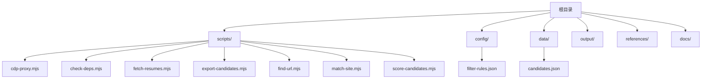
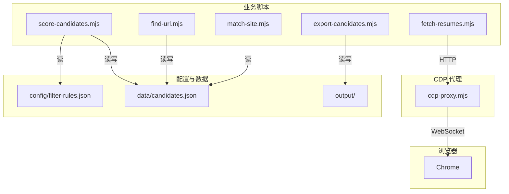
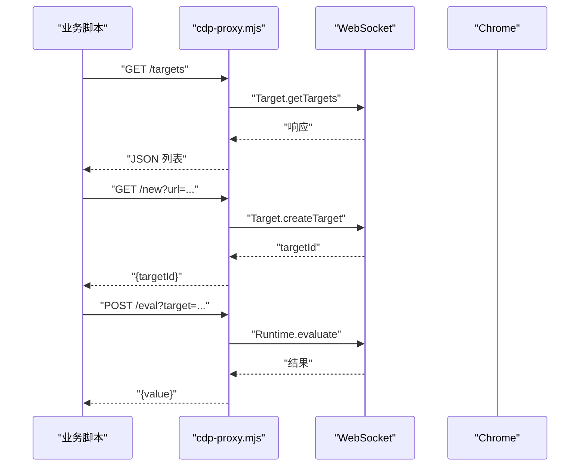
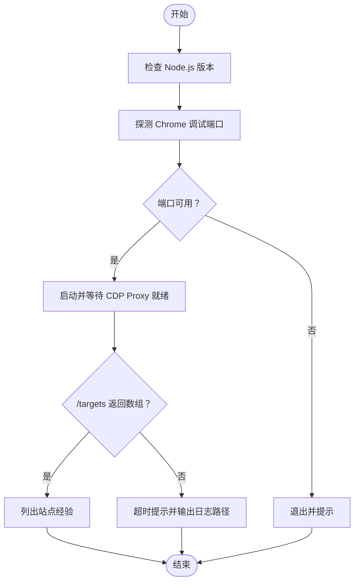
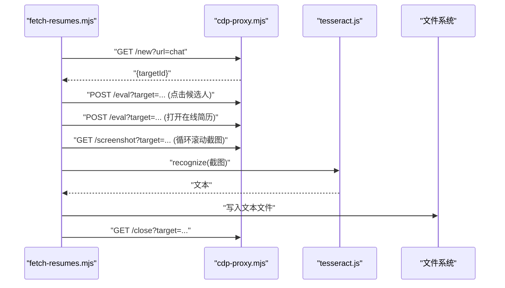
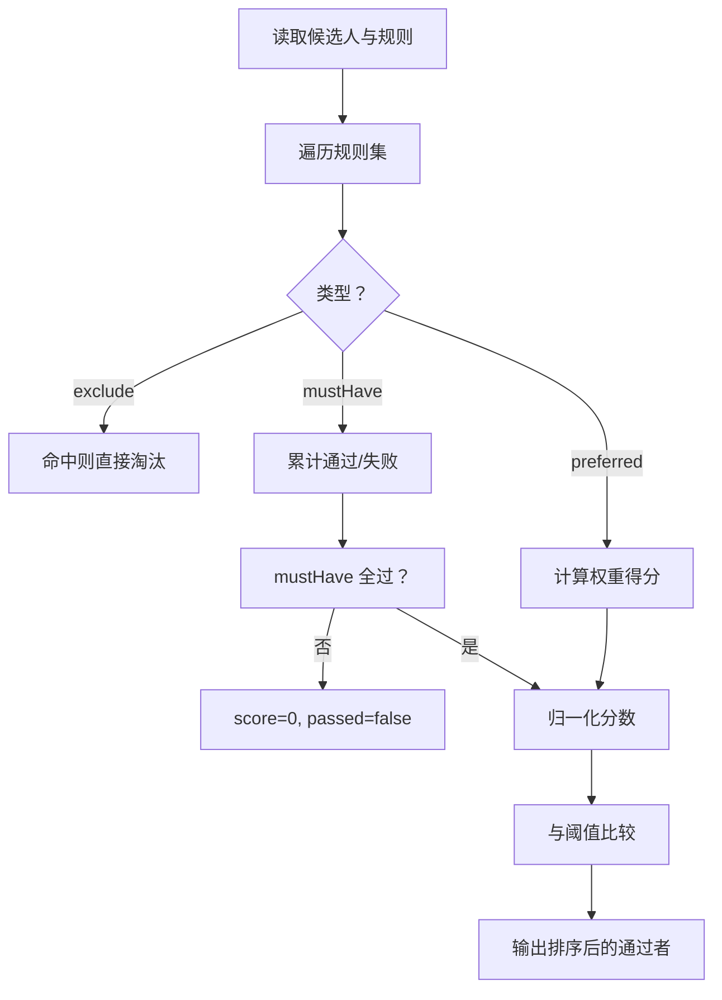
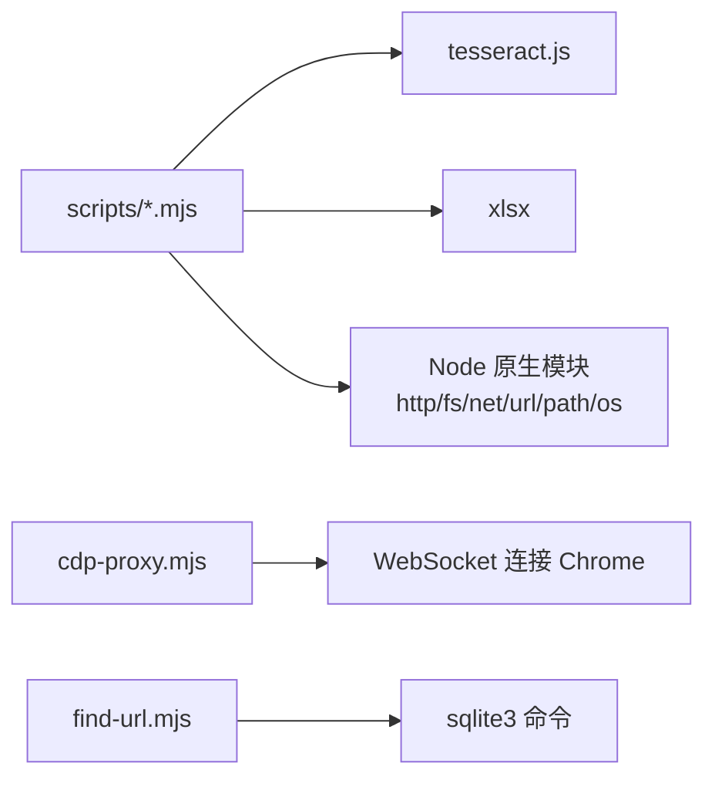

# 开发指南

<cite>
**本文引用的文件**
- [README.md](file://README.md)
- [package.json](file://package.json)
- [config/filter-rules.json](file://config/filter-rules.json)
- [data/candidates.json](file://data/candidates.json)
- [scripts/cdp-proxy.mjs](file://scripts/cdp-proxy.mjs)
- [scripts/check-deps.mjs](file://scripts/check-deps.mjs)
- [scripts/export-candidates.mjs](file://scripts/export-candidates.mjs)
- [scripts/fetch-resumes.mjs](file://scripts/fetch-resumes.mjs)
- [scripts/find-url.mjs](file://scripts/find-url.mjs)
- [scripts/match-site.mjs](file://scripts/match-site.mjs)
- [scripts/score-candidates.mjs](file://scripts/score-candidates.mjs)
</cite>

## 目录
1. [简介](#简介)
2. [项目结构](#项目结构)
3. [核心组件](#核心组件)
4. [架构总览](#架构总览)
5. [详细组件分析](#详细组件分析)
6. [依赖分析](#依赖分析)
7. [性能考虑](#性能考虑)
8. [故障排除指南](#故障排除指南)
9. [结论](#结论)
10. [附录](#附录)

## 简介
本指南面向参与 Web Access 项目的开发者，系统阐述代码结构、模块设计原则、开发约定、新功能开发流程、测试策略、调试技巧、技术栈与依赖管理、构建流程、贡献指南、编码规范、最佳实践、开发环境搭建、调试工具使用与性能分析方法，以及扩展点、插件机制与 API 设计原则，并提供常见问题的解决方案。

## 项目结构
项目采用“脚本驱动 + 配置驱动”的组织方式，核心逻辑集中在 scripts 目录，配置与数据分别位于 config、data、output 等目录，便于职责分离与可维护性。

图表来源
- [README.md:75-117](file://README.md#L75-L117)
- [package.json:1-11](file://package.json#L1-L11)

章节来源
- [README.md:75-117](file://README.md#L75-L117)
- [package.json:1-11](file://package.json#L1-L11)

## 核心组件
- CDP Proxy：通过 HTTP API 控制 Chrome，提供页面新建、导航、点击、截图、滚动、关闭等能力，内置反风控与会话管理。
- 依赖检查脚本：跨平台环境检查与代理启动保障。
- 简历提取流水线：基于评分后的候选人列表，打开在线简历弹窗、截图、OCR 识别并保存文本。
- 候选人评分与筛选：基于规则集对候选人打分、过滤与推荐等级归档。
- 候选人导出：将评分结果导出为 Excel。
- 本地 URL 检索：从 Chrome 书签/历史检索目标 URL，支持关键词、时间窗、排序与多 Profile。
- 站点经验匹配：根据用户输入匹配站点经验文档，输出可复用的经验内容。

章节来源
- [scripts/cdp-proxy.mjs:287-552](file://scripts/cdp-proxy.mjs#L287-L552)
- [scripts/check-deps.mjs:143-172](file://scripts/check-deps.mjs#L143-L172)
- [scripts/fetch-resumes.mjs:251-386](file://scripts/fetch-resumes.mjs#L251-L386)
- [scripts/score-candidates.mjs:342-383](file://scripts/score-candidates.mjs#L342-L383)
- [scripts/export-candidates.mjs:155-203](file://scripts/export-candidates.mjs#L155-L203)
- [scripts/find-url.mjs:176-215](file://scripts/find-url.mjs#L176-L215)
- [scripts/match-site.mjs:14-47](file://scripts/match-site.mjs#L14-L47)

## 架构总览
整体架构围绕“HTTP API + CDP 代理 + 业务脚本”的模式展开：业务脚本通过 HTTP API 与 CDP 代理交互，CDP 代理再与 Chrome 建立 WebSocket 连接，实现浏览器自动化；配置与数据文件作为输入/输出支撑评分、导出与检索等流程。

图表来源
- [scripts/cdp-proxy.mjs:287-552](file://scripts/cdp-proxy.mjs#L287-L552)
- [scripts/fetch-resumes.mjs:45-81](file://scripts/fetch-resumes.mjs#L45-L81)
- [scripts/score-candidates.mjs:342-383](file://scripts/score-candidates.mjs#L342-L383)
- [scripts/export-candidates.mjs:155-203](file://scripts/export-candidates.mjs#L155-L203)
- [scripts/find-url.mjs:176-215](file://scripts/find-url.mjs#L176-L215)
- [scripts/match-site.mjs:14-47](file://scripts/match-site.mjs#L14-L47)

## 详细组件分析

### CDP Proxy 组件
- 功能要点
  - 自动发现 Chrome 调试端口，兼容 DevToolsActivePort 与常见端口回退。
  - 健壮的 WebSocket 连接管理与错误恢复，支持会话级 attach 与反风控拦截。
  - 提供 /targets、/new、/close、/navigate、/back、/info、/eval、/click、/clickAt、/setFiles、/scroll、/screenshot 等端点。
  - 健康检查与端口占用检测，避免冲突。
- 关键流程
  - 连接建立：自动发现端口 → 建立 WebSocket → 注册事件监听 → 维护 sessions 映射。
  - 命令发送：生成唯一 ID → 超时控制 → pending 管理 → 结果回调。
  - 页面操作：attach 会话 → 启用 Page/Fetch 域 → 执行 Runtime/CDP 命令 → 等待加载。

图表来源
- [scripts/cdp-proxy.mjs:287-552](file://scripts/cdp-proxy.mjs#L287-L552)

章节来源
- [scripts/cdp-proxy.mjs:13-217](file://scripts/cdp-proxy.mjs#L13-L217)
- [scripts/cdp-proxy.mjs:287-552](file://scripts/cdp-proxy.mjs#L287-L552)

### 依赖检查组件
- 功能要点
  - 跨平台 Node.js 版本检查与 Chrome 端口探测。
  - 自动启动 CDP Proxy 并轮询 /targets，等待代理就绪。
  - 列出现有站点经验清单，辅助前置检查。
- 关键流程
  - 检测 Node 版本 → 探测 Chrome 端口 → 启动代理 → 轮询 /targets → 输出就绪状态。

图表来源
- [scripts/check-deps.mjs:143-172](file://scripts/check-deps.mjs#L143-L172)

章节来源
- [scripts/check-deps.mjs:17-172](file://scripts/check-deps.mjs#L17-L172)

### 简历提取流水线组件
- 功能要点
  - 读取评分后的候选人列表，按 index 排序减少滚动。
  - 通过 CDP 打开沟通页 → 点击候选人 → 打开在线简历弹窗 → 截图 → OCR → 保存文本。
  - 支持错误重试与弹窗清理，输出摘要与统计。
- 关键流程
  - 读取输入 → 过滤通过者 → 创建新 Tab → 等待列表加载 → 逐个提取 → 关闭 Tab → 终止 OCR → 输出摘要。

图表来源
- [scripts/fetch-resumes.mjs:251-386](file://scripts/fetch-resumes.mjs#L251-L386)
- [scripts/cdp-proxy.mjs:287-552](file://scripts/cdp-proxy.mjs#L287-L552)

章节来源
- [scripts/fetch-resumes.mjs:251-386](file://scripts/fetch-resumes.mjs#L251-L386)

### 候选人评分与筛选组件
- 功能要点
  - 支持 mustHave、preferred、exclude 三类规则，权重与阈值可配置。
  - 智能字段解析：从 rawVisibleText 提取学历/工作年限，数组路径解析。
  - 比较运算符：等于、包含、正则、数值/学历排序、存在性等。
  - 归一化分数：mustHave 全过给基础分，preferred 按权重比例加分，最终与阈值比较判定通过。
- 关键流程
  - 读取候选人与规则 → 逐条评分 → 排序 → 统计 → 输出结果。

图表来源
- [scripts/score-candidates.mjs:229-340](file://scripts/score-candidates.mjs#L229-L340)

章节来源
- [scripts/score-candidates.mjs:342-383](file://scripts/score-candidates.mjs#L342-L383)
- [config/filter-rules.json:1-41](file://config/filter-rules.json#L1-L41)
- [data/candidates.json:1-49](file://data/candidates.json#L1-L49)

### 候选人导出组件
- 功能要点
  - 将评分结果导出为 Excel，支持字段选择、自动列宽、中文宽度估算。
  - 输出统计信息与规则版本。
- 关键流程
  - 解析参数 → 读取 JSON → 选择字段 → 转换为二维数组 → 写入 Excel → 输出统计。

章节来源
- [scripts/export-candidates.mjs:155-203](file://scripts/export-candidates.mjs#L155-L203)

### 本地 URL 检索组件
- 功能要点
  - 跨平台枚举 Chrome Profile，支持书签与历史检索。
  - 历史检索通过 SQLite 查询，支持关键词、时间窗、排序与限制。
  - 输出格式化，避免分隔符歧义。
- 关键流程
  - 解析参数 → 枚举 Profile → 书签/历史检索 → 合并与排序 → 输出。

章节来源
- [scripts/find-url.mjs:176-215](file://scripts/find-url.mjs#L176-L215)

### 站点经验匹配组件
- 功能要点
  - 读取站点经验目录，匹配域名与别名，输出正文内容。
- 关键流程
  - 读取目录 → 读取 Markdown → 提取别名 → 正则匹配 → 输出内容。

章节来源
- [scripts/match-site.mjs:14-47](file://scripts/match-site.mjs#L14-L47)

## 依赖分析
- 技术栈
  - Node.js 模块系统（ESM），原生 WebSocket（Node 22+）或 ws 模块回退。
  - tesseract.js：OCR 文字识别。
  - xlsx：Excel 导出。
- 外部依赖
  - tesseract.js：用于简历 OCR。
  - xlsx：用于导出 Excel。
- 运行时依赖
  - Chrome 开启远程调试端口，CDP Proxy 通过 WebSocket 连接。
  - sqlite3：用于历史检索（Windows 需安装）。

图表来源
- [package.json:6-9](file://package.json#L6-L9)
- [scripts/cdp-proxy.mjs:6-12](file://scripts/cdp-proxy.mjs#L6-L12)
- [scripts/find-url.mjs:21-24](file://scripts/find-url.mjs#L21-L24)

章节来源
- [package.json:1-11](file://package.json#L1-L11)

## 性能考虑
- CDP 代理
  - 复用连接与会话，避免频繁重建；对页面加载采用轮询等待，合理设置超时。
  - 截图前滚动等待，避免懒加载未触发。
- OCR
  - 复用 worker，批量处理后统一终止，降低内存与 CPU 占用。
- 导出
  - 自动列宽按内容估算，避免过宽导致渲染卡顿。
- 检索
  - 历史检索复制数据库到临时文件，避免运行时锁定；SQL 查询添加索引式条件。

## 故障排除指南
- 代理未连接
  - 确认 Chrome 已开启远程调试端口；使用依赖检查脚本自动探测端口与启动代理。
- 端口占用
  - CDP 代理启动前检查端口可用性；若已有实例，先健康检查 /health。
- WebSocket 连接失败
  - 检查 Chrome 是否弹出授权对话框；确认端口发现与 wsPath 正确。
- OCR 失败
  - 确认 tesseract.js 依赖安装；截图质量不佳时调整分辨率或裁剪区域。
- 历史检索失败
  - 确认 sqlite3 命令可用；Windows 需安装并加入 PATH。
- 候选人评分异常
  - 检查规则字段路径与数据结构一致性；确认 mustHave 是否全部通过。

章节来源
- [scripts/check-deps.mjs:143-172](file://scripts/check-deps.mjs#L143-L172)
- [scripts/cdp-proxy.mjs:564-602](file://scripts/cdp-proxy.mjs#L564-L602)
- [scripts/find-url.mjs:143-149](file://scripts/find-url.mjs#L143-L149)
- [scripts/fetch-resumes.mjs:382-386](file://scripts/fetch-resumes.mjs#L382-L386)

## 结论
本项目通过清晰的脚本分层与配置驱动，实现了从浏览器自动化到数据处理的完整链路。遵循本文档的开发约定、测试策略与调试方法，可高效扩展新功能、提升稳定性与性能。

## 附录

### 开发约定与最佳实践
- 文件命名
  - 脚本统一使用 .mjs 扩展，便于 ESM 使用。
- 命名规范
  - 函数与变量采用语义化命名；常量使用全大写与下划线。
- 错误处理
  - 对外部调用（HTTP/CDP/FS）统一 try/catch；对超时设置合理阈值。
- 日志输出
  - 使用结构化 JSON 输出关键状态与错误，便于日志聚合与分析。
- 配置与数据
  - 规则与输入数据集中管理，变更时同步更新版本号与字段映射。

### 新功能开发流程
- 需求分析：明确输入/输出、边界条件与性能要求。
- 设计接口：定义 CLI 参数、HTTP 端点（如需）、配置项。
- 实现脚本：遵循现有脚本风格，拆分函数、添加错误处理与日志。
- 编写规则：如涉及评分/筛选，完善规则 JSON 与字段映射。
- 单元与集成测试：针对关键流程编写最小可验证用例。
- 文档与发布：更新 README 与相关文档，标注版本与注意事项。

### 测试策略
- 单元测试
  - 针对评分与字段解析函数，构造边界数据验证逻辑。
- 集成测试
  - 使用 CDP 代理与真实页面进行端到端验证，覆盖点击、截图、OCR 等关键路径。
- 回归测试
  - 对规则变更与站点经验更新，回归评分与导出流程。

### 调试工具与性能分析
- 调试工具
  - 使用浏览器开发者工具观察页面行为；结合 CDP 代理日志定位问题。
- 性能分析
  - 使用 Node.js 内置分析器定位耗时热点；关注 OCR 与截图环节的 I/O 与 CPU 占用。
- 日志与可观测性
  - 统一输出 JSON 日志，包含时间戳、阶段、耗时与错误码，便于问题追踪。

### 扩展点与插件机制
- 插件机制
  - 通过站点经验匹配脚本加载领域知识，实现“经验即插件”。
- API 设计原则
  - 端点语义化、幂等与可重试；对错误返回结构化 JSON；对敏感操作提供健康检查端点。
- 可扩展性
  - 将规则与数据抽象为配置文件，便于动态扩展；将浏览器操作封装为通用 API，降低耦合。