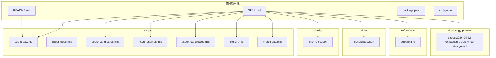
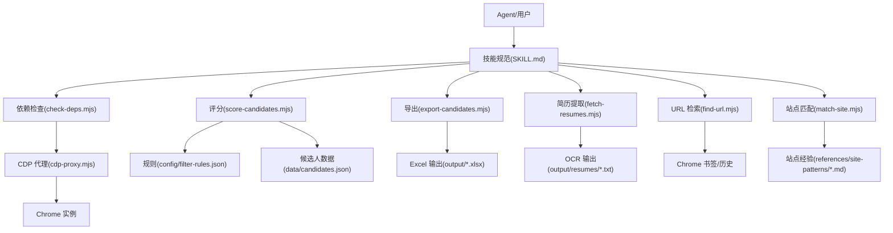
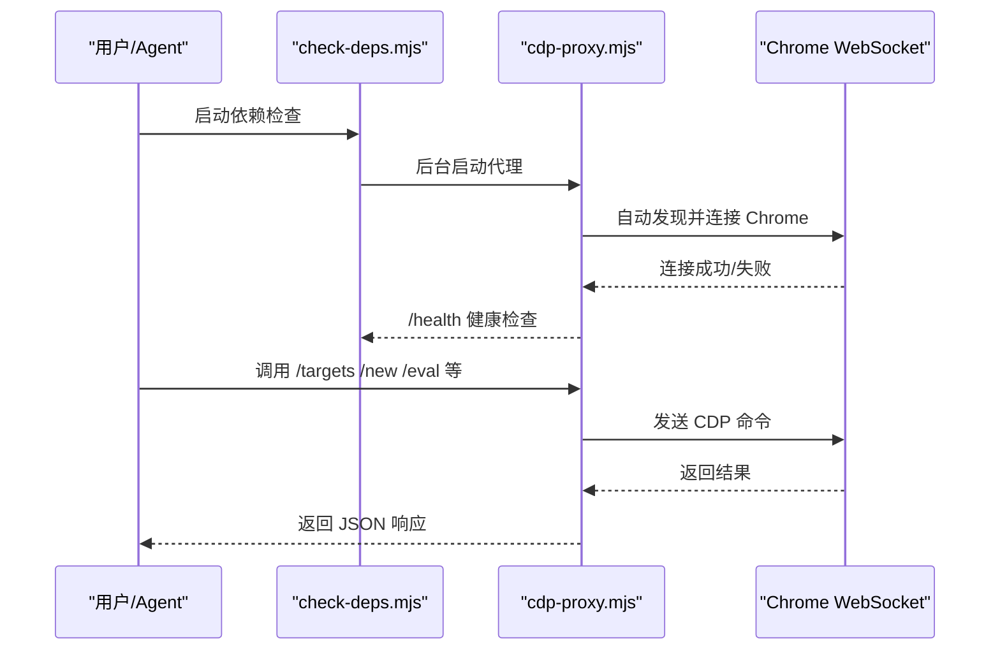
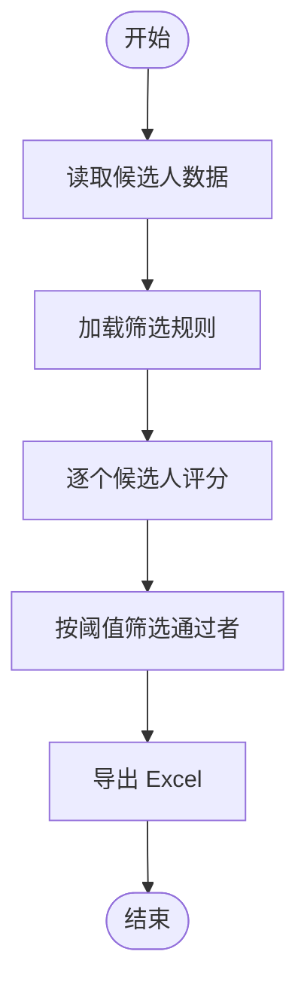
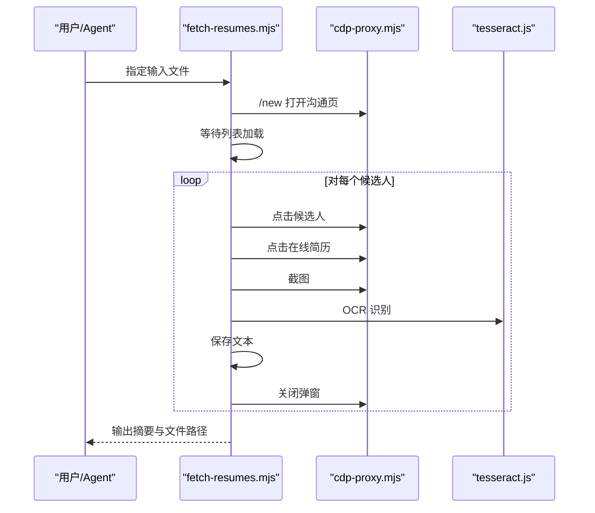
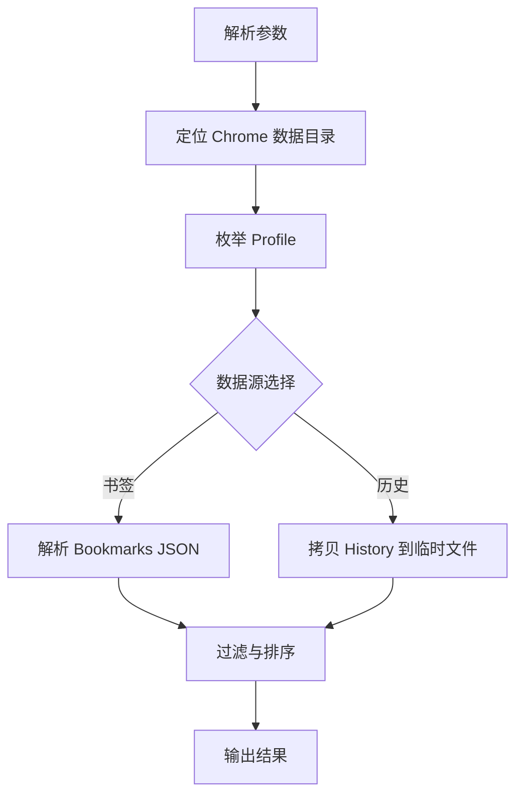
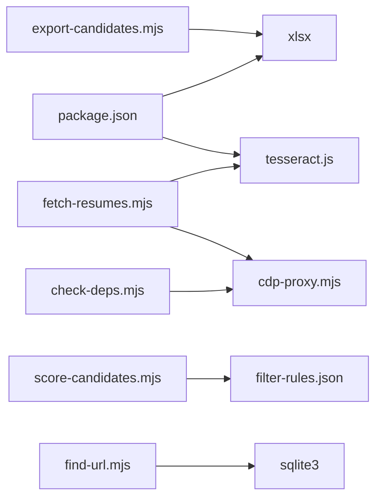

# 开发流程与规范

<cite>
**本文引用的文件**
- [README.md](file://README.md)
- [SKILL.md](file://SKILL.md)
- [package.json](file://package.json)
- [.gitignore](file://.gitignore)
- [config/filter-rules.json](file://config/filter-rules.json)
- [data/candidates.json](file://data/candidates.json)
- [scripts/cdp-proxy.mjs](file://scripts/cdp-proxy.mjs)
- [scripts/check-deps.mjs](file://scripts/check-deps.mjs)
- [scripts/export-candidates.mjs](file://scripts/export-candidates.mjs)
- [scripts/fetch-resumes.mjs](file://scripts/fetch-resumes.mjs)
- [scripts/find-url.mjs](file://scripts/find-url.mjs)
- [scripts/match-site.mjs](file://scripts/match-site.mjs)
- [scripts/score-candidates.mjs](file://scripts/score-candidates.mjs)
- [references/cdp-api.md](file://references/cdp-api.md)
- [docs/superpowers/specs/2026-04-22-extraction-persistence-design.md](file://docs/superpowers/specs/2026-04-22-extraction-persistence-design.md)
</cite>

## 目录
1. [简介](#简介)
2. [项目结构](#项目结构)
3. [核心组件](#核心组件)
4. [架构概览](#架构概览)
5. [详细组件分析](#详细组件分析)
6. [依赖分析](#依赖分析)
7. [性能考虑](#性能考虑)
8. [故障排查指南](#故障排查指南)
9. [结论](#结论)
10. [附录](#附录)

## 简介
本指南面向 Web Access 项目的开发团队，提供从需求分析到代码发布的完整流程规范，涵盖代码提交规范、分支管理策略、版本控制最佳实践、代码审查流程、质量检查标准、发布流程、开发环境配置、IDE 设置、开发工具推荐、代码风格与注释规范、文档编写标准、持续集成与自动化测试、部署流程，以及常见开发场景处理与团队协作规范。

## 项目结构
该项目采用“脚本驱动 + 配置 + 文档”的组织方式，核心能力围绕 CDP Proxy 代理、候选人筛选评分、在线简历提取、站点经验管理与持久化输出展开。关键目录与文件如下：
- scripts：核心业务脚本（CDP 代理、依赖检查、候选人评分、简历提取、URL 检索、站点匹配等）
- config：规则配置（筛选规则）
- data：示例数据（候选人数据）
- references：CDP API 参考与站点经验
- docs/superpowers：设计文档与规划
- README.md、SKILL.md：项目说明与技能规范
- package.json、.gitignore：依赖与忽略规则

**图表来源**
- [README.md](file://README.md)
- [SKILL.md](file://SKILL.md)
- [scripts/cdp-proxy.mjs](file://scripts/cdp-proxy.mjs)
- [scripts/score-candidates.mjs](file://scripts/score-candidates.mjs)
- [scripts/export-candidates.mjs](file://scripts/export-candidates.mjs)
- [scripts/fetch-resumes.mjs](file://scripts/fetch-resumes.mjs)
- [scripts/find-url.mjs](file://scripts/find-url.mjs)
- [scripts/match-site.mjs](file://scripts/match-site.mjs)
- [config/filter-rules.json](file://config/filter-rules.json)
- [data/candidates.json](file://data/candidates.json)
- [references/cdp-api.md](file://references/cdp-api.md)
- [docs/superpowers/specs/2026-04-22-extraction-persistence-design.md](file://docs/superpowers/specs/2026-04-22-extraction-persistence-design.md)

**章节来源**
- [README.md](file://README.md)
- [SKILL.md](file://SKILL.md)

## 核心组件
- CDP Proxy 代理：提供 HTTP API 控制 Chrome，支持新建/关闭 Tab、导航、后退、执行 JS、点击、文件上传、滚动、截图等。
- 依赖检查脚本：检查 Node.js 版本、Chrome 调试端口，自动启动并等待 CDP Proxy 就绪。
- 候选人评分与导出：基于规则配置对候选人进行评分、筛选、导出 Excel。
- 在线简历提取：通过 CDP 打开候选人在线简历弹窗，截图并 OCR 提取文本。
- URL 检索：从本地 Chrome 书签/历史检索目标 URL。
- 站点经验匹配：根据用户输入匹配站点经验文件。
- 规则配置：JSON 格式的筛选规则，支持 mustHave、preferred、exclude、阈值等。
- 文档与参考：CDP API 参考、技能规范、设计文档。

**章节来源**
- [scripts/cdp-proxy.mjs](file://scripts/cdp-proxy.mjs)
- [scripts/check-deps.mjs](file://scripts/check-deps.mjs)
- [scripts/score-candidates.mjs](file://scripts/score-candidates.mjs)
- [scripts/export-candidates.mjs](file://scripts/export-candidates.mjs)
- [scripts/fetch-resumes.mjs](file://scripts/fetch-resumes.mjs)
- [scripts/find-url.mjs](file://scripts/find-url.mjs)
- [scripts/match-site.mjs](file://scripts/match-site.mjs)
- [config/filter-rules.json](file://config/filter-rules.json)
- [references/cdp-api.md](file://references/cdp-api.md)
- [SKILL.md](file://SKILL.md)

## 架构概览
整体架构由“前置检查与代理”“业务脚本”“配置与数据”“文档与参考”四部分组成。Agent 通过技能规范调用脚本，脚本通过 CDP 代理与真实 Chrome 交互，最终产出结构化数据与持久化结果。

**图表来源**
- [SKILL.md](file://SKILL.md)
- [scripts/check-deps.mjs](file://scripts/check-deps.mjs)
- [scripts/cdp-proxy.mjs](file://scripts/cdp-proxy.mjs)
- [scripts/score-candidates.mjs](file://scripts/score-candidates.mjs)
- [scripts/export-candidates.mjs](file://scripts/export-candidates.mjs)
- [scripts/fetch-resumes.mjs](file://scripts/fetch-resumes.mjs)
- [scripts/find-url.mjs](file://scripts/find-url.mjs)
- [scripts/match-site.mjs](file://scripts/match-site.mjs)
- [config/filter-rules.json](file://config/filter-rules.json)
- [data/candidates.json](file://data/candidates.json)

## 详细组件分析

### CDP 代理组件
- 功能职责：提供 HTTP API 控制 Chrome，自动发现调试端口、建立 WebSocket 连接、管理会话、执行页面操作、等待页面加载、端口探测拦截、错误处理与进程守护。
- 关键流程：启动时检查端口可用性，自动发现 Chrome 端口，连接后启用 Fetch 域拦截调试端口探测，提供 /targets、/new、/close、/navigate、/back、/info、/eval、/click、/clickAt、/setFiles、/scroll、/screenshot 等端点。
- 错误处理：未捕获异常与未处理拒绝记录日志，初始连接失败提示复用现有实例或等待授权。

**图表来源**
- [scripts/check-deps.mjs](file://scripts/check-deps.mjs)
- [scripts/cdp-proxy.mjs](file://scripts/cdp-proxy.mjs)

**章节来源**
- [scripts/cdp-proxy.mjs](file://scripts/cdp-proxy.mjs)
- [references/cdp-api.md](file://references/cdp-api.md)

### 候选人评分与导出组件
- 评分逻辑：支持 mustHave/exclude/ preferred 三类规则，按权重归一化到 0-100 分，支持学历排序、工作年限数值比较、正则匹配、数组字段遍历等。
- 导出逻辑：将评分后的候选人导出为 Excel，自动计算列宽，支持自定义字段集。
- 数据来源：输入 candidates.json 或 scored-candidates.json，输出 candidates.xlsx。

**图表来源**
- [scripts/score-candidates.mjs](file://scripts/score-candidates.mjs)
- [scripts/export-candidates.mjs](file://scripts/export-candidates.mjs)
- [config/filter-rules.json](file://config/filter-rules.json)
- [data/candidates.json](file://data/candidates.json)

**章节来源**
- [scripts/score-candidates.mjs](file://scripts/score-candidates.mjs)
- [scripts/export-candidates.mjs](file://scripts/export-candidates.mjs)
- [config/filter-rules.json](file://config/filter-rules.json)
- [data/candidates.json](file://data/candidates.json)

### 在线简历提取组件
- 流程：打开沟通页 → 等待列表加载 → 逐个点击候选人 → 打开在线简历弹窗 → 截图 → OCR → 保存文本 → 关闭弹窗 → 输出摘要。
- 技术要点：CDP 操作、Canvas 截图、OCR 识别、滚动控制、错误恢复与重试。

**图表来源**
- [scripts/fetch-resumes.mjs](file://scripts/fetch-resumes.mjs)
- [scripts/cdp-proxy.mjs](file://scripts/cdp-proxy.mjs)

**章节来源**
- [scripts/fetch-resumes.mjs](file://scripts/fetch-resumes.mjs)

### URL 检索组件
- 功能：从本地 Chrome 书签/历史检索 URL，支持关键词 AND、时间窗、排序（最近/访问频次）、多 Profile。
- 跨平台：自动定位 Chrome 用户数据目录，枚举 Profile，读取 Bookmarks 与 History。

**图表来源**
- [scripts/find-url.mjs](file://scripts/find-url.mjs)

**章节来源**
- [scripts/find-url.mjs](file://scripts/find-url.mjs)

### 站点经验匹配组件
- 功能：根据用户输入匹配站点经验文件，输出匹配到的经验正文。
- 规则：读取 frontmatter 中的 domain 与 aliases，构建正则匹配模式。

**章节来源**
- [scripts/match-site.mjs](file://scripts/match-site.mjs)

## 依赖分析
- 运行时依赖：Node.js 22+（原生 WebSocket），Chrome 开启远程调试。
- 第三方库：tesseract.js（OCR）、xlsx（Excel 导出）。
- 脚本间耦合：依赖检查脚本负责启动/等待 CDP 代理；评分与导出脚本依赖规则配置；简历提取脚本依赖 CDP 代理与 OCR；URL 检索脚本依赖 Chrome 用户数据与 SQLite3。

**图表来源**
- [package.json](file://package.json)
- [scripts/check-deps.mjs](file://scripts/check-deps.mjs)
- [scripts/cdp-proxy.mjs](file://scripts/cdp-proxy.mjs)
- [scripts/score-candidates.mjs](file://scripts/score-candidates.mjs)
- [scripts/export-candidates.mjs](file://scripts/export-candidates.mjs)
- [scripts/fetch-resumes.mjs](file://scripts/fetch-resumes.mjs)
- [scripts/find-url.mjs](file://scripts/find-url.mjs)

**章节来源**
- [package.json](file://package.json)
- [scripts/check-deps.mjs](file://scripts/check-deps.mjs)
- [scripts/score-candidates.mjs](file://scripts/score-candidates.mjs)
- [scripts/export-candidates.mjs](file://scripts/export-candidates.mjs)
- [scripts/fetch-resumes.mjs](file://scripts/fetch-resumes.mjs)
- [scripts/find-url.mjs](file://scripts/find-url.mjs)

## 性能考虑
- CDP 命令超时与重试：代理对 CDP 命令设置超时，页面长时间无响应时进行重试或提示检查 Tab 状态。
- 懒加载触发：滚动到底部触发懒加载，提高图片/视频资源加载成功率。
- OCR 复用：简历提取脚本复用 OCR Worker，减少初始化开销。
- 端口探测优化：TCP 探测避免 WebSocket 连接触发 Chrome 安全弹窗。
- 输出持久化：固定目录覆盖保存，避免历史累积带来的 IO 压力。

**章节来源**
- [scripts/cdp-proxy.mjs](file://scripts/cdp-proxy.mjs)
- [scripts/fetch-resumes.mjs](file://scripts/fetch-resumes.mjs)
- [scripts/check-deps.mjs](file://scripts/check-deps.mjs)

## 故障排查指南
- Chrome 未开启远程调试端口：检查 chrome://inspect/#remote-debugging 并勾选 Allow remote debugging。
- 端口被占用：已有代理实例运行时会复用，否则提示端口占用。
- CDP 命令超时：检查页面状态或重试；使用 /targets 获取最新目标列表。
- 代理未连接：依赖检查脚本会尝试启动并等待，若失败查看临时日志文件。
- OCR 未安装：导出脚本会提示安装 xlsx；简历提取脚本会提示安装 tesseract.js。

**章节来源**
- [references/cdp-api.md](file://references/cdp-api.md)
- [scripts/check-deps.mjs](file://scripts/check-deps.mjs)
- [scripts/export-candidates.mjs](file://scripts/export-candidates.mjs)
- [scripts/fetch-resumes.mjs](file://scripts/fetch-resumes.mjs)

## 结论
本指南提供了 Web Access 项目的完整开发流程与规范，涵盖从需求到发布的全流程、代码与文档规范、质量与发布标准、CI/CD 与部署建议，以及常见问题的处理方法。团队可据此统一开发节奏、提升协作效率与交付质量。

## 附录

### 开发流程与规范总览
- 需求分析：以 SKILL.md 为依据，明确 Agent 职责与能力边界，拆解任务步骤。
- 设计评审：结合 docs/superpowers 中的设计文档，评估可扩展性与风险。
- 开发实现：遵循脚本模块化、配置驱动、文档先行的原则。
- 代码提交：使用分支管理策略，提交信息清晰描述变更与影响。
- 代码审查：至少一名同行评审，关注健壮性、可维护性与性能。
- 质量检查：运行依赖检查、单元/集成测试（如可用），确保 CDP 代理与核心脚本稳定。
- 发布流程：版本号语义化，更新 CHANGELOG，发布前做回归验证。
- 持续集成：自动化运行依赖检查、关键脚本测试、静态分析与打包检查。
- 部署与运维：在受控环境中部署，监控代理健康状态与错误日志。

### 分支管理策略
- 主分支：保护分支，仅允许通过 MR 合并。
- 开发分支：develop，每日同步主分支，合并前需通过 CI。
- 功能分支：feature/*，短期存在，完成后合并至 develop。
- 修复分支：hotfix/*，紧急修复，合并至 develop 与 main。
- 发布分支：release/*，准备版本发布，仅做缺陷修复与文档更新。

### 代码提交规范
- 提交信息格式：类型(作用域): 描述；正文说明动机与影响；脚注关联 Issue。
- 类型：feat、fix、docs、style、refactor、perf、test、build、ci、chore、revert。
- 作用域：scripts、config、docs、references、deps 等。
- 描述：简洁明了，避免句号结尾；动宾结构，避免缩写。
- 正文：说明变更背景、方案权衡、影响范围与风险。
- 脚注：Fixes #编号、Refs #编号。

### 代码审查流程
- 触发：MR 创建后自动通知审查人。
- 要求：至少一名审查人同意，无变更请求方可合并。
- 关注点：功能正确性、边界条件、错误处理、性能影响、可读性与可维护性。
- 工具：利用 CI 报告与自动化检查结果，减少重复劳动。

### 质量检查标准
- 依赖检查：确保 Node.js 版本、Chrome 调试端口、CDP 代理健康。
- 单元测试：针对评分、导出、URL 检索等核心逻辑编写测试。
- 集成测试：端到端验证 CDP 代理与脚本链路。
- 静态分析：ESLint/Prettier 规范，Markdown/Lint 校验。
- 性能基准：关键路径（OCR、截图、评分）性能基线与回归阈值。

### 发布流程
- 版本号：语义化版本，主/次/补丁位，遵循约定。
- 变更日志：记录重大变更、修复与已知限制。
- 标签与发布：创建 Git Tag，发布到包管理器或制品库。
- 回滚预案：保留上一版本镜像与配置快照，快速回滚。

### 开发环境配置与 IDE 设置
- Node.js：使用官方安装包，启用原生 WebSocket。
- Chrome：开启远程调试，允许调试端口探测拦截。
- IDE：推荐 VS Code，安装 Prettier、ESLint 插件，启用格式化与保存时格式化。
- 插件：Markdown Preview Enhanced、GitLens、Bracket Pair Colorizer。
- 终端：使用 PowerShell 或 WSL，支持跨平台脚本调试。

### 代码风格与注释规范
- 命名：函数/变量使用小驼峰，常量使用大写下划线，类名首字母大写。
- 注释：复杂逻辑添加注释，说明输入输出、边界条件与异常处理。
- 文档：公共 API 与脚本入口添加使用说明与示例。
- 错误处理：明确错误类型与恢复策略，避免静默失败。

### 持续集成与自动化测试
- 触发：push 与 MR 事件触发流水线。
- 步骤：依赖安装、依赖检查、脚本测试、静态分析、打包与制品上传。
- 缓存：npm/yarn 缓存与 Node 版本缓存。
- 报告：测试覆盖率、lint 报告、安全扫描结果。

### 常见开发场景处理
- CDP 连接失败：检查 Chrome 调试设置与代理端口占用，必要时重启代理。
- OCR 识别不准：调整图像质量、扩大截图范围、增加重试次数。
- 规则配置错误：核对 mustHave/exclude/ preferred 与阈值，逐步缩小问题范围。
- 站点经验不生效：确认匹配逻辑与 frontmatter，必要时更新经验文件。