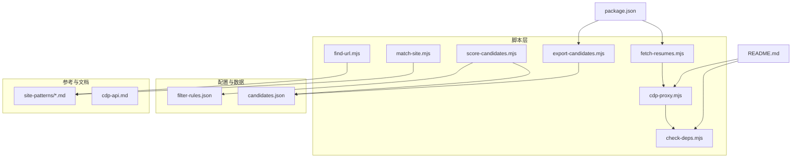
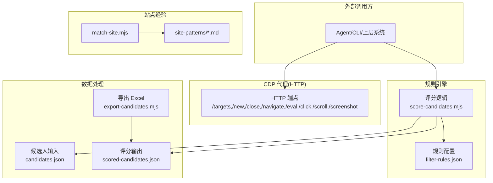
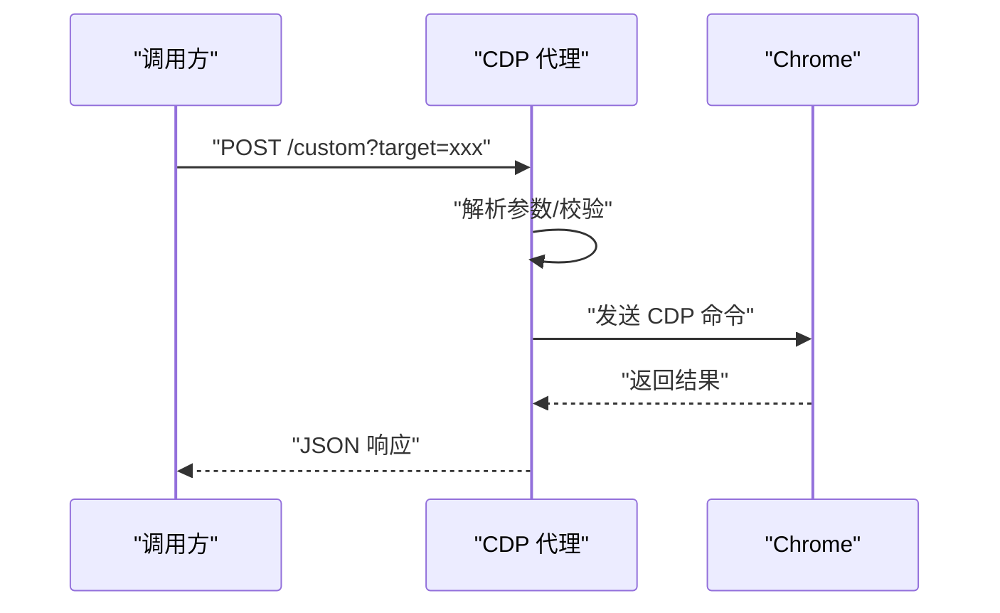
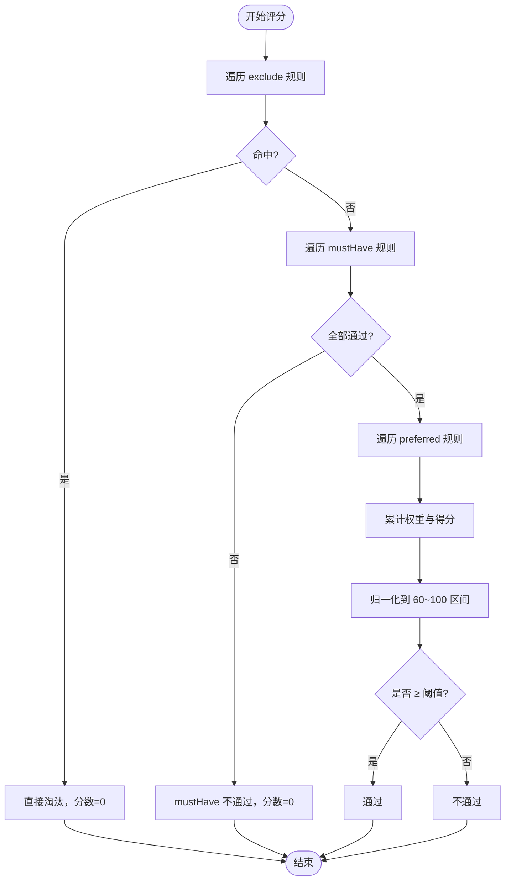
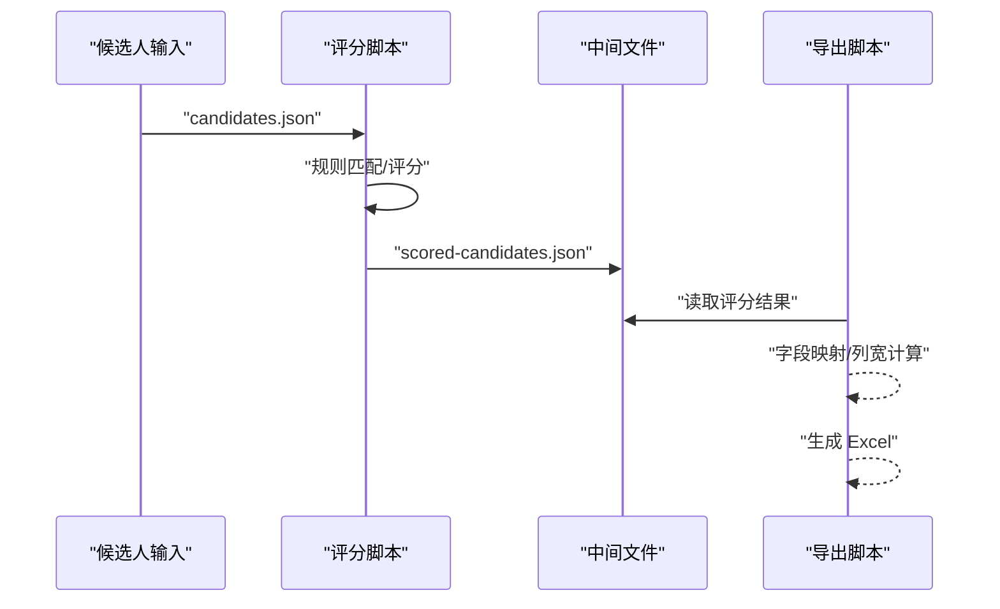
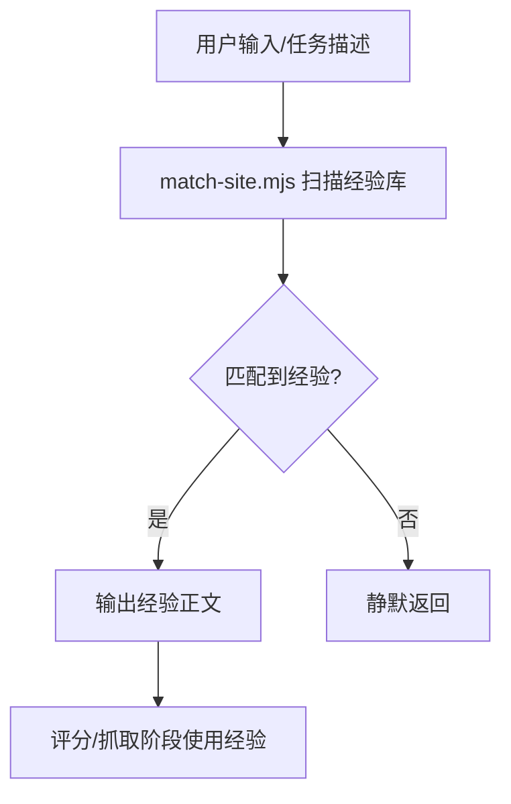
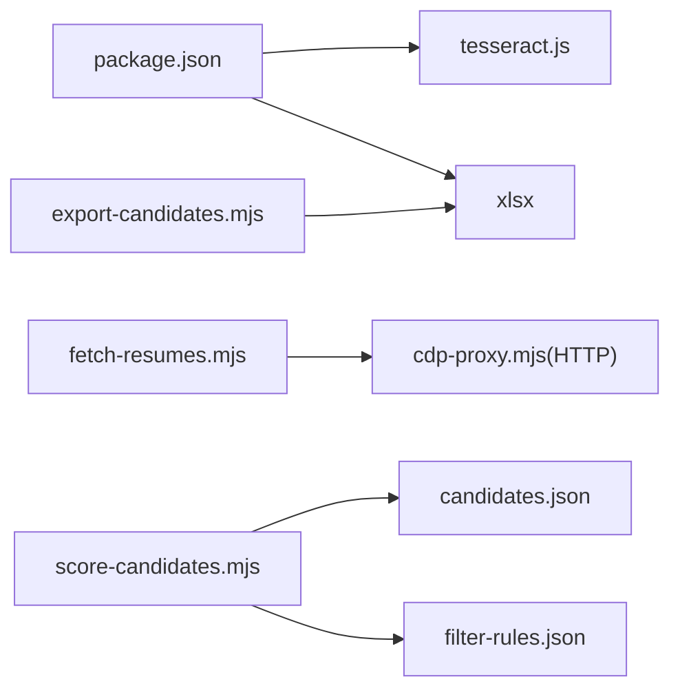

# 扩展开发

<cite>
**本文引用的文件**
- [README.md](file://README.md)
- [package.json](file://package.json)
- [config/filter-rules.json](file://config/filter-rules.json)
- [data/candidates.json](file://data/candidates.json)
- [scripts/cdp-proxy.mjs](file://scripts/cdp-proxy.mjs)
- [scripts/check-deps.mjs](file://scripts/check-deps.mjs)
- [scripts/export-candidates.mjs](file://scripts/export-candidates.mjs)
- [scripts/fetch-resumes.mjs](file://scripts/fetch-resumes.mjs)
- [scripts/find-url.mjs](file://scripts/find-url.mjs)
- [scripts/match-site.mjs](file://scripts/match-site.mjs)
- [scripts/score-candidates.mjs](file://scripts/score-candidates.mjs)
- [references/site-patterns/](file://references/site-patterns/)
- [references/cdp-api.md](file://references/cdp-api.md)
</cite>

## 目录
1. [简介](#简介)
2. [项目结构](#项目结构)
3. [核心组件](#核心组件)
4. [架构总览](#架构总览)
5. [详细组件分析](#详细组件分析)
6. [依赖关系分析](#依赖关系分析)
7. [性能考量](#性能考量)
8. [故障排查指南](#故障排查指南)
9. [结论](#结论)
10. [附录](#附录)

## 简介
本指南面向希望在 Web Access 项目基础上进行扩展开发的工程师，围绕“扩展点识别、插件机制、API 设计原则、配置文件扩展、规则引擎扩展、数据处理扩展”等方面，提供可落地的开发方法与最佳实践。文档同时给出新脚本开发模板、接口适配与集成模式，并覆盖测试、部署与维护要点。

## 项目结构
项目采用“脚本化工具 + 配置 + 数据 + 文档”的分层组织方式：
- scripts：核心功能脚本（CDP 代理、依赖检查、候选人评分、简历抓取、URL 检索、站点经验匹配、导出等）
- config：规则配置示例（过滤规则）
- data：样例数据（候选人集合）
- references：站点经验与 CDP API 参考
- docs：Superpowers 计划与规范文档
- README：总体介绍、安装与使用说明
- package.json：依赖声明（OCR、Excel 导出）

**图表来源**
- [scripts/cdp-proxy.mjs:288-552](file://scripts/cdp-proxy.mjs#L288-L552)
- [scripts/check-deps.mjs:107-139](file://scripts/check-deps.mjs#L107-L139)
- [scripts/score-candidates.mjs:343-383](file://scripts/score-candidates.mjs#L343-L383)
- [scripts/fetch-resumes.mjs:251-380](file://scripts/fetch-resumes.mjs#L251-L380)
- [scripts/export-candidates.mjs:155-195](file://scripts/export-candidates.mjs#L155-L195)
- [scripts/find-url.mjs:176-215](file://scripts/find-url.mjs#L176-L215)
- [scripts/match-site.mjs:14-46](file://scripts/match-site.mjs#L14-L46)
- [config/filter-rules.json:1-41](file://config/filter-rules.json#L1-L41)
- [data/candidates.json:1-49](file://data/candidates.json#L1-L49)
- [references/site-patterns/](file://references/site-patterns/)
- [references/cdp-api.md](file://references/cdp-api.md)
- [README.md:104-137](file://README.md#L104-L137)
- [package.json:6-10](file://package.json#L6-L10)

**章节来源**
- [README.md:104-137](file://README.md#L104-L137)
- [package.json:1-11](file://package.json#L1-L11)

## 核心组件
- CDP 代理服务：提供 HTTP API 控制 Chrome，实现新建/关闭 Tab、导航、点击、滚动、截图、执行 JS 等能力
- 依赖检查与代理守护：自动检测 Chrome 调试端口、启动/等待 CDP 代理、输出站点经验列表
- 候选人评分：基于规则配置对候选人进行评分、筛选与推荐等级计算
- 简历抓取：通过 CDP 打开在线简历弹窗、截图、OCR 识别并保存文本
- 导出工具：将评分后的候选人导出为 Excel
- URL 检索：从本地 Chrome 书签/历史检索目标 URL
- 站点经验匹配：根据用户输入匹配站点经验文档
- 规则配置：以 JSON 描述 mustHave/preferred/exclude 等规则

**章节来源**
- [scripts/cdp-proxy.mjs:288-552](file://scripts/cdp-proxy.mjs#L288-L552)
- [scripts/check-deps.mjs:107-139](file://scripts/check-deps.mjs#L107-L139)
- [scripts/score-candidates.mjs:229-340](file://scripts/score-candidates.mjs#L229-L340)
- [scripts/fetch-resumes.mjs:251-380](file://scripts/fetch-resumes.mjs#L251-L380)
- [scripts/export-candidates.mjs:155-195](file://scripts/export-candidates.mjs#L155-L195)
- [scripts/find-url.mjs:176-215](file://scripts/find-url.mjs#L176-L215)
- [scripts/match-site.mjs:14-46](file://scripts/match-site.mjs#L14-L46)
- [config/filter-rules.json:1-41](file://config/filter-rules.json#L1-L41)

## 架构总览
整体架构由“脚本层 + 配置层 + 数据层 + 参考层”构成，核心扩展点包括：
- HTTP API 扩展：在 CDP 代理中新增端点，或通过外部路由聚合
- 规则引擎扩展：新增/修改规则配置文件，或引入新的规则类型
- 数据处理扩展：新增数据源（如不同格式的候选人输入）、输出格式（如 PDF/CSV）
- 站点经验扩展：新增站点经验文档，配合匹配脚本生效
- 插件机制：通过环境变量与 CLI 参数控制行为，便于在上层集成

**图表来源**
- [scripts/cdp-proxy.mjs:288-552](file://scripts/cdp-proxy.mjs#L288-L552)
- [scripts/score-candidates.mjs:343-383](file://scripts/score-candidates.mjs#L343-L383)
- [scripts/export-candidates.mjs:155-195](file://scripts/export-candidates.mjs#L155-L195)
- [scripts/match-site.mjs:14-46](file://scripts/match-site.mjs#L14-L46)
- [config/filter-rules.json:1-41](file://config/filter-rules.json#L1-L41)
- [data/candidates.json:1-49](file://data/candidates.json#L1-L49)

## 详细组件分析

### CDP 代理扩展（HTTP API）
- 扩展点
  - 新增端点：在 HTTP 服务器中添加新的路由分支，实现自定义页面操作
  - 参数校验：统一解析查询参数与请求体，返回标准化响应
  - 错误处理：捕获并返回结构化错误，避免进程崩溃
- 集成模式
  - 作为独立服务运行，供其他脚本通过 HTTP 调用
  - 通过环境变量控制端口与行为
- 最佳实践
  - 对外暴露最小 API 面，内部封装复杂逻辑
  - 对敏感操作（如文件上传）进行权限与路径校验
  - 对长耗时操作设置超时与重试

**图表来源**
- [scripts/cdp-proxy.mjs:288-552](file://scripts/cdp-proxy.mjs#L288-L552)

**章节来源**
- [scripts/cdp-proxy.mjs:288-552](file://scripts/cdp-proxy.mjs#L288-L552)

### 规则引擎扩展（评分与筛选）
- 扩展点
  - 规则类型：mustHave（必须满足）、preferred（优先加分）、exclude（直接淘汰）
  - 比较运算符：equals、contains、in、>=、>、<=、<、regex、exists
  - 字段解析：支持普通字段与数组字段（如 workExperience[].position）
  - 归一化与阈值：基础分 + 加分权重归一化，支持自定义阈值
- 配置文件扩展
  - 在 config/filter-rules.json 中新增规则条目，支持权重与正则标志
- 最佳实践
  - 规则命名清晰、理由明确，便于审计
  - 优先使用 exists/regex 等语义化规则，避免硬编码
  - 对数组字段使用通配路径，提升覆盖率

**图表来源**
- [scripts/score-candidates.mjs:229-340](file://scripts/score-candidates.mjs#L229-L340)
- [config/filter-rules.json:1-41](file://config/filter-rules.json#L1-L41)

**章节来源**
- [scripts/score-candidates.mjs:229-340](file://scripts/score-candidates.mjs#L229-L340)
- [config/filter-rules.json:1-41](file://config/filter-rules.json#L1-L41)

### 数据处理扩展（候选人与导出）
- 输入扩展
  - 新增数据源：在 score-candidates.mjs 中支持新的 JSON 结构或字段映射
  - 字段解析：通过 resolveField/getFieldValues 支持嵌套与数组字段
- 输出扩展
  - 导出工具：在 export-candidates.mjs 中新增字段映射与列宽策略
  - 新格式：可引入 CSV/PDF 等导出库，保持与现有字段配置解耦
- 最佳实践
  - 保持输入/输出的契约稳定，通过配置驱动字段映射
  - 对中文宽度与特殊字符进行兼容处理
  - 对大文件导出进行分批与进度反馈

**图表来源**
- [scripts/score-candidates.mjs:343-383](file://scripts/score-candidates.mjs#L343-L383)
- [scripts/export-candidates.mjs:155-195](file://scripts/export-candidates.mjs#L155-L195)
- [data/candidates.json:1-49](file://data/candidates.json#L1-L49)

**章节来源**
- [scripts/score-candidates.mjs:343-383](file://scripts/score-candidates.mjs#L343-L383)
- [scripts/export-candidates.mjs:155-195](file://scripts/export-candidates.mjs#L155-L195)
- [data/candidates.json:1-49](file://data/candidates.json#L1-L49)

### 站点经验扩展（经验库与匹配）
- 扩展点
  - 新增站点经验文档：在 references/site-patterns/ 下新增 .md 文件
  - 匹配逻辑：match-site.mjs 会扫描并匹配域名与别名
- 集成模式
  - 在评分/抓取前调用匹配脚本，输出经验内容供上层决策
- 最佳实践
  - 文档中明确 aliases 与关键交互点，便于规则引擎引用
  - 将经验与规则结合，形成“经验 + 规则”的双驱动

**图表来源**
- [scripts/match-site.mjs:14-46](file://scripts/match-site.mjs#L14-L46)
- [references/site-patterns/](file://references/site-patterns/)

**章节来源**
- [scripts/match-site.mjs:14-46](file://scripts/match-site.mjs#L14-L46)
- [references/site-patterns/](file://references/site-patterns/)

### URL 检索扩展（本地 Chrome 数据）
- 扩展点
  - 数据源：支持书签与历史，可按关键词、时间窗、排序策略检索
  - 输出格式：统一字段分隔与多 Profile 标注
- 集成模式
  - 作为前置工具，辅助定位内部系统或历史访问页面
- 最佳实践
  - 对 SQLite 访问进行临时副本与清理
  - 对时间窗与排序策略进行参数化

**章节来源**
- [scripts/find-url.mjs:176-215](file://scripts/find-url.mjs#L176-L215)

### 依赖检查与代理守护（插件机制）
- 扩展点
  - 通过环境变量控制端口与行为
  - 自动启动/等待 CDP 代理，输出站点经验列表
- 集成模式
  - 在上层系统中作为前置依赖检查与代理守护
- 最佳实践
  - 对端口占用与授权弹窗进行提示与日志记录
  - 对多 Profile 场景进行兼容

**章节来源**
- [scripts/check-deps.mjs:107-139](file://scripts/check-deps.mjs#L107-L139)
- [README.md:104-117](file://README.md#L104-L117)

## 依赖关系分析
- 外部依赖
  - tesseract.js：OCR 识别
  - xlsx：Excel 导出
- 内部依赖
  - cdp-proxy.mjs 依赖 Node 原生 WebSocket 或 ws 模块
  - fetch-resumes.mjs 依赖 cdp-proxy.mjs 的 HTTP API
  - export-candidates.mjs 依赖 xlsx
  - score-candidates.mjs 依赖 candidates.json 与 filter-rules.json

**图表来源**
- [package.json:6-10](file://package.json#L6-L10)
- [scripts/fetch-resumes.mjs:45-81](file://scripts/fetch-resumes.mjs#L45-L81)
- [scripts/export-candidates.mjs:15-23](file://scripts/export-candidates.mjs#L15-L23)
- [scripts/score-candidates.mjs:346-351](file://scripts/score-candidates.mjs#L346-L351)

**章节来源**
- [package.json:1-11](file://package.json#L1-L11)

## 性能考量
- CDP 代理
  - 连接复用与会话管理，避免频繁重建
  - 对页面加载等待采用轮询+超时，减少阻塞
- 规则引擎
  - 字段解析与正则匹配尽量缓存，避免重复计算
  - 数组字段展开与权重归一化采用批量处理
- 数据导出
  - Excel 列宽按内容动态计算，避免过大文件
  - 对大文件分批处理并输出进度
- 简历抓取
  - OCR 复用 worker，减少初始化成本
  - 截图与滚动采用节流与延迟，避免过度渲染

[本节为通用指导，无需特定文件来源]

## 故障排查指南
- CDP 代理
  - 端口占用：检查端口可用性与健康状态
  - Chrome 授权弹窗：等待用户点击“允许”，或在 DevTools 中确认
  - WebSocket 连接失败：检查端口发现与 wsPath
- 依赖检查
  - Node 版本过低：升级至 22+
  - Chrome 未开启远程调试：在 chrome://inspect/#remote-debugging 启用
- 规则引擎
  - 字段路径错误：确认路径与数据结构一致
  - 正则异常：检查 flags 与模式合法性
- 导出工具
  - 未安装 xlsx：执行安装命令
  - 字段映射缺失：在导出配置中补充映射
- 简历抓取
  - 页面加载超时：调整等待时间或检查网络
  - OCR 失败：检查图像质量与语言包

**章节来源**
- [scripts/cdp-proxy.mjs:564-591](file://scripts/cdp-proxy.mjs#L564-L591)
- [scripts/check-deps.mjs:143-171](file://scripts/check-deps.mjs#L143-L171)
- [scripts/export-candidates.mjs:15-23](file://scripts/export-candidates.mjs#L15-L23)
- [scripts/fetch-resumes.mjs:295-302](file://scripts/fetch-resumes.mjs#L295-L302)

## 结论
通过以上扩展点与最佳实践，开发者可以在不破坏既有架构的前提下，灵活地新增功能模块、扩展规则与数据处理链路，并与站点经验库协同工作。建议以“配置驱动 + 脚本化 + 统一日志”的方式推进扩展开发，确保可测试、可部署、可维护。

[本节为总结，无需特定文件来源]

## 附录

### 新脚本开发模板（步骤清单）
- 目标与职责
  - 明确脚本输入/输出与边界
  - 评估是否需要依赖 CDP 代理或其他脚本
- 参数解析
  - 使用统一的 CLI 参数解析函数
  - 对必填参数进行校验
- 依赖管理
  - 在 package.json 中声明必要依赖
  - 对可选依赖进行 try/catch 包裹
- 错误处理
  - 捕获异常并返回结构化错误
  - 记录关键日志与临时文件位置
- 集成与测试
  - 编写最小可验证用例
  - 与现有脚本进行端到端测试
- 部署与维护
  - 通过环境变量与配置文件控制行为
  - 提供健康检查与日志轮转

[本节为通用模板，无需特定文件来源]

### 接口适配与集成模式
- CDP 代理适配
  - 通过 HTTP GET/POST 调用，遵循现有端点约定
  - 对响应进行 JSON 解析与错误映射
- 规则引擎适配
  - 读取 JSON 规则文件，遵循 mustHave/preferred/exclude 结构
  - 输出标准化评分结果，包含分数、是否通过、推荐等级与原因
- 数据处理适配
  - 输入/输出均以 JSON 为主，字段映射通过配置驱动
  - 导出时支持多种格式，保持向后兼容

**章节来源**
- [scripts/cdp-proxy.mjs:288-552](file://scripts/cdp-proxy.mjs#L288-L552)
- [scripts/score-candidates.mjs:343-383](file://scripts/score-candidates.mjs#L343-L383)
- [scripts/export-candidates.mjs:155-195](file://scripts/export-candidates.mjs#L155-L195)

### 扩展测试、部署与维护指南
- 测试
  - 单元测试：针对规则引擎与字段解析函数
  - 集成测试：端到端调用 CDP 代理与评分导出
  - 回归测试：在 candidates.json 与 filter-rules.json 上验证稳定性
- 部署
  - 依赖安装：npm ci 或 npm install
  - 环境准备：Node 22+、Chrome 远程调试、必要系统工具（sqlite3）
  - 进程守护：使用 check-deps.mjs 启动/等待代理
- 维护
  - 版本化规则与经验文档
  - 定期清理临时文件与日志
  - 对第三方依赖进行安全扫描与更新

**章节来源**
- [scripts/check-deps.mjs:107-139](file://scripts/check-deps.mjs#L107-L139)
- [package.json:6-10](file://package.json#L6-L10)