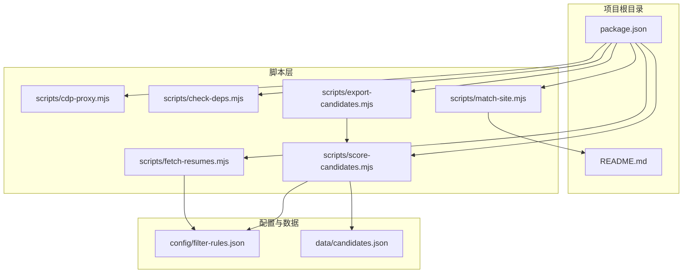
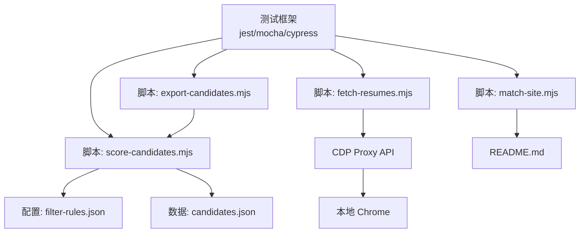
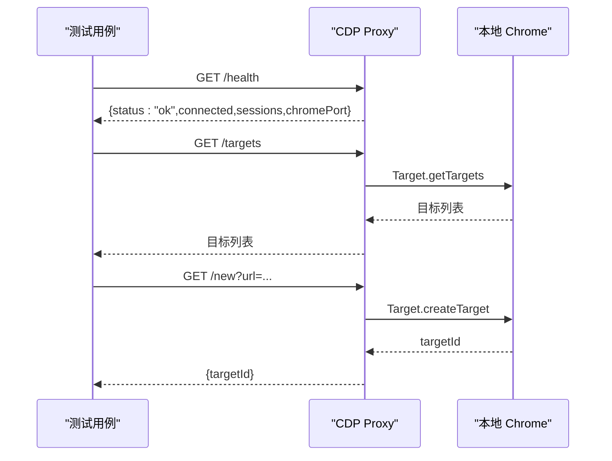
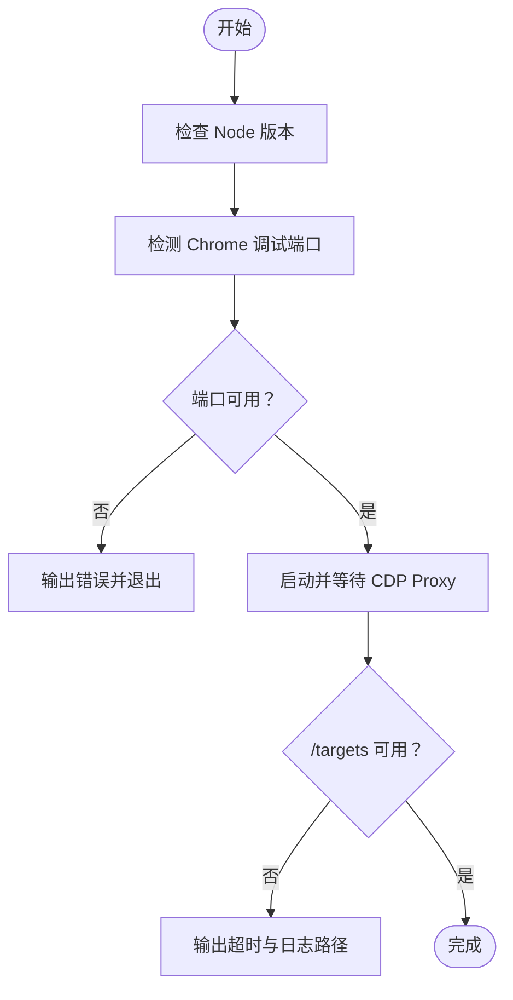
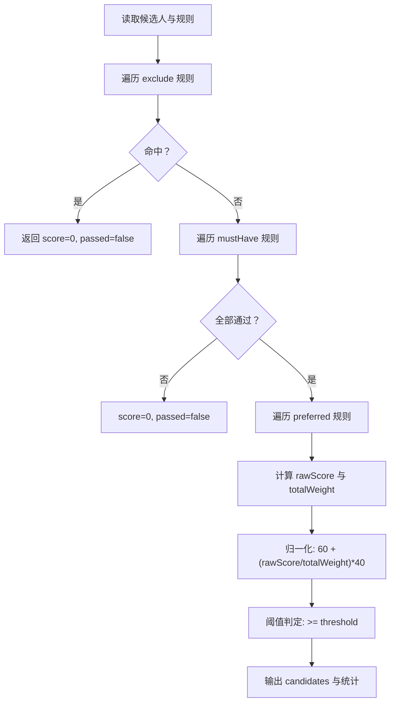
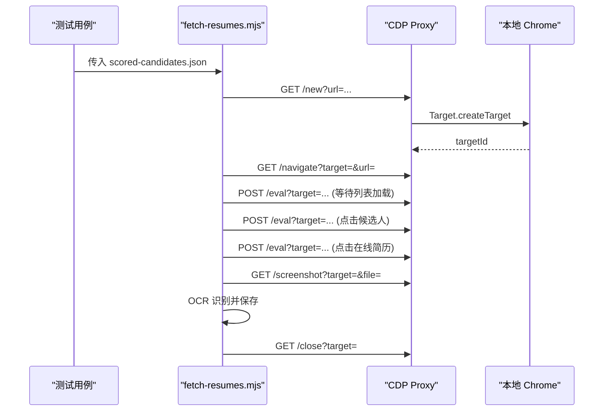
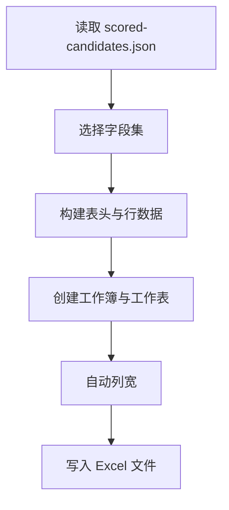
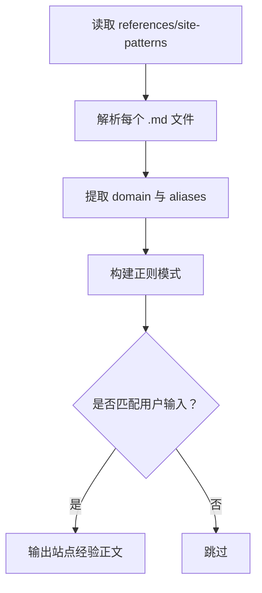
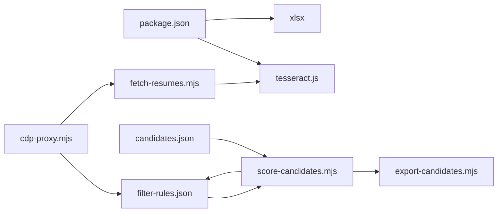

# 测试与调试

<cite>
**本文引用的文件**
- [package.json](file://package.json)
- [README.md](file://README.md)
- [scripts/cdp-proxy.mjs](file://scripts/cdp-proxy.mjs)
- [scripts/check-deps.mjs](file://scripts/check-deps.mjs)
- [scripts/fetch-resumes.mjs](file://scripts/fetch-resumes.mjs)
- [scripts/score-candidates.mjs](file://scripts/score-candidates.mjs)
- [scripts/export-candidates.mjs](file://scripts/export-candidates.mjs)
- [scripts/match-site.mjs](file://scripts/match-site.mjs)
- [config/filter-rules.json](file://config/filter-rules.json)
- [data/candidates.json](file://data/candidates.json)
</cite>

## 目录
1. [简介](#简介)
2. [项目结构](#项目结构)
3. [核心组件](#核心组件)
4. [架构总览](#架构总览)
5. [详细组件分析](#详细组件分析)
6. [依赖关系分析](#依赖关系分析)
7. [性能考量](#性能考量)
8. [故障排查指南](#故障排查指南)
9. [结论](#结论)
10. [附录](#附录)

## 简介
本指南面向 Web Access 项目，提供一套系统化的测试与调试方法论，覆盖单元测试、集成测试、端到端测试、性能与压力测试、边界条件测试、调试工具与日志、错误追踪、测试自动化与持续测试、回归测试以及测试覆盖率与质量标准。文档以仓库现有脚本与配置为基础，结合可扩展的测试策略，帮助团队在保证质量的同时提升交付效率。

## 项目结构
该项目采用“脚本驱动 + 配置驱动”的结构，核心逻辑集中在 scripts 目录下的多个独立可执行脚本，配合 config 与 data 目录的配置与示例数据。整体结构如下：

图表来源
- [package.json](file://package.json)
- [README.md](file://README.md)
- [scripts/cdp-proxy.mjs](file://scripts/cdp-proxy.mjs)
- [scripts/check-deps.mjs](file://scripts/check-deps.mjs)
- [scripts/fetch-resumes.mjs](file://scripts/fetch-resumes.mjs)
- [scripts/score-candidates.mjs](file://scripts/score-candidates.mjs)
- [scripts/export-candidates.mjs](file://scripts/export-candidates.mjs)
- [scripts/match-site.mjs](file://scripts/match-site.mjs)
- [config/filter-rules.json](file://config/filter-rules.json)
- [data/candidates.json](file://data/candidates.json)

章节来源
- [package.json](file://package.json)
- [README.md](file://README.md)

## 核心组件
- CDP Proxy：提供 HTTP API 控制本地 Chrome，实现页面导航、点击、滚动、截图、执行 JS 等操作，并内置健康检查与会话管理。
- 依赖检查脚本：负责 Node 版本、Chrome 调试端口检测与 CDP Proxy 启动与等待。
- 候选人评分脚本：基于规则集对候选人数据进行评分与筛选，支持多字段解析、数组展开、正则匹配与权重计算。
- 简历提取脚本：通过 CDP 打开在线简历弹窗、截图、OCR 识别并保存文本。
- Excel 导出脚本：将评分后的候选人数据导出为 Excel。
- 站点经验匹配脚本：根据用户输入匹配站点经验文件并输出正文内容。

章节来源
- [scripts/cdp-proxy.mjs](file://scripts/cdp-proxy.mjs)
- [scripts/check-deps.mjs](file://scripts/check-deps.mjs)
- [scripts/score-candidates.mjs](file://scripts/score-candidates.mjs)
- [scripts/fetch-resumes.mjs](file://scripts/fetch-resumes.mjs)
- [scripts/export-candidates.mjs](file://scripts/export-candidates.mjs)
- [scripts/match-site.mjs](file://scripts/match-site.mjs)
- [config/filter-rules.json](file://config/filter-rules.json)
- [data/candidates.json](file://data/candidates.json)

## 架构总览
下图展示测试与调试视角下的系统交互：测试框架调用各脚本，脚本通过 HTTP API 与 CDP Proxy 通信，CDP Proxy 连接本地 Chrome 实现页面操作；评分与导出脚本依赖配置与数据文件。

图表来源
- [scripts/score-candidates.mjs](file://scripts/score-candidates.mjs)
- [scripts/fetch-resumes.mjs](file://scripts/fetch-resumes.mjs)
- [scripts/export-candidates.mjs](file://scripts/export-candidates.mjs)
- [scripts/match-site.mjs](file://scripts/match-site.mjs)
- [config/filter-rules.json](file://config/filter-rules.json)
- [data/candidates.json](file://data/candidates.json)
- [README.md](file://README.md)

## 详细组件分析

### CDP Proxy 组件
- 功能要点
  - 自动发现 Chrome 调试端口，支持 DevToolsActivePort 与常见端口回退。
  - 健康检查、目标列表查询、新建/关闭标签页、导航、后退、执行 JS、点击、真实鼠标点击、文件上传、滚动、截图、页面信息获取。
  - 会话管理与端口探测拦截，超时控制与异常处理。
- 测试关注点
  - 端口发现与连接稳定性。
  - API 健壮性（404/500、超时、异常消息）。
  - 会话生命周期与并发请求处理。
  - 与本地 Chrome 的交互可靠性（授权弹窗、页面加载状态）。

图表来源
- [scripts/cdp-proxy.mjs](file://scripts/cdp-proxy.mjs)

章节来源
- [scripts/cdp-proxy.mjs](file://scripts/cdp-proxy.mjs)

### 依赖检查组件
- 功能要点
  - Node 版本检查（建议 22+）。
  - Chrome 调试端口检测（DevToolsActivePort 与常见端口）。
  - CDP Proxy 启动与等待，健康检查与日志指引。
- 测试关注点
  - 不同平台与端口发现路径。
  - 代理启动与 /targets 响应一致性。
  - 授权弹窗提示与等待策略。

图表来源
- [scripts/check-deps.mjs](file://scripts/check-deps.mjs)

章节来源
- [scripts/check-deps.mjs](file://scripts/check-deps.mjs)

### 候选人评分组件
- 功能要点
  - 规则解析：exclude、mustHave、preferred、threshold。
  - 字段解析：普通字段、数组展开（支持 workExperience[].position）。
  - 比较运算：equals、contains、in、>=、>、<=、<、regex、exists。
  - 分数归一化：mustHave 全通过给 60 基础分，preferred 按权重加至 100。
  - 推荐等级：强/良/一般/弱。
- 测试关注点
  - 字段路径解析与数组展开正确性。
  - 正则匹配大小写与标志位。
  - 学历与工作年限的有序比较。
  - 排序与阈值判定。
  - 边界值：空值、数组为空、regex 异常。

图表来源
- [scripts/score-candidates.mjs](file://scripts/score-candidates.mjs)
- [config/filter-rules.json](file://config/filter-rules.json)
- [data/candidates.json](file://data/candidates.json)

章节来源
- [scripts/score-candidates.mjs](file://scripts/score-candidates.mjs)
- [config/filter-rules.json](file://config/filter-rules.json)
- [data/candidates.json](file://data/candidates.json)

### 简历提取组件
- 功能要点
  - 通过 CDP 打开聊天页，等待候选人列表加载。
  - 滚动虚拟列表使目标候选人可见，点击卡片与“在线简历”按钮。
  - 计算弹窗滚动高度分页截图，OCR 识别并拼接文本，保存为文本文件。
  - 结果汇总与失败回退。
- 测试关注点
  - 页面元素选择器稳定性与重试策略。
  - 滚动与懒加载时机。
  - 截图与 OCR 的跨平台兼容性。
  - 超时与异常处理。

图表来源
- [scripts/fetch-resumes.mjs](file://scripts/fetch-resumes.mjs)
- [scripts/cdp-proxy.mjs](file://scripts/cdp-proxy.mjs)

章节来源
- [scripts/fetch-resumes.mjs](file://scripts/fetch-resumes.mjs)
- [scripts/cdp-proxy.mjs](file://scripts/cdp-proxy.mjs)

### Excel 导出组件
- 功能要点
  - 将评分后的候选人数据转换为 Excel，支持自定义字段与自动列宽。
- 测试关注点
  - 字段映射与默认字段集合。
  - 中文字符宽度计算与列宽适配。
  - 输出路径与权限。

图表来源
- [scripts/export-candidates.mjs](file://scripts/export-candidates.mjs)

章节来源
- [scripts/export-candidates.mjs](file://scripts/export-candidates.mjs)

### 站点经验匹配组件
- 功能要点
  - 遍历 references/site-patterns 下的 Markdown 文件，提取别名并匹配用户输入，输出正文。
- 测试关注点
  - 别名解析与正则匹配大小写。
  - Frontmatter 跳过与正文提取。

图表来源
- [scripts/match-site.mjs](file://scripts/match-site.mjs)

章节来源
- [scripts/match-site.mjs](file://scripts/match-site.mjs)

## 依赖关系分析
- 外部依赖
  - tesseract.js：用于 OCR 文字识别。
  - xlsx：用于 Excel 导出。
- 内部耦合
  - fetch-resumes.mjs 依赖 CDP Proxy API 与 tesseract.js。
  - export-candidates.mjs 依赖 xlsx。
  - score-candidates.mjs 依赖 filter-rules.json 与 candidates.json。
  - check-deps.mjs 依赖 CDP Proxy 与 Chrome 调试端口。

图表来源
- [package.json](file://package.json)
- [scripts/score-candidates.mjs](file://scripts/score-candidates.mjs)
- [scripts/export-candidates.mjs](file://scripts/export-candidates.mjs)
- [scripts/fetch-resumes.mjs](file://scripts/fetch-resumes.mjs)
- [scripts/cdp-proxy.mjs](file://scripts/cdp-proxy.mjs)
- [config/filter-rules.json](file://config/filter-rules.json)
- [data/candidates.json](file://data/candidates.json)

章节来源
- [package.json](file://package.json)

## 性能考量
- CDP 操作
  - 页面加载等待与滚动触发懒加载需合理设置超时与延时，避免过度等待。
  - 截图与 OCR 为 CPU 密集型，建议批量处理与并发控制。
- 规则评分
  - 正则匹配与数组展开可能带来复杂度上升，建议对规则进行预编译与缓存。
- 导出性能
  - Excel 列宽计算与写入为 I/O 密集，建议异步写入与缓冲。

## 故障排查指南
- CDP 连接失败
  - 确认 Chrome 已开启远程调试端口，检查端口发现与授权弹窗。
  - 使用 /health 与 /targets 检查连接状态与目标数量。
- 超时与异常
  - CDP 命令超时与未捕获异常均有日志输出，检查代理日志文件路径。
- 页面元素未找到
  - 检查选择器与重试策略，确认页面加载完成后再执行操作。
- OCR 识别失败
  - 检查截图质量与语言包配置，适当调整图像格式与质量。
- Excel 导出失败
  - 确认 xlsx 已安装，检查输出路径权限。

章节来源
- [scripts/cdp-proxy.mjs](file://scripts/cdp-proxy.mjs)
- [scripts/check-deps.mjs](file://scripts/check-deps.mjs)
- [scripts/fetch-resumes.mjs](file://scripts/fetch-resumes.mjs)
- [scripts/export-candidates.mjs](file://scripts/export-candidates.mjs)

## 结论
本指南基于仓库现有脚本与配置，提出了覆盖单元、集成与端到端的测试策略，并配套调试与性能优化建议。建议在 CI 中引入自动化测试流水线，结合覆盖率与质量门禁，确保变更质量与稳定性。

## 附录

### 测试框架与工具选择建议
- 单元测试：使用 Jest 或 Vitest，针对纯函数与规则解析模块进行测试。
- 集成测试：使用 Playwright 或 Puppeteer，模拟浏览器行为并与 CDP Proxy 交互。
- 端到端测试：使用 Cypress 或 Playwright，覆盖完整业务流程（评分 → 导出 → 简历提取）。
- 性能测试：使用 Artillery 或 K6，对关键 API（/targets、/new、/eval、/screenshot）施压。
- 覆盖率：建议达到 80%+ 的语句与分支覆盖率，关键路径 100%。

### 测试用例编写与数据准备
- 单元测试
  - 规则解析：包含空值、数组展开、正则标志、大小写敏感等。
  - 字段解析：普通字段、数组字段、嵌套字段路径。
  - 比较运算：数值、字符串、学历排序、regex 异常。
- 集成测试
  - CDP Proxy：/health、/targets、/new、/navigate、/eval、/click、/screenshot。
  - 评分流程：不同阈值、权重、mustHave 缺失场景。
  - 导出流程：字段映射、列宽计算、输出路径。
- 端到端测试
  - 完整链路：候选人数据 → 评分 → 导出 → 简历提取 → OCR → 结果汇总。
- 性能与压力
  - 并发请求、超时与重试、资源回收（OCR worker 终止）。
- 边界条件
  - 页面元素缺失、网络抖动、授权弹窗、OCR 语言包缺失。

### 调试工具与日志
- 日志
  - CDP Proxy：未捕获异常与拒绝日志，初始连接失败提示。
  - 依赖检查：端口占用、代理健康检查、日志文件路径。
- 调试技巧
  - 使用 /info 与 /screenshot 辅助定位页面状态与元素位置。
  - 对 CDP 命令添加超时与重试，避免阻塞。

### 测试自动化与持续测试
- CI 配置
  - Node 版本矩阵（22+），跨平台（macOS/Linux/Windows）。
  - 依赖安装与 Chrome 调试端口准备。
  - 并行执行单元与集成测试，串行执行端到端测试。
- 回归测试
  - 规则更新与站点经验变更触发回归。
  - 产出覆盖率报告与测试结果归档。

### 质量保证标准
- 代码质量：ESLint/Prettier，提交前检查。
- 测试质量：用例可维护性、可读性、可扩展性。
- 覆盖率：语句、分支、函数、行 80%+，关键路径 100%。
- 发布标准：通过所有测试、覆盖率达标、文档更新。