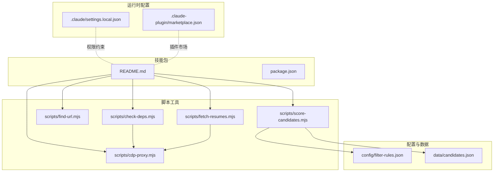
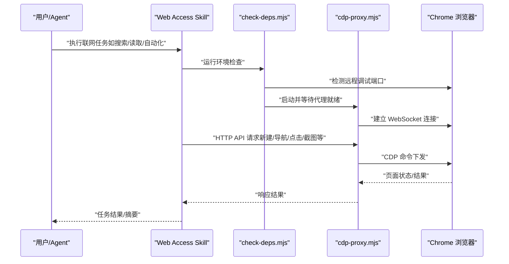
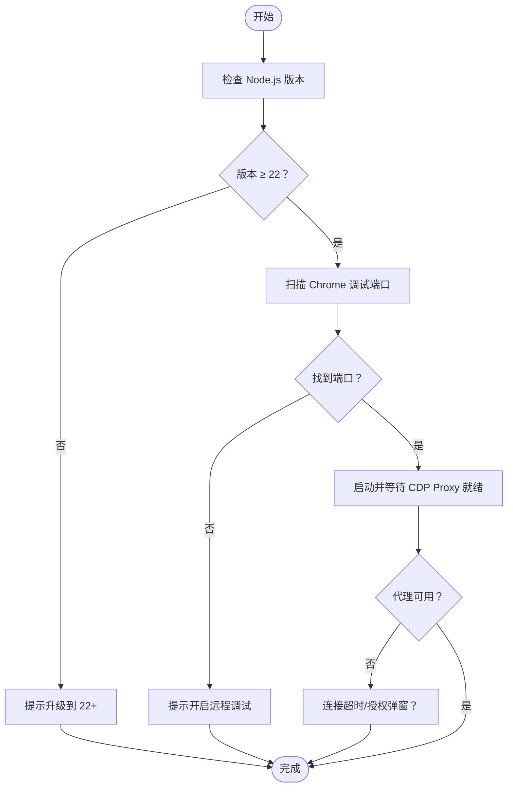
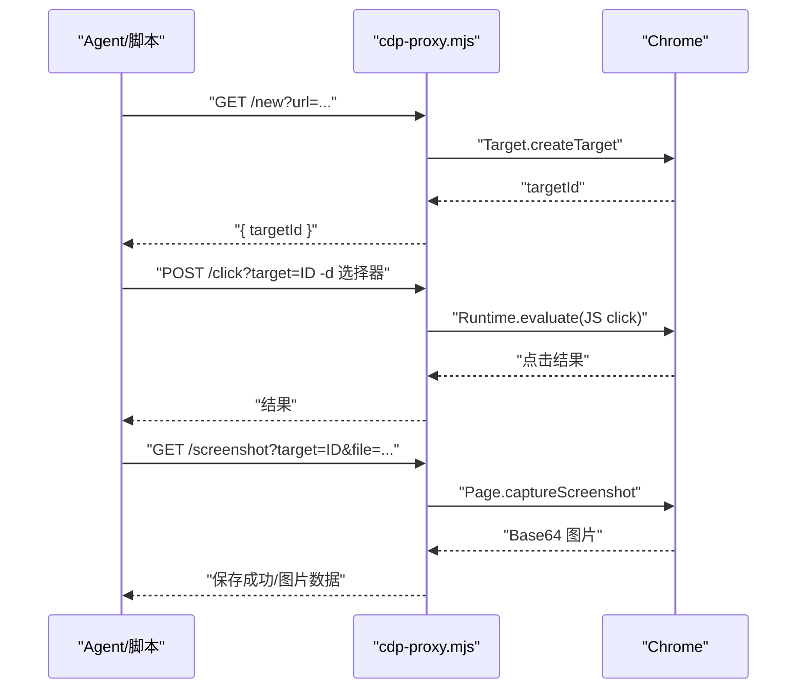
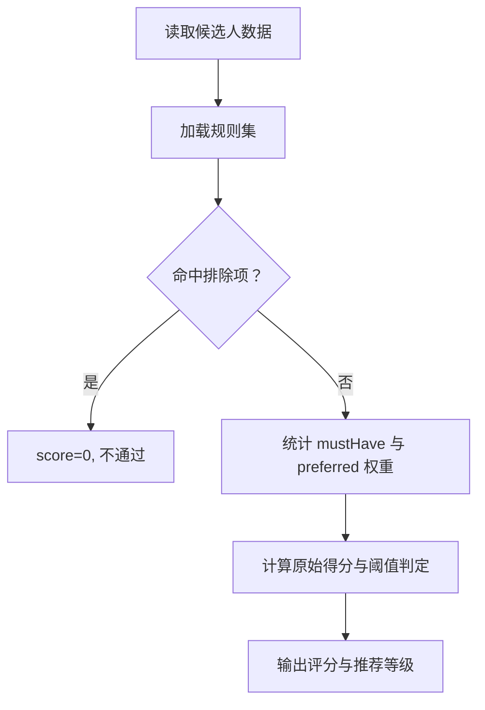
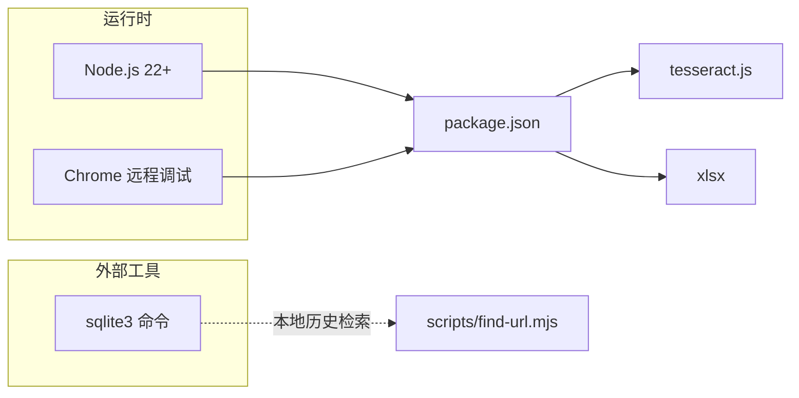

# 快速开始

<cite>
**本文引用的文件**
- [README.md](file://README.md)
- [package.json](file://package.json)
- [scripts/check-deps.mjs](file://scripts/check-deps.mjs)
- [scripts/cdp-proxy.mjs](file://scripts/cdp-proxy.mjs)
- [scripts/find-url.mjs](file://scripts/find-url.mjs)
- [scripts/score-candidates.mjs](file://scripts/score-candidates.mjs)
- [scripts/fetch-resumes.mjs](file://scripts/fetch-resumes.mjs)
- [config/filter-rules.json](file://config/filter-rules.json)
- [data/candidates.json](file://data/candidates.json)
- [.claude/settings.local.json](file://.claude/settings.local.json)
- [.claude-plugin/marketplace.json](file://.claude-plugin/marketplace.json)
</cite>

## 目录
1. [简介](#简介)
2. [项目结构](#项目结构)
3. [核心组件](#核心组件)
4. [架构总览](#架构总览)
5. [详细组件分析](#详细组件分析)
6. [依赖关系分析](#依赖关系分析)
7. [性能注意事项](#性能注意事项)
8. [故障排查指南](#故障排查指南)
9. [结论](#结论)
10. [附录](#附录)

## 简介
本指南面向初学者，帮助你在最短时间内完成 Web Access Skill 的安装与验证，并掌握如何让 AI Agent 执行常见联网任务。内容涵盖：
- 环境要求与前置条件（Node.js 22+、Chrome 远程调试）
- 多种安装方式（npx skills 一键安装、Agent 自动安装、Plugin 安装、手动安装）
- 环境检查命令与常见问题排查
- 基本使用示例（搜索、读取页面、站点自动化等）
- 与简历抽取、候选人评分等工具链的衔接

## 项目结构
仓库采用“技能包 + 脚本工具 + 配置”的组织方式，核心目录与文件如下：
- scripts：CDP 代理、依赖检查、URL 检索、候选人评分、简历抓取等工具脚本
- config：过滤规则配置（用于候选人筛选）
- data：示例候选人数据
- .claude/.claude-plugin：权限与插件市场配置
- README.md：安装、使用与设计说明
- package.json：依赖声明（OCR、表格处理等）

**图表来源**
- [README.md](file://README.md)
- [package.json](file://package.json)
- [scripts/check-deps.mjs](file://scripts/check-deps.mjs)
- [scripts/cdp-proxy.mjs](file://scripts/cdp-proxy.mjs)
- [scripts/find-url.mjs](file://scripts/find-url.mjs)
- [scripts/score-candidates.mjs](file://scripts/score-candidates.mjs)
- [scripts/fetch-resumes.mjs](file://scripts/fetch-resumes.mjs)
- [config/filter-rules.json](file://config/filter-rules.json)
- [data/candidates.json](file://data/candidates.json)
- [.claude/settings.local.json](file://.claude/settings.local.json)
- [.claude-plugin/marketplace.json](file://.claude-plugin/marketplace.json)

**章节来源**
- [README.md](file://README.md)
- [package.json](file://package.json)

## 核心组件
- 环境检查脚本：自动检测 Node.js 版本、Chrome 远程调试端口、启动并等待 CDP Proxy 就绪
- CDP 代理：提供 HTTP API 控制 Chrome（新建/关闭 Tab、导航、点击、截图、滚动、执行 JS 等）
- 本地 URL 检索：从 Chrome 书签/历史中检索内部系统或近期高频访问的页面
- 候选人评分：基于规则集对候选人打分与筛选
- 简历抓取：通过 CDP 打开在线简历弹窗、截图、OCR 提取文本

**章节来源**
- [scripts/check-deps.mjs](file://scripts/check-deps.mjs)
- [scripts/cdp-proxy.mjs](file://scripts/cdp-proxy.mjs)
- [scripts/find-url.mjs](file://scripts/find-url.mjs)
- [scripts/score-candidates.mjs](file://scripts/score-candidates.mjs)
- [scripts/fetch-resumes.mjs](file://scripts/fetch-resumes.mjs)

## 架构总览
下图展示了从 Agent 发起任务到浏览器自动化执行的整体流程。

**图表来源**
- [scripts/check-deps.mjs](file://scripts/check-deps.mjs)
- [scripts/cdp-proxy.mjs](file://scripts/cdp-proxy.mjs)
- [README.md](file://README.md)

## 详细组件分析

### 安装方式
支持四种安装方式，任选其一即可：

- npx skills 一键安装（推荐）
  - 使用技能包管理器自动检测并安装到正确位置
  - 参考命令路径：[README.md](file://README.md)

- 让 Agent 自动安装
  - 在对话中请求安装指定仓库
  - 参考示例路径：[README.md](file://README.md)

- Plugin 安装（Claude Code）
  - 添加市场源并安装到用户作用域
  - 参考命令路径：[README.md](file://README.md)

- 手动安装
  - 克隆到 Agent 的技能目录
  - 参考命令路径：[README.md](file://README.md)

**章节来源**
- [README.md](file://README.md)

### 前置条件与环境检查
- Node.js 22+：CDP 代理与脚本均要求较新的 Node 版本
- Chrome 远程调试：开启“允许此浏览器实例的远程调试”
  - 检查步骤：chrome://inspect/#remote-debugging
- 环境检查命令（由 Agent 运行时自动执行，无需手动）：
  - 命令路径：[README.md](file://README.md)
  - 实际实现：[scripts/check-deps.mjs](file://scripts/check-deps.mjs)

**图表来源**
- [scripts/check-deps.mjs](file://scripts/check-deps.mjs)

**章节来源**
- [scripts/check-deps.mjs](file://scripts/check-deps.mjs)
- [README.md](file://README.md)

### CDP 代理 API
CDP 代理提供 HTTP API 控制 Chrome，端口默认 3456。典型操作包括：
- 新建/关闭 Tab、导航、后退
- 执行 JS、点击（JS/真实鼠标事件）、文件上传
- 滚动、截图、获取页面信息
- 健康检查与列出所有页面

参考命令与说明：
- 启动与常用 API：[README.md](file://README.md)
- 代理实现与路由：[scripts/cdp-proxy.mjs](file://scripts/cdp-proxy.mjs)

**图表来源**
- [scripts/cdp-proxy.mjs](file://scripts/cdp-proxy.mjs)
- [README.md](file://README.md)

**章节来源**
- [scripts/cdp-proxy.mjs](file://scripts/cdp-proxy.mjs)
- [README.md](file://README.md)

### 本地 Chrome URL 检索
当你需要查找内部系统、SSO 后台或近期高频访问的页面时，可使用该工具：
- 支持关键词匹配、时间窗筛选、历史访问频次排序
- 跨平台读取 Chrome 书签与历史（SQLite）

参考命令与说明：
- 使用示例与参数：[scripts/find-url.mjs](file://scripts/find-url.mjs)
- 依赖 SQLite 命令行工具（macOS/Linux 通常自带；Windows 需自行安装）

**章节来源**
- [scripts/find-url.mjs](file://scripts/find-url.mjs)

### 候选人评分与筛选
基于规则集对候选人进行评分与筛选，支持：
- 必须满足项（mustHave）
- 优先项（preferred，带权重）
- 排除项（exclude）
- 阈值判定与推荐等级

参考文件：
- 规则配置：[config/filter-rules.json](file://config/filter-rules.json)
- 示例候选人数据：[data/candidates.json](file://data/candidates.json)
- 评分逻辑与主流程：[scripts/score-candidates.mjs](file://scripts/score-candidates.mjs)

**图表来源**
- [scripts/score-candidates.mjs](file://scripts/score-candidates.mjs)
- [config/filter-rules.json](file://config/filter-rules.json)
- [data/candidates.json](file://data/candidates.json)

**章节来源**
- [scripts/score-candidates.mjs](file://scripts/score-candidates.mjs)
- [config/filter-rules.json](file://config/filter-rules.json)
- [data/candidates.json](file://data/candidates.json)

### 简历抓取与 OCR
通过 CDP 打开在线简历弹窗、截图、OCR 识别并保存文本，适用于批量处理通过筛选的候选人。

参考流程与实现：
- 主流程与 CDP 调用封装：[scripts/fetch-resumes.mjs](file://scripts/fetch-resumes.mjs)
- 依赖 tesseract.js 进行 OCR 识别
- 与 CDP 代理配合，统一通过 HTTP API 控制 Chrome

**章节来源**
- [scripts/fetch-resumes.mjs](file://scripts/fetch-resumes.mjs)

### 使用示例（让 AI Agent 执行常见联网任务）
安装完成后，直接向 Agent 描述任务，Skill 将自动接管：
- 搜索最新进展、读取指定页面、在站点内搜索账号、发布内容、并行调研多个官网等

参考示例路径：
- 使用示例清单：[README.md](file://README.md)

**章节来源**
- [README.md](file://README.md)

## 依赖关系分析
- 运行时依赖
  - Node.js 22+（原生 WebSocket）
  - Chrome 开启远程调试
- 工具链依赖
  - tesseract.js：OCR 文字识别
  - xlsx：Excel 表格处理（依赖声明）
  - sqlite3：本地历史检索（外部命令）
- 权限与插件
  - Claude 权限配置：允许 Bash、WebFetch、npm 等
  - 插件市场配置：描述与分类

**图表来源**
- [package.json](file://package.json)
- [scripts/find-url.mjs](file://scripts/find-url.mjs)

**章节来源**
- [package.json](file://package.json)
- [.claude/settings.local.json](file://.claude/settings.local.json)
- [.claude-plugin/marketplace.json](file://.claude-plugin/marketplace.json)

## 性能注意事项
- CDP 代理端口冲突：若端口 3456 被占用，代理会检测并提示；请释放端口或调整端口环境变量
- 代理健康检查：首次请求前尝试连接，若失败会在日志中提示授权弹窗或 Chrome 调试设置问题
- 评分与 OCR：评分逻辑为内存计算，OCR 为 CPU 密集型；建议在本地资源充足时运行
- 并行分治：多目标时可分发子 Agent 并行执行，共享一个 Proxy，tab 级隔离以降低干扰

[本节为通用指导，不涉及具体文件分析]

## 故障排查指南
- Node.js 版本过低
  - 现象：环境检查提示建议升级到 22+
  - 处理：升级 Node.js 至 22+

- Chrome 未开启远程调试
  - 现象：环境检查提示未连接，或代理连接超时
  - 处理：打开 chrome://inspect/#remote-debugging 并勾选“允许此浏览器实例的远程调试”

- 代理连接超时/授权弹窗
  - 现象：首次连接提示授权弹窗，请点击“允许”后等待
  - 处理：在弹窗中点击“允许”，稍候再试

- 端口被占用
  - 现象：代理提示端口已被占用
  - 处理：释放端口或调整 CDP_PROXY_PORT 环境变量

- 本地历史检索依赖缺失
  - 现象：提示未找到 sqlite3 命令
  - 处理：在 Windows 上安装 sqlite3 并加入 PATH；macOS/Linux 通常自带

- 插件安装/权限问题
  - 现象：Agent 无法执行 Bash/网络请求
  - 处理：检查权限配置与插件市场设置

**章节来源**
- [scripts/check-deps.mjs](file://scripts/check-deps.mjs)
- [scripts/cdp-proxy.mjs](file://scripts/cdp-proxy.mjs)
- [scripts/find-url.mjs](file://scripts/find-url.mjs)
- [.claude/settings.local.json](file://.claude/settings.local.json)
- [.claude-plugin/marketplace.json](file://.claude-plugin/marketplace.json)

## 结论
通过本快速开始，你已经完成了 Web Access Skill 的安装与环境准备，并了解了如何让 AI Agent 执行常见的联网与浏览器自动化任务。结合本地 URL 检索、候选人评分与简历抓取工具，你可以构建从“信息采集—筛选—提取”的完整工作流。

[本节为总结性内容，不涉及具体文件分析]

## 附录

### 常用命令速查
- 安装（任选其一）
  - npx skills 一键安装：[README.md](file://README.md)
  - Agent 自动安装：[README.md](file://README.md)
  - Plugin 安装（Claude Code）：[README.md](file://README.md)
  - 手动安装：[README.md](file://README.md)

- 环境检查
  - 命令路径：[README.md](file://README.md)
  - 实现路径：[scripts/check-deps.mjs](file://scripts/check-deps.mjs)

- CDP 代理 API
  - 启动与常用接口：[README.md](file://README.md)
  - 实现路径：[scripts/cdp-proxy.mjs](file://scripts/cdp-proxy.mjs)

- 本地 URL 检索
  - 使用示例与参数：[scripts/find-url.mjs](file://scripts/find-url.mjs)

- 候选人评分
  - 规则配置：[config/filter-rules.json](file://config/filter-rules.json)
  - 示例数据：[data/candidates.json](file://data/candidates.json)
  - 评分逻辑：[scripts/score-candidates.mjs](file://scripts/score-candidates.mjs)

- 简历抓取
  - 主流程：[scripts/fetch-resumes.mjs](file://scripts/fetch-resumes.mjs)