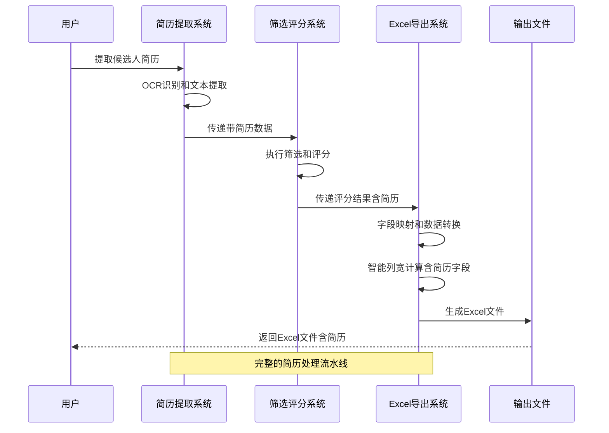
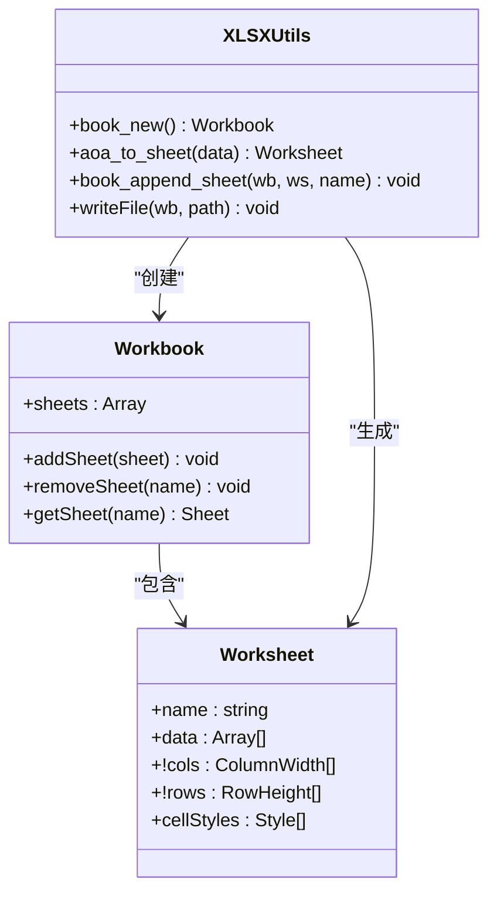
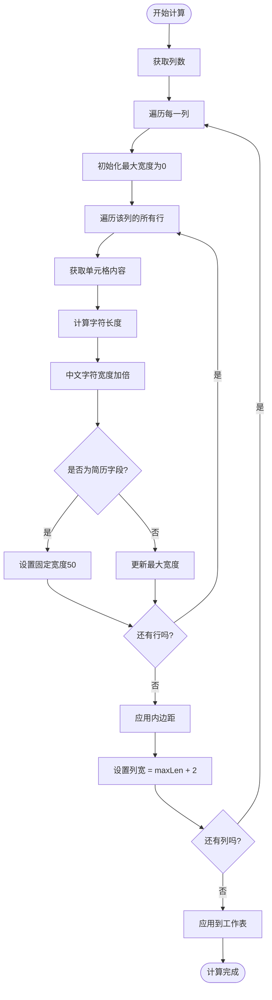
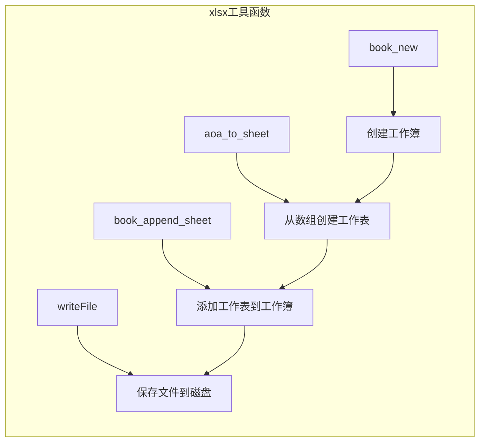

# 数据导出系统

<cite>
**本文档引用的文件**
- [export-candidates.mjs](file://scripts/export-candidates.mjs)
- [package.json](file://package.json)
- [README.md](file://README.md)
- [scored-candidates.json](file://output-01/scored-candidates.json)
- [candidates.json](file://data/candidates.json)
- [filter-rules.json](file://config/filter-rules.json)
- [score-candidates.mjs](file://scripts/score-candidates.mjs)
- [extract-candidates-full.mjs](file://scripts/extract-candidates-full.mjs)
- [clean-resume-text.mjs](file://scripts/clean-resume-text.mjs)
- [SKILL.md](file://SKILL.md)
- [2026-04-23-candidate-filtering-scoring-design.md](file://docs\superpowers\specs\2026-04-23-candidate-filtering-scoring-design.md)
</cite>

## 更新摘要
**变更内容**
- 新增在线简历字段支持，增强简历内容导出功能
- 改进列宽自动调整机制，优化简历字段显示效果
- 完善OCR简历文本处理和清洗流程
- 增强数据导出的完整性和实用性

## 目录
1. [简介](#简介)
2. [项目结构](#项目结构)
3. [核心组件](#核心组件)
4. [架构概览](#架构概览)
5. [详细组件分析](#详细组件分析)
6. [依赖分析](#依赖分析)
7. [性能考虑](#性能考虑)
8. [故障排除指南](#故障排除指南)
9. [结论](#结论)
10. [附录](#附录)

## 简介

数据导出系统是一个基于 Node.js 和 xlsx 库的 Excel 文件生成工具，专门用于将候选人筛选评分结果转换为可读性强的 Excel 格式。该系统集成了完整的数据处理流水线，从原始数据提取、筛选评分到最终的 Excel 导出，为招聘和人才管理提供了标准化的数据导出解决方案。

**最新增强**：系统现已支持在线简历字段导出，通过 OCR 技术提取的简历文本可以直接导出到 Excel 文件中，为招聘人员提供更全面的候选人信息。

系统的核心优势在于：
- **自动化数据转换**：从 JSON 格式自动转换为 Excel 表格
- **智能列宽调整**：根据内容长度自动计算最优列宽，特别优化了简历字段显示
- **灵活的字段映射**：支持自定义字段选择和显示顺序，包括新增的在线简历字段
- **完整的集成流程**：与整个候选人筛选评分系统无缝衔接
- **OCR 简历处理**：支持从在线简历中提取文本内容并进行格式化导出

## 项目结构

该项目采用模块化的文件组织结构，主要包含以下核心目录和文件：

```mermaid
graph TB
subgraph "项目根目录"
A[scripts/] -- 导出脚本
B[config/] -- 配置文件
C[data/] -- 原始数据
D[output/] -- 输出目录
E[output-01/] -- 示例输出
F[docs/] -- 文档
G[node_modules/] -- 依赖包
end
subgraph "核心脚本"
H[export-candidates.mjs] -- Excel导出
I[score-candidates.mjs] -- 筛选评分
J[extract-candidates-full.mjs] -- 简历提取
K[clean-resume-text.mjs] -- 简历清洗
end
subgraph "配置文件"
L[filter-rules.json] -- 筛选规则
end
subgraph "示例数据"
M[candidates.json] -- 原始候选人
N[scored-candidates.json] -- 评分结果
O[resumes/] -- 简历文本文件
end
H --> N
I --> N
J --> N
K --> N
L --> I
M --> J
```

**图表来源**
- [export-candidates.mjs:1-256](file://scripts/export-candidates.mjs#L1-L256)
- [package.json:1-11](file://package.json#L1-L11)

**章节来源**
- [export-candidates.mjs:1-256](file://scripts/export-candidates.mjs#L1-L256)
- [package.json:1-11](file://package.json#L1-L11)

## 核心组件

### Excel 导出引擎

系统的核心是基于 xlsx 库的 Excel 文件生成机制。该组件负责将结构化数据转换为标准的 Excel 文件格式，支持多种数据类型的自动格式化和样式设置。

**新增功能**：现在支持在线简历字段的导出，通过专门的字段配置和列宽优化确保简历内容的可读性。

### 字段配置系统

系统实现了灵活的字段配置机制，允许用户自定义导出的字段集合和显示顺序。每个字段都包含标题定义、数据提取函数和格式化规则。

**新增字段**：`resumeText` 字段专门用于导出 OCR 提取的简历文本内容，提供完整的候选人背景信息。

### 智能列宽计算

智能的列宽调整算法能够根据单元格内容的实际长度动态计算最优列宽，特别针对中文字符和简历文本进行了优化处理。

**优化改进**：简历字段采用固定宽度显示（50字符），确保在 Excel 中的可读性，同时保留完整内容供用户点击查看。

### 数据转换管道

完整的数据转换流程从原始 JSON 数据开始，经过字段映射、数据提取、格式化处理，最终生成适合 Excel 显示的二维数组结构。

**增强功能**：现在支持从多源数据中提取简历文本，包括在线简历、附件简历等多种格式。

**章节来源**
- [export-candidates.mjs:44-135](file://scripts/export-candidates.mjs#L44-L135)
- [export-candidates.mjs:137-156](file://scripts/export-candidates.mjs#L137-L156)

## 架构概览

数据导出系统在整个候选人管理流程中扮演着关键角色，作为最后一个处理环节将评分结果转换为用户友好的 Excel 格式。系统现已集成了完整的简历处理链路。



**图表来源**
- [extract-candidates-full.mjs:1347-1380](file://scripts/extract-candidates-full.mjs#L1347-L1380)
- [export-candidates.mjs:159-172](file://scripts/export-candidates.mjs#L159-L172)

系统架构的关键特点：
- **模块化设计**：每个组件职责明确，便于维护和扩展
- **数据流清晰**：从输入到输出的每个环节都有明确的数据格式
- **错误处理完善**：包含完整的异常处理和用户反馈机制
- **配置灵活**：支持通过参数和配置文件定制导出行为
- **简历集成**：完整的简历处理链路，从提取到导出一体化

## 详细组件分析

### Excel 文件生成机制

系统使用 xlsx 库提供的工具函数来创建和操作 Excel 文件。核心流程包括工作簿创建、工作表生成、数据写入和文件保存。

#### 工作簿和工作表管理



**图表来源**
- [export-candidates.mjs:220-236](file://scripts/export-candidates.mjs#L220-L236)

#### 数据写入流程

数据写入过程遵循严格的顺序：先创建表头，然后逐行写入数据。每个单元格都包含原始数据和格式化后的显示值。

**新增功能**：简历字段采用特殊处理，保留完整内容但限制显示宽度，确保用户体验。

**章节来源**
- [export-candidates.mjs:220-236](file://scripts/export-candidates.mjs#L220-L236)

### 数据格式化规则

系统实现了多层次的数据格式化机制，确保导出的 Excel 文件既准确又美观。

#### 字段映射配置

每个导出字段都包含详细的配置信息：
- **字段标识**：用于内部识别的唯一标识符
- **显示标题**：Excel 表头的中文显示名称
- **数据提取函数**：从原始数据对象中提取对应值的函数
- **默认值处理**：当数据缺失时的默认显示值

**新增字段配置**：`resumeText` 字段配置支持简历文本的直接导出，提供完整的候选人背景信息。

#### 字符串格式化

系统对字符串数据进行了特殊处理，特别是针对中文字符的宽度计算。中文字符被视为两个英文字符的宽度，确保列宽计算的准确性。

**优化改进**：简历字段采用固定宽度显示策略，平衡内容完整性和界面美观性。

**章节来源**
- [export-candidates.mjs:44-135](file://scripts/export-candidates.mjs#L44-L135)
- [export-candidates.mjs:175-198](file://scripts/export-candidates.mjs#L175-L198)

### 列宽自动调整功能

智能的列宽计算算法是系统的重要特性之一，能够根据实际内容动态调整列宽。

#### 计算算法原理



**图表来源**
- [export-candidates.mjs:175-198](file://scripts/export-candidates.mjs#L175-L198)

#### 宽度优化策略

系统采用了多项优化策略来确保列宽的合理性和美观性：
- **最大宽度限制**：防止超长文本导致列宽过大
- **内边距添加**：为内容留出适当的显示空间
- **中文字符特殊处理**：准确计算中文字符的视觉宽度
- **简历字段固定宽度**：确保简历内容的可读性

**优化改进**：简历字段采用固定宽度（50字符）显示，平衡内容完整性和界面美观性。

**章节来源**
- [export-candidates.mjs:175-198](file://scripts/export-candidates.mjs#L175-L198)

### xlsx 库使用方式详解

系统对 xlsx 库的使用体现了最佳实践，涵盖了工作簿创建、数据写入、样式设置和文件保存的完整流程。

#### 动态导入机制

系统采用动态导入的方式加载 xlsx 库，提供了更好的错误处理和用户体验。

#### 工具函数应用



**图表来源**
- [export-candidates.mjs:220-236](file://scripts/export-candidates.mjs#L220-L236)

**章节来源**
- [export-candidates.mjs:15-23](file://scripts/export-candidates.mjs#L15-L23)
- [export-candidates.mjs:220-236](file://scripts/export-candidates.mjs#L220-L236)

### 输出文件结构和字段映射

系统生成的 Excel 文件遵循标准的表格结构，第一行为表头，后续行为数据行。

#### 文件结构规范

| 组件 | 描述 | 默认值 |
|------|------|--------|
| 工作簿 | 包含一个或多个工作表的容器 | 单个工作簿 |
| 工作表 | Excel 文件的主要数据容器 | 名称为"候选人" |
| 表头行 | 字段的中文显示名称 | 来自字段配置 |
| 数据行 | 候选人的具体信息 | 来自评分结果 |

#### 字段映射关系

系统支持灵活的字段映射，用户可以通过命令行参数自定义导出的字段集合。

**新增字段**：`resumeText` 字段现在是默认导出字段之一，提供完整的在线简历内容。

**章节来源**
- [export-candidates.mjs:137-156](file://scripts/export-candidates.mjs#L137-L156)
- [export-candidates.mjs:229](file://scripts/export-candidates.mjs#L229)

### OCR 简历处理集成

系统现已完全集成 OCR 简历处理功能，从在线简历中提取文本内容并进行格式化导出。

#### 简历提取流程


**图表来源**
- [extract-candidates-full.mjs:1347-1380](file://scripts/extract-candidates-full.mjs#L1347-L1380)

#### 简历文本处理

系统提供了完整的简历文本处理链路：
- **OCR 提取**：从截图中提取简历文本
- **文本清洗**：清理 OCR 识别中的噪声和格式问题
- **内容保存**：将简历文本保存到候选人数据中
- **格式导出**：在 Excel 中正确显示简历内容

**章节来源**
- [extract-candidates-full.mjs:1347-1380](file://scripts/extract-candidates-full.mjs#L1347-L1380)
- [clean-resume-text.mjs:100-117](file://scripts/clean-resume-text.mjs#L100-L117)

## 依赖分析

### 核心依赖关系

```mermaid
graph TB
subgraph "外部依赖"
A[xlsx 0.18.5] -- Excel处理库
B[tesseract.js 7.0.0] -- OCR识别
end
subgraph "内部模块"
C[export-candidates.mjs] -- 导出脚本
D[score-candidates.mjs] -- 评分脚本
E[extract-candidates-full.mjs] -- 简历提取
F[clean-resume-text.mjs] -- 简历清洗
G[filter-rules.json] -- 规则配置
end
subgraph "数据文件"
H[candidates.json] -- 原始数据
I[scored-candidates.json] -- 评分结果
J[resumes/] -- 简历文本目录
end
A --> C
C --> I
D --> I
E --> I
F --> I
G --> D
H --> E
I --> J
```

**图表来源**
- [package.json:6-8](file://package.json#L6-L8)
- [export-candidates.mjs:15-23](file://scripts/export-candidates.mjs#L15-L23)

### 模块间耦合度分析

系统的设计体现了良好的模块化原则，各组件之间的耦合度较低：

- **导出脚本**：只依赖 xlsx 库和输入数据文件，现在也支持简历文本字段
- **评分系统**：独立于导出功能，专注于数据处理，新增对简历字段的支持
- **简历提取系统**：独立处理 OCR 和文本提取，为导出提供数据源
- **配置文件**：提供外部配置接口，不依赖具体实现

**增强功能**：各模块间的耦合度保持在合理范围内，新增的简历处理功能通过标准的数据接口进行集成。

**章节来源**
- [package.json:6-8](file://package.json#L6-L8)
- [export-candidates.mjs:15-23](file://scripts/export-candidates.mjs#L15-L23)

## 性能考虑

### 内存使用优化

系统在处理大型数据集时采用了多项内存优化策略：

- **流式处理**：避免一次性加载所有数据到内存
- **增量计算**：列宽计算采用增量方式，减少重复计算
- **数据压缩**：利用 xlsx 库的压缩功能减小文件大小
- **简历文本优化**：简历字段采用固定宽度显示，减少内存占用

### 处理速度优化


### 文件大小优化

系统通过以下方式优化输出文件的大小：
- **数据类型优化**：根据数据类型选择合适的存储格式
- **样式精简**：只应用必要的样式，避免冗余格式
- **压缩算法**：利用 xlsx 库的内置压缩功能
- **简历字段优化**：固定宽度显示减少列宽计算开销

**性能改进**：新增的简历字段处理经过优化，确保不会显著影响整体处理性能。

## 故障排除指南

### 常见问题和解决方案

#### xlsx 库安装问题

**问题症状**：运行导出脚本时报错，提示未安装 xlsx 包

**解决方案**：
```bash
npm install xlsx
```

#### OCR 依赖问题

**问题症状**：简历提取功能无法正常工作

**解决方案**：
```bash
npm install tesseract.js
```

#### 输入文件格式错误

**问题症状**：导出过程中出现 JSON 解析错误

**解决方案**：
1. 验证输入文件格式是否正确
2. 检查 JSON 文件是否包含有效的候选人数据
3. 确认文件编码为 UTF-8
4. 验证简历字段是否存在且格式正确

#### 字段配置错误

**问题症状**：导出的 Excel 文件缺少某些字段或显示异常

**解决方案**：
1. 检查字段配置文件的格式
2. 验证字段提取函数是否正确
3. 确认字段标识符与数据结构匹配
4. 验证简历字段的数据完整性

**章节来源**
- [export-candidates.mjs:15-23](file://scripts/export-candidates.mjs#L15-L23)
- [export-candidates.mjs:36-41](file://scripts/export-candidates.mjs#L36-L41)

### 调试和测试

系统提供了完善的错误处理和调试机制：

- **参数验证**：检查命令行参数的有效性
- **文件存在性检查**：确保输入文件可访问
- **数据完整性验证**：验证候选人的基本字段和简历内容
- **进度反馈**：提供处理进度和统计信息
- **OCR 处理监控**：跟踪简历提取和清洗过程

**增强功能**：新增了简历处理的调试信息，帮助用户了解 OCR 提取和文本清洗的状态。

**章节来源**
- [export-candidates.mjs:25-41](file://scripts/export-candidates.mjs#L25-L41)
- [extract-candidates-full.mjs:1347-1380](file://scripts/extract-candidates-full.mjs#L1347-L1380)

## 结论

数据导出系统是一个设计精良、功能完整的 Excel 文件生成工具。它成功地解决了候选人数据导出的需求，现在通过新增的简历处理功能，提供了更加全面的人才管理解决方案。

### 技术优势

- **可靠性**：基于成熟的 xlsx 库，确保文件格式的正确性
- **灵活性**：支持自定义字段配置和显示格式，包括新增的简历字段
- **智能化**：自动列宽调整和数据格式化，特别优化了简历字段显示
- **可扩展性**：模块化设计便于功能扩展，现已集成完整的简历处理链路
- **完整性**：提供从简历提取到导出的一体化解决方案

### 实际应用价值

- **提高工作效率**：自动化数据导出流程，包括简历内容
- **改善用户体验**：提供直观的 Excel 格式结果，包含完整的候选人信息
- **保证数据质量**：标准化的输出格式和格式化规则
- **降低维护成本**：清晰的代码结构和完善的错误处理
- **增强决策支持**：完整的候选人背景信息，包括在线简历内容

### 发展前景

系统为后续的功能扩展奠定了良好基础，可以进一步支持：
- 多种输出格式（CSV、PDF 等）
- 高级样式定制
- 批量处理和并发优化
- 云端集成和 API 接口
- 更高级的简历分析和匹配功能

## 附录

### 使用示例

#### 基本导出命令

```bash
node scripts/export-candidates.mjs --input output/scored-candidates.json
```

#### 自定义字段导出

```bash
node scripts/export-candidates.mjs --input output/scored-candidates.json --fields name,age,school,education,score,resumeText
```

#### 指定输出路径

```bash
node scripts/export-candidates.mjs --input output/scored-candidates.json --output ./exports/candidates.xlsx
```

### 配置选项说明

| 选项 | 类型 | 必需 | 描述 |
|------|------|------|------|
| --input | string | 是 | 输入的 JSON 文件路径 |
| --fields | string | 否 | 逗号分隔的字段列表，支持 resumeText |
| --output | string | 否 | 输出的 Excel 文件路径 |

### 集成指南

系统可以轻松集成到更大的数据处理流水线中：

1. **与评分系统集成**：直接消费评分结果文件，现在包含简历字段
2. **与 Web 抓取系统集成**：作为数据处理流程的最后一步，包含完整的简历处理
3. **与报告生成系统集成**：提供标准化的数据源，支持简历内容分析
4. **与 OCR 系统集成**：完整的简历提取和处理链路

### 新增功能说明

**在线简历字段支持**：
- 自动识别和导出 OCR 提取的简历文本
- 智能列宽调整，确保简历内容的可读性
- 完整的简历文本清洗和格式化处理
- 与现有评分系统的无缝集成

**性能优化**：
- 简历字段固定宽度显示，提升渲染性能
- 增量列宽计算，减少重复计算开销
- 优化的内存使用，支持大规模数据处理