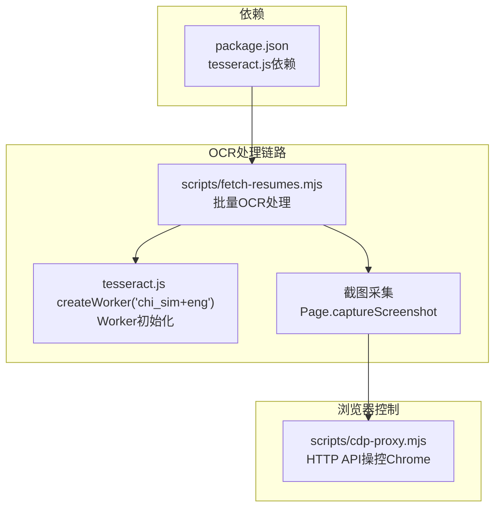
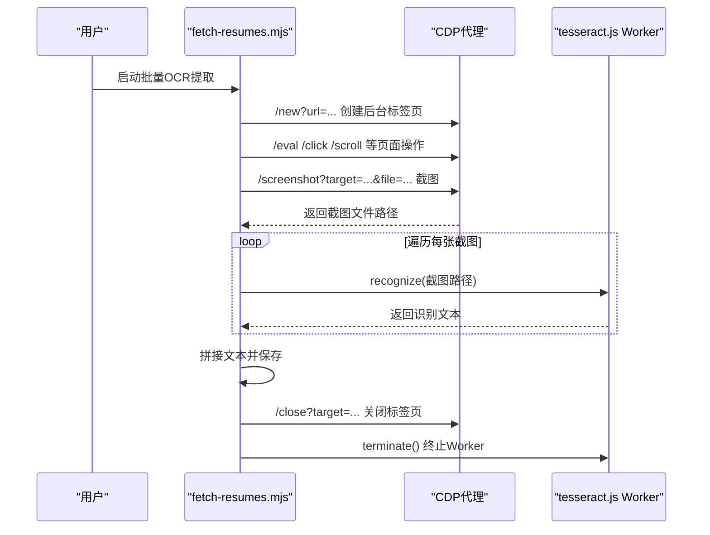
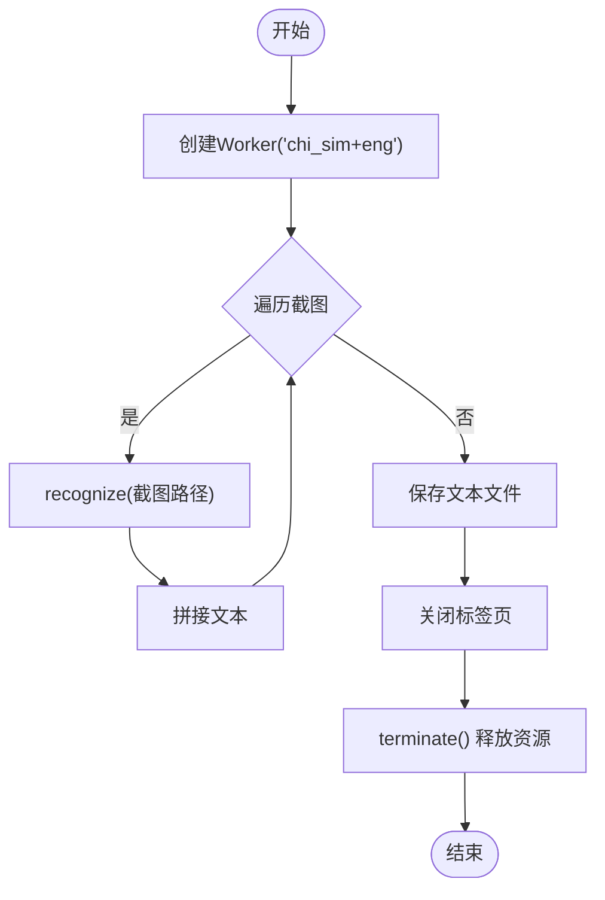
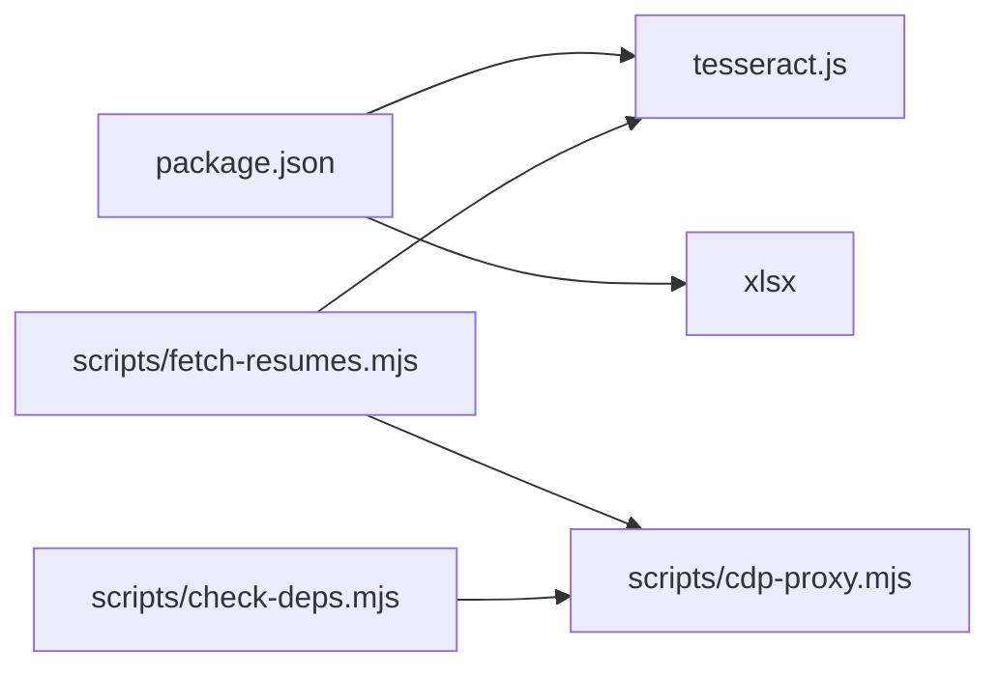

# OCR文本识别

<cite>
**本文引用的文件**
- [README.md](file://README.md)
- [package.json](file://package.json)
- [scripts/fetch-resumes.mjs](file://scripts/fetch-resumes.mjs)
- [scripts/cdp-proxy.mjs](file://scripts/cdp-proxy.mjs)
- [scripts/check-deps.mjs](file://scripts/check-deps.mjs)
- [config/filter-rules.json](file://config/filter-rules.json)
- [data/candidates.json](file://data/candidates.json)
</cite>

## 目录
1. [简介](#简介)
2. [项目结构](#项目结构)
3. [核心组件](#核心组件)
4. [架构总览](#架构总览)
5. [详细组件分析](#详细组件分析)
6. [依赖关系分析](#依赖关系分析)
7. [性能考虑](#性能考虑)
8. [故障排查指南](#故障排查指南)
9. [结论](#结论)
10. [附录](#附录)

## 简介
本文件面向OCR文本识别模块，聚焦于tesseract.js在本仓库中的集成与使用，包括：
- 双语识别配置（中文简体+英文）
- Worker初始化与生命周期管理
- 图像预处理与识别参数调优
- 批量OCR处理流程与内存管理
- 性能优化与错误处理
- 实际使用示例与常见问题解决

## 项目结构
围绕OCR能力的关键文件与职责如下：
- scripts/fetch-resumes.mjs：负责从网页弹窗中截图并进行批量OCR识别，展示完整的OCR工作流（截图→OCR→保存）
- scripts/cdp-proxy.mjs：提供HTTP API操控Chrome，为OCR前的页面交互与截图提供支撑
- scripts/check-deps.mjs：环境检查与代理启动辅助，确保CDP可用
- package.json：声明tesseract.js依赖
- config/filter-rules.json、data/candidates.json：上游数据来源，配合OCR产出进行后续筛选与导出

**图表来源**
- [scripts/fetch-resumes.mjs](file://scripts/fetch-resumes.mjs)
- [scripts/cdp-proxy.mjs](file://scripts/cdp-proxy.mjs)
- [package.json](file://package.json)

**章节来源**
- [README.md](file://README.md)
- [package.json](file://package.json)

## 核心组件
- tesseract.js集成
  - 通过动态导入引入createWorker，并以“chi_sim+eng”双语模型初始化Worker
  - 使用worker.recognize对每张截图进行识别，最终拼接为完整文本
- CDP代理
  - 提供/screenshot端点用于截图，支持PNG/JPEG格式与文件落盘
  - 为OCR前的页面交互（滚动、点击、导航）提供统一HTTP接口
- 批量处理与生命周期
  - 在单次执行中创建一次Worker并复用，结束后终止释放资源
  - 对每个候选人依次执行：点击→打开弹窗→滚动分页截图→OCR→保存→关闭弹窗

**章节来源**
- [scripts/fetch-resumes.mjs](file://scripts/fetch-resumes.mjs)
- [scripts/cdp-proxy.mjs](file://scripts/cdp-proxy.mjs)

## 架构总览
下图展示了从页面交互到OCR识别再到结果保存的端到端流程。

**图表来源**
- [scripts/fetch-resumes.mjs](file://scripts/fetch-resumes.mjs)
- [scripts/cdp-proxy.mjs](file://scripts/cdp-proxy.mjs)

## 详细组件分析

### tesseract.js集成与双语识别
- 初始化
  - 在脚本中动态导入tesseract.js并创建Worker，语言模型为“chi_sim+eng”
  - 该模型同时支持中文简体与英文，适合简历等中英混排场景
- 识别调用
  - 对每张截图调用worker.recognize，获取text字段作为识别结果
  - 将多页文本按固定分隔符拼接，形成完整简历文本
- 生命周期
  - 在处理开始前创建Worker，在全部候选人处理完成后调用terminate释放资源

**图表来源**
- [scripts/fetch-resumes.mjs](file://scripts/fetch-resumes.mjs)

**章节来源**
- [scripts/fetch-resumes.mjs](file://scripts/fetch-resumes.mjs)

### 图像预处理与识别参数调优
- 截图策略
  - 通过CDP滚动容器至目标页码，再调用截图接口获取稳定画面
  - 采用PNG格式以保证识别质量（JPEG可降低体积但可能影响精度）
- 文本后处理
  - 识别结果统一trim，避免多余空白
  - 多页文本以固定分隔符拼接，便于后续清洗与结构化
- 识别参数
  - 本脚本未显式传入额外参数；若需进一步提升准确率，可在recognize调用处传入更多参数（例如page segmentation mode、白名单字符集等）

**章节来源**
- [scripts/fetch-resumes.mjs](file://scripts/fetch-resumes.mjs)
- [scripts/cdp-proxy.mjs](file://scripts/cdp-proxy.mjs)

### 批量OCR处理流程与内存管理
- 流程要点
  - 一次性创建Worker并复用，避免频繁初始化带来的开销
  - 每个候选人独立处理，失败不影响整体流程，失败信息记录在结果汇总中
  - 处理完成后统一关闭标签页并终止Worker，释放内存
- 内存管理
  - Worker终止后释放WASM与模型资源
  - 截图文件在临时目录生成，可根据需要清理（脚本默认保留以便排障）

**章节来源**
- [scripts/fetch-resumes.mjs](file://scripts/fetch-resumes.mjs)

### 错误处理机制
- 页面交互错误
  - 等待列表加载超时、点击元素未找到、弹窗未出现等情况均抛出明确错误
- 识别错误
  - recognize调用失败会中断当前候选人处理，记录失败原因并继续下一个
- 代理错误
  - CDP代理健康检查失败或连接异常时，脚本会给出提示并退出

**章节来源**
- [scripts/fetch-resumes.mjs](file://scripts/fetch-resumes.mjs)
- [scripts/check-deps.mjs](file://scripts/check-deps.mjs)

### 识别质量评估与优化策略
- 质量评估
  - 通过统计识别字数、比对关键字段（如姓名、公司、职位）进行人工抽样核验
  - 对识别错误较多的页面类型（如手写体、低分辨率、倾斜角度）单独标注
- 优化策略
  - 提高截图分辨率与对比度
  - 对倾斜或模糊页面进行几何校正与滤波
  - 针对特定版式（简历、证书）调整page segmentation mode
  - 使用自定义字典或白名单约束识别字符集

[本节为通用指导，不直接分析具体文件]

## 依赖关系分析
- 外部依赖
  - tesseract.js：OCR引擎核心
  - xlsx：用于导出候选人数据（与OCR结果结合使用）
- 内部依赖
  - fetch-resumes.mjs依赖CDP代理提供的截图能力
  - check-deps.mjs负责确保CDP代理可用

**图表来源**
- [package.json](file://package.json)
- [scripts/fetch-resumes.mjs](file://scripts/fetch-resumes.mjs)
- [scripts/cdp-proxy.mjs](file://scripts/cdp-proxy.mjs)
- [scripts/check-deps.mjs](file://scripts/check-deps.mjs)

**章节来源**
- [package.json](file://package.json)
- [scripts/fetch-resumes.mjs](file://scripts/fetch-resumes.mjs)
- [scripts/cdp-proxy.mjs](file://scripts/cdp-proxy.mjs)
- [scripts/check-deps.mjs](file://scripts/check-deps.mjs)

## 性能考虑
- Worker复用
  - 在单次执行中仅创建一次Worker，显著降低初始化成本
- 并发与批处理
  - 当前脚本按候选人顺序串行处理，避免页面状态冲突；如需加速，可在确保页面状态隔离的前提下引入并发队列
- I/O优化
  - 截图文件落盘，避免大对象在内存中传递
- 模型选择
  - “chi_sim+eng”模型兼顾中文与英文，适合混合文本；如场景单一，可考虑更轻量的单语模型以节省内存

[本节提供通用建议，不直接分析具体文件]

## 故障排查指南
- 无法连接CDP代理
  - 使用check-deps.mjs进行环境检查，确认代理端口与Chrome调试端口
  - 若首次连接弹出授权弹窗，按提示点击“允许”
- 截图为空或黑屏
  - 确认弹窗已完全渲染后再截图；适当增加滚动等待时间
  - 检查截图格式与文件路径权限
- 识别结果为空或错误
  - 提高截图清晰度与对比度
  - 对倾斜或模糊页面进行预处理
  - 调整page segmentation mode或引入字典约束
- 内存占用过高
  - 确保在处理完成后调用terminate释放Worker
  - 控制单次处理的候选人数量，避免同时加载过多截图

**章节来源**
- [scripts/check-deps.mjs](file://scripts/check-deps.mjs)
- [scripts/fetch-resumes.mjs](file://scripts/fetch-resumes.mjs)

## 结论
本项目通过CDP代理与tesseract.js实现了从页面截图到批量OCR识别的完整链路。双语模型“chi_sim+eng”满足中英混排场景需求；Worker生命周期管理与I/O优化有效降低了资源消耗。结合本文的参数调优与错误处理建议，可在实际业务中获得更稳定、更高准确率的OCR效果。

## 附录

### 实际使用示例
- 批量提取Boss直聘在线简历
  - 步骤：启动CDP代理→打开沟通页→逐个点击候选人→打开在线简历弹窗→滚动分页截图→OCR识别→保存文本→关闭弹窗→终止Worker
  - 关键调用：/new、/eval、/click、/scroll、/screenshot、recognize、/close
- 语言包配置
  - 使用“chi_sim+eng”双语模型；如需扩展其他语言，可在createWorker时添加对应语言代码

**章节来源**
- [scripts/fetch-resumes.mjs](file://scripts/fetch-resumes.mjs)
- [scripts/cdp-proxy.mjs](file://scripts/cdp-proxy.mjs)