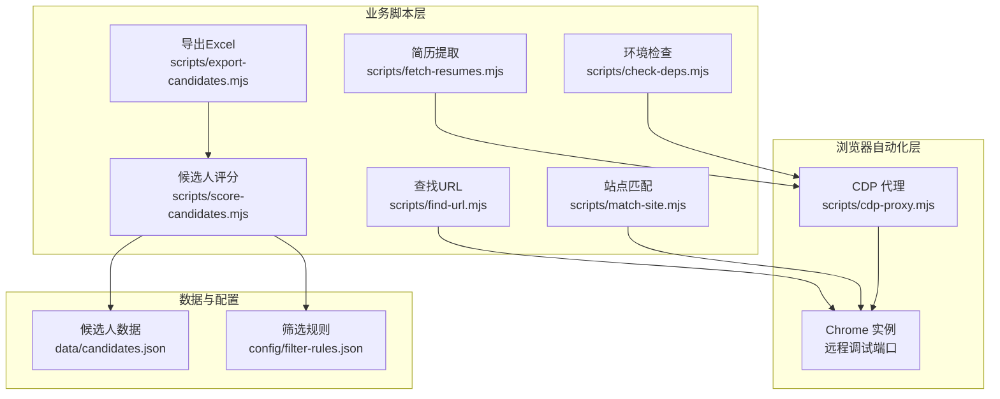
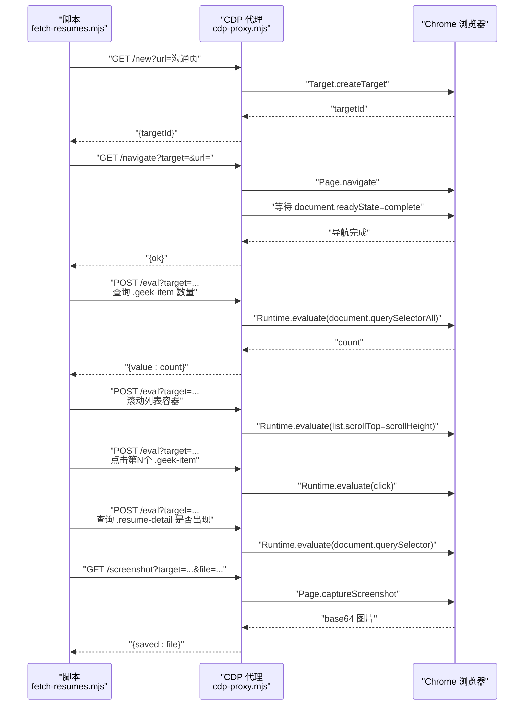
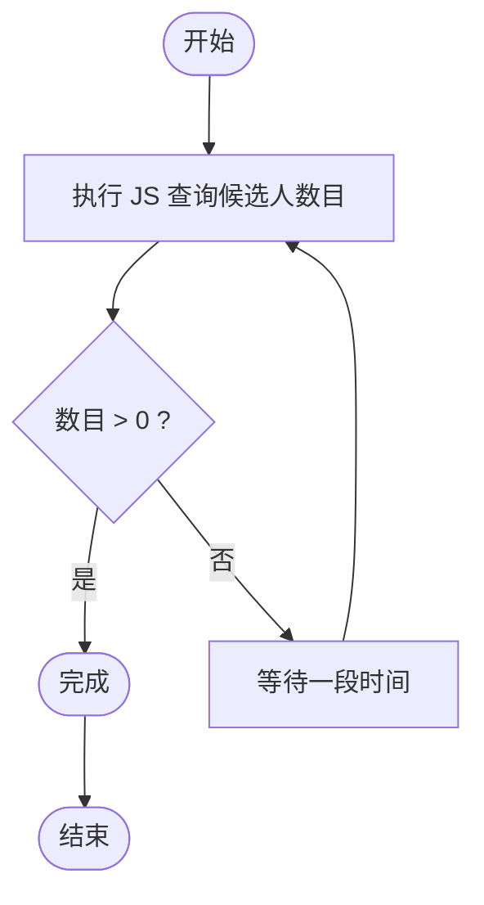
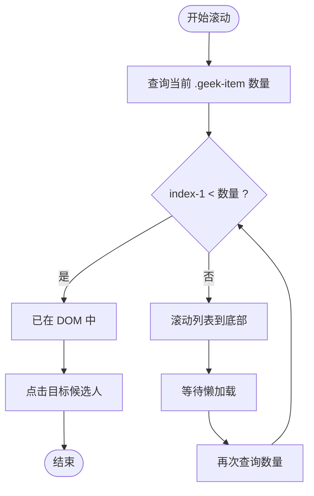
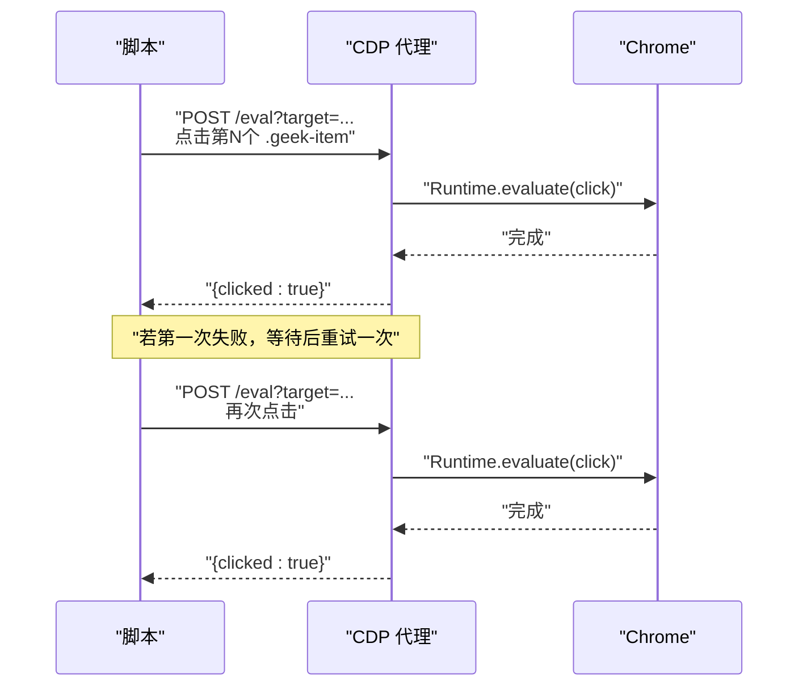
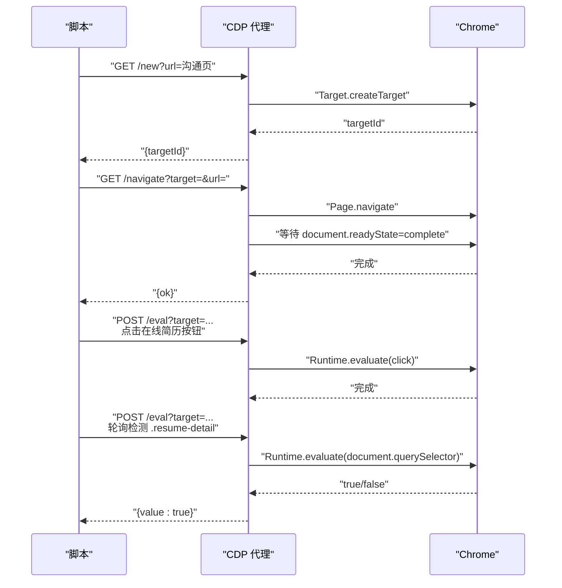
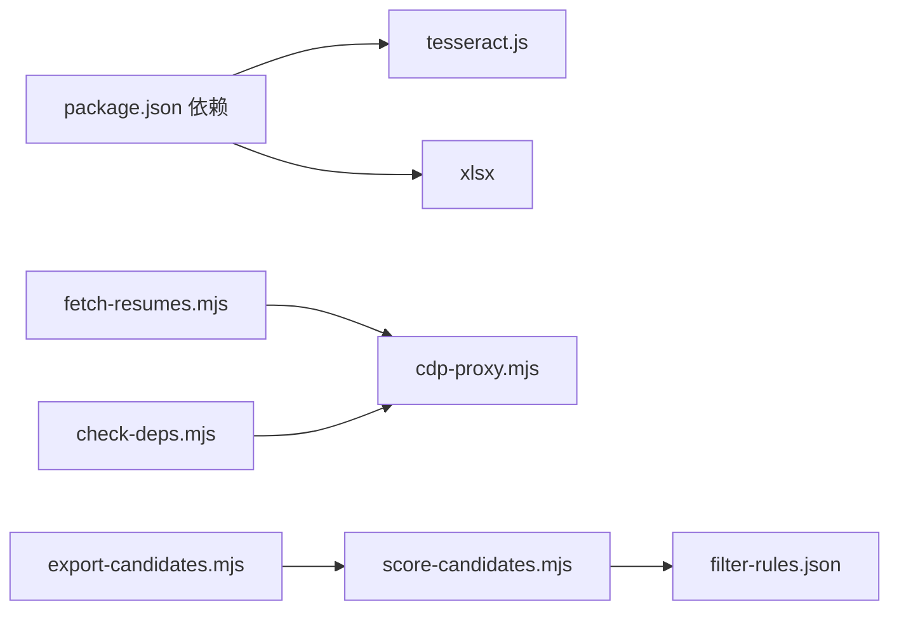

# 候选人交互

<cite>
**本文引用的文件**
- [README.md](file://README.md)
- [package.json](file://package.json)
- [scripts/cdp-proxy.mjs](file://scripts/cdp-proxy.mjs)
- [scripts/check-deps.mjs](file://scripts/check-deps.mjs)
- [scripts/fetch-resumes.mjs](file://scripts/fetch-resumes.mjs)
- [scripts/export-candidates.mjs](file://scripts/export-candidates.mjs)
- [scripts/score-candidates.mjs](file://scripts/score-candidates.mjs)
- [scripts/match-site.mjs](file://scripts/match-site.mjs)
- [scripts/find-url.mjs](file://scripts/find-url.mjs)
- [data/candidates.json](file://data/candidates.json)
- [config/filter-rules.json](file://config/filter-rules.json)
</cite>

## 目录
1. [简介](#简介)
2. [项目结构](#项目结构)
3. [核心组件](#核心组件)
4. [架构总览](#架构总览)
5. [详细组件分析](#详细组件分析)
6. [依赖关系分析](#依赖关系分析)
7. [性能考量](#性能考量)
8. [故障排除指南](#故障排除指南)
9. [结论](#结论)
10. [附录](#附录)

## 简介
本文件面向“候选人交互”模块，围绕候选人列表加载检测、虚拟滚动处理、DOM 元素定位策略、候选人卡片点击机制、重试逻辑与异常处理、页面导航流程、弹窗打开检测与状态同步、滚动优化、元素可见性判断与超时处理策略进行系统化技术文档化，并提供交互流程示例与故障排除指南。文档基于仓库内的脚本与配置文件进行分析，重点参考了简历提取流程中的交互实现与 CDP 代理能力。

## 项目结构
该项目采用脚本驱动的模块化设计，围绕 CDP 代理（HTTP API）与若干专用脚本实现浏览器自动化与数据处理：
- scripts/cdp-proxy.mjs：CDP 代理服务，提供 /new、/navigate、/eval、/click、/clickAt、/scroll、/screenshot 等接口，统一管理 Chrome 连接、会话与页面生命周期。
- scripts/fetch-resumes.mjs：简历提取流程，演示候选人列表加载检测、虚拟滚动、DOM 定位、点击与弹窗检测、滚动与截图、OCR 文本提取、异常处理与状态清理。
- scripts/score-candidates.mjs：候选人评分与筛选，展示字段解析、规则比较、权重计算与推荐等级。
- scripts/export-candidates.mjs：将评分后的候选人导出为 Excel。
- scripts/check-deps.mjs：环境检查与代理就绪保障。
- scripts/find-url.mjs、scripts/match-site.mjs：辅助定位目标 URL 与站点经验匹配。
- data/candidates.json、config/filter-rules.json：输入数据与筛选规则。

**图表来源**
- [scripts/cdp-proxy.mjs:288-552](file://scripts/cdp-proxy.mjs#L288-L552)
- [scripts/fetch-resumes.mjs:251-380](file://scripts/fetch-resumes.mjs#L251-L380)
- [scripts/score-candidates.mjs:343-383](file://scripts/score-candidates.mjs#L343-L383)
- [scripts/export-candidates.mjs:155-195](file://scripts/export-candidates.mjs#L155-L195)
- [scripts/check-deps.mjs:107-139](file://scripts/check-deps.mjs#L107-L139)
- [scripts/find-url.mjs:176-215](file://scripts/find-url.mjs#L176-L215)
- [scripts/match-site.mjs:1-47](file://scripts/match-site.mjs#L1-L47)
- [data/candidates.json:1-49](file://data/candidates.json#L1-L49)
- [config/filter-rules.json:1-41](file://config/filter-rules.json#L1-L41)

**章节来源**
- [README.md:104-137](file://README.md#L104-L137)
- [scripts/cdp-proxy.mjs:288-552](file://scripts/cdp-proxy.mjs#L288-L552)
- [scripts/fetch-resumes.mjs:251-380](file://scripts/fetch-resumes.mjs#L251-L380)
- [scripts/score-candidates.mjs:343-383](file://scripts/score-candidates.mjs#L343-L383)
- [scripts/export-candidates.mjs:155-195](file://scripts/export-candidates.mjs#L155-L195)
- [scripts/check-deps.mjs:107-139](file://scripts/check-deps.mjs#L107-L139)
- [scripts/find-url.mjs:176-215](file://scripts/find-url.mjs#L176-L215)
- [scripts/match-site.mjs:1-47](file://scripts/match-site.mjs#L1-L47)
- [data/candidates.json:1-49](file://data/candidates.json#L1-L49)
- [config/filter-rules.json:1-41](file://config/filter-rules.json#L1-L41)

## 核心组件
- CDP 代理服务：提供统一的 HTTP API，封装 Chrome CDP 能力，包括页面新建、导航、JS 执行、点击、滚动、截图、会话管理与加载等待。
- 候选人交互脚本：简历提取流程脚本，实现候选人列表加载检测、虚拟滚动、DOM 定位、点击与弹窗检测、滚动与截图、OCR 文本提取、异常处理与状态清理。
- 评分与导出：评分脚本根据规则计算分数并生成推荐等级；导出脚本将评分结果转为 Excel。
- 环境检查：确保 Node 版本、Chrome 远程调试端口与代理服务可用。

**章节来源**
- [scripts/cdp-proxy.mjs:288-552](file://scripts/cdp-proxy.mjs#L288-L552)
- [scripts/fetch-resumes.mjs:100-179](file://scripts/fetch-resumes.mjs#L100-L179)
- [scripts/score-candidates.mjs:343-383](file://scripts/score-candidates.mjs#L343-L383)
- [scripts/export-candidates.mjs:155-195](file://scripts/export-candidates.mjs#L155-L195)
- [scripts/check-deps.mjs:107-139](file://scripts/check-deps.mjs#L107-L139)

## 架构总览
下图展示了“候选人交互”的端到端流程：脚本通过 CDP 代理控制 Chrome，执行页面导航、元素定位、点击与滚动，等待弹窗出现并进行截图与 OCR，最后清理状态并输出结果。

**图表来源**
- [scripts/fetch-resumes.mjs:287-302](file://scripts/fetch-resumes.mjs#L287-L302)
- [scripts/fetch-resumes.mjs:293-302](file://scripts/fetch-resumes.mjs#L293-L302)
- [scripts/fetch-resumes.mjs:100-179](file://scripts/fetch-resumes.mjs#L100-L179)
- [scripts/cdp-proxy.mjs:312-345](file://scripts/cdp-proxy.mjs#L312-L345)
- [scripts/cdp-proxy.mjs:355-373](file://scripts/cdp-proxy.mjs#L355-L373)
- [scripts/cdp-proxy.mjs:478-500](file://scripts/cdp-proxy.mjs#L478-L500)
- [scripts/cdp-proxy.mjs:502-517](file://scripts/cdp-proxy.mjs#L502-L517)

## 详细组件分析

### 候选人列表加载检测
- 目标：在打开沟通页后，等待候选人列表渲染完成，避免后续 DOM 查询失败。
- 实现要点：
  - 使用 /eval 执行 JS 查询特定选择器数量，循环轮询直到大于 0。
  - 超时阈值可配置，默认最大等待时间约 10 秒。
- 关键路径：
  - 等待函数调用与轮询逻辑。
  - 列表容器选择器与计数查询。
- 超时与异常：
  - 超时抛出明确错误，便于上层终止流程并清理资源。

**图表来源**
- [scripts/fetch-resumes.mjs:100-111](file://scripts/fetch-resumes.mjs#L100-L111)

**章节来源**
- [scripts/fetch-resumes.mjs:100-111](file://scripts/fetch-resumes.mjs#L100-L111)

### 虚拟滚动处理与 DOM 元素定位策略
- 目标：当目标候选人不在当前可视 DOM 中时，通过滚动触发虚拟列表加载，使其出现在 DOM 中后再进行点击。
- 实现要点：
  - 先查询当前 DOM 中候选数量，若不足则滚动列表容器到底部，触发懒加载。
  - 重试多次并等待，再次查询 DOM 数量，确认目标已出现。
  - 若超出当前可见范围，记录警告并尝试直接点击（作为兜底）。
- 定位策略：
  - 使用类选择器定位候选人项与列表容器，优先使用稳定的选择器。
  - 对于简历弹窗，使用特定类名检测弹窗是否出现。
- 关键路径：
  - 滚动表达式与等待策略。
  - DOM 数量对比与重试逻辑。

**图表来源**
- [scripts/fetch-resumes.mjs:113-135](file://scripts/fetch-resumes.mjs#L113-L135)

**章节来源**
- [scripts/fetch-resumes.mjs:113-135](file://scripts/fetch-resumes.mjs#L113-L135)

### 候选人卡片点击机制、重试逻辑与异常处理
- 目标：确保点击行为可靠，处理元素尚未就绪或点击无效的情况。
- 实现要点：
  - 先滚动至目标候选人，保证其在 DOM 中。
  - 执行一次点击，若失败则短暂等待后重试一次。
  - 点击后等待页面响应，避免后续步骤过早执行。
- 异常处理：
  - 点击前后的异常被捕获并忽略，重试后仍失败则由上层逻辑抛出。
  - 上层在简历弹窗检测阶段设置超时，超时则抛出错误并清理状态。

**图表来源**
- [scripts/fetch-resumes.mjs:137-153](file://scripts/fetch-resumes.mjs#L137-L153)

**章节来源**
- [scripts/fetch-resumes.mjs:137-153](file://scripts/fetch-resumes.mjs#L137-L153)

### 页面导航流程、弹窗打开检测与状态同步机制
- 导航流程：
  - 通过 /new 创建后台 Tab，自动等待页面加载完成。
  - 通过 /navigate 导航至目标 URL，并等待 document.readyState=complete。
- 弹窗检测：
  - 点击“在线简历”按钮后，轮询检测特定弹窗容器是否存在。
  - 弹窗出现后额外等待一段时间，确保内部 Canvas 渲染完成。
- 状态同步：
  - 每一步均通过 /eval 执行 JS 获取状态，避免依赖外部 DOM 查询的不确定性。
  - 出错时尝试关闭可能打开的弹窗，保持状态一致性。

**图表来源**
- [scripts/fetch-resumes.mjs:287-302](file://scripts/fetch-resumes.mjs#L287-L302)
- [scripts/fetch-resumes.mjs:293-302](file://scripts/fetch-resumes.mjs#L293-L302)
- [scripts/fetch-resumes.mjs:155-179](file://scripts/fetch-resumes.mjs#L155-L179)
- [scripts/cdp-proxy.mjs:312-345](file://scripts/cdp-proxy.mjs#L312-L345)

**章节来源**
- [scripts/fetch-resumes.mjs:287-302](file://scripts/fetch-resumes.mjs#L287-L302)
- [scripts/fetch-resumes.mjs:293-302](file://scripts/fetch-resumes.mjs#L293-L302)
- [scripts/fetch-resumes.mjs:155-179](file://scripts/fetch-resumes.mjs#L155-L179)
- [scripts/cdp-proxy.mjs:312-345](file://scripts/cdp-proxy.mjs#L312-L345)

### 滚动优化、元素可见性判断与超时处理策略
- 滚动优化：
  - 使用 /scroll 接口进行窗口级滚动，或通过 /eval 执行 JS 滚动列表容器，触发虚拟列表懒加载。
  - 滚动后等待固定时间，确保懒加载触发与渲染完成。
- 元素可见性判断：
  - 通过查询选择器数量与容器尺寸（scrollHeight/clientHeight）判断是否需要继续滚动。
  - 对于弹窗，通过检测特定容器是否存在进行可见性判断。
- 超时处理：
  - 列表加载、弹窗出现、页面导航均设置超时阈值，超时抛错并终止流程。
  - 代理层对 CDP 命令设置统一超时，避免长时间阻塞。

**章节来源**
- [scripts/fetch-resumes.mjs:113-135](file://scripts/fetch-resumes.mjs#L113-L135)
- [scripts/fetch-resumes.mjs:181-193](file://scripts/fetch-resumes.mjs#L181-L193)
- [scripts/cdp-proxy.mjs:478-500](file://scripts/cdp-proxy.mjs#L478-L500)
- [scripts/cdp-proxy.mjs:250-278](file://scripts/cdp-proxy.mjs#L250-L278)

### 交互流程示例
- 示例：打开沟通页 → 等待候选人列表 → 滚动加载目标候选人 → 点击候选人 → 点击在线简历 → 截图 → OCR → 保存 → 关闭弹窗 → 下一位。
- 关键点：每步均通过 /eval 获取状态，滚动后等待，弹窗出现后等待渲染，失败时清理状态并记录摘要。

**章节来源**
- [scripts/fetch-resumes.mjs:251-380](file://scripts/fetch-resumes.mjs#L251-L380)

## 依赖关系分析
- 外部依赖：
  - tesseract.js：OCR 文字识别。
  - xlsx：Excel 导出。
- 内部依赖：
  - CDP 代理为所有浏览器自动化脚本提供统一入口。
  - 评分脚本依赖筛选规则配置。
  - 导出脚本依赖评分结果数据。

**图表来源**
- [package.json:6-9](file://package.json#L6-L9)
- [scripts/fetch-resumes.mjs:287-302](file://scripts/fetch-resumes.mjs#L287-L302)
- [scripts/score-candidates.mjs:343-383](file://scripts/score-candidates.mjs#L343-L383)
- [scripts/export-candidates.mjs:155-195](file://scripts/export-candidates.mjs#L155-L195)
- [scripts/check-deps.mjs:107-139](file://scripts/check-deps.mjs#L107-L139)
- [config/filter-rules.json:1-41](file://config/filter-rules.json#L1-41)

**章节来源**
- [package.json:6-9](file://package.json#L6-L9)
- [scripts/fetch-resumes.mjs:287-302](file://scripts/fetch-resumes.mjs#L287-L302)
- [scripts/score-candidates.mjs:343-383](file://scripts/score-candidates.mjs#L343-L383)
- [scripts/export-candidates.mjs:155-195](file://scripts/export-candidates.mjs#L155-L195)
- [scripts/check-deps.mjs:107-139](file://scripts/check-deps.mjs#L107-L139)
- [config/filter-rules.json:1-41](file://config/filter-rules.json#L1-L41)

## 性能考量
- 滚动与懒加载：通过滚动到底部触发虚拟列表懒加载，减少不必要的全量加载。
- 等待策略：滚动后等待固定时间，确保渲染完成；弹窗出现后额外等待 Canvas 渲染。
- 超时控制：各关键步骤设置超时阈值，避免无限等待；代理层对 CDP 命令设置统一超时。
- 并发与重试：点击阶段采用一次性重试，避免过度并发；上层流程按候选人顺序串行处理，减少状态竞争。

[本节为通用指导，不直接分析具体文件]

## 故障排除指南
- 代理未就绪：
  - 现象：/targets 请求失败或超时。
  - 处理：运行环境检查脚本，确保代理进程已启动并监听端口。
- Chrome 未开启远程调试：
  - 现象：代理无法连接或出现授权弹窗。
  - 处理：按照提示勾选“允许远程调试”，并在首次连接时点击授权。
- 候选人列表未加载：
  - 现象：查询 .geek-item 数量为 0。
  - 处理：延长等待时间或检查页面 URL 是否正确；确认网络与登录状态。
- 弹窗未出现：
  - 现象：点击“在线简历”后轮询超时。
  - 处理：检查按钮选择器是否变化；确认候选人是否上传在线简历；适当延长等待时间。
- 点击无效：
  - 现象：点击后无响应或立即消失。
  - 处理：增加重试间隔；确认元素是否在 DOM 中；必要时改为真实鼠标点击（/clickAt）。
- 截图与 OCR 失败：
  - 现象：弹窗截图为空或 OCR 识别失败。
  - 处理：确认弹窗已完全渲染；调整截图质量与 OCR 参数；检查磁盘空间与权限。

**章节来源**
- [scripts/check-deps.mjs:107-139](file://scripts/check-deps.mjs#L107-L139)
- [scripts/fetch-resumes.mjs:100-111](file://scripts/fetch-resumes.mjs#L100-L111)
- [scripts/fetch-resumes.mjs:155-179](file://scripts/fetch-resumes.mjs#L155-L179)
- [scripts/fetch-resumes.mjs:137-153](file://scripts/fetch-resumes.mjs#L137-L153)
- [scripts/cdp-proxy.mjs:250-278](file://scripts/cdp-proxy.mjs#L250-L278)

## 结论
本模块通过 CDP 代理实现了稳定的浏览器自动化能力，围绕候选人交互的关键环节（列表加载、虚拟滚动、DOM 定位、点击与弹窗检测、滚动与截图、OCR、异常处理与状态清理）形成了可复用的流程。结合超时与重试策略，能够在复杂动态页面中可靠地完成候选人交互任务。建议在生产环境中配合日志与监控，持续优化滚动与等待参数，提升整体稳定性与吞吐量。

[本节为总结性内容，不直接分析具体文件]

## 附录
- 输入数据与规则：
  - 候选人数据示例位于 data/candidates.json。
  - 筛选规则示例位于 config/filter-rules.json。
- 相关脚本：
  - 环境检查：scripts/check-deps.mjs
  - 站点经验匹配：scripts/match-site.mjs
  - URL 查找：scripts/find-url.mjs
  - 候选人评分：scripts/score-candidates.mjs
  - 导出 Excel：scripts/export-candidates.mjs

**章节来源**
- [data/candidates.json:1-49](file://data/candidates.json#L1-L49)
- [config/filter-rules.json:1-41](file://config/filter-rules.json#L1-L41)
- [scripts/check-deps.mjs:107-139](file://scripts/check-deps.mjs#L107-L139)
- [scripts/match-site.mjs:1-47](file://scripts/match-site.mjs#L1-L47)
- [scripts/find-url.mjs:176-215](file://scripts/find-url.mjs#L176-L215)
- [scripts/score-candidates.mjs:343-383](file://scripts/score-candidates.mjs#L343-L383)
- [scripts/export-candidates.mjs:155-195](file://scripts/export-candidates.mjs#L155-L195)