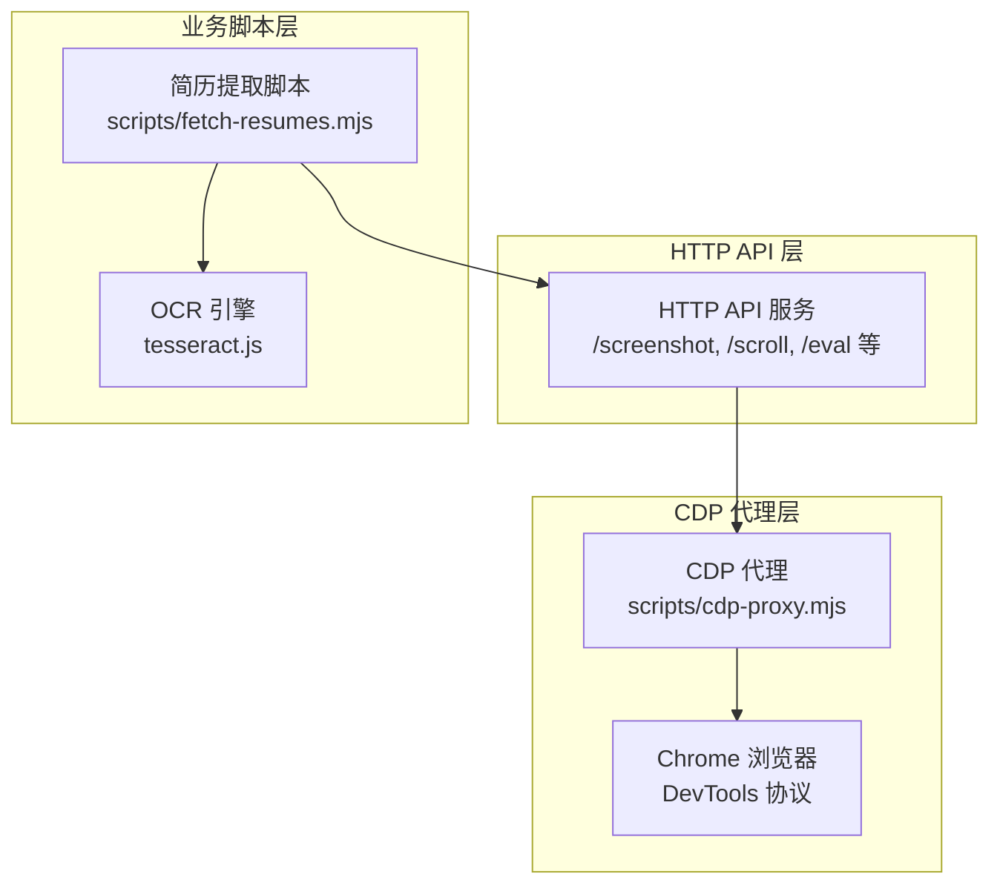
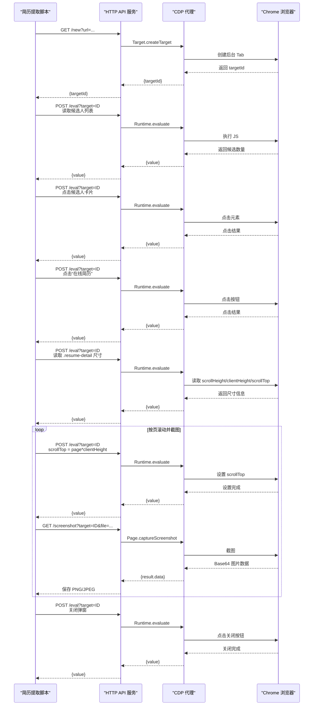
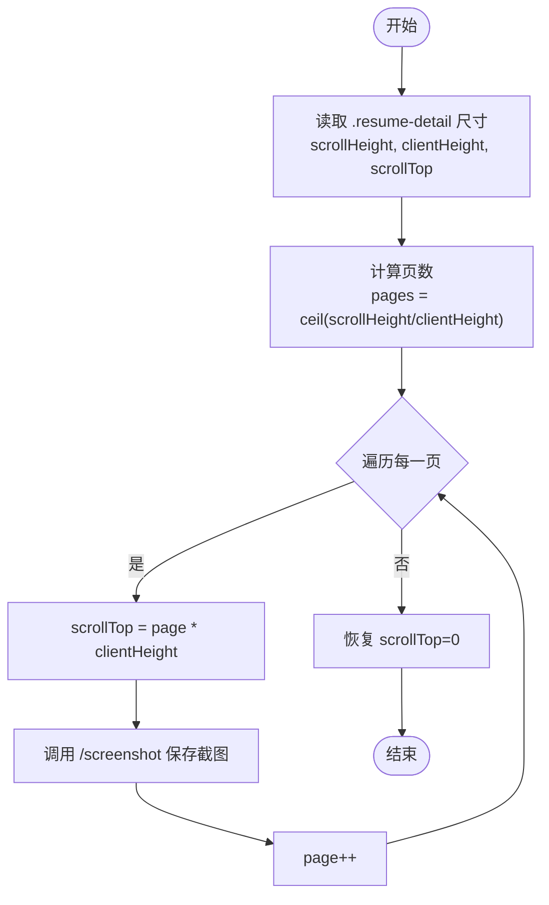
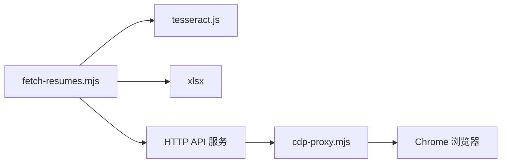

# 截图捕获

<cite>
**本文引用的文件**
- [README.md](file://README.md)
- [cdp-proxy.mjs](file://scripts/cdp-proxy.mjs)
- [fetch-resumes.mjs](file://scripts/fetch-resumes.mjs)
- [cdp-api.md](file://references/cdp-api.md)
- [package.json](file://package.json)
- [scored-candidates.json](file://output-01/scored-candidates.json)
</cite>

## 目录
1. [简介](#简介)
2. [项目结构](#项目结构)
3. [核心组件](#核心组件)
4. [架构总览](#架构总览)
5. [详细组件分析](#详细组件分析)
6. [依赖关系分析](#依赖关系分析)
7. [性能考量](#性能考量)
8. [故障排查指南](#故障排查指南)
9. [结论](#结论)
10. [附录](#附录)

## 简介
本文件围绕“截图捕获”功能展开，结合仓库中的 CDP 截图 API、简历弹窗尺寸检测与多页截图策略、滚动定位算法、页面高度计算与截图坐标系统、截图质量控制、文件命名规范与临时文件管理、不同分辨率适配、截图延迟控制与错误重试机制，以及实际截图示例与性能优化建议进行系统化技术文档化。读者可据此理解如何在真实业务场景（如 Boss 直聘在线简历弹窗）中稳定、高质量地完成多页截图与 OCR 文本提取。

## 项目结构
本项目采用“HTTP API + CDP 代理 + 业务脚本”的分层结构：
- HTTP API 层：通过本地 HTTP 服务暴露 /screenshot、/scroll、/eval 等端点，统一由 CDP 代理转发至 Chrome。
- CDP 代理层：负责与 Chrome DevTools Protocol 通信，封装 Page.captureScreenshot、Runtime.evaluate、Input.dispatchMouseEvent 等协议调用。
- 业务脚本层：以简历提取为例，基于代理 API 实现滚动定位、尺寸检测、多页截图、OCR 识别与结果落盘。

图表来源
- [cdp-proxy.mjs](file://scripts/cdp-proxy.mjs)
- [fetch-resumes.mjs](file://scripts/fetch-resumes.mjs)
- [package.json](file://package.json)

章节来源
- [README.md](file://README.md)
- [cdp-proxy.mjs](file://scripts/cdp-proxy.mjs)
- [fetch-resumes.mjs](file://scripts/fetch-resumes.mjs)
- [cdp-api.md](file://references/cdp-api.md)

## 核心组件
- CDP 截图 API：通过 Page.captureScreenshot 实现页面截图，支持 PNG/JPEG 格式与可选质量参数。
- 滚动与延迟：通过 Runtime.evaluate 执行 window.scrollTo/window.scrollBy 控制滚动，并在滚动后等待 800ms 以触发懒加载。
- 简历弹窗尺寸检测：通过 Runtime.evaluate 读取 .resume-detail 容器的 scrollHeight/clientHeight/scrollTop，计算需截页数。
- 多页截图策略：按 clientHeight 步进 scrollTop，逐页截图，最后恢复滚动位置。
- 截图质量控制：PNG 无损优先，JPEG 用于体积敏感场景；默认 JPEG 质量 80。
- 文件命名与临时文件：输出目录下建立 .temp-screenshots 子目录存放中间截图，最终汇总为纯文本文件。
- 错误重试与健壮性：候选列表滚动采用多次尝试与 sleep 重试；截图与 OCR 失败记录并清理弹窗状态。

章节来源
- [cdp-proxy.mjs](file://scripts/cdp-proxy.mjs)
- [fetch-resumes.mjs](file://scripts/fetch-resumes.mjs)

## 架构总览
下图展示从简历提取脚本到 Chrome 的完整调用链路，包括尺寸检测、滚动定位、多页截图与 OCR 的关键步骤。

图表来源
- [cdp-proxy.mjs](file://scripts/cdp-proxy.mjs)
- [fetch-resumes.mjs](file://scripts/fetch-resumes.mjs)

## 详细组件分析

### CDP 截图 API 与质量控制
- 端点定义：/screenshot?target=ID&file=PATH 或 /screenshot?target=ID&format=jpeg
- 协议调用：Page.captureScreenshot，支持 format=png/jpeg，JPEG 可选 quality=80
- 返回形式：若指定 file，则写入本地文件并返回 {saved: PATH}；否则直接返回 image/* 的二进制数据
- 质量策略：PNG 适合高保真；JPEG 适合体积敏感场景，默认质量 80

章节来源
- [cdp-proxy.mjs](file://scripts/cdp-proxy.mjs)
- [cdp-api.md](file://references/cdp-api.md)

### 简历弹窗尺寸检测与多页截图策略
- 尺寸检测：通过 Runtime.evaluate 读取 .resume-detail 的 scrollHeight、clientHeight、scrollTop
- 页数计算：pages = ceil(scrollHeight / clientHeight)
- 截图策略：按 page*clientHeight 设置 scrollTop，逐页截图，最后恢复 scrollTop=0
- 文件命名：输出目录下 .temp-screenshots 子目录，文件名形如 {name}-{index}-p{page}.png

图表来源
- [fetch-resumes.mjs](file://scripts/fetch-resumes.mjs)

章节来源
- [fetch-resumes.mjs](file://scripts/fetch-resumes.mjs)

### 滚动定位算法与页面高度计算
- 滚动控制：支持 top、bottom、up、down 四种方向；/scroll?target=ID&y=N&direction=down
- 懒加载等待：滚动后等待 800ms，以便长列表懒加载渲染
- 页面高度：通过 Runtime.evaluate 读取 document.body.scrollHeight，用于滚动到底部定位

章节来源
- [cdp-proxy.mjs](file://scripts/cdp-proxy.mjs)
- [cdp-api.md](file://references/cdp-api.md)

### 截图坐标系统与弹窗定位
- 弹窗定位：通过 Runtime.evaluate 获取 .resume-detail 的 clientWidth/clientHeight 与 offset/scroll 偏移，结合滚动位置确定可视区域
- 坐标系统：截图基于页面可视区（viewport）进行，无需手动换算绝对坐标；滚动后按 clientHeight 步进即可覆盖完整内容
- 真实鼠标点击（可选）：/clickAt?target=ID 使用 Input.dispatchMouseEvent，先获取元素中心坐标再模拟鼠标事件，适用于需要触发文件对话框或绕过反自动化检测的场景

章节来源
- [cdp-proxy.mjs](file://scripts/cdp-proxy.mjs)
- [cdp-api.md](file://references/cdp-api.md)

### 截图质量控制、文件命名规范与临时文件管理
- 质量控制：PNG 默认无损；JPEG 默认质量 80；可通过 format=jpeg 控制
- 文件命名：{safeName(name)}-{index}-p{page}.png；safeName 对非法字符进行替换
- 临时文件：.temp-screenshots 目录存放中间截图，最终 OCR 合并为纯文本；可选清理临时目录

章节来源
- [fetch-resumes.mjs](file://scripts/fetch-resumes.mjs)

### 不同分辨率适配与截图延迟控制
- 分辨率适配：CDP 截图基于页面渲染结果，不受设备像素比影响；如需更高分辨率，可在浏览器缩放或页面内调整 CSS 媒体查询
- 截图延迟：滚动后 sleep(800ms) 等待懒加载；截图前可额外 sleep(300ms) 等待 canvas 重绘（简历弹窗场景）

章节来源
- [cdp-proxy.mjs](file://scripts/cdp-proxy.mjs)
- [fetch-resumes.mjs](file://scripts/fetch-resumes.mjs)

### 错误重试机制
- 候选人列表滚动：多次尝试滚动并等待，直到 DOM 中出现目标索引对应的 .geek-item
- 点击重试：第一次点击失败后，sleep(500ms) 再次点击
- 弹窗关闭：失败时尝试关闭可能打开的弹窗，避免后续流程中断
- 健康检查：/health 端点返回连接状态，便于外部监控与自愈

章节来源
- [fetch-resumes.mjs](file://scripts/fetch-resumes.mjs)
- [cdp-proxy.mjs](file://scripts/cdp-proxy.mjs)

### 实际截图示例与 OCR 流程
- 示例流程：打开聊天页 → 等待候选人列表 → 点击候选人 → 点击“在线简历” → 读取尺寸 → 多页截图 → OCR → 保存文本 → 关闭弹窗
- OCR 引擎：使用 tesseract.js，初始化一次 worker，跨所有候选人复用，提升吞吐
- 输出：每个候选人生成独立文本文件，汇总结果写入 fetch-summary.json

章节来源
- [fetch-resumes.mjs](file://scripts/fetch-resumes.mjs)
- [package.json](file://package.json)

## 依赖关系分析
- 依赖 tesseract.js：用于 OCR 识别，初始化一次 worker 并在完成后 terminate
- 依赖 xlsx：用于电子表格处理（仓库中存在依赖声明）
- 业务脚本依赖 HTTP API 服务：通过 /new、/eval、/screenshot 等端点与代理交互

图表来源
- [fetch-resumes.mjs](file://scripts/fetch-resumes.mjs)
- [package.json](file://package.json)
- [cdp-proxy.mjs](file://scripts/cdp-proxy.mjs)

章节来源
- [package.json](file://package.json)
- [fetch-resumes.mjs](file://scripts/fetch-resumes.mjs)

## 性能考量
- 截图并发：当前脚本按候选人顺序串行执行，可考虑在保证弹窗状态稳定的前提下引入轻量并发（注意同一 tab 的滚动与弹窗状态互斥）
- OCR 复用：初始化一次 worker 并在流程末尾 terminate，避免重复初始化开销
- 等待策略：滚动后等待 800ms；canvas 重绘等待 300ms；可根据页面渲染速度适当调整
- 临时文件清理：建议在流程结束后清理 .temp-screenshots，避免磁盘占用

## 故障排查指南
- Chrome 未开启远程调试端口：根据 README 提示在 chrome://inspect/#remote-debugging 启用“允许远程调试”
- attach 失败：确认 targetId 有效且 tab 未关闭；可用 /targets 获取最新列表
- CDP 命令超时：检查 tab 是否卡死或网络阻塞；可重试或刷新页面
- 端口被占用：已有代理实例运行时会健康检查；否则需释放端口或更换端口
- 候选人列表未加载：等待时间不足时可延长等待；滚动后仍无 DOM 时检查选择器
- 简历弹窗未出现：点击“在线简历”后等待 5000ms；若仍无弹窗，检查按钮选择器与页面状态

章节来源
- [cdp-api.md](file://references/cdp-api.md)
- [cdp-proxy.mjs](file://scripts/cdp-proxy.mjs)
- [fetch-resumes.mjs](file://scripts/fetch-resumes.mjs)

## 结论
本项目通过简洁的 HTTP API 与稳健的 CDP 代理，实现了可靠的截图捕获与多页截图策略。结合尺寸检测、滚动定位、延迟控制与错误重试，能够在真实业务场景（如简历弹窗）中稳定产出高质量截图并完成 OCR 文本提取。建议在生产环境中进一步优化并发与资源复用，并完善日志与监控以提升可观测性。

## 附录
- 示例输入：output-01/scored-candidates.json 中包含通过筛选的候选人列表，脚本按 passed=true 的候选人顺序执行
- 健康检查：/health 返回连接状态与会话数，便于运维监控

章节来源
- [scored-candidates.json](file://output-01/scored-candidates.json)
- [cdp-proxy.mjs](file://scripts/cdp-proxy.mjs)