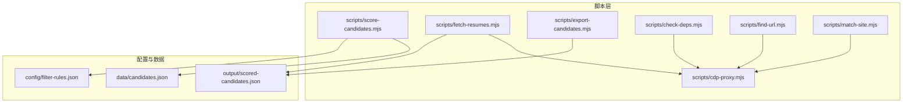
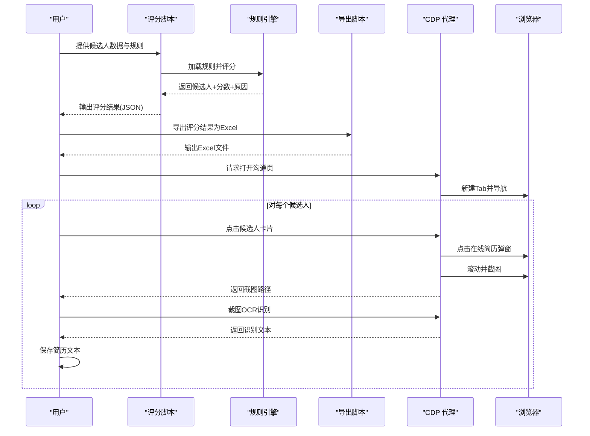
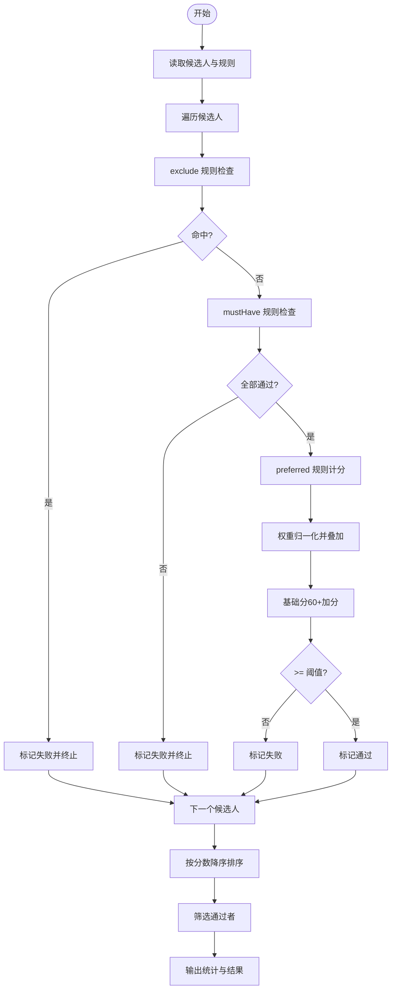
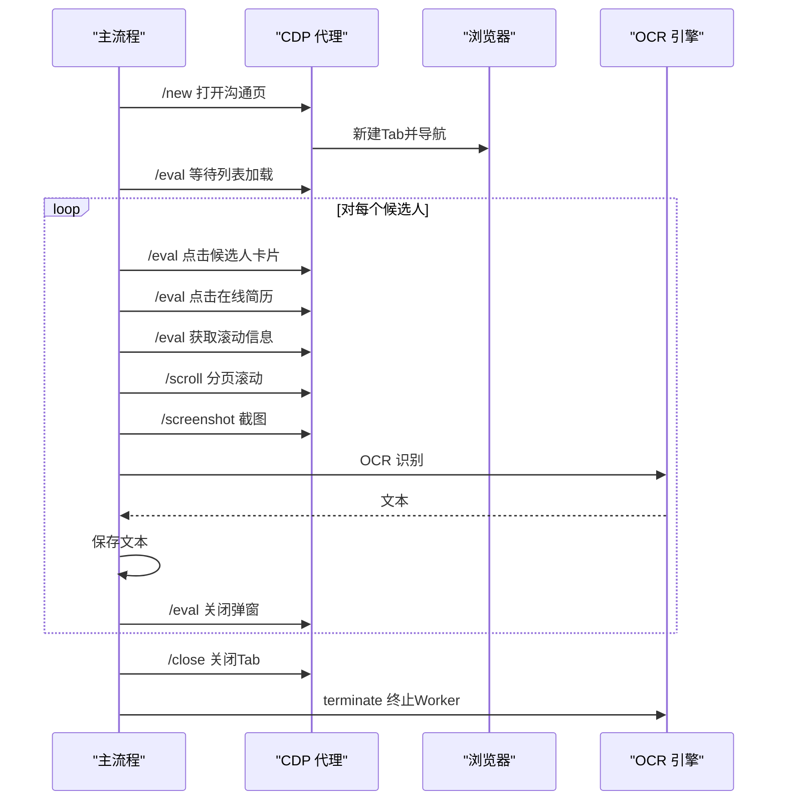
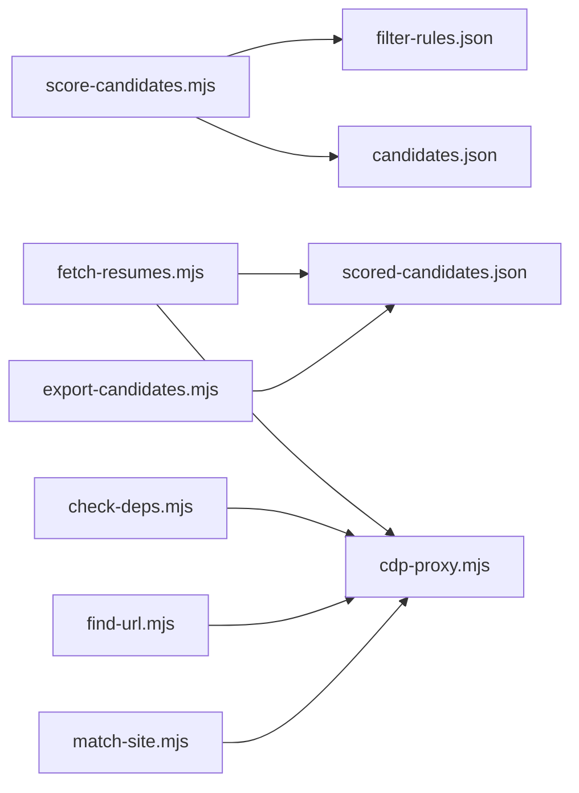

# 批量处理

<cite>
**本文引用的文件**
- [README.md](file://README.md)
- [package.json](file://package.json)
- [scripts/score-candidates.mjs](file://scripts/score-candidates.mjs)
- [scripts/fetch-resumes.mjs](file://scripts/fetch-resumes.mjs)
- [scripts/export-candidates.mjs](file://scripts/export-candidates.mjs)
- [scripts/cdp-proxy.mjs](file://scripts/cdp-proxy.mjs)
- [scripts/check-deps.mjs](file://scripts/check-deps.mjs)
- [scripts/find-url.mjs](file://scripts/find-url.mjs)
- [scripts/match-site.mjs](file://scripts/match-site.mjs)
- [config/filter-rules.json](file://config/filter-rules.json)
- [data/candidates.json](file://data/candidates.json)
- [output/scored-candidates.json](file://output/scored-candidates.json)
</cite>

## 目录
1. [简介](#简介)
2. [项目结构](#项目结构)
3. [核心组件](#核心组件)
4. [架构总览](#架构总览)
5. [详细组件分析](#详细组件分析)
6. [依赖关系分析](#依赖关系分析)
7. [性能考量](#性能考量)
8. [故障排查指南](#故障排查指南)
9. [结论](#结论)
10. [附录](#附录)

## 简介
本项目提供一套面向“候选人数据”的批量处理流水线，涵盖数据评分、简历提取、结果导出与辅助工具。系统以模块化脚本为核心，结合 CDP（Chrome DevTools Protocol）代理实现浏览器自动化，支持规则驱动的评分策略、进度跟踪、错误收集与结果汇总，并提供临时文件清理、内存优化与性能监控策略。文档重点阐述：
- 候选人数据排序策略与并发控制
- 资源管理与生命周期控制
- 进度跟踪、错误收集与结果汇总
- 临时文件清理、内存优化与性能监控
- 容错、重试与恢复机制
- 批量操作示例与性能调优建议

## 项目结构
项目采用脚本驱动的分层设计，核心脚本位于 scripts/，配置与样例数据位于 config/ 与 data/，输出产物位于 output/ 与 output-01/。README.md 提供总体说明与安装指引，package.json 描述依赖。

图表来源
- [scripts/score-candidates.mjs](file://scripts/score-candidates.mjs)
- [scripts/fetch-resumes.mjs](file://scripts/fetch-resumes.mjs)
- [scripts/export-candidates.mjs](file://scripts/export-candidates.mjs)
- [scripts/cdp-proxy.mjs](file://scripts/cdp-proxy.mjs)
- [scripts/check-deps.mjs](file://scripts/check-deps.mjs)
- [scripts/find-url.mjs](file://scripts/find-url.mjs)
- [scripts/match-site.mjs](file://scripts/match-site.mjs)
- [config/filter-rules.json](file://config/filter-rules.json)
- [data/candidates.json](file://data/candidates.json)
- [output/scored-candidates.json](file://output/scored-candidates.json)

章节来源
- [README.md](file://README.md)
- [package.json](file://package.json)

## 核心组件
- 候选人评分与排序：基于规则集对候选人字段进行比较与打分，支持 mustHave、preferred、exclude 三类规则，最终按分数降序排序并筛选通过者。
- 简历提取与 OCR：通过 CDP 代理打开沟通页，定位候选人卡片，点击“在线简历”弹窗，按滚动高度分页截图，使用 OCR 提取文本并落盘。
- 结果导出：将评分后的候选人导出为 Excel，支持自定义字段与列宽适配。
- CDP 代理：提供 HTTP API 控制 Chrome，包括新建/关闭 Tab、导航、点击、滚动、截图、执行 JS 等，内置连接管理与会话隔离。
- 环境检查与依赖：自动探测 Chrome 调试端口、启动/等待 CDP 代理、列出站点经验。
- 辅助工具：本地 Chrome 书签/历史检索、站点经验匹配。

章节来源
- [scripts/score-candidates.mjs](file://scripts/score-candidates.mjs)
- [scripts/fetch-resumes.mjs](file://scripts/fetch-resumes.mjs)
- [scripts/export-candidates.mjs](file://scripts/export-candidates.mjs)
- [scripts/cdp-proxy.mjs](file://scripts/cdp-proxy.mjs)
- [scripts/check-deps.mjs](file://scripts/check-deps.mjs)
- [scripts/find-url.mjs](file://scripts/find-url.mjs)
- [scripts/match-site.mjs](file://scripts/match-site.mjs)

## 架构总览
整体流程从候选人数据输入，经评分与筛选，再到简历提取与导出，全程由 CDP 代理驱动浏览器自动化，配合规则引擎与 OCR 引擎完成批量处理。

图表来源
- [scripts/score-candidates.mjs](file://scripts/score-candidates.mjs)
- [scripts/export-candidates.mjs](file://scripts/export-candidates.mjs)
- [scripts/fetch-resumes.mjs](file://scripts/fetch-resumes.mjs)
- [scripts/cdp-proxy.mjs](file://scripts/cdp-proxy.mjs)

## 详细组件分析

### 候选人评分与排序组件
- 规则解析与字段解析
  - 支持普通字段与数组字段路径（workExperience[].position），数组展开后统一提取。
  - rawVisibleText 特殊解析：从原始可见文本中提取学历与工作年限，作为回退策略。
- 比较与排序
  - 学历与数值（工作年限）采用有序比较，字符串采用本地化比较。
  - mustHave 全部通过后才进入 preferred 计分；preferred 权重归一化后叠加，基础分为 60，满分 100。
  - threshold 决策阈值默认 60，可通过规则配置调整。
- 排序与筛选
  - 按 score 降序排序，仅保留 passed=true 的候选人。
- 输出统计
  - 输出包含规则名称、版本、输入文件、总数、通过数、阈值与候选人列表。

图表来源
- [scripts/score-candidates.mjs](file://scripts/score-candidates.mjs)
- [config/filter-rules.json](file://config/filter-rules.json)

章节来源
- [scripts/score-candidates.mjs](file://scripts/score-candidates.mjs)
- [config/filter-rules.json](file://config/filter-rules.json)

### 简历提取与 OCR 组件
- CDP 代理调用
  - 通过 HTTP API 与本地 Chrome 通信，支持 /new、/eval、/click、/clickAt、/setFiles、/scroll、/screenshot、/close 等端点。
  - 代理内置连接管理、会话 attach、端口探测拦截与超时控制。
- 浏览器自动化流程
  - 打开沟通页，等待候选人列表加载，按 index 排序减少滚动切换。
  - 滚动至可见区域，点击候选人卡片，再点击“在线简历”弹窗。
  - 获取弹窗滚动信息，按可视高度分页滚动并截图，OCR 识别后拼接文本。
  - 成功/失败分别记录，最后关闭 Tab 并终止 OCR Worker。
- 临时文件与资源管理
  - 截图保存在 .temp-screenshots 目录，结束后可选择清理。
  - OCR Worker 复用，避免重复初始化带来的内存与时间开销。

图表来源
- [scripts/fetch-resumes.mjs](file://scripts/fetch-resumes.mjs)
- [scripts/cdp-proxy.mjs](file://scripts/cdp-proxy.mjs)

章节来源
- [scripts/fetch-resumes.mjs](file://scripts/fetch-resumes.mjs)
- [scripts/cdp-proxy.mjs](file://scripts/cdp-proxy.mjs)

### 结果导出组件
- 字段映射与提取
  - 预定义字段配置，支持自定义字段顺序与输出。
  - 推荐理由仅提取 type=preferred 且 result=pass 的规则。
- Excel 输出
  - 使用 xlsx 库生成工作簿，自动计算列宽（考虑中英文字符宽度差异）。
  - 输出包含统计信息（规则名、版本、通过率等）。

章节来源
- [scripts/export-candidates.mjs](file://scripts/export-candidates.mjs)

### CDP 代理组件
- 连接与会话
  - 自动发现 Chrome 调试端口，支持 DevToolsActivePort 与常见端口回退。
  - Target.attachToTarget + Session 管理，启用 Fetch 域拦截页面对调试端口的探测请求。
- 健康检查与端口占用检测
  - /health 返回连接状态、会话数与 Chrome 端口。
  - 启动前检查端口可用性，避免冲突。
- 超时与错误处理
  - CDP 命令超时控制（默认 30s），连接错误与断开自动清理缓存。

章节来源
- [scripts/cdp-proxy.mjs](file://scripts/cdp-proxy.mjs)

### 环境检查与辅助工具
- 环境检查
  - 检测 Node.js 版本、Chrome 调试端口、启动/等待 CDP 代理，列出站点经验。
- 本地 Chrome 检索
  - 从书签/历史检索 URL，支持关键词、时间窗、排序与多 Profile。
- 站点经验匹配
  - 根据用户输入匹配站点经验文件，输出匹配到的经验正文。

章节来源
- [scripts/check-deps.mjs](file://scripts/check-deps.mjs)
- [scripts/find-url.mjs](file://scripts/find-url.mjs)
- [scripts/match-site.mjs](file://scripts/match-site.mjs)

## 依赖关系分析
- 脚本间依赖
  - fetch-resumes.mjs 依赖 scored-candidates.json 与 CDP 代理。
  - export-candidates.mjs 依赖 scored-candidates.json。
  - check-deps.mjs 依赖 cdp-proxy.mjs。
- 外部依赖
  - tesseract.js：OCR 识别。
  - xlsx：Excel 导出。
- 数据依赖
  - candidates.json 为输入样本，scored-candidates.json 为中间/最终输出。

图表来源
- [scripts/score-candidates.mjs](file://scripts/score-candidates.mjs)
- [scripts/fetch-resumes.mjs](file://scripts/fetch-resumes.mjs)
- [scripts/export-candidates.mjs](file://scripts/export-candidates.mjs)
- [scripts/cdp-proxy.mjs](file://scripts/cdp-proxy.mjs)
- [scripts/check-deps.mjs](file://scripts/check-deps.mjs)
- [scripts/find-url.mjs](file://scripts/find-url.mjs)
- [scripts/match-site.mjs](file://scripts/match-site.mjs)
- [config/filter-rules.json](file://config/filter-rules.json)
- [data/candidates.json](file://data/candidates.json)
- [output/scored-candidates.json](file://output/scored-candidates.json)

章节来源
- [package.json](file://package.json)

## 性能考量
- 并发与批处理
  - 当前脚本为顺序执行，建议在外部批处理层引入队列与并发控制（例如按候选人数量分片，每片独立进程，避免浏览器资源争用）。
- 资源管理
  - OCR Worker 复用，避免频繁初始化；截图临时目录按需清理。
  - CDP 代理单实例运行，Tab 级隔离，避免跨任务干扰。
- I/O 与内存
  - 大文件写入与临时文件清理，建议在批处理层统一调度，避免磁盘压力。
  - 评分阶段使用 JSON 解析与数组排序，建议在大规模数据时考虑分页读取与流式处理。
- 网络与超时
  - CDP 命令与 HTTP 请求均设置超时，建议根据目标站点响应时间调整超时阈值。
- 监控与日志
  - 建议在批处理层记录每个候选人的耗时、成功率与错误码，便于性能分析与告警。

[本节为通用性能指导，不直接分析具体文件]

## 故障排查指南
- CDP 代理连接失败
  - 确认 Chrome 已开启远程调试端口，检查 /health 状态与端口占用。
  - 若首次连接弹出授权对话框，等待授权后重试。
- 候选人列表加载失败
  - 等待时间不足或页面未完全渲染，适当延长等待时间或增加重试。
- 在线简历弹窗未出现
  - 某些候选人可能未上传在线简历，脚本会抛出明确错误；可在批处理层跳过或记录。
- OCR 识别异常
  - 图像质量不佳或语言模型未正确初始化，建议检查 tesseract.js 语言包与图像清晰度。
- Excel 导出失败
  - 缺少 xlsx 依赖，安装后重试；或检查字段映射与数据完整性。
- 临时文件未清理
  - 脚本默认保留 .temp-screenshots，可在批处理层统一清理。

章节来源
- [scripts/cdp-proxy.mjs](file://scripts/cdp-proxy.mjs)
- [scripts/fetch-resumes.mjs](file://scripts/fetch-resumes.mjs)
- [scripts/export-candidates.mjs](file://scripts/export-candidates.mjs)
- [scripts/check-deps.mjs](file://scripts/check-deps.mjs)

## 结论
本批量处理系统以规则驱动的评分与 CDP 自动化为核心，提供了从候选人数据到简历提取与导出的完整链路。通过合理的资源管理、错误收集与结果汇总，系统具备良好的可维护性与扩展性。建议在生产环境中引入外部批处理层以实现更精细的并发控制、资源调度与监控告警。

[本节为总结性内容，不直接分析具体文件]

## 附录

### 批量操作示例与最佳实践
- 示例流程
  - 输入：data/candidates.json
  - 步骤：运行评分脚本 → 运行简历提取脚本 → 运行导出脚本
  - 输出：output/scored-candidates.json 与 candidates.xlsx
- 最佳实践
  - 使用规则文件集中管理评分逻辑，便于版本演进与复用。
  - 在外部批处理层对候选人分片并行处理，避免浏览器资源瓶颈。
  - 建立统一的日志与指标采集，记录每个环节的耗时、成功率与错误类型。
  - 对临时文件与 OCR 资源建立清理策略，定期回收磁盘空间。

章节来源
- [scripts/score-candidates.mjs](file://scripts/score-candidates.mjs)
- [scripts/fetch-resumes.mjs](file://scripts/fetch-resumes.mjs)
- [scripts/export-candidates.mjs](file://scripts/export-candidates.mjs)
- [config/filter-rules.json](file://config/filter-rules.json)
- [data/candidates.json](file://data/candidates.json)
- [output/scored-candidates.json](file://output/scored-candidates.json)