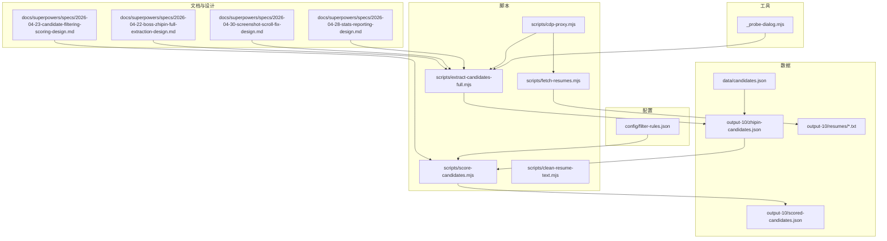
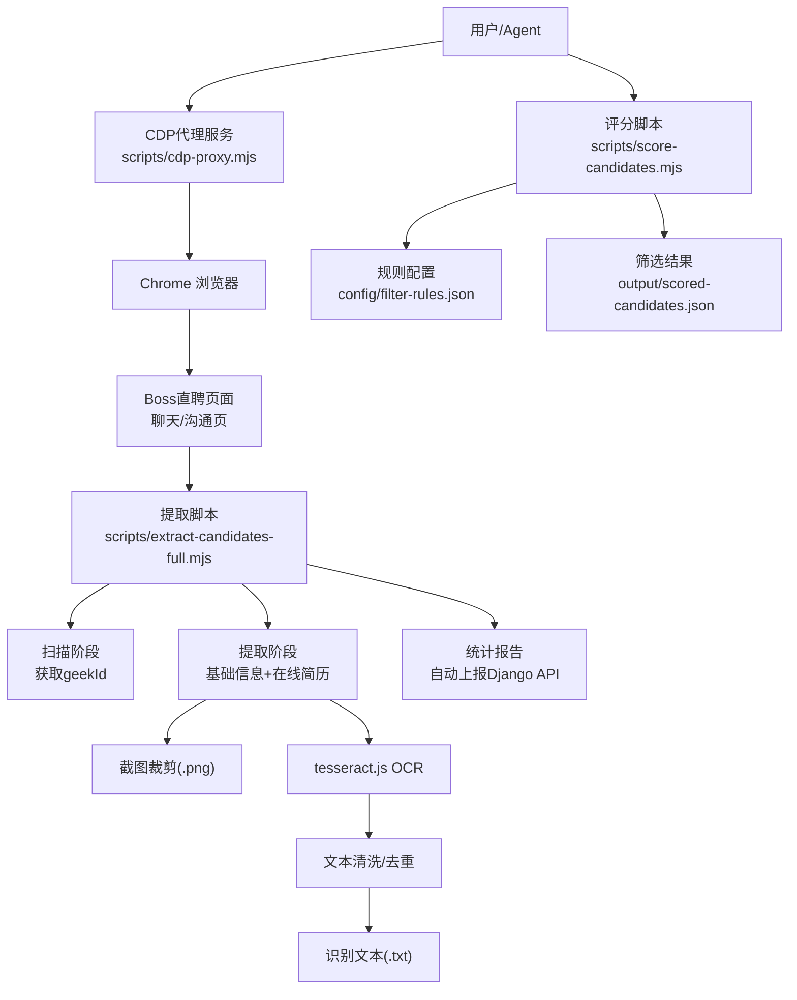
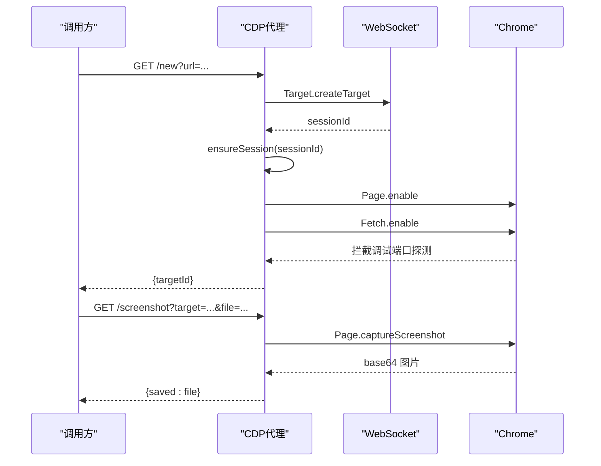
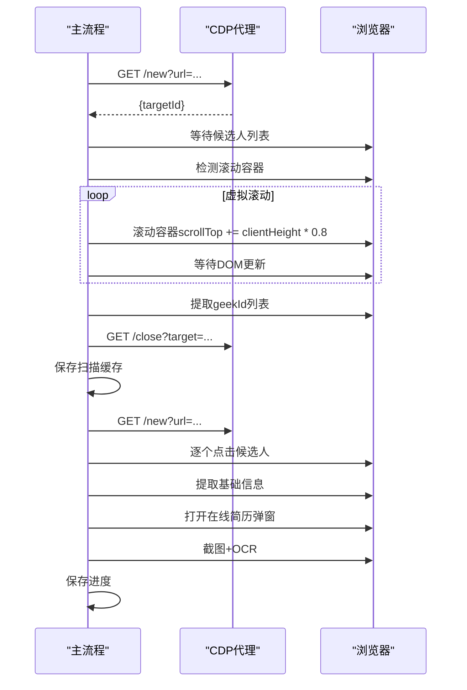
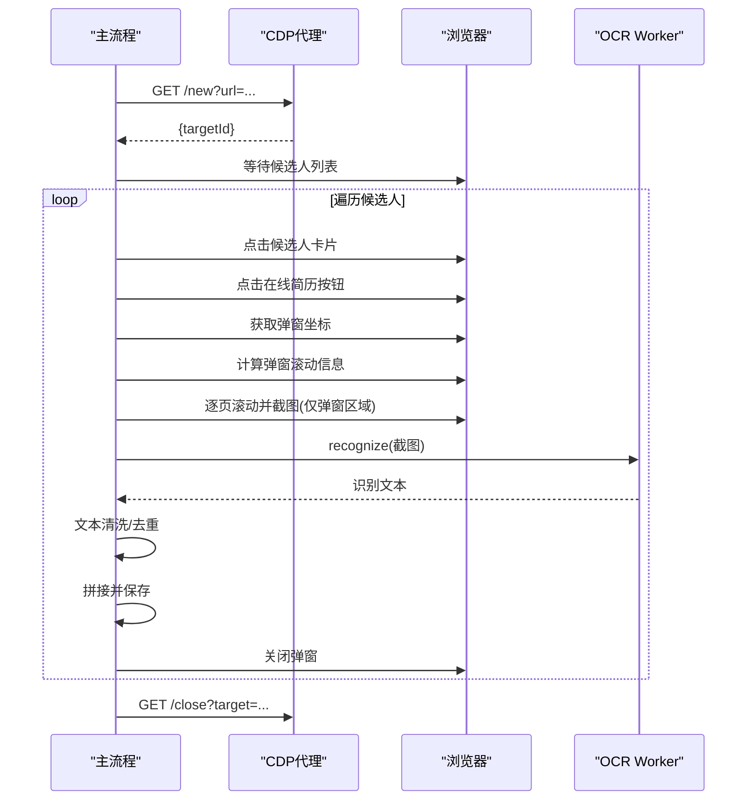
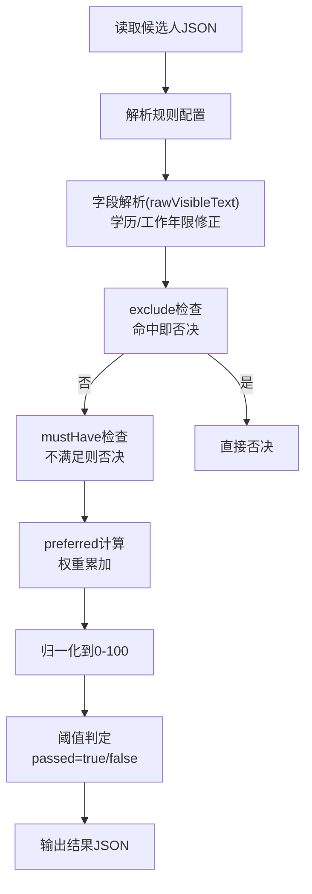
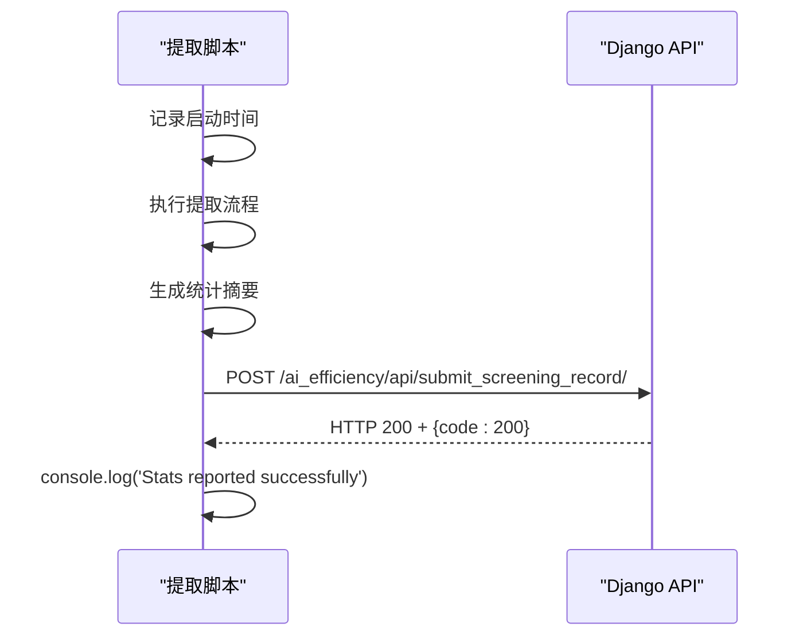
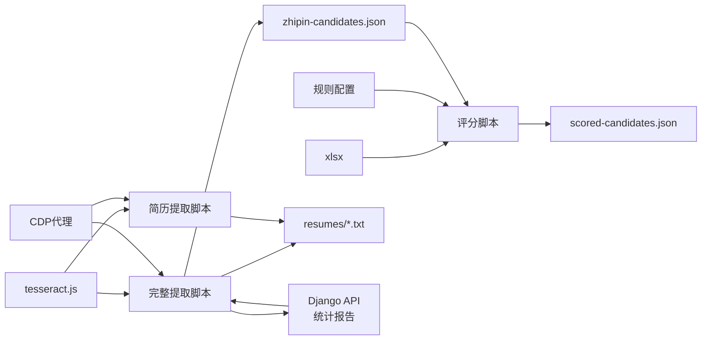

# 简历提取系统

<cite>
**本文引用的文件**
- [README.md](file://README.md)
- [package.json](file://package.json)
- [scripts/cdp-proxy.mjs](file://scripts/cdp-proxy.mjs)
- [scripts/fetch-resumes.mjs](file://scripts/fetch-resumes.mjs)
- [scripts/extract-candidates-full.mjs](file://scripts/extract-candidates-full.mjs)
- [scripts/score-candidates.mjs](file://scripts/score-candidates.mjs)
- [scripts/clean-resume-text.mjs](file://scripts/clean-resume-text.mjs)
- [config/filter-rules.json](file://config/filter-rules.json)
- [data/candidates.json](file://data/candidates.json)
- [output-01/zhipin-candidates.json](file://output-01/zhipin-candidates.json)
- [output-01/scored-candidates.json](file://output-01/scored-candidates.json)
- [output-10/zhipin-candidates.json](file://output-10/zhipin-candidates.json)
- [output-10/resumes/伍楚南-_538598160.txt](file://output-10/resumes/伍楚南-_538598160.txt)
- [docs/superpowers/specs/2026-04-22-boss-zhipin-full-extraction-design.md](file://docs/superpowers/specs/2026-04-22-boss-zhipin-full-extraction-design.md)
- [docs/superpowers/specs/2026-04-23-candidate-filtering-scoring-design.md](file://docs/superpowers/specs/2026-04-23-candidate-filtering-scoring-design.md)
- [docs/superpowers/specs/2026-04-30-screenshot-scroll-fix-design.md](file://docs/superpowers/specs/2026-04-30-screenshot-scroll-fix-design.md)
- [docs/superpowers/specs/2026-04-28-stats-reporting-design.md](file://docs/superpowers/specs/2026-04-28-stats-reporting-design.md)
- [_probe-dialog.mjs](file://_probe-dialog.mjs)
</cite>

## 更新摘要
**变更内容**
- 新增完整的两阶段提取流程：扫描阶段和提取阶段
- 实现虚拟滚动支持，解决候选人列表滚动加载问题
- 增加截图区域裁剪功能，仅截取弹窗区域
- 优化OCR处理流程，包含文本清洗和去重
- 改进滚动检测机制，支持iframe+canvas和DOM两种渲染模式
- 增强错误处理和重试逻辑
- **新增统计报告功能**：自动上报提取统计数据到Django API
- **增强OCR处理能力**：改进文本清洗算法和相邻页去重逻辑
- **改进弹窗检测和截图捕获逻辑**：增强弹窗尺寸稳定性检测和截图区域计算

## 目录
1. [简介](#简介)
2. [项目结构](#项目结构)
3. [核心组件](#核心组件)
4. [架构总览](#架构总览)
5. [详细组件分析](#详细组件分析)
6. [依赖关系分析](#依赖关系分析)
7. [性能考虑](#性能考虑)
8. [故障排除指南](#故障排除指南)
9. [结论](#结论)
10. [附录](#附录)

## 简介
本系统围绕"简历提取"这一核心目标，构建了从候选人数据采集、筛选评分到在线简历识别与OCR提取的完整流水线。系统通过CDP代理服务与浏览器自动化结合，实现对Boss直聘在线简历弹窗的稳定操作；借助tesseract.js进行截图OCR识别，并将识别结果持久化为文本文件，便于后续处理与分析。系统同时提供批量处理能力、错误处理与重试机制，以及可配置的筛选评分模块，支持多场景下的候选人管理与决策。

**更新** 新增两阶段提取流程，包括候选人扫描和简历提取两个阶段，支持虚拟滚动和截图区域裁剪功能。**新增统计报告功能**，自动上报提取统计数据到Django API，**增强OCR处理能力**，改进文本清洗和去重算法，**改进弹窗检测逻辑**，提升截图捕获的稳定性。

## 项目结构
系统采用脚本驱动的模块化组织方式，核心文件分布如下：
- 文档与设计：位于 docs/superpowers 下，包含站点提取设计、评分设计、统计报告设计等规范性文档
- 配置：config/filter-rules.json 定义筛选评分规则
- 数据：data/candidates.json 为示例候选人数据；output-10 下存放中间与最终产物
- 脚本：scripts/ 下包含CDP代理、简历提取、评分、文本清洗等核心脚本
- 工具：_probe-dialog.mjs 用于弹窗结构探测

**图表来源**
- [scripts/cdp-proxy.mjs:1-611](file://scripts/cdp-proxy.mjs#L1-L611)
- [scripts/extract-candidates-full.mjs:1-1464](file://scripts/extract-candidates-full.mjs#L1-L1464)
- [scripts/fetch-resumes.mjs:1-457](file://scripts/fetch-resumes.mjs#L1-L457)
- [scripts/score-candidates.mjs:1-406](file://scripts/score-candidates.mjs#L1-L406)
- [scripts/clean-resume-text.mjs:1-122](file://scripts/clean-resume-text.mjs#L1-L122)
- [config/filter-rules.json:1-41](file://config/filter-rules.json#L1-L41)
- [docs/superpowers/specs/2026-04-22-boss-zhipin-full-extraction-design.md:1-315](file://docs/superpowers/specs/2026-04-22-boss-zhipin-full-extraction-design.md#L1-L315)
- [docs/superpowers/specs/2026-04-23-candidate-filtering-scoring-design.md:1-270](file://docs/superpowers/specs/2026-04-23-candidate-filtering-scoring-design.md#L1-L270)
- [docs/superpowers/specs/2026-04-30-screenshot-scroll-fix-design.md:1-119](file://docs/superpowers/specs/2026-04-30-screenshot-scroll-fix-design.md#L1-L119)
- [docs/superpowers/specs/2026-04-28-stats-reporting-design.md:1-88](file://docs/superpowers/specs/2026-04-28-stats-reporting-design.md#L1-L88)
- [_probe-dialog.mjs:1-136](file://_probe-dialog.mjs#L1-L136)

**章节来源**
- [README.md:1-168](file://README.md#L1-L168)
- [package.json:1-11](file://package.json#L1-L11)

## 核心组件
- CDP代理服务：提供HTTP API操控Chrome，负责页面导航、截图、点击、滚动、JS执行等操作，屏蔽底层CDP复杂性
- **两阶段提取系统**：第一阶段扫描候选人列表获取geekId，第二阶段逐个提取基础信息和在线简历
- **虚拟滚动支持**：自动检测和处理虚拟滚动列表，确保候选人元素正确加载
- **截图区域裁剪**：仅截取简历弹窗区域，避免侧边栏和其他元素干扰
- **OCR引擎**：使用tesseract.js，支持中英文混合识别，包含文本清洗和去重功能
- **评分与筛选脚本**：读取候选人JSON，基于规则配置进行评分与筛选，输出通过的候选人集合
- **统计报告系统**：自动上报提取统计数据到Django API，支持成功、失败、部分成功三种状态
- **增强OCR处理**：改进的文本清洗算法和相邻页去重逻辑，提升识别准确率

**章节来源**
- [scripts/cdp-proxy.mjs:287-552](file://scripts/cdp-proxy.mjs#L287-L552)
- [scripts/extract-candidates-full.mjs:1096-1198](file://scripts/extract-candidates-full.mjs#L1096-L1198)
- [scripts/fetch-resumes.mjs:255-286](file://scripts/fetch-resumes.mjs#L255-L286)
- [scripts/score-candidates.mjs:342-389](file://scripts/score-candidates.mjs#L342-L389)
- [scripts/extract-candidates-full.mjs:106-134](file://scripts/extract-candidates-full.mjs#L106-L134)
- [scripts/extract-candidates-full.mjs:904-1011](file://scripts/extract-candidates-full.mjs#L904-L1011)
- [package.json:6-9](file://package.json#L6-L9)

## 架构总览
系统整体由"浏览器自动化 + OCR识别 + 数据处理 + 统计上报"四层组成，CDP代理作为桥梁连接浏览器与业务脚本。新增两阶段提取流程，第一阶段扫描候选人列表，第二阶段提取详细信息。**新增统计报告层**，在脚本完成后自动上报提取统计数据。

**图表来源**
- [scripts/cdp-proxy.mjs:287-552](file://scripts/cdp-proxy.mjs#L287-L552)
- [scripts/extract-candidates-full.mjs:1096-1198](file://scripts/extract-candidates-full.mjs#L1096-L1198)
- [scripts/fetch-resumes.mjs:255-286](file://scripts/fetch-resumes.mjs#L255-L286)
- [scripts/score-candidates.mjs:342-389](file://scripts/score-candidates.mjs#L342-L389)
- [config/filter-rules.json:1-41](file://config/filter-rules.json#L1-L41)
- [scripts/extract-candidates-full.mjs:106-134](file://scripts/extract-candidates-full.mjs#L106-L134)

## 详细组件分析

### CDP代理服务（CDP Proxy）
- 功能概述
  - 通过HTTP API封装Chrome CDP，提供新建/关闭标签、导航、后退、JS执行、点击、滚动、截图等能力
  - 自动发现Chrome调试端口，支持不同平台的DevToolsActivePort文件与常见端口扫描
  - 对页面的调试端口探测请求进行拦截，降低风控风险
- 关键流程
  - 连接建立：自动发现端口并建立WebSocket连接，维护会话映射
  - 请求路由：根据路径分发至相应CDP域（如Page、Runtime、Input、DOM、Fetch等）
  - 健康检查：/health端点返回连接状态、会话数、端口等信息
- 错误处理
  - 连接失败、超时、端口占用等均通过HTTP错误响应返回
  - 未捕获异常与未处理拒绝在进程级别进行日志记录

**图表来源**
- [scripts/cdp-proxy.mjs:306-345](file://scripts/cdp-proxy.mjs#L306-L345)
- [scripts/cdp-proxy.mjs:502-517](file://scripts/cdp-proxy.mjs#L502-L517)

**章节来源**
- [scripts/cdp-proxy.mjs:1-611](file://scripts/cdp-proxy.mjs#L1-L611)

### 两阶段提取系统（完整候选人提取）
- 功能概述
  - **第一阶段扫描**：扫描候选人列表获取geekId，支持虚拟滚动和增量扫描
  - **第二阶段提取**：逐个点击候选人卡片提取基础信息和在线简历
  - 支持断点续传，自动恢复之前的提取进度
- 关键流程
  - **扫描阶段**：创建后台tab，等待候选人列表加载，滚动容器检测候选人数
  - **提取阶段**：按geekId精准点击，提取基础信息，打开在线简历弹窗
  - **进度管理**：保存扫描缓存和提取进度，支持恢复模式
- 虚拟滚动支持
  - 自动检测`.chat-record`、`.user-list`、`.geek-list`等容器
  - 渐进式滚动，每次滚动容器高度的80%
  - 等待DOM更新，确保新元素加载完成

**图表来源**
- [scripts/extract-candidates-full.mjs:1096-1198](file://scripts/extract-candidates-full.mjs#L1096-L1198)
- [scripts/extract-candidates-full.mjs:1162-1344](file://scripts/extract-candidates-full.mjs#L1162-L1344)

**章节来源**
- [scripts/extract-candidates-full.mjs:1080-1394](file://scripts/extract-candidates-full.mjs#L1080-L1394)

### 在线简历提取（简历提取脚本）
- 功能概述
  - 从评分后的候选人列表中，逐个打开Boss直聘沟通页，点击候选人卡片，打开"在线简历"弹窗
  - **截图区域裁剪**：仅截取弹窗区域，避免侧边栏和其他元素干扰
  - **两阶段提取**：先计算弹窗滚动信息，再按页截图，最后OCR识别
  - 支持重试与错误恢复，失败项单独记录
- 关键流程
  - 页面准备：创建后台tab，等待候选人列表加载
  - 候选人定位：滚动至目标index，点击候选人卡片
  - 弹窗打开：查找"在线简历"按钮并点击，等待弹窗出现
  - **截图裁剪**：获取弹窗坐标，仅截取弹窗区域
  - 截图与OCR：计算页数，逐页滚动并截图，调用worker识别
  - 结果保存：按候选人名与索引命名，输出摘要与统计
- OCR集成
  - 初始化tesseract.js worker，使用中英简体+英文语言包
  - 逐页识别，拼接文本，保存为UTF-8文本文件
- 错误处理与重试
  - 点击失败时先等待再重试一次
  - 弹窗未出现时循环等待并超时
  - 识别失败时记录错误并跳过该候选人

**图表来源**
- [scripts/fetch-resumes.mjs:287-350](file://scripts/fetch-resumes.mjs#L287-L350)
- [scripts/fetch-resumes.mjs:314-346](file://scripts/fetch-resumes.mjs#L314-L346)

**章节来源**
- [scripts/fetch-resumes.mjs:1-457](file://scripts/fetch-resumes.mjs#L1-L457)
- [package.json:6-9](file://package.json#L6-L9)

### OCR文本清洗与去重
- 功能概述
  - **文本清洗**：去除OCR识别中的常见错误，如多余的空格、标点符号格式化
  - **相邻页去重**：移除相邻页面间的重复内容，避免重复文本
  - **错字修正**：基于常见OCR错误字典进行自动修正
- 清洗规则
  - 全角标点规范化，去除中文字符间的多余空格
  - 中文与标点符号之间的空格处理
  - 多个空格/制表符压缩为单个空格
  - 压缩连续空行，去除孤立单字符行
  - 常见错字自动修正（如"沟 通"→"沟通"）
- **增强算法**
  - 改进的CJK字符间空格处理，执行多次确保清理
  - 更精确的相邻页重叠检测和去重逻辑
  - 增强的错字修正字典

**章节来源**
- [scripts/extract-candidates-full.mjs:904-1011](file://scripts/extract-candidates-full.mjs#L904-L1011)
- [scripts/clean-resume-text.mjs:1-122](file://scripts/clean-resume-text.mjs#L1-L122)

### 候选人筛选与评分（评分脚本）
- 功能概述
  - 读取候选人JSON，基于规则配置进行评分与筛选，输出通过的候选人集合
  - 支持mustHave门槛、preferred加分、exclude否决、阈值判定
- 字段解析与偏移修正
  - 由于在线状态标签可能导致字段偏移，评分脚本从rawVisibleText中提取学历与工作年限，保证准确性
- 规则与比较
  - 支持equals、contains、in、>=、>、<=、<、regex、exists等操作符
  - 数组字段支持workExperience[].position等路径展开匹配
- 输出结构
  - 保留原始候选人数据，candidates按score降序排列，输出包含过滤名称、版本、阈值、统计等元信息

**图表来源**
- [scripts/score-candidates.mjs:229-340](file://scripts/score-candidates.mjs#L229-L340)
- [docs/superpowers/specs/2026-04-23-candidate-filtering-scoring-design.md:140-179](file://docs/superpowers/specs/2026-04-23-candidate-filtering-scoring-design.md#L140-L179)

**章节来源**
- [scripts/score-candidates.mjs:1-406](file://scripts/score-candidates.mjs#L1-L406)
- [config/filter-rules.json:1-41](file://config/filter-rules.json#L1-L41)
- [docs/superpowers/specs/2026-04-23-candidate-filtering-scoring-design.md:1-270](file://docs/superpowers/specs/2026-04-23-candidate-filtering-scoring-design.md#L1-L270)

### 统计报告系统
- 功能概述
  - **自动上报**：脚本完成后自动上报提取统计数据到Django API
  - **多种状态**：支持success、error、partial三种状态上报
  - **零依赖**：使用Node.js原生fetch和AbortController，无需额外依赖
  - **失败静默**：上报失败不影响脚本正常退出
- 关键特性
  - **超时控制**：3秒超时防止阻塞，超时后静默跳过
  - **本地时间转换**：将ISO时间转换为本地时间字符串，避免数据库兼容问题
  - **环境变量支持**：可通过STATS_API_URL环境变量覆盖API地址
  - **错误处理**：网络错误、服务器错误均通过console.warn输出警告
- 上报数据
  - resume_count：成功提取的简历数量
  - start_time：脚本启动时间（本地时间字符串）
  - status：提取状态（success/error/partial）

**图表来源**
- [scripts/extract-candidates-full.mjs:106-134](file://scripts/extract-candidates-full.mjs#L106-L134)
- [docs/superpowers/specs/2026-04-28-stats-reporting-design.md:29-49](file://docs/superpowers/specs/2026-04-28-stats-reporting-design.md#L29-L49)

**章节来源**
- [scripts/extract-candidates-full.mjs:106-134](file://scripts/extract-candidates-full.mjs#L106-L134)
- [docs/superpowers/specs/2026-04-28-stats-reporting-design.md:1-88](file://docs/superpowers/specs/2026-04-28-stats-reporting-design.md#L1-L88)

### 弹窗检测与截图捕获增强
- 功能概述
  - **增强弹窗检测**：改进弹窗尺寸稳定性检测，避免Boss直聘窄版渲染导致的超时
  - **智能截图区域计算**：优先使用iframe实际宽度，确保截图区域准确
  - **多模式滚动支持**：支持iframe+canvas和DOM两种渲染模式
- 关键改进
  - **尺寸稳定性检测**：连续两次尺寸相等才认为弹窗稳定，减少误判
  - **iframe优先策略**：当iframe宽度≥300px时，优先使用iframe宽度而非容器宽度
  - **动态等待时间**：根据弹窗类型动态调整等待时间（iframe+canvas: 2000ms，其他: 4000ms）
  - **降级策略**：多层降级确保在各种情况下都能获取正确的滚动信息
- 检测逻辑
  - 首先检测.resize-detail容器，不存在则回退到.boss-popup__wrapper或.dialog-wrap
  - 优先使用iframe的getBoundingClientRect()获取坐标
  - 当iframe宽度有效时，使用iframe的x,y坐标和iframe宽度，detail的高度作为可视区高度

**章节来源**
- [scripts/extract-candidates-full.mjs:560-759](file://scripts/extract-candidates-full.mjs#L560-L759)
- [_probe-dialog.mjs:1-136](file://_probe-dialog.mjs#L1-L136)

### 数据与中间产物
- 输入数据
  - data/candidates.json：示例候选人数据，包含基础字段
- 中间产物
  - output-10/zhipin-candidates.json：全量采集后的候选人JSON（包含basicInfo、workExperience、educationExperience、positionInfo、resumeText等）
  - output-10/scored-candidates.json：评分筛选后的候选人JSON（包含score、passed、reasons、recommendationLevel等）
  - output-10/resumes：保存识别后的文本文件（按候选人名-geekId命名）
  - **统计报告**：自动上报的提取统计数据（通过Django API接收）
- 输出目录
  - output/resumes：保存识别后的文本文件（按候选人名-索引命名）

**章节来源**
- [data/candidates.json:1-49](file://data/candidates.json#L1-L49)
- [output-10/zhipin-candidates.json:1-1796](file://output-10/zhipin-candidates.json#L1-L1796)
- [output-10/scored-candidates.json:1-800](file://output-10/scored-candidates.json#L1-L800)

## 依赖关系分析
- 外部依赖
  - tesseract.js：OCR识别引擎，用于将截图转为文本
  - xlsx：Excel处理（在依赖声明中，但当前脚本未直接使用）
- 内部依赖
  - CDP代理为提取脚本提供浏览器自动化能力
  - 规则配置为评分脚本提供筛选依据
  - 中间产物在流水线中作为输入传递
  - **统计报告API**：Django服务器接收提取统计数据

**图表来源**
- [package.json:6-9](file://package.json#L6-L9)
- [scripts/extract-candidates-full.mjs:1189-1193](file://scripts/extract-candidates-full.mjs#L1189-L1193)
- [scripts/fetch-resumes.mjs:283-285](file://scripts/fetch-resumes.mjs#L283-L285)
- [scripts/score-candidates.mjs:347-354](file://scripts/score-candidates.mjs#L347-L354)
- [config/filter-rules.json:1-41](file://config/filter-rules.json#L1-L41)

**章节来源**
- [package.json:1-11](file://package.json#L1-L11)

## 性能考虑
- OCR性能
  - 复用tesseract.js worker，避免频繁初始化带来的开销
  - 识别顺序为"逐页识别+拼接"，建议控制截图尺寸与质量平衡识别速度与精度
  - **增强OCR优化**：改进的去重算法减少重复识别，提升整体效率
- 浏览器自动化
  - 通过滚动高度与可视高度计算页数，避免不必要的截图
  - 等待与重试策略在稳定性与性能间取得平衡
  - **虚拟滚动优化**：渐进式滚动，每次滚动容器高度的80%，减少DOM更新压力
  - **弹窗检测优化**：智能尺寸稳定性检测，避免不必要的等待
- 批处理与并发
  - 当前脚本为顺序处理，若需提升吞吐，可在候选人维度引入并行（注意CDP会话与资源竞争）
- I/O与磁盘
  - 临时截图目录建议清理，避免磁盘占用
  - 输出文本文件按UTF-8编码，确保跨平台一致性
  - **统计报告异步**：使用AbortController避免阻塞主流程
- **截图优化**
  - **区域裁剪**：仅截取弹窗区域，减少文件大小和处理时间
  - **步进优化**：使用75%步进（25%重叠），确保不遗漏内容的同时减少截图数量
  - **智能降级**：多层降级策略确保在各种渲染模式下都能获得准确的截图区域

## 故障排除指南
- CDP代理连接失败
  - 确认Chrome已开启远程调试端口，或使用DevToolsActivePort文件自动发现
  - 检查端口占用与防火墙设置
  - 使用/health端点验证代理状态
- 页面加载与元素定位失败
  - 等待时间不足：适当延长等待时间或增加重试次数
  - 选择器失效：根据站点DOM变化调整选择器
  - **虚拟滚动问题**：确认滚动容器检测逻辑，检查`.chat-record`、`.user-list`、`.geek-list`等选择器
- OCR识别失败
  - 截图质量差：提高截图分辨率或调整滚动步长
  - 语言模型不匹配：确认语言包配置与文本语言
  - **区域裁剪问题**：检查弹窗坐标获取逻辑，确保裁剪区域正确
  - **增强OCR问题**：检查cleanOcrText函数的正则表达式是否正确
- 候选人筛选结果异常
  - rawVisibleText字段偏移：确认评分脚本从rawVisibleText提取学历与工作年限
  - 规则权重与阈值：根据业务需求调整权重与阈值
- **两阶段提取问题**
  - 扫描阶段失败：检查geekId提取逻辑和虚拟滚动支持
  - 提取阶段中断：确认进度保存和恢复机制正常工作
  - 断点续传：检查扫描缓存和提取进度文件的一致性
- **统计报告问题**
  - API连接失败：检查STATS_API_URL环境变量设置
  - 超时问题：确认Django API响应时间，必要时调整网络配置
  - 数据格式错误：检查上报数据的JSON格式是否符合API要求
- **弹窗检测问题**
  - 尺寸不稳定：检查弹窗检测逻辑，确认尺寸稳定性检测是否正确
  - 截图区域错误：验证getDialogClip函数的iframe优先策略
  - 滚动信息获取失败：检查getResumeScrollInfo的多层降级逻辑

**章节来源**
- [scripts/cdp-proxy.mjs:113-200](file://scripts/cdp-proxy.mjs#L113-L200)
- [scripts/extract-candidates-full.mjs:168-200](file://scripts/extract-candidates-full.mjs#L168-L200)
- [scripts/fetch-resumes.mjs:100-179](file://scripts/fetch-resumes.mjs#L100-L179)
- [scripts/score-candidates.mjs:34-77](file://scripts/score-candidates.mjs#L34-L77)
- [scripts/extract-candidates-full.mjs:560-759](file://scripts/extract-candidates-full.mjs#L560-L759)

## 结论
本系统通过CDP代理与tesseract.js实现了从候选人数据采集、筛选评分到在线简历OCR提取的完整闭环。其设计强调稳定性与可扩展性：CDP代理屏蔽浏览器复杂性，评分脚本提供灵活的规则体系，OCR识别保障文本提取质量。**新增的统计报告功能**提供了完整的提取监控能力，**增强的OCR处理能力**显著提升了识别准确率，**改进的弹窗检测逻辑**确保了截图捕获的稳定性。通过合理的错误处理与重试机制，系统能够在多变的网页环境中保持稳健运行。

**更新** 新增两阶段提取流程，包括候选人扫描和简历提取两个阶段，支持虚拟滚动和截图区域裁剪功能，显著提升了提取的准确性和稳定性。**新增统计报告功能**，自动上报提取统计数据到Django API，**增强OCR处理能力**，改进文本清洗和去重算法，**改进弹窗检测逻辑**，提升截图捕获的稳定性。未来可进一步引入并行处理、缓存与增量更新等优化手段，以提升整体吞吐与用户体验。

## 附录
- 使用示例
  - **完整提取**：node scripts/extract-candidates-full.mjs --count 40 [--output output/zhipin-candidates.json]
  - **断点续传**：node scripts/extract-candidates-full.mjs --resume --output output/zhipin-candidates.json
  - **简历提取**：node scripts/fetch-resumes.mjs --input output/scored-candidates.json [--outdir output/resumes]
  - **评分筛选**：node scripts/score-candidates.mjs --input output/zhipin-candidates.json --rules config/filter-rules.json [--output output/scored-candidates.json]
  - **文本清洗**：node scripts/clean-resume-text.mjs --input output/zhipin-candidates.json [--output output/zhipin-candidates.json]
  - **统计报告**：设置STATS_API_URL环境变量后自动启用
- 支持的简历格式
  - 在线简历弹窗截图（PNG/JPEG），OCR识别后输出UTF-8文本
- 识别准确率优化建议
  - 截图前确保弹窗完全渲染，适当增加等待时间
  - 使用中英简体+英文语言包，针对特定领域可定制语言模型
  - **区域裁剪优化**：确保弹窗坐标获取准确，避免截取到无关元素
  - **相邻页去重**：利用去重功能减少重复内容影响
  - **增强OCR优化**：改进的文本清洗算法和相邻页去重逻辑
  - 对模糊或倾斜图片进行预处理（如二值化、透视矫正）可显著提升准确率
- 性能调优建议
  - 复用OCR worker，减少初始化成本
  - 控制截图分辨率与页数，平衡速度与精度
  - **虚拟滚动优化**：合理设置滚动步长，避免过度滚动
  - 在候选人维度引入并行处理（注意资源与会话管理）
  - **断点续传**：利用进度保存功能，避免长时间提取中断后重新开始
  - **统计报告优化**：使用AbortController避免阻塞主流程
  - **弹窗检测优化**：智能尺寸稳定性检测，减少不必要的等待时间
- **统计报告配置**
  - API端点：http://localhost:8000/ai_efficiency/api/submit_screening_record/
  - 环境变量：STATS_API_URL（可覆盖默认地址）
  - 超时设置：3秒（AbortController）
  - 状态类型：success、error、partial
  - 数据格式：resume_count、start_time、status

**章节来源**
- [scripts/extract-candidates-full.mjs:1080-1394](file://scripts/extract-candidates-full.mjs#L1080-L1394)
- [scripts/fetch-resumes.mjs:303-457](file://scripts/fetch-resumes.mjs#L303-L457)
- [scripts/score-candidates.mjs:1-406](file://scripts/score-candidates.mjs#L1-L406)
- [scripts/clean-resume-text.mjs:74-122](file://scripts/clean-resume-text.mjs#L74-L122)
- [scripts/extract-candidates-full.mjs:106-134](file://scripts/extract-candidates-full.mjs#L106-L134)
- [docs/superpowers/specs/2026-04-28-stats-reporting-design.md:69-88](file://docs/superpowers/specs/2026-04-28-stats-reporting-design.md#L69-L88)