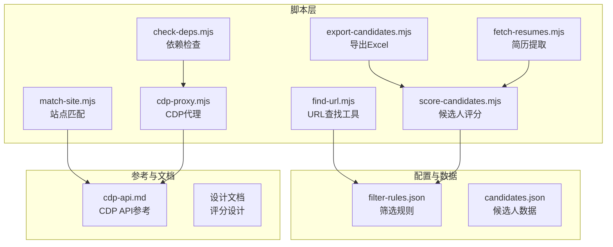
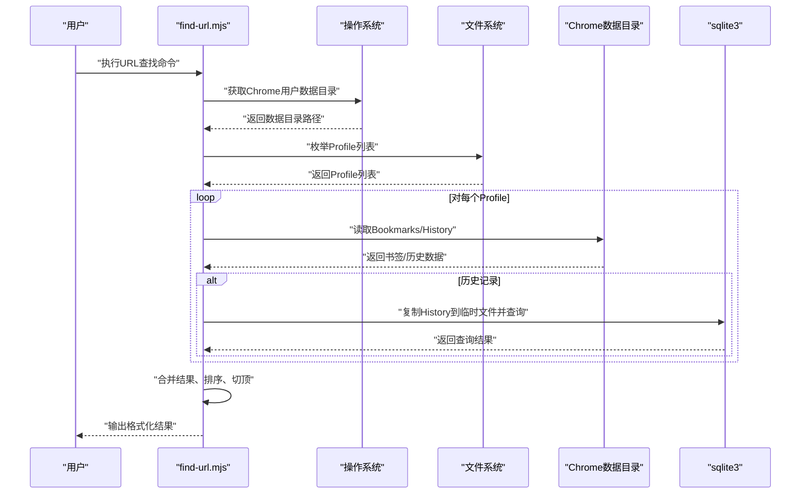
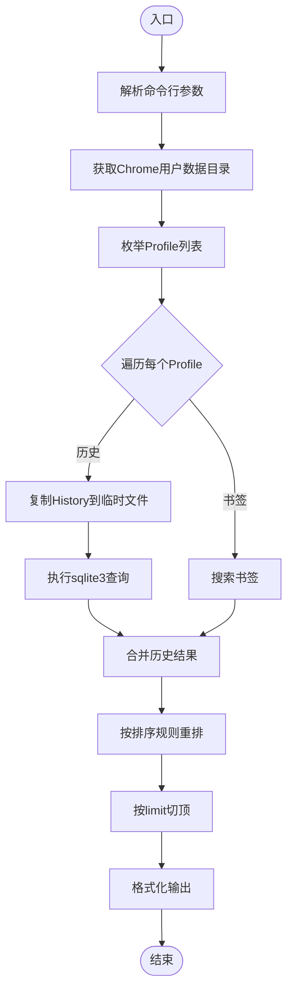
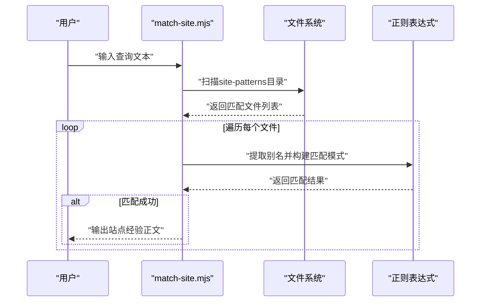
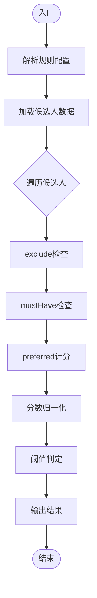
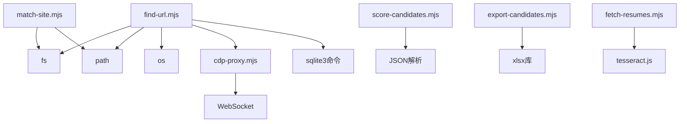

# URL查找工具

<cite>
**本文引用的文件**
- [README.md](file://README.md)
- [SKILL.md](file://SKILL.md)
- [scripts/find-url.mjs](file://scripts/find-url.mjs)
- [scripts/match-site.mjs](file://scripts/match-site.mjs)
- [scripts/score-candidates.mjs](file://scripts/score-candidates.mjs)
- [scripts/export-candidates.mjs](file://scripts/export-candidates.mjs)
- [scripts/fetch-resumes.mjs](file://scripts/fetch-resumes.mjs)
- [scripts/check-deps.mjs](file://scripts/check-deps.mjs)
- [scripts/cdp-proxy.mjs](file://scripts/cdp-proxy.mjs)
- [config/filter-rules.json](file://config/filter-rules.json)
- [data/candidates.json](file://data/candidates.json)
- [references/cdp-api.md](file://references/cdp-api.md)
- [docs/superpowers/specs/2026-04-23-candidate-filtering-scoring-design.md](file://docs/superpowers/specs/2026-04-23-candidate-filtering-scoring-design.md)
</cite>

## 目录
1. [简介](#简介)
2. [项目结构](#项目结构)
3. [核心组件](#核心组件)
4. [架构概览](#架构概览)
5. [详细组件分析](#详细组件分析)
6. [依赖分析](#依赖分析)
7. [性能考虑](#性能考虑)
8. [故障排除指南](#故障排除指南)
9. [结论](#结论)
10. [附录](#附录)

## 简介
本文件为URL查找工具的综合技术文档，重点阐述本地Chrome资源检索功能的实现原理与使用方法。该工具能够从用户的本地Chrome书签与历史记录中检索URL，支持关键词搜索、时间窗过滤、访问频度排序等功能，适用于定位公网搜索无法覆盖的内部系统、SSO后台、内网域名等目标。文档还涵盖工具的配置参数、使用场景、扩展方法、性能优化建议与故障排除指南，并解释该工具在候选人数据收集流程中的作用与集成方式。

## 项目结构
该项目围绕Web访问与候选人管理构建，包含以下关键模块：
- scripts：核心脚本集合，包括URL查找、站点匹配、候选人评分、导出、简历提取、依赖检查与CDP代理等
- config：规则配置文件（如筛选规则）
- data：示例数据文件（如候选人数据）
- references：CDP API参考与站点经验文件索引
- docs：设计文档与规范说明
- README与SKILL：项目介绍与技能规范

**图表来源**
- [scripts/find-url.mjs:1-215](file://scripts/find-url.mjs#L1-L215)
- [scripts/match-site.mjs:1-47](file://scripts/match-site.mjs#L1-L47)
- [scripts/score-candidates.mjs:1-406](file://scripts/score-candidates.mjs#L1-L406)
- [scripts/export-candidates.mjs:1-203](file://scripts/export-candidates.mjs#L1-L203)
- [scripts/fetch-resumes.mjs](file://scripts/fetch-resumes.mjs)
- [scripts/check-deps.mjs](file://scripts/check-deps.mjs)
- [scripts/cdp-proxy.mjs](file://scripts/cdp-proxy.mjs)
- [config/filter-rules.json:1-41](file://config/filter-rules.json#L1-L41)
- [data/candidates.json:1-49](file://data/candidates.json#L1-L49)
- [references/cdp-api.md:1-107](file://references/cdp-api.md#L1-L107)
- [docs/superpowers/specs/2026-04-23-candidate-filtering-scoring-design.md:1-270](file://docs/superpowers/specs/2026-04-23-candidate-filtering-scoring-design.md#L1-L270)

**章节来源**
- [README.md:1-168](file://README.md#L1-L168)
- [SKILL.md:1-290](file://SKILL.md#L1-L290)

## 核心组件
- URL查找工具（find-url.mjs）：从本地Chrome书签与历史记录检索URL，支持关键词匹配、时间窗过滤、访问频度排序与多Profile聚合
- 站点匹配工具（match-site.mjs）：根据用户输入匹配站点经验文件，输出匹配到的站点经验内容
- 候选人评分工具（score-candidates.mjs）：基于规则配置对候选人进行评分与筛选，输出标准化结果
- 导出工具（export-candidates.mjs）：将评分结果导出为Excel文件
- 简历提取工具（fetch-resumes.mjs）：对通过筛选的候选人提取在线简历原文
- 依赖检查与CDP代理（check-deps.mjs、cdp-proxy.mjs）：确保CDP模式可用并提供HTTP API
- 配置与数据：filter-rules.json（筛选规则）、candidates.json（候选人数据）

**章节来源**
- [scripts/find-url.mjs:1-215](file://scripts/find-url.mjs#L1-L215)
- [scripts/match-site.mjs:1-47](file://scripts/match-site.mjs#L1-L47)
- [scripts/score-candidates.mjs:1-406](file://scripts/score-candidates.mjs#L1-L406)
- [scripts/export-candidates.mjs:1-203](file://scripts/export-candidates.mjs#L1-L203)
- [scripts/fetch-resumes.mjs](file://scripts/fetch-resumes.mjs)
- [scripts/check-deps.mjs](file://scripts/check-deps.mjs)
- [scripts/cdp-proxy.mjs](file://scripts/cdp-proxy.mjs)
- [config/filter-rules.json:1-41](file://config/filter-rules.json#L1-L41)
- [data/candidates.json:1-49](file://data/candidates.json#L1-L49)

## 架构概览
URL查找工具在本地Chrome环境中运行，通过解析用户数据目录与Profile，分别读取书签与历史记录，结合关键词、时间窗与排序策略生成结果。工具支持跨Profile聚合与输出格式化，便于在候选人数据收集流程中快速定位目标URL。

**图表来源**
- [scripts/find-url.mjs:175-215](file://scripts/find-url.mjs#L175-L215)

## 详细组件分析

### URL查找工具（find-url.mjs）
该组件负责从本地Chrome书签与历史记录中检索URL，核心功能包括：
- 参数解析：支持关键词、数据源限定、条数限制、时间窗与排序选项
- 跨平台Chrome数据目录定位：支持macOS、Linux、Windows
- Profile枚举：读取Local State中的Profile信息，回退至Default
- 书签检索：遍历Bookmarks树，关键词AND匹配（title+url），返回包含文件夹路径与Profile信息的结果
- 历史检索：复制History到临时文件，使用sqlite3查询，支持关键词LIKE、时间窗过滤、访问频度排序
- 结果聚合与输出：跨Profile合并、按排序规则重排、切顶、格式化输出

**图表来源**
- [scripts/find-url.mjs:27-215](file://scripts/find-url.mjs#L27-L215)

**章节来源**
- [scripts/find-url.mjs:1-215](file://scripts/find-url.mjs#L1-L215)

### 站点匹配工具（match-site.mjs）
该组件根据用户输入匹配站点经验文件，支持别名匹配与正则模式，输出匹配到的站点经验正文内容。常用于在候选人数据收集流程中快速获取目标站点的经验与操作策略。

**图表来源**
- [scripts/match-site.mjs:1-47](file://scripts/match-site.mjs#L1-L47)

**章节来源**
- [scripts/match-site.mjs:1-47](file://scripts/match-site.mjs#L1-L47)

### 候选人评分工具（score-candidates.mjs）
该组件基于规则配置对候选人进行评分与筛选，支持mustHave、preferred、exclude三类规则，支持多种操作符与数组字段遍历，最终输出标准化的评分结果。该工具在候选人数据收集流程中扮演关键角色，用于从大规模候选集中筛选高质量候选人。

**图表来源**
- [scripts/score-candidates.mjs:229-340](file://scripts/score-candidates.mjs#L229-L340)

**章节来源**
- [scripts/score-candidates.mjs:1-406](file://scripts/score-candidates.mjs#L1-L406)
- [config/filter-rules.json:1-41](file://config/filter-rules.json#L1-L41)
- [docs/superpowers/specs/2026-04-23-candidate-filtering-scoring-design.md:1-270](file://docs/superpowers/specs/2026-04-23-candidate-filtering-scoring-design.md#L1-L270)

### 导出工具（export-candidates.mjs）
该组件将评分结果导出为Excel文件，支持自定义字段选择与自动列宽适配，便于后续人工审阅与汇报。

**章节来源**
- [scripts/export-candidates.mjs:1-203](file://scripts/export-candidates.mjs#L1-L203)

### 简历提取工具（fetch-resumes.mjs）
该组件在候选人评分通过后，自动打开沟通页并提取在线简历原文，支持截图+OCR识别，保存为纯文本文件。

**章节来源**
- [scripts/fetch-resumes.mjs](file://scripts/fetch-resumes.mjs)

### 依赖检查与CDP代理（check-deps.mjs、cdp-proxy.mjs）
- 依赖检查：确保Node.js版本与Chrome远程调试可用，自动启动CDP代理
- CDP代理：提供HTTP API，支持新建tab、导航、点击、截图、滚动等操作，便于在候选人数据收集流程中进行自动化页面操作

**章节来源**
- [scripts/check-deps.mjs](file://scripts/check-deps.mjs)
- [scripts/cdp-proxy.mjs](file://scripts/cdp-proxy.mjs)
- [references/cdp-api.md:1-107](file://references/cdp-api.md#L1-L107)

## 依赖分析
- find-url.mjs依赖Node.js标准库（fs、path、os、child_process）与sqlite3命令行工具
- match-site.mjs依赖Node.js标准库与文件系统读取
- score-candidates.mjs依赖JSON解析与字符串处理
- export-candidates.mjs依赖xlsx库
- fetch-resumes.mjs依赖tesseract.js库
- CDP相关功能依赖CDP代理服务

**图表来源**
- [scripts/find-url.mjs:21-24](file://scripts/find-url.mjs#L21-L24)
- [scripts/export-candidates.mjs:15-23](file://scripts/export-candidates.mjs#L15-L23)
- [scripts/fetch-resumes.mjs](file://scripts/fetch-resumes.mjs)
- [scripts/cdp-proxy.mjs](file://scripts/cdp-proxy.mjs)

**章节来源**
- [package.json:1-11](file://package.json#L1-L11)

## 性能考虑
- 书签检索：采用递归遍历Bookmarks树，时间复杂度与节点数线性相关；关键词匹配为字符串包含操作，建议控制关键词数量
- 历史检索：复制History到临时文件并使用sqlite3查询，避免直接锁定数据库；合理设置limit与since可显著减少查询量
- 排序与切顶：历史结果在内存中排序并切顶，建议根据实际需求调整limit参数
- 多Profile处理：遍历所有Profile并合并结果，Profile数量较多时建议限定only参数以减少I/O
- 输出格式化：使用简单的字段拼接与替换，性能开销较小

[本节提供一般性指导，无需具体文件分析]

## 故障排除指南
- 未找到Chrome用户数据目录：检查操作系统平台与用户数据目录路径
- 未找到sqlite3命令：在macOS/Linux系统中通常自带，Windows可通过包管理器安装
- 未开启Chrome远程调试：在Chrome地址栏打开`chrome://inspect/#remote-debugging`并勾选"Allow remote debugging"
- CDP代理端口占用：已有实例可直接复用，避免重复启动
- 书签无关键词查询无意义：书签无时间维度，建议添加关键词或切换到历史查询

**章节来源**
- [scripts/find-url.mjs:143-145](file://scripts/find-url.mjs#L143-L145)
- [scripts/check-deps.mjs](file://scripts/check-deps.mjs)
- [references/cdp-api.md:100-107](file://references/cdp-api.md#L100-L107)

## 结论
URL查找工具通过本地Chrome书签与历史记录的检索，为候选人数据收集提供了高效、可靠的URL定位能力。结合站点匹配、候选人评分、导出与简历提取等工具，形成了完整的数据收集与筛选流程。工具具备良好的跨平台支持、灵活的参数配置与清晰的输出格式，适合在多种Agent环境中集成使用。

[本节为总结性内容，无需具体文件分析]

## 附录

### 使用场景与集成方式
- 定位内部系统与SSO后台：通过历史记录按关键词与时间窗检索
- 回查访问过的页面：利用历史记录的最近访问排序
- 高频网站回溯：使用访问频度排序快速定位常用站点
- 候选人数据收集流程集成：在提取候选人后，使用URL查找工具定位目标站点，结合站点匹配与CDP代理进行自动化页面操作

**章节来源**
- [README.md:46-47](file://README.md#L46-L47)
- [SKILL.md:154-174](file://SKILL.md#L154-L174)

### 配置参数说明
- 关键词：空格分词、多词AND匹配（title+url），可省略
- --only：限定数据源（bookmarks|history），默认两者都查
- --limit：条数上限，默认20；0表示不限
- --since：时间窗（仅作用于历史），支持1d/7h/30m或YYYY-MM-DD格式
- --sort：历史排序（recent|visits），默认recent

**章节来源**
- [scripts/find-url.mjs:5-19](file://scripts/find-url.mjs#L5-L19)

### 实际使用示例
- 查找包含"财务小智"的书签：`node scripts/find-url.mjs 财务小智`
- 仅查询历史记录并按最近访问排序：`node scripts/find-url.mjs --only history`
- 查询最近一周高频网站：`node scripts/find-url.mjs --since 7d --only history --sort visits`
- 查询最近两天的历史记录且不限条数：`node scripts/find-url.mjs --since 2d --only history --limit 0`

**章节来源**
- [scripts/find-url.mjs:14-19](file://scripts/find-url.mjs#L14-L19)

### 扩展方法
- 添加新的关键词匹配策略：在书签与历史检索函数中扩展匹配逻辑
- 增加新的排序维度：在历史排序逻辑中添加新的排序键
- 集成更多数据源：扩展Profile枚举与数据读取逻辑
- 输出格式定制：在输出格式化函数中调整字段与分隔符

**章节来源**
- [scripts/find-url.mjs:83-149](file://scripts/find-url.mjs#L83-L149)