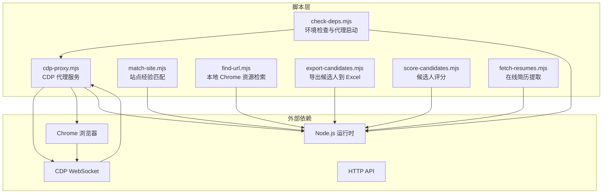
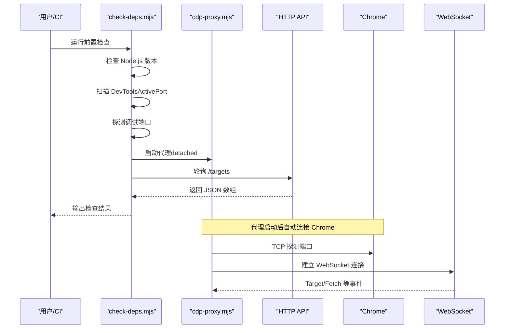
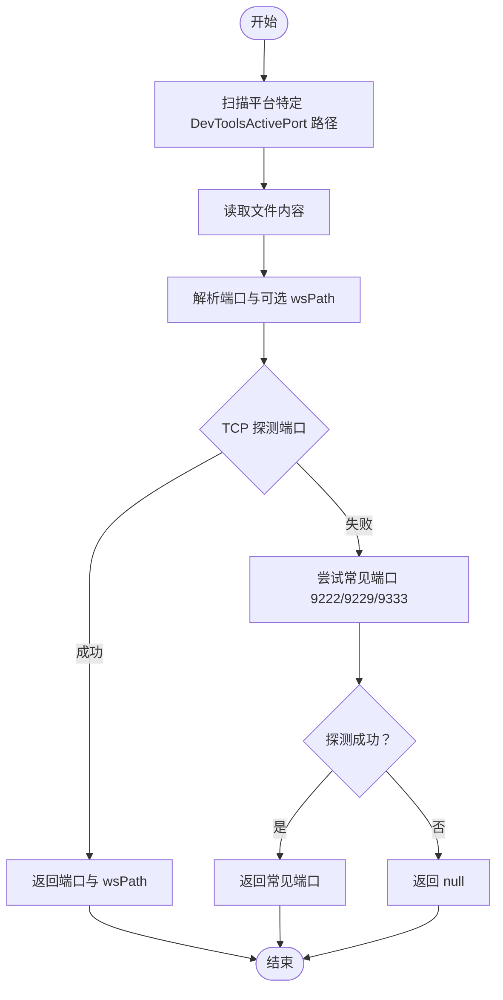
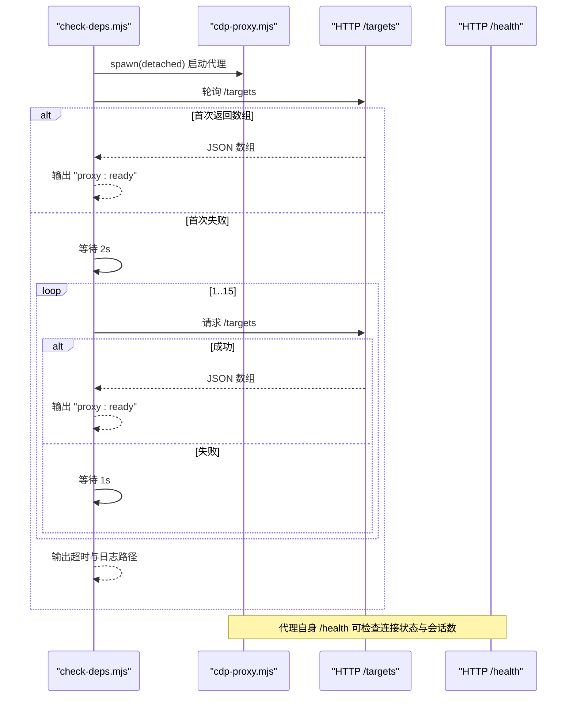
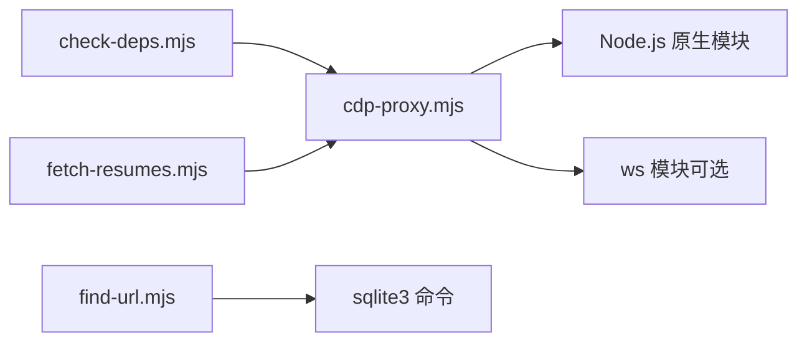

# 环境检查工具

<cite>
**本文引用的文件**
- [check-deps.mjs](file://scripts/check-deps.mjs)
- [cdp-proxy.mjs](file://scripts/cdp-proxy.mjs)
- [README.md](file://README.md)
- [package.json](file://package.json)
- [fetch-resumes.mjs](file://scripts/fetch-resumes.mjs)
- [match-site.mjs](file://scripts/match-site.mjs)
- [export-candidates.mjs](file://scripts/export-candidates.mjs)
- [score-candidates.mjs](file://scripts/score-candidates.mjs)
- [find-url.mjs](file://scripts/find-url.mjs)
</cite>

## 目录
1. [简介](#简介)
2. [项目结构](#项目结构)
3. [核心组件](#核心组件)
4. [架构总览](#架构总览)
5. [详细组件分析](#详细组件分析)
6. [依赖关系分析](#依赖关系分析)
7. [性能考量](#性能考量)
8. [故障诊断指南](#故障诊断指南)
9. [结论](#结论)
10. [附录](#附录)

## 简介
本文件面向“环境检查工具”的技术文档，聚焦以下核心能力：
- Node.js 版本检查机制
- Chrome 调试端口检测算法（DevToolsActivePort 文件扫描策略、多平台路径兼容性、端口探测实现）
- CDP 代理启动流程与可用性检查
- 环境依赖验证、Chrome 连接状态检测、代理服务可用性检查
- 故障诊断、常见问题排查与性能优化建议
- 使用示例与配置选项说明

该工具链以 Node.js 脚本为核心，提供跨平台的前置检查与代理服务管理，确保后续基于 CDP 的浏览器自动化流程稳定运行。

## 项目结构
该项目围绕“环境检查 + CDP 代理”两条主线展开，核心文件如下：
- scripts/check-deps.mjs：环境前置检查与代理可用性保障
- scripts/cdp-proxy.mjs：CDP 代理服务，负责直连 Chrome 并暴露 HTTP API
- README.md：使用说明与 API 文档
- package.json：依赖声明（xlsx、tesseract.js 等）

图表来源
- [check-deps.mjs:143-172](file://scripts/check-deps.mjs#L143-L172)
- [cdp-proxy.mjs:288-552](file://scripts/cdp-proxy.mjs#L288-L552)

章节来源
- [README.md:104-137](file://README.md#L104-L137)
- [package.json:1-11](file://package.json#L1-L11)

## 核心组件
- 环境前置检查器（check-deps.mjs）
  - Node.js 版本检查（要求 Node.js 22+）
  - TCP 端口探测（避免触发 Chrome 授权弹窗）
  - DevToolsActivePort 文件扫描（多平台路径）
  - CDP 代理启动与可用性等待
- CDP 代理服务（cdp-proxy.mjs）
  - 自动发现 Chrome 调试端口（DevToolsActivePort + 常见端口回退）
  - WebSocket 连接管理与会话维护
  - HTTP API 暴露（/targets、/new、/navigate、/eval、/click、/screenshot 等）
  - 反风控：拦截页面对调试端口的探测请求

章节来源
- [check-deps.mjs:17-25](file://scripts/check-deps.mjs#L17-L25)
- [check-deps.mjs:29-36](file://scripts/check-deps.mjs#L29-L36)
- [check-deps.mjs:40-83](file://scripts/check-deps.mjs#L40-L83)
- [check-deps.mjs:107-139](file://scripts/check-deps.mjs#L107-L139)
- [cdp-proxy.mjs:35-91](file://scripts/cdp-proxy.mjs#L35-L91)
- [cdp-proxy.mjs:113-200](file://scripts/cdp-proxy.mjs#L113-L200)
- [cdp-proxy.mjs:288-552](file://scripts/cdp-proxy.mjs#L288-L552)

## 架构总览
下图展示“环境检查工具”的整体调用链路与组件交互：

图表来源
- [check-deps.mjs:143-172](file://scripts/check-deps.mjs#L143-L172)
- [check-deps.mjs:107-139](file://scripts/check-deps.mjs#L107-L139)
- [cdp-proxy.mjs:35-91](file://scripts/cdp-proxy.mjs#L35-L91)
- [cdp-proxy.mjs:113-200](file://scripts/cdp-proxy.mjs#L113-L200)
- [cdp-proxy.mjs:288-552](file://scripts/cdp-proxy.mjs#L288-L552)

## 详细组件分析

### Node.js 版本检查机制
- 目标：确保运行时满足 Node.js 22+ 要求，以使用原生 WebSocket 等特性
- 实现要点：
  - 读取 process.versions.node 并解析主版本号
  - 大于等于 22 时输出“ok”，否则输出“warn”
- 影响范围：影响 CDP 代理的 WebSocket 兼容层选择（Node.js 22+ 使用原生 WebSocket，否则回退到 ws 模块）

章节来源
- [check-deps.mjs:17-25](file://scripts/check-deps.mjs#L17-L25)
- [cdp-proxy.mjs:19-33](file://scripts/cdp-proxy.mjs#L19-L33)

### Chrome 调试端口检测算法
- 目标：从 DevToolsActivePort 文件与常见端口回退两种途径发现 Chrome 调试端口
- 多平台路径兼容性：
  - macOS：Chrome、Chrome Canary、Chromium 的 DevToolsActivePort 路径
  - Linux：Chrome、Chromium 的 DevToolsActivePort 路径
  - Windows：Chrome、Chromium 的 DevToolsActivePort 路径（LOCALAPPDATA）
- DevToolsActivePort 文件扫描策略：
  - 读取文件首行作为端口，第二行作为 WebSocket 路径（若存在）
  - 对端口进行 TCP 探测，确认监听后再返回
- 端口探测实现：
  - 使用 net.createConnection 进行 TCP 探测，避免触发 Chrome 授权弹窗
  - 超时控制（默认 2 秒），连接成功返回 true，否则 false
- 常见端口回退：
  - 若文件扫描失败，依次探测 9222、9229、9333，命中即返回

图表来源
- [check-deps.mjs:40-83](file://scripts/check-deps.mjs#L40-L83)
- [check-deps.mjs:29-36](file://scripts/check-deps.mjs#L29-L36)
- [cdp-proxy.mjs:35-91](file://scripts/cdp-proxy.mjs#L35-L91)
- [cdp-proxy.mjs:95-102](file://scripts/cdp-proxy.mjs#L95-L102)

章节来源
- [check-deps.mjs:40-83](file://scripts/check-deps.mjs#L40-L83)
- [check-deps.mjs:29-36](file://scripts/check-deps.mjs#L29-L36)
- [cdp-proxy.mjs:35-91](file://scripts/cdp-proxy.mjs#L35-L91)
- [cdp-proxy.mjs:95-102](file://scripts/cdp-proxy.mjs#L95-L102)

### CDP 代理启动流程与可用性检查
- 启动策略：
  - check-deps.mjs 在检测到代理未运行时，以 detached 模式启动 cdp-proxy.mjs，并将日志重定向到临时文件
  - 启动后短暂等待，再轮询 /targets 接口判断代理是否就绪
- 可用性检查：
  - /targets 返回 JSON 数组视为“ready”
  - 若超时，提示“Chrome 可能有授权弹窗，请点击「允许」后等待连接...”
- 代理服务职责：
  - 自动发现 Chrome 端口（同上）
  - 建立 WebSocket 连接，维护会话与 Target
  - 暴露 HTTP API，供上层脚本调用（如 fetch-resumes.mjs）

图表来源
- [check-deps.mjs:107-139](file://scripts/check-deps.mjs#L107-L139)
- [cdp-proxy.mjs:288-301](file://scripts/cdp-proxy.mjs#L288-L301)

章节来源
- [check-deps.mjs:95-139](file://scripts/check-deps.mjs#L95-L139)
- [cdp-proxy.mjs:288-301](file://scripts/cdp-proxy.mjs#L288-L301)

### 环境依赖验证与 Chrome 连接状态检测
- 环境依赖验证：
  - Node.js 版本：要求 22+
  - 代理端口占用检测：通过本地监听端口判断是否已有实例运行
  - 代理健康检查：/health 返回连接状态、会话数与 Chrome 端口
- Chrome 连接状态检测：
  - 通过 TCP 探测端口避免触发授权弹窗
  - WebSocket 连接建立后，订阅 Target/Fetch 等事件，维护会话映射
- 代理服务可用性检查：
  - /targets 返回页面列表，数组即可用
  - /health 返回连接状态与会话数，便于监控

章节来源
- [check-deps.mjs:17-25](file://scripts/check-deps.mjs#L17-L25)
- [check-deps.mjs:107-139](file://scripts/check-deps.mjs#L107-L139)
- [cdp-proxy.mjs:554-562](file://scripts/cdp-proxy.mjs#L554-L562)
- [cdp-proxy.mjs:288-301](file://scripts/cdp-proxy.mjs#L288-L301)
- [cdp-proxy.mjs:113-200](file://scripts/cdp-proxy.mjs#L113-L200)

### 反风控：拦截页面对调试端口的探测
- 目标：阻止页面脚本探测本地调试端口，降低被识别为自动化风险
- 实现：
  - 在会话 attach 成功后启用 Fetch.enable，针对 127.0.0.1:chromePort 的请求拦截
  - 对命中规则的请求直接 failRequest，避免触发授权弹窗
- 注意：
  - 仅拦截调试端口相关请求，不影响其他本地服务

章节来源
- [cdp-proxy.mjs:235-248](file://scripts/cdp-proxy.mjs#L235-L248)

## 依赖关系分析
- Node.js 运行时
  - check-deps.mjs 与 cdp-proxy.mjs 均依赖 Node.js 原生模块（child_process、fs、net、os、path、http、url 等）
  - cdp-proxy.mjs 在 Node.js 22+ 下使用原生 WebSocket，否则回退到 ws 模块
- 外部工具
  - find-url.mjs 依赖 sqlite3 命令行工具读取 Chrome 历史数据库
- 上层脚本
  - fetch-resumes.mjs 通过 HTTP API 调用 cdp-proxy.mjs，实现简历弹窗截图与 OCR 提取

图表来源
- [check-deps.mjs:4-12](file://scripts/check-deps.mjs#L4-L12)
- [cdp-proxy.mjs:6-12](file://scripts/cdp-proxy.mjs#L6-L12)
- [cdp-proxy.mjs:24-33](file://scripts/cdp-proxy.mjs#L24-L33)
- [find-url.mjs:21-24](file://scripts/find-url.mjs#L21-L24)

章节来源
- [package.json:6-9](file://package.json#L6-L9)
- [find-url.mjs:143-145](file://scripts/find-url.mjs#L143-L145)

## 性能考量
- 端口探测与超时
  - TCP 探测超时 2 秒，避免长时间阻塞
  - /targets 轮询间隔 1 秒，最多 15 次，总计约 15 秒等待
- 代理启动与连接
  - 代理启动采用 detached 模式，避免阻塞父进程
  - 首次连接失败会在首次请求时重试，减少冷启动等待
- 反风控拦截
  - 仅对调试端口相关请求拦截，避免对正常业务流量造成影响
- I/O 与资源
  - 日志写入临时文件，避免阻塞标准输出
  - fetch-resumes.mjs 使用 OCR worker 复用，减少重复初始化成本

章节来源
- [check-deps.mjs:29-36](file://scripts/check-deps.mjs#L29-L36)
- [check-deps.mjs:122-134](file://scripts/check-deps.mjs#L122-L134)
- [cdp-proxy.mjs:554-562](file://scripts/cdp-proxy.mjs#L554-L562)
- [cdp-proxy.mjs:235-248](file://scripts/cdp-proxy.mjs#L235-L248)
- [fetch-resumes.mjs:282-285](file://scripts/fetch-resumes.mjs#L282-L285)

## 故障诊断指南
- Node.js 版本过低
  - 现象：check-deps.mjs 输出“warn”，cdp-proxy.mjs 可能回退到 ws 模块
  - 处理：升级到 Node.js 22+，或安装 ws 模块
- Chrome 未开启远程调试
  - 现象：detectChromePort/detect 返回 null，提示“请确保 Chrome 已打开并勾选 Allow remote debugging”
  - 处理：在 chrome://inspect/#remote-debugging 中勾选“Allow remote debugging for this browser instance”
- 端口占用或代理未就绪
  - 现象：/targets 一直返回非数组，最终输出“连接超时，请检查 Chrome 调试设置”
  - 处理：确认端口 3456 未被占用；查看代理日志（临时目录下的 cdp-proxy.log）
- WebSocket 连接失败
  - 现象：代理日志显示连接错误，随后清理端口缓存并重试
  - 处理：关闭授权弹窗，确保允许调试；检查 Chrome 是否处于受保护模式
- SQLite 命令缺失（find-url.mjs）
  - 现象：提示未找到 sqlite3 命令
  - 处理：在 macOS/Linux 安装 sqlite3，在 Windows 通过包管理器或官网下载

章节来源
- [check-deps.mjs:146-151](file://scripts/check-deps.mjs#L146-L151)
- [check-deps.mjs:136-138](file://scripts/check-deps.mjs#L136-L138)
- [cdp-proxy.mjs:118-127](file://scripts/cdp-proxy.mjs#L118-L127)
- [cdp-proxy.mjs:144-152](file://scripts/cdp-proxy.mjs#L144-L152)
- [find-url.mjs:143-145](file://scripts/find-url.mjs#L143-L145)

## 结论
本环境检查工具通过“前置检查 + 代理守护”的方式，实现了对 Node.js 版本、Chrome 调试端口与 CDP 代理可用性的全面验证。其多平台路径兼容、TCP 探测规避授权弹窗、以及反风控拦截等设计，有效提升了自动化流程的稳定性与可靠性。配合 README 中的使用示例与 API 文档，可快速集成到各类 Agent 工作流中。

## 附录

### 使用示例与配置选项
- 环境检查
  - 运行：node "${CLAUDE_SKILL_DIR}/scripts/check-deps.mjs"
  - 输出：Node.js 版本、Chrome 连接状态、代理可用性、站点经验列表
- 启动代理
  - 运行：node "${CLAUDE_SKILL_DIR}/scripts/cdp-proxy.mjs" &
  - 端口：可通过环境变量 CDP_PROXY_PORT 指定（默认 3456）
- 代理 API
  - /health：健康检查（连接状态、会话数、Chrome 端口）
  - /targets：列出所有页面
  - /new?url=：新建后台 tab
  - /navigate?target=&url=：导航并等待加载
  - /eval?target=：执行 JS
  - /click?target=：JS 点击元素
  - /clickAt?target=：真实鼠标点击
  - /setFiles?target=：设置文件输入
  - /scroll?target=&y=&direction=：滚动页面
  - /screenshot?target=&file=：截图
  - /close?target=：关闭 tab
  - /info?target=：页面信息

章节来源
- [README.md:104-137](file://README.md#L104-L137)
- [cdp-proxy.mjs:288-552](file://scripts/cdp-proxy.mjs#L288-L552)