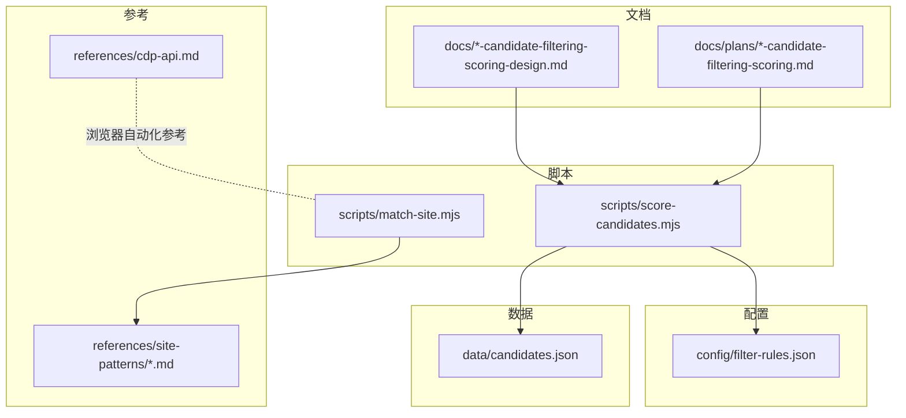
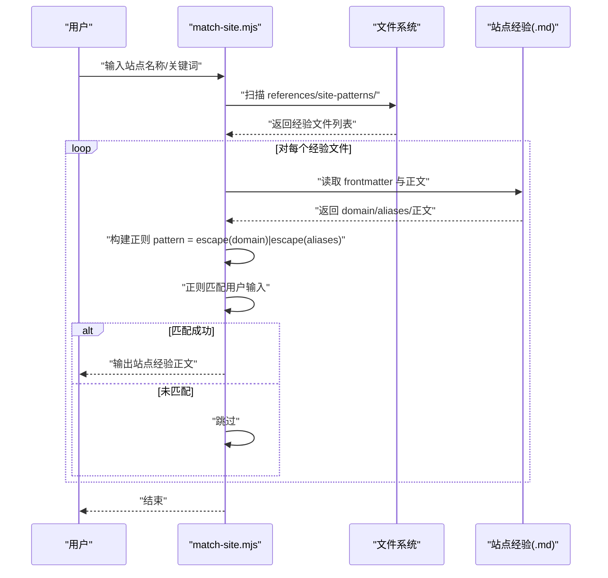
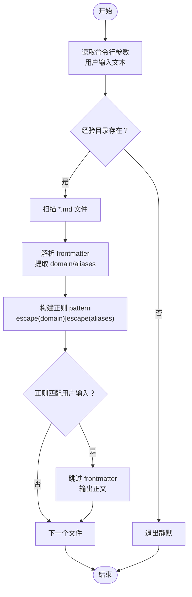
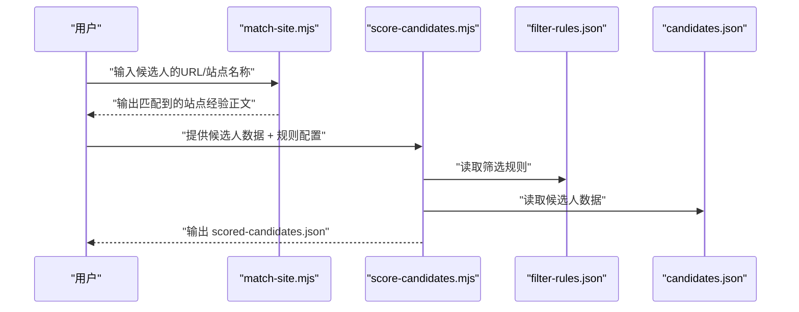
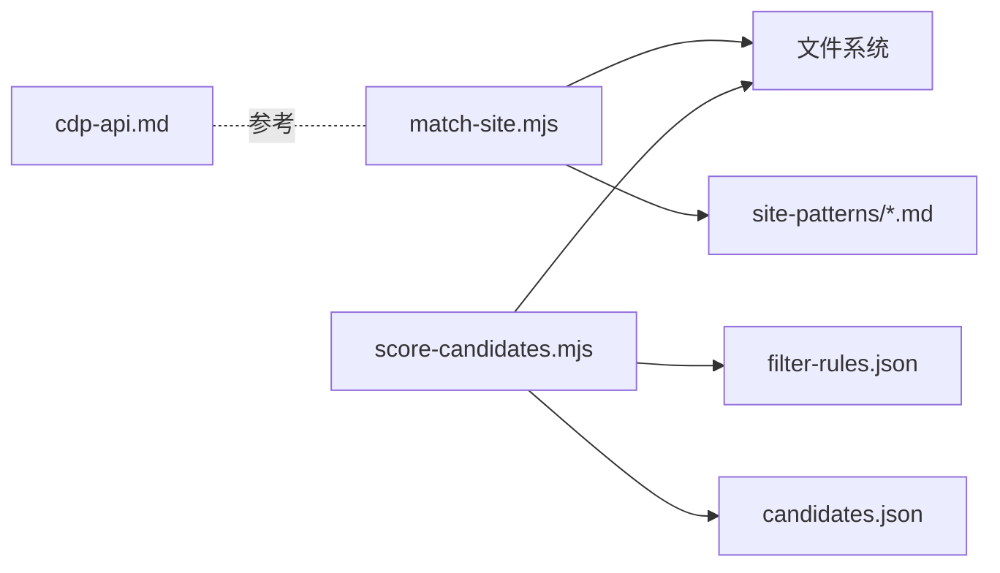

# 站点匹配工具

<cite>
**本文引用的文件**
- [README.md](file://README.md)
- [SKILL.md](file://SKILL.md)
- [match-site.mjs](file://scripts/match-site.mjs)
- [filter-rules.json](file://config/filter-rules.json)
- [candidates.json](file://data/candidates.json)
- [score-candidates.mjs](file://scripts/score-candidates.mjs)
- [2026-04-23-candidate-filtering-scoring-design.md](file://docs/2026-04-23-candidate-filtering-scoring-design.md)
- [2026-04-23-candidate-filtering-scoring.md](file://docs/plans/2026-04-23-candidate-filtering-scoring.md)
- [cdp-api.md](file://references/cdp-api.md)
</cite>

## 目录
1. [简介](#简介)
2. [项目结构](#项目结构)
3. [核心组件](#核心组件)
4. [架构总览](#架构总览)
5. [详细组件分析](#详细组件分析)
6. [依赖分析](#依赖分析)
7. [性能考虑](#性能考虑)
8. [故障排查指南](#故障排查指南)
9. [结论](#结论)
10. [附录](#附录)

## 简介
本文件面向“站点匹配工具”的技术文档，聚焦于站点经验（平台特征）的匹配与管理机制，涵盖以下主题：
- 站点匹配算法与URL模式识别
- 平台特征库（references/site-patterns）的组织与扩展
- 匹配策略与误判处理
- 支持的站点类型与匹配规则配置
- 在候选人筛选流程中的作用与与URL数据的匹配/分类

该工具通过“站点经验”文件（Markdown）记录平台特征、有效模式与已知陷阱，结合轻量脚本实现对用户输入的快速匹配与输出，辅助在大规模网络任务中实现“按站点经验执行”的一致性与可复用性。

## 项目结构
仓库采用“脚本 + 配置 + 文档 + 数据”的分层组织：
- scripts：核心执行脚本（站点匹配、候选人评分、简历提取等）
- config：规则配置（筛选规则、站点经验索引等）
- data：示例数据（候选人样本）
- docs：设计文档与实施计划
- references：站点经验与CDP API参考
- 根目录README与SKILL：总体介绍与技能说明

图表来源
- [match-site.mjs:1-47](file://scripts/match-site.mjs#L1-L47)
- [score-candidates.mjs:1-406](file://scripts/score-candidates.mjs#L1-L406)
- [filter-rules.json:1-41](file://config/filter-rules.json#L1-L41)
- [candidates.json:1-49](file://data/candidates.json#L1-L49)
- [2026-04-23-candidate-filtering-scoring-design.md:1-270](file://docs/2026-04-23-candidate-filtering-scoring-design.md#L1-L270)
- [2026-04-23-candidate-filtering-scoring.md:1-701](file://docs/plans/2026-04-23-candidate-filtering-scoring.md#L1-L701)
- [cdp-api.md:1-107](file://references/cdp-api.md#L1-L107)

章节来源
- [README.md:1-168](file://README.md#L1-L168)
- [SKILL.md:1-290](file://SKILL.md#L1-L290)

## 核心组件
- 站点匹配脚本（match-site.mjs）
  - 功能：读取 references/site-patterns 下的经验文件，基于域名与别名构建正则，匹配用户输入，输出匹配到的站点经验正文。
  - 输入：命令行参数（用户输入文本）
  - 输出：标准输出（匹配到的站点经验正文）
- 特征库（references/site-patterns/*.md）
  - 结构：frontmatter（domain、aliases、updated）+ Markdown 正文（平台特征、有效模式、已知陷阱）
  - 用途：为站点经验执行提供先验知识与执行策略
- 候选人筛选评分（score-candidates.mjs + filter-rules.json）
  - 功能：基于规则配置对候选人进行评分与筛选，输出 scored-candidates.json
  - 与站点匹配的关系：在“按站点经验执行”的流程中，站点经验文件可定义输出文件名，从而与评分结果持久化流程衔接

章节来源
- [match-site.mjs:1-47](file://scripts/match-site.mjs#L1-L47)
- [filter-rules.json:1-41](file://config/filter-rules.json#L1-L41)
- [score-candidates.mjs:1-406](file://scripts/score-candidates.mjs#L1-L406)
- [2026-04-23-candidate-filtering-scoring-design.md:1-270](file://docs/2026-04-23-candidate-filtering-scoring-design.md#L1-L270)

## 架构总览
站点匹配工具围绕“经验驱动”的执行理念构建，核心流程如下：
- 前置检查阶段：输出现有站点经验列表（便于用户选择）
- 用户输入阶段：提供用户输入（如“Boss直聘”、“小红书”等）
- 匹配阶段：match-site.mjs 读取经验文件，基于 domain 与 aliases 构建正则进行匹配
- 执行阶段：依据匹配到的经验文件执行相应流程（如浏览器自动化、数据提取）

图表来源
- [match-site.mjs:1-47](file://scripts/match-site.mjs#L1-L47)

章节来源
- [README.md:46-69](file://README.md#L46-L69)
- [SKILL.md:244-290](file://SKILL.md#L244-L290)

## 详细组件分析

### 站点匹配算法与URL模式识别
- 匹配入口与参数
  - 命令行参数：用户输入文本（字符串）
  - 目录扫描：references/site-patterns 下的所有 .md 文件
- 匹配策略
  - 从文件名提取 domain（去除 .md 后缀）
  - 从 frontmatter 提取 aliases（逗号分隔列表）
  - 构建正则模式：escape(domain) | escape(aliases)（大小写不敏感）
  - 正则匹配用户输入，命中则输出该经验文件正文（跳过 frontmatter）
- URL模式识别
  - 该脚本不直接解析URL结构，而是通过“域名 + 别名”的文本匹配实现“站点识别”
  - 真正的URL模式与页面交互策略由站点经验文件提供，脚本仅负责“选择经验文件”

图表来源
- [match-site.mjs:1-47](file://scripts/match-site.mjs#L1-L47)

章节来源
- [match-site.mjs:1-47](file://scripts/match-site.mjs#L1-L47)

### 平台特征库管理与扩展机制
- 组织结构
  - references/site-patterns/<domain>.md：每个域名一个经验文件
  - frontmatter 字段：domain、aliases（可选）、updated（可选）
  - 正文内容：平台特征、有效模式、已知陷阱
- 扩展机制
  - 新增站点：新建 <domain>.md，填写 frontmatter 与正文
  - 更新经验：修改对应文件，更新 updated 与正文
  - 删除经验：删除对应文件（谨慎操作）
- 与脚本的协作
  - match-site.mjs 通过 domain 与 aliases 参与匹配
  - 在“按站点经验执行”的流程中，经验文件可定义输出文件名，与评分/导出流程衔接

章节来源
- [SKILL.md:260-290](file://SKILL.md#L260-L290)
- [match-site.mjs:24-46](file://scripts/match-site.mjs#L24-L46)

### 匹配规则配置与扩展
- 当前实现
  - 站点匹配：基于 domain 与 aliases 的文本匹配
  - 候选人筛选：基于 filter-rules.json 的规则配置（与站点匹配无直接耦合）
- 扩展建议
  - 若需“URL结构匹配”，可在经验文件中补充“URL模式”字段，并在脚本中新增解析与匹配逻辑
  - 若需“多模态匹配”，可在经验文件中补充“关键词/标签”字段，脚本据此扩展匹配权重

章节来源
- [filter-rules.json:1-41](file://config/filter-rules.json#L1-L41)
- [score-candidates.mjs:1-406](file://scripts/score-candidates.mjs#L1-L406)

### 在候选人筛选流程中的作用
- 作用定位
  - 站点匹配工具用于“选择经验文件”，而非直接参与评分
  - 候选人筛选由 score-candidates.mjs 与 filter-rules.json 完成
- 与URL数据的关系
  - 候选人数据中包含URL字段时，可将URL作为输入，交由站点匹配脚本识别对应经验文件
  - 识别到的经验文件可指导后续的浏览器自动化与数据提取流程

图表来源
- [match-site.mjs:1-47](file://scripts/match-site.mjs#L1-L47)
- [score-candidates.mjs:1-406](file://scripts/score-candidates.mjs#L1-L406)
- [filter-rules.json:1-41](file://config/filter-rules.json#L1-L41)
- [candidates.json:1-49](file://data/candidates.json#L1-L49)

章节来源
- [SKILL.md:154-214](file://SKILL.md#L154-L214)
- [2026-04-23-candidate-filtering-scoring-design.md:1-270](file://docs/2026-04-23-candidate-filtering-scoring-design.md#L1-L270)

## 依赖分析
- 外部依赖
  - 无额外依赖（纯 Node.js ESM 脚本）
- 内部依赖
  - match-site.mjs 依赖文件系统与路径模块，读取 references/site-patterns 下的 Markdown 文件
  - score-candidates.mjs 依赖 Node.js 文件系统与路径模块，读取 candidates.json 与 filter-rules.json
- 耦合关系
  - 站点匹配与候选人筛选在数据层面解耦，通过经验文件与规则配置间接关联
  - CDP API 参考（references/cdp-api.md）为浏览器自动化提供接口规范，与站点匹配脚本无直接依赖

图表来源
- [match-site.mjs:1-47](file://scripts/match-site.mjs#L1-L47)
- [score-candidates.mjs:1-406](file://scripts/score-candidates.mjs#L1-L406)
- [filter-rules.json:1-41](file://config/filter-rules.json#L1-L41)
- [candidates.json:1-49](file://data/candidates.json#L1-L49)
- [cdp-api.md:1-107](file://references/cdp-api.md#L1-L107)

章节来源
- [package.json:1-11](file://package.json#L1-L11)

## 性能考虑
- 文件扫描复杂度
  - O(F) 扫描 references/site-patterns 下的文件，F 为经验文件数量
- 正则匹配复杂度
  - 每个文件构建一次正则，匹配复杂度近似 O(L)，L 为用户输入长度
- I/O 与内存
  - 读取文件与正则匹配均为轻量操作，整体内存占用低
- 建议
  - 控制经验文件数量，避免过多文件导致扫描成本上升
  - 对 aliases 列表进行合理精简，减少正则分支

## 故障排查指南
- 无匹配输出
  - 检查 references/site-patterns 目录是否存在
  - 检查用户输入是否包含 domain/aliases 中的关键字
- 输出包含 frontmatter
  - 确认经验文件 frontmatter 使用了标准的 "---" 分隔
- 规则不生效
  - 检查 filter-rules.json 的字段与操作符是否符合规范
  - 检查候选人数据中字段路径是否正确（支持数组路径如 workExperience[].position）

章节来源
- [match-site.mjs:14-16](file://scripts/match-site.mjs#L14-L16)
- [filter-rules.json:1-41](file://config/filter-rules.json#L1-L41)
- [2026-04-23-candidate-filtering-scoring-design.md:77-101](file://docs/2026-04-23-candidate-filtering-scoring-design.md#L77-L101)

## 结论
站点匹配工具通过“经验驱动”的方式，将站点识别与执行策略解耦：match-site.mjs 负责“识别”，经验文件负责“执行”。该设计具备良好的可扩展性与可维护性，既可用于快速定位经验文件，也可作为更大流程（如候选人筛选、浏览器自动化）的入口。未来可进一步扩展为“URL结构匹配 + 文本匹配”的混合策略，以提升识别精度与鲁棒性。

## 附录

### 使用示例
- 站点匹配
  - 命令：node scripts/match-site.mjs "Boss直聘"
  - 说明：在 references/site-patterns 中查找包含“boss”或别名的文件并输出正文
- 候选人筛选
  - 命令：node scripts/score-candidates.mjs --input data/candidates.json --rules config/filter-rules.json --output output/scored-candidates.json
  - 说明：基于规则对候选人进行评分与筛选，输出 scored-candidates.json

章节来源
- [match-site.mjs:1-47](file://scripts/match-site.mjs#L1-L47)
- [score-candidates.mjs:1-406](file://scripts/score-candidates.mjs#L1-L406)
- [filter-rules.json:1-41](file://config/filter-rules.json#L1-L41)
- [candidates.json:1-49](file://data/candidates.json#L1-L49)

### 配置选项与最佳实践
- 站点经验文件
  - frontmatter：domain、aliases（可选）、updated（可选）
  - 正文：平台特征、有效模式、已知陷阱
  - 最佳实践：aliases 精准且少而精；定期更新 updated
- 筛选规则
  - mustHave：门槛项，全部满足才进入评分
  - preferred：加分项，满足即加分，不满足不扣分
  - exclude：命中即否决，不进入评分
  - threshold：默认 60，可按业务调整
  - 最佳实践：exclude 优先级最高；数组字段使用 workExperience[].position 进行关键词匹配

章节来源
- [filter-rules.json:1-41](file://config/filter-rules.json#L1-L41)
- [2026-04-23-candidate-filtering-scoring-design.md:24-101](file://docs/2026-04-23-candidate-filtering-scoring-design.md#L24-L101)