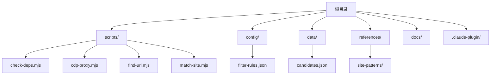
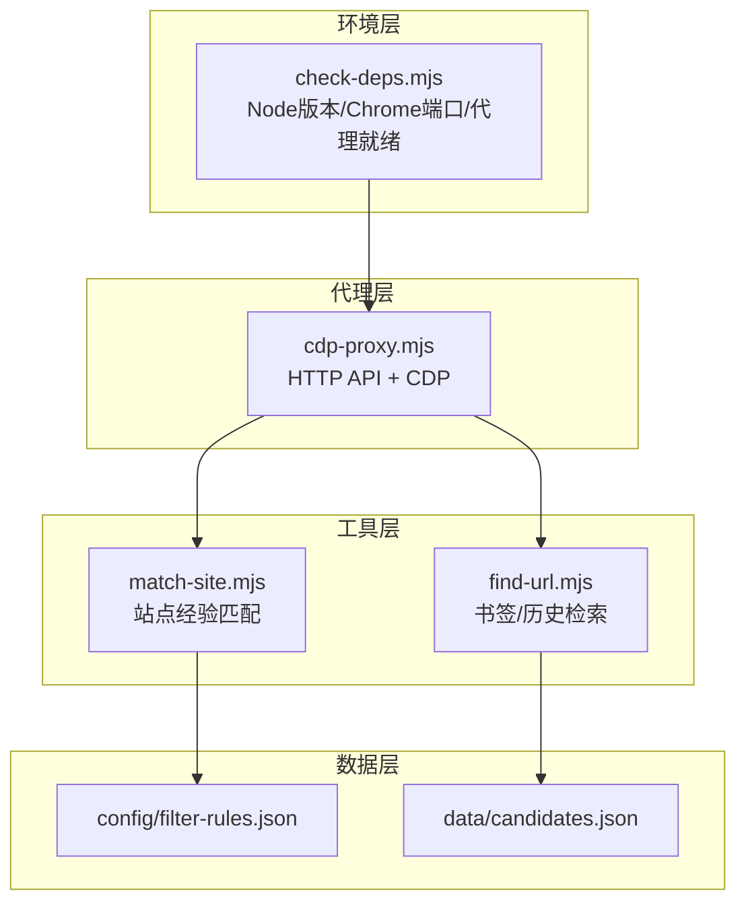
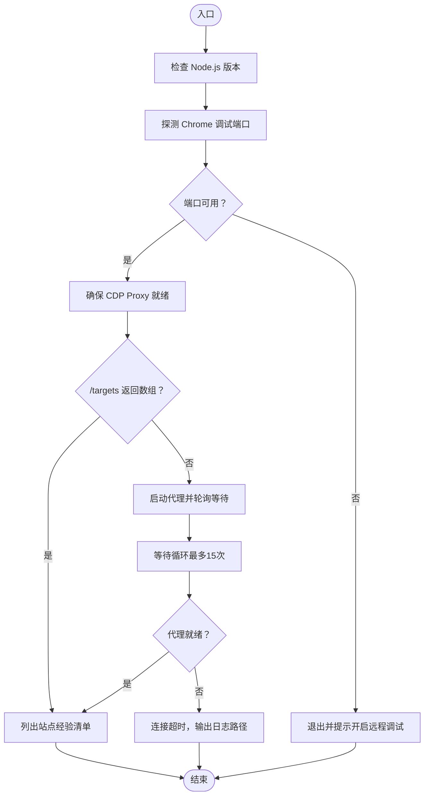
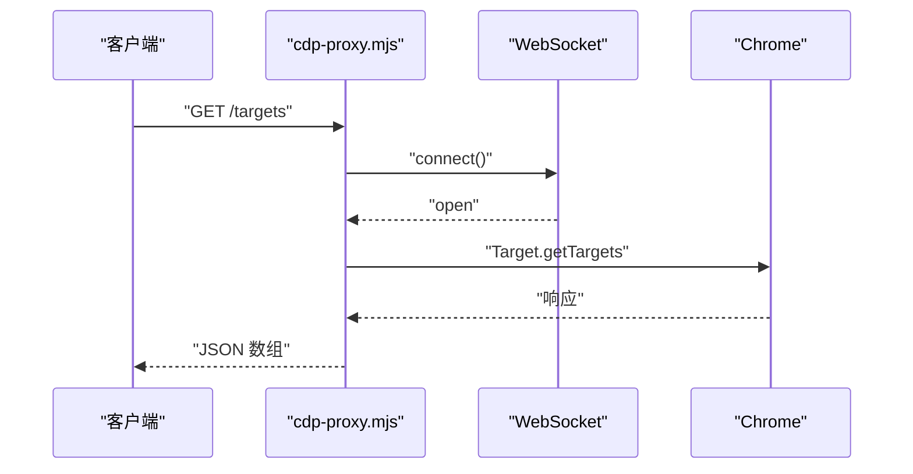
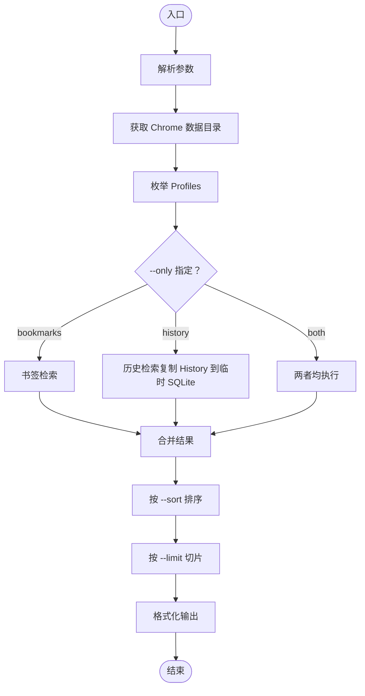
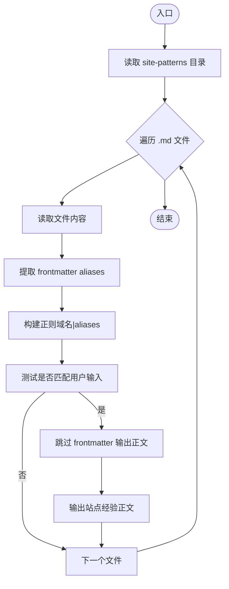
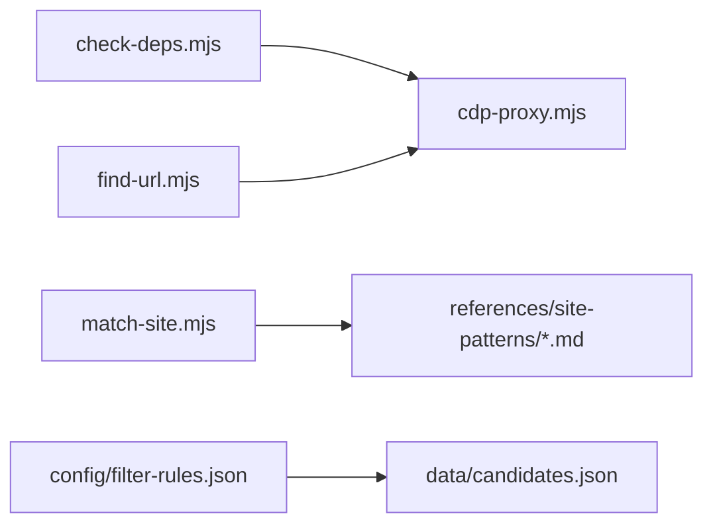

# 系统工具

<cite>
**本文引用的文件**
- [README.md](file://README.md)
- [package.json](file://package.json)
- [scripts/check-deps.mjs](file://scripts/check-deps.mjs)
- [scripts/cdp-proxy.mjs](file://scripts/cdp-proxy.mjs)
- [scripts/find-url.mjs](file://scripts/find-url.mjs)
- [scripts/match-site.mjs](file://scripts/match-site.mjs)
- [config/filter-rules.json](file://config/filter-rules.json)
- [data/candidates.json](file://data/candidates.json)
</cite>

## 目录
1. [简介](#简介)
2. [项目结构](#项目结构)
3. [核心组件](#核心组件)
4. [架构总览](#架构总览)
5. [详细组件分析](#详细组件分析)
6. [依赖关系分析](#依赖关系分析)
7. [性能考虑](#性能考虑)
8. [故障排查指南](#故障排查指南)
9. [结论](#结论)
10. [附录](#附录)

## 简介
本文件为“系统工具集”的综合性技术文档，聚焦以下能力：
- 环境检查工具：实现 Node.js 版本、Chrome 调试端口、CDP Proxy 就绪性检测，以及站点经验清单展示。
- 本地 Chrome 资源检索：从书签/历史中按关键词、时间窗、访问频度进行查询与排序，辅助定位内部系统、SSO 后台、内网域名等公网不可达目标。
- 站点匹配与平台特征库：基于 Markdown frontmatter 的站点经验匹配，支持别名与正文输出。
- 工具使用场景、配置选项与扩展方法：涵盖参数解析、跨平台用户数据目录、Profile 枚举、SQLite 历史副本与查询、输出格式化等。
- 故障诊断与性能优化：连接超时、授权弹窗、sqlite3 缺失、端口占用、Node 版本与 WebSocket 兼容等问题的定位与建议。

## 项目结构
仓库采用脚本驱动的工具集组织方式，核心位于 scripts/ 目录，配合 config/ 与 data/ 存放规则与候选数据，references/ 用于站点经验库（site-patterns），docs/ 与 .claude-plugin/ 为文档与插件元数据。

图表来源
- [scripts/check-deps.mjs](file://scripts/check-deps.mjs)
- [scripts/cdp-proxy.mjs](file://scripts/cdp-proxy.mjs)
- [scripts/find-url.mjs](file://scripts/find-url.mjs)
- [scripts/match-site.mjs](file://scripts/match-site.mjs)
- [config/filter-rules.json](file://config/filter-rules.json)
- [data/candidates.json](file://data/candidates.json)

章节来源
- [README.md: 104-117:104-117](file://README.md#L104-L117)
- [package.json: 1-11:1-11](file://package.json#L1-L11)

## 核心组件
- 环境检查与代理就绪保障：自动检测 Node.js 版本、Chrome 调试端口、启动/等待 CDP Proxy，输出现有站点经验清单。
- CDP Proxy：通过 HTTP API 控制本地 Chrome，提供新建/关闭 Tab、导航、后退、JS 执行、点击、滚动、截图、文件上传等能力。
- 本地 Chrome 资源检索：跨平台读取 Chrome 用户数据目录，枚举 Profile，检索书签与历史，支持关键词 AND、时间窗过滤、访问频度排序。
- 站点匹配：扫描 site-patterns 目录，解析 frontmatter 别名，构建正则进行匹配，输出正文内容。

章节来源
- [scripts/check-deps.mjs: 143-172:143-172](file://scripts/check-deps.mjs#L143-L172)
- [scripts/cdp-proxy.mjs: 288-552:288-552](file://scripts/cdp-proxy.mjs#L288-L552)
- [scripts/find-url.mjs: 176-215:176-215](file://scripts/find-url.mjs#L176-L215)
- [scripts/match-site.mjs: 14-47:14-47](file://scripts/match-site.mjs#L14-L47)

## 架构总览
系统工具集围绕“环境检查 → 代理就绪 → 本地资源检索/站点匹配 → 结果输出”形成闭环。CDP Proxy 作为浏览器自动化中枢，为后续流程提供稳定连接与能力封装。

图表来源
- [scripts/check-deps.mjs: 143-172:143-172](file://scripts/check-deps.mjs#L143-L172)
- [scripts/cdp-proxy.mjs: 288-552:288-552](file://scripts/cdp-proxy.mjs#L288-L552)
- [scripts/find-url.mjs: 176-215:176-215](file://scripts/find-url.mjs#L176-L215)
- [scripts/match-site.mjs: 14-47:14-47](file://scripts/match-site.mjs#L14-L47)
- [config/filter-rules.json: 1-41:1-41](file://config/filter-rules.json#L1-L41)
- [data/candidates.json: 1-49:1-49](file://data/candidates.json#L1-L49)

## 详细组件分析

### 环境检查工具（check-deps.mjs）
- 功能要点
  - Node.js 版本检查：要求 Node.js 22+，低于该版本给出警告。
  - Chrome 调试端口探测：优先读取 DevToolsActivePort 文件，回退常见端口；使用 TCP 探测避免触发授权弹窗。
  - CDP Proxy 启动与等待：若 /targets 非数组则尝试启动代理，轮询等待就绪，提示授权弹窗情况。
  - 站点经验清单：列出 references/site-patterns 下的站点经验文件名。
- 依赖与配置
  - 依赖：Node.js 原生模块（child_process、fs、net、os、path、url）。
  - 环境变量：CDP_PROXY_PORT（默认 3456）。
- 错误处理
  - Chrome 未连接：提示开启 chrome://inspect/#remote-debugging 并勾选“允许远程调试”。
  - 代理连接超时：输出日志路径，便于定位问题。
- 性能与健壮性
  - TCP 探测避免 WebSocket 触发授权弹窗，提升连接稳定性。
  - 代理启动采用异步等待与日志文件记录，降低阻塞。

图表来源
- [scripts/check-deps.mjs: 17-172:17-172](file://scripts/check-deps.mjs#L17-L172)

章节来源
- [scripts/check-deps.mjs: 17-172:17-172](file://scripts/check-deps.mjs#L17-L172)

### CDP Proxy（cdp-proxy.mjs）
- 功能要点
  - 自动发现 Chrome 调试端口：读取 DevToolsActivePort 或扫描常见端口。
  - WebSocket 连接管理：兼容 Node.js 原生 WebSocket 与 ws 模块，处理连接/错误/关闭事件。
  - 会话管理：Target.attachToTarget 获取 sessionId，启用 Fetch 拦截以反风控。
  - HTTP API：/targets、/new、/close、/navigate、/back、/info、/eval、/click、/clickAt、/setFiles、/scroll、/screenshot。
  - 等待页面加载：通过 Runtime.evaluate 轮询 document.readyState。
- 依赖与配置
  - 依赖：Node.js 原生模块（http、URL、fs、path、os、net）。
  - 环境变量：CDP_PROXY_PORT（默认 3456）。
  - 可选依赖：ws 模块（Node < 22）。
- 错误处理
  - 未安装 ws 且 Node < 22：提示升级或安装 ws。
  - Chrome 未开启远程调试：提供启动方式说明。
  - 连接失败/超时：清理缓存并提示重试。
- 性能与健壮性
  - 复用进行中的连接，避免重复握手。
  - Fetch 拦截仅针对 127.0.0.1:port，减少对其他服务的影响。

图表来源
- [scripts/cdp-proxy.mjs: 305-310:305-310](file://scripts/cdp-proxy.mjs#L305-L310)

章节来源
- [scripts/cdp-proxy.mjs: 35-200:35-200](file://scripts/cdp-proxy.mjs#L35-L200)
- [scripts/cdp-proxy.mjs: 288-552:288-552](file://scripts/cdp-proxy.mjs#L288-L552)

### 本地 Chrome 资源检索（find-url.mjs）
- 功能要点
  - 参数解析：关键词（AND）、--only（bookmarks/history）、--limit、--since（1d/7h/30m/YYYY-MM-DD）、--sort（recent/visits）。
  - 跨平台用户数据目录：根据操作系统返回 Chrome 数据目录。
  - Profile 枚举：读取 Local State 的 info_cache，回退至 Default。
  - 书签检索：遍历 Bookmarks JSON，按关键词匹配 title+url，支持文件夹路径标注。
  - 历史检索：复制 History 到临时 SQLite，构建 SQL 查询（关键词 LIKE、时间窗、排序），调用 sqlite3 命令行执行。
  - 输出格式化：字段分隔符为“|”，特殊字符替换为“│”，按 profile 分组显示。
- 依赖与配置
  - 依赖：Node.js 原生模块（fs、path、os、child_process）。
  - 外部工具：sqlite3（macOS/Linux 通常自带；Windows 需安装）。
- 错误处理
  - 未找到 sqlite3：提示安装方式。
  - 未找到 Chrome 用户数据目录：提示未找到。
  - 无关键词查询书签：提示无意义并建议切换 --only history。
- 性能与健壮性
  - 历史查询先按 limit*2 收集再全局排序，减少最终切片成本。
  - 临时文件清理，避免残留。

图表来源
- [scripts/find-url.mjs: 27-215:27-215](file://scripts/find-url.mjs#L27-L215)

章节来源
- [scripts/find-url.mjs: 27-215:27-215](file://scripts/find-url.mjs#L27-L215)

### 站点匹配与平台特征库（match-site.mjs）
- 功能要点
  - 扫描 references/site-patterns 下的 .md 文件，提取 frontmatter 中的 aliases。
  - 构建正则模式（域名 + 别名），忽略大小写匹配用户输入。
  - 跳过 frontmatter，输出正文内容，便于后续流程复用。
- 依赖与配置
  - 依赖：Node.js 原生模块（fs、path）。
  - 输入：process.argv[2] 为用户输入文本。
- 错误处理
  - 目录不存在或无 .md 文件：静默退出。
- 扩展方法
  - 在 site-patterns 中新增 .md 文件，按 frontmatter 定义 aliases，即可参与匹配。

图表来源
- [scripts/match-site.mjs: 14-47:14-47](file://scripts/match-site.mjs#L14-L47)

章节来源
- [scripts/match-site.mjs: 14-47:14-47](file://scripts/match-site.mjs#L14-L47)

### 配置与数据（config/filter-rules.json、data/candidates.json）
- 配置（filter-rules.json）
  - 用途：简历筛选规则，定义 mustHave、preferred（含权重与正则）、阈值等。
  - 应用：结合 candidates.json 的候选人数据进行评分与过滤。
- 数据（candidates.json）
  - 用途：候选人集合，包含基本信息与期望岗位等字段。
  - 结果：输出 scored-candidates.json（由评分脚本生成，参考 README）。

章节来源
- [config/filter-rules.json: 1-41:1-41](file://config/filter-rules.json#L1-L41)
- [data/candidates.json: 1-49:1-49](file://data/candidates.json#L1-L49)

## 依赖关系分析
- 脚本间耦合
  - check-deps.mjs 与 cdp-proxy.mjs：前者负责代理就绪，后者提供代理能力。
  - find-url.mjs 与 cdp-proxy.mjs：前者依赖代理提供的浏览器自动化能力（间接，通过环境检查保障）。
  - match-site.mjs 与 references/site-patterns：纯文件系统扫描与解析。
- 外部依赖
  - Node.js 22+（原生 WebSocket）。
  - Chrome 远程调试端口开启。
  - sqlite3 命令行（Windows 需安装）。
  - 可选 ws 模块（Node < 22）。

图表来源
- [scripts/check-deps.mjs: 143-172:143-172](file://scripts/check-deps.mjs#L143-L172)
- [scripts/cdp-proxy.mjs: 288-552:288-552](file://scripts/cdp-proxy.mjs#L288-L552)
- [scripts/find-url.mjs: 176-215:176-215](file://scripts/find-url.mjs#L176-L215)
- [scripts/match-site.mjs: 14-47:14-47](file://scripts/match-site.mjs#L14-L47)
- [config/filter-rules.json: 1-41:1-41](file://config/filter-rules.json#L1-L41)
- [data/candidates.json: 1-49:1-49](file://data/candidates.json#L1-L49)

## 性能考虑
- 环境检查
  - TCP 探测避免 WebSocket 触发授权弹窗，减少不必要的交互。
  - 代理启动后延迟等待，避免立即超时。
- 本地资源检索
  - 历史查询先扩大采样（limit*2）再排序，降低多次 IO 成本。
  - 临时 SQLite 文件及时清理，避免磁盘占用。
- 站点匹配
  - 正则构建一次，逐文件测试，frontmatter 解析轻量。
- 代理层
  - 复用进行中的连接，减少握手次数。
  - Fetch 拦截按会话启用，避免重复配置。

## 故障排查指南
- Chrome 未开启远程调试
  - 现象：环境检查提示未连接或代理连接超时。
  - 处理：打开 chrome://inspect/#remote-debugging 并勾选“允许远程调试”。
- 代理连接超时
  - 现象：输出“Chrome 可能有授权弹窗，请点击‘允许’后等待连接...”。
  - 处理：点击授权，等待代理就绪；查看临时日志文件定位问题。
- 未找到 sqlite3 命令
  - 现象：历史检索报错提示安装。
  - 处理：macOS/Linux 通常自带；Windows 使用包管理器或官网下载后加入 PATH。
- 端口占用
  - 现象：CDP Proxy 提示端口已被占用。
  - 处理：更换端口或释放占用进程。
- Node.js 版本过低
  - 现象：check-deps.mjs 输出警告。
  - 处理：升级到 Node.js 22+。
- 未安装 ws 模块（Node < 22）
  - 现象：代理初始化时报错。
  - 处理：安装 ws 模块或升级 Node.js。

章节来源
- [scripts/check-deps.mjs: 147-156:147-156](file://scripts/check-deps.mjs#L147-L156)
- [scripts/find-url.mjs: 144-145:144-145](file://scripts/find-url.mjs#L144-L145)
- [scripts/cdp-proxy.mjs: 26-33:26-33](file://scripts/cdp-proxy.mjs#L26-L33)
- [scripts/cdp-proxy.mjs: 564-584:564-584](file://scripts/cdp-proxy.mjs#L564-L584)

## 结论
本系统工具集通过环境检查与代理就绪保障，为浏览器自动化提供稳定基础；本地 Chrome 资源检索与站点匹配分别解决“定位不可达目标”和“复用平台经验”的核心痛点；配置与数据文件为后续评分与筛选提供支撑。整体设计强调跨平台、可扩展与可观测性，适合在多 Agent 生态中复用与集成。

## 附录
- 使用场景
  - 定位内部系统/SSO 后台：使用 find-url.mjs 按关键词与时间窗检索。
  - 复用站点经验：使用 match-site.mjs 基于 aliases 与域名匹配。
  - 自动化页面操作：通过 CDP Proxy 的 HTTP API 实现导航、点击、截图等。
- 配置选项
  - find-url.mjs：--only、--limit、--since、--sort。
  - check-deps.mjs：CDP_PROXY_PORT。
  - cdp-proxy.mjs：CDP_PROXY_PORT。
- 扩展方法
  - 新增站点经验：在 references/site-patterns 下添加 .md 文件并定义 aliases。
  - 自定义筛选规则：调整 config/filter-rules.json。
  - 增强历史检索：可扩展 SQL 查询条件或引入索引优化（需评估 SQLite 性能）。