# 数据持久化计划

<cite>
**本文档引用的文件**
- [README.md](file://README.md)
- [SKILL.md](file://SKILL.md)
- [package.json](file://package.json)
- [2026-04-22-extraction-persistence-design.md](file://docs/superpowers/specs/2026-04-22-extraction-persistence-design.md)
- [2026-04-22-extraction-persistence-plan.md](file://docs/superpowers/plans/2026-04-22-extraction-persistence-plan.md)
- [2026-04-22-boss-zhipin-full-extraction-design.md](file://docs/superpowers/specs/2026-04-22-boss-zhipin-full-extraction-design.md)
- [2026-04-22-boss-zhipin-full-extraction-v3.md](file://docs/superpowers/plans/2026-04-22-boss-zhipin-full-extraction-v3.md)
- [2026-04-23-candidate-filtering-scoring-design.md](file://docs/superpowers/specs/2026-04-23-candidate-filtering-scoring-design.md)
- [2026-04-23-candidate-filtering-scoring.md](file://docs/superpowers/plans/2026-04-23-candidate-filtering-scoring.md)
- [2026-04-22-cdp-script-execution-fix-design.md](file://docs/superpowers/specs/2026-04-22-cdp-script-execution-fix-design.md)
- [candidates.json](file://data/candidates.json)
- [zhipin-candidates.json](file://output/zhipin-candidates.json)
- [scored-candidates.json](file://output/scored-candidates.json)
- [filter-rules.json](file://config/filter-rules.json)
- [fetch-resumes.mjs](file://scripts/fetch-resumes.mjs)
- [score-candidates.mjs](file://scripts/score-candidates.mjs)
- [export-candidates.mjs](file://scripts/export-candidates.mjs)
- [zhipin.com.md](file://references/site-patterns/zhipin.com.md)
</cite>

## 目录
1. [简介](#简介)
2. [项目结构](#项目结构)
3. [核心组件](#核心组件)
4. [架构概览](#架构概览)
5. [详细组件分析](#详细组件分析)
6. [依赖分析](#依赖分析)
7. [性能考虑](#性能考虑)
8. [故障排除指南](#故障排除指南)
9. [结论](#结论)
10. [附录](#附录)

## 简介

Web Access 项目是一个为 AI Agent 提供完整联网能力的 Skill，专注于候选人数据提取、筛选评分和简历管理。该项目采用纯文件系统存储策略，通过 JSON 文件实现数据持久化，避免了传统数据库的复杂性和维护成本。

项目的核心价值在于提供了一套完整的候选人数据生命周期管理方案，从数据提取、存储、筛选、导出到最终的简历管理，形成了一个闭环的数据处理流水线。

## 项目结构

项目采用模块化的文件组织结构，主要包含以下几个核心目录：

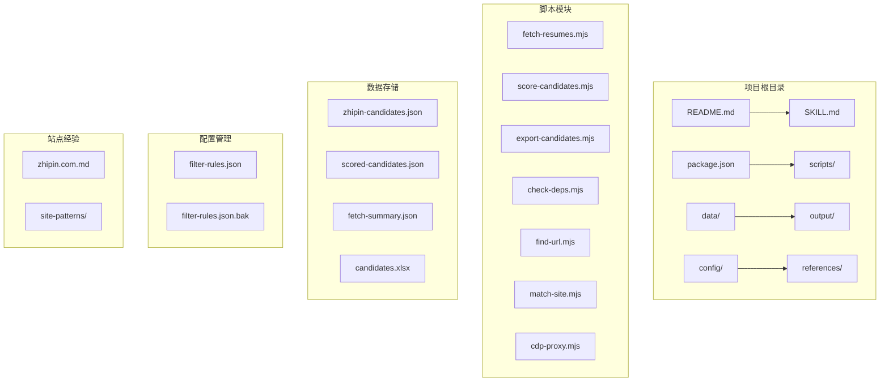

**图表来源**
- [package.json:1-11](file://package.json#L1-L11)
- [README.md:1-168](file://README.md#L1-L168)

**章节来源**
- [README.md:1-168](file://README.md#L1-L168)
- [package.json:1-11](file://package.json#L1-L11)

## 核心组件

### 数据存储策略

项目采用纯文件系统存储策略，所有数据都以 JSON 格式保存在本地文件中。这种设计具有以下特点：

1. **简单可靠**：无需数据库配置和维护
2. **版本友好**：文件可以轻松纳入版本控制系统
3. **易于备份**：文件系统级别的备份和恢复
4. **透明可审计**：数据内容完全可见

### 数据流转架构

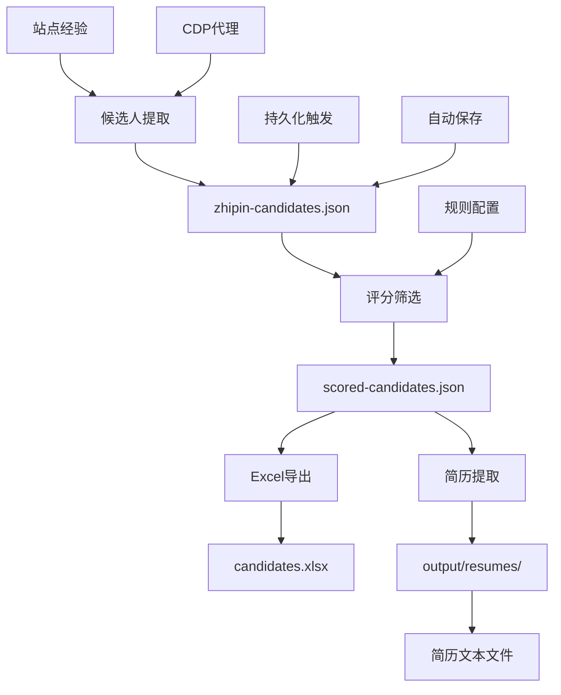

**图表来源**
- [2026-04-22-extraction-persistence-design.md:26-81](file://docs/superpowers/specs/2026-04-22-extraction-persistence-design.md#L26-L81)
- [SKILL.md:130-153](file://SKILL.md#L130-L153)

**章节来源**
- [2026-04-22-extraction-persistence-design.md:1-146](file://docs/superpowers/specs/2026-04-22-extraction-persistence-design.md#L1-L146)
- [SKILL.md:130-243](file://SKILL.md#L130-L243)

## 架构概览

### 数据持久化架构

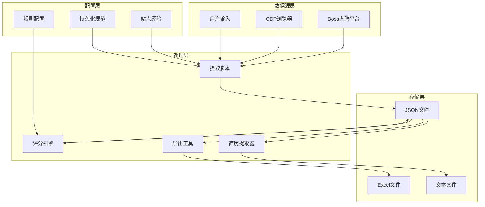

**图表来源**
- [2026-04-22-boss-zhipin-full-extraction-design.md:116-246](file://docs/superpowers/specs/2026-04-22-boss-zhipin-full-extraction-design.md#L116-L246)
- [2026-04-22-extraction-persistence-design.md:26-81](file://docs/superpowers/specs/2026-04-22-extraction-persistence-design.md#L26-L81)

### 数据存储层次结构

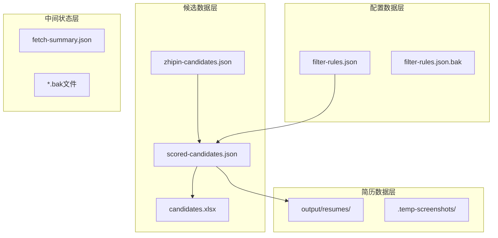

**图表来源**
- [zhipin-candidates.json:1-134](file://output/zhipin-candidates.json#L1-L134)
- [scored-candidates.json:1-641](file://output/scored-candidates.json#L1-L641)
- [fetch-resumes.mjs:273-380](file://scripts/fetch-resumes.mjs#L273-L380)

**章节来源**
- [zhipin-candidates.json:1-134](file://output/zhipin-candidates.json#L1-L134)
- [scored-candidates.json:1-641](file://output/scored-candidates.json#L1-L641)
- [fetch-resumes.mjs:1-386](file://scripts/fetch-resumes.mjs#L1-L386)

## 详细组件分析

### 候选人数据存储结构

#### 原始候选人数据格式

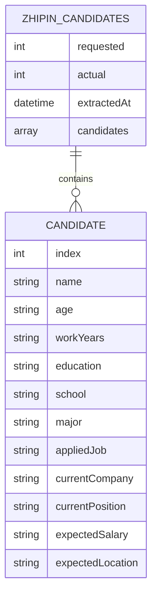

**图表来源**
- [candidates.json:1-49](file://data/candidates.json#L1-L49)
- [zhipin-candidates.json:1-134](file://output/zhipin-candidates.json#L1-L134)

#### 评分后的候选人数据格式

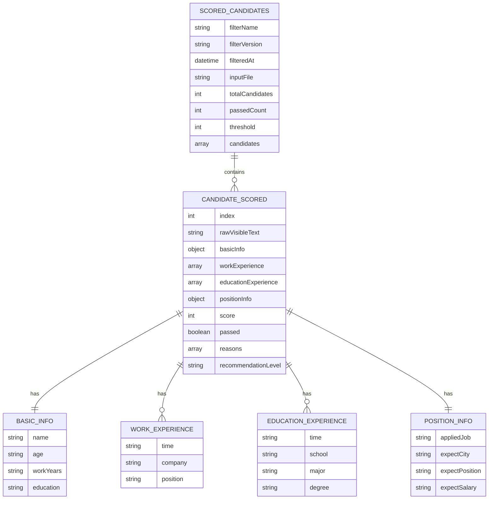

**图表来源**
- [scored-candidates.json:1-641](file://output/scored-candidates.json#L1-L641)

**章节来源**
- [candidates.json:1-49](file://data/candidates.json#L1-L49)
- [zhipin-candidates.json:1-134](file://output/zhipin-candidates.json#L1-L134)
- [scored-candidates.json:1-641](file://output/scored-candidates.json#L1-L641)

### 持久化机制设计

#### 自动保存触发器

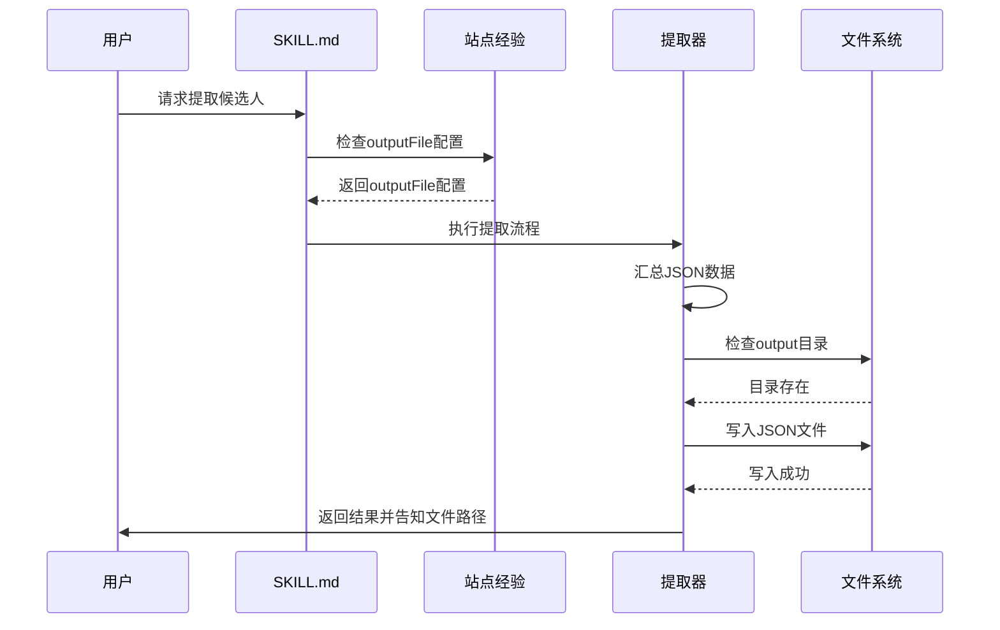

**图表来源**
- [2026-04-22-extraction-persistence-design.md:57-64](file://docs/superpowers/specs/2026-04-22-extraction-persistence-design.md#L57-L64)
- [SKILL.md:146-152](file://SKILL.md#L146-L152)

#### 持久化执行流程

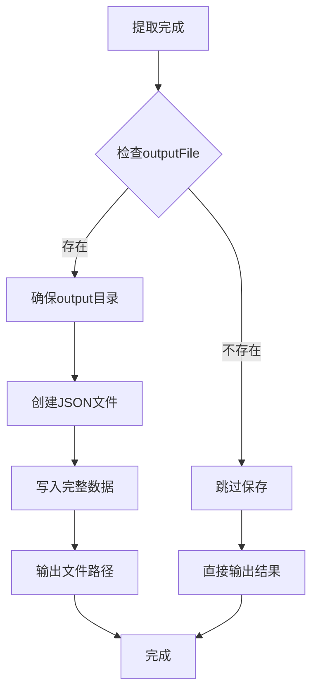

**图表来源**
- [2026-04-22-extraction-persistence-design.md:57-64](file://docs/superpowers/specs/2026-04-22-extraction-persistence-design.md#L57-L64)

**章节来源**
- [2026-04-22-extraction-persistence-design.md:26-81](file://docs/superpowers/specs/2026-04-22-extraction-persistence-design.md#L26-L81)
- [2026-04-22-extraction-persistence-plan.md:1-89](file://docs/superpowers/plans/2026-04-22-extraction-persistence-plan.md#L1-L89)

### 简历数据持久化机制

#### OCR简历提取流程

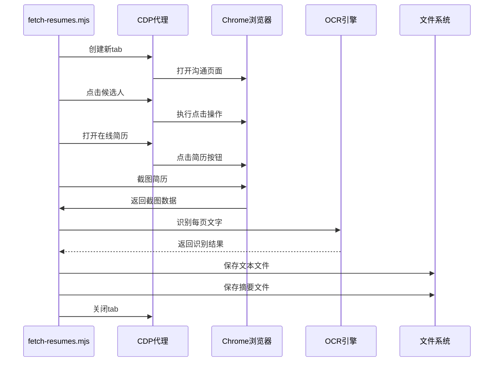

**图表来源**
- [fetch-resumes.mjs:306-350](file://scripts/fetch-resumes.mjs#L306-L350)

#### 简历存储结构

```mermaid
graph TB
subgraph "简历存储目录"
A[output/resumes/]
B[.temp-screenshots/]
end
subgraph "简历文件"
C[{name}-{index}.txt]
D[fetch-summary.json]
end
subgraph "临时文件"
E[*.png截图]
end
A --> C
A --> D
A --> B
B --> E
```

**图表来源**
- [fetch-resumes.mjs:273-279](file://scripts/fetch-resumes.mjs#L273-L279)

**章节来源**
- [fetch-resumes.mjs:1-386](file://scripts/fetch-resumes.mjs#L1-L386)
- [zhipin.com.md:404-447](file://references/site-patterns/zhipin.com.md#L404-L447)

### 数据筛选和评分系统

#### 评分规则配置

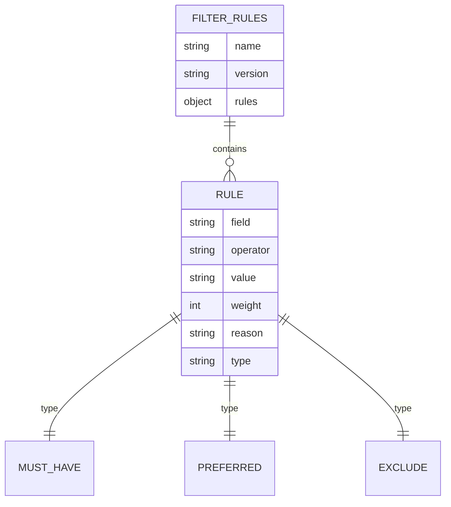

**图表来源**
- [filter-rules.json:1-41](file://config/filter-rules.json#L1-L41)

#### 评分计算流程

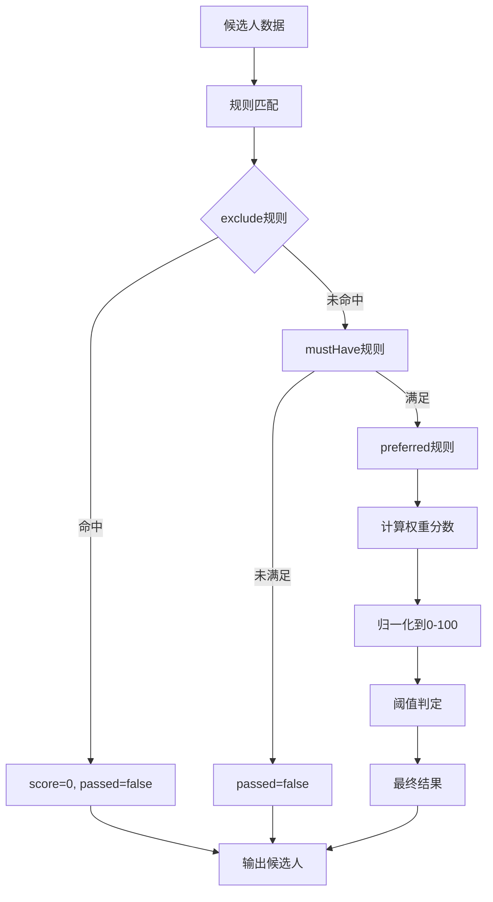

**图表来源**
- [score-candidates.mjs:230-340](file://scripts/score-candidates.mjs#L230-L340)

**章节来源**
- [filter-rules.json:1-41](file://config/filter-rules.json#L1-L41)
- [score-candidates.mjs:1-406](file://scripts/score-candidates.mjs#L1-L406)

### 数据导出机制

#### Excel导出流程

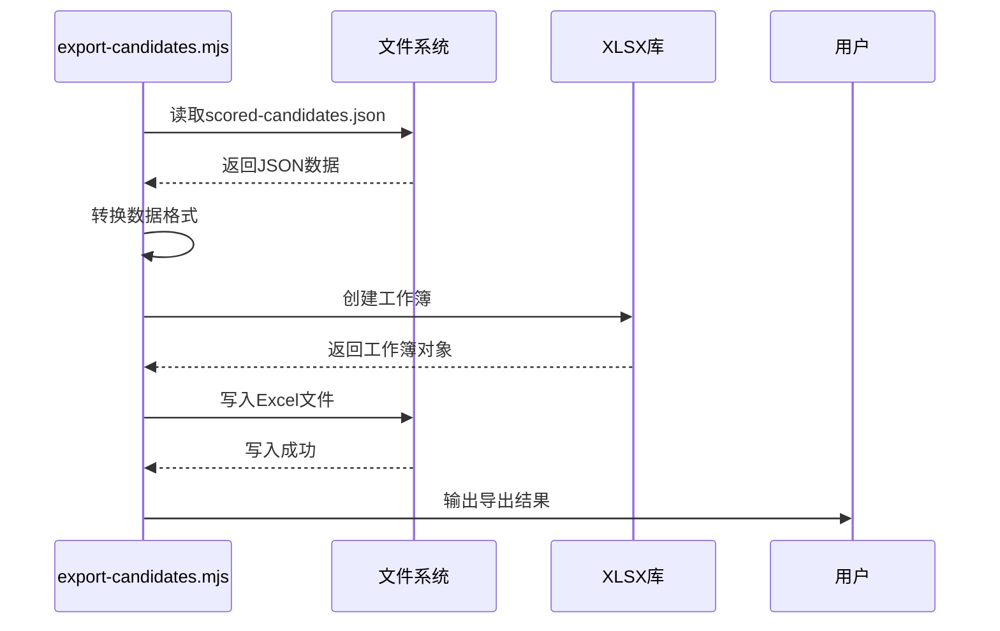

**图表来源**
- [export-candidates.mjs:155-195](file://scripts/export-candidates.mjs#L155-L195)

**章节来源**
- [export-candidates.mjs:1-203](file://scripts/export-candidates.mjs#L1-L203)

## 依赖分析

### 外部依赖关系

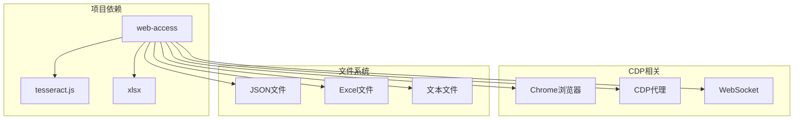

**图表来源**
- [package.json:6-9](file://package.json#L6-L9)

### 内部模块依赖

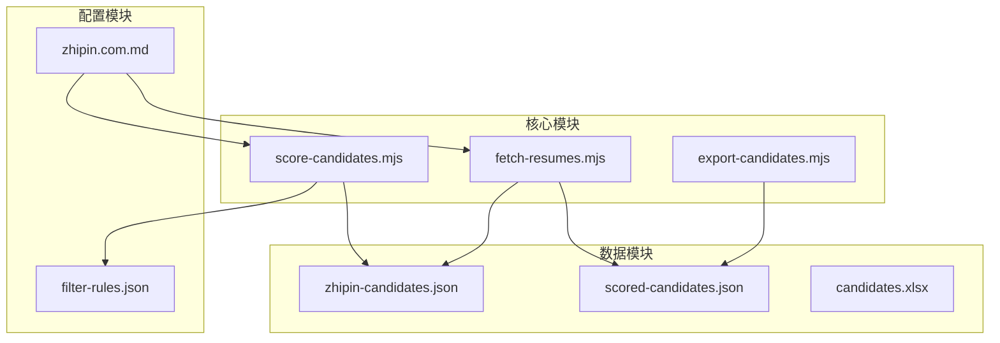

**图表来源**
- [fetch-resumes.mjs:254-261](file://scripts/fetch-resumes.mjs#L254-L261)
- [score-candidates.mjs:346-351](file://scripts/score-candidates.mjs#L346-L351)
- [export-candidates.mjs:158-161](file://scripts/export-candidates.mjs#L158-L161)

**章节来源**
- [package.json:1-11](file://package.json#L1-L11)
- [zhipin.com.md:1-462](file://references/site-patterns/zhipin.com.md#L1-L462)

## 性能考虑

### 存储性能优化

1. **文件大小控制**：采用增量更新策略，避免单个文件过大
2. **内存使用优化**：分批处理大量候选人数据
3. **I/O操作优化**：批量写入减少磁盘I/O次数

### 处理效率提升

1. **并行处理**：简历提取支持并发处理多个候选人
2. **缓存机制**：OCR引擎复用，避免重复初始化
3. **临时文件管理**：及时清理临时截图文件

### 扩展性设计

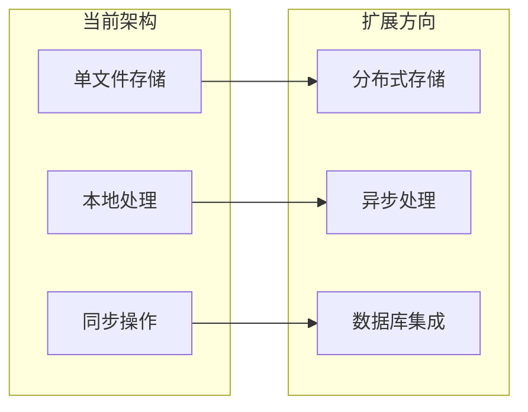

## 故障排除指南

### 常见问题及解决方案

#### 数据持久化问题

| 问题类型 | 症状 | 解决方案 |
|---------|------|----------|
| 文件保存失败 | 报告权限错误 | 检查output目录权限，确保可写 |
| JSON格式错误 | 解析失败 | 验证JSON格式，检查特殊字符 |
| 文件覆盖问题 | 历史数据丢失 | 使用备份文件，启用版本控制 |

#### 简历提取问题

| 问题类型 | 症状 | 解决方案 |
|---------|------|----------|
| OCR识别失败 | 文本为空 | 检查截图质量，调整OCR参数 |
| Canvas渲染问题 | 空白页面 | 等待页面完全加载，检查反爬措施 |
| 文件命名冲突 | 覆盖现有文件 | 使用唯一标识符，避免重名 |

#### 性能问题

| 问题类型 | 症状 | 解决方案 |
|---------|------|----------|
| 处理速度慢 | 大量候选人处理缓慢 | 实施分批处理，优化OCR性能 |
| 内存占用高 | 处理大型文件时内存不足 | 实施流式处理，定期清理临时文件 |

**章节来源**
- [fetch-resumes.mjs:339-345](file://scripts/fetch-resumes.mjs#L339-L345)
- [zhipin.com.md:448-462](file://references/site-patterns/zhipin.com.md#L448-L462)

## 结论

Web Access 项目通过纯文件系统存储策略，成功实现了候选人数据的完整生命周期管理。该方案具有以下优势：

1. **简单可靠**：无需复杂的数据库配置和维护
2. **版本友好**：文件可以轻松纳入版本控制系统
3. **透明可审计**：数据内容完全可见，便于调试和分析
4. **成本低廉**：避免了数据库服务器和维护成本

同时，项目在数据持久化方面也存在一些局限性：

1. **扩展性限制**：不适合大规模并发访问场景
2. **查询能力有限**：无法进行复杂的SQL查询和分析
3. **数据一致性**：缺乏事务支持和原子操作

未来可以考虑在保持现有简单性的基础上，逐步引入轻量级的数据库解决方案，以平衡易用性和功能需求。

## 附录

### 数据备份策略

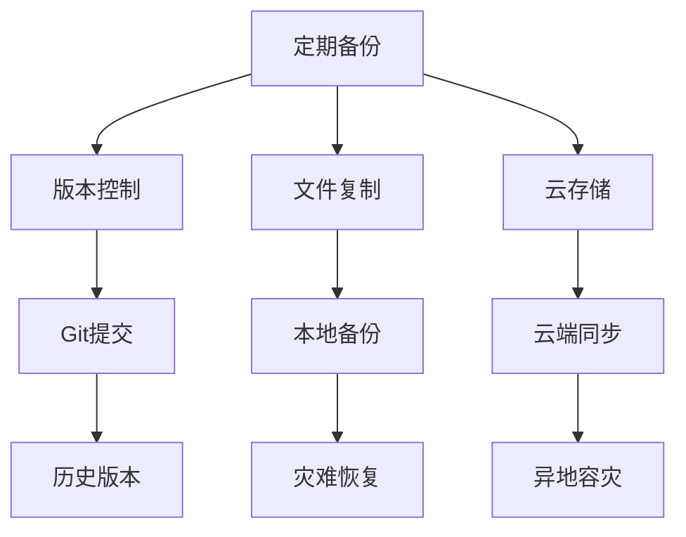

### 数据迁移计划

| 阶段 | 目标 | 时间 | 风险评估 |
|------|------|------|----------|
| 第1阶段 | 现有数据导出 | 1周 | 低 |
| 第2阶段 | 新旧系统并行 | 2周 | 中 |
| 第3阶段 | 旧系统停用 | 1周 | 高 |
| 第4阶段 | 新系统监控 | 持续 | 低 |

### 性能监控指标

- **数据处理吞吐量**：候选人/分钟
- **文件写入延迟**：毫秒级
- **OCR识别准确率**：百分比
- **系统可用性**：百分比
- **存储空间使用**：GB/月