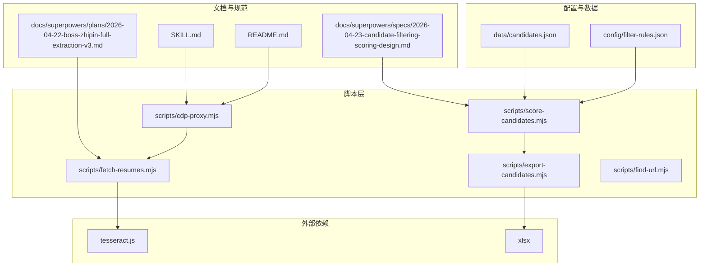
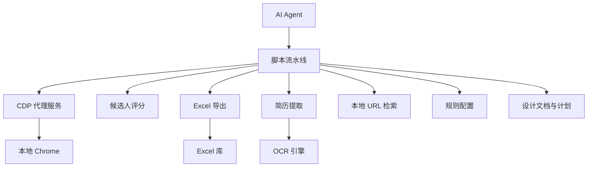
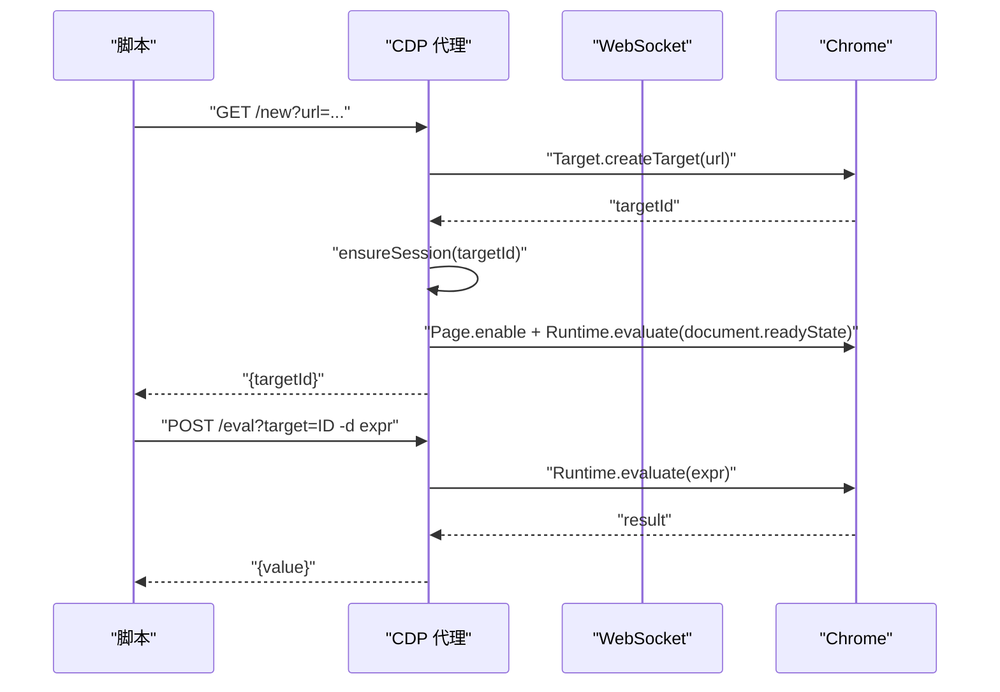
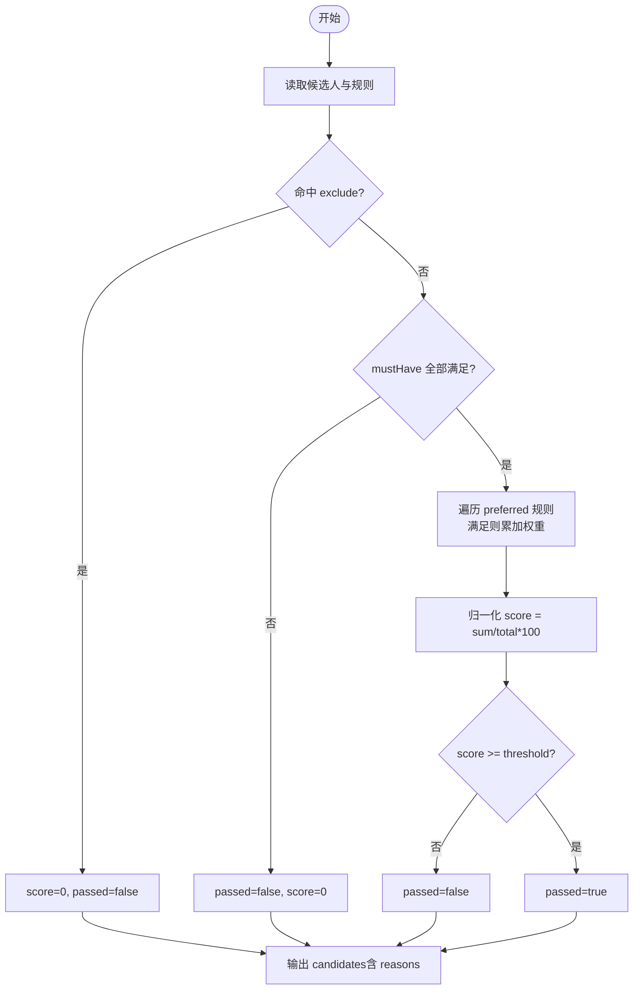
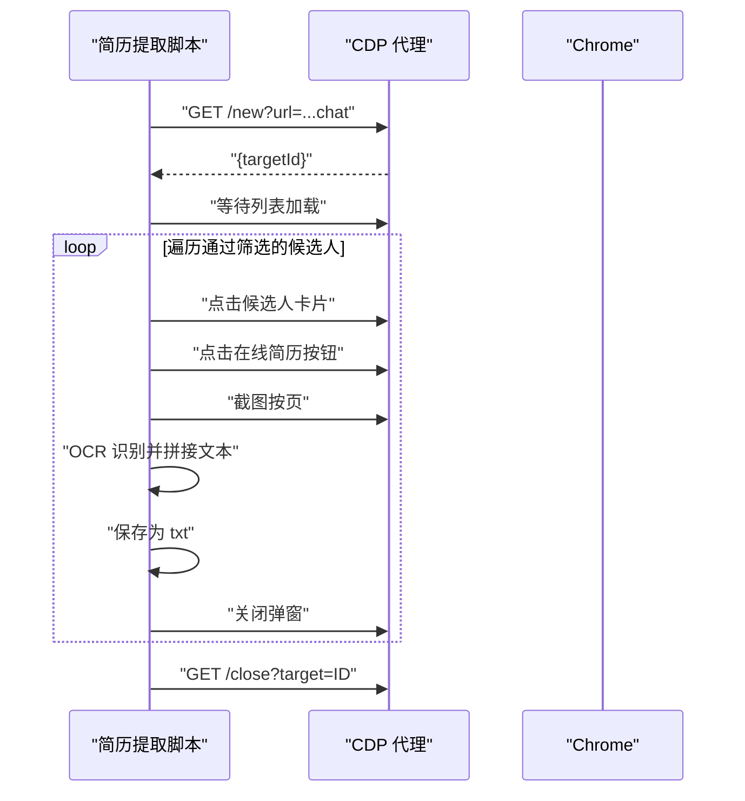
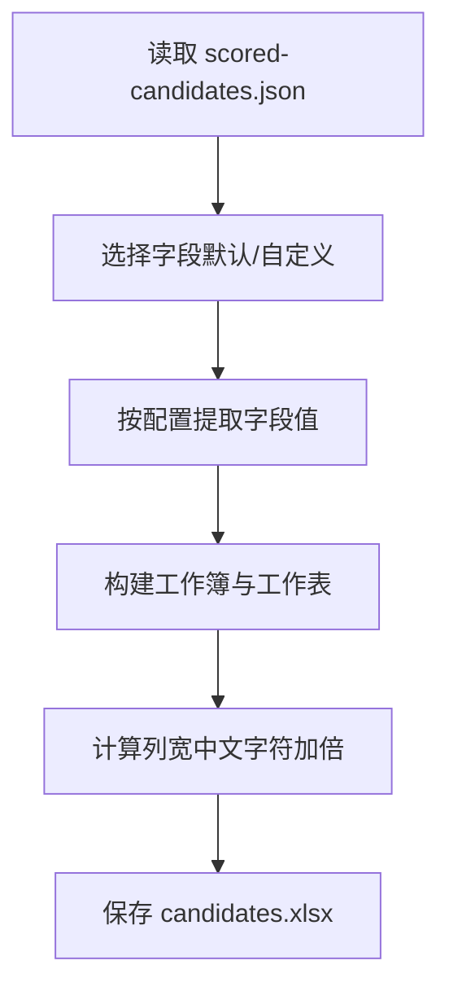
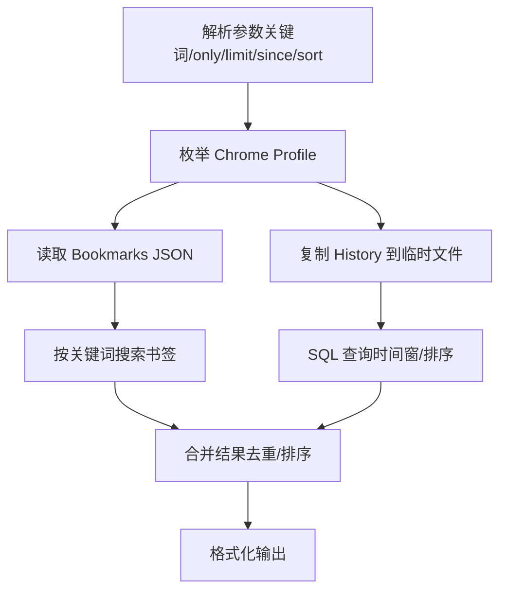
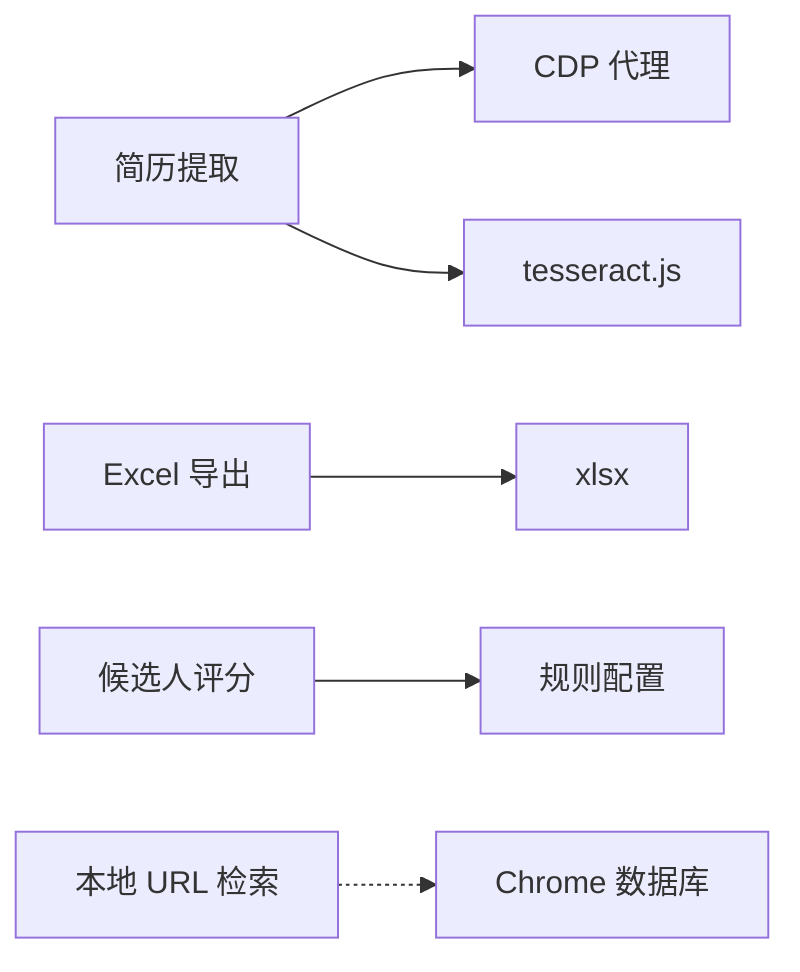

# 架构设计

<cite>
**本文引用的文件**
- [README.md](file://README.md)
- [SKILL.md](file://SKILL.md)
- [package.json](file://package.json)
- [scripts/cdp-proxy.mjs](file://scripts/cdp-proxy.mjs)
- [scripts/score-candidates.mjs](file://scripts/score-candidates.mjs)
- [scripts/export-candidates.mjs](file://scripts/export-candidates.mjs)
- [scripts/fetch-resumes.mjs](file://scripts/fetch-resumes.mjs)
- [scripts/find-url.mjs](file://scripts/find-url.mjs)
- [config/filter-rules.json](file://config/filter-rules.json)
- [data/candidates.json](file://data/candidates.json)
- [docs/superpowers/specs/2026-04-23-candidate-filtering-scoring-design.md](file://docs/superpowers/specs/2026-04-23-candidate-filtering-scoring-design.md)
- [docs/superpowers/plans/2026-04-22-boss-zhipin-full-extraction-v3.md](file://docs/superpowers/plans/2026-04-22-boss-zhipin-full-extraction-v3.md)
</cite>

## 目录
1. [简介](#简介)
2. [项目结构](#项目结构)
3. [核心组件](#核心组件)
4. [架构总览](#架构总览)
5. [详细组件分析](#详细组件分析)
6. [依赖关系分析](#依赖关系分析)
7. [性能考量](#性能考量)
8. [故障排查指南](#故障排查指南)
9. [结论](#结论)
10. [附录](#附录)

## 简介
本项目是一个面向 AI Agent 的“Web 访问技能”，旨在为 Agent 提供完整的联网与浏览器自动化能力。系统围绕“CDP 代理服务 + 站点经验 + 候选人筛选评分 + 简历提取 + 数据导出”的闭环设计，实现从站点经验到数据产出的全流程自动化。项目强调“像人一样思考”的浏览哲学，通过直连用户本地 Chrome 的 CDP 模式，天然携带登录态，支持动态页面、交互操作、媒体提取与视频截帧，同时内置反风控与端口探测拦截机制。

## 项目结构
项目采用“脚本驱动 + 配置 + 文档”的模块化组织方式，核心文件分布如下：
- scripts：核心业务脚本（CDP 代理、候选人评分、简历提取、Excel 导出、本地 URL 检索）
- config：规则配置（筛选规则）
- data：示例数据（候选人样本）
- docs/superpowers：设计文档与实现计划（评分设计、站点提取计划等）
- README.md、SKILL.md：项目说明与技能规范
- package.json：依赖声明（OCR、Excel 导出）

**图表来源**
- [scripts/cdp-proxy.mjs:1-602](file://scripts/cdp-proxy.mjs#L1-L602)
- [scripts/score-candidates.mjs:1-406](file://scripts/score-candidates.mjs#L1-L406)
- [scripts/export-candidates.mjs:1-203](file://scripts/export-candidates.mjs#L1-L203)
- [scripts/fetch-resumes.mjs:1-386](file://scripts/fetch-resumes.mjs#L1-L386)
- [scripts/find-url.mjs:1-215](file://scripts/find-url.mjs#L1-L215)
- [config/filter-rules.json:1-41](file://config/filter-rules.json#L1-L41)
- [data/candidates.json:1-49](file://data/candidates.json#L1-L49)
- [docs/superpowers/specs/2026-04-23-candidate-filtering-scoring-design.md:1-270](file://docs/superpowers/specs/2026-04-23-candidate-filtering-scoring-design.md#L1-L270)
- [docs/superpowers/plans/2026-04-22-boss-zhipin-full-extraction-v3.md:1-67](file://docs/superpowers/plans/2026-04-22-boss-zhipin-full-extraction-v3.md#L1-L67)
- [README.md:1-168](file://README.md#L1-L168)
- [SKILL.md:1-290](file://SKILL.md#L1-L290)

**章节来源**
- [README.md:1-168](file://README.md#L1-L168)
- [SKILL.md:1-290](file://SKILL.md#L1-L290)
- [package.json:1-11](file://package.json#L1-L11)

## 核心组件
- CDP 代理服务：通过 HTTP API 控制本地 Chrome，提供新建/关闭 Tab、导航、点击、滚动、截图、JS 执行等能力，内置端口发现、连接复用、反风控拦截与超时控制。
- 候选人筛选系统：基于规则配置对候选人进行评分与过滤，支持 mustHave/exclude/preferred 三类规则，支持数组字段遍历与正则匹配，输出带分数、推荐等级与原因明细的结果。
- 简历提取系统：对接 CDP 代理，自动打开沟通页，逐个点击候选人并打开在线简历弹窗，截图后使用 OCR 识别并保存为文本文件。
- 数据导出系统：将评分结果导出为 Excel，支持自定义字段与列宽自适应。
- 本地 URL 检索：从本地 Chrome 书签/历史中检索 URL，支持关键词、时间窗、排序与多 Profile。

**章节来源**
- [scripts/cdp-proxy.mjs:1-602](file://scripts/cdp-proxy.mjs#L1-L602)
- [scripts/score-candidates.mjs:1-406](file://scripts/score-candidates.mjs#L1-L406)
- [scripts/export-candidates.mjs:1-203](file://scripts/export-candidates.mjs#L1-L203)
- [scripts/fetch-resumes.mjs:1-386](file://scripts/fetch-resumes.mjs#L1-L386)
- [scripts/find-url.mjs:1-215](file://scripts/find-url.mjs#L1-L215)

## 架构总览
系统采用“代理服务 + 脚本流水线”的分层架构：
- 代理层：CDP 代理服务作为浏览器控制中枢，统一暴露 HTTP API，屏蔽底层 CDP 细节。
- 业务层：评分、导出、简历提取、URL 检索等脚本通过代理 API 与浏览器交互，形成可编排的工作流。
- 配置层：规则配置与站点经验文档驱动业务行为，确保一致性与可追溯性。
- 输出层：JSON 结果与 Excel 文件作为最终交付物，便于人工审阅与二次加工。

**图表来源**
- [scripts/cdp-proxy.mjs:288-552](file://scripts/cdp-proxy.mjs#L288-L552)
- [scripts/score-candidates.mjs:342-383](file://scripts/score-candidates.mjs#L342-L383)
- [scripts/export-candidates.mjs:154-195](file://scripts/export-candidates.mjs#L154-L195)
- [scripts/fetch-resumes.mjs:250-380](file://scripts/fetch-resumes.mjs#L250-L380)
- [scripts/find-url.mjs:175-215](file://scripts/find-url.mjs#L175-L215)
- [config/filter-rules.json:1-41](file://config/filter-rules.json#L1-L41)
- [docs/superpowers/specs/2026-04-23-candidate-filtering-scoring-design.md:1-270](file://docs/superpowers/specs/2026-04-23-candidate-filtering-scoring-design.md#L1-L270)

## 详细组件分析

### CDP 代理服务
CDP 代理服务通过 HTTP API 对接本地 Chrome，提供统一的浏览器控制接口。其关键特性包括：
- 自动发现与连接：跨平台扫描 DevToolsActivePort 与常见调试端口，避免 WebSocket 触发安全弹窗。
- 会话管理：按 Tab 维度建立 Target/Session，启用 Fetch 域拦截页面对调试端口的探测请求，降低风控风险。
- 页面生命周期：支持新建/关闭 Tab、导航、后退、滚动、截图、JS 执行、点击与文件上传。
- 健康检查：提供 /health 端点，便于外部监控与自愈。

**图表来源**
- [scripts/cdp-proxy.mjs:305-345](file://scripts/cdp-proxy.mjs#L305-L345)
- [scripts/cdp-proxy.mjs:355-373](file://scripts/cdp-proxy.mjs#L355-L373)

**章节来源**
- [scripts/cdp-proxy.mjs:1-602](file://scripts/cdp-proxy.mjs#L1-L602)
- [SKILL.md:47-86](file://SKILL.md#L47-L86)

### 候选人筛选系统
评分系统基于规则配置对候选人进行评分与过滤，支持三类规则：
- exclude：命中即否决，score=0，passed=false
- mustHave：全部满足才进入评分，否则 passed=false
- preferred：满足加分，不满足不扣分，最终分数按权重归一化

字段解析支持：
- rawVisibleText 单源解析学历与工作年限，解决字段偏移问题
- 数组字段遍历（如 workExperience[].position），任一匹配即满足
- 操作符：equals、contains、in、>=、>、<=、<、regex、exists

**图表来源**
- [scripts/score-candidates.mjs:230-340](file://scripts/score-candidates.mjs#L230-L340)
- [docs/superpowers/specs/2026-04-23-candidate-filtering-scoring-design.md:140-178](file://docs/superpowers/specs/2026-04-23-candidate-filtering-scoring-design.md#L140-L178)

**章节来源**
- [scripts/score-candidates.mjs:1-406](file://scripts/score-candidates.mjs#L1-L406)
- [config/filter-rules.json:1-41](file://config/filter-rules.json#L1-L41)
- [docs/superpowers/specs/2026-04-23-candidate-filtering-scoring-design.md:1-270](file://docs/superpowers/specs/2026-04-23-candidate-filtering-scoring-design.md#L1-L270)

### 简历提取系统
简历提取系统对接 CDP 代理，自动打开 Boss 直聘沟通页，逐个点击候选人并打开在线简历弹窗，截图后使用 OCR 识别并保存为文本文件。流程要点：
- 通过 /new 创建后台 Tab，等待候选人列表加载
- 滚动列表使目标候选人可见，点击卡片打开在线简历弹窗
- 获取弹窗滚动信息，按页截图，OCR 识别后拼接文本
- 保存为纯文本文件，关闭弹窗并清理临时截图

**图表来源**
- [scripts/fetch-resumes.mjs:287-350](file://scripts/fetch-resumes.mjs#L287-L350)
- [scripts/cdp-proxy.mjs:312-345](file://scripts/cdp-proxy.mjs#L312-L345)

**章节来源**
- [scripts/fetch-resumes.mjs:1-386](file://scripts/fetch-resumes.mjs#L1-L386)
- [SKILL.md:215-243](file://SKILL.md#L215-L243)

### 数据导出系统
Excel 导出系统将评分结果转换为 Excel 文件，支持自定义字段与列宽自适应。字段映射与默认顺序由配置决定，输出文件命名为 candidates.xlsx。

**图表来源**
- [scripts/export-candidates.mjs:122-185](file://scripts/export-candidates.mjs#L122-L185)

**章节来源**
- [scripts/export-candidates.mjs:1-203](file://scripts/export-candidates.mjs#L1-L203)

### 本地 URL 检索
本地 URL 检索脚本从 Chrome 书签与历史中检索 URL，支持关键词、时间窗、排序与多 Profile。通过复制 SQLite 历史数据库到临时文件进行查询，避免运行时锁定问题。

**图表来源**
- [scripts/find-url.mjs:26-215](file://scripts/find-url.mjs#L26-L215)

**章节来源**
- [scripts/find-url.mjs:1-215](file://scripts/find-url.mjs#L1-L215)

## 依赖关系分析
- 外部依赖：tesseract.js（OCR）、xlsx（Excel 导出）
- 内部耦合：简历提取依赖 CDP 代理；评分与导出相互独立但共享规则配置；本地 URL 检索与浏览器无关
- 环境要求：Node.js 22+（原生 WebSocket），Chrome 开启远程调试端口

**图表来源**
- [package.json:6-9](file://package.json#L6-L9)
- [scripts/fetch-resumes.mjs:283-284](file://scripts/fetch-resumes.mjs#L283-L284)
- [scripts/export-candidates.mjs:15-23](file://scripts/export-candidates.mjs#L15-L23)
- [scripts/score-candidates.mjs:342-351](file://scripts/score-candidates.mjs#L342-L351)
- [scripts/find-url.mjs:113-149](file://scripts/find-url.mjs#L113-L149)

**章节来源**
- [package.json:1-11](file://package.json#L1-L11)

## 性能考量
- 并行与串行：CDP 代理通过后台 Tab 与会话隔离，支持多目标并行执行；简历提取按候选人顺序执行，避免并发冲突。
- 超时与重试：CDP 命令设置超时（默认 30s），页面加载等待与截图延迟控制，提升稳定性。
- 资源复用：OCR worker 在简历提取过程中复用，减少初始化开销。
- I/O 优化：Excel 列宽按内容动态计算，避免过大列宽影响渲染性能。

[本节为通用性能讨论，无需具体文件分析]

## 故障排查指南
- CDP 连接失败：检查 Chrome 是否开启远程调试端口，确认端口发现与连接日志；代理提供 /health 端点用于健康检查。
- 代理端口占用：启动时检查端口可用性，若已有实例运行则复用健康实例；否则提示端口占用。
- 页面加载超时：评分与简历提取均包含等待逻辑，可通过延长等待时间或检查网络状况。
- OCR 识别失败：确认 tesseract.js 安装与语言包；适当提高截图质量与分辨率。
- Excel 导出失败：确认 xlsx 安装；检查输出目录权限。

**章节来源**
- [scripts/cdp-proxy.mjs:564-591](file://scripts/cdp-proxy.mjs#L564-L591)
- [scripts/fetch-resumes.mjs:282-285](file://scripts/fetch-resumes.mjs#L282-L285)
- [scripts/export-candidates.mjs:15-23](file://scripts/export-candidates.mjs#L15-L23)

## 结论
本项目通过“CDP 代理 + 规则驱动 + 脚本流水线”的架构，实现了从站点经验到数据产出的完整闭环。系统具备良好的可扩展性（规则配置、字段映射、站点经验文件）、可维护性（文档驱动、模块化脚本）与安全性（反风控拦截、最小侵入操作）。未来可在规则引擎、站点经验自动学习、并行化与缓存优化等方面进一步演进。

[本节为总结性内容，无需具体文件分析]

## 附录
- 系统边界：代理服务与浏览器交互，评分与导出为纯脚本处理，简历提取依赖代理与 OCR，本地 URL 检索仅访问本地 Chrome 数据库。
- 模块划分：按功能域划分（代理、评分、导出、简历、URL 检索），配置与文档作为契约层。
- 集成模式：脚本通过 HTTP API 与代理集成，规则配置与站点经验文档作为输入，输出 JSON 与 Excel 文件。
- 可扩展性：新增站点经验文件、扩展规则操作符、引入缓存与并行策略。
- 安全架构：内置端口探测拦截、最小权限原则、用户 Tab 保护、登录态透传。
- 架构演进：从“目标字段提取”到“全量结构化输出”，从“纯脚本评分”到“规则驱动评分”，从“本地 URL 检索”到“多 Profile 支持”。

[本节为概念性内容，无需具体文件分析]