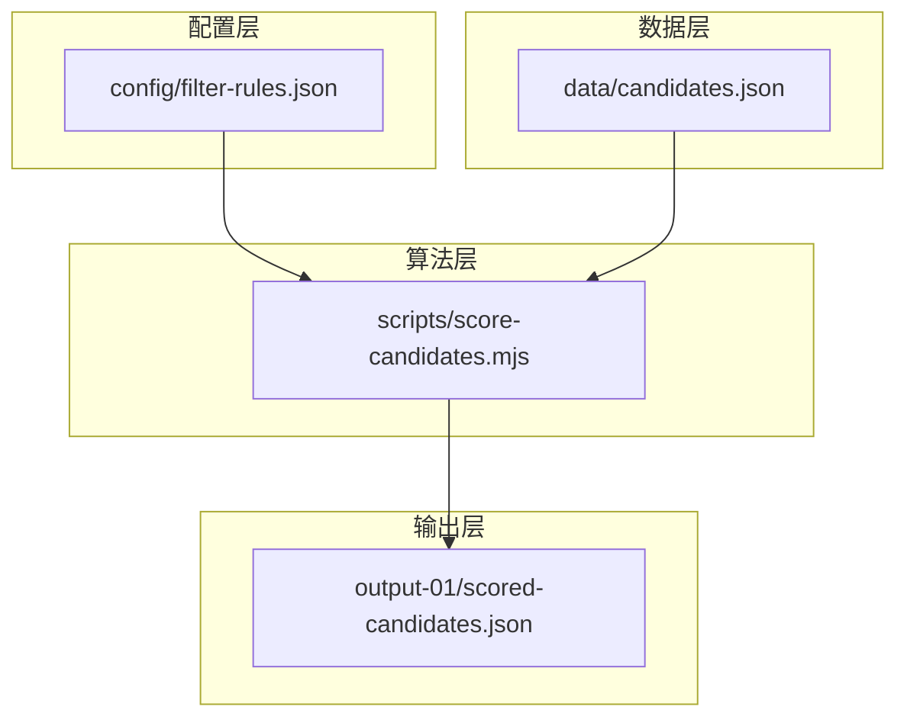
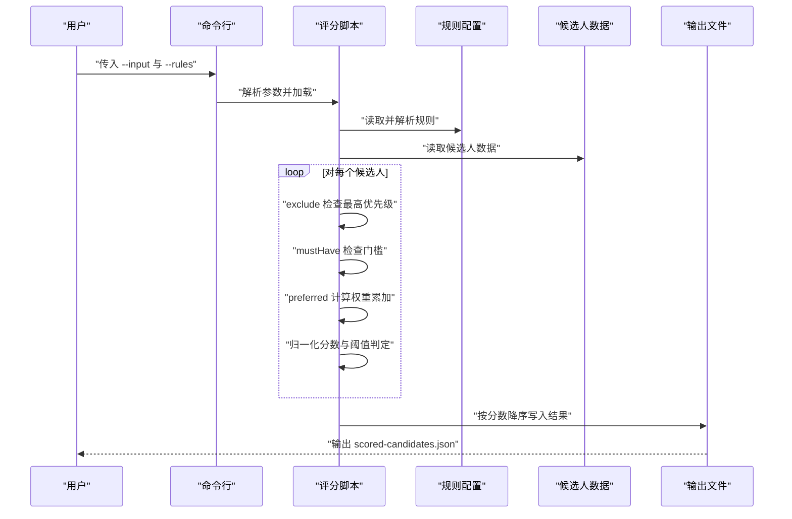
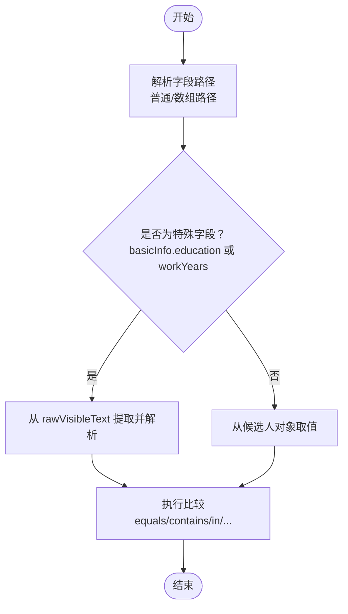
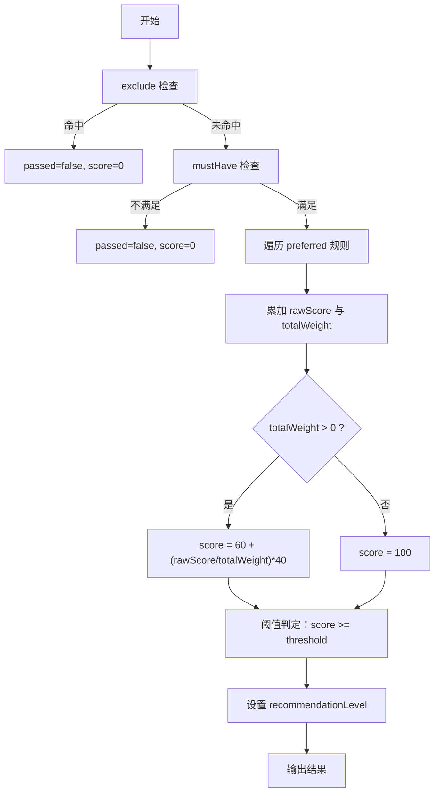
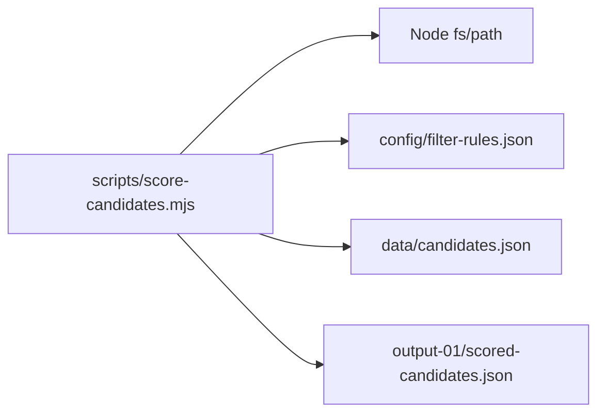

# 算法设计

<cite>
**本文引用的文件**
- [README.md](file://README.md)
- [scripts/score-candidates.mjs](file://scripts/score-candidates.mjs)
- [config/filter-rules.json](file://config/filter-rules.json)
- [data/candidates.json](file://data/candidates.json)
- [docs/superpowers/specs/2026-04-23-candidate-filtering-scoring-design.md](file://docs/superpowers/specs/2026-04-23-candidate-filtering-scoring-design.md)
- [output-01/scored-candidates.json](file://output-01/scored-candidates.json)
</cite>

## 目录
1. [简介](#简介)
2. [项目结构](#项目结构)
3. [核心组件](#核心组件)
4. [架构总览](#架构总览)
5. [详细组件分析](#详细组件分析)
6. [依赖关系分析](#依赖关系分析)
7. [性能考虑](#性能考虑)
8. [故障排查指南](#故障排查指南)
9. [结论](#结论)
10. [附录](#附录)

## 简介
本算法设计文档围绕 Web Access 项目中的“候选人筛选评分”模块展开，系统化阐述规则解析引擎、字段比较逻辑、评分计算公式、权重分配机制、优先级排序策略以及结果解释机制。文档以纯脚本实现为核心，不引入 LLM 判断，确保可解释性与稳定性，并提供算法流程图、伪代码示例与测试用例建议，帮助读者快速理解与扩展该评分体系。

## 项目结构
该项目采用“规则配置 + 评分脚本”的解耦架构：
- 规则配置：通过 JSON 文件定义 mustHave、preferred、exclude、threshold 等规则与权重。
- 数据输入：候选人 JSON 结构，包含基础信息、工作/教育经历等字段。
- 评分脚本：解析规则、执行字段比较、计算分数与排序、输出结果。

图表来源
- [scripts/score-candidates.mjs:343-383](file://scripts/score-candidates.mjs#L343-L383)
- [config/filter-rules.json:1-41](file://config/filter-rules.json#L1-L41)
- [data/candidates.json:1-49](file://data/candidates.json#L1-L49)

章节来源
- [README.md:1-168](file://README.md#L1-L168)
- [docs/superpowers/specs/2026-04-23-candidate-filtering-scoring-design.md:1-270](file://docs/superpowers/specs/2026-04-23-candidate-filtering-scoring-design.md#L1-L270)

## 核心组件
- 规则解析引擎：读取 JSON 规则，解析 mustHave/preferred/exclude/threshold，支持多种比较操作符与数组字段路径。
- 字段解析与比较：从 rawVisibleText 单源提取学历与工作年限，修正字段偏移；支持字符串/数组/正则/数值/学历等多类型比较。
- 评分计算：mustHave 门槛 + preferred 权重累加 + 归一化到 0-100 + 阈值判定。
- 排序与输出：按分数降序排列，输出带 reasons 与 recommendationLevel 的结果集。

章节来源
- [scripts/score-candidates.mjs:24-405](file://scripts/score-candidates.mjs#L24-L405)
- [config/filter-rules.json:1-41](file://config/filter-rules.json#L1-L41)
- [docs/superpowers/specs/2026-04-23-candidate-filtering-scoring-design.md:24-179](file://docs/superpowers/specs/2026-04-23-candidate-filtering-scoring-design.md#L24-L179)

## 架构总览
下图展示了从规则配置到评分输出的完整流程。

图表来源
- [scripts/score-candidates.mjs:343-383](file://scripts/score-candidates.mjs#L343-L383)
- [config/filter-rules.json:1-41](file://config/filter-rules.json#L1-L41)
- [data/candidates.json:1-49](file://data/candidates.json#L1-L49)

## 详细组件分析

### 规则解析引擎
- 规则结构：包含 name、version、rules（mustHave、preferred、exclude、threshold）。
- 字段路径：支持普通路径与数组路径（如 workExperience[].position），数组路径会遍历所有元素并“任一匹配即满足”。
- 操作符：equals、contains、in、>=、>、<=、<、regex、exists。
- 权重：仅 preferred 规则支持 weight 字段，用于加分。

章节来源
- [config/filter-rules.json:1-41](file://config/filter-rules.json#L1-L41)
- [docs/superpowers/specs/2026-04-23-candidate-filtering-scoring-design.md:24-101](file://docs/superpowers/specs/2026-04-23-candidate-filtering-scoring-design.md#L24-L101)

### 字段解析与比较逻辑
- rawVisibleText 单源：针对 basicInfo.education 与 basicInfo.workYears，优先从 rawVisibleText 提取，修正字段偏移问题。
- 字段路径解析：
  - 普通路径：按点号逐层取值。
  - 数组路径：支持 workExperience[].position 等，遍历数组收集所有子字段值。
- 比较函数：
  - 字符串/数组包含匹配、集合包含匹配、数值/学历比较、正则匹配、存在性检查。
  - 学历排序映射：高中 < 中专 < 大专 < 本科 < 硕士 < 博士。
  - 工作年限解析：支持“应届生”“1年以内”“N年以上”“N年”等格式。

图表来源
- [scripts/score-candidates.mjs:80-138](file://scripts/score-candidates.mjs#L80-L138)
- [scripts/score-candidates.mjs:148-219](file://scripts/score-candidates.mjs#L148-L219)

章节来源
- [scripts/score-candidates.mjs:24-77](file://scripts/score-candidates.mjs#L24-L77)
- [scripts/score-candidates.mjs:80-138](file://scripts/score-candidates.mjs#L80-L138)
- [scripts/score-candidates.mjs:148-219](file://scripts/score-candidates.mjs#L148-L219)
- [docs/superpowers/specs/2026-04-23-candidate-filtering-scoring-design.md:102-139](file://docs/superpowers/specs/2026-04-23-candidate-filtering-scoring-design.md#L102-L139)

### 评分计算与权重分配
- 评分流程：
  1) exclude 检查：命中任一即直接否决（passed=false，score=0）。
  2) mustHave 检查：全部满足才进入评分，否则 passed=false。
  3) preferred 计算：满足的规则按 weight 累加得到 rawScore，总权重 totalWeight 累加。
  4) 归一化：若 totalWeight>0，则 score = 60 + (rawScore/totalWeight)*40；若 totalWeight=0，则 score=100。
  5) 阈值判定：score >= threshold（默认 60）则 passed=true。
- recommendationLevel：基于最终 score 分档（strong/good/fair/weak）。

图表来源
- [scripts/score-candidates.mjs:229-340](file://scripts/score-candidates.mjs#L229-L340)
- [scripts/score-candidates.mjs:221-227](file://scripts/score-candidates.mjs#L221-L227)

章节来源
- [scripts/score-candidates.mjs:229-340](file://scripts/score-candidates.mjs#L229-L340)
- [docs/superpowers/specs/2026-04-23-candidate-filtering-scoring-design.md:140-179](file://docs/superpowers/specs/2026-04-23-candidate-filtering-scoring-design.md#L140-L179)

### 排序与结果解释
- 排序：按 score 降序排列，便于优先展示高匹配度候选人。
- 输出：包含 filterName、filterVersion、filteredAt、inputFile、totalCandidates、passedCount、threshold、candidates 等元信息；每个候选人包含 index、score、passed、reasons、recommendationLevel 等。
- reasons：逐条记录规则的 type（mustHave/exclude/preferred）、result（pass/fail/hit/miss）、weight（仅 preferred）与 human-readable reason。

章节来源
- [scripts/score-candidates.mjs:354-383](file://scripts/score-candidates.mjs#L354-L383)
- [docs/superpowers/specs/2026-04-23-candidate-filtering-scoring-design.md:180-220](file://docs/superpowers/specs/2026-04-23-candidate-filtering-scoring-design.md#L180-L220)

## 依赖关系分析
- 输入依赖：规则配置文件与候选人数据文件。
- 内部依赖：字段解析函数、比较函数、排序与输出函数。
- 外部依赖：Node.js 文件系统与路径模块（用于读写文件）。

图表来源
- [scripts/score-candidates.mjs:3-22](file://scripts/score-candidates.mjs#L3-L22)
- [scripts/score-candidates.mjs:343-383](file://scripts/score-candidates.mjs#L343-L383)

章节来源
- [scripts/score-candidates.mjs:3-22](file://scripts/score-candidates.mjs#L3-L22)
- [scripts/score-candidates.mjs:343-383](file://scripts/score-candidates.mjs#L343-L383)

## 性能考虑
- 时间复杂度
  - 单候选人评分：O(R + A)，R 为规则数量，A 为数组字段遍历的元素总数（如 workExperience[]）。
  - 整体评分：O(N*(R+A))，N 为候选人总数。
  - 排序：O(N log N)，主导于最终排序。
  - 总体复杂度：O(N*(R+A) + N log N)。
- 空间复杂度：O(N)（输出结果集）。
- 优化建议
  - 规则预处理：对 regex 编译缓存、布尔短路（exclude 优先）。
  - 字段解析缓存：对 rawVisibleText 的解析结果可按候选索引缓存。
  - 批量处理：对大样本数据可分批读取与写入，减少内存峰值。
  - 并行化：在多核环境下对候选人评分阶段进行并行处理（需注意输出顺序与并发写入）。

章节来源
- [scripts/score-candidates.mjs:229-340](file://scripts/score-candidates.mjs#L229-L340)
- [scripts/score-candidates.mjs:354-357](file://scripts/score-candidates.mjs#L354-L357)

## 故障排查指南
- 规则无效或报错
  - 检查规则 JSON 格式与字段拼写（field/operator/value/threshold）。
  - 确认数组路径书写正确（如 workExperience[].position）。
- 字段比较失败
  - 确认字段路径与候选人数据结构一致。
  - 对于 basicInfo.education 与 basicInfo.workYears，确认 rawVisibleText 格式与提取逻辑。
- 正则表达式异常
  - 检查正则语法与 flags 设置，避免无效正则导致比较失败。
- 分数异常
  - 检查 preferred 权重总和是否为 0（此时分数固定为 100）。
  - 检查阈值设置是否合理（默认 60）。
- 输出为空或排序异常
  - 确认输入文件路径与权限。
  - 检查排序逻辑与 passed 过滤是否符合预期。

章节来源
- [scripts/score-candidates.mjs:180-191](file://scripts/score-candidates.mjs#L180-L191)
- [scripts/score-candidates.mjs:329-331](file://scripts/score-candidates.mjs#L329-L331)
- [scripts/score-candidates.mjs:354-357](file://scripts/score-candidates.mjs#L354-L357)

## 结论
该候选人筛选评分算法以“纯脚本 + 规则配置”为核心，具备以下优势：
- 可解释性强：规则与比较逻辑清晰，输出包含 reasons 与 recommendationLevel。
- 可扩展性好：支持多种操作符与数组字段路径，权重机制灵活。
- 可维护性高：规则与数据分离，便于迭代与复用。

建议在生产环境中结合业务反馈持续优化规则权重与阈值，并配合缓存与并行化策略提升性能。

## 附录

### 算法伪代码示例
- 字段解析（支持普通与数组路径）
  - 输入：候选人对象、字段路径（如 "workExperience[].position"）
  - 输出：字段值或数组值
  - 步骤：按点号拆分路径；遇到 [] 展开数组；普通字段逐层取值；返回最终值或数组
- 比较函数
  - 输入：实际值、操作符、期望值、正则标志
  - 输出：布尔结果
  - 步骤：根据操作符执行相应比较（字符串/数组/正则/数值/学历/存在性）
- 评分函数
  - 输入：候选人、规则集
  - 输出：候选人 + score + passed + reasons + recommendationLevel
  - 步骤：exclude 优先检查；mustHave 门槛；preferred 权重累加；归一化；阈值判定；分档

章节来源
- [scripts/score-candidates.mjs:80-138](file://scripts/score-candidates.mjs#L80-L138)
- [scripts/score-candidates.mjs:148-219](file://scripts/score-candidates.mjs#L148-L219)
- [scripts/score-candidates.mjs:229-340](file://scripts/score-candidates.mjs#L229-L340)

### 测试用例建议
- 规则有效性
  - mustHave：全部满足、部分满足、均不满足
  - preferred：全部满足、部分满足、均不满足
  - exclude：命中与未命中
- 字段解析
  - rawVisibleText：不同学历与工作年限格式（应届生、1年以内、N年以上、N年）
  - 数组字段：空数组、单元素、多元素
- 比较操作符
  - equals、contains、in、>=、>、<=、<、regex、exists
- 边界情况
  - 空值、undefined、null、空字符串
  - 正则异常（非法表达式）
  - 阈值边界（0、60、100）

章节来源
- [config/filter-rules.json:1-41](file://config/filter-rules.json#L1-L41)
- [data/candidates.json:1-49](file://data/candidates.json#L1-L49)
- [scripts/score-candidates.mjs:180-191](file://scripts/score-candidates.mjs#L180-L191)

### 算法参数调优与阈值设定
- 权重分配
  - preferred 规则的 weight 应与业务重要性匹配；总权重影响分数归一化范围。
- 阈值设定
  - 默认 60；可根据通过率与误判率调整；threshold=0 时仅由 mustHave 决定是否通过。
- recommendationLevel
  - 建议与业务目标对齐（如强/良好/一般/弱）；可随阈值变化而调整。

章节来源
- [scripts/score-candidates.mjs:329-331](file://scripts/score-candidates.mjs#L329-L331)
- [scripts/score-candidates.mjs:221-227](file://scripts/score-candidates.mjs#L221-L227)
- [docs/superpowers/specs/2026-04-23-candidate-filtering-scoring-design.md:167-179](file://docs/superpowers/specs/2026-04-23-candidate-filtering-scoring-design.md#L167-L179)