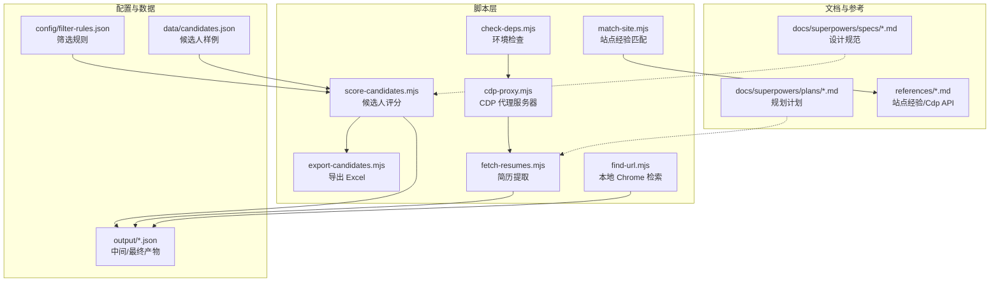
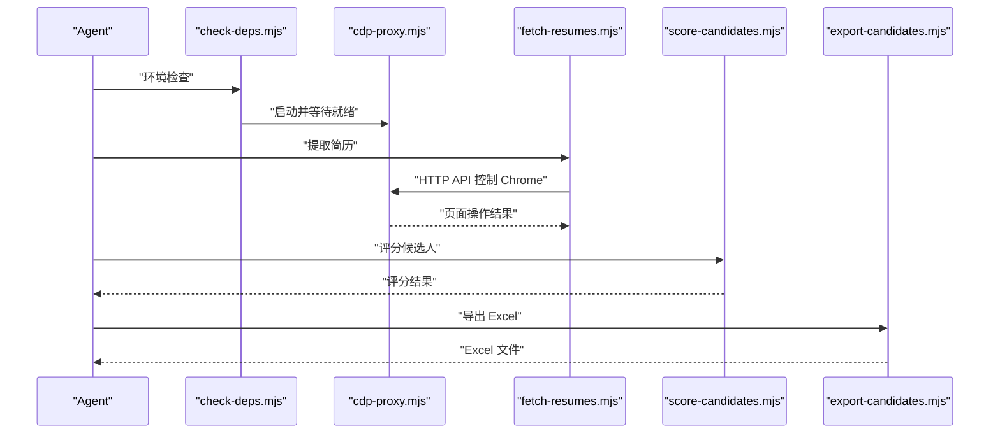
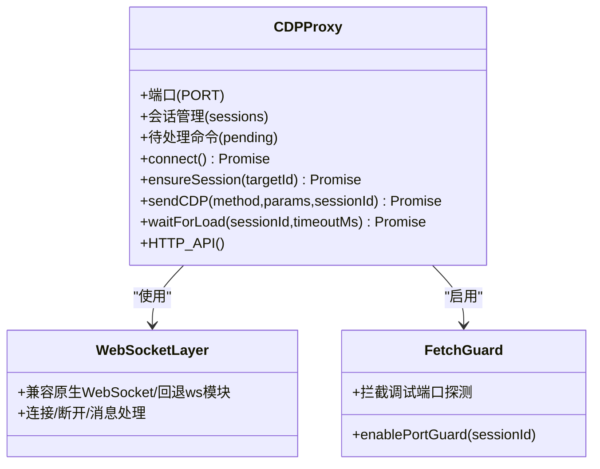
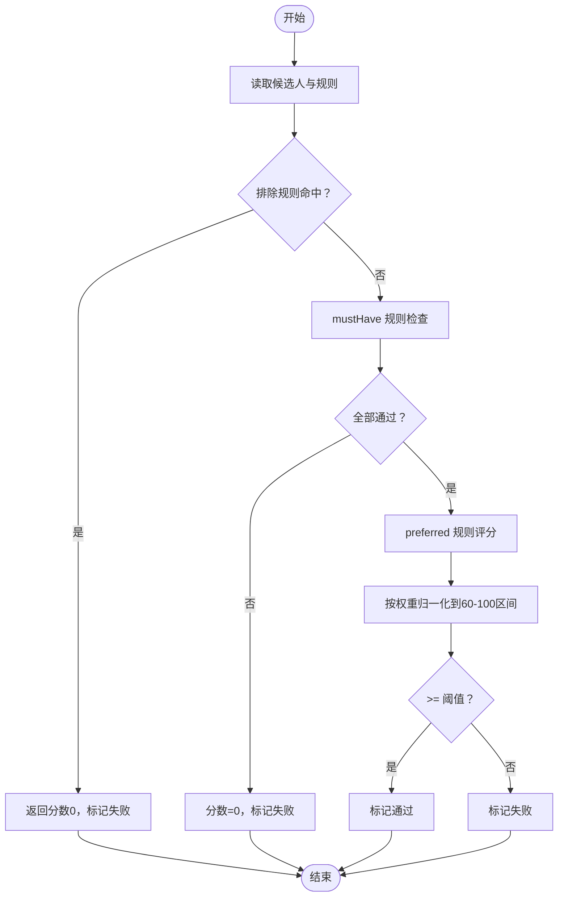
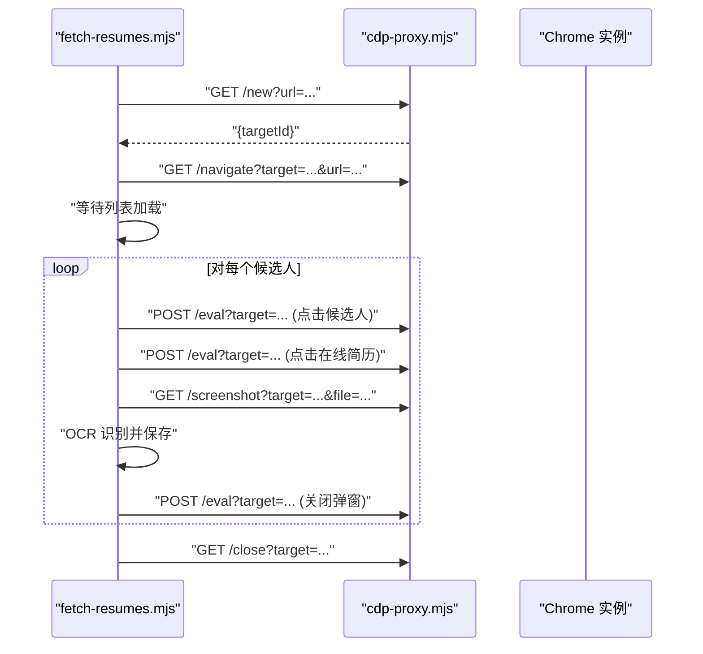
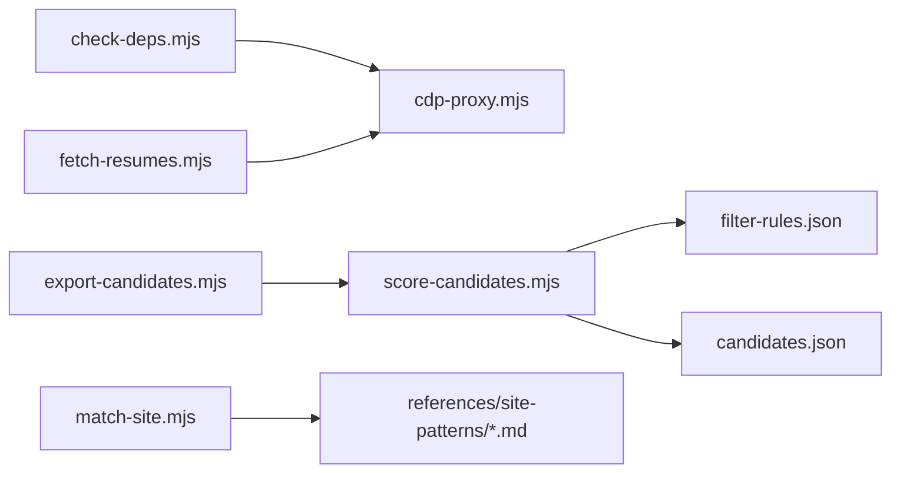

# 设计文档

<cite>
**本文引用的文件**
- [README.md](file://README.md)
- [package.json](file://package.json)
- [config/filter-rules.json](file://config/filter-rules.json)
- [data/candidates.json](file://data/candidates.json)
- [scripts/cdp-proxy.mjs](file://scripts/cdp-proxy.mjs)
- [scripts/check-deps.mjs](file://scripts/check-deps.mjs)
- [scripts/score-candidates.mjs](file://scripts/score-candidates.mjs)
- [scripts/export-candidates.mjs](file://scripts/export-candidates.mjs)
- [scripts/fetch-resumes.mjs](file://scripts/fetch-resumes.mjs)
- [scripts/find-url.mjs](file://scripts/find-url.mjs)
- [scripts/match-site.mjs](file://scripts/match-site.mjs)
- [docs/superpowers/specs/2026-04-23-candidate-filtering-scoring-design.md](file://docs/superpowers/specs/2026-04-23-candidate-filtering-scoring-design.md)
- [docs/superpowers/specs/2026-04-22-cdp-script-execution-fix-design.md](file://docs/superpowers/specs/2026-04-22-cdp-script-execution-fix-design.md)
- [docs/superpowers/specs/2026-04-22-extraction-persistence-design.md](file://docs/superpowers/specs/2026-04-22-extraction-persistence-design.md)
- [docs/superpowers/plans/2026-04-22-boss-zhipin-full-extraction-v3.md](file://docs/superpowers/plans/2026-04-22-boss-zhipin-full-extraction-v3.md)
- [docs/superpowers/plans/2026-04-22-extraction-persistence-plan.md](file://docs/superpowers/plans/2026-04-22-extraction-persistence-plan.md)
</cite>

## 目录
1. [简介](#简介)
2. [项目结构](#项目结构)
3. [核心组件](#核心组件)
4. [架构总览](#架构总览)
5. [详细组件分析](#详细组件分析)
6. [依赖分析](#依赖分析)
7. [性能考虑](#性能考虑)
8. [故障排查指南](#故障排查指南)
9. [结论](#结论)
10. [附录](#附录)

## 简介
本项目是一个面向 AI Agent 的“Web 访问技能”，旨在为 Agent 提供完整的联网与浏览器自动化能力。其核心设计围绕三大支柱展开：
- 联网策略与工具选择：根据场景自动选择 WebSearch/WebFetch/curl/Jina/CDP 等工具，并支持任意组合。
- CDP 浏览器代理：直连用户本地 Chrome，天然携带登录态，支持动态页面、交互操作与视频截帧。
- 站点经验积累：按域名存储操作经验（URL 模式、平台特征、已知陷阱），跨 session 复用。

系统通过一组可编排的 Node.js 脚本实现端到端流程：环境检查、CDP 代理、候选人筛选与评分、简历提取、Excel 导出、本地 Chrome 资源检索等。文档还收录了多份设计与规划文档，涵盖候选筛选评分、CDP 脚本执行修复、简历抽取持久化等主题。

章节来源
- [README.md:1-168](file://README.md#L1-L168)

## 项目结构
仓库采用“脚本驱动 + 配置 + 文档”的组织方式：
- scripts：核心执行脚本，包括 CDP 代理、环境检查、候选人评分、简历提取、Excel 导出、本地 URL 检索、站点经验匹配等。
- config：规则配置示例（筛选规则）。
- data：样例数据（候选人集合）。
- output/output-01：中间产物与输出（评分后的候选人、简历文本等）。
- docs/superpowers：设计规范与规划文档，记录设计决策与演进方向。
- references：站点经验资料（CDP API 说明等）。
- 根目录：README、包配置等。

图表来源
- [scripts/cdp-proxy.mjs:1-602](file://scripts/cdp-proxy.mjs#L1-L602)
- [scripts/check-deps.mjs:1-172](file://scripts/check-deps.mjs#L1-L172)
- [scripts/score-candidates.mjs:1-406](file://scripts/score-candidates.mjs#L1-L406)
- [scripts/export-candidates.mjs:1-203](file://scripts/export-candidates.mjs#L1-L203)
- [scripts/fetch-resumes.mjs:1-386](file://scripts/fetch-resumes.mjs#L1-L386)
- [scripts/find-url.mjs:1-215](file://scripts/find-url.mjs#L1-L215)
- [scripts/match-site.mjs:1-47](file://scripts/match-site.mjs#L1-L47)
- [config/filter-rules.json:1-41](file://config/filter-rules.json#L1-L41)
- [data/candidates.json:1-49](file://data/candidates.json#L1-L49)

章节来源
- [README.md:75-168](file://README.md#L75-L168)
- [package.json:1-11](file://package.json#L1-L11)

## 核心组件
- CDP 代理服务器：提供 HTTP API 控制 Chrome，支持新建/关闭 Tab、导航、执行 JS、点击、文件上传、滚动、截图、获取页面信息等。
- 环境检查脚本：检测 Node.js 版本、Chrome 调试端口、自动启动并等待 CDP 代理就绪。
- 候选人评分与筛选：基于规则配置对候选人打分，支持必须项、偏好项、排除项、权重与阈值，输出通过名单与推荐等级。
- 简历提取：通过 CDP 打开候选人在线简历弹窗，按页截图并通过 OCR 提取文本，保存为纯文本。
- Excel 导出：将评分结果转换为 Excel，支持自定义字段与列宽自适应。
- 本地 Chrome 检索：从书签/历史检索 URL，支持关键词、时间窗、排序与多 Profile。
- 站点经验匹配：根据用户输入匹配站点经验文档，输出正文内容。

章节来源
- [scripts/cdp-proxy.mjs:287-552](file://scripts/cdp-proxy.mjs#L287-L552)
- [scripts/check-deps.mjs:143-172](file://scripts/check-deps.mjs#L143-L172)
- [scripts/score-candidates.mjs:229-340](file://scripts/score-candidates.mjs#L229-L340)
- [scripts/fetch-resumes.mjs:250-386](file://scripts/fetch-resumes.mjs#L250-L386)
- [scripts/export-candidates.mjs:154-203](file://scripts/export-candidates.mjs#L154-L203)
- [scripts/find-url.mjs:175-215](file://scripts/find-url.mjs#L175-L215)
- [scripts/match-site.mjs:14-47](file://scripts/match-site.mjs#L14-L47)

## 架构总览
系统采用“脚本即服务”的轻量架构：每个功能由独立脚本实现，通过 HTTP API（CDP 代理）或文件系统进行交互。整体数据流如下：

图表来源
- [scripts/check-deps.mjs:107-139](file://scripts/check-deps.mjs#L107-L139)
- [scripts/cdp-proxy.mjs:287-552](file://scripts/cdp-proxy.mjs#L287-L552)
- [scripts/fetch-resumes.mjs:250-386](file://scripts/fetch-resumes.mjs#L250-L386)
- [scripts/score-candidates.mjs:342-384](file://scripts/score-candidates.mjs#L342-L384)
- [scripts/export-candidates.mjs:154-203](file://scripts/export-candidates.mjs#L154-L203)

## 详细组件分析

### CDP 代理组件
职责与特性
- 自动发现 Chrome 调试端口，兼容 DevToolsActivePort 与常见端口回退。
- 通过 WebSocket 连接 Chrome，支持 Target 会话管理与 Fetch 域拦截，反风控。
- 提供 HTTP API：/targets、/new、/close、/navigate、/back、/info、/eval、/click、/clickAt、/setFiles、/scroll、/screenshot、/health。
- 超时控制与错误处理，保证稳定性。

图表来源
- [scripts/cdp-proxy.mjs:13-33](file://scripts/cdp-proxy.mjs#L13-L33)
- [scripts/cdp-proxy.mjs:113-200](file://scripts/cdp-proxy.mjs#L113-L200)
- [scripts/cdp-proxy.mjs:222-248](file://scripts/cdp-proxy.mjs#L222-L248)
- [scripts/cdp-proxy.mjs:287-552](file://scripts/cdp-proxy.mjs#L287-L552)

章节来源
- [scripts/cdp-proxy.mjs:35-102](file://scripts/cdp-proxy.mjs#L35-L102)
- [scripts/cdp-proxy.mjs:202-217](file://scripts/cdp-proxy.mjs#L202-L217)
- [scripts/cdp-proxy.mjs:250-278](file://scripts/cdp-proxy.mjs#L250-L278)
- [scripts/cdp-proxy.mjs:287-552](file://scripts/cdp-proxy.mjs#L287-L552)

### 候选人评分组件
职责与特性
- 支持 mustHave/exclude/preferred 三类规则，权重与阈值控制。
- 字段路径解析支持普通字段与数组展开（如 workExperience[].position）。
- 智能字段解析：从 rawVisibleText 提取学历与工作年限，提升鲁棒性。
- 排序与归一化：mustHave 全通过给 60 分基础分，preferred 按权重比例加分，无 preferred 则 100 分。

图表来源
- [scripts/score-candidates.mjs:229-340](file://scripts/score-candidates.mjs#L229-L340)
- [scripts/score-candidates.mjs:342-384](file://scripts/score-candidates.mjs#L342-L384)

章节来源
- [scripts/score-candidates.mjs:79-138](file://scripts/score-candidates.mjs#L79-L138)
- [scripts/score-candidates.mjs:148-219](file://scripts/score-candidates.mjs#L148-L219)
- [config/filter-rules.json:1-41](file://config/filter-rules.json#L1-L41)
- [data/candidates.json:1-49](file://data/candidates.json#L1-L49)

### 简历提取组件
职责与特性
- 通过 CDP 代理打开 Boss 直聘沟通页，等待候选人列表加载。
- 滚动虚拟列表使目标候选人可见，点击进入在线简历弹窗。
- 按简历高度分页截图，OCR 识别后拼接文本，保存为纯文本文件。
- 终止 OCR worker，清理临时截图，输出摘要与统计。

图表来源
- [scripts/fetch-resumes.mjs:287-302](file://scripts/fetch-resumes.mjs#L287-L302)
- [scripts/fetch-resumes.mjs:314-346](file://scripts/fetch-resumes.mjs#L314-L346)
- [scripts/cdp-proxy.mjs:312-345](file://scripts/cdp-proxy.mjs#L312-L345)
- [scripts/cdp-proxy.mjs:502-517](file://scripts/cdp-proxy.mjs#L502-L517)

章节来源
- [scripts/fetch-resumes.mjs:100-154](file://scripts/fetch-resumes.mjs#L100-L154)
- [scripts/fetch-resumes.mjs:210-244](file://scripts/fetch-resumes.mjs#L210-L244)
- [scripts/fetch-resumes.mjs:250-386](file://scripts/fetch-resumes.mjs#L250-L386)

### Excel 导出组件
职责与特性
- 将评分结果转换为 Excel，支持自定义字段顺序与列宽自适应。
- 输出包含筛选规则名称/版本、总数、通过数、通过率等统计信息。

章节来源
- [scripts/export-candidates.mjs:43-121](file://scripts/export-candidates.mjs#L43-L121)
- [scripts/export-candidates.mjs:134-153](file://scripts/export-candidates.mjs#L134-L153)
- [scripts/export-candidates.mjs:154-203](file://scripts/export-candidates.mjs#L154-L203)

### 本地 Chrome 检索组件
职责与特性
- 跨平台定位 Chrome 用户数据目录，枚举 Profile。
- 从书签与历史检索 URL，支持关键词 AND、时间窗、排序（最近/访问频次）、限制条数。
- SQLite 历史查询前复制数据库文件，避免运行时锁定。

章节来源
- [scripts/find-url.mjs:61-81](file://scripts/find-url.mjs#L61-L81)
- [scripts/find-url.mjs:110-149](file://scripts/find-url.mjs#L110-L149)
- [scripts/find-url.mjs:175-215](file://scripts/find-url.mjs#L175-L215)

### 站点经验匹配组件
职责与特性
- 读取 references/site-patterns 下的 Markdown 文件，提取 aliases。
- 根据查询文本与域名/别名构建正则匹配，输出匹配到的经验正文。

章节来源
- [scripts/match-site.mjs:14-47](file://scripts/match-site.mjs#L14-L47)

## 依赖分析
- 运行时依赖
  - tesseract.js：OCR 识别，用于简历文本提取。
  - xlsx：Excel 导出。
- 脚本间耦合
  - check-deps.mjs 依赖 cdp-proxy.mjs 的 /targets 健康检查。
  - fetch-resumes.mjs 依赖 cdp-proxy.mjs 的 HTTP API。
  - score-candidates.mjs 依赖 config/filter-rules.json 与 data/candidates.json。
  - export-candidates.mjs 依赖 scored-candidates.json 输出。
- 外部系统
  - Chrome 远程调试端口与 DevToolsActivePort 文件。
  - Boss 直聘站点经验（通过 match-site.mjs 与 references/site-patterns 集成）。

图表来源
- [scripts/check-deps.mjs:107-139](file://scripts/check-deps.mjs#L107-L139)
- [scripts/fetch-resumes.mjs:250-386](file://scripts/fetch-resumes.mjs#L250-L386)
- [scripts/score-candidates.mjs:342-384](file://scripts/score-candidates.mjs#L342-L384)
- [scripts/export-candidates.mjs:154-203](file://scripts/export-candidates.mjs#L154-L203)
- [scripts/match-site.mjs:14-47](file://scripts/match-site.mjs#L14-L47)

章节来源
- [package.json:6-9](file://package.json#L6-L9)
- [scripts/check-deps.mjs:107-139](file://scripts/check-deps.mjs#L107-L139)
- [scripts/fetch-resumes.mjs:45-82](file://scripts/fetch-resumes.mjs#L45-L82)
- [scripts/score-candidates.mjs:346-351](file://scripts/score-candidates.mjs#L346-L351)
- [scripts/export-candidates.mjs:158-161](file://scripts/export-candidates.mjs#L158-L161)

## 性能考虑
- CDP 代理
  - 使用原生 WebSocket（Node.js 22+）或回退 ws 模块，降低额外依赖。
  - 会话复用与端口探测拦截，减少不必要的握手与风控干扰。
  - 命令超时控制与定时清理，避免悬挂请求。
- 候选人评分
  - 字段路径解析支持数组展开，避免多次遍历。
  - 比较函数区分学历、数值与字符串，减少类型转换成本。
- 简历提取
  - 按简历高度分页截图，避免一次性大图导致内存压力。
  - OCR worker 复用，减少初始化开销。
- Excel 导出
  - 列宽自适应计算，兼顾中文字符宽度与最大宽度限制。

章节来源
- [scripts/cdp-proxy.mjs:19-33](file://scripts/cdp-proxy.mjs#L19-L33)
- [scripts/score-candidates.mjs:86-110](file://scripts/score-candidates.mjs#L86-L110)
- [scripts/score-candidates.mjs:202-219](file://scripts/score-candidates.mjs#L202-L219)
- [scripts/fetch-resumes.mjs:281-285](file://scripts/fetch-resumes.mjs#L281-L285)
- [scripts/export-candidates.mjs:134-152](file://scripts/export-candidates.mjs#L134-L152)

## 故障排查指南
- CDP 代理无法连接
  - 确认 Chrome 已开启远程调试端口，或使用 DevToolsActivePort 文件定位端口。
  - 检查端口占用与防火墙，必要时更换端口。
  - 查看日志文件（临时目录下）定位具体错误。
- 环境检查失败
  - Node.js 版本低于 22 时，建议升级或安装 ws 模块作为回退。
  - Chrome 未启动或未勾选“允许远程调试”，请在 chrome://inspect/#remote-debugging 中启用。
- 简历提取失败
  - 确认 CDP 代理端口 3456 正常，Chrome 已登录目标站点。
  - 检查候选人列表加载与在线简历弹窗出现逻辑，适当延长等待时间。
- Excel 导出报错
  - 确认已安装 xlsx 依赖，再重试导出。
- 本地 Chrome 检索
  - Windows 上需安装 sqlite3 并加入 PATH；macOS/Linux 通常自带。
  - 若未找到 Chrome 用户数据目录，确认平台路径与 Profile 是否存在。

章节来源
- [scripts/cdp-proxy.mjs:118-130](file://scripts/cdp-proxy.mjs#L118-L130)
- [scripts/cdp-proxy.mjs:554-562](file://scripts/cdp-proxy.mjs#L554-L562)
- [scripts/check-deps.mjs:143-172](file://scripts/check-deps.mjs#L143-L172)
- [scripts/fetch-resumes.mjs:293-302](file://scripts/fetch-resumes.mjs#L293-L302)
- [scripts/export-candidates.mjs:15-23](file://scripts/export-candidates.mjs#L15-L23)
- [scripts/find-url.mjs:143-149](file://scripts/find-url.mjs#L143-L149)

## 结论
本项目通过“脚本即服务”的方式，将复杂的浏览器自动化与数据处理流程拆分为高内聚、低耦合的功能模块。CDP 代理提供统一的浏览器控制入口，评分与导出模块形成闭环的数据处理链路，本地检索与站点经验匹配进一步增强实用性与可维护性。设计文档与规划文档为后续演进提供了清晰的路线图与决策依据。

## 附录
- 设计与规划文档
  - 候选人筛选评分设计：[2026-04-23-candidate-filtering-scoring-design.md](file://docs/superpowers/specs/2026-04-23-candidate-filtering-scoring-design.md)
  - CDP 脚本执行修复设计：[2026-04-22-cdp-script-execution-fix-design.md](file://docs/superpowers/specs/2026-04-22-cdp-script-execution-fix-design.md)
  - 简历抽取持久化设计：[2026-04-22-extraction-persistence-design.md](file://docs/superpowers/specs/2026-04-22-extraction-persistence-design.md)
  - Boss 直聘全量抽取规划（v3）：[2026-04-22-boss-zhipin-full-extraction-v3.md](file://docs/superpowers/plans/2026-04-22-boss-zhipin-full-extraction-v3.md)
  - 简历抽取持久化规划：[2026-04-22-extraction-persistence-plan.md](file://docs/superpowers/plans/2026-04-22-extraction-persistence-plan.md)

章节来源
- [docs/superpowers/specs/2026-04-23-candidate-filtering-scoring-design.md](file://docs/superpowers/specs/2026-04-23-candidate-filtering-scoring-design.md)
- [docs/superpowers/specs/2026-04-22-cdp-script-execution-fix-design.md](file://docs/superpowers/specs/2026-04-22-cdp-script-execution-fix-design.md)
- [docs/superpowers/specs/2026-04-22-extraction-persistence-design.md](file://docs/superpowers/specs/2026-04-22-extraction-persistence-design.md)
- [docs/superpowers/plans/2026-04-22-boss-zhipin-full-extraction-v3.md](file://docs/superpowers/plans/2026-04-22-boss-zhipin-full-extraction-v3.md)
- [docs/superpowers/plans/2026-04-22-extraction-persistence-plan.md](file://docs/superpowers/plans/2026-04-22-extraction-persistence-plan.md)