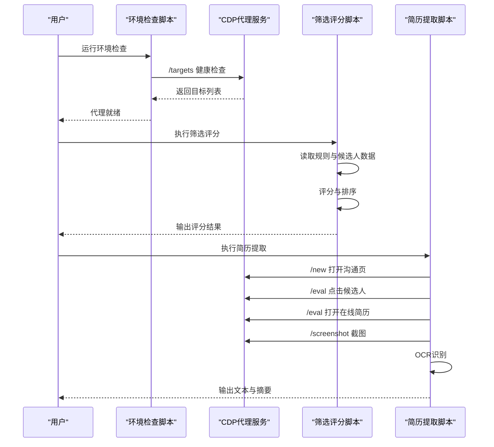
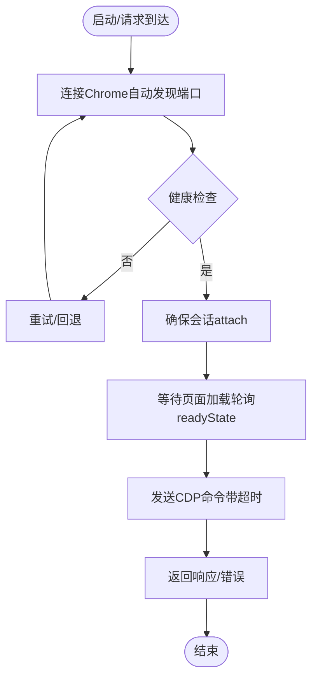
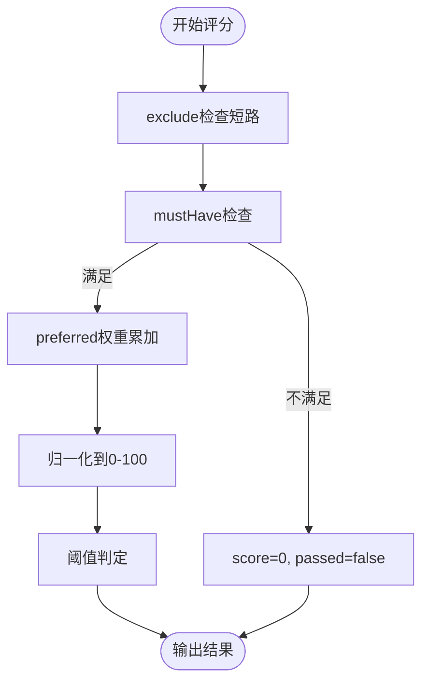
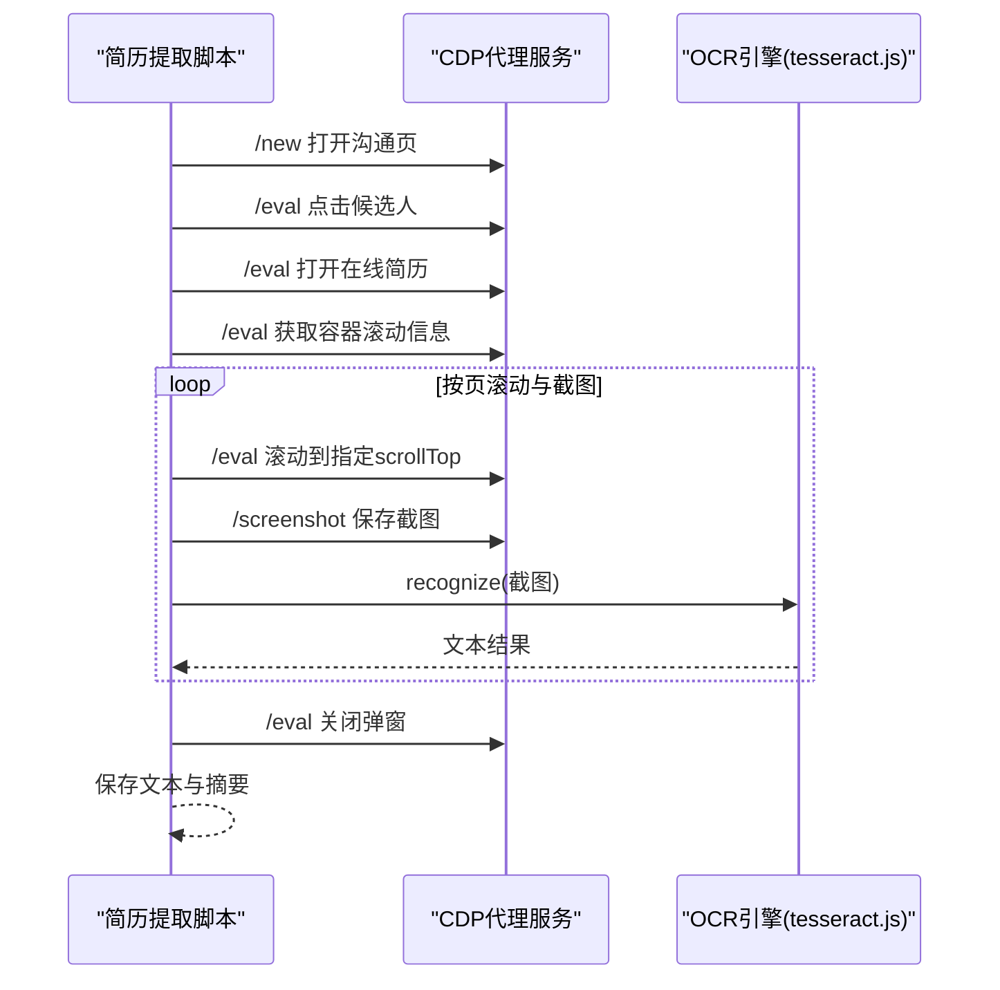
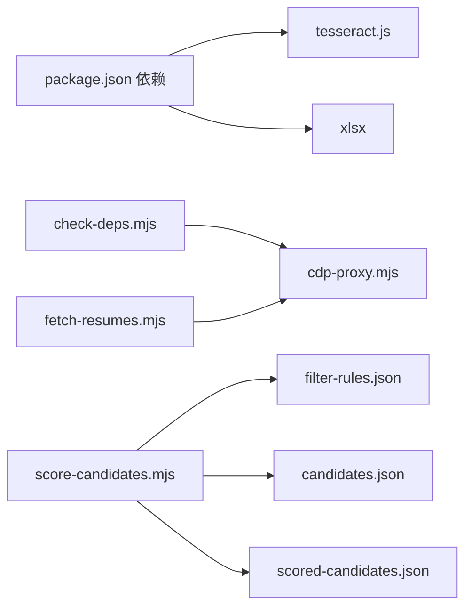

# 性能监控

<cite>
**本文引用的文件**
- [README.md](file://README.md)
- [package.json](file://package.json)
- [scripts/cdp-proxy.mjs](file://scripts/cdp-proxy.mjs)
- [scripts/check-deps.mjs](file://scripts/check-deps.mjs)
- [scripts/score-candidates.mjs](file://scripts/score-candidates.mjs)
- [scripts/fetch-resumes.mjs](file://scripts/fetch-resumes.mjs)
- [config/filter-rules.json](file://config/filter-rules.json)
- [data/candidates.json](file://data/candidates.json)
- [docs/superpowers/specs/2026-04-23-candidate-filtering-scoring-design.md](file://docs/superpowers/specs/2026-04-23-candidate-filtering-scoring-design.md)
- [output-01/scored-candidates.json](file://output-01/scored-candidates.json)
</cite>

## 目录
1. [简介](#简介)
2. [项目结构](#项目结构)
3. [核心组件](#核心组件)
4. [架构总览](#架构总览)
5. [详细组件分析](#详细组件分析)
6. [依赖关系分析](#依赖关系分析)
7. [性能考量](#性能考量)
8. [故障排查指南](#故障排查指南)
9. [结论](#结论)
10. [附录](#附录)

## 简介
本文件面向Web Access项目的性能监控与优化，聚焦以下方面：
- CDP代理服务的性能指标监控、内存使用情况跟踪与CPU占用率分析
- 候选人筛选系统的处理速度优化、批量处理性能调优与资源消耗监控
- 简历提取系统的OCR处理性能监控、截图质量评估与网络带宽使用统计
- 关键性能指标（KPI）定义、监控工具使用与性能基准测试方法
- 性能瓶颈识别与优化建议

## 项目结构
该项目采用“脚本驱动 + HTTP API + CDP”的轻量架构，核心由以下模块组成：
- CDP代理服务：提供HTTP API以控制本地Chrome，实现页面导航、点击、截图、滚动等操作
- 候选人筛选评分：基于规则配置对候选人进行评分与过滤
- 简历提取：通过CDP打开在线简历弹窗，截图并使用OCR提取文本
- 依赖与工具：tesseract.js用于OCR，xlsx用于Excel导出（当前流程主要依赖CDP与OCR）

```mermaid
graph TB
subgraph "外部系统"
Browser["本地Chrome"]
Network["网络环境"]
end
subgraph "Node.js 脚本层"
Proxy["CDP代理服务<br/>scripts/cdp-proxy.mjs"]
Checker["环境检查<br/>scripts/check-deps.mjs"]
Filter["候选人筛选<br/>scripts/score-candidates.mjs"]
Resume["简历提取<br/>scripts/fetch-resumes.mjs"]
end
subgraph "配置与数据"
Rules["规则配置<br/>config/filter-rules.json"]
Candidates["候选人样例<br/>data/candidates.json"]
Output["输出结果<br/>output-01/scored-candidates.json"]
end
Browser <- --> Proxy
Network <- --> Proxy
Checker --> Proxy
Filter --> Rules
Filter --> Candidates
Filter --> Output
Resume --> Proxy
Resume --> Output
```

图表来源
- [scripts/cdp-proxy.mjs:288-552](file://scripts/cdp-proxy.mjs#L288-L552)
- [scripts/check-deps.mjs:85-139](file://scripts/check-deps.mjs#L85-L139)
- [scripts/score-candidates.mjs:342-383](file://scripts/score-candidates.mjs#L342-L383)
- [scripts/fetch-resumes.mjs:250-380](file://scripts/fetch-resumes.mjs#L250-L380)
- [config/filter-rules.json:1-41](file://config/filter-rules.json#L1-L41)
- [data/candidates.json:1-49](file://data/candidates.json#L1-L49)
- [output-01/scored-candidates.json:1-120](file://output-01/scored-candidates.json#L1-L120)

章节来源
- [README.md: 119-137:119-137](file://README.md#L119-L137)
- [package.json: 6-9:6-9](file://package.json#L6-L9)

## 核心组件
- CDP代理服务（scripts/cdp-proxy.mjs）
  - 通过HTTP API提供页面生命周期与交互控制，包括新建/关闭tab、导航、点击、滚动、截图、执行JS等
  - 内置健康检查端点与会话管理，支持Fetch域端口探测拦截以反风控
  - 支持自动发现Chrome调试端口，兼容多平台DevToolsActivePort文件与常见端口回退
- 候选人筛选评分（scripts/score-candidates.mjs）
  - 基于规则配置对候选人进行评分与过滤，支持mustHave、preferred、exclude与阈值判定
  - 对rawVisibleText进行偏移修正，提取学历与工作年限
  - 输出包含分数、通过状态、推荐等级与逐条规则判定原因的JSON
- 简历提取（scripts/fetch-resumes.mjs）
  - 通过CDP打开Boss直聘沟通页，定位候选人并打开在线简历弹窗
  - 按简历容器高度分页截图，使用tesseract.js进行OCR识别，保存文本
  - 支持错误恢复与弹窗关闭，输出摘要与成功/失败统计

章节来源
- [scripts/cdp-proxy.mjs: 288-552:288-552](file://scripts/cdp-proxy.mjs#L288-L552)
- [scripts/score-candidates.mjs: 229-340:229-340](file://scripts/score-candidates.mjs#L229-L340)
- [scripts/fetch-resumes.mjs: 250-380:250-380](file://scripts/fetch-resumes.mjs#L250-L380)

## 架构总览
CDP代理服务作为统一入口，为上游筛选与简历提取流程提供稳定的浏览器控制能力。环境检查脚本负责确保CDP代理可用与Chrome调试端口可达。候选人筛选流程依赖规则配置与候选人数据，输出评分结果。简历提取流程依赖CDP代理与OCR引擎，输出文本文件与摘要。



图表来源
- [scripts/check-deps.mjs: 85-139:85-139](file://scripts/check-deps.mjs#L85-L139)
- [scripts/cdp-proxy.mjs: 288-552:288-552](file://scripts/cdp-proxy.mjs#L288-L552)
- [scripts/score-candidates.mjs: 342-383:342-383](file://scripts/score-candidates.mjs#L342-L383)
- [scripts/fetch-resumes.mjs: 287-350:287-350](file://scripts/fetch-resumes.mjs#L287-L350)

## 详细组件分析

### CDP代理服务性能监控
- 连接与会话管理
  - 自动发现Chrome调试端口，支持DevToolsActivePort与常见端口回退
  - 会话缓存与Fetch域端口探测拦截，降低风控风险
  - 健康检查端点返回连接状态、会话数量与端口信息
- 请求处理与超时控制
  - CDP命令超时默认30秒，避免长时间阻塞
  - 页面加载等待通过Runtime.evaluate轮询document.readyState，超时控制在15秒
- 性能关注点
  - WebSocket连接稳定性与消息队列pending长度
  - 目标页面数量与会话并发对内存与CPU的影响
  - 端口探测与Fetch拦截对网络请求的潜在影响



图表来源
- [scripts/cdp-proxy.mjs: 113-200:113-200](file://scripts/cdp-proxy.mjs#L113-L200)
- [scripts/cdp-proxy.mjs: 251-278:251-278](file://scripts/cdp-proxy.mjs#L251-L278)
- [scripts/cdp-proxy.mjs: 202-217:202-217](file://scripts/cdp-proxy.mjs#L202-L217)

章节来源
- [scripts/cdp-proxy.mjs: 35-102:35-102](file://scripts/cdp-proxy.mjs#L35-L102)
- [scripts/cdp-proxy.mjs: 296-301:296-301](file://scripts/cdp-proxy.mjs#L296-L301)
- [scripts/cdp-proxy.mjs: 312-345:312-345](file://scripts/cdp-proxy.mjs#L312-L345)
- [scripts/cdp-proxy.mjs: 355-446:355-446](file://scripts/cdp-proxy.mjs#L355-L446)
- [scripts/cdp-proxy.mjs: 502-517:502-517](file://scripts/cdp-proxy.mjs#L502-L517)

### 候选人筛选系统性能优化
- 规则解析与字段提取
  - rawVisibleText单源解析，避免多源字段偏移带来的额外计算
  - 数组字段路径解析支持workExperience[].position等，提升匹配效率
- 评分计算
  - mustHave优先级最高，exclude命中直接短路
  - preferred权重累加后归一化至0-100，阈值默认60
- 批量处理与资源消耗
  - 单次处理：O(n)遍历规则，O(n)字段解析与比较
  - 内存：候选人对象与中间结果在内存驻留，建议分批处理大批量数据
  - CPU：正则匹配与字符串比较为主要开销，可考虑预编译正则与缓存比较函数



图表来源
- [scripts/score-candidates.mjs: 229-340:229-340](file://scripts/score-candidates.mjs#L229-L340)
- [scripts/score-candidates.mjs: 86-110:86-110](file://scripts/score-candidates.mjs#L86-L110)
- [scripts/score-candidates.mjs: 148-200:148-200](file://scripts/score-candidates.mjs#L148-L200)

章节来源
- [scripts/score-candidates.mjs: 342-383:342-383](file://scripts/score-candidates.mjs#L342-L383)
- [config/filter-rules.json: 1-L41:1-41](file://config/filter-rules.json#L1-L41)
- [docs/superpowers/specs/2026-04-23-candidate-filtering-scoring-design.md: 140-178:140-178](file://docs/superpowers/specs/2026-04-23-candidate-filtering-scoring-design.md#L140-L178)

### 简历提取系统性能监控
- 截图与OCR
  - 按简历容器高度分页截图，每页等待Canvas重绘后再OCR
  - OCR引擎复用（worker.terminate在流程末尾终止），避免重复初始化
- 网络与带宽
  - 截图文件写入磁盘，建议限制分辨率与质量以降低带宽与IO
  - 可统计每页OCR耗时与总字数，评估OCR吞吐
- 错误处理
  - 在线简历按钮未找到、简历弹窗未出现等异常均被捕获并记录
  - 成功/失败列表与摘要文件便于事后分析



图表来源
- [scripts/fetch-resumes.mjs: 287-350:287-350](file://scripts/fetch-resumes.mjs#L287-L350)
- [scripts/fetch-resumes.mjs: 212-233:212-233](file://scripts/fetch-resumes.mjs#L212-L233)
- [scripts/fetch-resumes.mjs: 235-243:235-243](file://scripts/fetch-resumes.mjs#L235-L243)

章节来源
- [scripts/fetch-resumes.mjs: 250-380:250-380](file://scripts/fetch-resumes.mjs#L250-L380)

## 依赖关系分析
- 外部依赖
  - tesseract.js：OCR识别
  - xlsx：Excel导出（当前流程未直接使用）
- 内部依赖
  - 环境检查脚本依赖CDP代理服务的健康检查端点
  - 简历提取脚本依赖CDP代理服务的HTTP API
  - 筛选评分脚本依赖规则配置与候选人数据



图表来源
- [package.json: 6-9:6-9](file://package.json#L6-L9)
- [scripts/check-deps.mjs: 85-139:85-139](file://scripts/check-deps.mjs#L85-L139)
- [scripts/fetch-resumes.mjs: 250-380:250-380](file://scripts/fetch-resumes.mjs#L250-L380)
- [scripts/score-candidates.mjs: 342-383:342-383](file://scripts/score-candidates.mjs#L342-L383)
- [config/filter-rules.json: 1-L41:1-41](file://config/filter-rules.json#L1-L41)
- [data/candidates.json: 1-L49:1-49](file://data/candidates.json#L1-L49)
- [output-01/scored-candidates.json: 1-L120:1-120](file://output-01/scored-candidates.json#L1-L120)

章节来源
- [package.json: 6-9:6-9](file://package.json#L6-L9)

## 性能考量

### 关键性能指标（KPI）
- CDP代理服务
  - 连接成功率（/health返回状态）
  - 平均CDP命令响应时间（超时30秒）
  - 页面加载平均等待时间（轮询15秒）
  - 会话并发数与内存占用
- 候选人筛选系统
  - 单候选人评分耗时（含字段解析与规则比较）
  - 规则命中率与短路比例
  - 排序与输出耗时
- 简历提取系统
  - 单候选人平均提取耗时（点击、弹窗、截图、OCR、保存）
  - OCR识别耗时分布（按页统计）
  - 截图文件大小与带宽使用
  - 成功率与失败原因分类

### 监控工具与方法
- Node.js内置性能分析
  - 使用--prof/--heap-prof等参数采集CPU与内存快照
  - 结合console.time/console.timeEnd测量关键路径耗时
- 外部系统监控
  - 使用系统监控工具（如top/htop、Activity Monitor）观察CPU与内存
  - 使用网络抓包工具（如Wireshark）统计带宽使用
- 日志与指标
  - 在关键节点输出耗时日志（开始/结束/阶段）
  - 统计成功/失败数量与平均耗时，形成基准曲线

### 性能基准测试方法
- 基准数据集
  - 使用data/candidates.json作为小规模样本，output-01/scored-candidates.json作为筛选结果样本
  - 扩展至不同规模的候选人集合，记录线性关系
- 压力测试
  - 并发调用CDP代理服务的HTTP端点，观察延迟与错误率
  - 批量执行筛选评分，统计吞吐量与P95/P99延迟
- 回归测试
  - 在每次规则变更后重新运行基准测试，确保性能回归可控

### 瓶颈识别与优化建议
- CDP代理服务
  - 瓶颈：WebSocket连接与消息队列、页面加载轮询
  - 优化：减少不必要的轮询次数、合理设置超时、复用会话
- 候选人筛选系统
  - 瓶颈：正则匹配与字符串比较、数组字段遍历
  - 优化：预编译正则、缓存比较函数、分批处理与并行化
- 简历提取系统
  - 瓶颈：OCR识别耗时、截图与磁盘IO
  - 优化：调整截图质量与分辨率、OCR并发与缓存、异步IO与批处理

## 故障排查指南
- CDP代理服务
  - Chrome调试端口未发现：检查DevToolsActivePort文件与常见端口
  - 连接失败：确认Chrome已允许远程调试，首次连接可能触发授权弹窗
  - 健康检查失败：检查端口占用与代理进程状态
- 候选人筛选系统
  - 规则解析异常：核对规则字段路径与operator类型
  - 排序异常：检查分数计算与阈值设置
- 简历提取系统
  - 在线简历按钮未找到：确认候选人确实上传了在线简历
  - OCR失败：检查tesseract.js安装与语言包，适当降低截图质量以提高识别速度

章节来源
- [scripts/check-deps.mjs: 65-83:65-83](file://scripts/check-deps.mjs#L65-L83)
- [scripts/check-deps.mjs: 107-139:107-139](file://scripts/check-deps.mjs#L107-L139)
- [scripts/fetch-resumes.mjs: 155-179:155-179](file://scripts/fetch-resumes.mjs#L155-L179)
- [scripts/fetch-resumes.mjs: 339-345:339-345](file://scripts/fetch-resumes.mjs#L339-L345)

## 结论
本项目通过CDP代理服务实现了对本地Chrome的稳定控制，结合规则驱动的候选人筛选与OCR驱动的简历提取，形成了完整的性能监控与优化闭环。建议在生产环境中持续采集KPI、建立基准曲线，并针对CDP连接、规则解析与OCR识别三个关键环节进行针对性优化，以提升整体吞吐与稳定性。

## 附录
- 规则配置示例与字段解析说明参见：[config/filter-rules.json:1-41](file://config/filter-rules.json#L1-L41)、[docs/superpowers/specs/2026-04-23-candidate-filtering-scoring-design.md:102-178](file://docs/superpowers/specs/2026-04-23-candidate-filtering-scoring-design.md#L102-L178)
- 示例数据与输出结果参见：[data/candidates.json:1-49](file://data/candidates.json#L1-L49)、[output-01/scored-candidates.json:1-120](file://output-01/scored-candidates.json#L1-L120)