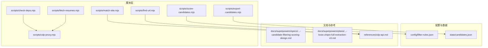
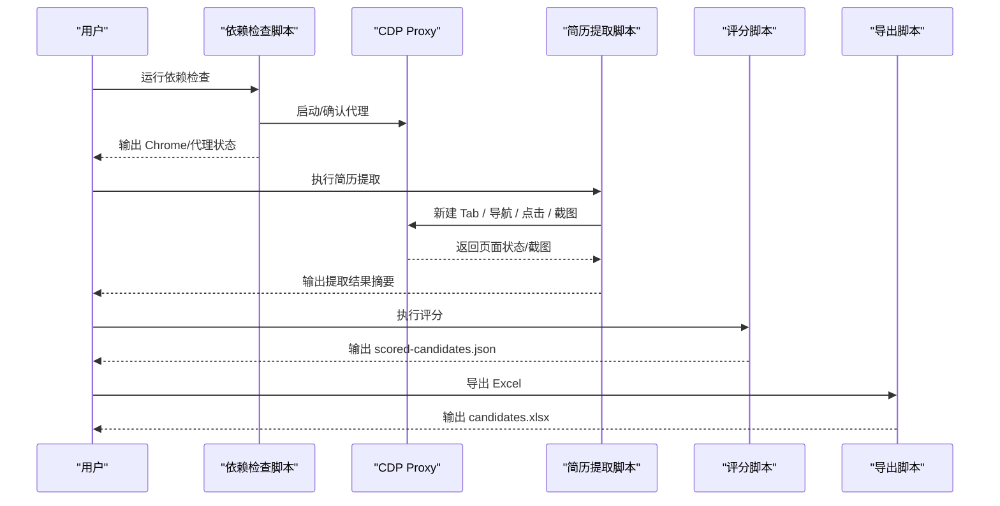
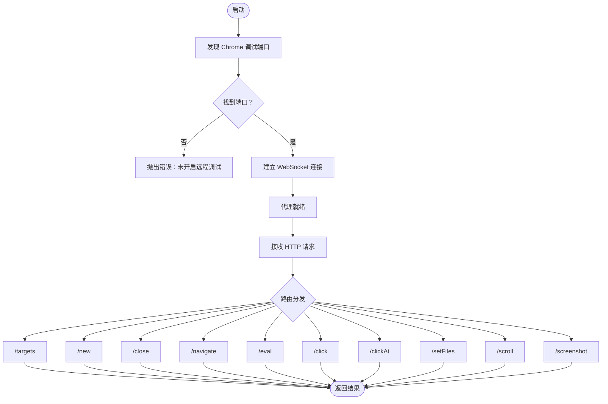
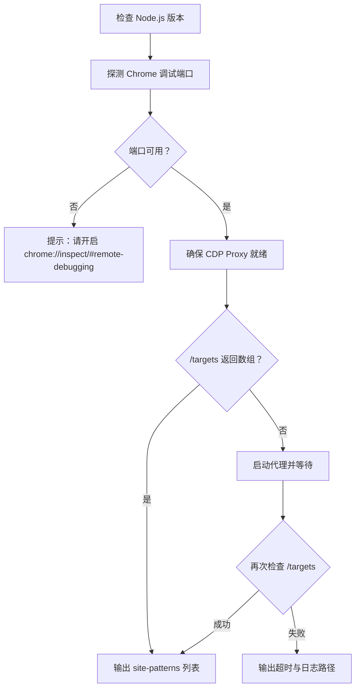
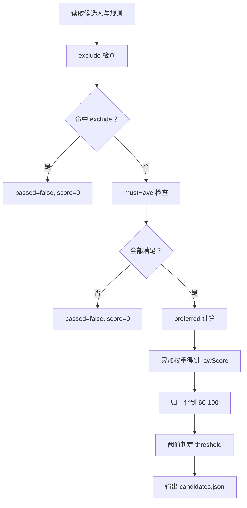
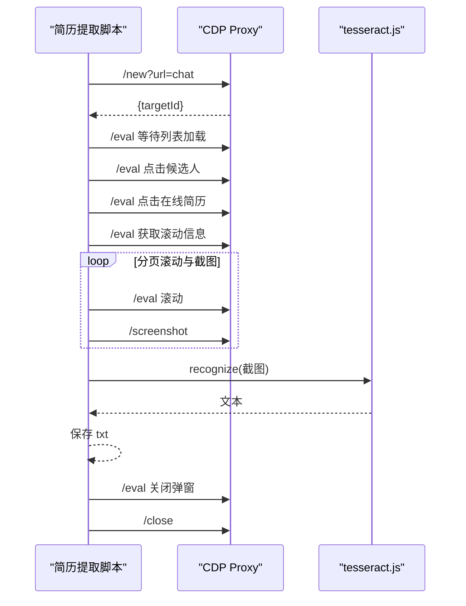
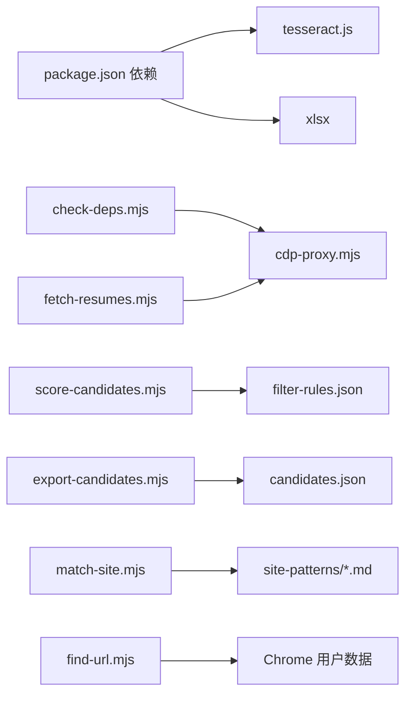

# 故障排除

<cite>
**本文引用的文件**   
- [README.md](file://README.md)
- [package.json](file://package.json)
- [scripts/check-deps.mjs](file://scripts/check-deps.mjs)
- [scripts/cdp-proxy.mjs](file://scripts/cdp-proxy.mjs)
- [scripts/fetch-resumes.mjs](file://scripts/fetch-resumes.mjs)
- [scripts/score-candidates.mjs](file://scripts/score-candidates.mjs)
- [scripts/export-candidates.mjs](file://scripts/export-candidates.mjs)
- [scripts/find-url.mjs](file://scripts/find-url.mjs)
- [scripts/match-site.mjs](file://scripts/match-site.mjs)
- [config/filter-rules.json](file://config/filter-rules.json)
- [data/candidates.json](file://data/candidates.json)
- [references/cdp-api.md](file://references/cdp-api.md)
- [docs/superpowers/specs/2026-04-23-candidate-filtering-scoring-design.md](file://docs/superpowers/specs/2026-04-23-candidate-filtering-scoring-design.md)
- [docs/superpowers/plans/2026-04-22-boss-zhipin-full-extraction-v3.md](file://docs/superpowers/plans/2026-04-22-boss-zhipin-full-extraction-v3.md)
</cite>

## 目录
1. [简介](#简介)
2. [项目结构](#项目结构)
3. [核心组件](#核心组件)
4. [架构总览](#架构总览)
5. [详细组件分析](#详细组件分析)
6. [依赖关系分析](#依赖关系分析)
7. [性能考虑](#性能考虑)
8. [故障排除指南](#故障排除指南)
9. [结论](#结论)
10. [附录](#附录)

## 简介
本指南面向使用 Web Access 项目的工程师与高级用户，聚焦于以下关键问题的系统化排查与解决：
- CDP 连接失败、Chrome 实例启动异常、依赖包缺失等环境与前置条件问题
- 候选人筛选评分阶段的规则解析错误、数据格式不匹配、评分计算异常
- 简历提取阶段的 OCR 识别失败、截图保存错误、文件权限问题
- 日志分析技巧、调试工具使用与问题定位流程
- 预防性维护建议与应急响应方案

## 项目结构
该项目采用“脚本驱动 + 配置文件 + 文档”的组织方式，核心脚本位于 scripts/ 目录，配置与样例数据位于 config/ 与 data/，站点经验与 API 文档位于 references/ 与 docs/。

**图表来源**
- [scripts/cdp-proxy.mjs:1-602](file://scripts/cdp-proxy.mjs#L1-L602)
- [scripts/check-deps.mjs:1-172](file://scripts/check-deps.mjs#L1-L172)
- [scripts/fetch-resumes.mjs:1-386](file://scripts/fetch-resumes.mjs#L1-L386)
- [scripts/score-candidates.mjs:1-406](file://scripts/score-candidates.mjs#L1-L406)
- [scripts/export-candidates.mjs:1-203](file://scripts/export-candidates.mjs#L1-L203)
- [scripts/find-url.mjs:1-215](file://scripts/find-url.mjs#L1-L215)
- [scripts/match-site.mjs:1-47](file://scripts/match-site.mjs#L1-L47)
- [config/filter-rules.json:1-41](file://config/filter-rules.json#L1-L41)
- [data/candidates.json:1-49](file://data/candidates.json#L1-L49)
- [references/cdp-api.md:1-107](file://references/cdp-api.md#L1-L107)
- [docs/superpowers/specs/2026-04-23-candidate-filtering-scoring-design.md:1-270](file://docs/superpowers/specs/2026-04-23-candidate-filtering-scoring-design.md#L1-L270)
- [docs/superpowers/plans/2026-04-22-boss-zhipin-full-extraction-v3.md:1-67](file://docs/superpowers/plans/2026-04-22-boss-zhipin-full-extraction-v3.md#L1-L67)

**章节来源**
- [README.md:1-168](file://README.md#L1-L168)
- [package.json:1-11](file://package.json#L1-L11)

## 核心组件
- CDP Proxy：通过 HTTP API 控制本地 Chrome，提供新建/关闭 Tab、导航、点击、滚动、截图、JS 执行等能力，是浏览器自动化与数据采集的中枢。
- 依赖检查脚本：自动检测 Node.js 版本、Chrome 调试端口、代理可用性，并在必要时启动代理。
- 候选人评分脚本：基于规则配置对候选人进行筛选与评分，输出结构化结果。
- 简历提取脚本：通过 CDP 打开候选人沟通页，定位在线简历弹窗，截图并调用 OCR 提取文本。
- Excel 导出脚本：将评分结果导出为 Excel，包含字段映射与列宽自适应。
- 本地 URL 检索脚本：从 Chrome 书签/历史中检索本地可用 URL，辅助定位内网/私域资源。
- 站点经验匹配脚本：根据用户输入匹配站点经验文档，输出正文内容。

**章节来源**
- [scripts/cdp-proxy.mjs:1-602](file://scripts/cdp-proxy.mjs#L1-L602)
- [scripts/check-deps.mjs:1-172](file://scripts/check-deps.mjs#L1-L172)
- [scripts/score-candidates.mjs:1-406](file://scripts/score-candidates.mjs#L1-L406)
- [scripts/fetch-resumes.mjs:1-386](file://scripts/fetch-resumes.mjs#L1-L386)
- [scripts/export-candidates.mjs:1-203](file://scripts/export-candidates.mjs#L1-L203)
- [scripts/find-url.mjs:1-215](file://scripts/find-url.mjs#L1-L215)
- [scripts/match-site.mjs:1-47](file://scripts/match-site.mjs#L1-L47)

## 架构总览
下图展示了从环境准备到数据产出的关键流程与组件交互。

**图表来源**
- [scripts/check-deps.mjs:107-139](file://scripts/check-deps.mjs#L107-L139)
- [scripts/cdp-proxy.mjs:288-552](file://scripts/cdp-proxy.mjs#L288-L552)
- [scripts/fetch-resumes.mjs:251-380](file://scripts/fetch-resumes.mjs#L251-L380)
- [scripts/score-candidates.mjs:343-383](file://scripts/score-candidates.mjs#L343-L383)
- [scripts/export-candidates.mjs:155-195](file://scripts/export-candidates.mjs#L155-L195)

## 详细组件分析

### CDP Proxy 组件
- 职责：提供 HTTP API 与 Chrome CDP 通信，负责自动发现 Chrome 调试端口、建立 WebSocket、会话管理、命令超时控制与反风控拦截。
- 关键点：
  - 自动发现端口与 wsPath，兼容不同平台与启动方式。
  - /targets、/new、/close、/navigate、/eval、/click、/clickAt、/setFiles、/scroll、/screenshot 等端点。
  - 对页面探测本地调试端口的行为进行拦截，降低风控风险。
  - 健康检查与端口占用检测。

**图表来源**
- [scripts/cdp-proxy.mjs:35-91](file://scripts/cdp-proxy.mjs#L35-L91)
- [scripts/cdp-proxy.mjs:114-200](file://scripts/cdp-proxy.mjs#L114-L200)
- [scripts/cdp-proxy.mjs:288-552](file://scripts/cdp-proxy.mjs#L288-L552)

**章节来源**
- [scripts/cdp-proxy.mjs:1-602](file://scripts/cdp-proxy.mjs#L1-L602)
- [references/cdp-api.md:1-107](file://references/cdp-api.md#L1-L107)

### 依赖检查组件
- 职责：检查 Node.js 版本、探测 Chrome 调试端口、启动并等待 CDP Proxy 就绪，列出站点经验。
- 关键点：
  - DevToolsActivePort 文件扫描与常见端口回退。
  - 代理健康检查与日志路径提示。
  - 启动代理时重定向日志至系统临时目录。

**图表来源**
- [scripts/check-deps.mjs:17-25](file://scripts/check-deps.mjs#L17-L25)
- [scripts/check-deps.mjs:65-83](file://scripts/check-deps.mjs#L65-L83)
- [scripts/check-deps.mjs:107-139](file://scripts/check-deps.mjs#L107-L139)

**章节来源**
- [scripts/check-deps.mjs:1-172](file://scripts/check-deps.mjs#L1-L172)

### 候选人评分组件
- 职责：读取候选人数据与规则配置，执行 exclude/mustHave/preferred 检查，计算分数与推荐等级，输出结构化结果。
- 关键点：
  - 字段解析：支持普通路径与数组展开（如 workExperience[].position）。
  - 比较运算：equals、contains、in、>=、>、<=、<、regex、exists。
  - 偏移修正：从 rawVisibleText 提取学历与工作年限，避免在线状态标签干扰。
  - 归一化：preferred 权重归一化到 60-100，threshold 默认 60。

**图表来源**
- [scripts/score-candidates.mjs:230-340](file://scripts/score-candidates.mjs#L230-L340)
- [docs/superpowers/specs/2026-04-23-candidate-filtering-scoring-design.md:140-178](file://docs/superpowers/specs/2026-04-23-candidate-filtering-scoring-design.md#L140-L178)

**章节来源**
- [scripts/score-candidates.mjs:1-406](file://scripts/score-candidates.mjs#L1-L406)
- [config/filter-rules.json:1-41](file://config/filter-rules.json#L1-L41)
- [docs/superpowers/specs/2026-04-23-candidate-filtering-scoring-design.md:1-270](file://docs/superpowers/specs/2026-04-23-candidate-filtering-scoring-design.md#L1-L270)

### 简历提取组件
- 职责：通过 CDP 打开 Boss 直聘沟通页，定位候选人卡片与“在线简历”弹窗，截图并调用 tesseract.js OCR 提取文本，保存为 txt。
- 关键点：
  - 列表加载等待、虚拟滚动处理、点击重试。
  - 弹窗出现等待、滚动容器尺寸获取、分页截图。
  - OCR 复用 worker、临时截图目录、失败回退与弹窗关闭。

**图表来源**
- [scripts/fetch-resumes.mjs:287-350](file://scripts/fetch-resumes.mjs#L287-L350)
- [scripts/fetch-resumes.mjs:314-346](file://scripts/fetch-resumes.mjs#L314-L346)

**章节来源**
- [scripts/fetch-resumes.mjs:1-386](file://scripts/fetch-resumes.mjs#L1-L386)

### Excel 导出组件
- 职责：将评分结果导出为 Excel，支持字段选择与列宽自适应。
- 关键点：
  - 动态导入 xlsx，缺失时给出安装提示。
  - 字段映射与默认字段顺序。
  - 自动列宽计算（中文字符加倍宽度）。

**章节来源**
- [scripts/export-candidates.mjs:1-203](file://scripts/export-candidates.mjs#L1-L203)
- [package.json:6-9](file://package.json#L6-L9)

### 本地 URL 检索组件
- 职责：从 Chrome 书签/历史检索本地可用 URL，支持关键词、时间窗、排序与多 Profile。
- 关键点：
  - 跨平台用户数据目录定位。
  - SQLite 历史复制到临时文件避免锁定。
  - 无 sqlite3 命令时给出安装指引。

**章节来源**
- [scripts/find-url.mjs:1-215](file://scripts/find-url.mjs#L1-L215)

### 站点经验匹配组件
- 职责：根据用户输入匹配站点经验文档，输出正文内容。
- 关键点：
  - 读取 references/site-patterns 下的 .md 文件。
  - 提取 aliases 并构建正则匹配模式。
  - 跳过 frontmatter，输出正文。

**章节来源**
- [scripts/match-site.mjs:1-47](file://scripts/match-site.mjs#L1-L47)

## 依赖关系分析
- 运行时依赖：tesseract.js（OCR）、xlsx（Excel 导出）。
- 环境要求：Node.js 22+，Chrome 开启远程调试。
- 组件耦合：
  - 评分与导出依赖 candidates.json 结构一致性。
  - 简历提取依赖 CDP Proxy 与 Chrome 登录态。
  - 依赖检查为上游前置条件，确保代理可用。

**图表来源**
- [package.json:6-9](file://package.json#L6-L9)
- [scripts/check-deps.mjs:1-172](file://scripts/check-deps.mjs#L1-L172)
- [scripts/cdp-proxy.mjs:1-602](file://scripts/cdp-proxy.mjs#L1-L602)
- [scripts/fetch-resumes.mjs:1-386](file://scripts/fetch-resumes.mjs#L1-L386)
- [scripts/score-candidates.mjs:1-406](file://scripts/score-candidates.mjs#L1-L406)
- [scripts/export-candidates.mjs:1-203](file://scripts/export-candidates.mjs#L1-L203)
- [scripts/find-url.mjs:1-215](file://scripts/find-url.mjs#L1-L215)
- [scripts/match-site.mjs:1-47](file://scripts/match-site.mjs#L1-L47)

**章节来源**
- [package.json:1-11](file://package.json#L1-L11)

## 性能考虑
- CDP 命令超时与重试：代理侧默认 30 秒超时，脚本侧在关键步骤设置等待与重试。
- OCR 复用：简历提取脚本初始化一次 worker 并跨候选人复用，降低内存与 CPU 开销。
- 列表滚动与懒加载：简历提取脚本在滚动后等待 300-800ms，确保渲染与懒加载触发。
- Excel 列宽：自动列宽计算避免手动调整，提升可读性。

[本节为通用指导，不直接分析具体文件]

## 故障排除指南

### 一、CDP 连接失败
- 症状
  - 代理健康检查失败、/targets 返回非数组、命令超时。
- 常见原因
  - Chrome 未开启远程调试端口或授权弹窗未点击。
  - DevToolsActivePort 文件缺失或端口被占用。
  - Node.js 版本低于 22，或未安装 ws 模块。
- 排查步骤
  - 使用依赖检查脚本确认 Chrome 端口与代理状态。
  - 手动访问 chrome://inspect/#remote-debugging 并勾选 Allow remote debugging。
  - 若端口被占用，先健康检查已有实例，必要时强制停止后重试。
  - 确认 Node.js 版本与 WebSocket 依赖。
- 相关日志与输出
  - 代理启动日志与端口占用提示。
  - 依赖检查脚本输出的 Chrome/代理状态与 site-patterns 列表。
- 应急措施
  - 重启 Chrome 并重新授权。
  - 使用 /targets 获取最新 target 列表，避免使用已关闭的 targetId。

**章节来源**
- [scripts/check-deps.mjs:107-139](file://scripts/check-deps.mjs#L107-L139)
- [scripts/cdp-proxy.mjs:114-200](file://scripts/cdp-proxy.mjs#L114-L200)
- [references/cdp-api.md:101-107](file://references/cdp-api.md#L101-L107)

### 二、Chrome 实例启动异常
- 症状
  - /new 创建新 Tab 失败、导航后页面未加载。
- 常见原因
  - Chrome 未开启远程调试、wsPath 不匹配。
  - 页面长时间未响应，CDP 命令超时。
- 排查步骤
  - 确认 Chrome 已开启远程调试端口。
  - 使用 /health 检查代理连接状态。
  - 在 /navigate 后等待页面加载完成，必要时重试。
- 应急措施
  - 重新授权后重试 /new。
  - 使用 /back 回退一步，再尝试导航。

**章节来源**
- [scripts/cdp-proxy.mjs:306-345](file://scripts/cdp-proxy.mjs#L306-L345)
- [references/cdp-api.md:12-52](file://references/cdp-api.md#L12-L52)

### 三、依赖包缺失
- 症状
  - 导出 Excel 报错“未安装 xlsx 包”，或 OCR 初始化失败。
- 常见原因
  - 未安装依赖或安装不完整。
- 排查步骤
  - 检查 package.json 中的依赖声明。
  - 在导出脚本中动态导入 xlsx，若失败则提示安装命令。
  - 确认 tesseract.js 可用，必要时预下载语言包。
- 应急措施
  - 执行安装命令后重试。
  - 使用静态导入或预打包方式避免运行时导入失败。

**章节来源**
- [scripts/export-candidates.mjs:15-23](file://scripts/export-candidates.mjs#L15-L23)
- [package.json:6-9](file://package.json#L6-L9)

### 四、候选人筛选评分阶段问题

#### 1. 规则解析错误
- 症状
  - 比较运算符不支持、字段路径无效、数组展开语法错误。
- 常见原因
  - 规则配置中 operator 未在支持集合内。
  - 字段路径包含非法字符或不存在。
  - 数组路径未按约定使用 []。
- 排查步骤
  - 核对规则配置结构与操作符支持集。
  - 使用字段解析函数验证路径有效性。
  - 检查数组字段是否正确展开。
- 应急措施
  - 修正规则配置后重试。
  - 使用 exists 检查字段是否存在。

**章节来源**
- [scripts/score-candidates.mjs:149-200](file://scripts/score-candidates.mjs#L149-L200)
- [scripts/score-candidates.mjs:88-110](file://scripts/score-candidates.mjs#L88-L110)
- [config/filter-rules.json:1-41](file://config/filter-rules.json#L1-L41)

#### 2. 数据格式不匹配
- 症状
  - 工作年限字符串与数值比较失败、学历排序异常。
- 常见原因
  - rawVisibleText 格式与解析规则不一致。
  - 字段值类型与比较期望不符。
- 排查步骤
  - 检查 rawVisibleText 中学历与工作年限的提取逻辑。
  - 使用解析函数验证字段值类型与范围。
- 应急措施
  - 修正站点经验文件中的 DOM 结构与提取规则。
  - 在评分前对字段进行清洗与标准化。

**章节来源**
- [docs/superpowers/specs/2026-04-23-candidate-filtering-scoring-design.md:102-139](file://docs/superpowers/specs/2026-04-23-candidate-filtering-scoring-design.md#L102-L139)
- [scripts/score-candidates.mjs:202-219](file://scripts/score-candidates.mjs#L202-L219)

#### 3. 评分计算异常
- 症状
  - 分数不在 60-100 区间、推荐等级异常、阈值判定错误。
- 常见原因
  - preferred 权重总和为 0 导致归一化异常。
  - exclude 命中后直接置零，未继续计算。
- 排查步骤
  - 检查 exclude/mustHave/preferred 的执行顺序与结果。
  - 验证阈值与归一化逻辑。
- 应急措施
  - 调整规则权重与阈值，确保有 preferred 规则或 mustHave 全部满足。

**章节来源**
- [scripts/score-candidates.mjs:230-340](file://scripts/score-candidates.mjs#L230-L340)
- [docs/superpowers/specs/2026-04-23-candidate-filtering-scoring-design.md:159-178](file://docs/superpowers/specs/2026-04-23-candidate-filtering-scoring-design.md#L159-L178)

### 五、简历提取阶段问题

#### 1. OCR 识别失败
- 症状
  - OCR 返回空文本或识别错误。
- 常见原因
  - 截图质量差、语言模型未加载、图像过大。
- 排查步骤
  - 检查截图保存路径与文件存在性。
  - 确认 OCR worker 初始化成功。
  - 降低图像分辨率或裁剪关键区域。
- 应急措施
  - 重试 OCR，必要时更换语言包。
  - 人工核对关键页码与文本。

**章节来源**
- [scripts/fetch-resumes.mjs:235-243](file://scripts/fetch-resumes.mjs#L235-L243)
- [package.json:7-8](file://package.json#L7-L8)

#### 2. 截图保存错误
- 症状
  - /screenshot 返回二进制或保存失败。
- 常见原因
  - 输出路径不存在或无写权限。
- 排查步骤
  - 确认输出目录存在并具备写权限。
  - 检查文件名安全处理与特殊字符替换。
- 应急措施
  - 创建输出目录并赋予写权限。
  - 使用安全文件名替换规则。

**章节来源**
- [scripts/fetch-resumes.mjs:274-279](file://scripts/fetch-resumes.mjs#L274-L279)
- [scripts/fetch-resumes.mjs:246-248](file://scripts/fetch-resumes.mjs#L246-L248)

#### 3. 文件权限问题
- 症状
  - 写入失败、临时目录清理失败。
- 常见原因
  - 当前用户无目录写权限。
- 排查步骤
  - 检查输出与临时目录权限。
  - 使用管理员权限或调整目录归属。
- 应急措施
  - 修改目录权限或切换到可写目录。

**章节来源**
- [scripts/fetch-resumes.mjs:355-356](file://scripts/fetch-resumes.mjs#L355-L356)

### 六、日志分析技巧与调试工具
- 日志位置
  - 代理日志：系统临时目录下的 cdp-proxy.log。
  - 依赖检查：标准输出的状态与提示。
- 调试工具
  - 使用 /health、/targets、/info 等端点检查代理与页面状态。
  - 使用 /eval 执行 JS 验证 DOM 结构与选择器。
  - 使用 /screenshot 截图定位元素与布局问题。
- 问题定位流程
  - 先用 /targets 确认目标 Tab 列表。
  - 用 /info 获取页面标题/URL/readyState。
  - 用 /eval 验证关键选择器与元素存在性。
  - 用 /screenshot 核对布局与滚动区域。

**章节来源**
- [scripts/check-deps.mjs:96-105](file://scripts/check-deps.mjs#L96-L105)
- [scripts/cdp-proxy.mjs:297-301](file://scripts/cdp-proxy.mjs#L297-L301)
- [references/cdp-api.md:12-52](file://references/cdp-api.md#L12-L52)

### 七、预防性维护与应急响应
- 预防性维护
  - 定期升级 Node.js 至 22+，确保原生 WebSocket 支持。
  - 保持 Chrome 最新版本，避免 CDP 行为变更。
  - 预先安装并测试 xlsx 与 tesseract.js 语言包。
  - 定期验证 /targets 与 /health 的可用性。
- 应急响应
  - 代理端口占用：先健康检查，必要时强制停止后重启。
  - Chrome 授权弹窗：手动点击“允许”，重试连接。
  - 规则配置错误：回滚至上一版本，逐步修正。
  - OCR 识别失败：切换语言模型或人工干预。

**章节来源**
- [scripts/cdp-proxy.mjs:564-591](file://scripts/cdp-proxy.mjs#L564-L591)
- [README.md:104-117](file://README.md#L104-L117)

## 结论
本指南围绕 CDP 连接、Chrome 实例、依赖包、候选人筛选评分与简历提取五大领域提供了系统化的故障排除方法。通过依赖检查前置、CDP API 端点验证、规则与数据格式校验、OCR 与文件权限保障以及日志与调试工具的综合运用，可显著提升问题定位效率与系统稳定性。建议在生产环境中建立定期巡检与应急演练机制，确保流程可恢复、可追溯。

[本节为总结性内容，不直接分析具体文件]

## 附录

### A. 常用命令与端点速查
- 依赖检查：node scripts/check-deps.mjs
- 启动代理：node scripts/cdp-proxy.mjs
- 健康检查：curl http://localhost:3456/health
- 列出 Tab：curl http://localhost:3456/targets
- 新建 Tab：curl "http://localhost:3456/new?url=URL"
- 截图：curl "http://localhost:3456/screenshot?target=ID&file=/tmp/shot.png"

**章节来源**
- [references/cdp-api.md:12-89](file://references/cdp-api.md#L12-L89)

### B. 规则配置示例与字段说明
- 规则文件：config/filter-rules.json
- 支持操作符：equals、contains、in、>=、>、<=、<、regex、exists
- 数组字段：workExperience[].position

**章节来源**
- [config/filter-rules.json:1-41](file://config/filter-rules.json#L1-L41)
- [docs/superpowers/specs/2026-04-23-candidate-filtering-scoring-design.md:87-97](file://docs/superpowers/specs/2026-04-23-candidate-filtering-scoring-design.md#L87-L97)