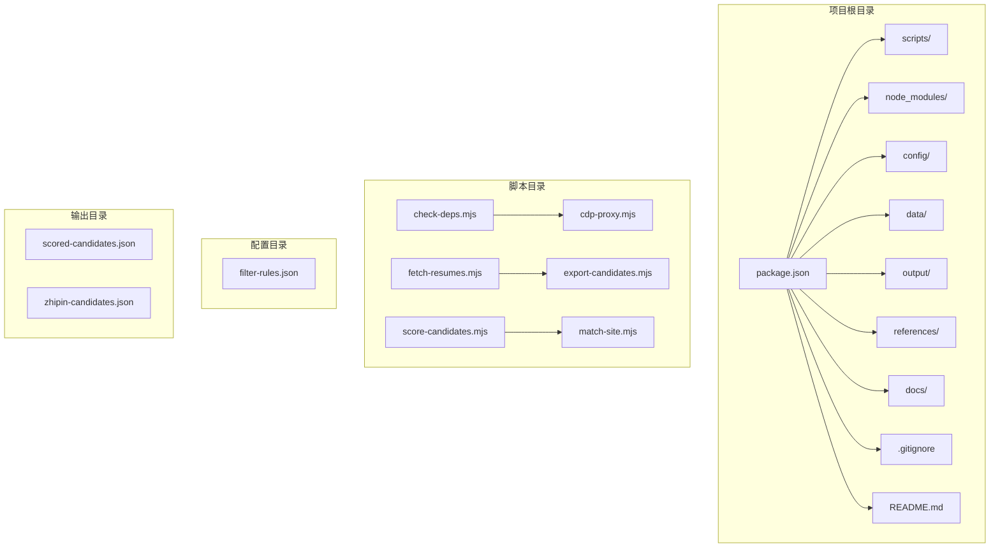
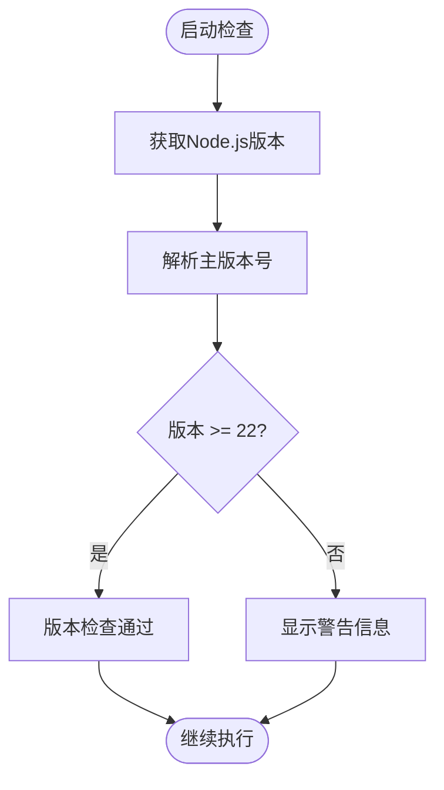
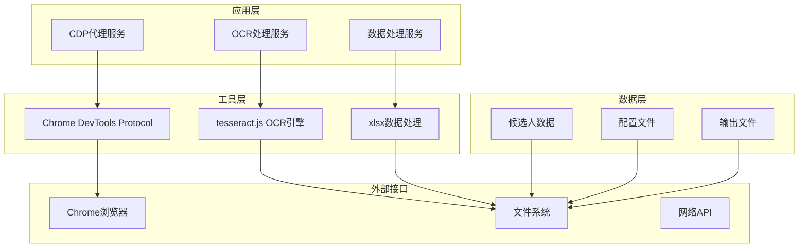
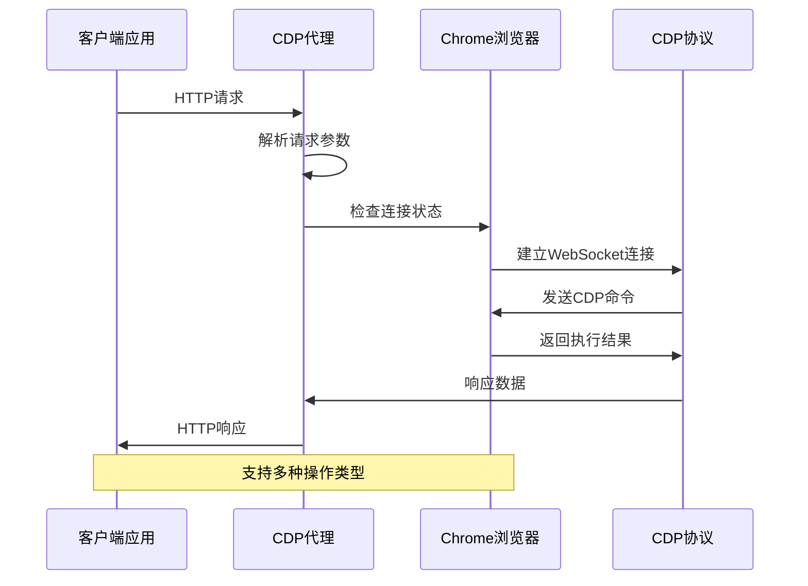
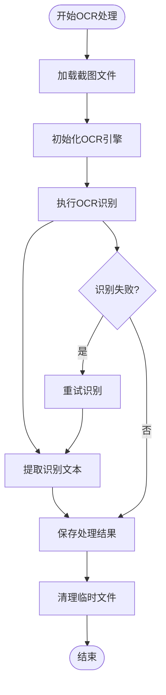
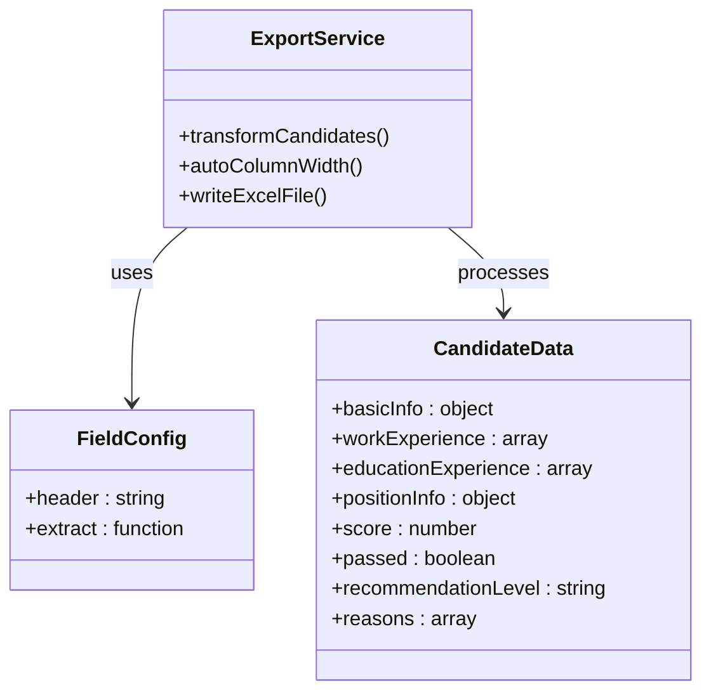
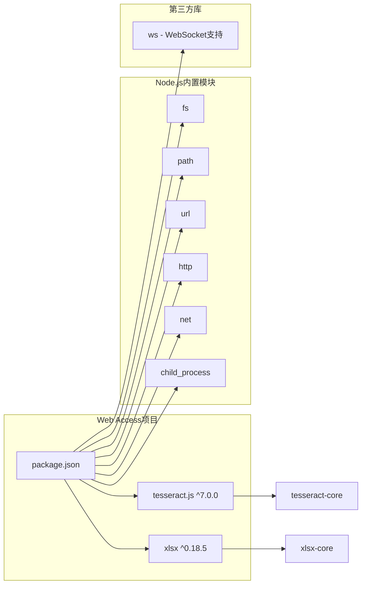
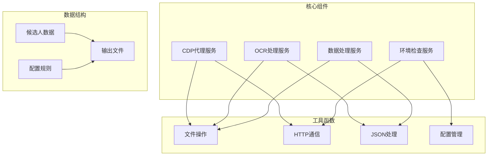

# 环境配置

<cite>
**本文档引用的文件**
- [package.json](file://package.json)
- [.gitignore](file://.gitignore)
- [README.md](file://README.md)
- [scripts/check-deps.mjs](file://scripts/check-deps.mjs)
- [scripts/cdp-proxy.mjs](file://scripts/cdp-proxy.mjs)
- [scripts/fetch-resumes.mjs](file://scripts/fetch-resumes.mjs)
- [scripts/export-candidates.mjs](file://scripts/export-candidates.mjs)
- [config/filter-rules.json](file://config/filter-rules.json)
- [.claude/settings.local.json](file://.claude/settings.local.json)
</cite>

## 目录
1. [简介](#简介)
2. [项目结构](#项目结构)
3. [核心组件](#核心组件)
4. [架构概览](#架构概览)
5. [详细组件分析](#详细组件分析)
6. [依赖关系分析](#依赖关系分析)
7. [性能考虑](#性能考虑)
8. [故障排除指南](#故障排除指南)
9. [结论](#结论)

## 简介

Web Access是一个专为AI代理设计的Web访问和候选人管理工具集。该项目提供了完整的浏览器自动化能力，包括CDP（Chrome DevTools Protocol）代理、图像识别（OCR）和数据处理功能。项目的核心特性包括：

- **CDP代理服务**：通过HTTP API控制Chrome浏览器，实现真实的用户交互
- **OCR文本识别**：集成tesseract.js进行图像到文本的转换
- **数据处理**：使用xlsx库进行Excel文件的读写和处理
- **候选人管理**：完整的候选人筛选、评分和导出流程

## 项目结构

Web Access项目采用模块化的文件组织方式，主要包含以下结构：

**图表来源**
- [package.json:1-11](file://package.json#L1-L11)
- [scripts/check-deps.mjs:1-172](file://scripts/check-deps.mjs#L1-L172)

**章节来源**
- [package.json:1-11](file://package.json#L1-L11)
- [README.md:1-168](file://README.md#L1-L168)

## 核心组件

### Node.js运行时要求

Web Access项目对Node.js版本有严格要求：

- **最低版本**：Node.js 22+
- **推荐版本**：使用最新稳定版Node.js 22.x
- **模块类型**：ES模块（type: module）

**版本检查机制**：
项目包含内置的版本检查功能，会在运行时验证Node.js版本：

**图表来源**
- [scripts/check-deps.mjs:17-25](file://scripts/check-deps.mjs#L17-L25)

### 依赖包配置

项目的核心依赖包包括：

#### tesseract.js
- **版本要求**：^7.0.0
- **用途**：OCR（光学字符识别）功能
- **应用场景**：从截图中提取文本内容
- **语言支持**：中文简体 + 英语（chi_sim+eng）

#### xlsx
- **版本要求**：^0.18.5
- **用途**：Excel文件处理
- **功能**：读取、写入和格式化Excel文件
- **数据导出**：候选人信息的Excel格式导出

**章节来源**
- [package.json:6-9](file://package.json#L6-L9)
- [scripts/fetch-resumes.mjs:283-284](file://scripts/fetch-resumes.mjs#L283-L284)
- [scripts/export-candidates.mjs:15-23](file://scripts/export-candidates.mjs#L15-L23)

## 架构概览

Web Access采用分层架构设计，主要包含以下层次：

**图表来源**
- [scripts/cdp-proxy.mjs:1-602](file://scripts/cdp-proxy.mjs#L1-L602)
- [scripts/fetch-resumes.mjs:1-386](file://scripts/fetch-resumes.mjs#L1-L386)
- [scripts/export-candidates.mjs:1-203](file://scripts/export-candidates.mjs#L1-L203)

## 详细组件分析

### CDP代理服务

CDP（Chrome DevTools Protocol）代理是Web Access的核心组件，提供HTTP API来控制Chrome浏览器。

#### 核心功能
- **浏览器连接**：自动发现和连接Chrome实例
- **页面管理**：创建、导航、关闭浏览器标签页
- **用户交互**：模拟点击、滚动、文件上传等操作
- **截图功能**：捕获页面截图并保存为文件

#### 代理架构

**图表来源**
- [scripts/cdp-proxy.mjs:288-552](file://scripts/cdp-proxy.mjs#L288-L552)

#### 端口配置
- **默认端口**：3456
- **环境变量**：CDP_PROXY_PORT
- **端口检测**：自动检测可用端口

**章节来源**
- [scripts/cdp-proxy.mjs:13](file://scripts/cdp-proxy.mjs#L13)
- [scripts/cdp-proxy.mjs:564-591](file://scripts/cdp-proxy.mjs#L564-L591)

### OCR处理服务

OCR（光学字符识别）服务用于从截图中提取文本内容，特别是处理在线简历的截图。

#### OCR引擎配置
- **引擎选择**：tesseract.js
- **语言包**：中文简体 + 英语
- **并发处理**：支持多候选人并行处理

#### 处理流程

**图表来源**
- [scripts/fetch-resumes.mjs:235-243](file://scripts/fetch-resumes.mjs#L235-L243)

**章节来源**
- [scripts/fetch-resumes.mjs:283-284](file://scripts/fetch-resumes.mjs#L283-L284)
- [scripts/fetch-resumes.mjs:235-243](file://scripts/fetch-resumes.mjs#L235-L243)

### 数据处理服务

数据处理服务负责候选人数据的Excel格式导出和格式化。

#### 字段映射
系统支持多种候选人字段的导出，包括：
- 基本信息：姓名、年龄、工作年限
- 教育背景：学校、学历
- 工作经验：当前职位、公司
- 评分信息：分数、推荐等级
- 其他：期望城市、期望薪资

#### Excel处理

**图表来源**
- [scripts/export-candidates.mjs:44-103](file://scripts/export-candidates.mjs#L44-L103)
- [scripts/export-candidates.mjs:123-132](file://scripts/export-candidates.mjs#L123-L132)

**章节来源**
- [scripts/export-candidates.mjs:44-103](file://scripts/export-candidates.mjs#L44-L103)
- [scripts/export-candidates.mjs:123-132](file://scripts/export-candidates.mjs#L123-L132)

## 依赖关系分析

### 外部依赖关系

**图表来源**
- [package.json:6-9](file://package.json#L6-L9)
- [scripts/cdp-proxy.mjs:19-33](file://scripts/cdp-proxy.mjs#L19-L33)

### 内部组件依赖

**图表来源**
- [scripts/check-deps.mjs:1-172](file://scripts/check-deps.mjs#L1-L172)
- [scripts/fetch-resumes.mjs:18-386](file://scripts/fetch-resumes.mjs#L18-L386)
- [scripts/export-candidates.mjs:11-203](file://scripts/export-candidates.mjs#L11-L203)

**章节来源**
- [scripts/check-deps.mjs:1-172](file://scripts/check-deps.mjs#L1-L172)
- [scripts/fetch-resumes.mjs:18-386](file://scripts/fetch-resumes.mjs#L18-L386)
- [scripts/export-candidates.mjs:11-203](file://scripts/export-candidates.mjs#L11-L203)

## 性能考虑

### 系统资源要求

#### 内存要求
- **最小内存**：4GB RAM
- **推荐内存**：8GB+ RAM
- **OCR处理**：每个候选人约需额外200MB内存

#### 存储空间
- **安装空间**：约500MB
- **临时文件**：根据候选人数量而定（每个候选人约1-5MB截图）
- **输出文件**：根据处理结果而定

#### CPU要求
- **基础处理**：单核即可满足基本需求
- **并发处理**：多核CPU可显著提升处理速度
- **OCR计算**：CPU密集型操作，建议使用现代CPU

### 性能优化建议

1. **并发控制**：合理设置同时处理的候选人数量
2. **内存管理**：及时清理临时文件和终止OCR进程
3. **网络优化**：确保稳定的网络连接以避免重试
4. **浏览器优化**：保持Chrome更新到最新版本

## 故障排除指南

### 环境检查问题

#### Node.js版本问题
**症状**：启动时显示Node.js版本警告
**解决方案**：
1. 升级到Node.js 22+
2. 验证安装：`node --version`
3. 重启终端会话

#### Chrome连接问题
**症状**：CDP代理无法连接Chrome
**解决方案**：
1. 确保Chrome已启动
2. 在Chrome中启用远程调试：`chrome://inspect/#remote-debugging`
3. 勾选"Allow remote debugging for this browser instance"
4. 重启Chrome浏览器

#### 端口冲突问题
**症状**：端口3456被占用
**解决方案**：
1. 检查端口占用：`netstat -an | grep 3456`
2. 修改端口：设置环境变量`CDP_PROXY_PORT=3457`
3. 关闭占用端口的进程

### 常见错误及解决方法

#### OCR处理失败
**症状**：OCR识别返回空结果
**可能原因**：
- 图像质量差
- 语言包未正确加载
- 内存不足

**解决方法**：
1. 检查截图质量
2. 重新初始化OCR引擎
3. 增加系统内存

#### Excel导出错误
**症状**：导出Excel文件时出现错误
**可能原因**：
- xlsx包未安装
- 文件权限问题
- 磁盘空间不足

**解决方法**：
1. 安装xlsx包：`npm install xlsx`
2. 检查文件权限
3. 清理磁盘空间

#### 依赖包问题
**症状**：运行时出现模块导入错误
**解决方法**：
1. 清理node_modules：`rm -rf node_modules`
2. 清理缓存：`npm cache clean --force`
3. 重新安装：`npm install`

**章节来源**
- [scripts/check-deps.mjs:143-171](file://scripts/check-deps.mjs#L143-L171)
- [scripts/cdp-proxy.mjs:114-139](file://scripts/cdp-proxy.mjs#L114-L139)
- [scripts/fetch-resumes.mjs:382-385](file://scripts/fetch-resumes.mjs#L382-L385)

## 结论

Web Access项目提供了完整的Web访问和候选人管理解决方案。其环境配置相对简洁，主要依赖于Node.js 22+运行时和两个核心库：tesseract.js用于OCR处理，xlsx用于Excel数据处理。

### 关键要点

1. **版本兼容性**：严格要求Node.js 22+，这是项目正常运行的基础
2. **依赖管理**：两个核心依赖包提供了完整的功能覆盖
3. **配置灵活性**：支持环境变量配置，便于不同环境部署
4. **错误处理**：完善的错误检查和恢复机制

### 部署建议

- **开发环境**：建议使用最新稳定版Node.js 22.x
- **生产环境**：确保系统资源充足，特别是内存和存储空间
- **监控配置**：定期检查CDP代理连接状态和OCR处理性能
- **备份策略**：定期备份候选人数据和配置文件

通过遵循本指南的配置要求和最佳实践，可以确保Web Access项目在各种环境中稳定可靠地运行。