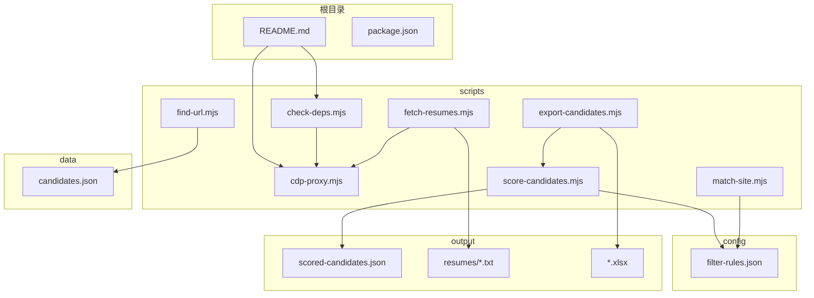
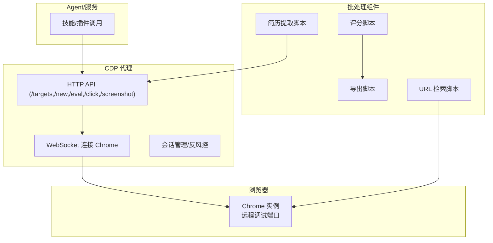
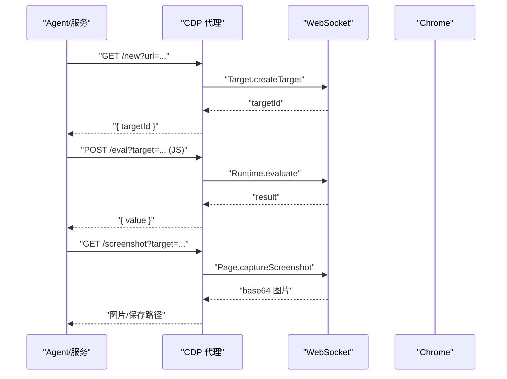
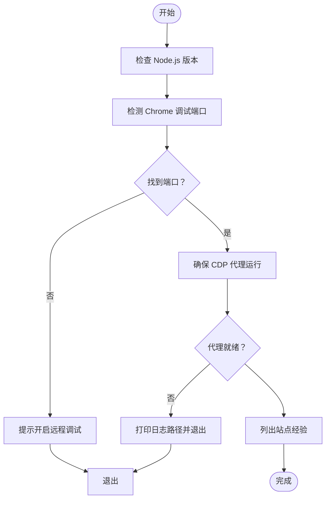
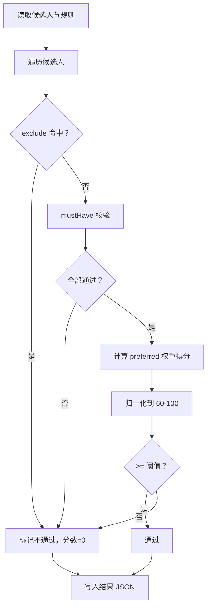
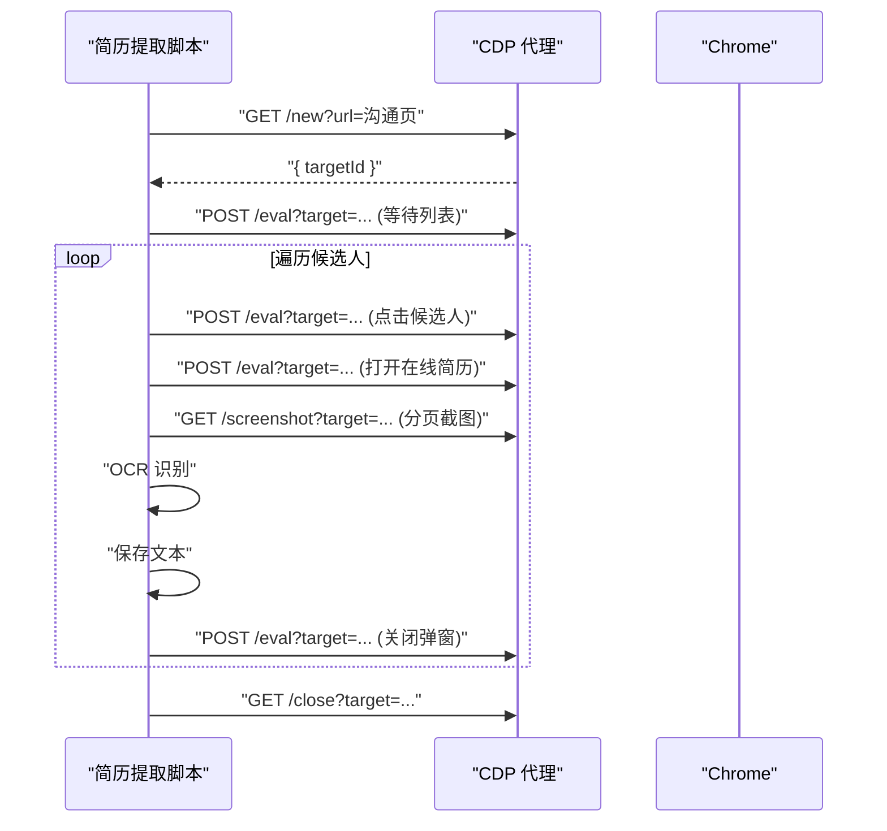
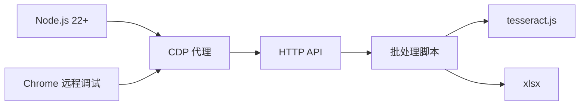

# 部署运维

<cite>
**本文引用的文件**
- [README.md](file://README.md)
- [package.json](file://package.json)
- [config/filter-rules.json](file://config/filter-rules.json)
- [data/candidates.json](file://data/candidates.json)
- [scripts/check-deps.mjs](file://scripts/check-deps.mjs)
- [scripts/cdp-proxy.mjs](file://scripts/cdp-proxy.mjs)
- [scripts/fetch-resumes.mjs](file://scripts/fetch-resumes.mjs)
- [scripts/score-candidates.mjs](file://scripts/score-candidates.mjs)
- [scripts/export-candidates.mjs](file://scripts/export-candidates.mjs)
- [scripts/find-url.mjs](file://scripts/find-url.mjs)
- [scripts/match-site.mjs](file://scripts/match-site.mjs)
</cite>

## 目录
1. [简介](#简介)
2. [项目结构](#项目结构)
3. [核心组件](#核心组件)
4. [架构总览](#架构总览)
5. [详细组件分析](#详细组件分析)
6. [依赖分析](#依赖分析)
7. [性能考虑](#性能考虑)
8. [故障排查指南](#故障排查指南)
9. [结论](#结论)
10. [附录](#附录)

## 简介
本文件面向生产环境的部署与运维，围绕 Web Access 项目提供从环境准备、依赖管理、容器化与 CI/CD、性能优化、监控与告警、安全与权限、版本升级与兼容性维护到常见问题诊断的全流程指导。项目以 Node.js 脚本为核心，结合 CDP（Chrome DevTools Protocol）代理实现浏览器自动化与站点经验复用，配套简历提取、评分与导出等流水线工具。

## 项目结构
仓库采用“脚本驱动 + 配置文件 + 数据输出”的组织方式：
- scripts：核心自动化脚本（CDP 代理、依赖检查、简历提取、评分、导出、站点匹配、URL 检索）
- config：筛选规则配置（JSON）
- data：示例候选人数据（JSON）
- output、output-01：流水线输出目录（示例）
- docs/superpowers、references：设计文档与站点经验参考
- 根目录：README、package.json、依赖锁文件等

图表来源
- [README.md:1-168](file://README.md#L1-L168)
- [package.json:1-11](file://package.json#L1-L11)
- [scripts/check-deps.mjs:1-172](file://scripts/check-deps.mjs#L1-L172)
- [scripts/cdp-proxy.mjs:1-602](file://scripts/cdp-proxy.mjs#L1-L602)
- [scripts/fetch-resumes.mjs:1-386](file://scripts/fetch-resumes.mjs#L1-L386)
- [scripts/score-candidates.mjs:1-406](file://scripts/score-candidates.mjs#L1-L406)
- [scripts/export-candidates.mjs:1-203](file://scripts/export-candidates.mjs#L1-L203)
- [scripts/find-url.mjs:1-215](file://scripts/find-url.mjs#L1-L215)
- [scripts/match-site.mjs:1-47](file://scripts/match-site.mjs#L1-L47)
- [config/filter-rules.json:1-41](file://config/filter-rules.json#L1-L41)
- [data/candidates.json:1-49](file://data/candidates.json#L1-L49)

章节来源
- [README.md:1-168](file://README.md#L1-L168)
- [package.json:1-11](file://package.json#L1-L11)

## 核心组件
- CDP 代理服务：提供 HTTP API 控制本地 Chrome，实现新建标签、导航、点击、截图、滚动、执行 JS、文件上传等操作，并内置反风控（拦截调试端口探测）与会话管理。
- 依赖检查脚本：自动检测 Node.js 版本、Chrome 远程调试端口、自动启动并等待 CDP 代理就绪，列出可用站点经验。
- 候选人评分：基于规则集对候选人打分并筛选，支持必须项、偏好项、排除项、阈值与权重。
- 简历提取：通过 CDP 打开在线简历弹窗、截图、OCR 识别并保存文本。
- 导出：将评分后的候选人导出为 Excel。
- URL 检索：从本地 Chrome 书签/历史检索内部系统、SSO 后台等公网无法覆盖的地址。
- 站点匹配：根据用户输入匹配站点经验文件，辅助 Agent 决策。

章节来源
- [scripts/cdp-proxy.mjs:1-602](file://scripts/cdp-proxy.mjs#L1-L602)
- [scripts/check-deps.mjs:1-172](file://scripts/check-deps.mjs#L1-L172)
- [scripts/score-candidates.mjs:1-406](file://scripts/score-candidates.mjs#L1-L406)
- [scripts/fetch-resumes.mjs:1-386](file://scripts/fetch-resumes.mjs#L1-L386)
- [scripts/export-candidates.mjs:1-203](file://scripts/export-candidates.mjs#L1-L203)
- [scripts/find-url.mjs:1-215](file://scripts/find-url.mjs#L1-L215)
- [scripts/match-site.mjs:1-47](file://scripts/match-site.mjs#L1-L47)

## 架构总览
下图展示生产环境典型部署形态：Agent/服务通过 CDP 代理控制本地 Chrome，CDP 代理直连 Chrome 实例；评分与导出脚本作为批处理组件参与流水线；依赖检查脚本在启动前保障运行环境。

图表来源
- [scripts/cdp-proxy.mjs:288-552](file://scripts/cdp-proxy.mjs#L288-L552)
- [scripts/check-deps.mjs:107-139](file://scripts/check-deps.mjs#L107-L139)
- [scripts/fetch-resumes.mjs:24-85](file://scripts/fetch-resumes.mjs#L24-L85)
- [scripts/score-candidates.mjs:342-383](file://scripts/score-candidates.mjs#L342-L383)
- [scripts/export-candidates.mjs:154-201](file://scripts/export-candidates.mjs#L154-L201)
- [scripts/find-url.mjs:175-215](file://scripts/find-url.mjs#L175-L215)

## 详细组件分析

### CDP 代理服务（生产部署要点）
- 端口与进程管理
  - 默认端口可通过环境变量配置；启动时检查端口占用并健康探活，避免冲突。
  - 首次请求失败会尝试连接 Chrome，若失败需确认 Chrome 已开启远程调试。
- WebSocket 连接与会话
  - 自动发现 Chrome 调试端口与 ws 路径，支持多平台 DevToolsActivePort 文件与常见端口回退。
  - 会话管理基于 Target.attachToTarget，统一管理页面生命周期。
- 反风控与安全
  - 通过 Fetch.enable 对 127.0.0.1:port 的调试端口探测请求进行拦截，降低被平台识别为自动化风险。
- API 能力
  - 健康检查、列出目标、新建/关闭标签、导航、后退、执行 JS、点击（JS/鼠标事件）、滚动、截图、文件上传、信息查询等。
- 性能与稳定性
  - 命令超时控制、未捕获异常与拒绝处理，保证长时间运行稳定。

图表来源
- [scripts/cdp-proxy.mjs:288-552](file://scripts/cdp-proxy.mjs#L288-L552)
- [scripts/cdp-proxy.mjs:113-200](file://scripts/cdp-proxy.mjs#L113-L200)

章节来源
- [scripts/cdp-proxy.mjs:1-602](file://scripts/cdp-proxy.mjs#L1-L602)

### 依赖检查与环境准备
- Node.js 版本：要求 Node.js 22+，低于 22 时给出升级建议。
- Chrome 远程调试：检测 DevToolsActivePort 文件与常见端口，若未发现则提示开启远程调试。
- CDP 代理：若未就绪，自动后台启动并轮询 /targets，等待代理就绪；超时提示检查日志。
- 站点经验：列出 references/site-patterns 下的可用经验文件，便于 Agent 决策。

图表来源
- [scripts/check-deps.mjs:17-169](file://scripts/check-deps.mjs#L17-L169)

章节来源
- [scripts/check-deps.mjs:1-172](file://scripts/check-deps.mjs#L1-L172)

### 候选人评分与筛选
- 规则结构：mustHave（必须）、preferred（偏好，带权重）、exclude（排除）、threshold（阈值）。
- 字段解析：支持普通字段与数组字段路径（如 workExperience[].position），并提供从 rawVisibleText 智能解析学历与工作年限的回退逻辑。
- 评分算法：mustHave 全通过给基础分，preferred 按权重比例加分，最终归一化至 60-100 区间，再与阈值比较判定通过。
- 输出：生成包含筛选规则元信息、统计与通过名单的 JSON。

图表来源
- [scripts/score-candidates.mjs:230-340](file://scripts/score-candidates.mjs#L230-L340)
- [config/filter-rules.json:1-41](file://config/filter-rules.json#L1-L41)

章节来源
- [scripts/score-candidates.mjs:1-406](file://scripts/score-candidates.mjs#L1-L406)
- [config/filter-rules.json:1-41](file://config/filter-rules.json#L1-L41)

### 简历提取与 OCR
- 流程：创建新标签 → 等待候选人列表 → 滚动可见 → 点击候选人 → 打开在线简历弹窗 → 截图分页 → OCR 识别 → 保存文本 → 关闭弹窗。
- 截图与 OCR：按简历容器高度分页滚动截图，使用 tesseract.js 识别中文+英文，支持临时目录与结果汇总。
- 错误处理：单个候选人失败不影响整体流程，最终输出成功/失败清单与摘要 JSON。

图表来源
- [scripts/fetch-resumes.mjs:287-350](file://scripts/fetch-resumes.mjs#L287-L350)
- [scripts/cdp-proxy.mjs:305-527](file://scripts/cdp-proxy.mjs#L305-L527)

章节来源
- [scripts/fetch-resumes.mjs:1-386](file://scripts/fetch-resumes.mjs#L1-L386)

### Excel 导出
- 字段映射：支持自定义字段顺序，自动计算列宽，中文字符宽度加倍处理。
- 输出：生成包含“候选人”工作表的 Excel 文件，并打印统计信息。

章节来源
- [scripts/export-candidates.mjs:1-203](file://scripts/export-candidates.mjs#L1-L203)

### URL 检索（本地 Chrome 书签/历史）
- 功能：在多 Profile 下检索书签与历史，支持关键词 AND、时间窗、访问频次排序、限制条数。
- 依赖：SQLite 命令行工具，复制 History 到临时文件避免运行时锁定。
- 输出：以管道分隔格式打印，便于后续处理。

章节来源
- [scripts/find-url.mjs:1-215](file://scripts/find-url.mjs#L1-L215)

### 站点经验匹配
- 功能：根据用户输入匹配 references/site-patterns 下的 Markdown 文件，提取别名与正文输出，辅助 Agent 决策。
- 用途：在 Agent 执行前提供站点经验上下文。

章节来源
- [scripts/match-site.mjs:1-47](file://scripts/match-site.mjs#L1-L47)

## 依赖分析
- 运行时依赖
  - Node.js 22+（原生 WebSocket）
  - Chrome（开启远程调试）
  - tesseract.js（OCR）
  - xlsx（Excel 导出）
- 跨平台支持
  - DevToolsActivePort 文件路径、常见调试端口、Profile 目录、SQLite 命令等均按平台区分。
- 端口与网络
  - CDP 代理默认监听 127.0.0.1:3456，避免外部暴露；WebSocket 连接直连本地 Chrome。

图表来源
- [scripts/cdp-proxy.mjs:13-33](file://scripts/cdp-proxy.mjs#L13-L33)
- [package.json:6-9](file://package.json#L6-L9)
- [scripts/fetch-resumes.mjs:283-284](file://scripts/fetch-resumes.mjs#L283-L284)
- [scripts/export-candidates.mjs:15-23](file://scripts/export-candidates.mjs#L15-L23)

章节来源
- [package.json:1-11](file://package.json#L1-L11)
- [scripts/cdp-proxy.mjs:1-602](file://scripts/cdp-proxy.mjs#L1-L602)

## 性能考虑
- 并行与隔离
  - 多目标时可并行执行，共享同一代理并在 Tab 级隔离，减少重复启动成本。
- 超时与重试
  - CDP 命令超时控制（默认 30 秒），页面加载等待与滚动后延迟，避免过早读取。
- I/O 优化
  - 临时截图目录与批量 OCR，完成后可选择清理；导出时自动列宽避免过大文件。
- 资源使用
  - OCR 引擎复用（跨候选人），减少初始化开销；截图质量按格式调整。
- 端口与连接
  - TCP 探测避免触发 Chrome 授权弹窗；会话复用与缓存端口，降低连接抖动。

章节来源
- [scripts/cdp-proxy.mjs:202-217](file://scripts/cdp-proxy.mjs#L202-L217)
- [scripts/fetch-resumes.mjs:281-285](file://scripts/fetch-resumes.mjs#L281-L285)
- [scripts/export-candidates.mjs:134-152](file://scripts/export-candidates.mjs#L134-L152)

## 故障排查指南
- 依赖检查失败
  - 现象：未检测到 Chrome 调试端口或代理未就绪。
  - 处理：确认 Chrome 已开启远程调试；查看依赖检查脚本输出的日志路径；必要时手动启动代理。
- 代理连接失败
  - 现象：WebSocket 连接错误或端口缓存失效。
  - 处理：清理端口缓存（断开后自动清除），等待下次重新发现；检查防火墙与安全软件。
- 页面加载与交互异常
  - 现象：页面未完全加载、元素未找到、点击无效。
  - 处理：增加等待时间、确认选择器正确、优先使用真实鼠标事件点击以规避反自动化。
- OCR 识别失败
  - 现象：截图质量不佳或语言模型未加载。
  - 处理：调整截图区域与质量、确保语言包加载、检查磁盘空间。
- 导出失败
  - 现象：未安装 xlsx 包或输出路径不可写。
  - 处理：安装依赖并重试；检查输出目录权限。
- URL 检索失败
  - 现象：未找到 sqlite3 命令或 History 文件不存在。
  - 处理：安装 SQLite 命令行工具；确认 Chrome 数据目录存在。

章节来源
- [scripts/check-deps.mjs:146-169](file://scripts/check-deps.mjs#L146-L169)
- [scripts/cdp-proxy.mjs:113-200](file://scripts/cdp-proxy.mjs#L113-L200)
- [scripts/fetch-resumes.mjs:339-345](file://scripts/fetch-resumes.mjs#L339-L345)
- [scripts/export-candidates.mjs:15-23](file://scripts/export-candidates.mjs#L15-L23)
- [scripts/find-url.mjs:113-149](file://scripts/find-url.mjs#L113-L149)

## 结论
本项目以轻量脚本与 CDP 代理为核心，形成“环境自检—浏览器控制—数据处理—结果导出”的完整流水线。生产部署建议遵循“最小暴露面、强依赖前置、可观测与可恢复”的原则，结合本文提供的端口与进程管理、反风控策略、性能优化与故障排查方法，可稳定支撑各类 Agent 联网与浏览器自动化任务。

## 附录

### 生产环境部署清单
- 系统要求
  - 操作系统：Linux/macOS/Windows（脚本跨平台）
  - 运行时：Node.js 22+
  - 浏览器：Chrome（开启远程调试）
- 环境变量
  - CDP_PROXY_PORT：CDP 代理监听端口（默认 3456）
  - CLAUDE_SKILL_DIR：技能目录（用于自动安装与前置检查）
- 依赖安装
  - 安装项目依赖与可选 OCR/Excel 支持包
- 启动顺序
  - 启动 Chrome（开启远程调试）
  - 运行依赖检查脚本
  - 启动 CDP 代理（可由 Agent 自动管理）
  - 执行业务脚本（评分/导出/简历提取/URL 检索）

章节来源
- [README.md:104-117](file://README.md#L104-L117)
- [scripts/check-deps.mjs:13](file://scripts/check-deps.mjs#L13)
- [scripts/cdp-proxy.mjs:13](file://scripts/cdp-proxy.mjs#L13)

### 容器化与 CI/CD 建议
- 容器镜像
  - 基础镜像：官方 Node.js LTS（对应 22+）
  - 安装 Chrome（带远程调试）、sqlite3、字体与 OCR 语言包
  - 非 root 用户运行，仅暴露必要端口（127.0.0.1:3456）
- CI/CD
  - 代码变更触发测试（依赖检查、API 轮询、简单页面操作）
  - 构建镜像并推送制品库
  - 生产部署通过编排系统（Kubernetes/Docker Compose）管理，挂载输出目录持久化
- 自动化运维
  - 健康检查：/health 端点
  - 日志采集：stdout/stderr + 代理日志文件
  - 告警：端口占用、连接失败、超时、OCR 失败率阈值

章节来源
- [scripts/cdp-proxy.mjs:296-301](file://scripts/cdp-proxy.mjs#L296-L301)
- [scripts/check-deps.mjs:95-105](file://scripts/check-deps.mjs#L95-L105)

### 监控指标与日志
- 指标
  - CDP 代理：连接状态、会话数量、Chrome 端口、响应时间、错误码分布
  - 业务脚本：成功率、耗时分位、OCR 识别字数、导出记录数
- 日志
  - 代理：启动、连接、断开、命令超时、异常
  - 业务：输入参数、中间状态、失败原因、摘要
- 告警
  - 连续超时、代理不可用、OCR 失败率上升、导出为空

章节来源
- [scripts/cdp-proxy.mjs:593-599](file://scripts/cdp-proxy.mjs#L593-L599)
- [scripts/fetch-resumes.mjs:358-380](file://scripts/fetch-resumes.mjs#L358-L380)

### 安全配置与权限管理
- 网络
  - 仅监听 127.0.0.1，避免外部访问
  - 代理进程以非 root 用户运行
- 访问控制
  - 通过编排系统限制 Pod/容器权限
  - 代理日志与输出目录权限最小化
- 反风控
  - 启用端口探测拦截，避免被平台识别为自动化

章节来源
- [scripts/cdp-proxy.mjs:554-562](file://scripts/cdp-proxy.mjs#L554-L562)
- [scripts/cdp-proxy.mjs:235-248](file://scripts/cdp-proxy.mjs#L235-L248)

### 版本升级与兼容性
- Node.js 升级：保持 22+，关注原生 WebSocket 与模块导入差异
- Chrome 版本：兼容新版 DevToolsActivePort 与 wsPath
- 规则与站点经验：升级时验证规则字段与经验文件格式
- 依赖更新：定期更新 tesseract.js/xlsx，注意语言包与导出格式变化

章节来源
- [scripts/check-deps.mjs:17-25](file://scripts/check-deps.mjs#L17-L25)
- [scripts/cdp-proxy.mjs:35-91](file://scripts/cdp-proxy.mjs#L35-L91)
- [config/filter-rules.json:1-41](file://config/filter-rules.json#L1-L41)