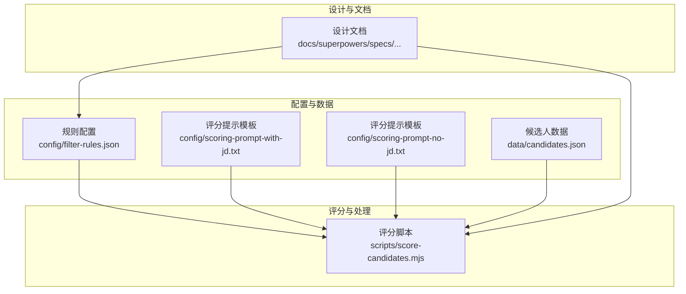
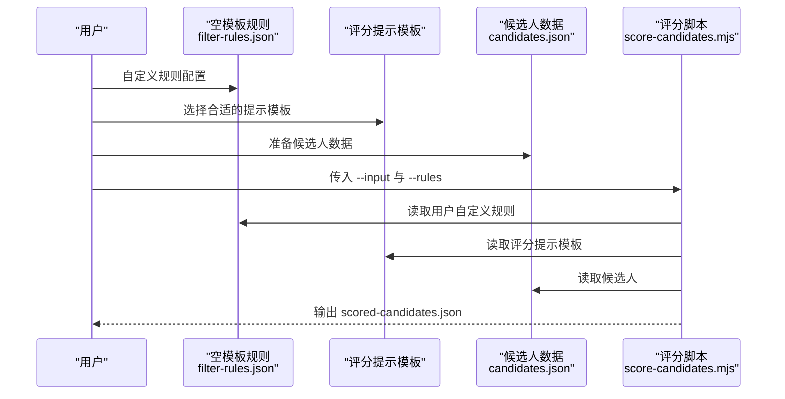
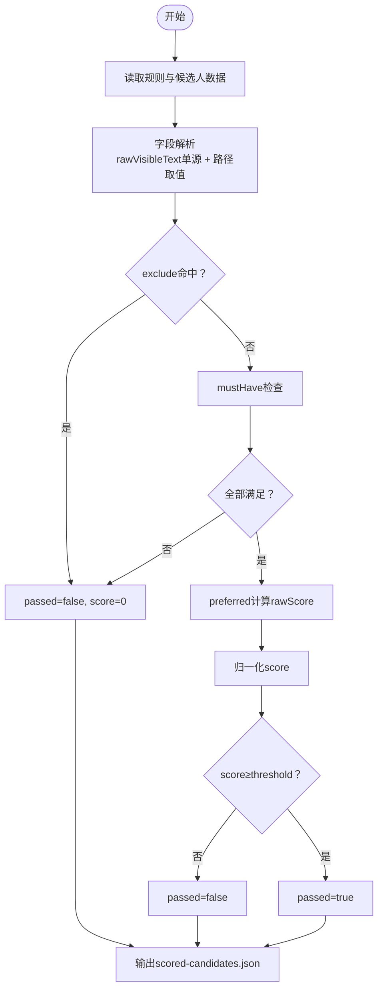
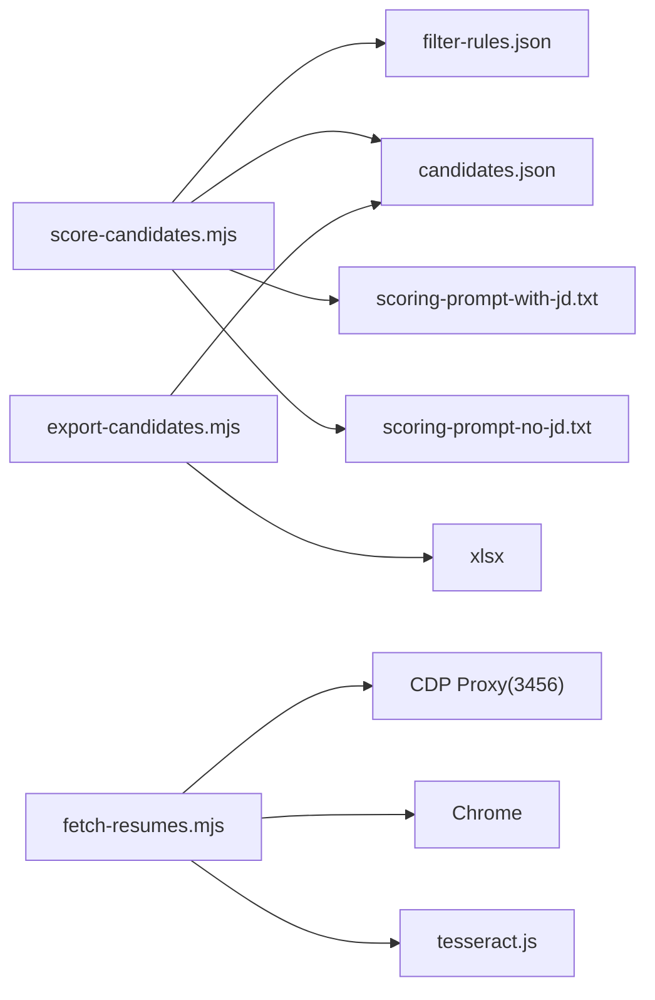

# 配置管理

<cite>
**本文引用的文件**
- [config/filter-rules.json](file://config/filter-rules.json)
- [config/scoring-prompt-with-jd.txt](file://config/scoring-prompt-with-jd.txt)
- [config/scoring-prompt-no-jd.txt](file://config/scoring-prompt-no-jd.txt)
- [scripts/score-candidates.mjs](file://scripts/score-candidates.mjs)
- [docs/superpowers/specs/2026-04-23-candidate-filtering-scoring-design.md](file://docs/superpowers/specs/2026-04-23-candidate-filtering-scoring-design.md)
</cite>

## 更新摘要
**变更内容**
- 更新了filter-rules.json配置模板，从示例配置重置为空模板供用户自定义
- 增强了评分提示模板的规则解释和格式要求，明确了严格的输出格式规范
- 完善了配置系统的用户引导和最佳实践说明

## 目录
1. [简介](#简介)
2. [项目结构](#项目结构)
3. [核心组件](#核心组件)
4. [架构总览](#架构总览)
5. [详细组件分析](#详细组件分析)
6. [依赖分析](#依赖分析)
7. [性能考量](#性能考量)
8. [故障排查指南](#故障排查指南)
9. [结论](#结论)
10. [附录](#附录)

## 简介
本文件面向"配置管理系统"的使用者与维护者，系统性阐述规则配置文件的结构、字段定义与验证机制，候选人数据格式、字段映射关系与数据模型设计，并文档化配置文件的加载流程、默认值处理与错误恢复策略。同时提供配置最佳实践、性能优化建议与扩展性考虑，给出完整配置示例与常见场景，解释配置变更的影响范围与热更新机制。

**更新** 本版本重点反映了配置系统的重大变更：filter-rules.json重置为空模板供用户自定义，评分提示模板增强了规则解释和格式要求。

## 项目结构
该项目围绕"候选人筛选评分"与"简历提取"两条主线展开，配置管理主要体现在规则配置文件与候选人输入数据两部分。核心文件与职责如下：
- 规则配置：config/filter-rules.json（空模板）
- 评分提示模板：config/scoring-prompt-with-jd.txt、config/scoring-prompt-no-jd.txt
- 候选人输入：data/candidates.json
- 评分与筛选：scripts/score-candidates.mjs
- 设计文档：docs/superpowers/specs/...

**图表来源**
- [config/filter-rules.json:1-11](file://config/filter-rules.json#L1-L11)
- [config/scoring-prompt-with-jd.txt:1-19](file://config/scoring-prompt-with-jd.txt#L1-L19)
- [config/scoring-prompt-no-jd.txt:1-18](file://config/scoring-prompt-no-jd.txt#L1-L18)
- [scripts/score-candidates.mjs:412-471](file://scripts/score-candidates.mjs#L412-L471)
- [docs/superpowers/specs/2026-04-23-candidate-filtering-scoring-design.md:1-270](file://docs/superpowers/specs/2026-04-23-candidate-filtering-scoring-design.md#L1-L270)

## 核心组件
- **规则配置文件（filter-rules.json）**
  - 顶层字段：name、version、rules
  - rules内部结构：mustHave（必选项）、preferred（偏好项，带权重）、exclude（排除项）、threshold（阈值）
  - 字段路径支持：普通字段与数组字段（workExperience[].position）两种形式
  - 操作符：equals、contains、in、>=、>、<=、<、regex、exists
  - **更新**：现为空模板，用户可在此基础上自定义规则
- **评分提示模板**
  - 有岗位描述模板：config/scoring-prompt-with-jd.txt
  - 无岗位描述模板：config/scoring-prompt-no-jd.txt
  - **更新**：增强了规则解释和格式要求，明确了严格的输出格式规范
- **候选人数据（candidates.json）**
  - 顶层字段：total、extractedAt、candidates[]
  - 候选人对象字段：index、name、age、experience、education、school、major、appliedJob、currentCompany、currentPosition、expectedSalary、expectedLocation 等
- **评分与筛选（score-candidates.mjs）**
  - 加载规则与候选人数据
  - 字段解析：rawVisibleText单源解析学历与工作年限，其余字段按路径取值
  - 规则执行：exclude > mustHave > preferred > 归一化 > 阈值判定
  - 输出：scored-candidates.json，包含统计与明细

**章节来源**
- [config/filter-rules.json:1-11](file://config/filter-rules.json#L1-L11)
- [config/scoring-prompt-with-jd.txt:1-19](file://config/scoring-prompt-with-jd.txt#L1-L19)
- [config/scoring-prompt-no-jd.txt:1-18](file://config/scoring-prompt-no-jd.txt#L1-L18)
- [scripts/score-candidates.mjs:412-471](file://scripts/score-candidates.mjs#L412-L471)

## 架构总览
下图展示了配置管理在整体流程中的位置与交互：

**图表来源**
- [config/filter-rules.json:1-11](file://config/filter-rules.json#L1-L11)
- [config/scoring-prompt-with-jd.txt:1-19](file://config/scoring-prompt-with-jd.txt#L1-L19)
- [config/scoring-prompt-no-jd.txt:1-18](file://config/scoring-prompt-no-jd.txt#L1-L18)
- [scripts/score-candidates.mjs:412-471](file://scripts/score-candidates.mjs#L412-L471)

## 详细组件分析

### 规则配置文件结构与字段定义
- **顶层字段**
  - name：规则名称（字符串）
  - version：规则版本（字符串）
  - rules：规则主体对象
- **rules内部结构**
  - mustHave：必选项数组，任一不满足则直接淘汰
  - preferred：偏好项数组，满足加分，权重参与归一化
  - exclude：排除项数组，命中即淘汰
  - threshold：阈值（数值），默认 60
- **字段路径**
  - 普通路径：如 basicInfo.education
  - 数组路径：如 workExperience[].position，表示遍历数组任一元素满足即通过
- **操作符**
  - equals、contains、in、>=、>、<=、<、regex、exists
- **字段说明**
  - field：字段路径
  - operator：比较操作符
  - value：比较值（字符串、数值或数组）
  - weight：仅 preferred 生效，满足时累加
  - reason：规则说明，输出到 reasons
  - flags：regex时的正则标志（如 i）

**更新** 规则配置文件现已重置为空模板，用户需要根据实际需求自定义规则配置。这种设计提供了更大的灵活性，允许用户针对不同的招聘场景创建专门的筛选规则。

**章节来源**
- [config/filter-rules.json:1-11](file://config/filter-rules.json#L1-L11)
- [docs/superpowers/specs/2026-04-23-candidate-filtering-scoring-design.md:24-97](file://docs/superpowers/specs/2026-04-23-candidate-filtering-scoring-design.md#L24-L97)

### 评分提示模板与格式要求
- **模板类型**
  - 有岗位描述模板：config/scoring-prompt-with-jd.txt
  - 无岗位描述模板：config/scoring-prompt-no-jd.txt
- **增强的规则解释**
  - 明确要求评语必须按固定结构输出：技术栈匹配：... | 项目经验相关性：... | 行业经验：...
  - 评语中不得包含工作年限相关描述，包含则评分无效
  - 严格按JSON格式输出，包含jobRelevanceScore和jobRelevanceComment字段
- **格式要求**
  - 岗位相关性分数范围：0-50分
  - 评语必须包含技术栈匹配、项目经验相关性和行业经验三个方面
  - 输出格式必须严格遵循指定的JSON结构

**更新** 评分提示模板经过增强，现在包含了更严格的规则解释和格式要求，确保LLM评分的一致性和可审计性。

**章节来源**
- [config/scoring-prompt-with-jd.txt:1-19](file://config/scoring-prompt-with-jd.txt#L1-L19)
- [config/scoring-prompt-no-jd.txt:1-18](file://config/scoring-prompt-no-jd.txt#L1-L18)

### 候选人数据格式与字段映射
- **输入数据 candidates.json**
  - total：总数
  - extractedAt：提取时间
  - candidates[]：候选人数组
- **候选人对象字段（示例）**
  - index、name、age、experience、education、school、major、appliedJob、currentCompany、currentPosition、expectedSalary、expectedLocation
- **字段映射关系**
  - 规则中的field路径与候选人对象字段一一对应，支持嵌套与数组遍历
  - 特殊字段：basicInfo.education、basicInfo.workYears由rawVisibleText单源解析，规避在线状态标签偏移

**章节来源**
- [docs/superpowers/specs/2026-04-23-candidate-filtering-scoring-design.md:102-139](file://docs/superpowers/specs/2026-04-23-candidate-filtering-scoring-design.md#L102-L139)

### 评分与筛选流程（核心算法）
- **加载与解析**
  - 读取candidates.json与filter-rules.json
  - 解析candidates.candidates或直接使用根数组
- **字段解析**
  - 对于basicInfo.education与basicInfo.workYears，优先从rawVisibleText提取
  - 普通字段按路径取值；数组字段按workExperience[].position展开取值
- **规则执行**
  - exclude：命中任一即淘汰（passed=false，score=0）
  - mustHave：全部满足才进入评分阶段
  - preferred：满足累加权重，计算rawScore
  - 归一化：若无preferred，则mustHave全通过得100；否则score = 60 + (rawScore/totalWeight)*40
  - threshold：score ≥ threshold判定passed=true
- **输出**
  - scored-candidates.json：包含filterName、filterVersion、filteredAt、inputFile、totalCandidates、passedCount、threshold、candidates[]
  - candidates按score降序排列，保留未通过候选人便于审计

**图表来源**
- [scripts/score-candidates.mjs:268-378](file://scripts/score-candidates.mjs#L268-L378)

**章节来源**
- [scripts/score-candidates.mjs:412-471](file://scripts/score-candidates.mjs#L412-L471)
- [docs/superpowers/specs/2026-04-23-candidate-filtering-scoring-design.md:140-179](file://docs/superpowers/specs/2026-04-23-candidate-filtering-scoring-design.md#L140-L179)

## 依赖分析
- **外部依赖**
  - tesseract.js：OCR识别
  - xlsx：Excel导出
- **内部模块耦合**
  - score-candidates.mjs与filter-rules.json、candidates.json强耦合
  - 评分提示模板独立于核心逻辑，提供标准化的LLM交互接口
- **潜在循环依赖**
  - 当前脚本以单向调用为主，未发现循环依赖
- **接口契约**
  - 规则配置文件字段与评分脚本解析逻辑强绑定
  - 候选人数据结构与字段解析逻辑强绑定
  - 评分提示模板与LLM输出格式严格绑定

**图表来源**
- [scripts/score-candidates.mjs:412-471](file://scripts/score-candidates.mjs#L412-L471)
- [package.json:6-9](file://package.json#L6-L9)

**章节来源**
- [package.json:1-11](file://package.json#L1-L11)

## 性能考量
- **字段解析与数组遍历**
  - 数组路径解析（如workExperience[].position）会遍历数组，建议控制数组规模或使用更精确的路径
- **正则匹配**
  - regex操作符在数组场景会逐项测试，建议合理设置flags与表达式复杂度
- **归一化与排序**
  - 评分后对candidates进行排序，建议在大规模数据时考虑分批处理或增量导出
- **I/O与外部依赖**
  - fetch-resumes.mjs依赖网络与OCR，建议批量处理时控制并发与重试策略
- **依赖安装**
  - 确保安装xlsx与tesseract.js，避免运行时报错

## 故障排查指南
- **规则配置问题**
  - 确认filter-rules.json为空模板且已正确填写规则
  - 检查field路径与候选人数据结构一致，数组路径使用[]标记
  - 检查mustHave/exclude/preferred的operator与value类型
- **评分提示模板问题**
  - 确认模板文件存在且格式正确
  - 检查LLM输出是否符合严格的JSON格式要求
  - 验证评语是否包含必需的技术栈匹配、项目经验和行业经验描述
- **阈值与权重问题**
  - 检查threshold是否过高导致全部淘汰
  - 确认preferred权重总和合理分配
- **输出为空或异常**
  - 检查rawVisibleText解析是否正确（学历与工作年限）
  - 验证候选人数据格式是否符合预期

## 结论
本配置管理系统通过"空模板规则配置 + 标准化评分提示模板 + 评分脚本 + 候选人数据"的解耦设计，实现了灵活、可审计、可导出的候选人筛选与评分流程。**更新** 新的空模板设计为用户提供了更大的自定义空间，而增强的评分提示模板确保了LLM评分的一致性和质量。评分脚本具备完善的字段解析、规则执行与输出机制，结合标准化的提示模板，形成从数据到决策的完整链路。建议在生产环境中严格遵循字段路径规范、合理设置阈值与权重，并关注外部依赖与性能瓶颈。

## 附录

### 配置最佳实践
- **规则命名与版本**
  - 为规则设置清晰的name与version，便于追踪与回溯
  - 使用语义化的规则名称，如"AI应用开发工程师-初筛"
- **字段路径**
  - 优先使用精确路径，避免过宽的数组遍历
  - 对数组字段使用[]标记，确保命中逻辑符合预期
- **操作符选择**
  - 精确匹配用equals，包含匹配用contains，集合匹配用in，排序比较用>=等
  - 正则匹配仅在必要时使用，注意flags与性能
- **权重与阈值**
  - preferred权重总和建议合理分配，避免极端值
  - threshold默认60，可根据业务目标调整
  - exclude优先级最高，建议将硬性门槛放入exclude
- **评分提示模板使用**
  - 根据是否有岗位描述选择合适的提示模板
  - 严格遵循模板中的格式要求和输出规范
  - 确保LLM输出符合固定的JSON结构

### 配置示例与常见场景
- **示例：AI应用开发工程师筛选**
  - mustHave：学历≥本科
  - preferred：工作年限≥2年（权重25）、AI相关经验（权重35）、算法相关经验（权重20）
  - exclude：空
  - threshold：0
- **示例：前端开发工程师筛选**
  - mustHave：学历≥本科、JavaScript经验≥2年
  - preferred：Vue/React框架经验（权重20）、项目管理经验（权重15）
  - exclude：学历低于大专
  - threshold：60
- **常见场景**
  - 仅学历门槛：exclude置空，mustHave仅包含学历
  - 加分导向：preferred权重总和较大，threshold适当降低
  - 严格门槛：exclude中加入不接受的学历或公司

### 配置变更的影响范围与热更新机制
- **影响范围**
  - 规则变更直接影响candidates的评分与筛选结果
  - 空模板设计降低了初始配置成本，但需要用户投入更多时间进行规则定制
  - 增强的评分提示模板提高了LLM评分的质量和一致性
- **热更新机制**
  - 当前实现为一次性批处理：修改规则后重新执行评分脚本即可生效
  - 空模板设计使得规则更新更加灵活，无需担心破坏现有配置
  - 若需实时更新，可在上游增加规则服务与缓存层，但当前仓库未提供热更新实现

**章节来源**
- [config/filter-rules.json:1-11](file://config/filter-rules.json#L1-L11)
- [config/scoring-prompt-with-jd.txt:1-19](file://config/scoring-prompt-with-jd.txt#L1-L19)
- [config/scoring-prompt-no-jd.txt:1-18](file://config/scoring-prompt-no-jd.txt#L1-L18)
- [docs/superpowers/specs/2026-04-23-candidate-filtering-scoring-design.md:24-75](file://docs/superpowers/specs/2026-04-23-candidate-filtering-scoring-design.md#L24-L75)