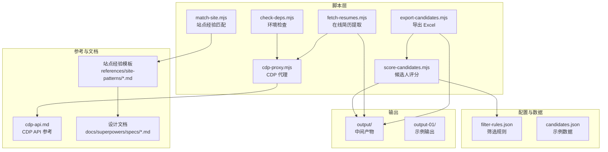
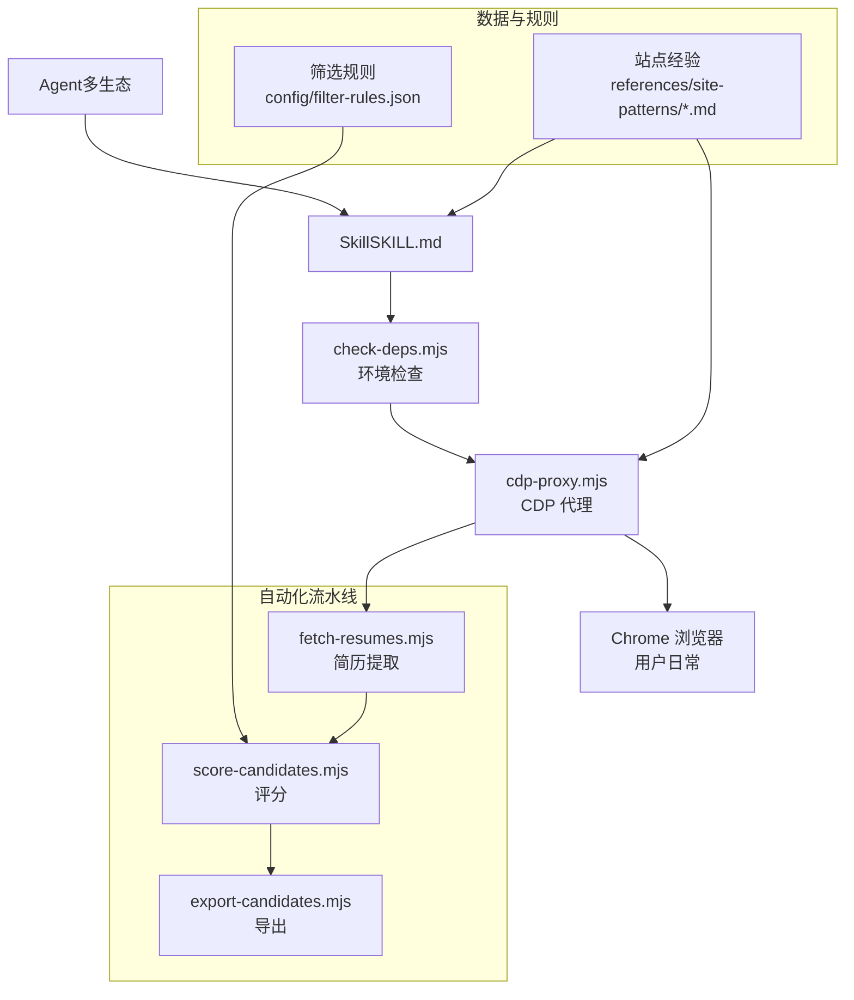
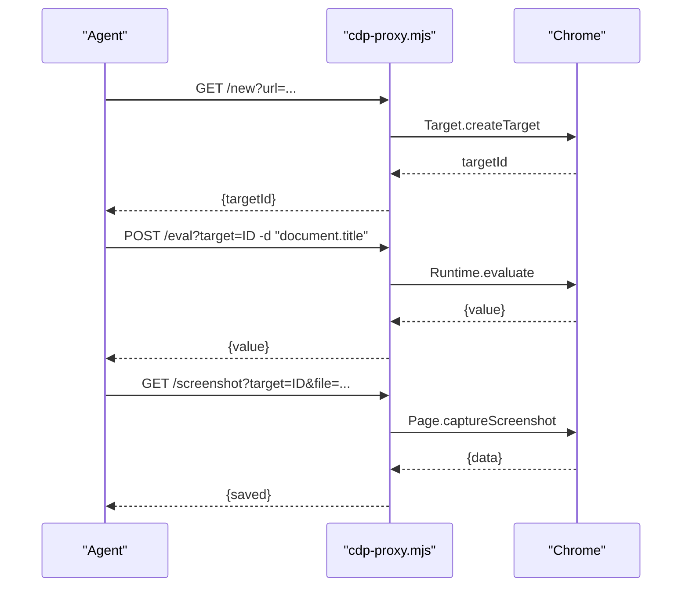
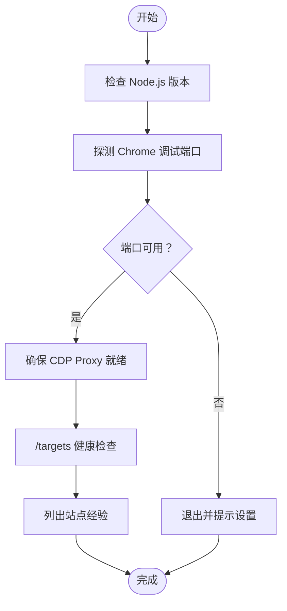
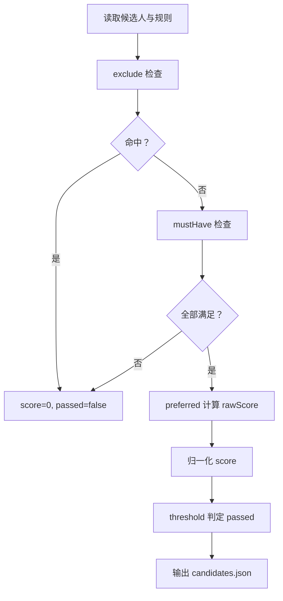
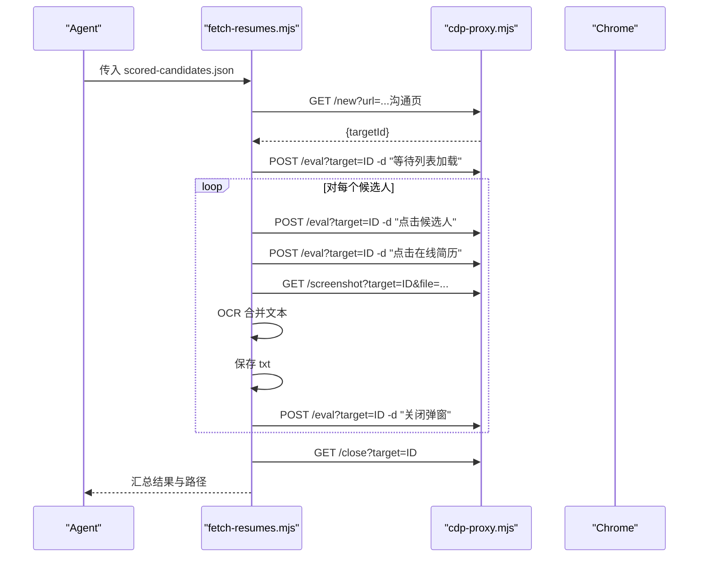
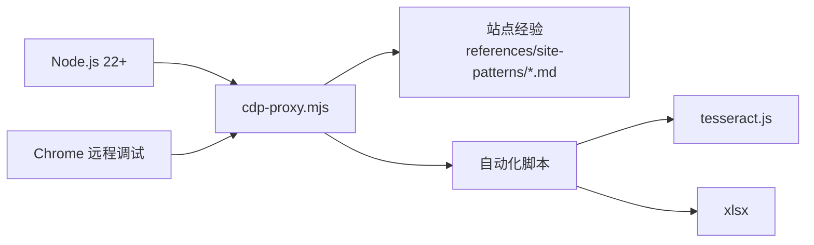

# 项目概述

<cite>
**本文引用的文件**
- [README.md](file://README.md)
- [SKILL.md](file://SKILL.md)
- [package.json](file://package.json)
- [config/filter-rules.json](file://config/filter-rules.json)
- [data/candidates.json](file://data/candidates.json)
- [scripts/cdp-proxy.mjs](file://scripts/cdp-proxy.mjs)
- [scripts/check-deps.mjs](file://scripts/check-deps.mjs)
- [scripts/fetch-resumes.mjs](file://scripts/fetch-resumes.mjs)
- [scripts/match-site.mjs](file://scripts/match-site.mjs)
- [scripts/score-candidates.mjs](file://scripts/score-candidates.mjs)
- [scripts/export-candidates.mjs](file://scripts/export-candidates.mjs)
- [references/cdp-api.md](file://references/cdp-api.md)
- [docs/superpowers/specs/2026-04-22-extraction-persistence-design.md](file://docs/superpowers/specs/2026-04-22-extraction-persistence-design.md)
- [docs/superpowers/specs/2026-04-23-candidate-filtering-scoring-design.md](file://docs/superpowers/specs/2026-04-23-candidate-filtering-scoring-design.md)
</cite>

## 目录
1. [简介](#简介)
2. [项目结构](#项目结构)
3. [核心组件](#核心组件)
4. [架构总览](#架构总览)
5. [详细组件分析](#详细组件分析)
6. [依赖分析](#依赖分析)
7. [性能考虑](#性能考虑)
8. [故障排查指南](#故障排查指南)
9. [结论](#结论)
10. [附录](#附录)

## 简介
Web Access 是一个为 AI Agent 提供“完整联网能力”的 Skill，旨在补齐传统 WebSearch/WebFetch 缺失的“调度策略 + CDP 浏览器自动化 + 站点经验积累”三大能力。它通过直连用户日常 Chrome 的 CDP Proxy，实现真实浏览器环境下的动态页面交互、登录态继承、媒体提取与视频截帧等高阶能力；并通过“站点经验”沉淀与复用，形成可迁移的平台操作知识库。

- 设计理念：以“哲学 + 技术事实”指导 Agent 自主决策，而非固化操作手册，强调“像人一样思考”的目标驱动而非步骤驱动。
- 兼容性：适配所有支持 SKILL.md 的 Agent 生态（Claude Code、Cursor、Gemini CLI、Codex CLI 等）。
- 价值主张：在复杂站点与动态渲染场景下，提供稳定、可复用、可沉淀的自动化联网与数据提取能力。

**章节来源**
- [README.md:28-30](file://README.md#L28-L30)
- [README.md:153-157](file://README.md#L153-L157)
- [SKILL.md:14-12](file://SKILL.md#L14-L12)

## 项目结构
仓库采用“脚本 + 配置 + 文档 + 输出”的组织方式，围绕 CDP Proxy 与站点经验两大核心轴线展开：

- scripts：CDP 代理与各类自动化脚本（依赖 Node.js 22+）
- config：筛选规则配置
- data：示例候选人数据
- references：CDP API 参考与站点经验模板
- docs/superpowers：设计文档与规划
- output/output-01：中间产物与示例输出

**图表来源**
- [scripts/cdp-proxy.mjs:1-602](file://scripts/cdp-proxy.mjs#L1-L602)
- [scripts/check-deps.mjs:1-172](file://scripts/check-deps.mjs#L1-L172)
- [scripts/fetch-resumes.mjs:1-386](file://scripts/fetch-resumes.mjs#L1-L386)
- [scripts/score-candidates.mjs:1-406](file://scripts/score-candidates.mjs#L1-L406)
- [scripts/export-candidates.mjs:1-203](file://scripts/export-candidates.mjs#L1-L203)
- [scripts/match-site.mjs:1-47](file://scripts/match-site.mjs#L1-L47)
- [references/cdp-api.md:1-107](file://references/cdp-api.md#L1-L107)
- [docs/superpowers/specs/2026-04-22-extraction-persistence-design.md:1-146](file://docs/superpowers/specs/2026-04-22-extraction-persistence-design.md#L1-L146)
- [docs/superpowers/specs/2026-04-23-candidate-filtering-scoring-design.md:1-270](file://docs/superpowers/specs/2026-04-23-candidate-filtering-scoring-design.md#L1-L270)

**章节来源**
- [README.md:75-103](file://README.md#L75-L103)
- [package.json:1-11](file://package.json#L1-L11)

## 核心组件
- CDP Proxy：通过 HTTP API 控制用户本地 Chrome，提供新建/关闭 Tab、导航、滚动、点击、文件上传、截图、JS 执行等能力，天然继承用户登录态，具备反风控拦截与会话隔离。
- 环境检查：自动检测 Node.js 与 Chrome 远程调试端口，必要时启动并等待 CDP Proxy 就绪。
- 站点经验：以 Markdown 文件记录平台特征、有效模式与已知陷阱，按域名组织，支持别名与持久化输出。
- 候选人筛选评分：基于规则配置对候选人进行 mustHave/exclude/preferred 评分，输出带理由与等级的 JSON。
- 在线简历提取：针对 Canvas 渲染的简历，采用截图 + OCR 的方式提取文本并保存。
- Excel 导出：将评分结果导出为 Excel，支持自定义字段与列宽。
- 本地 Chrome 资源检索：通过 find-url.mjs 从本地 Chrome 书签/历史检索目标 URL，支持关键词/时间窗/访问频度排序。

**章节来源**
- [README.md:34-48](file://README.md#L34-L48)
- [README.md:119-137](file://README.md#L119-L137)
- [SKILL.md:154-243](file://SKILL.md#L154-L243)

## 架构总览
整体架构围绕“CDP 代理 + 站点经验 + 规则引擎 + 自动化脚本”的闭环展开。Agent 通过 Skill 调用环境检查与 CDP Proxy，结合站点经验与规则配置，完成从数据提取到结果持久化的全流程。

**图表来源**
- [scripts/check-deps.mjs:143-172](file://scripts/check-deps.mjs#L143-L172)
- [scripts/cdp-proxy.mjs:287-552](file://scripts/cdp-proxy.mjs#L287-L552)
- [scripts/fetch-resumes.mjs:250-386](file://scripts/fetch-resumes.mjs#L250-L386)
- [scripts/score-candidates.mjs:342-386](file://scripts/score-candidates.mjs#L342-L386)
- [scripts/export-candidates.mjs:154-203](file://scripts/export-candidates.mjs#L154-L203)
- [SKILL.md:154-243](file://SKILL.md#L154-L243)

## 详细组件分析

### CDP 代理组件（cdp-proxy.mjs）
- 职责：提供 HTTP API 控制 Chrome，屏蔽 CDP 协议复杂度，统一错误处理与会话管理。
- 关键能力：
  - 自动发现 Chrome 远程调试端口，兼容 DevToolsActivePort 与常见端口回退。
  - Target 会话 attach 与 Fetch 域拦截，防止页面探测调试端口触发风控。
  - 提供 /targets、/new、/navigate、/back、/eval、/click、/clickAt、/setFiles、/scroll、/screenshot、/close 等端点。
  - 健康检查与端口占用检测，避免冲突。
- 反风控：拦截对 127.0.0.1:port 的本地探测请求，保护用户隐私与安全。

**图表来源**
- [scripts/cdp-proxy.mjs:312-345](file://scripts/cdp-proxy.mjs#L312-L345)
- [scripts/cdp-proxy.mjs:355-373](file://scripts/cdp-proxy.mjs#L355-L373)
- [scripts/cdp-proxy.mjs:502-517](file://scripts/cdp-proxy.mjs#L502-L517)
- [references/cdp-api.md:24-89](file://references/cdp-api.md#L24-L89)

**章节来源**
- [scripts/cdp-proxy.mjs:1-602](file://scripts/cdp-proxy.mjs#L1-L602)
- [references/cdp-api.md:1-107](file://references/cdp-api.md#L1-L107)

### 环境检查组件（check-deps.mjs）
- 职责：跨平台检测 Node.js 与 Chrome 调试端口，必要时启动并等待 CDP Proxy 就绪，输出现有站点经验清单。
- 关键流程：版本检查 → 端口探测 → 启动代理 → /targets 健康检查 → 输出站点经验列表。

**图表来源**
- [scripts/check-deps.mjs:17-172](file://scripts/check-deps.mjs#L17-L172)

**章节来源**
- [scripts/check-deps.mjs:1-172](file://scripts/check-deps.mjs#L1-L172)

### 候选人筛选评分（score-candidates.mjs）
- 职责：基于规则配置对候选人进行 mustHave/exclude/preferred 评分，输出带理由与等级的 JSON。
- 关键特性：
  - 字段解析：支持普通路径与数组路径（如 workExperience[].position），并从 rawVisibleText 单源提取学历与工作年限，规避偏移问题。
  - 比较运算：支持 equals、contains、in、>=、>、<=、<、regex、exists 等。
  - 归一化：将满足权重之和归一到 0-100，threshold 判定 passed。
  - 等级分档：基于 score 分档输出 recommendationLevel。

**图表来源**
- [scripts/score-candidates.mjs:230-340](file://scripts/score-candidates.mjs#L230-L340)
- [docs/superpowers/specs/2026-04-23-candidate-filtering-scoring-design.md:140-179](file://docs/superpowers/specs/2026-04-23-candidate-filtering-scoring-design.md#L140-L179)

**章节来源**
- [scripts/score-candidates.mjs:1-406](file://scripts/score-candidates.mjs#L1-L406)
- [config/filter-rules.json:1-41](file://config/filter-rules.json#L1-L41)
- [docs/superpowers/specs/2026-04-23-candidate-filtering-scoring-design.md:1-270](file://docs/superpowers/specs/2026-04-23-candidate-filtering-scoring-design.md#L1-L270)

### 在线简历提取（fetch-resumes.mjs）
- 职责：对通过筛选的候选人逐个打开沟通页，点击“在线简历”，截图并 OCR，保存为纯文本。
- 关键流程：创建 Tab → 等待列表加载 → 滚动至目标候选人 → 点击卡片 → 点击“在线简历” → 截图分页 → OCR 合并 → 保存 → 关闭弹窗 → 汇总结果。

**图表来源**
- [scripts/fetch-resumes.mjs:287-351](file://scripts/fetch-resumes.mjs#L287-L351)
- [scripts/fetch-resumes.mjs:314-346](file://scripts/fetch-resumes.mjs#L314-L346)

**章节来源**
- [scripts/fetch-resumes.mjs:1-386](file://scripts/fetch-resumes.mjs#L1-L386)

### Excel 导出（export-candidates.mjs）
- 职责：将评分结果导出为 Excel，支持自定义字段与列宽自适应。
- 关键流程：读取 scored-candidates.json → 选择字段 → 转换为二维数组 → 写入工作簿 → 自动列宽 → 输出文件。

**章节来源**
- [scripts/export-candidates.mjs:1-203](file://scripts/export-candidates.mjs#L1-L203)

### 站点经验匹配（match-site.mjs）
- 职责：根据用户输入匹配站点经验文件，输出匹配到的经验正文（支持别名）。
- 关键流程：扫描 references/site-patterns → 读取 frontmatter aliases → 正则匹配 → 输出正文。

**章节来源**
- [scripts/match-site.mjs:1-47](file://scripts/match-site.mjs#L1-L47)

## 依赖分析
- 运行时依赖：
  - Node.js 22+（原生 WebSocket）
  - Chrome 开启远程调试（chrome://inspect/#remote-debugging）
- 第三方库：
  - tesseract.js：OCR 识别（简历提取）
  - xlsx：Excel 导出（候选人筛选）

**图表来源**
- [package.json:6-9](file://package.json#L6-L9)
- [scripts/fetch-resumes.mjs:283-284](file://scripts/fetch-resumes.mjs#L283-L284)
- [scripts/export-candidates.mjs:15-23](file://scripts/export-candidates.mjs#L15-L23)

**章节来源**
- [package.json:1-11](file://package.json#L1-L11)

## 性能考虑
- 并行分治：多目标时分发子 Agent 并行执行，共享一个 Proxy，tab 级隔离，降低总体时延。
- 懒加载触发：滚动到底部触发懒加载，提升图片/视频资源加载效率。
- 截图与 OCR：按页分片截图，OCR 逐页处理，平衡准确率与耗时。
- 会话隔离：每个任务在独立 tab 中执行，避免状态污染与并发冲突。
- 反风控：拦截本地调试端口探测，减少页面触发风控的概率。

[本节为通用性能讨论，不直接分析具体文件]

## 故障排查指南
- Chrome 未开启远程调试端口
  - 现象：连接失败或提示未开启
  - 处理：在 Chrome 地址栏打开 chrome://inspect/#remote-debugging，勾选 Allow remote debugging
- CDP 命令超时
  - 现象：页面长时间未响应
  - 处理：重试或检查 tab 状态，确认 /targets 列表中 targetId 有效
- 端口占用
  - 现象：端口 3456 已被占用
  - 处理：已有实例可直接复用；否则终止冲突进程或更换端口
- 代理未就绪
  - 现象：/targets 返回非数组
  - 处理：运行 check-deps.mjs，等待代理启动并授权

**章节来源**
- [references/cdp-api.md:100-107](file://references/cdp-api.md#L100-L107)
- [scripts/check-deps.mjs:146-156](file://scripts/check-deps.mjs#L146-L156)

## 结论
Web Access 通过 CDP Proxy 将真实浏览器能力开放给 Agent，结合站点经验与规则引擎，实现了从“可联网”到“可自动化、可沉淀、可规模化”的跃迁。其设计强调“哲学 + 技术事实”，既适合初学者理解联网与浏览器自动化的基本范式，也为资深开发者提供了可扩展、可维护的工程化框架。

[本节为总结性内容，不直接分析具体文件]

## 附录

### 版本与更新亮点
- v2.5.0
  - 新增本地 Chrome 资源检索（find-url.mjs），支持书签/历史关键词/时间窗/频度排序
- v2.4.3
  - 修复 CLAUDE_SKILL_DIR 路径问题（Windows Git Bash）
  - 站点经验列表合并到前置检查
- v2.4.1
  - 跨平台支持（Node.js 脚本替代 bash）
  - DOM 边界穿透技术事实（eval 递归穿透 Shadow DOM/iframe）
- v2.4
  - 站点内 URL 可靠性与平台错误提示不可信的技术事实
  - 小红书站点经验增强（xsec_token、创作者平台状态校验、草稿流程）

**章节来源**
- [README.md:46-74](file://README.md#L46-L74)

### 适用场景
- 需要真实浏览器环境的任务：动态渲染、登录态继承、交互操作、媒体提取、视频截帧
- 大规模数据提取：BOSS 直聘候选人提取、简历 OCR、简历导出
- 站点经验沉淀：按域名组织平台特征、有效模式与已知陷阱，跨 session 复用

**章节来源**
- [README.md:28-48](file://README.md#L28-L48)
- [SKILL.md:244-282](file://SKILL.md#L244-L282)

### 最佳实践
- 使用 /new 打开完整 URL，保留会话参数，避免触发反爬
- 先尝试 /eval 获取目标内容，确认“无法获取”后再提示登录
- 通过 /scroll 触发懒加载后再提取图片/视频 URL
- 对 Canvas 渲染内容采用截图 + OCR 方案
- 严格遵循站点经验，遇到失败回退通用模式并更新经验文件

**章节来源**
- [SKILL.md:88-127](file://SKILL.md#L88-L127)
- [SKILL.md:109-123](file://SKILL.md#L109-L123)
- [SKILL.md:215-243](file://SKILL.md#L215-L243)