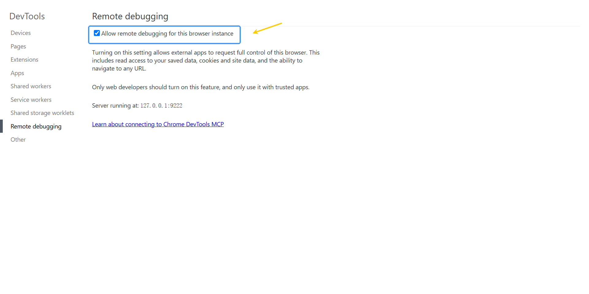
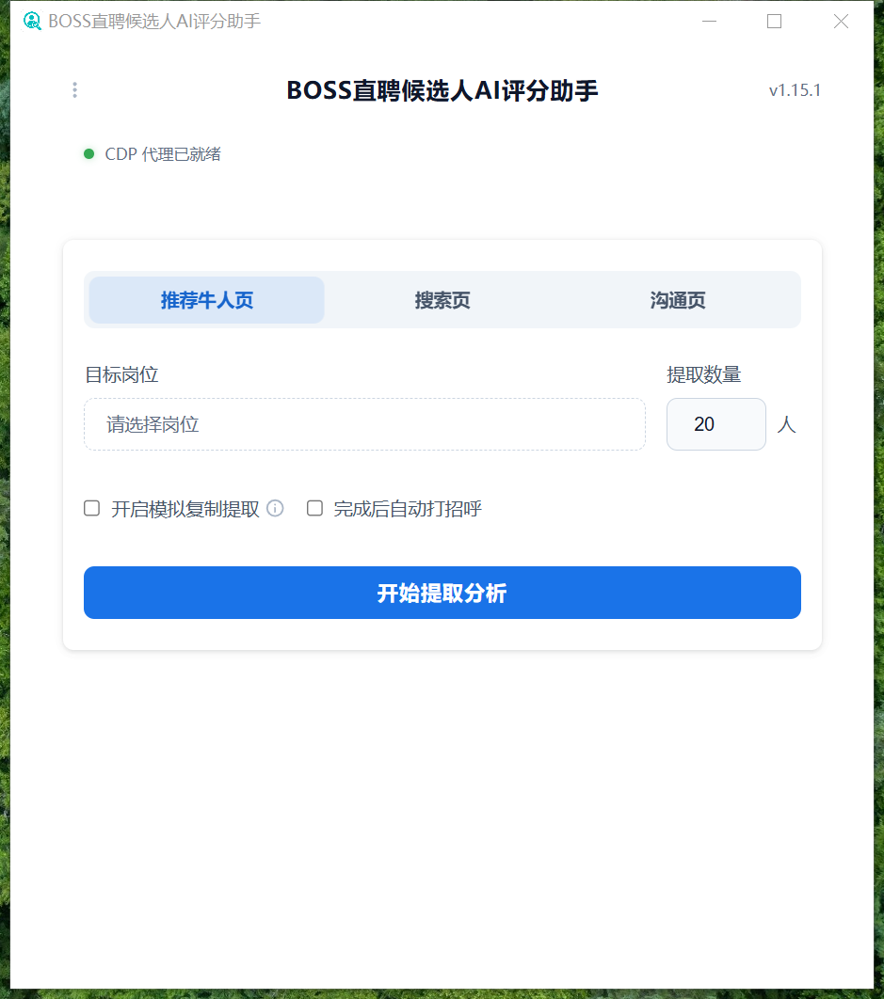
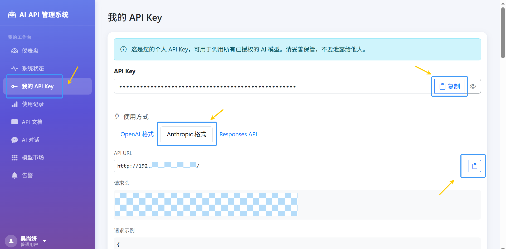
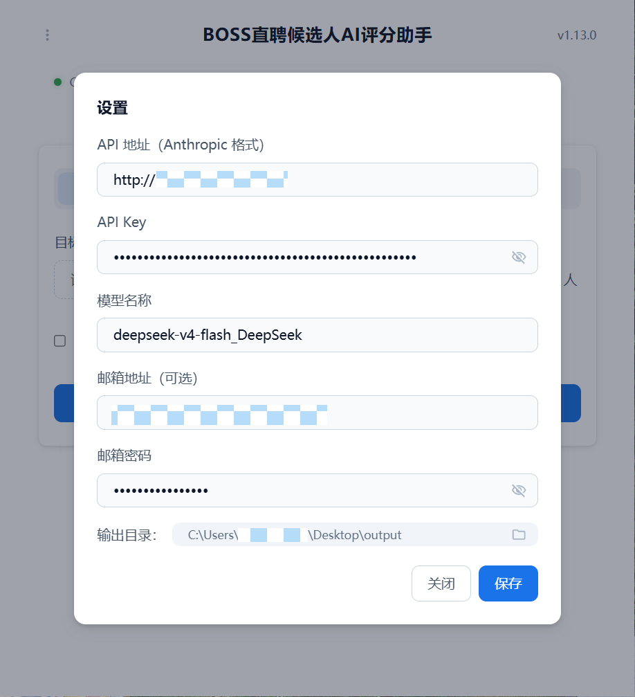
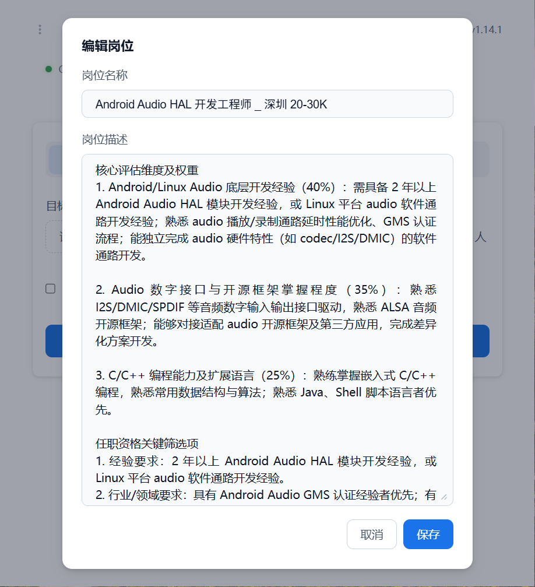
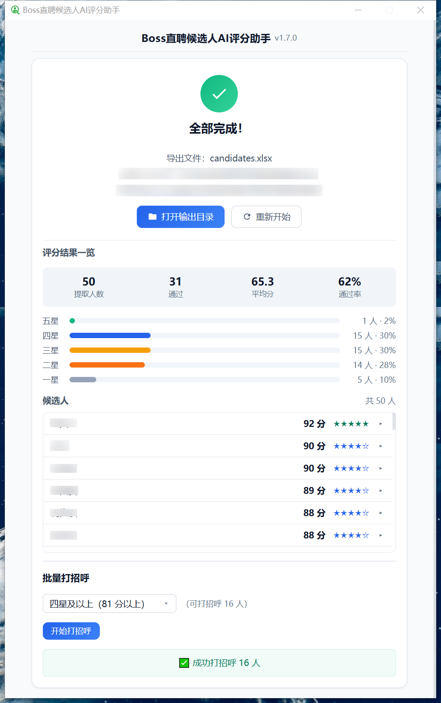

# BOSS直聘候选人AI评分助手

一个帮你「从 BOSS直聘招人」的电脑小助手：它会帮你从 BOSS直聘提取候选人简历、把每位候选人的简历按岗位要求用 AI 评分、给分数达标的候选人自动打招呼，最后把所有结果整理成 Excel 表格发给你。

> AI 评分仅供参考，录用与否请以专业判断为准。

---

## 功能

- **提取候选人信息**：逐个提取候选人基础信息与简历正文
- **AI 评分**：按照岗位要求，给每位候选人打出 0-100 的匹配分，并写出评分理由
- **导出 Excel**：整理候选人基本信息、AI 评分与评语，生成 Excel 表格（可发送至邮箱）
- **自动打招呼**（可选）：评分完成后，自动给分数达到要求的候选人发送打招呼消息（仅「推荐牛人页」支持）

支持从以下三种页面提取：

| 提取来源 | 所在页面 | 适用场景 |
|---|---|---|
| 推荐牛人页 | BOSS直聘「推荐牛人」 | 系统按招聘要求推荐的候选人 |
| 搜索页 | BOSS直聘「搜索」 | 按关键词自行检索的候选人 |
| 沟通页 | BOSS直聘「沟通」 | 已与你沟通的候选人 |

---

## 使用前提

- Windows 电脑 + Chrome 浏览器
- BOSS直聘招聘端账号
- AI 服务地址（Anthropic 兼容格式，首次使用时配置一次即可）

---

## 安装

从 [GitHub Releases 页面](https://github.com/KuroNya39/boss-candidate-tool/releases) 下载最新版本：

- **安装包（推荐）**：下载 `Boss.AI.Setup.1.x.x.exe`，双击按提示完成安装
- **绿色版**：下载 `win-unpacked.zip`，解压后运行 `BOSS直聘候选人AI评分助手.exe` 即可

---

## 快速开始

### 第 1 步：开启 Chrome 远程调试（仅需一次）

1. 打开 Chrome 浏览器，在地址栏输入以下内容并回车：
   ```
   chrome://inspect/#remote-debugging
   ```
2. 勾选 **「Allow remote debugging for this browser instance」**
3. 完全退出 Chrome 后重新打开



### 第 2 步：登录 BOSS直聘

打开 Chrome，进入 BOSS直聘招聘端并登录招聘账号。

### 第 3 步：启动软件，确认连接正常

双击 `BOSS直聘候选人AI评分助手.exe` 启动软件，查看软件**最上方**的连接状态：

- 🟢 **绿色** = 连接正常
- 🟡 **黄色** = 正在连接，稍等几秒
- 🔴 **红色** = 未连接，点「重试」，或检查第 1 步



### 第 4 步：完成设置

在软件上方的「设置」面板中，填写以下三项信息：

- **API 地址**：打开公司 AI API 系统，选择 Anthropic 格式，复制粘贴 API URL
- **API Key**：复制粘贴个人 API Key
- **模型名称**：填 `deepseek-v4-flash_DeepSeek`（或系统内其他可用模型）



可选设置：

- **邮件通知**：填写完整邮箱与邮箱密码，评分结果 Excel 会自动发到你的邮箱。若邮箱开启了「三方客户端安全密码」，须填客户端安全密码而非登录密码

点击 **「保存设置」**，出现绿色 **「设置已保存」** 提示且状态变为 **「✓ 已设置」** 即完成。



### 第 5 步：添加岗位

1. 点击 **「请选择岗位」** → **「+ 添加新岗位」**
2. **岗位名称**：填写岗位名（建议带上城市和薪资方便区分），例如：
   ```
   AI大模型工程师 _ 深圳 30-50K
   ```
3. **岗位描述**：⚠️ 请勿直接粘贴岗位 JD。将岗位 JD 连同以下提示词发送给任一聊天 AI（如 DeepSeek、Kimi、千问等），把岗位 JD 转换成软件需要的格式：

   ```text
   请基于以上岗位 JD，完成以下两项分析任务。

   任务一：提取核心评估维度
   从JD中识别出最核心的3个评估维度，并为每个维度分配权重，三项权重之和须为100%。严禁提取学历、证书等任职资格关键筛选项已包含的内容。

   任务二：提取任职资格关键筛选项
   从JD中提取出所有可量化的、客观的筛选条件，至少包括但不限于：学历、专业、工作经验年限、行业背景、专业技能/证书、其他强制性条件。严禁提取沟通能力、团队协作能力等软性素质。

   输出格式：
   核心评估维度及权重
   1. [评估维度名称]（[权重]%）：[具体要求]
   2. [评估维度名称]（[权重]%）：[具体要求]
   3. [评估维度名称]（[权重]%）：[具体要求]
   任职资格关键筛选项
   1. 学历要求：[具体要求]
   2. 经验要求：[具体要求]
   3. 行业/领域要求：[具体要求]
   4. 技能/证书要求：[具体要求]
   5. 其他硬性条件：[具体要求，如无则填“无”]
   ```

4. 把 AI 生成的结果复制粘贴到「岗位描述」并保存

岗位添加后可随时切换、编辑或删除；岗位较多时可用列表上方搜索框过滤。



### 第 6 步：调整运行配置并开始

1. 在 Chrome 中打开对应的 BOSS直聘页面，并设置好筛选条件
2. 选择 **「提取来源」**：推荐牛人页 / 搜索页 / 沟通页
3. 选择 **「目标岗位」**（推荐牛人页和搜索页需要）
4. 填写 **「提取数量」**（如 `20`）；沟通页可勾选「提取全部」
5. **「开启模拟复制提取」**（可选，默认关闭）：开启后画布型简历读取更快，但读取时会短暂占用系统剪贴板，建议电脑闲置时开启
6. 点击 **「▶ 开始提取分析」**

点击开始后，软件会自动检查 Chrome 连接；若 Chrome 未运行会帮你启动。运行期间若 Chrome 被关闭或连接中断，重新打开 BOSS直聘页面后，**再点一次「开始提取分析」**即可。

---

## ⚠️ 重要：运行中的注意事项

**1. BOSS直聘不能切到后台标签页**

BOSS直聘切到后台标签页时，模拟复制和截图都会失效。请让它保持在独立 Chrome 窗口的前台标签页，该窗口被其他窗口盖住也不影响提取。

**2. 提取结束前别点「最小化」**

进行步骤 1「提取候选人信息」时最小化 Chrome 会冻结页面渲染，导致截图变形、内容缺漏。想一边提取一边用电脑做别的事时，用其他窗口盖住 Chrome 即可。

**3. 只保留一个 BOSS直聘标签页**

运行期间如需使用 BOSS直聘，请用手机端操作。

**4. 非 VIP 每日查看数量有限**

非 VIP 账号每天能查看的候选人数有限，建议优先使用「搜索页」提取。

**5. 建议在闲置电脑上运行**

推荐午休或下班前启动，软件会自动阻止电脑息屏/休眠。

**6. 速度参考**

- **直接读取简历文字**——约 10 分钟跑完 100 人
- **模拟「选中复制」提取**——约 15 分钟跑完 100 人
- **截图 OCR 识别**——约 20 分钟跑完 100 人

具体时间也会因电脑性能和简历页数略有差异。

---

## 日常使用

### 三种提取来源说明

- **推荐牛人页**：顶部「推荐 / 精选 / 最新」均可使用；单次最多提取 450 人（网站限制）
- **搜索页**：没有批量打招呼选项（搜索页打招呼需要使用单独付费的畅聊卡），请根据评分结果自行联系
- **沟通页**：支持「提取全部」，可处理完当前列表全部候选人

### 运行过程

整体流程为：**① 提取候选人信息 → ② AI 评分 → ③ 导出 Excel**。提取满 15 人后，评分与提取并行进行。

- **跳过提取**：提取过程中可跳过剩余候选人，用已提取的数据直接开始评分
- **暂停 / 继续**：随时可暂停，读毕当前候选人后停止
- **直接用上次数据评分**：上次提取过的简历可直接评分，无需重新提取
- **取消**：中途取消会保留进度，可在「设置」→「历史记录」中对该批次「继续提取」

### 完成后

全部完成后会显示成功页面，你可以：

- **查看统计**：提取 / 通过人数、平均分、通过率与档位分布
- **打开输出目录**：查看导出的 `candidates.xlsx` 和每位候选人的简历全文 txt
- **批量打招呼**：选一个分数门槛，自动给分数达到要求的候选人发送打招呼消息（仅「推荐牛人页」支持）
- **重新开始**：再跑一批



### 历史记录

「设置」→「历史记录」，可对每个批次执行：

- **继续提取**：可从步骤 1「提取候选人信息」中断处继续提取，仅最近 3 批可用
- **评分**：直接使用该批次已提取的数据进行评分
- **打开目录**：查看该批次导出的 `candidates.xlsx` 和每位候选人的简历全文 txt
- **删除**：删除该批次本地数据

### 分数档位

AI 会按岗位描述里的 **3 个核心评估维度**（带权重）给候选人打分，再根据学历、经验、技能等**硬性条件**核减，最后得出 0-100 分。

| 档位 | 分数门槛 | 打分结果 |
|---|---|---|
| 五星 | 91 分以上 | 强烈推荐 |
| 四星及以上（默认） | 81 分以上 | 推荐 |
| 三星及以上 | 61 分以上 | 可考虑 |
| 二星及以上 | 31 分以上 | 暂不推荐 |
| 全部候选人 | 不限制 | 全部 |

> 上表为打招呼时可选的分数范围，默认「四星及以上」。

---

## 常见问题

### 1. 遇到任何问题，先试试重启

遇到任何问题，**请先关闭本软件和 Chrome 浏览器，然后重新启动再试**。

### 2. AI 评分不准

- 确认岗位描述已按第 5 步提示词转换，勿直接粘贴原始岗位 JD
- 岗位描述（核心评估维度及权重 与 任职资格关键筛选项）可根据实际情况自行调整
- 评分前选中正确岗位

### 3. 候选人提取不到 / 数量不对

进行步骤 1「提取候选人信息」时请勿最小化 Chrome，也勿把 BOSS直聘切到后台标签页（见「运行中的注意事项」第 1、2 条）。

### 4. AI 评分失败或全部 0 分

- 确认「设置」里 API 地址 / Key / 模型填写完整，且状态为「✓ 已设置」
- 检查 API Key 是否失效、网络是否连通
- 修复后可用「直接用上次数据评分」重新评分，无需重新提取

### 5. 邮件收不到

- 确认邮箱填写完整
- 开启「三方客户端安全密码」的邮箱须填客户端安全密码
- 偶尔会进垃圾箱，去垃圾箱找找看

### 6. 运行期间会影响我用电脑吗？

不会。仅勾选「开启模拟复制提取」时，读取画布简历的几秒会占用系统剪贴板。

---

## 隐私与数据

- 软件通过你自己的 Chrome 访问 BOSS直聘，不登录你的任何账号，也不修改任何数据
- 候选人数据仅保存在本地，不上传任何服务器
- AI 评分请求仅发送至你配置的 API 地址，不涉及第三方

---

## 致谢

感谢应用工具开发部的伙伴们在项目早期孵化与后续迭代中的持续支持。

---

## 给开发者的话

- 技术栈：**Electron + Node.js**，通过 Chrome DevTools 协议（CDP）代理控制浏览器
- 主要模块：
  ```
  electron/main.mjs                         主进程：流程编排、IPC、CDP 管理
  electron/score-comment.mjs                评语→评分的程序化计算 + 学历硬性门槛兜底扣分（共享模块）
  electron/renderer/                        界面（index.html / renderer.js / style.css）
  scripts/cdp-proxy.mjs                     HTTP → WebSocket 代理，控制 Chrome（端口 3456）
  scripts/extract-recommend-candidates.mjs  推荐牛人页提取
  scripts/extract-search-candidates.mjs     搜索页提取
  scripts/extract-candidates-full.mjs       沟通页提取
  scripts/greet-candidates.mjs              批量打招呼
  scripts/export-candidates.mjs             Excel 导出 + 邮件
  scripts/score-tiers.mjs                   档位阈值/推荐级别共享常量（打分/打招呼/导出/统计单一数据源）
  config/scoring-prompt-*.txt               AI 评分提示词模板
  %AppData%\web-access\web-access\jd-descriptions\   岗位描述（存用户数据目录，重装/升级不丢）
  ```
- 常用命令：
  ```bash
  npm install        # 安装依赖
  npm start          # 开发模式运行
  node scripts/cdp-proxy.mjs   # 单独运行 CDP 代理（调试用）
  npm run pack       # 打包构建（icon → electron-builder → NSIS → release）
  ```
- 详细开发文档见 [CLAUDE.md](CLAUDE.md)

---

## 使用许可（License）

本软件采用 **CC BY-NC-SA 4.0** 国际许可协议：

1. **允许个人使用** —— 个人学习、研究，以及非商业场景下可以免费使用、修改、分享本软件
2. **必须署名** —— 转载、分享、二次分发时，必须保留原作者署名并注明来源
3. **禁止商用** —— 不得将本软件（或基于本软件修改的版本）用于任何商业用途
4. **修改须同协议开源** —— 基于本软件修改、二次开发的版本，必须保持开源，并使用同样的 CC BY-NC-SA 4.0 许可

完整协议见 [LICENSE.md](LICENSE.md)，也可查看 [Creative Commons 官网](https://creativecommons.org/licenses/by-nc-sa/4.0/)。
